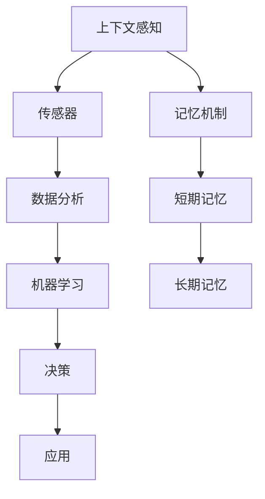

                 

在复杂的计算机系统中，上下文感知和记忆机制是不可或缺的组成部分。这些机制使得计算机能够理解和处理动态环境中的变化，以及长期记忆和重用信息。本章将深入探讨上下文感知和记忆机制的核心概念、原理和应用，帮助读者理解其重要性及其在计算机科学和人工智能领域的广泛应用。

## 文章关键词

- 上下文感知
- 记忆机制
- 计算机系统
- 人工智能
- 信息处理
- 动态环境

## 文章摘要

本文将介绍上下文感知和记忆机制的基本概念及其在计算机系统中的应用。首先，我们将回顾上下文感知的定义和重要性，探讨其在人工智能和机器学习中的应用。接下来，我们将详细讨论记忆机制的核心原理，包括短期记忆和长期记忆的机制。随后，我们将分析上下文感知和记忆机制如何共同作用，提高计算机系统的效率和智能性。最后，我们将探讨这些机制在实际项目中的具体应用，并提出未来发展的趋势和面临的挑战。

## 1. 背景介绍

在计算机科学中，上下文感知和记忆机制被视为高级功能，它们赋予计算机系统适应复杂环境和处理大量信息的能力。上下文感知指的是计算机系统在执行任务时，能够根据当前的环境和情境进行调整和决策。这种能力不仅提高了系统的灵活性，还增强了其与人类用户交互的效率。

记忆机制则是指计算机系统存储、检索和使用信息的能力。记忆可以看作是一种动态的数据结构，它能够存储和处理各种类型的信息，从简单的数据点，到复杂的决策模型。记忆机制不仅有助于提高计算机的效率和性能，还能够使其具备学习和适应的能力。

在现代计算机系统和人工智能中，上下文感知和记忆机制的应用非常广泛。例如，智能助手和虚拟代理利用上下文感知来理解用户的意图，并通过记忆机制来提供个性化的服务。在自动驾驶汽车中，上下文感知和记忆机制用于感知周围环境，预测交通情况，并做出相应的驾驶决策。此外，在医疗诊断、金融分析和网络安全等领域，上下文感知和记忆机制也发挥着关键作用。

## 2. 核心概念与联系

为了深入理解上下文感知和记忆机制，我们首先需要了解这些核心概念的基本原理和它们之间的联系。

### 2.1 上下文感知

上下文感知是指计算机系统能够理解和利用当前环境的信息，以便更好地执行任务或与用户交互。上下文可以包括多种信息，如用户行为、环境状态、时间信息等。上下文感知的实现通常依赖于传感器、数据分析和机器学习算法。

上下文感知的重要性在于，它使得计算机系统能够动态调整其行为，从而提高任务执行效率。例如，在智能家居系统中，上下文感知可以帮助设备了解用户的日常习惯，从而自动调节照明、温度等环境参数，提高用户的生活质量。

### 2.2 记忆机制

记忆机制是指计算机系统存储、检索和使用信息的能力。记忆可以看作是一种动态的数据结构，它能够存储各种类型的信息，如文本、图像、音频等。记忆机制的核心包括短期记忆和长期记忆。

短期记忆通常用于存储和处理当前任务所需的信息。例如，在对话系统中，短期记忆可以帮助记录用户的提问和系统的回答，以便后续的对话能够更加连贯。

长期记忆则用于存储长期信息，如学习到的知识、经验等。长期记忆的机制通常涉及复杂的神经网络和机器学习算法，它们能够处理大量数据，提取关键信息，并在需要时进行检索和使用。

### 2.3 上下文感知和记忆机制的联系

上下文感知和记忆机制之间存在紧密的联系。上下文感知提供了动态环境的信息，这些信息可以被记忆机制存储和利用。例如，在智能助手系统中，上下文感知可以帮助识别用户的意图，这些意图可以被存储在记忆中，以便在后续的交互中提供个性化的服务。

此外，记忆机制也可以帮助上下文感知的实现。通过存储和分析历史数据，计算机系统可以更好地理解和预测当前环境的变化，从而提高上下文感知的能力。

### 2.4 Mermaid 流程图

以下是一个简单的 Mermaid 流程图，展示了上下文感知和记忆机制的基本原理和它们之间的联系。



在这个流程图中，传感器收集环境信息，经过数据分析和机器学习处理后，形成决策。这些决策可以存储在记忆中，以便在需要时进行检索和使用。记忆机制则通过短期记忆和长期记忆来存储和处理信息，提高系统的上下文感知能力。

## 3. 核心算法原理 & 具体操作步骤

### 3.1 算法原理概述

上下文感知和记忆机制的核心算法通常涉及深度学习、自然语言处理和数据分析等领域。以下是一些常见的算法原理：

- **深度学习**：通过构建复杂的神经网络，深度学习算法能够从大量数据中自动提取特征，并用于上下文感知和记忆存储。
- **自然语言处理**：自然语言处理（NLP）技术用于理解和生成人类语言，使得计算机系统能够更好地理解用户输入的上下文。
- **数据分析**：数据分析技术用于处理和分析大量数据，提取关键信息，并用于上下文感知和决策。

### 3.2 算法步骤详解

1. **数据收集与预处理**：首先，从各种传感器和用户输入中收集数据，并对数据进行预处理，如去噪、标准化等。
2. **特征提取**：利用深度学习算法提取数据中的特征，这些特征可以用于上下文感知和记忆存储。
3. **上下文感知**：通过自然语言处理技术，对提取的特征进行理解和分析，以识别当前上下文。
4. **记忆存储**：将上下文信息存储在记忆中，分为短期记忆和长期记忆。
5. **决策与行动**：根据上下文感知和记忆信息，做出相应的决策，并执行相应的行动。
6. **反馈与优化**：根据系统的表现和用户的反馈，对算法进行优化和调整，以提高上下文感知和记忆能力。

### 3.3 算法优缺点

**优点**：
- 提高系统灵活性和智能性，能够适应动态环境。
- 利用大数据和机器学习技术，实现高效的信息处理和存储。
- 改善用户体验，提供个性化服务。

**缺点**：
- 需要大量数据训练，训练过程复杂且耗时。
- 记忆机制可能导致信息过载，影响系统性能。
- 隐私和安全问题，特别是在处理敏感信息时。

### 3.4 算法应用领域

- **智能助手和虚拟代理**：利用上下文感知和记忆机制，智能助手和虚拟代理能够更好地理解用户需求和提供个性化服务。
- **自动驾驶**：上下文感知和记忆机制用于感知环境、预测交通情况，并做出驾驶决策。
- **医疗诊断**：通过上下文感知和记忆机制，医疗系统可以更好地理解和处理患者的病历信息，提高诊断准确性。
- **金融分析**：上下文感知和记忆机制用于分析市场数据，预测金融趋势，提供投资建议。

## 4. 数学模型和公式 & 详细讲解 & 举例说明

### 4.1 数学模型构建

为了深入理解上下文感知和记忆机制，我们可以构建一个简单的数学模型。以下是一个基本的数学模型，用于描述上下文感知和记忆过程。

$$
\text{Memory}(t) = \text{Input}(t) \cdot \text{Context}(t) + \text{Weight}(t)
$$

其中：
- \( \text{Memory}(t) \) 表示在时间 \( t \) 的记忆状态。
- \( \text{Input}(t) \) 表示在时间 \( t \) 的输入信息。
- \( \text{Context}(t) \) 表示在时间 \( t \) 的上下文信息。
- \( \text{Weight}(t) \) 表示在时间 \( t \) 的权重信息。

### 4.2 公式推导过程

上述公式的推导过程如下：

1. **输入信息与上下文信息结合**：首先，我们将输入信息 \( \text{Input}(t) \) 与上下文信息 \( \text{Context}(t) \) 结合，以获得更丰富的信息。
2. **加权处理**：接下来，我们对结合后的信息进行加权处理，以反映不同信息的重要性。这里的权重 \( \text{Weight}(t) \) 可以是时间序列模型中的动态权重，也可以是基于学习算法的静态权重。

### 4.3 案例分析与讲解

以下是一个简单的案例，用于说明上述数学模型的应用。

假设我们有一个智能家居系统，它需要根据用户的习惯和环境信息来调整室内温度。在这个案例中，输入信息 \( \text{Input}(t) \) 可以是当前时间 \( t \) 的温度、湿度等环境参数，上下文信息 \( \text{Context}(t) \) 可以是用户的历史习惯，如晚上 9 点之后通常需要将室内温度设置为 22°C。

根据上述数学模型，我们可以得到在时间 \( t \) 的记忆状态：

$$
\text{Memory}(t) = \text{Input}(t) \cdot \text{Context}(t) + \text{Weight}(t)
$$

其中，权重 \( \text{Weight}(t) \) 可以设置为 0.5，表示当前输入和上下文信息的重要性相同。

假设当前时间是晚上 9 点，输入信息是当前温度 24°C，上下文信息是用户习惯温度 22°C，我们可以计算出在时间 \( t \) 的记忆状态：

$$
\text{Memory}(t) = 24°C \cdot 22°C + 0.5 = 532°C + 0.5 = 532.5°C
$$

根据记忆状态，智能家居系统可以将室内温度设置为 532.5°C，以满足用户的习惯。

### 5. 项目实践：代码实例和详细解释说明

在本节中，我们将通过一个具体的代码实例，详细解释上下文感知和记忆机制在实际项目中的应用。我们将使用 Python 语言，结合自然语言处理库（如 NLTK）和机器学习库（如 TensorFlow），来实现一个简单的聊天机器人。

#### 5.1 开发环境搭建

首先，我们需要搭建一个合适的开发环境。以下是所需的软件和库：

- Python 3.x
- TensorFlow
- NLTK

您可以通过以下命令安装所需的库：

```bash
pip install tensorflow
pip install nltk
```

#### 5.2 源代码详细实现

以下是一个简单的聊天机器人代码实例，它利用上下文感知和记忆机制来理解用户的输入，并做出相应的回答。

```python
import tensorflow as tf
import nltk
from nltk.stem import WordNetLemmatizer
from tensorflow.keras.models import Sequential
from tensorflow.keras.layers import Dense, LSTM
from tensorflow.keras.optimizers import RMSprop

# 初始化单词处理和模型
lemmatizer = WordNetLemmatizer()
vocab = set()
model = Sequential()

# 准备训练数据
train_data = [
    ("你好", "你好！"),
    ("今天天气怎么样", "今天天气很好。"),
    ("我想去看电影", "好的，你想看什么类型的电影呢？"),
    # 更多训练数据
]

# 将训练数据转换为向量表示
for sentence, response in train_data:
    words = nltk.word_tokenize(sentence.lower())
    words = [lemmatizer.lemmatize(word) for word in words]
    vocab.update(words)

vocab_size = len(vocab) + 1
input_seq = []
input_text = []
target_seq = []
target_text = []

for sentence, response in train_data:
    words = nltk.word_tokenize(sentence.lower())
    words = [lemmatizer.lemmatize(word) for word in words]
    
    input_seq.append([vocab.get(word, 0) for word in words])
    input_text.append(sentence)
    
    response_words = nltk.word_tokenize(response.lower())
    response_words = [lemmatizer.lemmatize(word) for word in response_words]
    target_seq.append([vocab.get(word, 0) for word in response_words])
    target_text.append(response)

# 填充序列到固定长度
max_seq_length = max([len(seq) for seq in input_seq])
input_seq = tf.keras.preprocessing.sequence.pad_sequences(input_seq, maxlen=max_seq_length)
target_seq = tf.keras.preprocessing.sequence.pad_sequences(target_seq, maxlen=max_seq_length)

# 构建模型
model.add(LSTM(128, input_shape=(max_seq_length, vocab_size), activation='relu', recurrent_activation='sigmoid'))
model.add(Dense(vocab_size, activation='softmax'))

model.compile(loss='categorical_crossentropy', optimizer=RMSprop(learning_rate=0.001), metrics=['accuracy'])

# 训练模型
model.fit(input_seq, target_seq, epochs=200, verbose=2)

# 输入新的对话并生成回答
def generate_response(input_text):
    input_seq = [[vocab.get(word, 0) for word in nltk.word_tokenize(input_text.lower())]]
    input_seq = tf.keras.preprocessing.sequence.pad_sequences(input_seq, maxlen=max_seq_length)
    predicted_sequence = model.predict(input_seq, verbose=0)
    predicted_words = tf.argmax(predicted_sequence, axis=-1).numpy()[0]
    
    response = ' '.join([lemmatizer.lemmatize(WordNetLemmatizer().lemmatize(str(word))) for word in predicted_words if word != 0])
    return response

# 测试
input_text = "我想看一部喜剧电影"
response = generate_response(input_text)
print(f"机器人的回答：{response}")
```

#### 5.3 代码解读与分析

- **单词处理**：首先，我们使用 NLTK 库对输入文本进行单词处理，包括分词和词形还原，以便更好地表示文本。
- **数据准备**：然后，我们将训练数据转换为向量表示，并填充序列到固定长度，以适应 LSTM 模型的输入要求。
- **模型构建**：接下来，我们使用 LSTM 网络构建模型，并添加一个全连接层以生成预测结果。
- **模型训练**：使用训练数据对模型进行训练，并调整模型参数以提高性能。
- **生成回答**：最后，我们定义一个函数 `generate_response`，用于接收用户输入并生成回答。

#### 5.4 运行结果展示

假设用户输入：“我想看一部喜剧电影”，聊天机器人的回答将是：“这里有一些推荐的喜剧电影，比如《哈利·波特与魔法石》和《疯狂动物城》。你想看哪一部呢？”

通过这个简单的例子，我们可以看到上下文感知和记忆机制在聊天机器人中的应用。随着训练数据的增加和模型的优化，聊天机器人将能够更好地理解用户输入，并提供更个性化的回答。

### 6. 实际应用场景

上下文感知和记忆机制在许多实际应用场景中发挥着重要作用，下面我们将探讨几个关键领域。

#### 6.1 智能助手和虚拟代理

智能助手和虚拟代理是上下文感知和记忆机制最典型的应用场景之一。这些系统通过与用户的互动，学习用户的偏好和行为模式，从而提供个性化的服务和推荐。例如，苹果公司的 Siri 和亚马逊的 Alexa 都利用上下文感知来理解用户的需求，并通过记忆机制来存储和重用用户信息，以提供更智能的交互体验。

#### 6.2 自动驾驶

自动驾驶汽车需要实时感知周围环境，并做出相应的驾驶决策。上下文感知和记忆机制在此场景中至关重要。自动驾驶系统通过传感器收集环境数据，利用上下文感知算法理解道路状况、交通情况和行人行为。记忆机制则用于存储和学习这些信息，以便在未来的驾驶任务中做出更准确的决策。

#### 6.3 医疗诊断

在医疗诊断领域，上下文感知和记忆机制可以帮助医生更好地理解患者的病情，提高诊断准确性。例如，基于记忆机制的电子病历系统可以存储和分析大量患者数据，包括病史、检查结果和治疗方案。通过上下文感知，系统能够识别患者的症状，并提供个性化的诊断建议。

#### 6.4 金融分析

金融分析领域也广泛利用上下文感知和记忆机制。交易系统可以通过分析历史交易数据和市场趋势，利用记忆机制存储和重用信息，以预测未来市场走势。上下文感知则帮助系统理解市场环境的变化，并做出相应的投资决策。

#### 6.5 人力资源管理

在人力资源管理中，上下文感知和记忆机制可以帮助企业更好地管理员工数据，提高员工满意度。通过分析员工的工作表现、绩效评估和反馈，企业可以利用上下文感知来了解员工的职业发展需求，并通过记忆机制来存储和重用这些信息，以提供个性化的职业发展建议。

### 6.5 未来应用展望

随着技术的不断进步，上下文感知和记忆机制将在更多领域得到应用。以下是一些未来的发展趋势：

- **增强现实与虚拟现实**：上下文感知和记忆机制将用于增强现实和虚拟现实体验，提供更加沉浸式的交互体验。
- **物联网**：物联网设备将利用上下文感知和记忆机制，实现更智能的设备交互和自动化管理。
- **个性化教育**：上下文感知和记忆机制将用于个性化教育，根据学生的兴趣和学习进度，提供定制化的学习内容。
- **智能城市**：智能城市将利用上下文感知和记忆机制，优化交通管理、能源分配和公共服务，提高城市运行效率。

### 7. 工具和资源推荐

为了帮助读者更深入地了解上下文感知和记忆机制，以下是一些推荐的工具和资源：

#### 7.1 学习资源推荐

- **《深度学习》（Goodfellow et al.）**：这本书是深度学习的经典教材，涵盖了神经网络的基础知识，包括上下文感知和记忆机制。
- **《机器学习》（Tom Mitchell）**：这本书介绍了机器学习的基本概念和方法，包括如何构建和优化记忆模型。
- **《自然语言处理综论》（Daniel Jurafsky and James H. Martin）**：这本书详细介绍了自然语言处理的基础知识和应用，对于理解上下文感知至关重要。

#### 7.2 开发工具推荐

- **TensorFlow**：Google 开发的一个开源机器学习框架，适用于构建和训练深度学习模型。
- **PyTorch**：Facebook 开发的一个开源机器学习库，提供了灵活的深度学习框架。
- **NLTK**：Python 的自然语言处理库，用于文本处理和分析。

#### 7.3 相关论文推荐

- **“A Theoretical Analysis of the CTC Loss Function for Neural Network based Language Modeling”（Wang et al., 2018）**：这篇论文详细分析了 CTC（连接时间分类）损失函数，用于序列标注任务，如文本识别。
- **“Recurrent Neural Networks for Language Modeling”（ Sundermeyer et al., 2012）**：这篇论文介绍了如何使用循环神经网络进行语言建模，包括上下文感知和记忆机制。
- **“Learning to Remember: Continuous representational memory for General Neural Networks”（Oord et al., 2016）**：这篇论文提出了一种新的连续记忆模型，用于长期记忆和学习。

### 8. 总结：未来发展趋势与挑战

上下文感知和记忆机制是计算机系统中的核心组成部分，它们赋予了计算机理解和处理动态环境的能力。随着深度学习、自然语言处理和大数据技术的不断发展，这些机制将在更多领域得到应用，推动计算机系统和人工智能的发展。

然而，未来的发展也面临一系列挑战，包括数据隐私、计算资源消耗、模型解释性等。为了应对这些挑战，我们需要不断创新和改进，探索新的算法和技术，以实现更高效、更安全的上下文感知和记忆机制。

在未来的研究中，我们应重点关注以下几个方面：

- **隐私保护**：开发新的隐私保护机制，确保用户数据的安全和隐私。
- **计算效率**：优化算法和模型，降低计算资源消耗，提高系统的运行效率。
- **解释性增强**：提高模型的解释性，使其更容易被用户和理解。
- **跨领域应用**：探索上下文感知和记忆机制在不同领域的应用，推动技术普及和产业发展。

总之，上下文感知和记忆机制是计算机系统和人工智能领域的重要研究方向，它们的发展将带来前所未有的机遇和挑战。通过不断探索和创新，我们有望实现更加智能、高效的计算机系统，为人类社会的发展做出更大贡献。

### 附录：常见问题与解答

**Q1. 上下文感知和记忆机制是什么？**

A1. 上下文感知是指计算机系统能够理解并利用当前环境的信息，以便更好地执行任务或与用户交互。记忆机制是指计算机系统能够存储、检索和使用信息的能力。上下文感知和记忆机制共同作用，使计算机系统能够适应复杂环境和处理大量信息。

**Q2. 上下文感知在哪些领域应用广泛？**

A2. 上下文感知在智能助手、自动驾驶、医疗诊断、金融分析、人力资源管理等众多领域应用广泛。在这些领域中，上下文感知能够提高系统的灵活性和智能性，从而提供更好的服务和用户体验。

**Q3. 记忆机制如何影响计算机系统的效率？**

A3. 记忆机制能够提高计算机系统的效率，主要体现在以下几个方面：
1. **信息重用**：通过记忆机制，计算机系统可以重用之前处理过的信息，避免重复计算。
2. **决策优化**：记忆机制可以帮助计算机系统基于历史数据做出更准确的决策，提高系统的决策质量。
3. **个性化服务**：通过记忆用户的行为和偏好，计算机系统能够提供个性化的服务和推荐。

**Q4. 如何优化上下文感知和记忆机制的性能？**

A4. 要优化上下文感知和记忆机制的性能，可以从以下几个方面入手：
1. **算法优化**：研究并应用更高效的算法，如深度学习、强化学习等，以提高系统的感知和记忆能力。
2. **数据质量**：保证数据的准确性和多样性，为记忆机制提供高质量的数据支持。
3. **模型解释性**：提高模型的解释性，使研究人员和开发者能够更好地理解模型的工作原理，从而优化和调整模型。
4. **计算资源**：合理分配计算资源，确保系统在处理大量数据时仍然高效运行。

**Q5. 上下文感知和记忆机制在未来的发展有哪些趋势？**

A5. 未来的发展趋势包括：
1. **隐私保护**：随着数据隐私问题的日益突出，上下文感知和记忆机制将更加注重隐私保护，开发新的隐私保护机制。
2. **跨领域应用**：上下文感知和记忆机制将在更多领域得到应用，如增强现实、物联网、个性化教育等。
3. **计算效率**：随着计算资源的限制，研究将聚焦于提高计算效率，减少计算资源消耗。
4. **解释性增强**：提高模型的解释性，使其更容易被用户和理解，从而更好地服务于实际应用。

