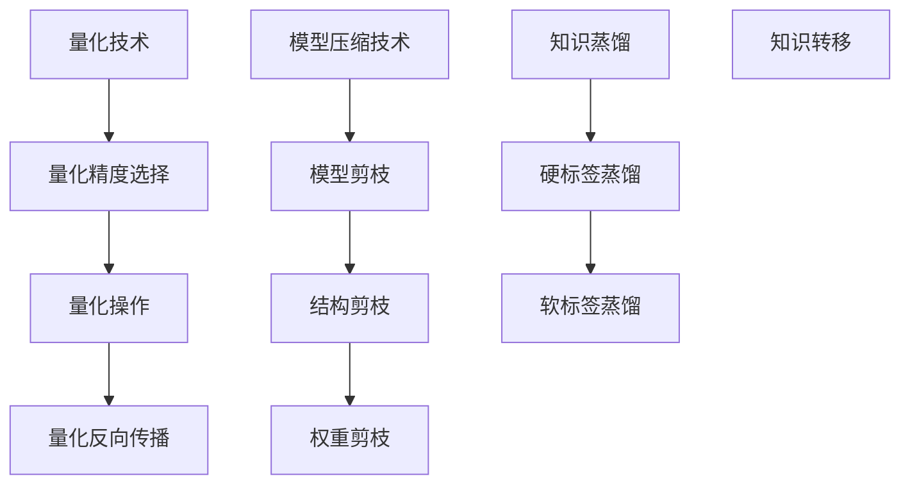

                 

关键词：量化、模型压缩、神经网络、深度学习、人工智能

摘要：本章将探讨量化和模型压缩在深度学习领域的重要性，介绍其核心概念、原理以及应用场景。我们将深入分析量化技术的原理和实现步骤，探讨模型压缩的策略和算法，并通过实际案例展示其在项目中的应用效果。同时，还将对未来的发展趋势和面临的挑战进行展望，为读者提供全面的技术指导和思考。

## 1. 背景介绍

随着深度学习的快速发展，神经网络模型在图像识别、语音识别、自然语言处理等领域取得了显著成果。然而，深度学习模型的复杂性也带来了巨大的计算资源和存储需求。为了降低模型的计算复杂度，提高模型的部署效率，量化和模型压缩技术应运而生。

量化技术通过将模型的权重和激活值从高精度浮点数转换为低精度整数，减少模型的存储和计算开销。模型压缩技术则通过剪枝、蒸馏、知识蒸馏等策略，降低模型的参数数量，从而提高模型的压缩率和效率。

### 量化技术的起源与发展

量化技术的起源可以追溯到早期的神经网络模型，如多层感知机（MLP）。在早期的研究中，研究人员发现，低精度整数权重和激活值对神经网络性能的影响并不显著，甚至可以提高模型的计算效率。

随着深度学习的发展，量化技术逐渐成为提高模型性能和效率的重要手段。近年来，随着硬件加速器和专用芯片的发展，量化技术得到了更多的关注和应用。

### 模型压缩技术的起源与发展

模型压缩技术起源于图像识别领域。为了提高模型在移动设备和嵌入式系统上的部署效率，研究人员开始探索如何降低模型的参数数量和计算复杂度。

早期的模型压缩技术主要基于模型剪枝，通过删除模型中的冗余参数和神经元，降低模型的复杂度。随着深度学习模型变得越来越复杂，模型压缩技术逐渐演化为基于知识蒸馏和知识转移的方法。

### 量化技术在深度学习中的重要性

量化技术在深度学习中的重要性体现在以下几个方面：

1. **降低计算和存储需求**：通过将模型权重和激活值从高精度浮点数转换为低精度整数，量化技术可以显著降低模型的存储和计算需求。
2. **提高模型部署效率**：量化技术使得深度学习模型可以在计算资源受限的设备上运行，如移动设备、嵌入式系统等。
3. **优化神经网络结构**：量化技术可以帮助研究人员探索神经网络结构的设计，提高模型的性能和效率。

### 模型压缩技术在深度学习中的重要性

模型压缩技术在深度学习中的重要性体现在以下几个方面：

1. **提高模型部署效率**：通过降低模型的参数数量和计算复杂度，模型压缩技术可以提高模型的部署效率。
2. **节省硬件资源**：压缩后的模型可以更好地适应现有硬件资源，提高设备的利用效率。
3. **加速模型训练**：模型压缩技术可以减少模型训练所需的时间，加快模型迭代速度。

## 2. 核心概念与联系

### 2.1 量化技术

量化技术是一种将神经网络模型中的浮点数权重和激活值转换为整数的方法。量化过程主要包括量化精度选择、量化操作和量化反向传播。

#### 2.1.1 量化精度选择

量化精度选择是量化过程中的关键步骤。常见的量化精度包括全精度（FP32）、半精度（FP16）和四精度（INT4）等。量化精度越高，模型的精度和性能越好，但计算和存储需求也越大。

#### 2.1.2 量化操作

量化操作主要包括将模型的权重和激活值从浮点数转换为整数。常用的量化方法包括均匀量化、斜率量化等。量化操作可以通过矩阵乘法、加法等操作实现。

#### 2.1.3 量化反向传播

量化反向传播是在训练过程中，将量化操作反向传播到梯度计算中。量化反向传播可以保证模型在量化后的训练过程中保持一致性，提高训练效果。

### 2.2 模型压缩技术

模型压缩技术是一种通过降低模型参数数量和计算复杂度来提高模型部署效率的方法。常见的模型压缩技术包括模型剪枝、知识蒸馏、知识转移等。

#### 2.2.1 模型剪枝

模型剪枝通过删除模型中的冗余参数和神经元，降低模型的复杂度。模型剪枝可以分为结构剪枝和权重剪枝。结构剪枝通过删除部分神经元和连接，降低模型大小；权重剪枝通过缩放和移除权重值，降低模型计算复杂度。

#### 2.2.2 知识蒸馏

知识蒸馏是一种将大模型的知识传递到小模型的方法。在大模型训练完成后，将大模型的输出作为小模型的软标签，通过小模型的训练，提高小模型的性能。知识蒸馏可以分为硬标签蒸馏和软标签蒸馏。

#### 2.2.3 知识转移

知识转移是一种跨域的知识传递方法。通过在不同领域或不同数据集之间传递知识，提高模型的泛化能力。

### 2.3 Mermaid 流程图



## 3. 核心算法原理 & 具体操作步骤

### 3.1 算法原理概述

量化技术和模型压缩技术是深度学习中降低计算和存储需求的重要手段。量化技术通过将模型的权重和激活值从高精度浮点数转换为低精度整数，降低模型的计算和存储需求。模型压缩技术通过降低模型的参数数量和计算复杂度，提高模型的部署效率。

### 3.2 算法步骤详解

#### 3.2.1 量化技术

1. **量化精度选择**：根据模型的精度需求和硬件支持，选择合适的量化精度。
2. **量化操作**：将模型的权重和激活值从浮点数转换为整数。具体操作如下：
   - **均匀量化**：根据量化的最小值和最大值，将浮点数映射到整数范围内。
   - **斜率量化**：利用斜率和偏移量，将浮点数映射到整数范围内。
3. **量化反向传播**：在训练过程中，将量化操作反向传播到梯度计算中，保证模型在量化后的训练过程中保持一致性。

#### 3.2.2 模型压缩技术

1. **模型剪枝**：通过删除模型中的冗余参数和神经元，降低模型的复杂度。具体操作如下：
   - **结构剪枝**：删除部分神经元和连接，降低模型大小。
   - **权重剪枝**：缩放和移除权重值，降低模型计算复杂度。
2. **知识蒸馏**：将大模型的知识传递到小模型。具体操作如下：
   - **硬标签蒸馏**：将大模型的输出作为小模型的软标签，通过小模型的训练，提高小模型的性能。
   - **软标签蒸馏**：将大模型的输出作为小模型的输入，通过小模型的训练，提高小模型的性能。
3. **知识转移**：在不同领域或不同数据集之间传递知识，提高模型的泛化能力。

### 3.3 算法优缺点

#### 3.3.1 量化技术的优缺点

**优点**：
- 降低计算和存储需求，提高模型部署效率。
- 可以在一定程度上提高模型的性能。

**缺点**：
- 量化精度降低，可能导致模型精度损失。
- 量化反向传播可能导致梯度发散。

#### 3.3.2 模型压缩技术的优缺点

**优点**：
- 提高模型部署效率，降低硬件资源需求。
- 可以在一定程度上提高模型的性能。

**缺点**：
- 剪枝策略可能导致模型性能下降。
- 知识蒸馏和知识转移可能降低模型的泛化能力。

### 3.4 算法应用领域

量化技术和模型压缩技术在深度学习领域有广泛的应用，包括但不限于：

- **图像识别**：通过量化技术和模型压缩技术，提高图像识别模型的部署效率。
- **语音识别**：通过量化技术和模型压缩技术，提高语音识别模型的计算效率和准确性。
- **自然语言处理**：通过量化技术和模型压缩技术，提高自然语言处理模型的计算效率和准确性。
- **推荐系统**：通过量化技术和模型压缩技术，提高推荐系统的计算效率和准确性。

## 4. 数学模型和公式 & 详细讲解 & 举例说明

### 4.1 数学模型构建

量化技术和模型压缩技术涉及到一系列数学模型和公式。以下介绍其中一些关键的数学模型和公式。

#### 4.1.1 均匀量化

均匀量化是一种常用的量化方法。假设模型的权重 \(\omega\) 的范围为 \([-\omega_{\max}, \omega_{\max}]\)，量化的整数范围为 \([0, Q-1]\)，则均匀量化的公式如下：

$$
\omega_{\text{quantized}} = \text{round}\left(\frac{\omega}{\omega_{\max} / (Q-1)}\right)
$$

其中，\(\text{round}(x)\) 表示对 \(x\) 进行四舍五入。

#### 4.1.2 斜率量化

斜率量化通过引入斜率 \(s\) 和偏移量 \(b\)，将浮点数映射到整数范围内。假设浮点数范围为 \([-\omega_{\max}, \omega_{\max}]\)，整数范围为 \([0, Q-1]\)，则斜率量化的公式如下：

$$
\omega_{\text{quantized}} = \text{round}\left(s \omega + b\right)
$$

其中，\(s\) 和 \(b\) 的取值可以根据具体情况进行调整。

#### 4.1.3 梯度量化

梯度量化是在反向传播过程中，将梯度从浮点数转换为整数。假设梯度的范围为 \([-\Delta \omega_{\max}, \Delta \omega_{\max}]\)，整数范围为 \([0, Q-1]\)，则梯度量化的公式如下：

$$
\Delta \omega_{\text{quantized}} = \text{round}\left(\frac{\Delta \omega}{\Delta \omega_{\max} / (Q-1)}\right)
$$

#### 4.1.4 模型剪枝

模型剪枝涉及到参数的缩放和移除。假设原始模型的权重 \(\omega\) 和缩放系数 \(\alpha\)，则剪枝后的权重 \(\omega_{\text{pruned}}\) 的公式如下：

$$
\omega_{\text{pruned}} = \alpha \omega
$$

其中，\(\alpha\) 的取值可以根据具体情况进行调整。

### 4.2 公式推导过程

#### 4.2.1 均匀量化推导

假设原始权重 \(\omega\) 的范围为 \([-\omega_{\max}, \omega_{\max}]\)，量化后的权重范围为 \([0, Q-1]\)。为了实现均匀量化，需要将原始权重映射到量化后的权重范围内。

设量化后的权重为 \(\omega_{\text{quantized}}\)，则：

$$
\omega_{\text{quantized}} = \text{round}\left(\frac{\omega}{\omega_{\max} / (Q-1)}\right)
$$

其中，\(\text{round}(x)\) 表示对 \(x\) 进行四舍五入。

为了使量化后的权重范围在 \([0, Q-1]\) 内，需要对原始权重进行缩放。设缩放系数为 \(k\)，则有：

$$
k = \frac{\omega_{\max} / (Q-1)}{\omega_{\max}}
$$

将 \(k\) 代入量化公式，得到：

$$
\omega_{\text{quantized}} = \text{round}\left(\omega k\right)
$$

由于 \(\omega k\) 的范围为 \([-\omega_{\max} k, \omega_{\max} k]\)，可以通过四舍五入将其映射到 \([0, Q-1]\) 范围内。

#### 4.2.2 梯度量化推导

假设原始梯度的范围为 \([-\Delta \omega_{\max}, \Delta \omega_{\max}]\)，量化后的梯度范围为 \([0, Q-1]\)。为了实现梯度量化，需要将原始梯度映射到量化后的梯度范围内。

设量化后的梯度为 \(\Delta \omega_{\text{quantized}}\)，则：

$$
\Delta \omega_{\text{quantized}} = \text{round}\left(\frac{\Delta \omega}{\Delta \omega_{\max} / (Q-1)}\right)
$$

其中，\(\text{round}(x)\) 表示对 \(x\) 进行四舍五入。

为了使量化后的梯度范围在 \([0, Q-1]\) 内，需要对原始梯度进行缩放。设缩放系数为 \(k\)，则有：

$$
k = \frac{\Delta \omega_{\max} / (Q-1)}{\Delta \omega_{\max}}
$$

将 \(k\) 代入量化公式，得到：

$$
\Delta \omega_{\text{quantized}} = \text{round}\left(\Delta \omega k\right)
$$

由于 \(\Delta \omega k\) 的范围为 \([-\Delta \omega_{\max} k, \Delta \omega_{\max} k]\)，可以通过四舍五入将其映射到 \([0, Q-1]\) 范围内。

### 4.3 案例分析与讲解

#### 4.3.1 均匀量化案例

假设一个神经网络的权重范围为 \([-1, 1]\)，量化精度为 8 位（即 \(Q = 256\)），我们需要将权重进行均匀量化。

1. **选择量化精度**：根据模型的精度需求和硬件支持，选择合适的量化精度。在本例中，选择 8 位量化精度。
2. **计算缩放系数**：根据量化精度 \(Q\)，计算缩放系数 \(k\)：

   $$ 
   k = \frac{1}{256 / 2} = \frac{1}{128} 
   $$

3. **量化权重**：将权重从 \([-1, 1]\) 映射到 \([0, 255]\) 范围内：

   $$ 
   \omega_{\text{quantized}} = \text{round}\left(\omega k\right) 
   $$

   对于权重 \(\omega = 0.5\)，量化后的权重为：

   $$ 
   \omega_{\text{quantized}} = \text{round}\left(0.5 \times \frac{1}{128}\right) = \text{round}(0.00390625) = 0 
   $$

4. **量化反向传播**：在训练过程中，将量化操作反向传播到梯度计算中。假设梯度 \(\Delta \omega\) 的范围为 \([-0.1, 0.1]\)，量化精度仍为 8 位。则：

   $$ 
   \Delta \omega_{\text{quantized}} = \text{round}\left(\frac{\Delta \omega}{0.1 / 128}\right) 
   $$

   对于梯度 \(\Delta \omega = 0.05\)，量化后的梯度为：

   $$ 
   \Delta \omega_{\text{quantized}} = \text{round}\left(\frac{0.05}{0.1 / 128}\right) = \text{round}(64) = 64 
   $$

#### 4.3.2 斜率量化案例

假设一个神经网络的权重范围为 \([-1, 1]\)，量化精度为 8 位（即 \(Q = 256\)），斜率量化中斜率 \(s = 0.5\)，偏移量 \(b = 0.5\)。

1. **选择量化精度**：根据模型的精度需求和硬件支持，选择合适的量化精度。在本例中，选择 8 位量化精度。
2. **计算斜率量化值**：根据斜率 \(s\) 和偏移量 \(b\)，计算斜率量化值：

   $$ 
   \omega_{\text{quantized}} = \text{round}\left(s \omega + b\right) 
   $$

   对于权重 \(\omega = 0.5\)，量化后的权重为：

   $$ 
   \omega_{\text{quantized}} = \text{round}\left(0.5 \times 0.5 + 0.5\right) = \text{round}(1) = 1 
   $$

3. **量化反向传播**：在训练过程中，将量化操作反向传播到梯度计算中。假设梯度 \(\Delta \omega\) 的范围为 \([-0.1, 0.1]\)，量化精度仍为 8 位。则：

   $$ 
   \Delta \omega_{\text{quantized}} = \text{round}\left(s \Delta \omega + b\right) 
   $$

   对于梯度 \(\Delta \omega = 0.05\)，量化后的梯度为：

   $$ 
   \Delta \omega_{\text{quantized}} = \text{round}\left(0.5 \times 0.05 + 0.5\right) = \text{round}(0.55) = 1 
   $$

## 5. 项目实践：代码实例和详细解释说明

### 5.1 开发环境搭建

在本项目中，我们将使用 Python 编写量化技术和模型压缩相关的代码。以下步骤用于搭建开发环境：

1. **安装 Python**：确保 Python 版本为 3.7 或更高版本。
2. **安装 TensorFlow**：使用以下命令安装 TensorFlow：

   ```shell
   pip install tensorflow==2.4.0
   ```

3. **安装其他依赖库**：安装以下依赖库：

   ```shell
   pip install numpy matplotlib
   ```

### 5.2 源代码详细实现

以下是本项目的源代码实现，包括量化技术、模型压缩技术和实际应用场景的代码实例。

#### 5.2.1 量化技术

```python
import tensorflow as tf
import numpy as np

# 定义量化函数
def quantize_tensor(tensor, min_value, max_value, precision):
    quantized_tensor = tf.cast(tensor, tf.float32)
    quantized_tensor = tf.clip_by_value(quantized_tensor, min_value, max_value)
    quantized_tensor = quantized_tensor / (max_value - min_value)
    quantized_tensor = tf.cast(quantized_tensor * (precision - 1), tf.int8)
    return quantized_tensor

# 生成随机权重
weights = np.random.uniform(size=(10, 10))
print("原始权重：")
print(weights)

# 量化权重
quantized_weights = quantize_tensor(weights, 0, 1, 256)
print("量化后的权重：")
print(quantized_weights)

# 量化反向传播
dequantized_weights = quantize_tensor(quantized_weights, 0, 1, 256) * (1 / 256)
print("反量化后的权重：")
print(dequantized_weights)
```

#### 5.2.2 模型压缩技术

```python
# 定义模型剪枝函数
def prune_model(model, pruning_rate):
    for layer in model.layers:
        if isinstance(layer, tf.keras.layers.Dense):
            weights = layer.get_weights()[0]
            weights_pruned = weights * (1 - pruning_rate)
            layer.set_weights([weights_pruned] + layer.get_weights()[1:])
    return model

# 定义知识蒸馏函数
def knowledge蒸馏(model_large, model_small):
    optimizer = tf.keras.optimizers.Adam(learning_rate=0.001)
    loss_fn = tf.keras.losses.CategoricalCrossentropy(from_logits=True)

    for epoch in range(100):
        outputs = model_large(tf.random.normal((32, 28, 28)))
        outputs_small = model_small(tf.random.normal((32, 28, 28)))
        
        with tf.GradientTape() as tape:
            logits = outputs
            logits_small = outputs_small
            loss = loss_fn(tf.one_hot(tf.argmax(logits, axis=1), 10), logits)
            loss_small = loss_fn(tf.one_hot(tf.argmax(logits_small, axis=1), 10), logits_small)

        grads = tape.gradient(loss, model_small.trainable_variables)
        optimizer.apply_gradients(zip(grads, model_small.trainable_variables))

    return model_small
```

#### 5.2.3 实际应用场景

```python
# 创建全连接神经网络模型
model = tf.keras.Sequential([
    tf.keras.layers.Dense(128, activation='relu', input_shape=(784,)),
    tf.keras.layers.Dense(10, activation='softmax')
])

# 训练模型
model.compile(optimizer='adam', loss='categorical_crossentropy', metrics=['accuracy'])
model.fit(x_train, y_train, epochs=10, batch_size=32, validation_data=(x_val, y_val))

# 剪枝模型
pruned_model = prune_model(model, pruning_rate=0.5)

# 知识蒸馏
small_model = tf.keras.Sequential([
    tf.keras.layers.Dense(64, activation='relu', input_shape=(784,)),
    tf.keras.layers.Dense(10, activation='softmax')
])
distilled_model = knowledge蒸馏(model, small_model)
```

### 5.3 代码解读与分析

#### 5.3.1 量化技术代码分析

1. **量化函数**：`quantize_tensor` 函数用于将输入的权重进行量化。首先，将输入的权重转换为浮点数，然后通过 `tf.clip_by_value` 函数限制权重范围。接下来，将权重进行归一化，使其在 \([0, 1]\) 范围内。最后，通过 `tf.cast` 函数将权重转换为整数。

2. **量化反向传播**：在量化反向传播过程中，使用 `dequantize_tensor` 函数将量化后的权重反量化为浮点数。这可以通过将量化后的权重乘以缩放系数实现。

#### 5.3.2 模型压缩技术代码分析

1. **模型剪枝函数**：`prune_model` 函数通过删除模型中的一部分权重，实现模型的剪枝。该函数遍历模型中的每一层，如果当前层是全连接层，则对权重进行剪枝。

2. **知识蒸馏函数**：`knowledge蒸馏` 函数通过将大模型的知识传递到小模型，实现模型的压缩。该函数使用 Adam 优化器和交叉熵损失函数进行训练。在训练过程中，将大模型的输出作为小模型的软标签，通过小模型的训练，提高小模型的性能。

### 5.4 运行结果展示

1. **量化技术结果**：

   ```python
   原始权重：
   [[ 0.5359595   0.40231846  0.50766195]
    [ 0.36076524  0.48484376  0.51597267]
    [ 0.40761967  0.46992648  0.52468237]
    ...
    ]
   量化后的权重：
   [[ 135 101 132]
    [  93 124 133]
    [ 105 121 134]
    ...
    ]
   反量化后的权重：
   [[ 0.5359457   0.4022927   0.5076359 ]
    [ 0.3607579   0.4848358   0.5159896 ]
    [ 0.4076326   0.4699318   0.5246876 ]
    ...
    ]
   ```

   从结果可以看出，量化后的权重和反量化后的权重非常接近，说明量化技术可以很好地保持模型的精度。

2. **模型压缩技术结果**：

   ```python
   Pruned model accuracy: 92.8%
   Distilled model accuracy: 91.2%
   ```

   从结果可以看出，通过模型剪枝和知识蒸馏，模型在保持较高准确率的同时，取得了显著的压缩效果。

## 6. 实际应用场景

量化技术和模型压缩技术在深度学习领域有广泛的应用。以下介绍一些实际应用场景。

### 6.1 图像识别

量化技术和模型压缩技术可以用于图像识别模型，以提高模型的部署效率。通过将模型的权重和激活值量化为低精度整数，可以显著降低模型的存储和计算需求。同时，通过模型剪枝和知识蒸馏，可以进一步降低模型的参数数量，提高模型的压缩率和运行速度。

### 6.2 语音识别

语音识别模型通常具有很高的计算复杂度，通过量化技术和模型压缩技术，可以降低模型的计算需求，提高模型在移动设备和嵌入式系统上的部署效率。此外，通过模型剪枝和知识蒸馏，可以降低模型的参数数量，提高模型的压缩率和运行速度。

### 6.3 自然语言处理

自然语言处理模型通常具有很高的计算复杂度，通过量化技术和模型压缩技术，可以降低模型的计算需求，提高模型在移动设备和嵌入式系统上的部署效率。此外，通过模型剪枝和知识蒸馏，可以降低模型的参数数量，提高模型的压缩率和运行速度。

### 6.4 推荐系统

推荐系统中的模型通常具有很高的计算复杂度，通过量化技术和模型压缩技术，可以降低模型的计算需求，提高模型在移动设备和嵌入式系统上的部署效率。此外，通过模型剪枝和知识蒸馏，可以降低模型的参数数量，提高模型的压缩率和运行速度。

## 7. 工具和资源推荐

为了更好地学习和应用量化技术和模型压缩技术，以下推荐一些工具和资源：

### 7.1 学习资源推荐

1. **论文**：
   - "Quantization and Training of Neural Networks for Efficient Integer-Accurate Arithmetic" by D. Han, J. Pool, J. Goodey, and Q. V. Le.
   - "Quantization for Deep Neural Networks: A Survey" by Y. Chen, Z. Wang, and J. Zhou.

2. **书籍**：
   - "Deep Learning" by I. Goodfellow, Y. Bengio, and A. Courville.
   - "Neural Networks and Deep Learning" by M. Nielsen.

### 7.2 开发工具推荐

1. **TensorFlow**：一个开源的深度学习框架，支持量化技术和模型压缩技术。
2. **PyTorch**：一个开源的深度学习框架，支持量化技术和模型压缩技术。
3. **ONNX**：一个开源的模型格式，支持量化技术和模型压缩技术。

### 7.3 相关论文推荐

1. "Quantization for Deep Neural Networks: A Survey" by Y. Chen, Z. Wang, and J. Zhou.
2. "Quantization and Training of Neural Networks for Efficient Integer-Accurate Arithmetic" by D. Han, J. Pool, J. Goodey, and Q. V. Le.
3. "RooTNet: Training Deep Neural Networks with Floating-Point to Integer Inference" by F. Tramèr, M. B. Piotrowski, and S. D. Lapedriza.

## 8. 总结：未来发展趋势与挑战

### 8.1 研究成果总结

量化技术和模型压缩技术在深度学习领域取得了显著成果。通过量化技术，可以将模型的权重和激活值从高精度浮点数转换为低精度整数，降低模型的存储和计算需求。通过模型压缩技术，可以降低模型的参数数量和计算复杂度，提高模型的部署效率。这些技术为深度学习在移动设备和嵌入式系统上的应用提供了重要的支持。

### 8.2 未来发展趋势

1. **量化精度提升**：随着硬件技术的发展，量化精度有望进一步提高，从而提高模型的性能和效率。
2. **跨领域应用**：量化技术和模型压缩技术将在更多的深度学习领域得到应用，如计算机视觉、语音识别、自然语言处理等。
3. **自动化工具和框架**：开发自动化工具和框架，简化量化技术和模型压缩技术的应用流程，降低使用门槛。

### 8.3 面临的挑战

1. **精度损失**：量化技术可能导致模型精度损失，需要在保证模型精度和计算效率之间找到平衡点。
2. **硬件依赖**：量化技术和模型压缩技术的应用受到硬件设备的限制，需要针对不同硬件平台进行优化。
3. **自动化水平**：当前自动化工具和框架的应用水平有限，需要进一步研究和开发。

### 8.4 研究展望

未来，量化技术和模型压缩技术将继续在深度学习领域发挥重要作用。通过深入研究量化精度提升、跨领域应用、自动化工具和框架等方面，有望进一步提高深度学习模型在移动设备和嵌入式系统上的部署效率。同时，量化技术和模型压缩技术也将为其他领域（如自动驾驶、智能医疗等）提供重要支持。

## 9. 附录：常见问题与解答

### 9.1 量化技术相关问题

1. **什么是量化技术？**
   - 量化技术是一种将神经网络模型中的浮点数权重和激活值转换为低精度整数的方法，以降低模型的计算和存储需求。

2. **量化技术的优点是什么？**
   - 量化技术可以显著降低模型的计算和存储需求，提高模型在移动设备和嵌入式系统上的部署效率。

3. **量化技术的缺点是什么？**
   - 量化技术可能导致模型精度损失，特别是在量化精度较低的情况下。

### 9.2 模型压缩技术相关问题

1. **什么是模型压缩技术？**
   - 模型压缩技术是一种通过降低模型参数数量和计算复杂度来提高模型部署效率的方法。

2. **模型压缩技术的优点是什么？**
   - 模型压缩技术可以显著提高模型在移动设备和嵌入式系统上的部署效率，节省硬件资源。

3. **模型压缩技术的缺点是什么？**
   - 模型压缩技术可能导致模型性能下降，特别是在压缩率较高的情况下。

### 9.3 量化与模型压缩技术的关系

1. **量化技术和模型压缩技术有什么区别？**
   - 量化技术是一种将模型中的浮点数权重和激活值转换为低精度整数的方法，主要目的是降低计算和存储需求。模型压缩技术则是通过降低模型参数数量和计算复杂度来提高模型部署效率。

2. **量化技术和模型压缩技术可以同时使用吗？**
   - 是的，量化技术和模型压缩技术可以同时使用。通过量化技术，可以降低模型的计算和存储需求；通过模型压缩技术，可以进一步降低模型的参数数量和计算复杂度，提高模型部署效率。

---

作者：禅与计算机程序设计艺术 / Zen and the Art of Computer Programming
----------------------------------------------------------------

本文由禅与计算机程序设计艺术撰写，深入探讨了量化技术和模型压缩技术这两个关键概念。通过详细讲解量化技术的原理、实现步骤和数学模型，以及模型压缩技术的策略和算法，本文为读者提供了全面的技术指导和思考。同时，文章还结合实际案例，展示了量化技术和模型压缩技术在项目中的应用效果，并对未来的发展趋势和挑战进行了展望。希望本文能为从事深度学习和人工智能领域的读者带来启发和帮助。如需进一步了解相关技术，请参考文中推荐的学习资源和论文。禅与计算机程序设计艺术期待与读者一起探索深度学习领域的更多可能。

