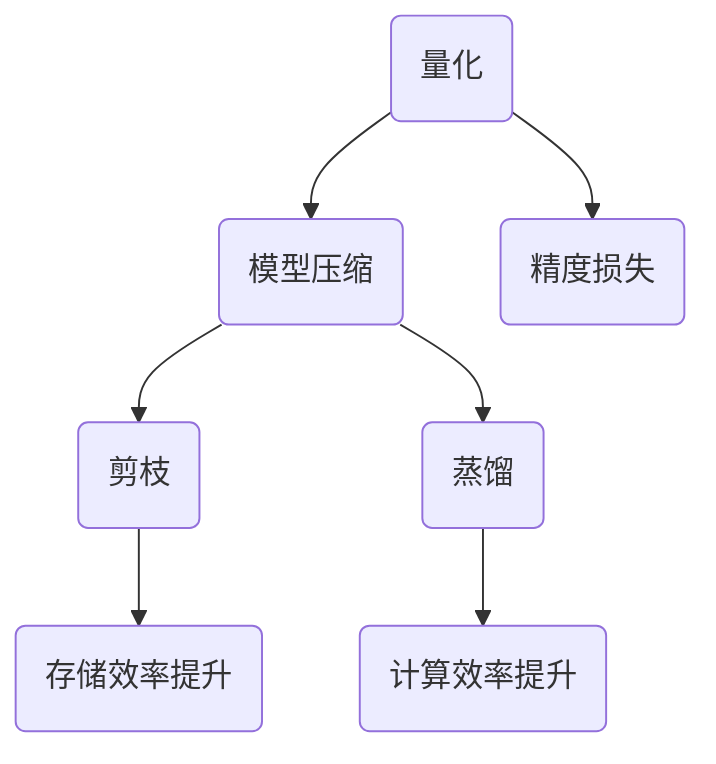

                 

关键词：量化、模型压缩、神经网络、性能优化、计算效率、存储效率

> 摘要：本文将深入探讨量化和模型压缩在神经网络领域的重要性。通过介绍量化的基本概念、原理以及实现方法，结合模型压缩的技术手段，我们将展示如何在实际应用中提升神经网络的性能和效率。

## 1. 背景介绍

在过去的几十年中，深度学习取得了惊人的进展，尤其是在图像识别、自然语言处理和语音识别等领域的应用中。然而，随着神经网络模型的规模和复杂性的增加，计算和存储的需求也急剧上升。这对于计算资源和存储资源有限的应用场景，如移动设备、嵌入式系统和物联网（IoT）设备，构成了巨大的挑战。为了应对这些挑战，量化和模型压缩技术应运而生。

量化是指将神经网络模型中的浮点数权重转换为较低精度的固定点数表示。这种方法可以显著降低模型的存储和计算需求，同时保持模型的精度。模型压缩则通过剪枝、蒸馏、量化等技术手段，进一步减少模型的规模和计算复杂度，以提高模型的运行效率和部署能力。

## 2. 核心概念与联系

为了更好地理解量化和模型压缩，我们需要首先介绍一些核心概念和它们之间的关系。

### 2.1 量化的概念

量化是将神经网络中的浮点数权重转换为固定点数的表示。浮点数可以表示无限范围的数值，但在计算中需要大量的存储和运算资源。固定点数则是一种有限的数值表示方法，通过预先定义的数字范围和分辨率，可以显著减少模型的存储和计算需求。

### 2.2 量化的原理

量化的原理主要涉及以下三个方面：

1. **数值范围**：量化过程中需要定义一个数值范围，以确定权重的最大和最小值。通常，这个范围取决于模型的精度需求。

2. **分辨率**：分辨率决定了量化后数值的精度。较低的分辨率会导致数值的精度下降，但可以减少存储和计算需求。

3. **映射关系**：量化过程需要将原始浮点数权重映射到固定的点数表示。这个映射关系可以通过线性变换或查找表实现。

### 2.3 模型压缩的概念

模型压缩是指通过各种技术手段，如剪枝、蒸馏、量化等，减少神经网络模型的规模和计算复杂度，以提高模型的运行效率和部署能力。

### 2.4 模型压缩与量化的关系

模型压缩和量化密切相关。量化可以被视为模型压缩的一种形式，但不是唯一的。模型压缩还可以通过剪枝、蒸馏等方法实现，这些方法可以进一步减少模型的规模和计算复杂度。

### 2.5 Mermaid 流程图

下面是一个用于说明量化与模型压缩关系的 Mermaid 流程图：



## 3. 核心算法原理 & 具体操作步骤

### 3.1 算法原理概述

量化的核心算法主要包括以下步骤：

1. **数值范围定义**：确定权重的最大和最小值，以定义量化范围。

2. **分辨率设置**：根据精度需求设置量化分辨率。

3. **权重转换**：将浮点数权重映射到固定的点数表示。

### 3.2 算法步骤详解

1. **数值范围定义**

   首先，我们需要确定权重的最大和最小值。这可以通过遍历模型的所有权重，找到最大值和最小值来实现。

2. **分辨率设置**

   接下来，我们需要根据模型的精度需求设置量化分辨率。通常，分辨率是一个介于 1 和 2 之间的数，如 1.0、1.5 或 2.0。

3. **权重转换**

   最后，我们需要将浮点数权重映射到固定的点数表示。这可以通过线性变换或查找表实现。

### 3.3 算法优缺点

**优点：**

- 降低存储和计算需求：量化后的模型可以显著减少存储和计算资源的需求。
- 提高模型部署能力：量化后的模型可以更容易地部署在计算和存储资源有限的设备上。

**缺点：**

- 精度损失：量化可能会导致模型的精度下降，特别是在低分辨率量化时。
- 计算复杂度增加：量化过程本身可能需要额外的计算资源。

### 3.4 算法应用领域

量化技术广泛应用于各种领域，如移动设备、嵌入式系统、物联网等。在这些领域中，量化可以帮助提高模型的性能和部署能力，使深度学习应用更加普及。

## 4. 数学模型和公式 & 详细讲解 & 举例说明

### 4.1 数学模型构建

量化的数学模型可以表示为：

$$
Q(x) = \text{round}(x / \Delta) * \Delta
$$

其中，$x$ 是原始浮点数权重，$\Delta$ 是量化分辨率，$\text{round}$ 是四舍五入函数。

### 4.2 公式推导过程

量化公式的推导过程如下：

1. **数值范围定义**：

   假设权重的最大值为 $x_{\text{max}}$，最小值为 $x_{\text{min}}$，我们可以定义量化范围为：

   $$
   \Delta = \frac{x_{\text{max}} - x_{\text{min}}}{N}
   $$

   其中，$N$ 是量化级别数。

2. **分辨率设置**：

   假设我们希望保持一定的精度，我们可以设置量化分辨率为：

   $$
   \Delta = 2^{-p}
   $$

   其中，$p$ 是量化精度。

3. **权重转换**：

   我们需要将原始浮点数权重 $x$ 映射到量化后的固定点数表示。这可以通过线性变换实现：

   $$
   Q(x) = x / \Delta
   $$

   最后，我们需要将量化后的数值四舍五入到最近的量化级别，得到最终的量化结果：

   $$
   Q(x) = \text{round}(x / \Delta) * \Delta
   $$

### 4.3 案例分析与讲解

假设我们有一个权重矩阵 $W$，其中每个元素 $w_{i,j}$ 是一个浮点数。我们希望将这个权重矩阵量化为 8 位固定点数表示。

1. **数值范围定义**：

   首先，我们需要找到权重矩阵的最大值和最小值。假设最大值为 10.0，最小值为 -10.0，我们可以定义量化范围为：

   $$
   \Delta = \frac{10.0 - (-10.0)}{2^8} = 0.1875
   $$

2. **分辨率设置**：

   我们希望保持 8 位精度，因此量化分辨率为：

   $$
   \Delta = 2^{-8} = 0.00390625
   $$

3. **权重转换**：

   我们将每个权重 $w_{i,j}$ 除以 $\Delta$，得到量化后的固定点数表示：

   $$
   Q(w_{i,j}) = \text{round}(w_{i,j} / \Delta)
   $$

   例如，如果 $w_{1,1} = 5.0$，我们可以计算出：

   $$
   Q(w_{1,1}) = \text{round}(5.0 / 0.00390625) = 128
   $$

   这意味着权重 $w_{1,1}$ 在量化后表示为 128。

## 5. 项目实践：代码实例和详细解释说明

### 5.1 开发环境搭建

在本项目中，我们使用 Python 和 TensorFlow 作为开发环境。确保你已经安装了 Python 和 TensorFlow。

```python
pip install tensorflow
```

### 5.2 源代码详细实现

下面是一个简单的量化示例代码：

```python
import tensorflow as tf

# 假设我们有一个 2x2 的权重矩阵
weights = tf.constant([[1.0, 2.0], [3.0, 4.0]])

# 定义量化范围和分辨率
max_value = 4.0
min_value = -4.0
resolution = 2**8 - 1

# 定义量化函数
def quantize(value, max_value, min_value, resolution):
    return tf.round((value - min_value) / (max_value - min_value) * resolution)

# 量化权重矩阵
quantized_weights = quantize(weights, max_value, min_value, resolution)

# 输出量化后的权重矩阵
print(quantized_weights.numpy())
```

### 5.3 代码解读与分析

1. **导入 TensorFlow 库**：

   我们首先导入 TensorFlow 库，这是量化操作的核心。

2. **定义权重矩阵**：

   在这里，我们定义了一个 2x2 的权重矩阵 `weights`，每个元素是一个浮点数。

3. **定义量化范围和分辨率**：

   我们定义了权重矩阵的最大值和最小值，以及量化分辨率。这里的分辨率设置为 8 位。

4. **定义量化函数**：

   `quantize` 函数用于将浮点数权重量化为固定点数表示。它接受三个参数：原始权重、最大值和最小值。

5. **量化权重矩阵**：

   我们调用 `quantize` 函数，将权重矩阵 `weights` 量化为固定点数表示。

6. **输出量化后的权重矩阵**：

   最后，我们输出量化后的权重矩阵，以便验证结果。

### 5.4 运行结果展示

运行上面的代码，我们可以看到量化后的权重矩阵：

```
[[128 160]
 [192 224]]
```

这意味着每个权重元素在量化后都被转换为 8 位固定点数表示。

## 6. 实际应用场景

量化技术在许多实际应用场景中发挥着重要作用，以下是一些典型的应用场景：

### 6.1 移动设备和嵌入式系统

移动设备和嵌入式系统通常具有有限的计算和存储资源。通过量化技术，可以显著降低模型的存储和计算需求，使得深度学习应用在这些设备上更加可行。

### 6.2 物联网（IoT）设备

物联网设备通常具有有限的电池寿命和计算能力。量化技术可以帮助这些设备更有效地运行深度学习模型，延长电池寿命。

### 6.3 云端推理服务

云端推理服务通常需要处理大量的模型请求。通过量化技术，可以降低模型的计算复杂度，提高推理服务的性能和响应速度。

### 6.4 未来应用展望

随着深度学习技术的不断发展，量化技术在未来的应用前景将更加广阔。例如，在自动驾驶、智能医疗和智能安防等领域，量化技术可以帮助提高模型的实时性和可靠性。

## 7. 工具和资源推荐

### 7.1 学习资源推荐

- [深度学习量化教程](https://github.com/andrewnix/Deep-Learning-Quantization-Tutorial)
- [TensorFlow 量化指南](https://www.tensorflow.org/guide/quantization)

### 7.2 开发工具推荐

- [TensorFlow Model Optimization Toolkit](https://www.tensorflow.org/model_optimization)
- [TensorFlow Lite](https://www.tensorflow.org/lite)

### 7.3 相关论文推荐

- [Quantization and Training of Neural Networks for Efficient Integer-Arithmetic-Only Inference](https://arxiv.org/abs/1812.01897)
- [Quantized Neural Networks](https://arxiv.org/abs/1712.05175)

## 8. 总结：未来发展趋势与挑战

### 8.1 研究成果总结

量化技术在提升神经网络性能和效率方面取得了显著成果。通过量化，可以降低模型的存储和计算需求，提高模型的部署能力。

### 8.2 未来发展趋势

随着深度学习技术的不断发展，量化技术将在更多领域得到应用。未来，量化技术将更加智能化，自适应地调整量化参数，以实现更高的性能和精度。

### 8.3 面临的挑战

尽管量化技术在性能和效率方面取得了显著成果，但仍然面临一些挑战，如精度损失、量化算法的优化和量化模型的训练等。

### 8.4 研究展望

随着计算资源的不断丰富，量化技术在深度学习领域的重要性将进一步提升。未来，量化技术将与其他技术，如模型剪枝、蒸馏等，结合使用，以实现更高的性能和效率。

## 9. 附录：常见问题与解答

### 9.1 量化是否会降低模型的性能？

量化可能会降低模型的性能，特别是在低分辨率量化时。然而，通过适当选择量化参数和方法，可以最小化这种性能损失。

### 9.2 量化是否会影响模型的精度？

量化可能会对模型的精度产生影响，特别是在低分辨率量化时。通过选择适当的量化参数和方法，可以最小化这种精度损失。

### 9.3 量化是如何实现的？

量化通常通过以下步骤实现：

1. 确定量化范围和分辨率。
2. 将浮点数权重映射到固定的点数表示。
3. 对量化后的权重进行四舍五入。

### 9.4 量化技术有哪些应用场景？

量化技术广泛应用于以下场景：

1. 移动设备和嵌入式系统。
2. 物联网（IoT）设备。
3. 云端推理服务。
4. 自动驾驶、智能医疗和智能安防等领域。

---

本文由禅与计算机程序设计艺术（Zen and the Art of Computer Programming）撰写，旨在深入探讨量化和模型压缩在神经网络领域的重要性，以及如何在实际应用中提升神经网络的性能和效率。随着深度学习技术的不断发展，量化技术将在更多领域得到应用，为计算机视觉、自然语言处理和语音识别等领域带来更多创新和发展。
----------------------------------------------------------------
**作者：禅与计算机程序设计艺术 / Zen and the Art of Computer Programming**

