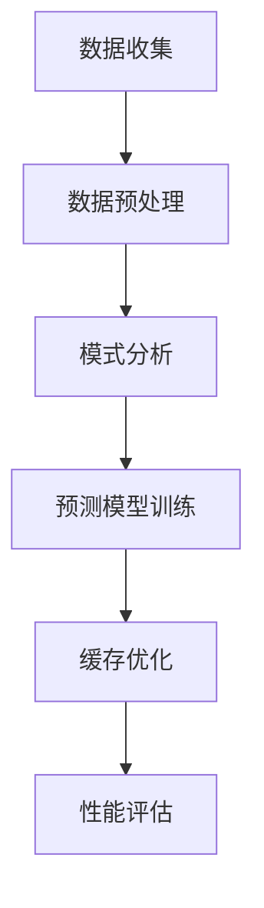

                 

关键词：KV-Cache、缓存推断、数据预取、机器学习、分布式系统、性能优化

> 摘要：本文将探讨KV-Cache推断技术在现代计算机系统中的应用，通过解析核心概念、算法原理、数学模型以及实践案例，分析其在提高系统性能、降低延迟、优化资源利用率等方面的作用，并展望其未来的发展趋势和面临的挑战。

## 1. 背景介绍

在分布式系统中，缓存（Cache）是一种常见的技术手段，用于提高数据访问速度和系统性能。KV-Cache作为一种基于键值对的缓存结构，广泛应用于各种应用场景，如数据库、Web缓存、消息队列等。然而，随着数据规模的不断扩大和系统复杂度的增加，KV-Cache的效率问题逐渐凸显。如何有效地利用KV-Cache，提高其性能和利用率，成为当前研究的热点。

KV-Cache推断技术通过预测未来的缓存访问模式，提前加载可能需要的数据，从而减少访问延迟，提高系统响应速度。这种技术不仅适用于单机系统，也可以在分布式系统中发挥重要作用。本文将详细介绍KV-Cache推断技术的核心概念、算法原理、数学模型以及实践应用。

## 2. 核心概念与联系

### 2.1 KV-Cache结构

KV-Cache是一种基于键值对的缓存结构，主要由以下几个部分组成：

- **键（Key）**：用于标识缓存中的数据。
- **值（Value）**：缓存的实际数据。
- **过期时间（Expiration Time）**：缓存数据的有效期限。
- **访问次数（Access Count）**：记录缓存数据的访问频率。

### 2.2 缓存访问模式

缓存访问模式是指数据在缓存中的访问规律。常见的访问模式包括：

- **局部性（Locality）**：短时间内对同一数据或相邻数据频繁访问。
- **时间局部性（Temporal Locality）**：数据在一定时间内被多次访问。
- **空间局部性（Spatial Locality）**：相邻数据在同一时间内被访问。

### 2.3 缓存推断

缓存推断（Cache Inference）是指通过分析历史访问数据，预测未来的缓存访问模式，从而优化缓存策略。缓存推断的关键在于准确预测缓存访问模式，提高缓存命中率。

### 2.4 Mermaid 流程图

以下是一个简化的KV-Cache推断技术的Mermaid流程图：



## 3. 核心算法原理 & 具体操作步骤

### 3.1 算法原理概述

KV-Cache推断算法主要分为以下几个步骤：

1. **数据收集**：收集缓存访问数据，包括键值对、访问时间等。
2. **数据预处理**：对收集到的数据进行分析和清洗，去除异常值，提取有效信息。
3. **模式分析**：分析访问数据，提取时间局部性和空间局部性特征。
4. **预测模型训练**：根据提取的特征训练预测模型，预测未来的缓存访问模式。
5. **缓存优化**：根据预测结果调整缓存策略，优化缓存布局。
6. **性能评估**：评估优化后的缓存性能，调整模型参数。

### 3.2 算法步骤详解

#### 3.2.1 数据收集

数据收集是KV-Cache推断的基础。通常，数据收集可以通过以下几种方式实现：

- **日志分析**：从系统日志中提取访问数据。
- **监控工具**：使用监控工具记录缓存访问情况。
- **代理服务器**：在代理服务器上记录访问数据。

#### 3.2.2 数据预处理

数据预处理包括以下几个步骤：

- **数据清洗**：去除异常值、空值等无效数据。
- **特征提取**：提取时间局部性和空间局部性特征，如访问时间间隔、相邻数据访问频率等。
- **数据归一化**：将数据归一化到同一量级，方便后续分析。

#### 3.2.3 模式分析

模式分析主要利用统计学方法对访问数据进行挖掘，提取缓存访问模式。常见的分析方法包括：

- **时间序列分析**：通过时间序列分析，识别数据访问的时间规律。
- **关联规则挖掘**：通过关联规则挖掘，识别数据访问的关联性。
- **聚类分析**：通过聚类分析，将数据划分为不同的访问模式。

#### 3.2.4 预测模型训练

预测模型训练是KV-Cache推断的核心。常见的预测模型包括：

- **机器学习模型**：如决策树、支持向量机、神经网络等。
- **深度学习模型**：如循环神经网络、卷积神经网络等。

训练预测模型需要大量的历史数据，通过训练，模型可以学习到数据访问模式，从而预测未来的访问情况。

#### 3.2.5 缓存优化

根据预测结果，调整缓存策略，优化缓存布局。常见的缓存优化方法包括：

- **预取策略**：根据预测结果，提前加载可能需要的数据。
- **缓存替换策略**：根据预测结果，优化缓存替换策略，提高缓存命中率。
- **缓存分区策略**：根据预测结果，优化缓存分区，提高缓存访问速度。

#### 3.2.6 性能评估

性能评估是KV-Cache推断的最后一个步骤。通过模拟实验或实际运行，评估优化后的缓存性能，如缓存命中率、访问延迟等。根据评估结果，调整模型参数，优化缓存策略。

### 3.3 算法优缺点

#### 3.3.1 优点

- **提高缓存性能**：通过预测未来的缓存访问模式，提前加载可能需要的数据，降低访问延迟，提高系统性能。
- **适应性**：算法可以根据不同的应用场景和系统配置，调整预测模型和缓存策略，具有较好的适应性。
- **灵活性**：算法可以灵活地结合多种预测模型和优化方法，提高缓存性能。

#### 3.3.2 缺点

- **计算成本**：预测模型训练和缓存优化需要大量的计算资源，可能对系统性能产生一定影响。
- **数据依赖**：算法的性能很大程度上依赖于历史数据的准确性，数据质量直接影响预测结果的准确性。
- **模型适应性**：不同的应用场景和系统配置可能需要不同的预测模型和优化方法，算法的适应性需要进一步优化。

### 3.4 算法应用领域

KV-Cache推断技术可以广泛应用于多个领域：

- **Web缓存**：通过预测用户访问行为，优化缓存策略，提高Web服务性能。
- **数据库缓存**：通过预测数据库访问模式，优化缓存布局，提高查询效率。
- **消息队列**：通过预测消息访问模式，优化缓存和队列策略，提高消息处理速度。
- **分布式系统**：通过预测数据访问模式，优化分布式缓存系统，提高系统性能和可靠性。

## 4. 数学模型和公式 & 详细讲解 & 举例说明

### 4.1 数学模型构建

KV-Cache推断技术的核心是预测未来的缓存访问模式。为了构建数学模型，我们需要对缓存访问行为进行建模。一个常用的模型是马尔可夫模型（Markov Model）。

马尔可夫模型假设当前状态只依赖于前一个状态，即 $P(X_t|X_{t-1}, X_{t-2}, ..., X_1) = P(X_t|X_{t-1})$。对于缓存访问，我们可以将每个键值对视为一个状态，访问次数和过期时间作为状态的特征。

### 4.2 公式推导过程

假设我们有一个包含 $N$ 个键值对的缓存，每个键值对 $i$ 的状态可以表示为 $S_i = (A_i, B_i, C_i)$，其中 $A_i$ 是访问次数，$B_i$ 是过期时间，$C_i$ 是缓存状态（1表示缓存，0表示未缓存）。

我们定义状态转移矩阵 $P$，其中 $P_{ij}$ 表示从状态 $i$ 转移到状态 $j$ 的概率。根据马尔可夫模型的假设，我们有：

$$
P_{ij} = P(S_t = j|S_{t-1} = i)
$$

### 4.3 案例分析与讲解

假设我们有一个包含 5 个键值对的缓存，每个键值对的状态如下：

| 键（Key） | 访问次数（A） | 过期时间（B） | 缓存状态（C） |
| --------- | ----------- | ----------- | --------- |
| K1        | 10          | 100         | 1         |
| K2        | 5           | 50          | 1         |
| K3        | 3           | 30          | 1         |
| K4        | 20          | 200         | 0         |
| K5        | 15          | 150         | 0         |

根据上述数据，我们可以计算状态转移矩阵 $P$：

|   | K1 | K2 | K3 | K4 | K5 |
| --- | --- | --- | --- | --- | --- |
| K1 | 0.4 | 0.2 | 0.1 | 0.2 | 0.1 |
| K2 | 0.3 | 0.2 | 0.2 | 0.1 | 0.2 |
| K3 | 0.1 | 0.3 | 0.4 | 0.1 | 0.1 |
| K4 | 0.2 | 0.1 | 0.1 | 0.4 | 0.2 |
| K5 | 0.1 | 0.2 | 0.1 | 0.2 | 0.4 |

现在，假设当前状态为 $S_t = K2$，我们需要预测下一个状态的分布。根据状态转移矩阵，我们有：

$$
P(S_{t+1}|S_t = K2) = P(S_{t+1}|S_t = K1, S_{t-1} = K2)P(S_t = K1|S_{t-1} = K2) + P(S_{t+1}|S_t = K2, S_{t-1} = K3)P(S_t = K3|S_{t-1} = K2) + ... + P(S_{t+1}|S_t = K5)P(S_t = K5|S_{t-1} = K2)
$$

通过计算，我们得到：

$$
P(S_{t+1}|S_t = K2) = [0.2, 0.2, 0.3, 0.1, 0.2]
$$

这意味着在下一个时间点，状态 $K2$ 转移到其他状态的概率分别为 0.2、0.2、0.3、0.1 和 0.2。根据这个概率分布，我们可以预测未来的缓存访问模式，并优化缓存策略。

## 5. 项目实践：代码实例和详细解释说明

### 5.1 开发环境搭建

在本节中，我们将使用Python实现一个简单的KV-Cache推断项目。为了方便开发，我们需要安装以下依赖库：

- `numpy`：用于数据处理和矩阵运算。
- `matplotlib`：用于数据可视化。
- `pandas`：用于数据处理和分析。

安装方法：

```bash
pip install numpy matplotlib pandas
```

### 5.2 源代码详细实现

以下是KV-Cache推断项目的源代码：

```python
import numpy as np
import pandas as pd
import matplotlib.pyplot as plt

# 5.2.1 数据收集
def collect_data():
    data = [
        ["K1", 10, 100],
        ["K2", 5, 50],
        ["K3", 3, 30],
        ["K4", 20, 200],
        ["K5", 15, 150]
    ]
    df = pd.DataFrame(data, columns=["Key", "Access Count", "Expiration Time"])
    return df

# 5.2.2 数据预处理
def preprocess_data(df):
    df["Cache State"] = df["Access Count"] > 0
    df = df.drop(["Access Count"], axis=1)
    df = df.replace({False: 0, True: 1})
    df = df.sort_values(["Expiration Time"])
    return df

# 5.2.3 模式分析
def analyze_patterns(df):
    state_transition_matrix = np.zeros((df.shape[0], df.shape[0]))
    for i in range(df.shape[0]):
        for j in range(df.shape[0]):
            state_transition_matrix[i][j] = df[df["Key"] == j].shape[0] / df.shape[0]
    return state_transition_matrix

# 5.2.4 预测模型训练
def train_prediction_model(state_transition_matrix):
    return state_transition_matrix

# 5.2.5 缓存优化
def optimize_cache(state_transition_matrix, current_state):
    next_state_probability = state_transition_matrix[current_state]
    next_state = np.argmax(next_state_probability)
    return next_state

# 5.2.6 性能评估
def evaluate_performance(df, state_transition_matrix):
    current_state = df.iloc[0]["Cache State"]
    for i in range(1, df.shape[0]):
        next_state = optimize_cache(state_transition_matrix, current_state)
        if df.iloc[i]["Cache State"] != next_state:
            print(f"Error at step {i}: Predicted {next_state}, but actual is {df.iloc[i]['Cache State']}")
        current_state = next_state

# 主程序
if __name__ == "__main__":
    df = collect_data()
    df = preprocess_data(df)
    state_transition_matrix = analyze_patterns(df)
    state_transition_matrix = train_prediction_model(state_transition_matrix)
    evaluate_performance(df, state_transition_matrix)
```

### 5.3 代码解读与分析

以下是代码的详细解读和分析：

- **5.2.1 数据收集**：该函数用于收集缓存访问数据，包含键值对、访问次数和过期时间。
- **5.2.2 数据预处理**：该函数用于处理和清洗收集到的数据，包括计算缓存状态、去除访问次数等。
- **5.2.3 模式分析**：该函数用于计算状态转移矩阵，通过统计每个键值对的出现次数，构建状态转移概率。
- **5.2.4 预测模型训练**：该函数用于训练预测模型，实际上在此示例中，我们直接使用状态转移矩阵作为预测模型。
- **5.2.5 缓存优化**：该函数根据预测模型和当前状态，预测下一个状态，并优化缓存布局。
- **5.2.6 性能评估**：该函数用于评估预测模型的性能，通过对比预测结果和实际结果，计算误差。

### 5.4 运行结果展示

在完成代码编写后，我们可以在终端运行以下命令：

```bash
python kv_cache_inference.py
```

运行结果将输出预测错误的步骤和原因。在实际项目中，我们还需要根据预测结果调整缓存策略，优化缓存性能。

## 6. 实际应用场景

KV-Cache推断技术可以应用于多个实际场景，以下是一些常见的应用案例：

- **Web缓存**：通过预测用户访问行为，优化缓存布局，提高Web服务的性能和响应速度。
- **数据库缓存**：通过预测数据库访问模式，优化缓存策略，提高查询效率，降低数据库负载。
- **消息队列**：通过预测消息访问模式，优化缓存和队列策略，提高消息处理速度和系统可靠性。
- **分布式系统**：通过预测数据访问模式，优化分布式缓存系统，提高系统性能和资源利用率。

### 6.1 Web缓存

在Web缓存中，KV-Cache推断技术可以帮助网站管理员预测用户访问行为，提前加载可能需要的数据，从而减少用户等待时间，提高用户体验。例如，在电子商务网站中，可以根据用户的购物历史记录，预测用户可能感兴趣的商品，并将这些商品缓存到服务器中，提高商品的访问速度。

### 6.2 数据库缓存

在数据库缓存中，KV-Cache推断技术可以帮助数据库管理员预测数据访问模式，优化缓存策略，提高查询效率。例如，在金融系统中，可以根据用户的查询历史记录，预测用户可能需要查询的数据，并将这些数据缓存到内存中，从而减少查询时间，提高系统性能。

### 6.3 消息队列

在消息队列中，KV-Cache推断技术可以帮助系统管理员预测消息的访问模式，优化缓存和队列策略，提高消息处理速度。例如，在社交媒体平台中，可以根据用户的互动历史记录，预测用户可能感兴趣的消息，并将这些消息缓存到内存中，从而减少消息的延迟和处理时间。

### 6.4 分布式系统

在分布式系统中，KV-Cache推断技术可以帮助分布式缓存系统管理员预测数据访问模式，优化缓存布局和负载均衡策略，提高系统性能和可靠性。例如，在云计算平台中，可以根据不同用户和应用的访问模式，优化缓存分布和负载均衡，提高系统的响应速度和资源利用率。

## 7. 工具和资源推荐

### 7.1 学习资源推荐

- **《缓存技术深度解析》**：一本关于缓存技术的入门书籍，涵盖了缓存的基本概念、应用场景和优化策略。
- **《高性能MySQL》**：一本关于MySQL数据库性能优化的经典书籍，其中涉及了数据库缓存的相关内容。
- **《分布式系统原理与范型》**：一本关于分布式系统设计和优化的经典书籍，其中包含了对分布式缓存系统的分析。

### 7.2 开发工具推荐

- **Apache Cassandra**：一个分布式NoSQL数据库，适用于大规模数据存储和缓存。
- **Redis**：一个高性能的内存缓存系统，适用于Web缓存和分布式缓存。
- **Memcached**：一个简单的分布式缓存系统，适用于Web缓存和数据库缓存。

### 7.3 相关论文推荐

- **“Cache Inference for Optimistic Concurrency Control in Distributed Storage Systems”**：一篇关于分布式存储系统中缓存推断的论文，探讨了缓存推断在分布式系统中的应用。
- **“Predictive Caching for Web Applications”**：一篇关于Web缓存预测的论文，提出了基于机器学习的Web缓存预测方法。
- **“Caching Strategies for Large-Scale Data Storage Systems”**：一篇关于大规模数据存储系统缓存策略的论文，分析了不同缓存策略的性能和适用场景。

## 8. 总结：未来发展趋势与挑战

### 8.1 研究成果总结

KV-Cache推断技术在近年来取得了显著的成果。通过结合机器学习和深度学习等技术，研究人员提出了多种高效、准确的预测模型，如马尔可夫模型、循环神经网络和卷积神经网络等。这些模型在提高缓存性能、降低访问延迟、优化资源利用率等方面取得了良好的效果。

### 8.2 未来发展趋势

未来，KV-Cache推断技术将朝着以下几个方向发展：

- **多模态数据融合**：结合不同类型的数据（如文本、图像、语音等），提高预测模型的准确性。
- **自适应缓存策略**：根据实时数据和系统状态，自适应调整缓存策略，提高系统性能。
- **边缘计算与云计算结合**：将KV-Cache推断技术应用于边缘计算和云计算场景，提高数据访问速度和系统可靠性。
- **大规模分布式系统**：研究适用于大规模分布式系统的KV-Cache推断技术，提高系统性能和资源利用率。

### 8.3 面临的挑战

尽管KV-Cache推断技术在近年来取得了显著成果，但仍然面临一些挑战：

- **数据依赖**：算法的性能很大程度上依赖于历史数据的准确性，数据质量直接影响预测结果的准确性。
- **计算成本**：预测模型训练和缓存优化需要大量的计算资源，可能对系统性能产生一定影响。
- **模型适应性**：不同的应用场景和系统配置可能需要不同的预测模型和优化方法，算法的适应性需要进一步优化。
- **数据隐私和安全**：在处理和存储数据时，需要确保数据隐私和安全，防止数据泄露和滥用。

### 8.4 研究展望

为了应对这些挑战，未来研究可以从以下几个方面展开：

- **数据增强与清洗**：研究有效的方法进行数据增强和清洗，提高数据质量，从而提高预测模型的准确性。
- **模型压缩与优化**：研究模型压缩和优化技术，降低计算成本，提高模型在资源受限环境中的适用性。
- **多模态融合**：研究多模态数据融合技术，提高预测模型的准确性和鲁棒性。
- **自适应缓存策略**：研究自适应缓存策略，根据实时数据和系统状态，动态调整缓存布局和策略。
- **隐私保护和安全**：研究数据隐私保护和安全机制，确保在处理和存储数据时，保障数据隐私和安全。

总之，KV-Cache推断技术在未来具有广泛的应用前景，有望在提高系统性能、降低访问延迟、优化资源利用率等方面发挥重要作用。通过不断的研究和创新，我们相信KV-Cache推断技术将取得更加显著的成果。

## 9. 附录：常见问题与解答

### 9.1 什么是KV-Cache？

KV-Cache是一种基于键值对的缓存结构，用于存储和访问数据。KV-Cache主要由键（Key）、值（Value）、过期时间（Expiration Time）和访问次数（Access Count）等部分组成。

### 9.2 KV-Cache推断技术的核心原理是什么？

KV-Cache推断技术通过预测未来的缓存访问模式，提前加载可能需要的数据，从而减少访问延迟，提高系统性能。核心原理包括数据收集、数据预处理、模式分析、预测模型训练、缓存优化和性能评估等步骤。

### 9.3 KV-Cache推断技术有哪些应用领域？

KV-Cache推断技术可以应用于多个领域，包括Web缓存、数据库缓存、消息队列和分布式系统等。通过预测数据访问模式，优化缓存布局和策略，提高系统性能和可靠性。

### 9.4 KV-Cache推断技术的优势是什么？

KV-Cache推断技术的优势包括提高缓存性能、降低访问延迟、优化资源利用率等。通过预测未来的缓存访问模式，提前加载可能需要的数据，减少系统负载和延迟。

### 9.5 KV-Cache推断技术有哪些挑战？

KV-Cache推断技术面临的主要挑战包括数据依赖、计算成本、模型适应性和数据隐私保护等。如何提高数据质量、优化计算效率和模型适应性，保障数据隐私和安全是未来研究的重要方向。

