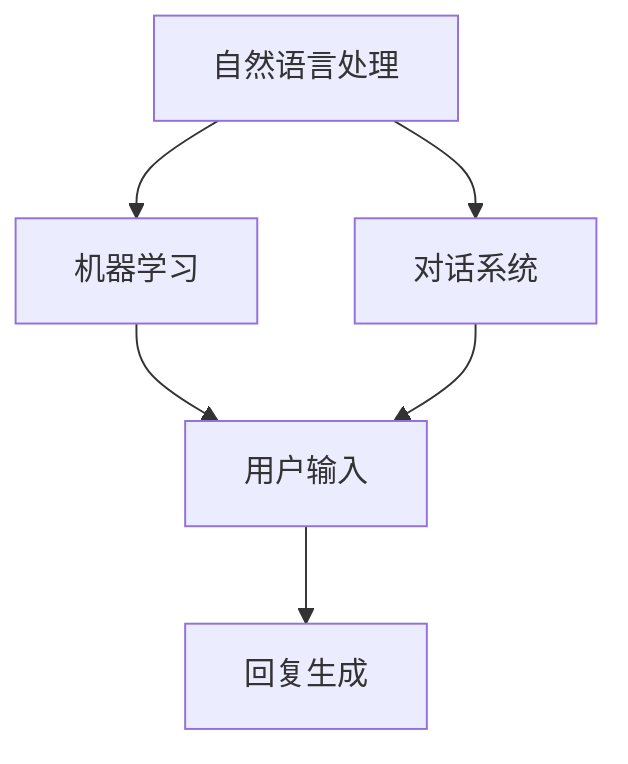

                 

关键词：聊天机器人、人工智能、自然语言处理、对话系统、未来发展、应用场景、技术挑战、数学模型、代码实例。

> 摘要：本文将探讨聊天机器人的未来发展，包括其核心概念与联系、算法原理与操作步骤、数学模型与公式、项目实践、实际应用场景、工具和资源推荐，以及未来发展趋势与挑战。通过深入分析，我们希望能够为读者提供一个全面的技术视角，展望聊天机器人在人工智能领域的广阔前景。

## 1. 背景介绍

随着互联网和移动互联网的迅猛发展，人工智能（AI）技术逐渐渗透到我们生活的方方面面。聊天机器人作为一种重要的AI应用形式，已经在多个领域展现出了巨大的潜力。从简单的客服机器人到复杂的虚拟助手，聊天机器人正逐步改变着我们的沟通方式和工作流程。

聊天机器人，或称对话系统，是一种能够与人类进行自然语言交互的计算机程序。它们通过理解用户的语言，提供有针对性的回复，帮助用户解决问题或完成任务。随着自然语言处理（NLP）技术的不断进步，聊天机器人的智能化程度越来越高，应用范围也越来越广泛。

### 1.1 聊天机器人的发展历程

聊天机器人的历史可以追溯到20世纪50年代。最早的聊天机器人如ELIZA和PARABLE，只能进行简单的文字匹配和回复。随着计算机技术的发展，聊天机器人的能力逐渐增强，可以处理更复杂的语言结构和语义。进入21世纪，随着大数据、云计算和深度学习等技术的引入，聊天机器人的性能和智能化水平得到了大幅提升。

### 1.2 聊天机器人的应用场景

聊天机器人在众多领域都得到了广泛应用，如客服、教育、医疗、金融、电子商务等。在客服领域，聊天机器人可以提供24/7的在线支持，提高客户满意度；在教育领域，聊天机器人可以为学生提供个性化的学习辅导；在医疗领域，聊天机器人可以协助医生进行初步诊断和咨询；在金融领域，聊天机器人可以提供理财建议和自动化交易服务；在电子商务领域，聊天机器人可以推荐商品、处理订单和提供售后服务。

## 2. 核心概念与联系

聊天机器人的核心技术包括自然语言处理、机器学习和对话系统。下面将分别介绍这些核心概念，并展示它们之间的联系。

### 2.1 自然语言处理

自然语言处理（NLP）是使计算机能够理解、解析和生成自然语言的技术。NLP的核心任务包括文本分类、实体识别、情感分析、机器翻译和问答系统等。在聊天机器人中，NLP技术用于理解用户输入的文本，提取关键信息，并生成相应的回复。

### 2.2 机器学习

机器学习是使计算机能够从数据中学习并做出决策的技术。在聊天机器人中，机器学习用于训练模型，使其能够理解用户的行为模式、偏好和需求，从而提供更加个性化的服务。常见的机器学习算法包括决策树、支持向量机、神经网络等。

### 2.3 对话系统

对话系统是一种能够与人类进行交互的计算机程序。它包括用户界面、对话管理、语言理解和自然语言生成等组成部分。用户界面负责接收用户输入，对话管理负责控制对话流程，语言理解负责解析用户输入，自然语言生成负责生成回复。

### 2.4 核心概念原理和架构的 Mermaid 流程图



## 3. 核心算法原理 & 具体操作步骤

### 3.1 算法原理概述

聊天机器人的核心算法包括自然语言处理和机器学习。自然语言处理负责理解用户输入的文本，提取关键信息，并生成语义表示。机器学习则用于训练模型，使其能够从数据中学习，提高对话的智能化程度。

### 3.2 算法步骤详解

1. **用户输入接收**：聊天机器人通过用户界面接收用户输入的文本。
2. **文本预处理**：对用户输入的文本进行清洗和标准化，如去除标点符号、转换小写等。
3. **语言理解**：使用自然语言处理技术，如词性标注、命名实体识别、句法分析等，理解用户输入的文本。
4. **语义表示**：将理解后的文本转化为语义表示，如词向量、语义角色标注等。
5. **意图识别**：使用机器学习算法，如决策树、支持向量机、神经网络等，识别用户的意图。
6. **对话管理**：根据用户的意图，生成对话管理策略，控制对话流程。
7. **自然语言生成**：根据对话管理策略，生成自然语言回复，并通过用户界面展示给用户。

### 3.3 算法优缺点

**优点**：

- **高效性**：聊天机器人可以处理大量用户的请求，提高工作效率。
- **个性化**：通过机器学习，聊天机器人可以了解用户的行为和偏好，提供个性化的服务。
- **成本低**：相比人力客服，聊天机器人的维护成本较低。

**缺点**：

- **语言理解能力有限**：目前的自然语言处理技术仍然存在局限性，难以完全理解复杂的语言结构。
- **对话连贯性**：在处理长对话时，聊天机器人可能无法保持对话的连贯性。
- **情感表达**：聊天机器人难以模拟人类的情感表达，难以处理情感复杂的问题。

### 3.4 算法应用领域

- **客服**：提供24/7的在线客服支持，提高客户满意度。
- **教育**：为学生提供个性化学习辅导，提高学习效果。
- **医疗**：协助医生进行初步诊断和咨询，提高医疗效率。
- **金融**：提供理财建议和自动化交易服务，降低金融风险。
- **电子商务**：推荐商品、处理订单和提供售后服务，提高客户体验。

## 4. 数学模型和公式 & 详细讲解 & 举例说明

### 4.1 数学模型构建

聊天机器人的数学模型主要包括自然语言处理模型和机器学习模型。自然语言处理模型通常采用神经网络，如循环神经网络（RNN）、长短期记忆网络（LSTM）和变换器（Transformer）等。机器学习模型则采用分类模型，如决策树、支持向量机和神经网络等。

### 4.2 公式推导过程

以循环神经网络（RNN）为例，其基本公式如下：

$$
h_t = \sigma(W_h h_{t-1} + W_x x_t + b)
$$

其中，$h_t$ 表示第 $t$ 个时刻的隐藏状态，$x_t$ 表示第 $t$ 个时刻的输入，$W_h$ 和 $W_x$ 分别为隐藏状态和输入的权重矩阵，$b$ 为偏置项，$\sigma$ 为激活函数。

### 4.3 案例分析与讲解

假设我们有一个简单的聊天机器人，用于回答关于天气的问题。输入为 "明天北京的天气怎么样？"，我们需要使用自然语言处理技术理解这个问题，并生成合适的回复。

1. **文本预处理**：将输入文本转换为小写，并去除标点符号。
2. **语言理解**：使用词性标注技术，提取关键词和短语，如 "明天"、"北京"、"天气"。
3. **语义表示**：使用词向量技术，将关键词和短语转化为向量表示。
4. **意图识别**：使用分类模型，如决策树或神经网络，识别用户的意图，如 "询问天气"。
5. **对话管理**：根据用户的意图，生成对话管理策略，如查询天气数据。
6. **自然语言生成**：根据天气数据，生成回复，如 "明天北京的天气是晴转多云，气温10°C到20°C"。

## 5. 项目实践：代码实例和详细解释说明

### 5.1 开发环境搭建

为了实现一个简单的聊天机器人，我们可以使用Python编程语言，结合TensorFlow和NLTK等库。

```python
# 安装必要的库
!pip install tensorflow nltk
```

### 5.2 源代码详细实现

以下是一个简单的聊天机器人代码示例：

```python
import nltk
from nltk.chat.util import Chat, reflections

# 机器人对话数据
pairs = [
    [
        r"my name is (.*)",
        ["Hello %1", "Hi %1, Nice to meet you"],
    ],
    [
        r"I am (.*)",
        ["Nice to meet you too %1", "How do you know %1?"],
    ],
    # ... 更多对话数据
]

# 创建聊天对象
chatbot = Chat(pairs, reflections)

# 开始对话
print("Chatbot: Hello, I am ChatBot. How can I help you?")
chatbot.converse()
```

### 5.3 代码解读与分析

1. **导入库**：首先，我们导入nltk库，用于实现聊天机器人的对话功能。
2. **定义对话数据**：使用正则表达式定义对话数据，包括问题和回答。
3. **创建聊天对象**：使用Chat类创建聊天对象，传入对话数据和用户反射表（reflections）。
4. **开始对话**：打印欢迎语，并调用converse方法开始对话。

### 5.4 运行结果展示

运行上述代码后，我们将看到一个简单的聊天界面，可以与机器人进行交互。

```plaintext
Chatbot: Hello, I am ChatBot. How can I help you?
User: My name is Alice.
Chatbot: Hello Alice, Nice to meet you. How do you know me?
User: I saw you on the internet.
Chatbot: That's interesting. What did you think of my performance?
User: You're doing a great job!
Chatbot: Thank you for your feedback. Is there anything else I can help you with?
```

## 6. 实际应用场景

聊天机器人已经在众多领域取得了显著的成果，以下是一些典型的实际应用场景：

### 6.1 客服

在客服领域，聊天机器人可以提供24/7的在线支持，处理常见问题，如账户查询、订单跟踪、产品咨询等。聊天机器人可以快速响应用户，提高客户满意度，降低客服成本。

### 6.2 教育

在教育领域，聊天机器人可以为学生提供个性化学习辅导，如解答疑问、提供学习建议、布置作业等。聊天机器人可以根据学生的特点和需求，制定合适的学习计划，提高学习效果。

### 6.3 医疗

在医疗领域，聊天机器人可以协助医生进行初步诊断和咨询，提供病情查询、药物信息、预约挂号等服务。聊天机器人可以处理大量的医疗信息，减轻医生的工作负担，提高医疗服务效率。

### 6.4 金融

在金融领域，聊天机器人可以提供理财建议、自动化交易服务、客户咨询等。聊天机器人可以根据用户的风险偏好和投资目标，制定个性化的理财方案，降低金融风险。

### 6.5 电子商务

在电子商务领域，聊天机器人可以推荐商品、处理订单、提供售后服务等。聊天机器人可以了解用户的需求和喜好，提供个性化的购物建议，提高客户体验和忠诚度。

## 7. 工具和资源推荐

为了更好地开发和应用聊天机器人，以下是一些推荐的工具和资源：

### 7.1 学习资源推荐

- 《自然语言处理综述》（自然语言处理领域的经典教材）
- 《深度学习》（深度学习领域的权威教材）
- 《Chatbots: Who Done It?》（关于聊天机器人开发的实用指南）

### 7.2 开发工具推荐

- TensorFlow：开源深度学习框架，适用于聊天机器人的开发。
- NLTK：开源自然语言处理库，适用于文本预处理和语言理解。
- Chatfuel：基于Facebook Messenger的聊天机器人开发平台，适用于快速构建简单的聊天机器人。

### 7.3 相关论文推荐

- "A survey of current approaches to machine learning in chatbots"
- "Deep Learning for Chatbots: From Language Models to Dialog Management"
- "A Conversational AI Survey: Recent Advances and New Frontiers"

## 8. 总结：未来发展趋势与挑战

### 8.1 研究成果总结

近年来，聊天机器人在自然语言处理、机器学习和对话系统等领域取得了显著的研究成果。随着技术的不断进步，聊天机器人的语言理解能力、对话连贯性和个性化服务水平将进一步提高。

### 8.2 未来发展趋势

- **多模态交互**：结合语音、图像、视频等多模态信息，实现更加自然和丰富的交互体验。
- **个性化服务**：通过用户数据分析和机器学习算法，提供更加个性化的服务。
- **跨领域应用**：在医疗、教育、金融等领域，实现跨领域的知识共享和应用。
- **智慧城市**：在城市管理、交通调度、环境监测等方面发挥重要作用，助力智慧城市建设。

### 8.3 面临的挑战

- **语言理解**：提高聊天机器人的语言理解能力，使其能够处理更加复杂的语言结构和语义。
- **对话连贯性**：保持对话的连贯性，提高长对话的智能化程度。
- **情感表达**：模拟人类的情感表达，处理情感复杂的问题。
- **隐私保护**：确保用户数据的安全和隐私。

### 8.4 研究展望

未来，聊天机器人将继续在人工智能领域发挥重要作用。我们期待看到聊天机器人与人类更加紧密地融合，成为我们生活和工作中不可或缺的伙伴。同时，我们也呼吁学术界和产业界共同努力，解决聊天机器人面临的挑战，推动其可持续发展。

## 9. 附录：常见问题与解答

### 9.1 什么是聊天机器人？

聊天机器人是一种能够与人类进行自然语言交互的计算机程序，能够理解用户的语言，提供有针对性的回复，帮助用户解决问题或完成任务。

### 9.2 聊天机器人有哪些应用场景？

聊天机器人的应用场景非常广泛，包括客服、教育、医疗、金融、电子商务等领域。

### 9.3 聊天机器人的核心技术是什么？

聊天机器人的核心技术包括自然语言处理、机器学习和对话系统。

### 9.4 聊天机器人有哪些优点和缺点？

聊天机器人的优点包括高效性、个性化、成本低等，缺点包括语言理解能力有限、对话连贯性较差、情感表达困难等。

### 9.5 如何搭建一个简单的聊天机器人？

可以使用Python编程语言，结合TensorFlow和NLTK等库，按照以下步骤搭建：

1. 安装必要的库。
2. 定义对话数据。
3. 创建聊天对象。
4. 开始对话。

----------------------------------------------------------------

作者：禅与计算机程序设计艺术 / Zen and the Art of Computer Programming


