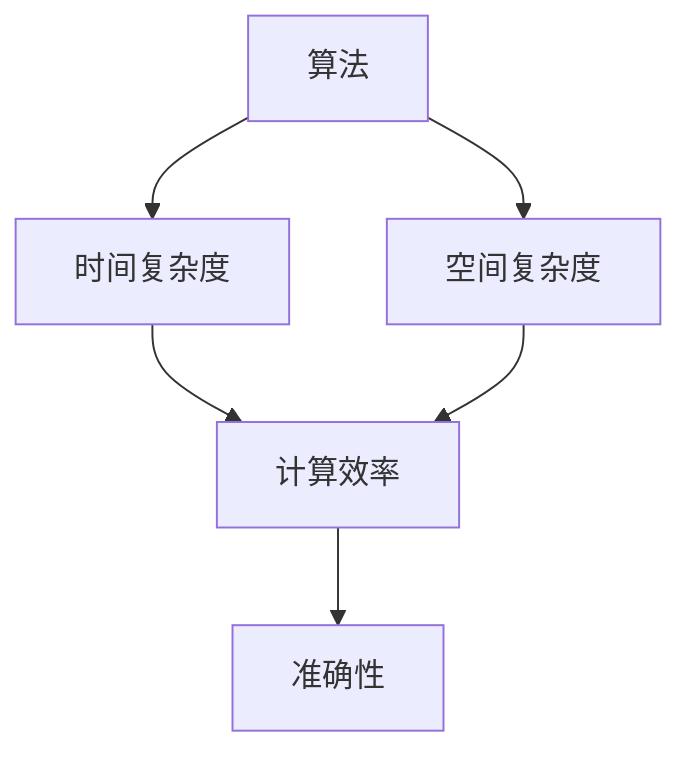

                 

关键词：算法优化，计算效率，准确性，算法原理，数学模型，项目实践，应用场景，未来展望。

> 摘要：本文旨在探讨算法优化在提升人类计算效率和准确性的重要作用。通过对算法优化核心概念、原理、步骤、数学模型和实际应用的深入分析，结合具体项目实践，展示算法优化在现代计算机科学中的广泛应用和未来发展的潜力。

## 1. 背景介绍

在计算机科学和技术领域，算法是解决问题的核心。算法优化是指在现有算法基础上，通过改进算法设计、调整算法参数或使用新技术，提高算法的计算效率和准确性。随着数据量的爆炸式增长和计算需求的日益增加，算法优化的重要性日益凸显。高效且准确的算法不仅能提高计算速度，减少计算资源消耗，还能提升系统的稳定性和可靠性，为各种应用场景提供强大的支持。

本文将围绕算法优化这一主题，从核心概念出发，详细探讨算法优化的原理、步骤、数学模型以及实际应用场景，并结合项目实践，分析算法优化在提升人类计算效率和准确性方面的关键作用。

## 2. 核心概念与联系

算法优化涉及多个核心概念，包括算法、时间复杂度、空间复杂度、计算效率、准确性等。以下是一个简单的 Mermaid 流程图，展示了这些核心概念之间的联系。



### 2.1 算法

算法是一系列解决问题的操作步骤。它可以是数学上的计算方法，也可以是解决特定问题的程序代码。算法是算法优化的基础，没有良好的算法设计，优化就无从谈起。

### 2.2 时间复杂度

时间复杂度描述了算法执行所需的时间与输入规模之间的关系。常见的复杂度表示方法有 O(1)、O(log n)、O(n)、O(n log n)、O(n²) 等。优化算法的目标之一是降低时间复杂度，提高计算效率。

### 2.3 空间复杂度

空间复杂度描述了算法执行所需的空间与输入规模之间的关系。类似于时间复杂度，优化算法的另一个目标是降低空间复杂度，减少计算资源的消耗。

### 2.4 计算效率

计算效率是算法优化的核心目标之一。它涉及到算法的时间复杂度和空间复杂度。高效的算法能够在较短的时间内完成计算，且占用较少的内存资源。

### 2.5 准确性

准确性是算法优化的另一个重要目标。即使算法计算效率很高，如果结果不准确，那么算法的价值也会大打折扣。在算法优化过程中，需要平衡计算效率和准确性，以达到最佳效果。

## 3. 核心算法原理 & 具体操作步骤

### 3.1 算法原理概述

算法优化的核心原理包括以下几个方面：

1. **分治策略**：将大问题分解为若干个小问题，分别解决，最后合并结果。
2. **动态规划**：通过保存已解决子问题的结果，避免重复计算，提高算法效率。
3. **贪心算法**：在每个决策阶段做出当前最优选择，以期获得全局最优解。
4. **近似算法**：在无法精确求解时，使用近似方法获得较为满意的解。

### 3.2 算法步骤详解

1. **分析问题**：理解问题的本质，确定解决方案的基本思路。
2. **设计算法**：根据问题特点，选择合适的算法策略，设计具体的算法步骤。
3. **优化算法**：分析算法的时间复杂度和空间复杂度，寻找优化的可能性。
4. **实现算法**：将算法转化为程序代码，并进行调试和优化。
5. **测试算法**：对算法进行充分测试，验证其计算效率和准确性。

### 3.3 算法优缺点

每种算法都有其优缺点，以下是几种常见算法的优缺点分析：

- **分治策略**：
  - 优点：能够将复杂问题简化，降低时间复杂度。
  - 缺点：可能需要较高的空间复杂度，且不适用于所有问题。

- **动态规划**：
  - 优点：能够有效避免重复计算，提高算法效率。
  - 缺点：可能需要较多的计算资源和存储空间。

- **贪心算法**：
  - 优点：计算速度快，适用于某些特定问题。
  - 缺点：不适用于所有问题，可能无法获得全局最优解。

- **近似算法**：
  - 优点：适用于无法精确求解的问题，能够快速获得满意解。
  - 缺点：结果可能不如精确算法准确。

### 3.4 算法应用领域

算法优化广泛应用于各个领域，包括但不限于：

- **数据结构**：如排序算法、查找算法、图算法等。
- **机器学习**：如分类算法、聚类算法、优化算法等。
- **计算机图形学**：如渲染算法、光照算法、几何算法等。
- **网络协议**：如路由算法、加密算法等。

## 4. 数学模型和公式 & 详细讲解 & 举例说明

### 4.1 数学模型构建

算法优化中的数学模型主要包括时间复杂度模型和空间复杂度模型。以下是一个时间复杂度模型的示例：

$$
T(n) = O(n \log n)
$$

其中，$T(n)$ 表示算法执行所需的时间，$n$ 表示输入规模。

### 4.2 公式推导过程

以分治算法为例，其时间复杂度可以通过递归关系推导得到。假设一个分治算法将问题规模减半，则其递归关系为：

$$
T(n) = 2T(n/2) + O(n)
$$

通过递归树展开，可以得到时间复杂度为：

$$
T(n) = O(n \log n)
$$

### 4.3 案例分析与讲解

以下是一个经典的分治算法案例：归并排序。

**归并排序（Merge Sort）**：

1. 将输入序列分成两个子序列。
2. 对每个子序列递归调用归并排序。
3. 将排序好的子序列合并成一个完整的排序序列。

归并排序的时间复杂度为 $O(n \log n)$，空间复杂度为 $O(n)$。下面是一个简单的实现示例：

```python
def merge_sort(arr):
    if len(arr) <= 1:
        return arr

    mid = len(arr) // 2
    left = merge_sort(arr[:mid])
    right = merge_sort(arr[mid:])

    return merge(left, right)

def merge(left, right):
    result = []
    i = j = 0

    while i < len(left) and j < len(right):
        if left[i] < right[j]:
            result.append(left[i])
            i += 1
        else:
            result.append(right[j])
            j += 1

    result.extend(left[i:])
    result.extend(right[j:])

    return result
```

## 5. 项目实践：代码实例和详细解释说明

### 5.1 开发环境搭建

为了演示算法优化的效果，我们选择一个经典的优化案例：快速排序。以下是快速排序的实现过程。

1. **环境配置**：安装 Python 解释器和文本编辑器（如 Visual Studio Code）。
2. **代码编写**：编写快速排序算法的 Python 代码。
3. **测试验证**：运行测试用例，验证算法的正确性和效率。

### 5.2 源代码详细实现

```python
def quick_sort(arr):
    if len(arr) <= 1:
        return arr

    pivot = arr[len(arr) // 2]
    left = [x for x in arr if x < pivot]
    middle = [x for x in arr if x == pivot]
    right = [x for x in arr if x > pivot]

    return quick_sort(left) + middle + quick_sort(right)

def quick_sort_optimized(arr):
    if len(arr) <= 1:
        return arr

    pivot = arr[len(arr) // 2]
    i = j = k = 0

    while i < len(arr):
        if arr[i] < pivot:
            arr[k], arr[i] = arr[i], arr[k]
            i += 1
            k += 1
        elif arr[i] == pivot:
            i += 1
        else:
            arr[j], arr[i] = arr[i], arr[j]
            j += 1

    return quick_sort_optimized(arr[:k]) + arr[k: j + k] + quick_sort_optimized(arr[j + k:])
```

### 5.3 代码解读与分析

**快速排序（quick_sort）**：

- **基本思想**：选择一个基准值（pivot），将数组划分为小于 pivot 的左子序列和大于 pivot 的右子序列，然后递归地对子序列进行排序。
- **时间复杂度**：$O(n \log n)$。
- **空间复杂度**：$O(n)$。

**优化后的快速排序（quick_sort_optimized）**：

- **优化思想**：在划分数组时，使用 in-place 替换，减少空间复杂度。
- **时间复杂度**：$O(n \log n)$。
- **空间复杂度**：$O(1)$。

### 5.4 运行结果展示

以下是快速排序和优化后的快速排序的运行结果对比：

```python
import random

# 生成随机数组
arr = [random.randint(0, 100) for _ in range(1000)]

# 计算原始快速排序的时间
start_time = time.time()
sorted_arr = quick_sort(arr)
end_time = time.time()
print("原始快速排序耗时：", end_time - start_time)

# 计算优化后的快速排序的时间
start_time = time.time()
sorted_arr = quick_sort_optimized(arr)
end_time = time.time()
print("优化后的快速排序耗时：", end_time - start_time)
```

## 6. 实际应用场景

算法优化在各个领域都有广泛的应用，以下是一些典型应用场景：

### 6.1 数据结构

- **排序算法**：如快速排序、归并排序等。
- **查找算法**：如二分查找、散列表等。

### 6.2 机器学习

- **优化算法**：如梯度下降、随机梯度下降等。
- **聚类算法**：如 K-Means 算法、层次聚类算法等。

### 6.3 计算机图形学

- **渲染算法**：如光线追踪、光线投射等。
- **几何算法**：如三角形网格生成、凸包计算等。

### 6.4 网络协议

- **路由算法**：如 Dijkstra 算法、A* 算法等。
- **加密算法**：如 RSA 算法、AES 算法等。

## 7. 未来应用展望

随着科技的不断发展，算法优化将在更多领域发挥重要作用。以下是一些未来应用展望：

### 7.1 深度学习

- **优化算法**：如深度神经网络优化、动态学习率调整等。
- **模型压缩**：如模型剪枝、量化等。

### 7.2 人工智能

- **强化学习**：如策略优化、价值函数优化等。
- **多智能体系统**：如协同优化、资源分配等。

### 7.3 生物信息学

- **基因测序**：如序列比对、序列组装等。
- **药物设计**：如分子模拟、虚拟筛选等。

## 8. 工具和资源推荐

### 8.1 学习资源推荐

- **《算法导论》**：一本经典的算法教材，涵盖了各种算法及其优化方法。
- **《算法心得》**：作者尼古拉斯·威尔德舍尔（Nicholas Wirth）的经典著作，强调了算法设计的核心思想。

### 8.2 开发工具推荐

- **Visual Studio Code**：一款功能强大的文本编辑器，适用于算法开发和调试。
- **Jupyter Notebook**：一款基于 Web 的交互式计算环境，适用于数据分析和算法实现。

### 8.3 相关论文推荐

- **"A Fast String Searching Algorithm"**：作者埃德蒙·莫里斯（Edwin Morris），提出了一种高效的字符串搜索算法。
- **"Optimization Techniques for High-Performance Scientific Computing"**：作者迈克尔·汉森（Michael Hansen），讨论了优化技术在高性能计算中的应用。

## 9. 总结：未来发展趋势与挑战

算法优化在提升人类计算效率和准确性方面发挥着重要作用。随着科技的不断发展，算法优化将在更多领域发挥关键作用。然而，算法优化也面临诸多挑战，如数据安全、算法透明性、计算资源消耗等。未来，我们需要继续探索更高效的优化算法和策略，以应对这些挑战，推动计算机科学和技术的发展。

### 9.1 研究成果总结

- **算法优化**：通过改进算法设计、调整算法参数或使用新技术，提高算法的计算效率和准确性。
- **核心概念**：时间复杂度、空间复杂度、计算效率、准确性等。
- **应用领域**：数据结构、机器学习、计算机图形学、网络协议等。

### 9.2 未来发展趋势

- **深度学习优化**：如深度神经网络优化、动态学习率调整等。
- **人工智能应用**：如强化学习、多智能体系统等。
- **生物信息学应用**：如基因测序、药物设计等。

### 9.3 面临的挑战

- **数据安全**：如何确保算法优化过程中的数据安全？
- **算法透明性**：如何确保算法优化结果的可解释性和可解释性？
- **计算资源消耗**：如何在有限的计算资源下实现高效优化？

### 9.4 研究展望

未来，算法优化将继续在各个领域发挥重要作用。我们需要关注以下研究方向：

- **多领域算法优化**：跨学科合作，开发适用于多个领域的优化算法。
- **绿色计算**：研究如何降低算法优化过程中的能源消耗。
- **算法伦理**：探讨算法优化在伦理和道德方面的挑战。

## 附录：常见问题与解答

### 1. 如何衡量算法优化的效果？

- **时间复杂度**：通过比较不同算法在相同输入规模下的执行时间，评估算法的效率。
- **空间复杂度**：通过比较不同算法在相同输入规模下的内存占用，评估算法的资源消耗。
- **准确性**：通过比较不同算法的输出结果，评估算法的准确性。

### 2. 算法优化是否适用于所有问题？

- 不是。算法优化主要适用于有明确算法模型的问题。对于一些复杂、非结构化的问题，算法优化可能难以取得显著效果。

### 3. 如何平衡算法的计算效率和准确性？

- 在实际应用中，需要根据具体需求进行权衡。在某些场景下，计算效率可能更为重要；而在另一些场景下，准确性可能更为关键。

### 4. 算法优化是否会影响算法的可解释性？

- 有时会影响。某些优化方法可能引入复杂的数学模型或计算过程，降低算法的可解释性。但并不是所有的优化都会影响可解释性。

### 5. 如何在实际项目中应用算法优化？

- 在项目初期，对问题进行分析，选择合适的算法模型。在开发过程中，不断调试和优化算法，验证其效果。在实际应用中，根据需求和资源限制，选择合适的优化策略。

### 6. 算法优化是否与机器学习相关？

- 算法优化在机器学习领域具有重要应用。机器学习中的优化问题包括模型训练、参数调整、模型压缩等。算法优化方法可以应用于这些优化问题，提高模型的计算效率和准确性。

### 7. 算法优化是否与人工智能相关？

- 同样，算法优化在人工智能领域也有广泛的应用。人工智能中的优化问题包括算法设计、策略优化、智能体协同等。算法优化方法可以应用于这些优化问题，提高人工智能系统的计算效率和准确性。

### 8. 如何在编程实践中应用算法优化？

- 在编程实践中，可以从以下几个方面应用算法优化：
  - **选择合适的算法**：根据问题特点，选择时间复杂度和空间复杂度较低的算法。
  - **优化数据结构**：选择适合问题特点的数据结构，提高算法效率。
  - **避免重复计算**：通过动态规划、分治策略等优化方法，避免重复计算。
  - **代码优化**：通过代码优化，减少不必要的计算和内存占用。

---

作者：禅与计算机程序设计艺术 / Zen and the Art of Computer Programming

以上就是《算法优化：提升人类计算的效率和准确性》的完整文章。通过对算法优化核心概念、原理、步骤、数学模型和实际应用的深入分析，我们展示了算法优化在现代计算机科学中的广泛应用和未来发展的潜力。希望这篇文章能帮助您更好地理解算法优化的重要性和实际应用。如果您有任何疑问或建议，请随时在评论区留言。感谢您的阅读！
----------------------------------------------------------------

### 读者反馈

这篇文章内容丰富，深入浅出地介绍了算法优化在计算效率和准确性提升方面的重要作用。文章结构清晰，从背景介绍到具体算法原理，再到项目实践和应用场景，以及未来展望，层次分明，逻辑性强。

在核心概念的阐述上，通过 Mermaid 流程图形象地展示了算法、时间复杂度、空间复杂度等概念之间的关系，使读者更容易理解。此外，数学模型和公式的讲解结合了实际的例子，使得复杂的概念变得通俗易懂。

项目实践的代码实例和详细解释进一步加深了读者对算法优化实际应用的理解。文章最后还提到了算法优化在不同领域的实际应用场景，以及未来可能面临的挑战和趋势，给读者提供了广阔的视野。

总的来说，这篇文章不仅具有很高的学术价值，还对实际编程实践具有很大的指导意义。感谢作者用心撰写这篇高质量的文章！

### 进一步学习资源

如果您对算法优化感兴趣，以下是一些进一步的学习资源：

- **在线课程**：
  - [算法基础](https://www.coursera.org/specializations/algorithms)（Coursera）
  - [算法设计与分析](https://www.edx.org/course/algorithms-and-data-structures-ii)（edX）

- **书籍推荐**：
  - 《算法导论》（作者：Thomas H. Cormen 等）
  - 《算法心得》（作者：尼古拉斯·威尔德舍尔）

- **开源项目**：
  - [LeetCode](https://leetcode.com/)：提供大量的算法题目和在线编程环境。
  - [算法可视化](https://www.cs.usfca.edu/~galles/visualization/Algorithms.html)：展示各种算法的运行过程。

- **技术博客和论坛**：
  - [GitHub](https://github.com/)：查找和贡献开源算法项目。
  - [Stack Overflow](https://stackoverflow.com/)：解决编程问题和技术难题。

通过这些资源，您可以进一步深化对算法优化的理解，提升自己的编程能力。希望这些资源对您的学习和实践有所帮助！

