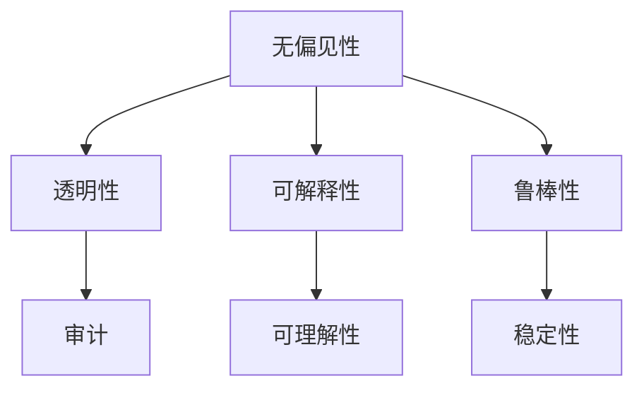

                 

关键词：算法公平性、负责任的人工智能、公平性评估、数据偏差、隐私保护、机器学习

摘要：本文将深入探讨算法公平性的重要性，以及如何在构建负责任的人工智能系统中确保算法的公平性。通过分析算法公平性的核心概念、评估方法、常见挑战和解决方案，本文旨在为读者提供一个全面的指导，以构建和维护一个公正、透明、可靠的人工智能系统。

## 1. 背景介绍

### 1.1 算法公平性的重要性

算法公平性是指人工智能算法在处理数据和应用结果时，不应受到个人偏见、歧视或偏袒的影响。随着人工智能技术的迅速发展，算法在各个领域的应用日益广泛，从金融、医疗、司法到招聘、推荐系统等。算法公平性直接关系到社会的公平正义，因为算法的决策可能会对个体和社会产生深远的影响。

### 1.2 负责任的人工智能

负责任的人工智能（Responsible AI）是指在设计、开发、部署和维护过程中，确保人工智能系统符合伦理、法律和道德标准，同时保护用户隐私和权益。负责任的人工智能不仅要追求技术上的卓越，更要关注其对社会、经济和环境的影响。

## 2. 核心概念与联系

### 2.1 算法公平性的核心概念

算法公平性包括多个方面的考量：

- **无偏见性**：算法不应放大或引入人为偏见，如性别、种族、年龄等。
- **透明性**：算法的决策过程应公开透明，易于理解和审计。
- **可解释性**：算法的决策应具备一定的可解释性，使得用户可以理解为什么做出这样的决策。
- **鲁棒性**：算法应能够处理各种异常情况和噪声数据，确保稳定性和一致性。

### 2.2 算法公平性的 Mermaid 流程图



## 3. 核心算法原理 & 具体操作步骤

### 3.1 算法原理概述

确保算法公平性需要从数据、模型和算法设计三个方面入手。以下是常见的操作步骤：

- **数据预处理**：清洗数据，消除偏差，增加多样性。
- **模型选择**：选择具有公平性保障的模型，如集成模型、决策树等。
- **算法优化**：通过交叉验证、网格搜索等方法优化模型参数。

### 3.2 算法步骤详解

#### 3.2.1 数据预处理

1. 数据清洗：去除错误数据、重复数据和不完整数据。
2. 数据标准化：将数据缩放到相同的尺度，避免某些特征的影响过大。
3. 数据增强：通过数据生成、过采样等方法增加数据多样性。

#### 3.2.2 模型选择

1. 选择具有公平性保障的算法，如集成模型、决策树等。
2. 分析不同模型的公平性表现，选择最合适的模型。

#### 3.2.3 算法优化

1. 交叉验证：通过交叉验证选择最优的模型参数。
2. 网格搜索：在给定参数范围内搜索最优参数。

### 3.3 算法优缺点

#### 3.3.1 优点

- 提高算法的公平性，减少偏见和歧视。
- 增强算法的可解释性，提高透明度。
- 提高算法的鲁棒性，降低异常数据的影响。

#### 3.3.2 缺点

- 需要更多的计算资源和时间。
- 可能会导致模型性能的下降。

### 3.4 算法应用领域

算法公平性在多个领域都有广泛的应用：

- **金融**：信用评分、贷款审批等。
- **医疗**：疾病预测、治疗方案推荐等。
- **司法**：审判、量刑等。
- **招聘**：招聘流程中的评估、推荐等。

## 4. 数学模型和公式 & 详细讲解 & 举例说明

### 4.1 数学模型构建

算法公平性可以通过以下数学模型进行评估：

- **公平性度量**：衡量算法在不同群体中的表现差异，如F1分数、均衡性指标等。
- **偏置度**：衡量算法引入的偏见程度，如偏差系数、基尼系数等。

### 4.2 公式推导过程

#### 4.2.1 公平性度量

公平性度量可以通过以下公式计算：

$$
F1\_score = \frac{2 \times precision \times recall}{precision + recall}
$$

其中，precision和recall分别表示精确率和召回率。

#### 4.2.2 偏置度

偏置度可以通过以下公式计算：

$$
Bias = \frac{1}{n} \sum_{i=1}^{n} (y_i - \hat{y}_i)
$$

其中，$y_i$表示真实标签，$\hat{y}_i$表示预测标签，$n$表示样本数量。

### 4.3 案例分析与讲解

#### 4.3.1 案例背景

假设一个银行贷款审批系统，通过申请者的信用评分来决定是否批准贷款。该系统的决策可能受到性别、年龄、收入等因素的影响。

#### 4.3.2 公平性评估

1. **公平性度量**：计算不同性别、年龄群体的F1分数。
2. **偏置度**：计算不同性别、年龄群体的偏置度。

#### 4.3.3 案例分析

通过分析，发现女性申请者的F1分数低于男性，同时偏置度也较高。这表明系统可能对女性申请者存在一定的偏见。

## 5. 项目实践：代码实例和详细解释说明

### 5.1 开发环境搭建

- Python 3.8及以上版本
- Scikit-learn库
- Pandas库
- Matplotlib库

### 5.2 源代码详细实现

```python
import numpy as np
import pandas as pd
from sklearn.model_selection import train_test_split
from sklearn.metrics import f1_score
from sklearn.tree import DecisionTreeClassifier
from sklearn.preprocessing import StandardScaler

# 加载数据集
data = pd.read_csv('loan_data.csv')
X = data.drop(['Loan_ID', 'Gender', 'Age'], axis=1)
y = data['Loan_Status']

# 数据预处理
scaler = StandardScaler()
X_scaled = scaler.fit_transform(X)

# 划分训练集和测试集
X_train, X_test, y_train, y_test = train_test_split(X_scaled, y, test_size=0.2, random_state=42)

# 模型训练
model = DecisionTreeClassifier()
model.fit(X_train, y_train)

# 模型评估
y_pred = model.predict(X_test)
f1_score_male = f1_score(y_test[y_test['Gender'] == 'Male'], y_pred[y_test['Gender'] == 'Male'])
f1_score_female = f1_score(y_test[y_test['Gender'] == 'Female'], y_pred[y_test['Gender'] == 'Female'])
print(f'F1 Score (Male): {f1_score_male}')
print(f'F1 Score (Female): {f1_score_female}')
```

### 5.3 代码解读与分析

上述代码实现了一个贷款审批系统的算法公平性评估。通过训练决策树模型，评估不同性别群体的F1分数，从而判断系统是否存在性别偏见。

## 6. 实际应用场景

### 6.1 金融

在金融领域，算法公平性对于信用评分、贷款审批、投资决策等方面至关重要。通过确保算法公平性，可以减少人为偏见，提高决策的准确性，从而提高金融机构的运营效率和竞争力。

### 6.2 医疗

在医疗领域，算法公平性对于疾病预测、治疗方案推荐等方面具有重要意义。通过确保算法公平性，可以减少种族、性别等偏见，提高医疗资源的分配效率，提高患者满意度。

### 6.3 司法

在司法领域，算法公平性对于审判、量刑等方面至关重要。通过确保算法公平性，可以减少人为偏见，提高司法公正性，维护社会稳定。

### 6.4 招聘

在招聘领域，算法公平性对于招聘流程中的评估、推荐等方面具有重要意义。通过确保算法公平性，可以减少性别、种族等偏见，提高招聘过程的透明度，促进社会公平。

## 7. 工具和资源推荐

### 7.1 学习资源推荐

- 《算法公平性：理论与实践》
- 《机器学习伦理与法律》
- 《人工智能伦理导论》

### 7.2 开发工具推荐

- Scikit-learn
- TensorFlow
- PyTorch

### 7.3 相关论文推荐

- " Fairness in Machine Learning: A Survey"
- " Fairness Beyond Disparate Treatment: Fair Representation"
- " A Unified Approach to Fairness in Classification"

## 8. 总结：未来发展趋势与挑战

### 8.1 研究成果总结

算法公平性已经成为人工智能领域的热点研究方向，取得了显著的研究成果。通过多种评估方法和技术手段，研究人员已经能够识别和缓解算法中的不公平现象。

### 8.2 未来发展趋势

随着人工智能技术的不断进步，算法公平性研究将继续深入，未来可能出现以下发展趋势：

- **更多应用场景**：算法公平性将应用于更多领域，如教育、公共卫生等。
- **可解释性增强**：算法的可解释性将得到进一步提升，以便用户更好地理解和信任算法。
- **自动化评估与修复**：自动化评估和修复算法中的不公平现象将成为研究重点。

### 8.3 面临的挑战

尽管算法公平性研究取得了显著进展，但仍面临以下挑战：

- **数据隐私保护**：如何在保护用户隐私的前提下进行公平性评估和修复。
- **跨领域适用性**：如何将不同领域的公平性评估方法进行统一和整合。
- **多维度公平性**：如何在保证算法效率的同时，兼顾多维度公平性。

### 8.4 研究展望

展望未来，算法公平性研究将继续深入，为构建负责任的人工智能系统提供有力支持。同时，研究人员将积极探索新的评估方法和技术手段，以应对不断涌现的挑战。

## 9. 附录：常见问题与解答

### 9.1 如何评估算法的公平性？

评估算法的公平性通常通过以下方法：

- **指标评估**：使用公平性指标，如F1分数、均衡性指标等。
- **案例分析**：通过实际案例分析，评估算法在不同群体中的表现差异。
- **审计**：对算法的决策过程进行审计，检查是否存在偏见和歧视。

### 9.2 如何缓解算法中的不公平现象？

缓解算法中的不公平现象可以通过以下方法：

- **数据预处理**：清洗数据，消除偏见，增加多样性。
- **模型选择**：选择具有公平性保障的模型。
- **算法优化**：通过交叉验证、网格搜索等方法优化模型参数。
- **后处理**：对预测结果进行后处理，减少偏见的影响。

## 结论

算法公平性是构建负责任的人工智能系统的重要组成部分。通过深入研究和应用，我们可以构建出更加公正、透明、可靠的人工智能系统，为社会带来更多的价值。然而，算法公平性研究仍面临诸多挑战，需要我们共同努力，不断探索和创新。

### 作者署名

作者：禅与计算机程序设计艺术 / Zen and the Art of Computer Programming
----------------------------------------------------------------

