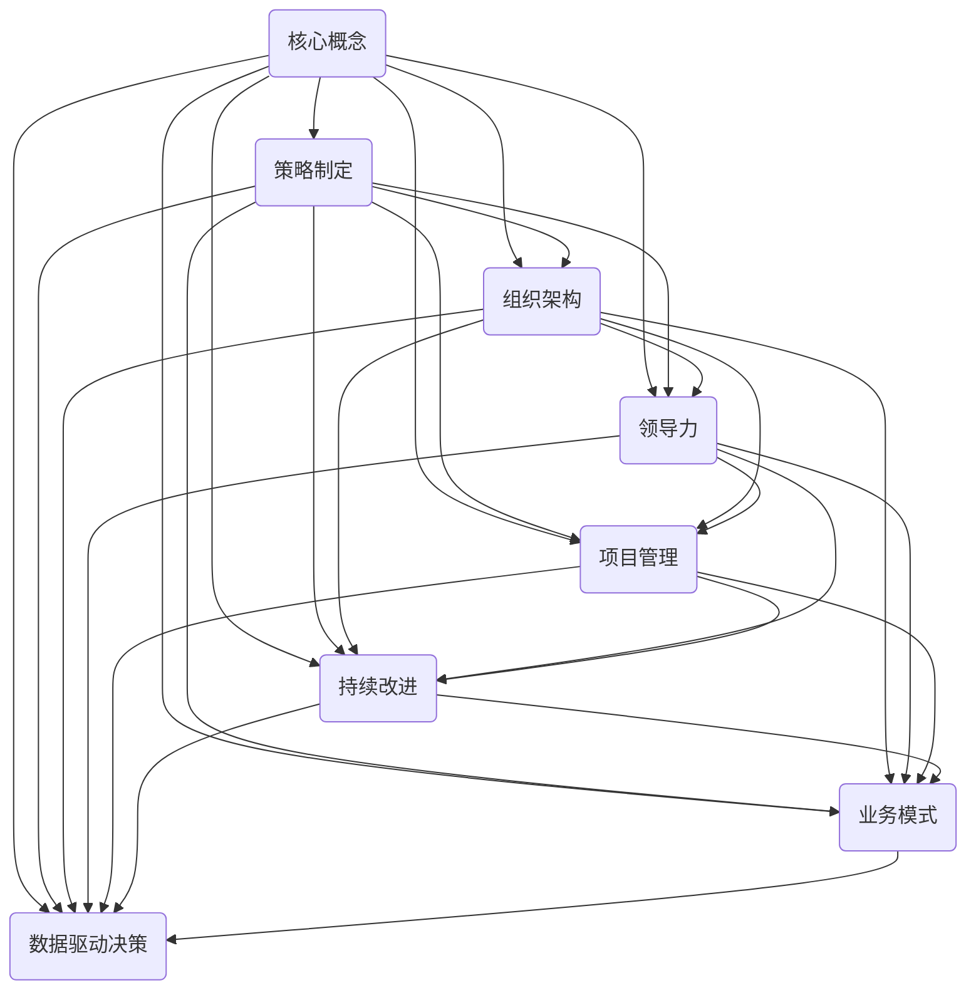

                 

关键词：管理者，方法论，策略，组织，团队，领导力，技术架构，项目管理，持续改进，业务模式，数据驱动决策。

> 摘要：本文旨在探讨管理者如何通过构建并运用自己的方法论，来实现对团队和组织的有效领导。我们将深入分析管理方法论的核心概念、构建步骤、实际应用以及未来趋势和挑战。

## 1. 背景介绍

在当今快速变化和竞争激烈的市场环境中，管理者面临的挑战日益复杂。从战略规划到日常运营，管理者需要具备广泛的知识和技能，以便在多变的环境中保持组织的竞争力。然而，许多管理者发现，尽管他们掌握了各种管理理论和工具，但实际应用中仍面临诸多困难。这些问题包括如何在团队中建立信任、如何制定有效的策略、如何激励员工以及如何在项目中实现目标等。

为了解决这些问题，管理者需要构建并运用自己的方法论。方法论是一种系统化的思考方式，它帮助管理者将理论知识转化为具体的行动步骤，从而实现高效的决策和领导。本文将探讨管理者如何形成自己的方法论，包括核心概念的解析、构建步骤的阐述、实际应用的分析以及未来发展的展望。

## 2. 核心概念与联系

要理解管理方法论，我们首先需要了解一些核心概念和它们之间的联系。以下是一个使用 Mermaid 绘制的流程图，展示了管理方法论中的关键元素及其相互关系。



### 2.1 核心概念解析

- **核心概念**：核心概念是指构成管理方法论的基本要素，包括策略制定、组织架构、领导力、项目管理、持续改进、业务模式和数据驱动决策。

- **策略制定**：策略制定是管理者根据组织目标和环境变化，制定实现目标的行动方案。有效的策略需要考虑内外部环境、资源分配和风险管理。

- **组织架构**：组织架构是组织内部的结构和分工方式，包括组织层次、部门划分和职责分工。合理的组织架构有助于提高组织的效率和协同性。

- **领导力**：领导力是指管理者通过激励、指导和影响员工，实现组织目标的能力。有效的领导力能够建立信任、激发创新和提升团队绩效。

- **项目管理**：项目管理是管理者在项目生命周期内，通过规划、执行、监控和控制，实现项目目标的系列活动。良好的项目管理能够确保项目按时、按预算完成。

- **持续改进**：持续改进是一种管理理念，强调不断寻求改进机会，优化流程、提升质量和效率。持续改进能够帮助组织保持竞争力。

- **业务模式**：业务模式是组织如何创造、传递和获取价值的方式。有效的业务模式能够确保组织实现可持续盈利。

- **数据驱动决策**：数据驱动决策是指管理者基于数据分析和事实，做出更明智的决策。数据驱动决策能够提高决策的准确性和效率。

## 3. 核心算法原理 & 具体操作步骤

### 3.1 算法原理概述

管理方法论的核心算法原理可以概括为以下四个方面：

1. **系统化思考**：管理者需要运用系统化思考，从整体角度分析问题，理解各要素之间的相互关系，从而制定全面、有效的策略。
2. **数据驱动**：管理者应充分利用数据分析和事实，做出基于数据的决策，提高决策的准确性和效率。
3. **持续改进**：管理者应不断寻求改进机会，优化流程、提升质量和效率，保持组织的竞争力。
4. **创新思维**：管理者应鼓励创新思维，激发员工的创造力和创新能力，推动组织持续发展。

### 3.2 算法步骤详解

1. **明确目标**：管理者首先需要明确组织的长期和短期目标，确保目标和策略的一致性。
2. **环境分析**：管理者应对内外部环境进行深入分析，了解行业趋势、竞争态势、市场需求和资源状况。
3. **制定策略**：基于目标和环境分析，管理者应制定具体的策略，包括资源配置、行动方案和时间表。
4. **组织架构设计**：管理者应根据策略需求，设计合理的组织架构，明确部门划分和职责分工。
5. **领导力培养**：管理者应通过培训、激励和指导，提升员工的领导力和执行力。
6. **项目管理**：管理者应运用项目管理知识，确保项目按时、按预算完成。
7. **数据驱动决策**：管理者应建立数据收集和分析体系，定期评估策略和目标的实现情况，及时调整决策。
8. **持续改进**：管理者应鼓励员工提出改进建议，不断优化流程、提升质量和效率。
9. **创新推动**：管理者应关注行业前沿技术，推动创新项目的开展，保持组织的竞争力。

### 3.3 算法优缺点

**优点：**

1. **提高决策效率**：系统化思考和数据驱动决策能够提高管理者的决策效率，减少决策失误。
2. **优化资源配置**：明确的目标和策略有助于优化资源配置，提高组织的运营效率。
3. **增强团队凝聚力**：领导力和创新思维的培养能够增强团队凝聚力，激发员工潜力。
4. **保持竞争力**：持续改进和创新推动有助于组织在快速变化的市场环境中保持竞争力。

**缺点：**

1. **实施难度**：管理方法论的实施需要管理者具备较高的综合素质和执行力，对管理者要求较高。
2. **数据依赖**：过度依赖数据可能导致管理者忽视其他重要的决策因素，如员工感受和市场需求。
3. **创新风险**：创新项目可能面临失败的风险，需要管理者具备一定的风险承受能力。

### 3.4 算法应用领域

管理方法论适用于各个行业和组织，以下是一些常见应用领域：

1. **企业**：企业可以通过管理方法论优化战略规划、提高运营效率、激发员工创新。
2. **政府机构**：政府机构可以通过管理方法论提高公共服务的质量，优化政策制定和执行。
3. **非营利组织**：非营利组织可以通过管理方法论提高资源利用效率，提升社会影响力。
4. **教育机构**：教育机构可以通过管理方法论优化课程设置、提升教学质量和学生满意度。

## 4. 数学模型和公式 & 详细讲解 & 举例说明

### 4.1 数学模型构建

管理方法论中的数学模型主要包括决策树、线性回归、神经网络等。以下是一个使用 LaTeX 格式的决策树模型示例：

$$
\begin{array}{c|c|c}
 & \text{条件} & \text{结果} \\
\hline
\text{利润} & \text{高} & \text{扩大生产} \\
\text{利润} & \text{中} & \text{保持现状} \\
\text{利润} & \text{低} & \text{缩减生产} \\
\end{array}
$$

### 4.2 公式推导过程

以下是一个线性回归模型的公式推导过程：

$$
y = \beta_0 + \beta_1x_1 + \beta_2x_2 + ... + \beta_nx_n
$$

其中，$y$ 是因变量，$x_1, x_2, ..., x_n$ 是自变量，$\beta_0, \beta_1, \beta_2, ..., \beta_n$ 是回归系数。

### 4.3 案例分析与讲解

以下是一个基于神经网络的管理方法论案例：

假设一家公司需要预测未来三个月的销售额，管理者采用神经网络模型进行预测。以下是神经网络模型的参数设置和训练过程：

1. **参数设置**：

   - 输入层：时间、销售渠道、市场竞争程度等
   - 隐藏层：10个神经元
   - 输出层：未来三个月的销售额

2. **训练过程**：

   - 收集历史销售数据，包括时间、销售渠道、市场竞争程度和销售额
   - 对数据进行预处理，包括归一化和去噪
   - 使用反向传播算法训练神经网络，调整网络参数，使预测误差最小
   - 评估模型性能，包括均方误差、准确率等

通过训练，管理者得到一个性能较好的神经网络模型，可以用于预测未来三个月的销售额。在实际应用中，管理者可以根据预测结果调整销售策略，提高销售额。

## 5. 项目实践：代码实例和详细解释说明

### 5.1 开发环境搭建

为了实现管理方法论中的项目管理功能，我们选择 Python 作为开发语言，并使用以下工具和库：

- Python 3.8
- Jupyter Notebook
- Scikit-learn（用于线性回归和神经网络模型）
- Pandas（用于数据处理）
- Matplotlib（用于数据可视化）

### 5.2 源代码详细实现

以下是一个基于线性回归的项目管理代码实例：

```python
import pandas as pd
from sklearn.linear_model import LinearRegression
from sklearn.model_selection import train_test_split
import matplotlib.pyplot as plt

# 加载数据
data = pd.read_csv('project_data.csv')
X = data[['time', 'sales_channel', 'market_competition']]
y = data['sales']

# 数据预处理
X_train, X_test, y_train, y_test = train_test_split(X, y, test_size=0.2, random_state=42)

# 训练模型
model = LinearRegression()
model.fit(X_train, y_train)

# 预测结果
y_pred = model.predict(X_test)

# 评估模型性能
mse = mean_squared_error(y_test, y_pred)
print('MSE:', mse)

# 可视化结果
plt.scatter(X_test['time'], y_test, color='blue', label='实际值')
plt.plot(X_test['time'], y_pred, color='red', label='预测值')
plt.xlabel('时间')
plt.ylabel('销售额')
plt.legend()
plt.show()
```

### 5.3 代码解读与分析

以上代码实现了以下功能：

1. **数据加载与预处理**：使用 Pandas 读取 CSV 数据，并将时间、销售渠道和市场竞争程度作为输入特征，销售额作为输出目标。
2. **模型训练**：使用 Scikit-learn 中的线性回归模型对训练数据进行训练，得到模型参数。
3. **预测结果**：使用训练好的模型对测试数据进行预测，并计算均方误差评估模型性能。
4. **可视化结果**：使用 Matplotlib 将实际值和预测值进行可视化，帮助管理者分析项目进展。

通过以上代码实例，管理者可以了解项目管理中的线性回归模型实现方法，并根据项目需求进行调整和优化。

## 6. 实际应用场景

### 6.1 企业运营

在企业运营中，管理者可以通过构建并运用管理方法论，实现以下目标：

- **提高运营效率**：通过系统化思考和数据驱动决策，优化流程和资源配置，提高企业运营效率。
- **提升员工满意度**：通过领导力和创新思维的培养，激发员工潜力，提升员工满意度。
- **实现可持续盈利**：通过持续改进和创新推动，保持企业竞争力，实现可持续盈利。

### 6.2 政府管理

在政府管理中，管理者可以通过构建并运用管理方法论，实现以下目标：

- **提高公共服务质量**：通过数据驱动决策和持续改进，优化公共服务流程，提高公共服务质量。
- **提升政府形象**：通过有效的领导和团队协作，提升政府形象，增强公众信任。
- **实现高效治理**：通过系统化思考和策略制定，实现高效治理，提高政府治理能力。

### 6.3 教育机构

在教育机构中，管理者可以通过构建并运用管理方法论，实现以下目标：

- **优化课程设置**：通过数据分析和持续改进，优化课程设置，提高教学质量。
- **提升学生满意度**：通过领导力和创新思维的培养，激发学生学习兴趣，提升学生满意度。
- **实现教育公平**：通过系统化思考和策略制定，实现教育公平，提高教育质量。

## 7. 未来应用展望

### 7.1 人工智能与数据驱动的管理方法论

随着人工智能和数据技术的发展，管理方法论将更加智能化和数据化。未来，管理者可以通过以下方式运用人工智能：

- **自动化决策**：利用机器学习算法，实现自动化决策，提高决策效率和准确性。
- **个性化管理**：通过数据分析和用户画像，实现个性化管理，提高管理针对性和效果。
- **智能协作**：利用人工智能技术，实现团队内部智能协作，提高团队协作效率。

### 7.2 可持续发展的管理方法论

未来，管理者将更加重视可持续发展，通过以下方式构建可持续发展管理方法论：

- **绿色运营**：通过优化流程和资源配置，实现绿色运营，降低环境影响。
- **社会责任**：通过履行社会责任，实现企业可持续发展，提升企业形象。
- **创新能力**：通过持续创新，推动技术进步和产业升级，实现可持续发展。

### 7.3 新型组织模式

随着数字化和全球化的发展，新型组织模式将不断涌现。未来，管理者将面临以下挑战：

- **分布式管理**：如何实现分布式管理，提高组织协同性和效率。
- **远程协作**：如何提高远程协作效果，增强团队凝聚力。
- **跨文化管理**：如何处理跨文化冲突，实现文化融合。

## 8. 总结：未来发展趋势与挑战

### 8.1 研究成果总结

本文通过对管理方法论的核心概念、构建步骤、实际应用和未来发展趋势的探讨，总结了以下研究成果：

- 管理方法论是一种系统化的思考方式，有助于管理者实现高效决策和领导。
- 构建管理方法论的关键在于明确目标、环境分析和策略制定。
- 管理方法论在各个行业和组织中具有广泛的应用前景。
- 未来，管理方法论将向智能化、数据化和可持续发展的方向发展。

### 8.2 未来发展趋势

未来，管理方法论将呈现以下发展趋势：

- 人工智能与数据驱动的管理方法论将不断成熟，提高管理效率和准确性。
- 可持续发展的管理方法论将受到更多关注，推动企业和社会可持续发展。
- 新型组织模式将不断涌现，挑战管理者如何实现高效分布式管理和远程协作。

### 8.3 面临的挑战

未来，管理者在运用管理方法论过程中将面临以下挑战：

- 如何在数据驱动的管理方法论中平衡数据与其他决策因素。
- 如何在快速变化的市场环境中保持竞争力，实现可持续发展。
- 如何在新型组织模式中实现高效协同和跨文化管理。

### 8.4 研究展望

未来的研究可以从以下方向展开：

- 深入探讨人工智能在管理方法论中的应用，提高管理效率和准确性。
- 探索可持续发展管理方法论的具体实践，推动企业和社会可持续发展。
- 研究新型组织模式的管理方法论，为分布式管理和远程协作提供理论支持。

## 9. 附录：常见问题与解答

### 问题 1：管理方法论与常规管理有何区别？

管理方法论是一种系统化的思考方式，强调将理论知识转化为具体的行动步骤。而常规管理主要侧重于日常运营和执行。管理方法论有助于管理者在复杂环境中实现高效决策和领导，而常规管理则侧重于保证组织正常运行。

### 问题 2：如何确保管理方法论的有效性？

确保管理方法论的有效性需要以下几个步骤：

- 明确目标和策略：确保管理方法论与组织目标一致。
- 数据驱动：充分利用数据分析和事实，提高决策准确性。
- 持续改进：不断寻求改进机会，优化流程和策略。
- 培训与指导：通过培训和指导，提升员工的能力和执行力。

### 问题 3：管理方法论是否适用于所有组织？

管理方法论具有广泛适用性，可以应用于不同行业和组织。然而，在具体应用中，管理者需要根据组织特点和需求进行适当调整和优化，以实现最佳效果。

### 问题 4：如何应对快速变化的市场环境？

在快速变化的市场环境中，管理者可以采取以下措施：

- 灵活调整策略：根据市场变化，及时调整目标和策略。
- 数据驱动：充分利用数据分析和预测，提高决策效率。
- 创新驱动：鼓励员工提出创新想法，推动组织发展。
- 持续学习：保持学习态度，不断更新知识和技能。

### 问题 5：管理方法论是否需要不断更新？

是的，随着市场环境和技术的发展，管理方法论需要不断更新和完善。管理者应关注行业趋势、技术创新和员工需求，及时调整管理方法论，以提高管理效率和效果。

## 作者署名

作者：禅与计算机程序设计艺术 / Zen and the Art of Computer Programming
----------------------------------------------------------------
### 最终提示

请在撰写完文章后，检查文章内容的完整性、逻辑性、结构紧凑性和文章风格的吸引力。确保文章内容准确无误，格式规范，Markdown语法正确。最后，在文章末尾添加作者署名。祝您写作顺利！
--------------------------------------------------------------------

