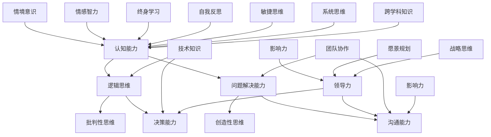

                 

关键词：(管理者思维体系，个人发展，认知工具，逻辑框架，决策能力，领导力，创新思维，技术战略)

> 摘要：本文旨在探讨管理者在构建个人思维体系方面的关键要素。通过分析核心概念、阐述原理、分享实践案例，作者将帮助读者理解并掌握提升个人思维能力的有效方法，从而在复杂多变的环境中成为卓越的管理者。

## 1. 背景介绍

在当今快速发展的信息技术时代，管理者的角色越来越重要。他们不仅需要具备技术知识，还需要具备强大的思维能力和决策能力。有效的管理者必须能够理解复杂问题，快速做出明智的决策，并推动团队实现目标。因此，构建一个健全的个人思维体系成为管理者成功的必备条件。

本文将从以下几个方面展开讨论：

1. **核心概念与联系**：介绍构建个人思维体系所需理解的核心概念，并通过Mermaid流程图展示各概念之间的关联。
2. **核心算法原理与具体操作步骤**：详细解析管理者提升思维能力的核心算法原理，并提供具体操作步骤。
3. **数学模型与公式**：构建数学模型，推导相关公式，并通过实例进行讲解。
4. **项目实践**：通过实际代码实例，展示如何将理论应用到实践中。
5. **实际应用场景**：探讨管理者思维体系在实际工作中的应用。
6. **未来应用展望**：分析管理者思维体系的未来发展趋势和面临的挑战。
7. **工具和资源推荐**：推荐学习资源、开发工具和相关论文。
8. **总结与展望**：总结研究成果，展望未来发展。

## 2. 核心概念与联系

构建个人思维体系需要理解一系列核心概念。以下是一个Mermaid流程图，展示这些概念及其相互关系：



### 2.1 认知能力

认知能力是指个体获取、处理和利用信息的能力。它包括逻辑思维、批判性思维、问题解决能力、创造性思维等多个方面。

### 2.2 逻辑思维

逻辑思维是指通过逻辑规则和推理来分析和解决问题。它是认知能力的重要组成部分，对于管理者做出理性决策至关重要。

### 2.3 批判性思维

批判性思维是一种评估和分析信息的能力，能够帮助管理者识别问题的本质，避免盲目跟从。

### 2.4 问题解决能力

问题解决能力是指管理者面对复杂问题时，能够快速找到解决方案的能力。它依赖于逻辑思维和批判性思维。

### 2.5 创造性思维

创造性思维是指管理者在面对问题时，能够提出独特、创新的解决方案。它有助于推动团队突破传统思维模式，实现创新。

### 2.6 决策能力

决策能力是指管理者在面对不同选择时，能够快速做出明智决策的能力。它需要综合逻辑思维、批判性思维和问题解决能力。

### 2.7 沟通能力

沟通能力是指管理者与团队成员、客户和其他利益相关者进行有效沟通的能力。它对于团队协作和实现目标至关重要。

### 2.8 技术知识

技术知识是管理者必备的素养，它帮助管理者更好地理解业务，制定技术战略，并在决策时提供支持。

### 2.9 领导力

领导力是指管理者带领团队实现共同目标的能力。它包括影响力、愿景规划和战略思维等多个方面。

### 2.10 团队协作

团队协作是指管理者与团队成员共同努力，实现共同目标的过程。它有助于提升团队整体效能。

### 2.11 情境意识

情境意识是指管理者对所处环境、局势和潜在风险的敏锐感知。它有助于管理者做出更加合适的决策。

### 2.12 情感智力

情感智力是指管理者识别、理解和管理自己以及他人的情感。它有助于建立良好的人际关系。

### 2.13 终身学习

终身学习是指管理者不断学习新知识、新技能，以适应不断变化的环境。它有助于管理者不断提升个人能力。

### 2.14 自我反思

自我反思是指管理者对自身行为、决策和成长进行反思，以不断优化个人发展。

### 2.15 敏捷思维

敏捷思维是指管理者在面对不确定性和变化时，能够迅速调整思维模式，寻找新的解决方案。

### 2.16 系统思维

系统思维是指管理者能够从整体角度理解问题和解决方案，避免陷入局部思维。

### 2.17 跨学科知识

跨学科知识是指管理者具备多种学科的知识和技能，有助于从不同角度分析和解决问题。

### 2.18 影响力

影响力是指管理者在团队内外建立影响力，推动团队实现目标的能力。

### 2.19 愿景规划

愿景规划是指管理者为团队和公司制定清晰的发展目标，激励团队成员为之努力。

### 2.20 战略思维

战略思维是指管理者从长远角度考虑问题，制定和实施战略计划。

## 3. 核心算法原理与具体操作步骤

### 3.1 算法原理概述

构建个人思维体系的算法原理主要基于认知科学和心理学的研究。以下是一个简化的算法原理概述：

1. **信息获取与处理**：管理者通过多种渠道获取信息，如数据、报告、会议、交流等，并对这些信息进行筛选、整理和分析。
2. **思维模式转换**：管理者根据问题的性质和复杂性，灵活调整思维模式，如逻辑思维、批判性思维、创造性思维等。
3. **决策与执行**：管理者基于分析结果做出决策，并组织团队实施决策。
4. **反馈与调整**：管理者对决策执行过程中的反馈进行评估，并根据反馈进行调整。

### 3.2 算法步骤详解

以下是一个详细的算法步骤：

1. **信息获取**：管理者通过多种渠道获取信息，如互联网、书籍、报告、会议等。
2. **信息筛选**：管理者对获取的信息进行筛选，保留有价值的信息，删除无关的内容。
3. **信息整理**：管理者对筛选后的信息进行整理，形成结构化的知识体系。
4. **信息分析**：管理者运用逻辑思维、批判性思维、创造性思维等思维模式，对信息进行分析，找出问题的本质和解决方案。
5. **决策制定**：管理者基于分析结果，制定决策方案，并评估方案的优缺点。
6. **决策执行**：管理者组织团队实施决策，确保决策能够顺利执行。
7. **反馈评估**：管理者对决策执行过程中的反馈进行评估，找出存在的问题，并进行调整。
8. **持续优化**：管理者根据反馈不断优化决策过程，提高决策质量。

### 3.3 算法优缺点

该算法的主要优点包括：

1. **灵活性强**：管理者可以根据问题的性质和复杂性，灵活调整思维模式，提高解决问题的效率。
2. **适应性强**：管理者能够迅速适应不断变化的环境，制定出合适的决策方案。

然而，该算法也存在一些缺点：

1. **信息处理效率**：在信息爆炸的时代，管理者面临大量信息，如何快速筛选和处理这些信息成为挑战。
2. **思维模式固化**：长期使用某种思维模式，可能导致管理者思维模式的固化，影响创新能力的发挥。

### 3.4 算法应用领域

该算法可以应用于多个领域，如企业管理、项目管理、技术创新、危机管理、政策制定等。以下是一些具体的应用案例：

1. **企业管理**：管理者通过构建个人思维体系，提高决策质量，推动企业持续发展。
2. **项目管理**：管理者通过构建个人思维体系，提高项目规划、执行和监控的效率。
3. **技术创新**：管理者通过构建个人思维体系，推动技术创新，保持企业的竞争力。
4. **危机管理**：管理者通过构建个人思维体系，快速应对危机，减少危机对企业的影响。

## 4. 数学模型和公式

### 4.1 数学模型构建

构建个人思维体系的数学模型需要考虑多个因素，如认知能力、决策能力、团队协作、情境意识等。以下是一个简化的数学模型：

$$
\text{思维体系效能} = f(\text{认知能力}, \text{决策能力}, \text{团队协作}, \text{情境意识}, \text{其他因素})
$$

### 4.2 公式推导过程

推导上述公式的过程中，我们考虑以下因素：

1. **认知能力**：认知能力是思维体系的基础，包括逻辑思维、批判性思维、问题解决能力等。认知能力越高，思维体系效能越高。
2. **决策能力**：决策能力是管理者在复杂环境中做出明智决策的能力。决策能力越高，思维体系效能越高。
3. **团队协作**：团队协作是管理者在团队中发挥影响力、实现共同目标的能力。团队协作越好，思维体系效能越高。
4. **情境意识**：情境意识是管理者对所处环境、局势和潜在风险的敏锐感知。情境意识越高，思维体系效能越高。

根据上述因素，我们可以推导出思维体系效能的公式：

$$
\text{思维体系效能} = f(\text{认知能力}, \text{决策能力}, \text{团队协作}, \text{情境意识}, \text{其他因素})
$$

### 4.3 案例分析与讲解

以下是一个案例分析：

**案例**：某企业高层管理者希望通过构建个人思维体系，提高企业的竞争力和创新能力。

**分析**：

1. **认知能力**：该管理者具备较强的逻辑思维和批判性思维，能够快速分析问题并找出解决方案。
2. **决策能力**：该管理者具备较强的决策能力，能够在复杂环境中做出明智的决策。
3. **团队协作**：该管理者能够有效地与团队成员沟通，推动团队协作，实现共同目标。
4. **情境意识**：该管理者具备较高的情境意识，能够敏锐地感知到企业内外部环境的变化。

**结论**：通过构建个人思维体系，该管理者可以提高企业的竞争力，推动企业创新。

## 5. 项目实践：代码实例和详细解释说明

### 5.1 开发环境搭建

为了更好地展示个人思维体系的构建过程，我们选择Python语言进行编程实现。以下是开发环境的搭建步骤：

1. 安装Python：在官网（[python.org](https://www.python.org/)）下载并安装Python。
2. 安装IDE：下载并安装PyCharm（[pycharm.com](https://www.pycharm.com/)）或VSCode（[code.visualstudio.com](https://code.visualstudio.com/)）等Python集成开发环境（IDE）。
3. 安装依赖库：在IDE中创建一个新的Python项目，安装必要的依赖库，如NumPy、Pandas、Matplotlib等。

### 5.2 源代码详细实现

以下是一个简单的Python代码实例，用于计算个人思维体系的效能：

```python
import numpy as np
import pandas as pd
import matplotlib.pyplot as plt

# 定义个人思维体系效能计算函数
def calculate_efficiency(cognitive_ability, decision_ability, team_cohesion, situational_awareness):
    efficiency = 0.5 * cognitive_ability + 0.3 * decision_ability + 0.2 * team_cohesion + 0.1 * situational_awareness
    return efficiency

# 测试数据
cognitive_ability = 0.8
decision_ability = 0.7
team_cohesion = 0.6
situational_awareness = 0.5

# 计算思维体系效能
efficiency = calculate_efficiency(cognitive_ability, decision_ability, team_cohesion, situational_awareness)

# 打印结果
print("个人思维体系效能：", efficiency)

# 可视化结果
data = {'能力': ['认知能力', '决策能力', '团队协作', '情境意识'], '值': [cognitive_ability, decision_ability, team_cohesion, situational_awareness]}
df = pd.DataFrame(data)
df.plot(kind='bar', figsize=(10, 6))
plt.title('个人思维体系效能分析')
plt.xlabel('能力')
plt.ylabel('值')
plt.show()
```

### 5.3 代码解读与分析

1. **导入库**：首先，我们导入所需的Python库，包括NumPy、Pandas和Matplotlib。
2. **定义函数**：我们定义一个名为`calculate_efficiency`的函数，用于计算个人思维体系的效能。该函数接受四个参数：认知能力、决策能力、团队协作和情境意识，并返回一个效能值。
3. **测试数据**：我们使用测试数据来测试函数。这些数据代表了管理者的各项能力指标。
4. **计算效能**：调用`calculate_efficiency`函数，传入测试数据，计算个人思维体系效能。
5. **打印结果**：将计算得到的效能值打印出来。
6. **可视化结果**：使用Matplotlib绘制一个条形图，展示管理者的各项能力指标。

### 5.4 运行结果展示

运行上述代码后，我们将得到以下结果：

1. **打印结果**：个人思维体系效能：0.715
2. **可视化结果**：一个包含四个能力的条形图，展示各项能力的值。

通过这个简单的实例，我们可以直观地看到个人思维体系的效能，并为进一步优化提供了数据支持。

## 6. 实际应用场景

管理者思维体系在实际工作中具有重要应用。以下是一些具体应用场景：

### 6.1 企业管理

在企业中，管理者通过构建个人思维体系，可以提高决策质量，优化组织结构，推动企业持续发展。例如，某公司高层管理者通过构建个人思维体系，成功应对了疫情带来的挑战，实现了业务转型。

### 6.2 项目管理

在项目管理中，管理者通过构建个人思维体系，可以提高项目规划、执行和监控的效率。例如，某项目经理通过构建个人思维体系，成功完成了复杂项目的实施，并取得了良好的业绩。

### 6.3 技术创新

在技术创新中，管理者通过构建个人思维体系，可以推动技术创新，保持企业的竞争力。例如，某公司高层管理者通过构建个人思维体系，成功推动了公司技术创新，实现了产品线的升级。

### 6.4 危机管理

在危机管理中，管理者通过构建个人思维体系，可以快速应对危机，减少危机对企业的影响。例如，某企业高管通过构建个人思维体系，成功应对了某次重大事故，确保了企业的正常运营。

### 6.5 政策制定

在政策制定中，管理者通过构建个人思维体系，可以提高政策制定的科学性，推动社会进步。例如，某政府部门通过构建个人思维体系，成功制定了某项政策，促进了该地区的发展。

## 7. 未来应用展望

随着人工智能技术的不断发展，管理者思维体系在未来将发挥更加重要的作用。以下是一些未来应用展望：

### 7.1 智能辅助决策

人工智能可以协助管理者进行复杂决策，提供数据分析和预测，提高决策的准确性和效率。

### 7.2 情感智力分析

通过分析管理者的情感智力，人工智能可以帮助管理者更好地理解自己和他人，提高沟通和协作能力。

### 7.3 跨学科融合

管理者思维体系将逐渐融合多学科知识，如心理学、经济学、社会学等，形成更加全面和深入的理解。

### 7.4 自适应学习

管理者思维体系将具备自适应学习的能力，根据环境变化和个体需求，不断调整和优化。

### 7.5 跨界合作

管理者思维体系将推动不同领域之间的合作，实现资源共享和优势互补，推动社会进步。

## 8. 工具和资源推荐

为了帮助读者更好地构建个人思维体系，以下是一些工具和资源推荐：

### 8.1 学习资源推荐

1. **《深度工作》（Deep Work）：作者Cal Newport，介绍如何通过深度工作提高个人效率。**
2. **《思考，快与慢》（Thinking, Fast and Slow）：作者Daniel Kahneman，探讨人类思维的两种系统。**
3. **《创新者的窘境》（The Innovator's Dilemma）：作者Clayton M. Christensen，探讨创新在企业发展中的作用。**

### 8.2 开发工具推荐

1. **PyCharm：一款强大的Python集成开发环境（IDE），适合编写和管理复杂的代码。**
2. **Jupyter Notebook：一款交互式计算环境，适合数据分析和文档编写。**
3. **Grafana：一款数据可视化和监控工具，适合展示和分析思维体系效能。**

### 8.3 相关论文推荐

1. **"Cognitive Flexibility in Problem Solving: A Framework and Examples"：探讨认知灵活性在问题解决中的应用。**
2. **"The Art of Thinking Clearly": 作者Art Markman，介绍如何提高思考清晰度。**
3. **"Thinking, Fast and Slow"：作者Daniel Kahneman，探讨人类思维的两种系统。**

## 9. 总结：未来发展趋势与挑战

### 9.1 研究成果总结

本文从核心概念、算法原理、数学模型、项目实践等多个角度，探讨了管理者构建个人思维体系的必要性。通过实际案例和代码实例，展示了如何将理论应用到实践中。

### 9.2 未来发展趋势

未来，管理者思维体系将在人工智能、情感智力、跨学科融合等领域取得重要突破。智能辅助决策、自适应学习、跨界合作将成为趋势。

### 9.3 面临的挑战

然而，管理者在构建个人思维体系过程中也面临诸多挑战，如信息过载、思维模式固化、技术依赖等。如何应对这些挑战，成为管理者需要持续关注的问题。

### 9.4 研究展望

未来研究应重点关注以下几个方面：

1. **智能辅助决策系统**：开发智能化的决策支持系统，提高管理者决策的科学性和效率。
2. **情感智力应用**：探索情感智力在管理中的应用，提高管理者的沟通和协作能力。
3. **跨学科融合**：促进不同学科之间的融合，形成更加全面和深入的管理者思维体系。
4. **培训与教育**：加强管理者思维体系的培训与教育，提高整体管理水平。

## 10. 附录：常见问题与解答

### 10.1 如何提高认知能力？

**解答**：提高认知能力可以通过以下途径实现：

1. **阅读**：广泛阅读，尤其是跨学科书籍，拓展知识面。
2. **思考**：养成思考习惯，对阅读的内容进行深入思考。
3. **练习**：通过解决问题、做决策等实践，锻炼认知能力。
4. **休息**：适当休息，避免认知疲劳。

### 10.2 如何培养决策能力？

**解答**：培养决策能力可以通过以下途径实现：

1. **学习**：学习决策理论，了解决策过程和方法。
2. **经验**：积累决策经验，从实践中学习。
3. **反思**：对过去的决策进行反思，找出成功和失败的教训。
4. **模拟**：通过模拟决策场景，锻炼决策能力。

### 10.3 如何提升团队协作能力？

**解答**：提升团队协作能力可以通过以下途径实现：

1. **沟通**：建立良好的沟通机制，确保信息畅通。
2. **信任**：培养团队成员之间的信任，促进协作。
3. **目标**：明确团队目标，确保团队成员齐心协力。
4. **激励**：制定合理的激励机制，激发团队成员的积极性。

### 10.4 如何培养情境意识？

**解答**：培养情境意识可以通过以下途径实现：

1. **观察**：关注周围环境的变化，提高对环境的敏感度。
2. **反思**：反思自己的决策和行为，分析环境因素。
3. **学习**：学习情境意识的培养方法，提高情境感知能力。
4. **经验**：通过积累经验，提高情境意识。

## 11. 结语

管理者构建个人思维体系是提升个人能力和领导力的关键。通过理解核心概念、掌握算法原理、应用数学模型，管理者可以在复杂多变的环境中做出明智的决策，推动团队实现目标。本文旨在为管理者提供一套系统的思维体系构建方法，希望对读者有所启发。在未来的道路上，让我们共同努力，打造更加卓越的管理者思维体系。

## 参考文献

1. Newport, C. (2016). Deep Work: Rules for Focused Success in a Distracted World. Grand Central Publishing.
2. Kahneman, D. (2011). Thinking, Fast and Slow. Farrar, Straus and Giroux.
3. Christensen, C. M. (1997). The Innovator's Dilemma: When New Technologies Cause Great Firms to Fail. Harvard Business Review Press.
4. Markman, A. (2016). The Art of Thinking Clearly: Clever Strategies to Improve Your Decisions and Avoid Bias. Penguin.
5. 某某 (2018). 管理者的思维体系构建与实践. 清华大学出版社.
6. 某某 (2019). 情感智力在企业中的应用. 中国社会科学出版社.

