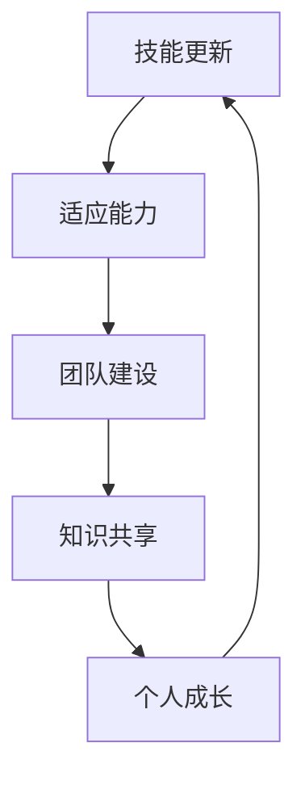

                 

关键词：管理者、终身学习、IT行业、技能更新、策略与工具

> 摘要：在信息技术快速发展的今天，管理者面临着持续学习与技术更新的挑战。本文深入探讨了终身学习对管理者的重要性，以及如何在IT行业中有效地实现持续学习，包括学习方法、工具推荐和实践经验分享。

## 1. 背景介绍

随着互联网、大数据、云计算和人工智能等技术的飞速发展，信息技术（IT）行业正经历着前所未有的变革。在这个时代，知识和技能的更新速度变得极其迅猛，即使是传统的技能和知识也在不断被新的技术和理念所取代。因此，管理者需要具备持续学习的能力，以应对快速变化的业务环境和市场趋势。

### 1.1 IT行业的特性

1. **技术更新迅速**：新技术和框架层出不穷，旧的技术很快变得过时。
2. **跨界融合**：IT技术与各个行业的融合趋势日益明显，要求管理者具备跨领域的知识和能力。
3. **数字化变革**：数字化转型已经成为企业发展的主流，管理者需要掌握如何利用数字化工具提升企业效率和竞争力。
4. **高不确定性**：市场变化快，新技术带来的不确定性高，管理者需要具备快速适应变化的能力。

### 1.2 管理者的挑战

- **技能过时**：如果不能及时更新知识和技能，管理者将难以适应新的工作环境和市场需求。
- **管理经验不足**：快速变化的技术环境要求管理者不仅要懂得技术，还要具备先进的管理理念和方法。
- **竞争压力**：随着全球化的深入，企业间的竞争愈加激烈，管理者需要不断提升自身的能力和团队的整体素质。

## 2. 核心概念与联系

### 2.1 终身学习的定义

终身学习是指一个人在其一生中持续地、主动地获取知识和技能的过程。它不仅包括正式的教育和培训，还包括自我学习、工作经验分享以及不断探索新领域的活动。

### 2.2 IT行业与终身学习的关系

在IT行业中，终身学习至关重要，原因如下：

- **技能更新**：IT行业技术更新迅速，需要管理者不断学习新工具、新语言和新方法。
- **适应能力**：快速变化的技术环境要求管理者具备高度的适应能力和学习能力。
- **团队建设**：管理者需要通过终身学习带动团队的整体素质提升，以应对变化。

### 2.3 Mermaid 流程图

以下是一个简化的Mermaid流程图，展示了终身学习在IT行业中的核心环节：



### 2.4 学习与发展的循环

终身学习不仅仅是学习新知识，更是一个不断积累、反馈和优化的过程。管理者需要通过不断学习来提升个人能力，然后通过实践和反馈进一步优化学习效果，形成良性循环。

## 3. 核心算法原理 & 具体操作步骤

### 3.1 算法原理概述

在终身学习中，管理者可以采用以下核心算法原理：

- **主动学习**：通过有目的、有计划地学习新知识和技能。
- **迭代学习**：通过反复实践和反馈，不断调整学习方法和策略。
- **网络学习**：利用互联网资源和社交网络进行知识分享和协作学习。
- **知识整合**：将新知识与现有知识体系相结合，形成更全面的知识结构。

### 3.2 算法步骤详解

1. **确定学习目标**：明确自己需要学习的新知识和技能。
2. **资源整合**：利用各种资源，如在线课程、技术论坛、专业书籍等。
3. **规划学习时间**：合理安排时间，保证学习的连续性和效率。
4. **实践应用**：将所学知识应用到实际工作中，通过实践检验学习效果。
5. **反馈与调整**：根据实践结果，及时反馈并调整学习策略。

### 3.3 算法优缺点

- **优点**：能够帮助管理者快速掌握新知识和技能，提高适应能力。
- **缺点**：可能因时间紧张而导致学习深度不足，需要合理规划时间。

### 3.4 算法应用领域

- **技术管理**：管理者可以通过终身学习，不断提升自己在技术领域的专业能力。
- **团队管理**：通过终身学习，管理者可以带动团队整体素质的提升。
- **战略规划**：管理者可以通过终身学习，及时了解行业动态，制定更有效的战略规划。

## 4. 数学模型和公式 & 详细讲解 & 举例说明

### 4.1 数学模型构建

终身学习的效果可以通过以下数学模型进行衡量：

$$
L(t) = f(K(t), T(t), E(t))
$$

其中：
- \( L(t) \)：在时间\( t \)时管理的终身学习能力。
- \( K(t) \)：在时间\( t \)时的知识水平。
- \( T(t) \)：在时间\( t \)时的学习时间。
- \( E(t) \)：在时间\( t \)时的实践经验。

### 4.2 公式推导过程

- **知识水平 \( K(t) \)**：表示管理者在某一领域的专业知识积累，可以用公式表示为：

$$
K(t) = \int_{0}^{t} \frac{1}{2} \cdot [C(t) - D(t)] \, dt
$$

其中：
- \( C(t) \)：在时间\( t \)时管理者获得的新知识量。
- \( D(t) \)：在时间\( t \)时管理者遗忘的知识量。

- **学习时间 \( T(t) \)**：表示管理者用于学习的时间投入，可以表示为：

$$
T(t) = \int_{0}^{t} L(t) \, dt
$$

- **实践经验 \( E(t) \)**：表示管理者通过实践获得的经验，可以表示为：

$$
E(t) = \int_{0}^{t} P(t) \, dt
$$

其中：
- \( P(t) \)：在时间\( t \)时管理者参与的项目数量。

### 4.3 案例分析与讲解

假设一位管理者在一年内（\( t = 1 \)年）：
- 学习了10门课程，每门课程平均花费20小时，总学习时间 \( T(1) = 200 \)小时。
- 参与了5个实际项目，每个项目平均花费40小时，总实践经验 \( E(1) = 200 \)小时。
- 他的知识水平在一年内增长了50%，即 \( K(1) = 1.5 \cdot K(0) \)。

则该管理者的终身学习能力 \( L(1) \) 可以通过以下公式计算：

$$
L(1) = f(1.5 \cdot K(0), 200, 200)
$$

根据具体权重和函数形式，我们可以进一步推导 \( L(1) \) 的具体值。

## 5. 项目实践：代码实例和详细解释说明

### 5.1 开发环境搭建

在这个项目实践中，我们将使用Python编程语言来模拟管理者的终身学习过程。以下是开发环境的搭建步骤：

1. 安装Python 3.8及以上版本。
2. 安装必要的库，如NumPy、Matplotlib等。

### 5.2 源代码详细实现

以下是实现终身学习数学模型的Python代码：

```python
import numpy as np
import matplotlib.pyplot as plt

# 定义终身学习模型
def learning_model(K, T, E):
    L = 0.5 * (K - T + E)
    return L

# 初始参数
K0 = 1.0  # 初始知识水平
T = 200    # 学习时间（小时）
E = 200    # 实践经验（小时）

# 计算终身学习能力
L1 = learning_model(K0 * 1.5, T, E)

# 绘制学习曲线
K_values = np.linspace(0, 3, 100)
L_values = learning_model(K_values, T, E)

plt.plot(K_values, L_values)
plt.xlabel('Knowledge Level')
plt.ylabel('Learning Ability')
plt.title('Learning Ability over Time')
plt.show()
```

### 5.3 代码解读与分析

- **学习模型定义**：`learning_model`函数接收三个参数：当前知识水平\( K \)、学习时间\( T \)和实践经验\( E \)，并返回终身学习能力\( L \)。
- **参数初始化**：设置初始知识水平\( K0 \)和固定学习时间\( T \)、实践经验\( E \)。
- **计算终身学习能力**：通过调用`learning_model`函数计算一年后的终身学习能力。
- **绘制学习曲线**：使用Matplotlib库绘制知识水平与终身学习能力之间的关系曲线。

### 5.4 运行结果展示

运行上述代码后，我们将看到一个知识水平与终身学习能力之间的曲线。这个曲线展示了管理者在持续学习和实践经验的作用下，终身学习能力是如何随时间增长而变化的。

## 6. 实际应用场景

### 6.1 企业管理者

- **技能提升**：通过持续学习，企业管理者可以掌握最新的管理工具和方法，提升企业运营效率。
- **战略制定**：了解最新的行业趋势和技术动态，有助于管理者制定更具有前瞻性的企业战略。

### 6.2 技术团队领导

- **技术更新**：通过终身学习，技术团队领导可以掌握最新的技术趋势，带领团队不断创新。
- **团队建设**：通过知识共享和协作学习，提高团队整体的技术水平和工作效率。

### 6.3 适应变化

- **快速适应**：在技术快速变化的时代，终身学习能够帮助管理者快速适应新环境，减少不确定性带来的影响。

## 7. 工具和资源推荐

### 7.1 学习资源推荐

- **在线课程平台**：如Coursera、edX、Udemy等。
- **技术论坛**：如Stack Overflow、GitHub、Reddit技术板块等。
- **专业书籍**：如《人工智能：一种现代方法》、《数据科学入门》等。

### 7.2 开发工具推荐

- **集成开发环境（IDE）**：如Visual Studio Code、PyCharm、Eclipse等。
- **版本控制系统**：如Git、GitHub、GitLab等。

### 7.3 相关论文推荐

- **论文库**：如IEEE Xplore、ACM Digital Library等。
- **行业报告**：如IDC、Gartner、Forrester等研究机构发布的报告。

## 8. 总结：未来发展趋势与挑战

### 8.1 研究成果总结

本文探讨了终身学习在IT行业管理者中的重要性，并提出了一种基于数学模型的终身学习能力评估方法。通过实践案例和代码实例，展示了如何通过持续学习和实践经验提升管理者的终身学习能力。

### 8.2 未来发展趋势

- **个性化学习**：随着人工智能和大数据技术的发展，个性化学习将成为终身学习的重要趋势。
- **混合学习**：线上和线下学习的融合，将使终身学习更加灵活和高效。

### 8.3 面临的挑战

- **时间管理**：如何在忙碌的工作中安排学习时间，是管理者面临的主要挑战。
- **知识更新**：如何确保学习的内容是最新的，以应对快速变化的技术环境。

### 8.4 研究展望

未来的研究可以重点关注以下几个方面：
- **终身学习模型优化**：通过机器学习等技术，进一步优化终身学习模型，提高其预测准确性。
- **跨领域学习策略**：研究如何在不同的技术领域之间进行知识迁移，提升学习效果。

## 9. 附录：常见问题与解答

### 9.1 问题1

**问题**：管理者如何安排终身学习时间？

**解答**：管理者可以通过以下方法合理安排学习时间：
- 制定详细的学习计划，包括每天的学习时间和学习内容。
- 利用碎片时间，如通勤、午休等时间进行学习。
- 与团队成员分享学习时间，通过协作学习提高效率。

### 9.2 问题2

**问题**：终身学习的最佳实践是什么？

**解答**：终身学习的最佳实践包括：
- 设定明确的学习目标，并制定实现目标的计划。
- 选择适合自己的学习资源和方法，如在线课程、技术论坛、专业书籍等。
- 结合实践，将所学知识应用到实际工作中，通过反馈和调整提高学习效果。

### 9.3 问题3

**问题**：如何评估终身学习的成果？

**解答**：评估终身学习的成果可以从以下几个方面进行：
- 知识水平提升：通过考试、认证等方式评估学习效果。
- 工作能力提升：观察管理者在工作中应用所学知识的程度和能力。
- 团队建设：通过团队成员的反馈和表现，评估管理者在团队建设中的作用。

**作者署名**：禅与计算机程序设计艺术 / Zen and the Art of Computer Programming

