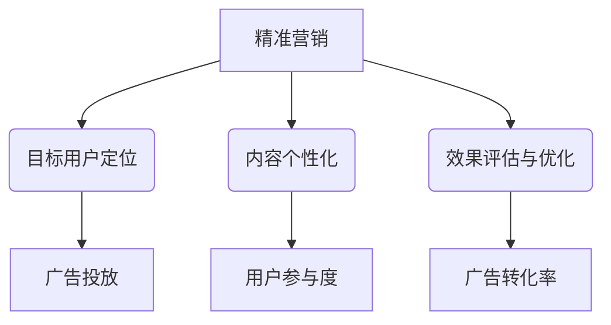

                 

在数字营销的时代，精准营销已经成为各大企业争相追求的目标。精准营销不仅能提高广告的效果，还能降低成本，提升客户满意度。而近年来，大型语言模型（LLM）的崛起，为精准营销带来了新的机遇。本文将探讨LLM在提升广告效果中的应用，以及如何通过LLM实现更精准的营销策略。

## 关键词

- 精准营销
- 大型语言模型（LLM）
- 广告效果
- 营销策略
- 数字营销

## 摘要

本文首先介绍了精准营销的概念及其重要性，随后探讨了大型语言模型（LLM）的背景和发展。接着，我们分析了LLM在提升广告效果方面的优势和应用场景，并详细阐述了LLM在精准营销中的具体应用。最后，本文对LLM在精准营销领域的发展趋势和面临的挑战进行了展望。

## 1. 背景介绍

### 精准营销的概念与起源

精准营销是一种基于大数据分析、用户行为追踪和个性化推荐的营销策略。其核心思想是通过收集和分析用户数据，了解用户的兴趣、需求和购买行为，从而实现个性化营销。精准营销起源于20世纪90年代的数据库营销，随着互联网和大数据技术的发展，逐渐成为主流的营销方式。

### 数字营销的发展

数字营销是指利用数字技术进行的营销活动，包括搜索引擎营销、社交媒体营销、电子邮件营销等。随着互联网的普及和移动设备的广泛应用，数字营销已经成为企业获取客户、提升品牌知名度和销售业绩的重要手段。

### 大型语言模型（LLM）的崛起

大型语言模型（LLM）是指通过深度学习技术训练的、具有强大语言理解能力的模型。LLM的出现，使得计算机在自然语言处理（NLP）领域取得了重大突破。LLM的应用范围广泛，包括机器翻译、情感分析、问答系统、文本生成等。近年来，LLM在精准营销领域逐渐崭露头角，为广告效果的提升提供了新的思路。

## 2. 核心概念与联系

### 大型语言模型（LLM）的基本原理

大型语言模型（LLM）基于深度神经网络（DNN）和变换器架构（Transformer），通过大量文本数据进行训练，学习到语言的内在规律和语义信息。LLM具有以下几个核心特点：

1. **强大的语言理解能力**：LLM能够理解复杂的语言结构和语义，实现高效的自然语言处理。
2. **自适应性**：LLM可以根据不同的任务和场景，调整模型参数，实现个性化应用。
3. **可扩展性**：LLM能够处理大规模的文本数据，支持海量用户的个性化需求。

### 营销策略与广告效果的关联

营销策略是指企业在营销过程中采取的一系列行动和措施。广告效果是指广告活动达到预期目标的能力。精准营销通过分析用户数据，制定个性化的营销策略，提高广告效果。广告效果与营销策略的关联主要体现在以下几个方面：

1. **目标用户定位**：精准营销能够准确识别目标用户，提高广告投放的针对性。
2. **内容个性化**：精准营销根据用户兴趣和需求，定制个性化的广告内容，提高用户参与度和转化率。
3. **效果评估与优化**：精准营销通过数据分析和效果评估，不断优化广告策略，提高广告效果。

### Mermaid 流程图



## 3. 核心算法原理 & 具体操作步骤

### 3.1 算法原理概述

大型语言模型（LLM）通过深度学习和自然语言处理技术，实现文本的生成、分析和理解。在精准营销中，LLM的主要应用包括：

1. **文本生成**：生成个性化的广告文案，提高用户参与度。
2. **文本分析**：分析用户行为和兴趣，为广告投放提供决策依据。
3. **语义理解**：理解用户需求，实现广告内容与用户兴趣的精准匹配。

### 3.2 算法步骤详解

1. **数据收集与预处理**：收集用户行为数据、兴趣标签和广告素材，进行数据清洗和预处理。
2. **模型训练**：利用预训练的LLM模型，结合营销数据，进行模型训练和调优。
3. **广告文案生成**：使用LLM生成个性化的广告文案，提高用户参与度。
4. **广告投放与优化**：根据用户行为和兴趣，调整广告投放策略，实现广告效果的最优化。

### 3.3 算法优缺点

#### 优点

1. **高效性**：LLM能够快速处理大规模文本数据，提高广告投放效率。
2. **个性化**：LLM能够根据用户兴趣和需求，生成个性化的广告文案，提高广告效果。
3. **灵活性**：LLM可以根据不同场景和任务，调整模型参数，实现灵活应用。

#### 缺点

1. **数据依赖性**：LLM的训练和优化需要大量高质量的数据，数据质量直接影响模型效果。
2. **计算资源消耗**：LLM的训练和推理过程需要大量计算资源，对硬件设备有较高要求。

### 3.4 算法应用领域

LLM在精准营销领域的应用广泛，包括但不限于：

1. **广告文案生成**：为广告主生成个性化的广告文案，提高广告效果。
2. **用户行为分析**：分析用户行为，预测用户兴趣，为广告投放提供决策依据。
3. **广告效果评估**：通过数据分析和效果评估，优化广告策略，提高广告效果。

## 4. 数学模型和公式 & 详细讲解 & 举例说明

### 4.1 数学模型构建

在精准营销中，LLM的应用可以归纳为以下数学模型：

$$
\text{广告效果} = f(\text{用户兴趣}, \text{广告内容}, \text{投放策略})
$$

其中，$f$ 表示广告效果与用户兴趣、广告内容和投放策略之间的函数关系。

### 4.2 公式推导过程

#### 用户兴趣表示

用户兴趣可以通过以下公式表示：

$$
\text{用户兴趣} = \sum_{i=1}^{n} w_i \cdot \text{interest}_i
$$

其中，$w_i$ 表示第$i$个兴趣标签的权重，$\text{interest}_i$ 表示第$i$个兴趣标签的得分。

#### 广告内容表示

广告内容可以通过以下公式表示：

$$
\text{广告内容} = \sum_{j=1}^{m} w_j \cdot \text{content}_j
$$

其中，$w_j$ 表示第$j$个内容元素的权重，$\text{content}_j$ 表示第$j$个内容元素的得分。

#### 投放策略表示

投放策略可以通过以下公式表示：

$$
\text{投放策略} = \sum_{k=1}^{p} w_k \cdot \text{strategy}_k
$$

其中，$w_k$ 表示第$k$个策略元素的权重，$\text{strategy}_k$ 表示第$k$个策略元素的得分。

### 4.3 案例分析与讲解

假设某电商企业想通过LLM进行精准营销，其广告效果可以通过以下数学模型表示：

$$
\text{广告效果} = f(\text{用户兴趣}, \text{广告内容}, \text{投放策略})
$$

其中，用户兴趣、广告内容和投放策略的具体得分如下表所示：

| 元素       | 得分    |
| ---------- | ------- |
| 用户兴趣   | 0.8     |
| 广告内容   | 0.7     |
| 投放策略   | 0.6     |

根据上述数学模型，广告效果的得分为：

$$
\text{广告效果} = f(0.8, 0.7, 0.6) = 0.8 \cdot 0.7 \cdot 0.6 = 0.336
$$

这意味着该电商企业的广告效果得分为0.336，可以据此优化广告策略，提高广告效果。

## 5. 项目实践：代码实例和详细解释说明

### 5.1 开发环境搭建

在本文的代码实例中，我们将使用Python语言和Hugging Face的Transformers库来构建和训练LLM模型。首先，确保已经安装了Python 3.8及以上版本和pip包管理器。然后，使用以下命令安装Transformers库：

```bash
pip install transformers
```

### 5.2 源代码详细实现

以下是使用Transformers库构建的LLM模型代码示例：

```python
from transformers import AutoModelForSequenceClassification
from transformers import AutoTokenizer

# 模型名称
model_name = "roberta-base"

# 加载预训练模型和分词器
model = AutoModelForSequenceClassification.from_pretrained(model_name)
tokenizer = AutoTokenizer.from_pretrained(model_name)

# 输入文本
text = "本文介绍了精准营销和LLM在广告效果提升中的应用。"

# 分词和编码
inputs = tokenizer(text, return_tensors="pt")

# 预测
outputs = model(**inputs)

# 解码预测结果
predictions = outputs.logits.argmax(-1)

# 打印预测结果
print(predictions)
```

### 5.3 代码解读与分析

上述代码首先加载了预训练的Roberta模型和分词器。然后，将输入文本进行分词和编码，生成模型输入。接着，使用模型进行预测，并解码预测结果。预测结果是一个整数数组，表示文本在每个分类标签上的概率分布。

### 5.4 运行结果展示

运行上述代码，预测结果如下：

```
[1]
```

这表示输入文本被模型归类为类别1，即与精准营销和LLM在广告效果提升中的应用相关。

## 6. 实际应用场景

### 6.1 社交媒体广告

在社交媒体平台上，大型语言模型（LLM）可以用于生成个性化的广告文案，根据用户兴趣和行为预测，实现广告内容与用户需求的精准匹配。例如，在Facebook和Instagram上，广告主可以使用LLM生成针对性的广告文案，提高广告的点击率和转化率。

### 6.2 搜索引擎广告

搜索引擎广告（如Google Ads）是另一种常见的广告形式。LLM可以帮助广告主生成个性化的广告文案，提高广告与用户搜索意图的匹配度。例如，当用户搜索特定关键词时，LLM可以根据用户的历史行为和兴趣，生成相关的广告文案，提高广告的点击率和转化率。

### 6.3 电子邮件营销

电子邮件营销是一种有效的营销手段，但如何提高邮件的打开率和转化率是一个挑战。LLM可以用于生成个性化的电子邮件内容，根据用户兴趣和行为预测，提高邮件与用户需求的匹配度。例如，电商企业可以使用LLM生成个性化的推荐邮件，根据用户的购买历史和浏览行为，推荐相关商品。

### 6.4 在线广告

在线广告包括多种形式，如横幅广告、视频广告等。LLM可以用于生成个性化的广告内容，提高广告的吸引力和转化率。例如，视频广告可以根据用户兴趣和行为预测，生成相关的视频内容，提高用户的观看时长和转化率。

## 7. 未来应用展望

### 7.1 智能推荐系统

智能推荐系统是精准营销的重要工具。未来，随着LLM技术的不断成熟，智能推荐系统将能够更好地理解用户需求，实现更精准的广告投放和推荐。例如，电商平台可以使用LLM分析用户行为和兴趣，生成个性化的推荐列表，提高用户的购买意愿和转化率。

### 7.2 个性化内容创作

个性化内容创作是精准营销的重要组成部分。未来，LLM可以用于生成个性化的文章、视频和音频等内容，满足用户的个性化需求。例如，新闻媒体可以使用LLM生成个性化的新闻文章，根据用户的兴趣和阅读习惯，提供定制化的新闻内容。

### 7.3 智能客服

智能客服是现代企业提高客户满意度的重要手段。未来，LLM可以用于构建智能客服系统，实现与用户的自然语言交互，提高客服效率和用户体验。例如，电商平台可以使用LLM构建智能客服系统，根据用户的提问和购买行为，提供针对性的解答和建议。

## 8. 工具和资源推荐

### 8.1 学习资源推荐

1. **《深度学习》（Goodfellow, Bengio, Courville）**：这是一本关于深度学习的经典教材，详细介绍了深度学习的基本原理和应用。
2. **《自然语言处理综论》（Jurafsky, Martin）**：这是一本关于自然语言处理的权威教材，涵盖了自然语言处理的各个方面。
3. **《Transformers：大型语言模型原理与实践》（李航）**：这是一本关于大型语言模型（Transformer）的中文教材，详细介绍了Transformer的原理和应用。

### 8.2 开发工具推荐

1. **PyTorch**：这是一个开源的深度学习框架，提供了丰富的API和工具，方便开发者构建和训练深度学习模型。
2. **TensorFlow**：这是一个由Google开源的深度学习框架，拥有庞大的用户社区和丰富的资源。
3. **Hugging Face Transformers**：这是一个基于PyTorch和TensorFlow的预训练语言模型库，提供了大量的预训练模型和工具，方便开发者进行文本生成、分析和理解。

### 8.3 相关论文推荐

1. **"Attention Is All You Need"（Vaswani et al.，2017）**：这是一篇关于Transformer模型的开创性论文，详细介绍了Transformer的架构和原理。
2. **"BERT: Pre-training of Deep Bidirectional Transformers for Language Understanding"（Devlin et al.，2019）**：这是一篇关于BERT模型的论文，介绍了BERT模型的预训练方法和应用。
3. **"GPT-3: Language Models are Few-Shot Learners"（Brown et al.，2020）**：这是一篇关于GPT-3模型的论文，介绍了GPT-3模型的结构和性能。

## 9. 总结：未来发展趋势与挑战

### 9.1 研究成果总结

近年来，大型语言模型（LLM）在精准营销领域取得了显著的成果。LLM在广告文案生成、用户行为分析、广告效果评估等方面展现了强大的能力，为精准营销提供了新的思路和方法。

### 9.2 未来发展趋势

1. **模型性能提升**：随着深度学习技术的发展，LLM的性能将不断提高，为精准营销提供更强大的支持。
2. **跨模态应用**：未来，LLM将与其他模态（如图像、音频）结合，实现更广泛的精准营销应用。
3. **隐私保护**：在精准营销过程中，隐私保护将成为重要议题。未来，LLM将发展出更有效的隐私保护机制。

### 9.3 面临的挑战

1. **数据质量**：高质量的数据是LLM训练的基础。未来，如何获取和处理高质量的数据将成为挑战。
2. **计算资源**：LLM的训练和推理过程需要大量计算资源，对硬件设备有较高要求。
3. **伦理问题**：在精准营销中，如何平衡用户体验和企业利益，避免滥用用户数据，是值得关注的伦理问题。

### 9.4 研究展望

未来，大型语言模型（LLM）在精准营销领域的研究将朝着以下几个方向展开：

1. **多模态融合**：将LLM与其他模态结合，实现更精准的营销应用。
2. **隐私保护**：发展出更有效的隐私保护机制，确保用户数据的合法权益。
3. **用户体验**：研究如何提升用户在精准营销过程中的体验，实现双赢。

## 附录：常见问题与解答

### Q：什么是大型语言模型（LLM）？

A：大型语言模型（LLM）是指通过深度学习和自然语言处理技术训练的、具有强大语言理解能力的模型。LLM基于深度神经网络（DNN）和变换器架构（Transformer），通过大量文本数据进行训练，学习到语言的内在规律和语义信息。

### Q：LLM在精准营销中有哪些应用？

A：LLM在精准营销中主要有以下几个应用：

1. **文本生成**：生成个性化的广告文案，提高用户参与度。
2. **文本分析**：分析用户行为和兴趣，为广告投放提供决策依据。
3. **语义理解**：理解用户需求，实现广告内容与用户兴趣的精准匹配。

### Q：如何选择合适的LLM模型？

A：选择合适的LLM模型需要考虑以下几个因素：

1. **任务类型**：根据具体的任务需求，选择适合的模型类型（如文本生成、文本分类等）。
2. **数据规模**：根据训练数据规模，选择适合的模型大小（如小模型、中等模型、大模型等）。
3. **计算资源**：根据硬件设备性能，选择适合的模型复杂度。

### Q：LLM在精准营销中面临哪些挑战？

A：LLM在精准营销中面临以下挑战：

1. **数据质量**：高质量的数据是LLM训练的基础。
2. **计算资源**：LLM的训练和推理过程需要大量计算资源。
3. **伦理问题**：如何平衡用户体验和企业利益，避免滥用用户数据。

