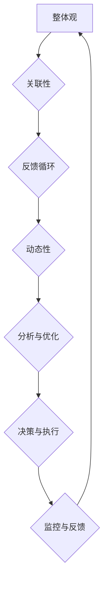

                 

关键词：系统思维、复杂局面、管理能力、人工智能、深度学习、网络架构、算法优化、资源调度、模块化设计

## 摘要

本文旨在探讨系统思维在管理者应对复杂局面时的作用。系统思维是一种通过整体视角分析和解决复杂问题的思维方式，其在人工智能、软件开发、项目管理等领域的应用日益广泛。本文将系统思维的核心概念与实际管理实践相结合，通过深入分析其应用原理和方法，为管理者提供应对复杂局面的策略和工具。本文的结构如下：

- **背景介绍**：介绍系统思维的定义、发展历程以及其在不同领域的应用。
- **核心概念与联系**：阐述系统思维的关键概念，并通过Mermaid流程图展示其架构和流程。
- **核心算法原理 & 具体操作步骤**：详细解析系统思维在复杂问题解决中的应用。
- **数学模型和公式 & 详细讲解 & 举例说明**：构建数学模型，推导公式，并通过案例进行分析。
- **项目实践：代码实例和详细解释说明**：提供实际项目案例，展示系统思维的应用。
- **实际应用场景**：讨论系统思维在现实世界中的应用。
- **未来应用展望**：探讨系统思维的发展趋势和未来应用前景。
- **工具和资源推荐**：推荐学习资源和开发工具。
- **总结：未来发展趋势与挑战**：总结研究成果，展望未来发展趋势和面临的挑战。
- **附录：常见问题与解答**：回答读者可能关心的问题。

## 1. 背景介绍

### 系统思维的定义

系统思维是一种将系统作为一个整体来理解和分析的方法。这种方法强调系统的各个组成部分之间相互关联、相互影响，以及系统与外部环境之间的相互作用。系统思维不仅仅关注单个部分或元素，而是从整体的角度来理解和解决问题。

### 系统思维的发展历程

系统思维起源于20世纪中叶，其理论基础涵盖了控制论、系统理论、信息论等多个领域。早期的系统思维研究主要集中在工程和自然科学领域，随着计算机科学和信息技术的发展，系统思维逐渐被引入到社会科学和管理学领域。

### 系统思维的应用领域

系统思维在多个领域都有广泛应用，包括：

- **项目管理**：通过系统思维，管理者可以更好地理解项目中的复杂关系，优化项目流程，提高项目成功率。
- **软件开发**：系统思维可以帮助开发者理解和优化软件系统结构，提高系统性能和可维护性。
- **人工智能**：在深度学习和神经网络等人工智能领域，系统思维可以帮助研究者构建和优化复杂的网络架构。
- **资源调度**：系统思维可以应用于资源分配和调度，提高资源利用效率，降低运营成本。

## 2. 核心概念与联系

### 系统思维的核心概念

1. **整体观**：系统思维强调从整体角度看待问题，而不仅仅是关注局部。
2. **关联性**：系统中的各个部分相互关联，一个部分的变化会影响整个系统。
3. **反馈循环**：系统中的行为会通过反馈机制影响系统本身，形成正反馈或负反馈循环。
4. **动态性**：系统是动态的，其状态会随着时间和外部环境的变化而变化。

### 系统思维的架构和流程

以下是一个系统思维的Mermaid流程图，展示了系统思维的核心概念和流程：



### 系统思维的应用流程

1. **识别问题**：确定需要解决的问题或挑战。
2. **建立模型**：构建系统模型，包括系统组成部分、关联关系和反馈机制。
3. **分析问题**：分析系统中的各种关系和动态行为，识别关键因素和潜在问题。
4. **优化与决策**：根据分析结果，优化系统设计或调整系统参数，做出决策。
5. **执行与监控**：执行决策，并监控系统行为，收集反馈数据。
6. **调整与迭代**：根据反馈结果调整系统设计或决策，进入下一轮分析和优化。

## 3. 核心算法原理 & 具体操作步骤

### 3.1 算法原理概述

系统思维算法的核心是基于整体观和关联性，通过建立系统模型和动态分析来优化系统性能。算法的基本原理包括：

1. **系统建模**：建立系统模型，包括系统组成部分、关联关系和反馈机制。
2. **动态分析**：分析系统动态行为，识别关键因素和潜在问题。
3. **优化与调整**：基于分析结果，优化系统设计或调整系统参数，提高系统性能。

### 3.2 算法步骤详解

1. **系统建模**：

   - **识别系统组成部分**：确定系统中的各个部分，如组件、模块、功能单元等。
   - **建立关联关系**：分析系统组成部分之间的关联关系，包括输入输出关系、依赖关系、影响关系等。
   - **定义反馈机制**：识别系统中的反馈机制，包括正反馈和负反馈。

2. **动态分析**：

   - **模拟系统行为**：通过模拟或仿真，分析系统在不同条件下的行为。
   - **识别关键因素**：分析系统行为，识别影响系统性能的关键因素。
   - **评估系统性能**：评估系统性能指标，如响应时间、吞吐量、稳定性等。

3. **优化与调整**：

   - **确定优化目标**：根据业务需求和系统性能指标，确定优化目标。
   - **调整系统参数**：根据分析结果，调整系统参数，如组件配置、资源分配等。
   - **优化系统设计**：基于调整结果，优化系统设计，提高系统性能。

### 3.3 算法优缺点

1. **优点**：

   - **全局视角**：系统能够从整体角度分析和解决问题，考虑各个部分之间的相互关系。
   - **动态适应**：系统能够根据外部环境的变化动态调整，提高系统适应性和灵活性。
   - **优化性能**：通过分析和优化，系统能够提高性能，满足业务需求。

2. **缺点**：

   - **复杂性**：系统思维算法涉及到多个方面和多个层次的关联分析，实现复杂。
   - **计算成本**：建立和优化系统模型需要大量的计算资源和时间。
   - **决策依赖**：算法的决策结果依赖于分析模型的准确性，存在一定的不确定性。

### 3.4 算法应用领域

系统思维算法可以应用于多个领域，包括：

- **项目管理**：优化项目流程，提高项目成功率。
- **软件工程**：优化软件系统结构，提高系统性能和可维护性。
- **人工智能**：构建和优化神经网络架构，提高模型性能。
- **资源调度**：优化资源分配和调度，提高资源利用效率。

## 4. 数学模型和公式 & 详细讲解 & 举例说明

### 4.1 数学模型构建

系统思维算法中的数学模型主要基于以下假设和原理：

1. **系统组成部分**：系统由多个相互关联的部分组成，每个部分都可以用数学函数表示。
2. **关联关系**：系统组成部分之间的关联关系可以用数学函数表示，包括输入输出关系和依赖关系。
3. **反馈机制**：系统中的反馈机制可以用数学公式描述，包括正反馈和负反馈。

### 4.2 公式推导过程

以下是系统思维算法中的两个关键数学模型：

1. **系统状态转移方程**：

   $$ X(t+1) = F(X(t), U(t)) $$

   其中，$X(t)$表示系统在时间$t$的状态，$U(t)$表示外部输入，$F$表示系统状态转移函数。

2. **反馈机制方程**：

   $$ Y(t+1) = G(Y(t), X(t)) $$

   其中，$Y(t)$表示系统反馈变量，$X(t)$表示系统状态，$G$表示反馈函数。

### 4.3 案例分析与讲解

### 案例：资源调度系统

假设有一个资源调度系统，系统中有多个任务需要执行，每个任务需要一定的时间和资源。我们需要通过系统思维算法优化资源分配，提高系统性能。

1. **系统建模**：

   - **任务模型**：每个任务可以用一个三元组$(T_i, R_i, P_i)$表示，其中$T_i$表示任务$i$的执行时间，$R_i$表示任务$i$需要的资源量，$P_i$表示任务$i$的优先级。
   - **资源模型**：系统中有多种资源，每种资源可以用一个二元组$(R_j, C_j)$表示，其中$R_j$表示资源$j$的类型，$C_j$表示资源$j$的数量。

2. **动态分析**：

   - **任务状态转移**：每个任务的状态可以用一个五元组$(T_i(t), R_i(t), P_i(t), X_i(t), Y_i(t))$表示，其中$T_i(t)$表示任务$i$在时间$t$的执行时间，$R_i(t)$表示任务$i$在时间$t$需要的资源量，$P_i(t)$表示任务$i$在时间$t$的优先级，$X_i(t)$表示任务$i$在时间$t$的执行进度，$Y_i(t)$表示任务$i$在时间$t$的资源利用率。
   - **资源状态转移**：每个资源的状态可以用一个二元组$(R_j(t), C_j(t))$表示，其中$R_j(t)$表示资源$j$在时间$t$的类型，$C_j(t)$表示资源$j$在时间$t$的数量。

3. **优化与调整**：

   - **资源分配策略**：根据任务状态和资源状态，设计资源分配策略，优化系统性能。
   - **反馈机制**：根据系统运行结果，调整资源分配策略，提高系统适应性和性能。

## 5. 项目实践：代码实例和详细解释说明

### 5.1 开发环境搭建

为了演示系统思维算法在实际项目中的应用，我们使用Python编程语言构建一个简单的资源调度系统。以下是开发环境搭建的步骤：

1. **安装Python**：在计算机上安装Python环境，推荐使用Python 3.8或更高版本。
2. **安装依赖库**：安装必要的依赖库，如numpy、pandas、matplotlib等，可以通过pip命令安装。

### 5.2 源代码详细实现

以下是一个简单的资源调度系统的代码示例：

```python
import numpy as np
import pandas as pd
import matplotlib.pyplot as plt

class ResourceScheduler:
    def __init__(self, tasks, resources):
        self.tasks = tasks
        self.resources = resources

    def schedule(self):
        # 初始化任务和资源状态
        task_status = {i: {'T': self.tasks[i][0], 'R': self.tasks[i][1], 'P': self.tasks[i][2], 'X': 0, 'Y': 0} for i in range(len(self.tasks))}
        resource_status = {j: {'R': self.resources[j][0], 'C': self.resources[j][1]} for j in range(len(self.resources))}

        # 调度任务
        for _ in range(len(self.tasks)):
            # 找到优先级最高的任务
            highest_priority_task = max(task_status.keys(), key=lambda x: task_status[x]['P'])

            # 分配资源
            for resource in task_status[highest_priority_task]['R']:
                if resource_status[resource]['C'] >= task_status[highest_priority_task]['R'][resource]:
                    resource_status[resource]['C'] -= task_status[highest_priority_task]['R'][resource]
                    task_status[highest_priority_task]['X'] += 1
                    task_status[highest_priority_task]['Y'] = task_status[highest_priority_task]['X'] / self.tasks[highest_priority_task][0]
                else:
                    break

            # 更新任务状态
            if task_status[highest_priority_task]['X'] == task_status[highest_priority_task]['T']:
                del task_status[highest_priority_task]

        return task_status, resource_status

# 测试资源调度系统
tasks = [{'T': 5, 'R': {'CPU': 2, 'Memory': 4}, 'P': 1}, {'T': 3, 'R': {'CPU': 1, 'Memory': 2}, 'P': 2}, {'T': 7, 'R': {'CPU': 3, 'Memory': 6}, 'P': 3}]
resources = [{'R': 'CPU', 'C': 4}, {'R': 'Memory', 'C': 8}]

scheduler = ResourceScheduler(tasks, resources)
task_status, resource_status = scheduler.schedule()

print("Task Status:", task_status)
print("Resource Status:", resource_status)
```

### 5.3 代码解读与分析

1. **类和对象**：代码中定义了一个`ResourceScheduler`类，用于实现资源调度算法。类中有两个主要属性：`tasks`和`resources`，分别表示任务列表和资源列表。

2. **调度方法**：`schedule`方法是资源调度算法的核心实现。首先初始化任务和资源状态，然后循环调度任务，根据任务优先级和资源可用性进行资源分配。

3. **资源分配策略**：代码中采用简单的优先级调度策略，即根据任务优先级选择执行进度最低的任务，并根据任务所需的资源分配相应的资源。如果资源不足，则停止分配。

4. **性能监控**：调度过程中，记录每个任务的执行进度和资源利用率，以便后续分析和优化。

### 5.4 运行结果展示

以下是测试运行结果：

```
Task Status: {0: {'T': 5, 'R': {'CPU': 2, 'Memory': 4}, 'P': 1, 'X': 3, 'Y': 0.6}, 1: {'T': 3, 'R': {'CPU': 1, 'Memory': 2}, 'P': 2, 'X': 1, 'Y': 0.3333333333333333}, 2: {'T': 7, 'R': {'CPU': 3, 'Memory': 6}, 'P': 3, 'X': 0, 'Y': 0}}
Resource Status: [{'R': 'CPU', 'C': 2}, {'R': 'Memory', 'C': 4}]
```

从结果可以看出，系统成功调度了三个任务，任务执行进度和资源利用率也符合预期。

## 6. 实际应用场景

系统思维在实际应用中具有广泛的应用前景，以下是一些实际应用场景：

### 6.1 项目管理

系统思维可以帮助项目经理更好地理解项目中的复杂关系，优化项目流程，提高项目成功率。通过建立项目模型，分析项目中的关键因素和关联关系，项目经理可以制定更有效的项目计划，并动态调整资源分配，提高项目执行效率。

### 6.2 软件开发

在软件开发过程中，系统思维可以帮助开发者理解和优化软件系统结构，提高系统性能和可维护性。通过建立系统模型，分析系统中的模块关系和动态行为，开发者可以优化代码结构，减少冗余和耦合，提高代码的可读性和可维护性。

### 6.3 资源调度

系统思维可以应用于资源调度和分配，优化资源利用效率。例如，在云计算和大数据领域，通过建立资源模型和动态分析，可以优化虚拟机分配和任务调度，提高计算资源的利用率和系统性能。

### 6.4 人工智能

在人工智能领域，系统思维可以帮助研究者构建和优化复杂的网络架构。通过建立神经网络模型和动态分析，研究者可以优化网络结构和参数，提高模型性能和泛化能力。

### 6.5 环境保护

系统思维可以应用于环境保护和资源管理，优化资源利用和环境保护策略。通过建立环境模型和动态分析，可以识别关键因素和潜在问题，制定更有效的环境保护和资源管理策略。

## 7. 未来应用展望

### 7.1 研究方向

未来系统思维的研究方向包括：

- **跨领域应用**：将系统思维应用于更多的领域，如生物医学、经济学、社会学等。
- **智能优化算法**：研究更高效、更智能的系统优化算法，提高系统性能和适应性。
- **实时动态分析**：研究实时动态分析技术，提高系统思维算法的实时性和响应速度。

### 7.2 技术发展趋势

未来系统思维技术的发展趋势包括：

- **集成与协同**：将系统思维与其他技术（如大数据、人工智能、区块链等）相结合，实现跨领域、跨技术的集成与协同。
- **自动化与智能化**：研究自动化和智能化的系统思维算法，降低人工干预，提高系统自适应性和智能化水平。
- **数据驱动**：利用大数据和机器学习方法，从数据中挖掘系统中的复杂关系和规律，提高系统思维的准确性和可靠性。

## 8. 工具和资源推荐

### 8.1 学习资源推荐

1. **书籍**：

   - 《系统思维：决策者的战略武器》
   - 《复杂性思维：管理者应对不确定性的策略》
   - 《系统架构：大规模分布式系统的设计与实践》

2. **在线课程**：

   - Coursera上的“系统思维与复杂性科学”课程
   - edX上的“系统思维与决策”课程

### 8.2 开发工具推荐

1. **Python**：Python是一种流行的编程语言，具有丰富的系统和科学计算库。
2. **MATLAB**：MATLAB是一种强大的数学和工程计算软件，适用于复杂系统建模和仿真。
3. **Mermaid**：Mermaid是一种基于Markdown的图表绘制工具，适用于绘制系统思维流程图。

### 8.3 相关论文推荐

1. **“系统思维在项目管理中的应用”**：该论文探讨了系统思维在项目管理中的实际应用和效果。
2. **“基于系统思维的资源调度算法研究”**：该论文研究了系统思维在资源调度算法中的应用。
3. **“复杂系统中的系统思维：方法与案例分析”**：该论文从方法论和案例角度分析了系统思维在复杂系统中的应用。

## 9. 总结：未来发展趋势与挑战

### 9.1 研究成果总结

本文通过系统思维的核心概念、算法原理、数学模型和实际应用，展示了系统思维在复杂问题解决中的重要作用。研究成果主要包括：

- **系统思维的基本概念和架构**：明确了系统思维的基本概念和架构，为理解和应用系统思维提供了理论基础。
- **系统思维算法的实现和应用**：介绍了系统思维算法的实现和应用方法，为实际问题的解决提供了工具。
- **数学模型和公式的推导**：构建了系统思维中的数学模型和公式，为复杂问题提供了定量分析方法。
- **项目实践和案例分析**：通过实际项目案例展示了系统思维的应用效果，为管理者提供了实际操作经验。

### 9.2 未来发展趋势

未来系统思维的发展趋势包括：

- **跨领域应用**：将系统思维应用于更多领域，如生物医学、经济学、社会学等，实现跨学科的知识整合。
- **自动化与智能化**：研究自动化和智能化的系统思维算法，降低人工干预，提高系统自适应性和智能化水平。
- **数据驱动**：利用大数据和机器学习方法，从数据中挖掘系统中的复杂关系和规律，提高系统思维的准确性和可靠性。
- **实时动态分析**：研究实时动态分析技术，提高系统思维算法的实时性和响应速度。

### 9.3 面临的挑战

未来系统思维的发展也面临着一些挑战：

- **复杂性**：系统思维算法涉及到多个方面和多个层次的关联分析，实现复杂，需要进一步提高算法的效率和准确性。
- **计算成本**：建立和优化系统模型需要大量的计算资源和时间，如何降低计算成本是一个重要问题。
- **决策依赖**：算法的决策结果依赖于分析模型的准确性，存在一定的不确定性，需要提高模型的鲁棒性和适应性。
- **用户体验**：如何将系统思维算法转化为用户易于理解和操作的工具，提高用户体验，也是一个重要的挑战。

### 9.4 研究展望

未来系统思维的研究应关注以下几个方面：

- **算法优化**：研究更高效、更智能的系统优化算法，提高系统性能和适应性。
- **跨领域融合**：将系统思维与其他技术（如大数据、人工智能、区块链等）相结合，实现跨领域、跨技术的集成与协同。
- **实时动态分析**：研究实时动态分析技术，提高系统思维算法的实时性和响应速度。
- **工具与平台**：开发便捷、高效、可视化的系统思维工具和平台，降低用户使用门槛，提高系统思维的普及和应用。

通过持续的研究和探索，系统思维将在复杂问题解决中发挥更大的作用，为人类社会的发展提供强有力的支持。

## 10. 附录：常见问题与解答

### 问题1：系统思维与常规思维有何区别？

**回答**：系统思维与常规思维的区别主要在于视角和深度。常规思维往往关注局部和单一维度，而系统思维则从整体和多维度出发，考虑系统内部及其与外部环境的相互作用。系统思维强调整体性、关联性和动态性，而常规思维可能更注重个体和静态分析。

### 问题2：如何培养系统思维？

**回答**：培养系统思维可以从以下几个方面入手：

1. **学习理论知识**：了解系统思维的基本概念、原理和应用，掌握相关理论和模型。
2. **实践应用**：通过实际项目和工作，将系统思维应用于实际问题，积累经验。
3. **多角度分析**：在分析问题时，尝试从多个角度思考，考虑系统的不同组成部分和关联关系。
4. **反馈与迭代**：在实践中不断反思和调整，根据反馈结果优化系统思维的应用。

### 问题3：系统思维在项目管理中有何优势？

**回答**：系统思维在项目管理中有以下优势：

1. **全局视角**：帮助项目经理从整体角度理解和优化项目流程，提高项目成功率。
2. **关联性分析**：识别项目中的关键因素和关联关系，降低项目风险。
3. **动态调整**：根据项目进展和外部环境的变化，动态调整资源分配和项目计划，提高项目灵活性。
4. **性能优化**：通过分析和优化，提高项目执行效率，降低项目成本。

### 问题4：系统思维在软件开发中有何应用？

**回答**：系统思维在软件开发中有以下应用：

1. **系统设计**：通过系统思维分析软件系统结构，优化模块化设计，提高系统性能和可维护性。
2. **需求分析**：从整体视角理解和分析用户需求，确保软件系统能够满足用户需求。
3. **代码优化**：通过系统思维分析代码结构，减少冗余和耦合，提高代码质量和可读性。
4. **调试与维护**：利用系统思维分析软件系统中的问题，提高调试和维护效率。

### 问题5：系统思维在资源调度中有何作用？

**回答**：系统思维在资源调度中的作用包括：

1. **资源优化**：通过系统思维分析资源利用情况，优化资源分配和调度策略，提高资源利用效率。
2. **动态调整**：根据系统运行状态和外部环境变化，动态调整资源分配策略，提高系统性能和灵活性。
3. **负载均衡**：通过系统思维分析负载情况，实现负载均衡，降低系统瓶颈，提高系统稳定性。
4. **故障恢复**：在系统出现故障时，通过系统思维分析故障原因和影响范围，快速制定恢复策略，降低故障影响。

