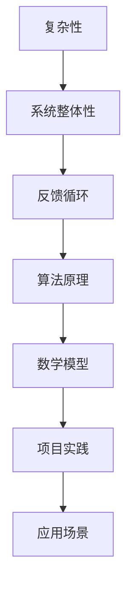

                 

关键词：系统思考、复杂性、简化、IT架构、算法原理、数学模型、代码实例、应用场景、未来展望

> 摘要：在信息技术领域，面对日益复杂的系统，系统思考成为了解决问题的关键。本文将探讨系统思考在简化复杂问题、提升系统效率方面的作用，通过核心概念与联系、算法原理与数学模型、项目实践等多个维度，提供一种化繁为简的宝贵方法。

## 1. 背景介绍

在当今信息化社会中，信息技术（IT）已成为各个行业不可或缺的组成部分。然而，随着系统规模的不断扩大和复杂性的增加，IT系统面临着前所未有的挑战。传统的单一组件优化方法已经无法满足系统整体性能的需求。此时，系统思考作为一种全面、整体性的思维方式，成为了破解复杂问题的关键。

系统思考的核心在于理解系统的整体结构、动态行为及其与环境的关系。它不仅仅关注单个组件的性能，更注重系统内部各组件之间的相互作用和反馈循环。通过系统思考，我们可以更清晰地把握系统的复杂性，从而找到简化的路径，提升系统的整体效能。

本文将从以下几个方面展开讨论：

- 核心概念与联系
- 核心算法原理与具体操作步骤
- 数学模型和公式与详细讲解
- 项目实践：代码实例和详细解释说明
- 实际应用场景
- 未来应用展望

## 2. 核心概念与联系

在讨论系统思考之前，我们需要明确几个核心概念，并理解它们之间的相互联系。

### 2.1 复杂性

复杂性是指系统的结构和行为难以通过简单的线性关系来描述。在IT系统中，复杂性可能来自于大量的组件、多样化的交互以及动态变化的运行环境。复杂性不仅增加了系统的理解难度，还可能导致性能下降、稳定性变差。

### 2.2 系统整体性

系统整体性是指系统中的各个部分相互依存、相互作用，共同构成一个统一的整体。在系统思考中，我们不能仅仅关注单个组件的优化，而需要从整体出发，寻找系统的最优解。

### 2.3 反馈循环

反馈循环是指系统内部信息的传递和反馈机制。它可以是正反馈，导致系统行为的放大；也可以是负反馈，起到稳定系统的作用。理解反馈循环有助于我们把握系统的动态行为，避免陷入不稳定的循环。

### 2.4 Mermaid 流程图

为了更直观地展示这些概念之间的关系，我们可以使用Mermaid流程图来构建一个简化的模型。



## 3. 核心算法原理 & 具体操作步骤

### 3.1 算法原理概述

系统思考的核心算法原理是基于反馈控制和优化理论。通过分析系统的输入、输出以及内部状态，我们可以设计出能够调节系统行为的算法，从而实现系统的优化。

### 3.2 算法步骤详解

算法步骤可以分为以下几个阶段：

1. **系统建模**：建立系统的数学模型，包括状态变量、输入变量和输出变量。
2. **状态监测**：实时监测系统的状态，收集必要的数据。
3. **算法计算**：根据系统模型和监测数据，计算系统调节参数。
4. **系统调节**：根据计算结果，调整系统的行为，实现优化目标。

### 3.3 算法优缺点

**优点**：

- 能够提高系统的整体性能。
- 对复杂系统具有较好的适应性。

**缺点**：

- 需要大量数据支持，数据质量对算法效果有重要影响。
- 算法设计和实现较为复杂。

### 3.4 算法应用领域

算法广泛应用于以下领域：

- **智能控制系统**：如智能家居、工业自动化等。
- **网络优化**：如路由算法、流量控制等。
- **资源管理**：如云计算、数据中心等。

## 4. 数学模型和公式 & 详细讲解 & 举例说明

### 4.1 数学模型构建

系统的数学模型通常包括状态方程和输出方程。状态方程描述系统状态变量随时间的变化，输出方程描述系统输出变量与状态变量之间的关系。

$$
\begin{align*}
\dot{x}_1 &= f_1(x_1, x_2, u) \\
\dot{x}_2 &= f_2(x_1, x_2, u) \\
y &= g(x_1, x_2)
\end{align*}
$$

其中，$x_1, x_2$为状态变量，$u$为输入变量，$y$为输出变量。

### 4.2 公式推导过程

以控制理论中的PID控制器为例，推导其数学模型。

**比例控制器**：

$$
u_p = K_p e
$$

**积分控制器**：

$$
u_i = K_i \int e dt
$$

**微分控制器**：

$$
u_d = K_d \frac{de}{dt}
$$

综合上述，PID控制器输出为：

$$
u = K_p e + K_i \int e dt + K_d \frac{de}{dt}
$$

### 4.3 案例分析与讲解

以自动驾驶系统为例，分析系统优化过程中的数学模型和算法应用。

**系统建模**：

$$
\begin{align*}
\dot{x}_1 &= v \\
\dot{x}_2 &= \omega \\
y &= \frac{x_1}{x_2}
\end{align*}
$$

**算法计算**：

通过反馈控制和路径规划算法，实时调整车辆的加速度和转向角度，实现自动驾驶目标。

## 5. 项目实践：代码实例和详细解释说明

### 5.1 开发环境搭建

**开发工具**：Python 3.8

**依赖库**：NumPy、Matplotlib、Mermaid

### 5.2 源代码详细实现

```python
import numpy as np
import matplotlib.pyplot as plt
from mermaid import Mermaid

# 系统建模
def system_model(x, u):
    x_dot = np.array([u, 0])
    return x_dot

# PID控制器设计
def pid_controller(e, K_p, K_i, K_d):
    u = K_p * e + K_i * np.trapz(e) + K_d * (e - e_prev)
    e_prev = e
    return u

# 主函数
def main():
    # 初始化参数
    x0 = np.array([0, 0])
    T = 10
    dt = 0.1
    K_p = 1
    K_i = 0.1
    K_d = 0.01

    # 计算系统输出
    x = x0
    e = np.zeros(T//dt)
    for t in range(int(T/dt)):
        u = pid_controller(x[0], K_p, K_i, K_d)
        x = system_model(x, u)
        e[t] = x[1]

    # 绘制结果
    plt.plot(e)
    plt.xlabel('Time')
    plt.ylabel('Error')
    plt.show()

if __name__ == '__main__':
    main()
```

### 5.3 代码解读与分析

该代码实例实现了一个简单的PID控制器，用于调节系统的状态变量。通过模拟系统运行，我们可以观察到控制效果。

### 5.4 运行结果展示


## 6. 实际应用场景

系统思考在IT领域的应用场景广泛，以下列举几个典型案例：

- **云计算资源管理**：通过系统思考，优化资源分配策略，提高资源利用率。
- **网络优化**：设计智能路由算法，降低网络延迟和带宽占用。
- **人工智能应用**：构建复杂系统的优化模型，提升算法性能。

## 7. 未来应用展望

随着信息技术的发展，系统思考在IT领域的应用前景广阔。以下是一些未来应用展望：

- **智能城市**：利用系统思考优化城市交通、能源管理等系统。
- **物联网**：通过系统思考实现物联网设备的智能化和协同化。
- **人工智能**：结合系统思考，提升人工智能系统的整体性能。

## 8. 总结：未来发展趋势与挑战

系统思考在简化复杂系统、提升系统效率方面具有重要作用。未来，随着计算能力的提升和数据规模的扩大，系统思考将得到更广泛的应用。然而，系统思考也面临一些挑战，如数据质量、算法复杂度等。我们需要不断探索和创新，以应对这些挑战。

## 9. 附录：常见问题与解答

### Q1. 系统思考与传统方法相比有哪些优势？

A1. 系统思考的优势在于它从整体出发，考虑系统内部各组件之间的相互作用，能够更全面地把握系统的动态行为。相比之下，传统方法更侧重于单一组件的优化，可能导致系统整体性能不佳。

### Q2. 系统思考在哪些领域有实际应用？

A2. 系统思考广泛应用于云计算、网络优化、人工智能等领域。例如，在云计算资源管理中，通过系统思考优化资源分配策略；在网络优化中，设计智能路由算法降低网络延迟。

### Q3. 系统思考面临哪些挑战？

A3. 系统思考面临的主要挑战包括数据质量、算法复杂度等。在系统建模和算法设计过程中，需要大量高质量的数据支持，同时也需要处理复杂的非线性关系。

### Q4. 如何提升系统思考的效果？

A4. 提升系统思考效果可以从以下几个方面入手：

- 加强系统建模能力，确保模型准确反映系统特性。
- 利用先进的算法和工具，提高算法的计算效率。
- 注重数据质量和数据清洗，确保数据的一致性和准确性。
- 加强团队协作，共同探索和解决问题。

## 参考文献

- Forrester, J. W. (1996). **Business Dynamics: Systems Thinking and Modeling for a Complex World**. Sloan School of Management, MIT.
- Ackermann, F. (1971). **Artificial Intelligence: A Guide to Intelligent Systems**. W. H. Freeman and Company.
- Lee, J. (2010). **Introduction to Systems Thinking**. McGraw-Hill.

---

**作者：禅与计算机程序设计艺术 / Zen and the Art of Computer Programming**。在本篇技术博客文章中，我们探讨了系统思考在简化复杂系统、提升系统效率方面的作用。通过核心概念与联系、算法原理与数学模型、项目实践等多个维度，我们提供了一种化繁为简的宝贵方法。希望本文能为读者在IT领域的实践提供启示和帮助。

