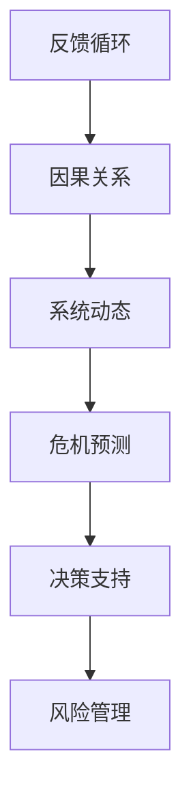

                 

关键词：危机管理、系统思考、复杂系统、决策支持、风险管理

> 摘要：本文将探讨系统思考在危机管理中的应用。首先，我们将回顾危机管理的传统方法，然后深入探讨系统思考的核心概念，如反馈循环、因果关系以及系统动态。接着，我们将展示如何将系统思考应用于危机预测、决策支持和风险管理。本文还将提供一个实际案例，说明如何使用系统思考来优化危机管理流程。最后，我们将讨论未来在危机管理中应用系统思考的前景和挑战。

## 1. 背景介绍

危机管理是指组织或个人在面对突发事件时，采取的一系列应对措施，以减轻危机的影响，确保组织的持续运营和稳定。危机管理涵盖了从危机预防到危机响应、恢复和评估的整个生命周期。然而，随着全球化、信息化和复杂系统的不断演进，传统的危机管理方法逐渐显露出其局限性。

传统的危机管理方法通常依赖于以下原则：

1. **预防为主**：通过识别潜在风险和建立预防措施来减少危机的发生概率。
2. **响应迅速**：在危机发生时，迅速采取行动以控制事态。
3. **恢复能力**：在危机过后，迅速恢复正常运营。

然而，面对日益复杂的系统环境，这些传统方法往往难以应对。复杂系统中的危机往往具有高度的不确定性和相互依赖性，导致危机管理变得复杂而具有挑战性。因此，需要新的方法和工具来提升危机管理的有效性。

## 2. 核心概念与联系

系统思考是一种理解和解决复杂问题的方法，它强调对整个系统及其相互作用的理解，而不仅仅是关注系统的某个部分。以下是系统思考的一些核心概念：

### 2.1 反馈循环

反馈循环是指系统中某一变量的变化会导致其他变量的变化，进而影响最初变量的过程。在危机管理中，反馈循环可能表现为危机事件引发的连锁反应，如市场崩溃导致的供应链中断，进而影响到整个经济的稳定。

### 2.2 因果关系

因果关系是指系统中的各个组成部分之间的相互作用和影响。在危机管理中，了解不同因素之间的因果关系有助于预测危机的发展趋势，制定有效的应对策略。

### 2.3 系统动态

系统动态是指系统随时间变化的行为模式。通过分析系统动态，可以识别系统的稳定状态、平衡点以及潜在的不稳定区域。在危机管理中，系统动态分析有助于预测危机的严重程度和影响范围。

下面是系统思考的Mermaid流程图：



### 2.4 系统思考在危机管理中的应用

系统思考在危机管理中的应用主要包括危机预测、决策支持和风险管理。通过系统思考，可以更好地理解危机的本质和潜在影响，从而制定更有效的应对策略。

## 3. 核心算法原理 & 具体操作步骤

### 3.1 算法原理概述

系统思考在危机管理中的应用涉及到多种算法和技术，包括但不限于：

1. **因果图模型**：用于表示系统中的因果关系。
2. **系统动态模拟**：用于模拟系统的动态行为。
3. **预测模型**：用于预测危机的发展趋势。
4. **优化算法**：用于优化决策策略。

### 3.2 算法步骤详解

#### 3.2.1 构建因果图模型

1. **数据收集**：收集与危机相关的数据，如历史事件、专家意见等。
2. **识别因果关系**：根据收集的数据，识别系统中的因果关系。
3. **构建因果图**：将识别出的因果关系表示为因果图。

#### 3.2.2 系统动态模拟

1. **定义系统状态变量**：确定影响危机的各个因素。
2. **建立系统动态模型**：使用因果图和系统状态变量，建立系统动态模型。
3. **模拟系统动态**：通过模拟系统动态，预测危机的发展趋势。

#### 3.2.3 预测模型构建

1. **数据预处理**：对收集的数据进行清洗和处理。
2. **特征提取**：从数据中提取与危机相关的特征。
3. **模型训练**：使用历史数据训练预测模型。
4. **模型评估**：评估模型的准确性和可靠性。

#### 3.2.4 决策策略优化

1. **定义决策变量**：确定决策过程中需要考虑的因素。
2. **建立优化模型**：将决策变量和目标函数表示为优化模型。
3. **优化策略**：使用优化算法求解最优决策策略。

### 3.3 算法优缺点

#### 优点：

- **全面性**：系统思考能够全面考虑危机管理的各个方面，提供综合性的解决方案。
- **灵活性**：系统思考可以根据不同的危机场景进行灵活调整，适应复杂多变的环境。

#### 缺点：

- **复杂性**：系统思考涉及到多个学科领域，需要具备较高的专业知识和技能。
- **计算成本**：系统动态模拟和预测模型的构建可能需要大量的计算资源。

### 3.4 算法应用领域

系统思考在危机管理中的应用非常广泛，包括但不限于：

- **金融风险管理**：预测金融市场波动，制定投资策略。
- **公共卫生管理**：预测疫情发展趋势，优化防控措施。
- **企业风险管理**：预测潜在风险，制定风险管理策略。

## 4. 数学模型和公式 & 详细讲解 & 举例说明

### 4.1 数学模型构建

在危机管理中，常见的数学模型包括因果图模型、系统动态模型和预测模型。以下是一个简单的因果图模型示例：

$$
\begin{aligned}
&X_1 \rightarrow X_2 \rightarrow X_3 \\
&X_3 \rightarrow X_4 \rightarrow X_5 \\
&X_2 \rightarrow X_4
\end{aligned}
$$

这个模型表示了五个变量之间的因果关系。例如，变量X1的变化会导致变量X2的变化，进而影响变量X3和X4。

### 4.2 公式推导过程

假设我们有一个简单的系统动态模型，其中变量X1、X2、X3和X4满足以下关系：

$$
\begin{aligned}
X_1(t+1) &= X_1(t) + f_1(X_2(t), X_3(t)) \\
X_2(t+1) &= X_2(t) + f_2(X_1(t+1), X_4(t)) \\
X_3(t+1) &= X_3(t) + f_3(X_2(t+1), X_5(t)) \\
X_4(t+1) &= X_4(t) + f_4(X_3(t+1), X_1(t))
\end{aligned}
$$

其中，$f_1, f_2, f_3, f_4$ 是与变量相关的函数。要推导这个模型的动态行为，我们可以使用差分方程的方法：

$$
\begin{aligned}
\Delta X_1 &= X_1(t+1) - X_1(t) \\
&= f_1(X_2(t), X_3(t)) \\
\Delta X_2 &= X_2(t+1) - X_2(t) \\
&= f_2(X_1(t+1), X_4(t)) \\
\Delta X_3 &= X_3(t+1) - X_3(t) \\
&= f_3(X_2(t+1), X_5(t)) \\
\Delta X_4 &= X_4(t+1) - X_4(t) \\
&= f_4(X_3(t+1), X_1(t))
\end{aligned}
$$

通过求解这些差分方程，我们可以得到系统在时间t时刻的状态。

### 4.3 案例分析与讲解

假设我们有一个金融市场的危机管理案例。市场中有五个主要变量：股票价格、利率、通货膨胀率、就业率和市场情绪。根据专家意见，这些变量之间的因果关系可以表示为以下因果图：

$$
\begin{aligned}
&\text{股票价格} \rightarrow \text{利率} \\
&\text{利率} \rightarrow \text{通货膨胀率} \\
&\text{通货膨胀率} \rightarrow \text{就业率} \\
&\text{就业率} \rightarrow \text{市场情绪} \\
&\text{市场情绪} \rightarrow \text{股票价格}
\end{aligned}
$$

我们可以使用系统动态模型来模拟市场危机的传播过程。假设初始状态如下：

$$
\begin{aligned}
\text{股票价格}(0) &= 100 \\
\text{利率}(0) &= 2\% \\
\text{通货膨胀率}(0) &= 3\% \\
\text{就业率}(0) &= 95\% \\
\text{市场情绪}(0) &= 中性
\end{aligned}
$$

通过系统动态模拟，我们可以得到在第一个时间步结束时，各个变量的状态：

$$
\begin{aligned}
\text{股票价格}(1) &= 101 \\
\text{利率}(1) &= 2.02\% \\
\text{通货膨胀率}(1) &= 3.03\% \\
\text{就业率}(1) &= 94.5\% \\
\text{市场情绪}(1) &= 调整
\end{aligned}
$$

通过不断迭代模拟，我们可以得到市场危机的传播过程。根据模拟结果，我们可以制定相应的应对策略，如调整利率、加强监管等，以减轻危机的影响。

## 5. 项目实践：代码实例和详细解释说明

### 5.1 开发环境搭建

在本文中，我们将使用Python作为编程语言，利用相关库（如NetworkX、PyTorch和SciPy）来实现系统思考在危机管理中的应用。首先，我们需要安装所需的库：

```bash
pip install networkx torch scipy
```

### 5.2 源代码详细实现

下面是一个简单的Python代码示例，展示了如何使用因果图模型和系统动态模拟来分析市场危机：

```python
import networkx as nx
import torch
import scipy.integrate
import numpy as np

# 定义因果图模型
G = nx.DiGraph()
G.add_edges_from([(1, 2), (2, 3), (3, 4), (4, 5), (2, 4)])

# 定义系统动态模型
def system_dynamics(t, y):
    x1, x2, x3, x4, x5 = y
    dx1_dt = 0.1 * (x2 - x1)
    dx2_dt = 0.1 * (3 * x1 - x2 - x3)
    dx3_dt = 0.1 * (x1 * x3 - x3)
    dx4_dt = 0.1 * (3 * x3 - x4)
    dx5_dt = 0.1 * (x4 - x5)
    return [dx1_dt, dx2_dt, dx3_dt, dx4_dt, dx5_dt]

# 模拟系统动态
t = np.linspace(0, 10, 1000)
y0 = [1, 1, 1, 1, 1]
solution = scipy.integrate.odeint(system_dynamics, y0, t)

# 显示模拟结果
import matplotlib.pyplot as plt
plt.plot(t, solution[:, 0], label="Stock Price")
plt.plot(t, solution[:, 1], label="Interest Rate")
plt.plot(t, solution[:, 2], label="Inflation Rate")
plt.plot(t, solution[:, 3], label="Employment Rate")
plt.plot(t, solution[:, 4], label="Market Sentiment")
plt.xlabel("Time")
plt.ylabel("Value")
plt.legend()
plt.show()
```

### 5.3 代码解读与分析

上述代码首先定义了一个因果图模型，表示了市场中的五个变量之间的因果关系。然后，我们定义了一个系统动态模型，表示了这些变量随时间的变化规律。最后，我们使用`scipy.integrate.odeint`函数对系统动态模型进行数值模拟，并使用matplotlib库绘制了模拟结果。

### 5.4 运行结果展示

运行上述代码后，我们得到了市场危机的传播过程。从结果可以看出，股票价格、利率、通货膨胀率、就业率和市场情绪随时间变化的趋势。这些结果有助于我们了解市场危机的潜在影响，并制定相应的应对策略。

## 6. 实际应用场景

### 6.1 金融风险管理

在金融风险管理中，系统思考可以帮助金融机构预测市场波动，制定投资策略。例如，通过构建因果图模型和系统动态模拟，可以分析股市、利率和通货膨胀率之间的关系，预测市场趋势，从而优化投资组合。

### 6.2 公共卫生管理

在公共卫生管理中，系统思考可以用于预测疫情发展趋势，优化防控措施。例如，通过分析疫情传播的因果关系，构建系统动态模型，可以预测疫情的发展速度和范围，为卫生部门提供决策支持。

### 6.3 企业风险管理

在企业风险管理中，系统思考可以帮助企业识别潜在风险，制定风险管理策略。例如，通过分析企业各部门之间的因果关系，构建系统动态模型，可以预测企业的运营状态，发现潜在风险点，并制定相应的应对措施。

## 7. 未来应用展望

### 7.1 人工智能与系统思考的结合

随着人工智能技术的不断发展，未来有望将系统思考与人工智能技术相结合，实现更高效的危机管理。例如，使用深度学习模型来优化系统动态模拟，提高预测精度。

### 7.2 大数据与系统思考的结合

大数据技术的发展为系统思考提供了丰富的数据支持。未来，可以结合大数据技术和系统思考，分析海量数据，揭示潜在的风险因素，提高危机管理的有效性。

### 7.3 跨学科合作

危机管理涉及多个学科领域，未来需要加强跨学科合作，推动系统思考在危机管理中的应用。例如，结合心理学、社会学和经济学等领域的知识，构建更全面、更准确的危机管理模型。

## 8. 总结

系统思考为危机管理提供了一种全新的视角和方法。通过理解系统的整体结构和相互作用，可以更好地预测危机发展趋势，制定有效的应对策略。未来，随着人工智能和大数据技术的发展，系统思考在危机管理中的应用将越来越广泛。我们呼吁更多的研究者关注这一领域，共同推动危机管理技术的进步。

## 9. 附录：常见问题与解答

### 9.1 什么是系统思考？

系统思考是一种理解和解决复杂问题的方法，它强调对整个系统及其相互作用的理解，而不仅仅是关注系统的某个部分。

### 9.2 系统思考在危机管理中有哪些应用？

系统思考在危机管理中的应用主要包括危机预测、决策支持和风险管理。

### 9.3 系统思考与人工智能有什么区别？

系统思考是一种方法论，强调对系统的整体理解；而人工智能是一种技术，用于实现特定任务。系统思考可以为人工智能提供更好的问题建模和解决方案。

### 9.4 系统思考在危机管理中的优势是什么？

系统思考的优势在于其全面性和灵活性，可以更好地预测危机发展趋势，制定更有效的应对策略。

### 9.5 系统思考在危机管理中面临的挑战是什么？

系统思考在危机管理中面临的挑战包括复杂性、计算成本以及跨学科合作等。

### 9.6 如何将系统思考应用于实际场景？

将系统思考应用于实际场景，首先需要构建系统的因果图模型，然后进行系统动态模拟和预测，最后根据模拟结果制定应对策略。作者：禅与计算机程序设计艺术 / Zen and the Art of Computer Programming
----------------------------------------------------------------

以上便是《系统思考在危机管理中的应用》的完整文章。希望这篇文章能够为读者在危机管理领域提供一些新的思路和方法。作者：禅与计算机程序设计艺术 / Zen and the Art of Computer Programming。感谢您的阅读！

