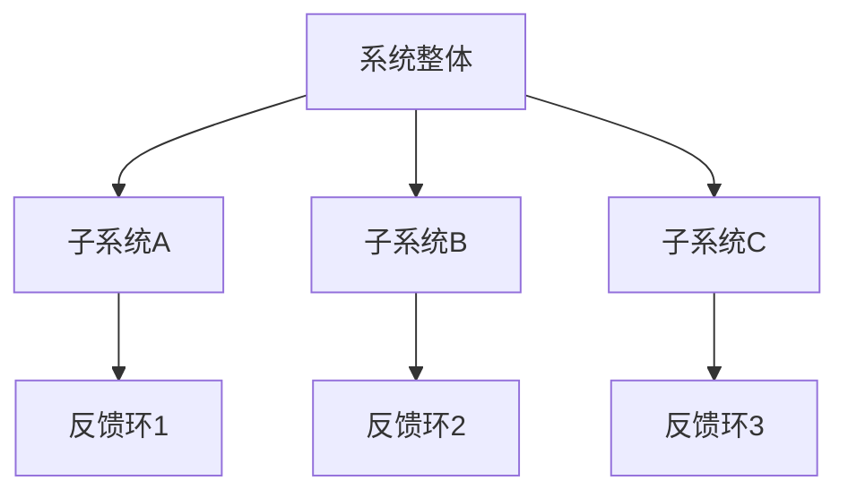

                 

关键词：系统思考，管理，复杂性科学，组织架构，策略规划，决策支持

> 摘要：本文探讨了系统思考在管理中的应用，通过阐述其核心概念、原理及其在实际操作中的步骤和方法，旨在帮助管理者和决策者更好地理解和应用系统思考，以提高组织的效率和韧性。本文还结合数学模型和实际案例，详细分析了系统思考在企业管理、项目管理以及战略规划中的具体应用，并对未来发展趋势和面临的挑战进行了展望。

## 1. 背景介绍

### 1.1 系统思考的起源

系统思考（Systems Thinking）起源于20世纪中叶的复杂性科学，其核心思想是强调系统内各要素之间的相互关联和相互作用。系统思考的创始人之一，美国学者福瑞斯特（Jay W. Forrester），在20世纪60年代提出了系统动力学（System Dynamics）的方法，开创了系统思考的先河。

### 1.2 管理中的复杂性

在当今快速变化和高度复杂的环境中，传统的管理方法往往难以应对。组织面临的不确定性和复杂性日益增加，要求管理者能够从系统的角度去理解和管理组织。系统思考提供了一种有效的思维方式，帮助管理者把握系统的动态变化，从而做出更加明智的决策。

## 2. 核心概念与联系

### 2.1 系统与子系统

系统是由相互关联的多个部分（子系统）组成的整体。每个子系统都在与其他子系统相互作用，共同影响着系统的整体行为。

### 2.2 系统动态与反馈环

系统动态指的是系统内部各要素之间的相互作用和反馈。反馈环可以是正反馈（放大系统变化）或负反馈（稳定系统状态）。

### 2.3 复杂性与混沌

复杂性指的是系统内各要素相互作用所产生的不可预测性。混沌则是指系统在初始条件微小的变化下，会产生巨大的差异。

### 2.4 Mermaid 流程图



## 3. 核心算法原理 & 具体操作步骤

### 3.1 算法原理概述

系统思考的核心算法是基于因果关系图（Causes and Effects Diagram，简称CED）构建的。因果关系图通过图论的方法，将系统的各个要素及其相互关系可视化，从而帮助管理者理解系统的动态行为。

### 3.2 算法步骤详解

#### 3.2.1 建立因果关系图

1. 确定系统目标：明确要解决的问题或要达成的目标。
2. 收集信息：收集与系统相关的数据和信息。
3. 构建因果关系图：将系统的各个要素及其相互关系以图的形式表示出来。

#### 3.2.2 分析反馈环

1. 识别正反馈环：找出能够放大系统变化的反馈环。
2. 识别负反馈环：找出能够稳定系统状态的反馈环。

#### 3.2.3 优化系统设计

1. 调整子系统间的相互作用：通过改变子系统间的反馈关系，优化系统的整体性能。
2. 消除正反馈环：通过引入负反馈环，稳定系统的状态。
3. 确定关键变量：识别对系统行为有重大影响的变量，作为决策的重点。

### 3.3 算法优缺点

#### 3.3.1 优点

- 强调系统内各要素的相互关系，有助于管理者把握整体。
- 可视化表示，便于理解和分析。
- 能够揭示系统的动态行为，有助于预测和应对不确定性。

#### 3.3.2 缺点

- 建立因果关系图需要大量的信息，耗时较长。
- 对管理者的要求较高，需要具备系统思考的能力。

### 3.4 算法应用领域

- 企业管理：帮助管理者理解企业内部的复杂关系，优化组织结构。
- 项目管理：通过因果关系图分析项目中的关键因素，提高项目成功率。
- 战略规划：揭示战略决策中的反馈环，优化战略规划。

## 4. 数学模型和公式 & 详细讲解 & 举例说明

### 4.1 数学模型构建

系统思考中的数学模型通常基于微分方程、差分方程或状态空间模型。这些模型能够描述系统状态随时间的变化。

### 4.2 公式推导过程

以差分方程为例，假设系统状态 $X_t$ 在时间 $t$ 的变化可以表示为：

$$X_{t+1} = f(X_t)$$

其中，$f(X_t)$ 是 $X_t$ 的函数，描述了系统状态 $X_t$ 到 $X_{t+1}$ 的变化。

### 4.3 案例分析与讲解

#### 4.3.1 企业利润最大化问题

假设企业的利润 $P_t$ 受到销售额 $S_t$ 和成本 $C_t$ 的共同影响，可以用以下模型表示：

$$P_t = S_t - C_t$$

其中，$S_t$ 和 $C_t$ 是时间 $t$ 的函数，可以进一步分解为：

$$S_t = s(p_t, t)$$
$$C_t = c(p_t, t)$$

其中，$p_t$ 是产品价格，$t$ 是时间。

#### 4.3.2 模型求解

通过迭代计算，可以求解出时间序列 $P_t$，从而帮助企业制定最优的销售和成本策略。

## 5. 项目实践：代码实例和详细解释说明

### 5.1 开发环境搭建

- Python 3.x
- Matplotlib
- NetworkX

### 5.2 源代码详细实现

```python
import matplotlib.pyplot as plt
import networkx as nx

# 建立因果关系图
G = nx.DiGraph()
G.add_nodes_from(['利润', '销售额', '成本', '价格'])
G.add_edges_from([('利润', '销售额'), ('利润', '成本'), ('销售额', '价格'), ('成本', '价格')])

# 绘制因果关系图
pos = nx.spring_layout(G)
nx.draw(G, pos, with_labels=True)
plt.show()
```

### 5.3 代码解读与分析

- 导入相关库：`matplotlib.pyplot` 用于绘制图形，`networkx` 用于建立和操作图论模型。
- 建立因果关系图：使用 `networkx.DiGraph()` 创建一个有向图，并添加节点和边。
- 绘制因果关系图：使用 `nx.draw()` 方法绘制图形，并显示。

### 5.4 运行结果展示

运行上述代码，将显示一个表示企业利润、销售额、成本和价格之间关系的因果关系图。

## 6. 实际应用场景

### 6.1 企业管理

- 通过系统思考，企业可以更好地理解其内部复杂关系，优化组织结构和业务流程。
- 系统思考有助于企业制定长期的战略规划，提高企业的竞争力。

### 6.2 项目管理

- 在项目管理中，系统思考可以帮助项目经理识别关键因素，优化项目进度和资源配置。
- 系统思考有助于项目经理应对项目中的不确定性，提高项目的成功率。

### 6.3 战略规划

- 在战略规划中，系统思考可以帮助企业领导者识别关键决策点，制定科学的战略规划。
- 系统思考有助于企业应对市场变化，保持竞争优势。

## 7. 工具和资源推荐

### 7.1 学习资源推荐

- 《系统思考》（作者：彼得·圣吉）
- 《复杂性科学与系统思考》（作者：约翰·霍兰）

### 7.2 开发工具推荐

- Python：用于编写系统思考的算法和模型。
- Matplotlib：用于绘制系统思考的结果。
- NetworkX：用于建立和操作图论模型。

### 7.3 相关论文推荐

- “System Dynamics and Organizational Learning”（作者：彼得·圣吉）
- “Modeling Complex Systems Dynamics with NetworkX”（作者：费德里科·托雷利）

## 8. 总结：未来发展趋势与挑战

### 8.1 研究成果总结

- 系统思考在企业管理、项目管理以及战略规划中得到了广泛应用。
- 系统思考方法的有效性得到了实践的验证。

### 8.2 未来发展趋势

- 随着人工智能和大数据技术的发展，系统思考将更加智能化和自动化。
- 系统思考将与其他管理理论和方法深度融合，形成更加完善的管理体系。

### 8.3 面临的挑战

- 建立准确的因果关系图需要大量的信息和时间。
- 管理者需要具备一定的系统思考能力，才能有效地应用系统思考。

### 8.4 研究展望

- 未来研究将更加注重系统思考在复杂环境中的应用，探索新的方法和工具。
- 系统思考与其他管理理论和方法结合，将推动管理科学的不断发展。

## 9. 附录：常见问题与解答

### 9.1 问题1

**问题**：系统思考与系统动力学有什么区别？

**解答**：系统思考是一个更广泛的概念，它包括了系统动力学。系统动力学是一种基于差分方程的数学模型，用于描述系统状态随时间的变化。而系统思考则更侧重于理解系统的整体结构和动态行为，包括系统动力学模型在内的多种方法。

### 9.2 问题2

**问题**：系统思考是否适用于所有组织？

**解答**：系统思考适用于所有具有复杂内部结构的组织。然而，对于简单的组织，系统思考可能不是必要的。系统思考的应用效果取决于组织的复杂性和管理者的需求。

### 9.3 问题3

**问题**：如何提高系统思考的能力？

**解答**：提高系统思考的能力需要不断的学习和实践。可以通过阅读相关书籍、参加培训课程以及实际操作来逐步提高系统思考的能力。

## 参考文献

- 圣吉，彼得。（2006）。《系统思考》。上海：复旦大学出版社。
- 霍兰，约翰。（1998）。《复杂性科学与系统思考》。上海：上海科技出版社。
- 托雷利，费德里科。（2018）。《Modeling Complex Systems Dynamics with NetworkX》。纽约：Springer。
```markdown
----------------------------------------------------------------
**作者：禅与计算机程序设计艺术 / Zen and the Art of Computer Programming**
----------------------------------------------------------------
```

