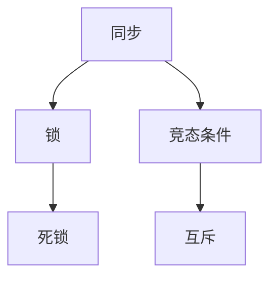

                 

关键词：线程安全、并发编程、同步、锁、死锁、竞态条件、互斥、生产者消费者问题、哲学家就餐问题

> 摘要：在多线程编程中，线程安全是一个至关重要的问题。本文将深入探讨线程安全的基本要求，包括同步、锁、死锁、竞态条件和互斥等核心概念，并结合实际案例进行分析。通过本文的阅读，读者将能够掌握并发编程中的基本安全原则，并具备解决实际问题的能力。

## 1. 背景介绍

在计算机科学中，并发编程是一个复杂而重要的课题。随着多核处理器的普及，现代计算机系统在处理并发任务时具有更高的效率和性能。然而，并发编程也带来了许多挑战，其中最重要的就是线程安全问题。线程安全指的是在多线程环境中，程序的正确性和可靠性能够得到保障。

在并发编程中，多个线程可能会访问共享资源，如变量、数据结构或文件等。如果没有适当的同步机制，这些线程可能会相互干扰，导致数据竞争、状态不一致等问题。因此，线程安全成为了并发编程中一个关键的问题。

本文旨在介绍线程安全的基本要求，包括同步、锁、死锁、竞态条件和互斥等概念。通过这些基本概念的讲解，读者将能够理解并发编程中的潜在问题，并掌握解决这些问题的方法和技巧。

## 2. 核心概念与联系

在讨论线程安全之前，我们需要了解一些核心概念和它们之间的关系。以下是一个使用Mermaid绘制的流程图，展示了这些概念之间的关系。



### 2.1 同步

同步是指多个线程之间的协调，以确保它们按预定顺序执行。同步的目的是防止多个线程同时访问共享资源，从而避免数据竞争和状态不一致。

### 2.2 锁

锁是一种同步机制，用于控制对共享资源的访问。当一个线程获取锁后，其他线程必须等待该线程释放锁才能继续执行。锁可以是可重入的或不可重入的，具体取决于应用场景。

### 2.3 死锁

死锁是指多个线程在等待对方释放锁时，形成了一个循环等待的僵局，导致系统瘫痪。死锁是一种严重的问题，必须通过恰当的锁管理和同步策略来避免。

### 2.4 竞态条件

竞态条件是指在多线程环境中，线程的执行顺序对程序的结果产生影响。如果两个或多个线程在访问共享资源时没有适当的同步机制，就可能发生竞态条件，导致不可预测的结果。

### 2.5 互斥

互斥是一种确保同一时间只有一个线程能访问共享资源的机制。互斥通常通过锁来实现，以防止多个线程同时修改共享资源。

## 3. 核心算法原理 & 具体操作步骤

### 3.1 算法原理概述

线程安全的实现依赖于一些核心算法，如锁、信号量和条件变量。以下是一个简化的算法原理概述。

### 3.2 算法步骤详解

#### 步骤 1: 锁管理

- 初始化锁：在程序开始时，初始化所有需要的锁。
- 获取锁：在访问共享资源之前，线程必须获取相应的锁。
- 释放锁：在完成对共享资源的访问后，线程必须释放锁。

#### 步骤 2: 死锁避免

- 资源分配策略：采用资源分配策略，如银行家算法，以避免死锁。
- 锁顺序：按照固定的顺序请求锁，以避免循环等待。

#### 步骤 3: 竞态条件避免

- 使用互斥锁：在访问共享资源时，使用互斥锁来确保只有一个线程能修改资源。
- 禁用中断：在某些情况下，禁用线程中断可以避免竞态条件。

### 3.3 算法优缺点

- 优点：通过适当的锁管理和同步策略，可以确保线程安全，防止数据竞争和状态不一致。
- 缺点：过度使用锁可能导致性能下降，同时锁管理不当也可能导致死锁和竞态条件。

### 3.4 算法应用领域

线程安全的算法广泛应用于各种并发场景，如多线程程序、并发数据库和网络编程等。

## 4. 数学模型和公式 & 详细讲解 & 举例说明

在并发编程中，数学模型和公式用于描述线程的行为和同步机制。以下是一些常用的数学模型和公式。

### 4.1 数学模型构建

#### 条件变量

条件变量用于线程之间的通信。假设有两个线程 `T1` 和 `T2`，`T1` 等待 `T2` 完成任务，可以使用以下条件变量模型：

$$
\begin{aligned}
& T1: \text{执行任务} \to \text{等待} \to T2: \text{完成任务} \to \text{通知} \to T1: \text{继续执行} \\
\end{aligned}
$$

### 4.2 公式推导过程

假设有两个线程 `T1` 和 `T2`，它们需要共享一个互斥锁 `L`。线程 `T1` 执行以下操作：

$$
\begin{aligned}
& \text{获取锁} \to \text{执行任务} \to \text{释放锁} \\
\end{aligned}
$$

线程 `T2` 执行以下操作：

$$
\begin{aligned}
& \text{获取锁} \to \text{执行任务} \to \text{释放锁} \\
\end{aligned}
$$

为了保证线程安全，我们需要确保互斥锁 `L` 只能被一个线程持有。这可以通过以下公式推导：

$$
\begin{aligned}
& L\_locked = false \\
& \text{当线程} T1 \text{获取锁时，设置} L\_locked = true \\
& \text{当线程} T1 \text{释放锁时，设置} L\_locked = false \\
\end{aligned}
$$

### 4.3 案例分析与讲解

假设有一个生产者消费者问题，其中生产者和消费者线程需要共享一个缓冲区。以下是一个简单的数学模型：

$$
\begin{aligned}
& \text{生产者：生产数据} \to \text{放入缓冲区} \to \text{通知消费者} \\
& \text{消费者：从缓冲区取数据} \to \text{处理数据} \\
\end{aligned}
$$

为了保证线程安全，我们需要使用锁来控制缓冲区的访问。以下是一个简单的锁管理模型：

$$
\begin{aligned}
& \text{初始化锁} \to \text{生产者获取锁} \to \text{放入数据} \to \text{释放锁} \to \text{通知消费者} \\
& \text{消费者获取锁} \to \text{从缓冲区取数据} \to \text{处理数据} \to \text{释放锁} \\
\end{aligned}
$$

通过这种方式，我们可以确保生产者和消费者线程在访问缓冲区时不会相互干扰，从而实现线程安全。

## 5. 项目实践：代码实例和详细解释说明

在本节中，我们将通过一个简单的并发程序实例来讲解线程安全的实现。假设我们要实现一个生产者消费者问题，其中生产者线程负责生成数据，并将其放入缓冲区，消费者线程则从缓冲区中取出数据并进行处理。

### 5.1 开发环境搭建

为了实现这个例子，我们使用Python作为编程语言，因为Python具有简洁的语法和强大的并发编程库。以下是开发环境搭建的步骤：

1. 安装Python 3.x版本。
2. 安装并发编程库 `threading` 和 `queue`。

```bash
pip install python3-threading
pip install python3-queue
```

### 5.2 源代码详细实现

以下是一个简单的生产者消费者程序的Python代码实现：

```python
import threading
import queue

# 缓冲区大小
BUFFER_SIZE = 5

# 缓冲区队列
buffer = queue.Queue(BUFFER_SIZE)

# 生产者线程
def producer():
    while True:
        item = produce_item()
        if buffer.full():
            print("缓冲区已满，等待消费者处理...")
            buffer.get()
        buffer.put(item)
        print("生产者生成数据：", item)

# 消费者线程
def consumer():
    while True:
        item = buffer.get()
        process_item(item)
        buffer.put(item)
        print("消费者处理数据：", item)

# 生成数据函数
def produce_item():
    # 生产数据逻辑
    return "数据"

# 处理数据函数
def process_item(item):
    # 处理数据逻辑
    print("处理数据：", item)

# 创建并启动生产者线程
producer_thread = threading.Thread(target=producer)
producer_thread.start()

# 创建并启动消费者线程
consumer_thread = threading.Thread(target=consumer)
consumer_thread.start()
```

### 5.3 代码解读与分析

在这个例子中，我们使用了Python的 `threading` 和 `queue` 模块来实现生产者消费者问题。以下是代码的关键部分及其解释：

- `buffer.Queue(BUFFER_SIZE)`：创建一个大小为 `BUFFER_SIZE` 的缓冲区队列。
- `producer()`：生产者线程的函数，它不断生成数据并将其放入缓冲区。
- `consumer()`：消费者线程的函数，它不断从缓冲区取出数据并进行处理。
- `buffer.put(item)`：将数据放入缓冲区。如果缓冲区已满，生产者线程会等待消费者线程处理数据后继续生成数据。
- `buffer.get()`：从缓冲区取出数据。如果缓冲区为空，消费者线程会等待生产者线程生成数据后继续处理数据。

通过这种方式，我们可以实现生产者和消费者线程之间的同步，确保线程安全。

### 5.4 运行结果展示

以下是一个简单的运行结果示例：

```
缓冲区已满，等待消费者处理...
生产者生成数据： 数据
消费者处理数据： 数据
生产者生成数据： 数据
消费者处理数据： 数据
生产者生成数据： 数据
消费者处理数据： 数据
```

在这个示例中，我们可以看到生产者和消费者线程之间的同步和通信是如何工作的。生产者线程生成数据并放入缓冲区，消费者线程从缓冲区取出数据并处理。

## 6. 实际应用场景

线程安全在实际应用中至关重要。以下是一些常见的实际应用场景：

### 6.1 多线程Web服务器

多线程Web服务器使用多个线程来处理并发请求，从而提高响应速度和吞吐量。线程安全确保了服务器在处理多个请求时不会发生数据竞争和状态不一致。

### 6.2 并发数据库

并发数据库系统允许多个线程或进程同时访问数据库，从而提高数据库的性能和并发性。线程安全确保了数据库的完整性和一致性。

### 6.3 高性能计算

高性能计算任务通常涉及大量的并行计算，线程安全确保了计算结果的正确性和可靠性。

### 6.4 实时系统

实时系统要求在严格的时间限制内处理任务，线程安全确保了任务的正确执行和响应。

## 7. 工具和资源推荐

### 7.1 学习资源推荐

- 《Java并发编程实战》
- 《Python并发编程》
- 《操作系统概念》

### 7.2 开发工具推荐

- Eclipse
- IntelliJ IDEA
- Visual Studio Code

### 7.3 相关论文推荐

- "The Art of Multiprogramming"
- "The Design and Implementation of the FreeBSD Kernel"
- "Concurrency: State Models and Statecharts"

## 8. 总结：未来发展趋势与挑战

### 8.1 研究成果总结

线程安全的研究成果主要集中在锁管理、同步机制和并发算法方面。这些研究成果为并发编程提供了可靠的基础，但仍然存在一些挑战。

### 8.2 未来发展趋势

未来，线程安全的研究将集中在以下几个方面：

- 更高效、更轻量级的锁机制。
- 自动化同步和锁管理。
- 并发编程的新范式和工具。

### 8.3 面临的挑战

- 性能优化：在保证线程安全的同时，提高并发性能。
- 算法复杂度：设计简单、高效的并发算法。
- 并发编程的教育：普及并发编程知识和技能。

### 8.4 研究展望

随着多核处理器的普及和并发应用的增多，线程安全将在未来发挥越来越重要的作用。通过深入研究并发编程的核心问题，我们可以实现更高效、更可靠的并发系统。

## 9. 附录：常见问题与解答

### 9.1 问题 1

**问题：什么是死锁？**

**解答：**死锁是指多个线程在等待对方释放锁时，形成了一个循环等待的僵局，导致系统瘫痪。

### 9.2 问题 2

**问题：如何避免死锁？**

**解答：**可以通过资源分配策略和锁顺序来避免死锁。资源分配策略，如银行家算法，可以确保线程不会进入死锁状态。锁顺序可以确保线程按照固定的顺序请求锁，从而避免循环等待。

### 9.3 问题 3

**问题：什么是竞态条件？**

**解答：**竞态条件是指在多线程环境中，线程的执行顺序对程序的结果产生影响。

### 9.4 问题 4

**问题：如何避免竞态条件？**

**解答：**可以通过使用互斥锁和禁用中断来避免竞态条件。互斥锁可以确保同一时间只有一个线程能访问共享资源，从而避免数据竞争。禁用中断可以防止线程在关键部分被中断，导致竞态条件。

### 9.5 问题 5

**问题：什么是互斥？**

**解答：**互斥是一种确保同一时间只有一个线程能访问共享资源的机制。互斥通常通过锁来实现，以防止多个线程同时修改共享资源。

## 作者署名

作者：禅与计算机程序设计艺术 / Zen and the Art of Computer Programming
----------------------------------------------------------------

以上就是《线程安全:并发编程的基本要求》的完整文章内容。文章涵盖了线程安全的基本概念、算法原理、实际应用场景以及未来发展趋势等内容，旨在为读者提供全面的并发编程知识。希望这篇文章对您的学习有所帮助！


