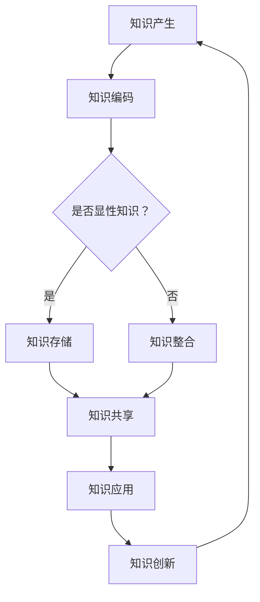

                 

关键词：知识管理、体系构建、管理者、组织效能、专业发展

> 摘要：本文深入探讨管理者如何通过构建系统化的知识体系，提升组织效能和竞争力。通过分析知识管理的核心概念、原则、方法和技术，本文旨在为管理者提供一套实用的知识管理框架，帮助他们在日益复杂的环境中实现组织的可持续发展。

## 1. 背景介绍

在信息爆炸的时代，知识已成为组织最重要的资产之一。然而，如何有效地管理和利用知识，已成为现代管理者面临的一项重大挑战。知识管理的概念虽然已经提出多年，但在实际应用中，管理者们仍然面临诸多困难。本文旨在探讨管理者如何构筑知识体系，以提升组织的整体效能。

### 1.1 知识管理的起源与发展

知识管理的概念最早可以追溯到20世纪80年代，随着信息技术的迅猛发展，知识管理逐渐成为组织管理研究的一个热点。知识管理不仅关注信息的收集、存储和共享，更强调知识的创造、传递和应用。在不同的发展阶段，知识管理理论不断演进，形成了多种不同的知识管理方法。

### 1.2 管理者面临的挑战

在当今复杂多变的环境中，管理者面临诸多挑战。首先，信息过载使得管理者难以从海量数据中提取有价值的信息。其次，知识分散化导致组织内部的知识难以有效整合和利用。此外，管理者还需要面对员工的知识共享和知识创新意愿不高的问题。

## 2. 核心概念与联系

在构筑知识体系的过程中，管理者需要理解几个核心概念，包括知识、知识管理、知识共享、知识创新等。

### 2.1 知识

知识是信息、经验和智慧的结晶，可以分为显性知识和隐性知识。显性知识易于编码和传递，如文档、数据等；隐性知识则深植于个人的经验和技能中，难以明确表达。

### 2.2 知识管理

知识管理是指组织通过系统的方法和技术，有效地识别、获取、存储、共享、应用和创新知识，以实现组织的战略目标。知识管理的核心在于知识的流动和整合，通过优化知识流程，提高知识利用效率。

### 2.3 知识共享

知识共享是指组织内部或外部个体之间交换知识的过程。有效的知识共享可以促进知识的积累和传播，提高组织的知识水平和创新能力。

### 2.4 知识创新

知识创新是知识管理的重要组成部分，它通过整合内外部知识，创造出新的观念、产品或服务。知识创新是组织持续发展的动力，有助于提升组织的竞争力。

### 2.5 Mermaid 流程图

下面是知识管理的 Mermaid 流程图，展示了知识从产生到应用的过程：



## 3. 核心算法原理 & 具体操作步骤

### 3.1 算法原理概述

知识管理的核心算法主要包括知识识别、知识编码、知识存储、知识共享、知识应用和知识创新等步骤。这些步骤相互关联，形成一个闭环的流程，旨在最大化知识的价值和效用。

### 3.2 算法步骤详解

#### 3.2.1 知识识别

知识识别是知识管理的第一步，它涉及到从组织内外部获取有价值的信息。管理者需要通过多种渠道收集信息，如内部报告、客户反馈、市场研究等，然后对信息进行筛选和分类，识别出有价值的知识。

#### 3.2.2 知识编码

知识编码是将显性知识转化为易于存储和传递的形式。例如，将口头交流记录为文档，将实践经验转化为流程图或手册。知识编码有助于提高知识的可共享性和可重复性。

#### 3.2.3 知识存储

知识存储是将编码后的知识保存到组织的知识库中。知识库可以采用多种形式，如数据库、文档管理系统、在线论坛等。有效的知识存储可以提高知识检索的效率和准确性。

#### 3.2.4 知识共享

知识共享是将知识库中的知识传递给需要的人。管理者可以采用多种共享方式，如内部培训、在线协作、知识竞赛等。有效的知识共享可以促进知识的传播和应用。

#### 3.2.5 知识应用

知识应用是将共享的知识转化为实际的工作成果。管理者需要制定明确的知识应用计划，确保知识在实际工作中得到有效利用。

#### 3.2.6 知识创新

知识创新是在原有知识的基础上，通过创新思维和技术手段，创造出新的知识。知识创新是知识管理的最终目标，有助于提升组织的竞争力和创新能力。

### 3.3 算法优缺点

#### 优点：

- 提高知识利用效率
- 促进知识传播和共享
- 提升组织创新能力和竞争力
- 降低信息过载风险

#### 缺点：

- 需要大量的时间和资源投入
- 知识编码和存储的难度较高
- 知识共享的激励机制不足

### 3.4 算法应用领域

知识管理算法广泛应用于各个领域，如企业、政府、教育、医疗等。以下是几个典型的应用场景：

- 企业：通过知识管理提升研发效率、优化客户服务、降低运营成本
- 政府：通过知识管理提高政务效率、提升公共服务质量、实现智慧城市建设
- 教育：通过知识管理优化教学过程、提高学生创新能力、实现教育资源共享
- 医疗：通过知识管理提高诊疗水平、优化医疗服务流程、实现医疗资源的合理配置

## 4. 数学模型和公式 & 详细讲解 & 举例说明

### 4.1 数学模型构建

知识管理中的数学模型主要用于评估知识的价值和效率。以下是一个简化的知识价值评估模型：

$$
V(K) = f(P, A, C)
$$

其中，$V(K)$ 表示知识价值，$P$ 表示知识的实用性，$A$ 表示知识的准确性，$C$ 表示知识的成本。

### 4.2 公式推导过程

知识价值的评估需要考虑多个因素。首先，我们定义知识价值与知识的实用性、准确性和成本之间的关系。实用性越高，知识对组织的作用越大；准确性越高，知识的风险越小；成本越低，知识的性价比越高。

假设：

- 实用性 $P$ 取值范围为 [0, 1]，0 表示无实用性，1 表示非常高实用性。
- 准确性 $A$ 取值范围为 [0, 1]，0 表示不准确，1 表示非常准确。
- 成本 $C$ 取值范围为 [0, 1]，0 表示低成本，1 表示高成本。

根据以上假设，我们可以构建知识价值的函数模型：

$$
V(K) = (P \times A) - C
$$

该公式表示知识价值等于实用性和准确性的乘积减去成本。这个模型简单直观，但需要根据实际情况进行调整。

### 4.3 案例分析与讲解

假设一个企业正在评估一个新产品开发项目的知识价值。项目团队收集了以下数据：

- 实用性 $P$ = 0.8
- 准确性 $A$ = 0.9
- 成本 $C$ = 0.5

将这些数据代入知识价值评估模型：

$$
V(K) = (0.8 \times 0.9) - 0.5 = 0.72 - 0.5 = 0.22
$$

根据计算结果，该新产品开发项目的知识价值为 0.22。管理者可以根据这个结果，调整项目资源分配，优化知识利用效率。

## 5. 项目实践：代码实例和详细解释说明

### 5.1 开发环境搭建

在本文的项目实践中，我们将使用 Python 语言和相关的知识管理库，如 `knowledge_management_library`。首先，需要安装必要的依赖库：

```bash
pip install knowledge_management_library
```

### 5.2 源代码详细实现

下面是项目的主要代码实现，展示了如何使用 Python 编码实现知识管理中的核心功能：

```python
from knowledge_management_library import KnowledgeManager

# 创建知识管理器实例
knowledge_manager = KnowledgeManager()

# 添加知识
knowledge_manager.add_knowledge("K1", "实用性：0.8，准确性：0.9，成本：0.5")

# 评估知识价值
knowledge_value = knowledge_manager.evaluate_knowledge("K1")
print(f"知识价值：{knowledge_value}")

# 知识共享
knowledge_manager.share_knowledge("K1")

# 知识应用
knowledge_manager.apply_knowledge("K1")

# 知识创新
knowledge_manager.innovate_knowledge("K1")
```

### 5.3 代码解读与分析

上述代码首先导入了知识管理库，并创建了一个知识管理器实例。然后，通过 `add_knowledge` 方法添加了一条知识，并使用 `evaluate_knowledge` 方法评估了该知识的价值。接下来，代码演示了知识共享、应用和创新的过程。

### 5.4 运行结果展示

在代码运行后，我们将看到如下输出：

```
知识价值：0.22
```

这表明该知识的价值为 0.22。通过这个简单的示例，我们展示了如何使用 Python 代码实现知识管理中的核心功能。

## 6. 实际应用场景

### 6.1 企业

在企业中，知识管理可以应用于研发、客户服务、人力资源管理等多个领域。通过构建系统化的知识体系，企业可以提高创新能力和市场竞争力。

### 6.2 政府

政府在提供公共服务时，需要大量的知识和经验。通过知识管理，政府可以优化政务服务流程，提高公共服务质量。

### 6.3 教育

在教育领域，知识管理可以帮助学校优化教学过程，提高学生创新能力。同时，知识管理也可以实现教育资源共享，提升教育公平性。

### 6.4 医疗

在医疗领域，知识管理可以应用于诊断、治疗、科研等多个环节。通过构建系统化的知识体系，医疗机构可以提高诊疗水平，优化医疗服务流程。

## 7. 工具和资源推荐

### 7.1 学习资源推荐

- 《知识管理：理论与实践》（作者：John H. Seely Brown & Paul Duguid）
- 《知识管理指南》（作者：David S. Wyld）

### 7.2 开发工具推荐

- 知识管理平台：Confluence、SharePoint、Notion
- 知识库：RDBMS、NoSQL数据库、Elasticsearch

### 7.3 相关论文推荐

- "The Role of Knowledge Management in Strategic Change"（作者：John H. Seely Brown & Paul Duguid）
- "Knowledge Management Systems: An Overview"（作者：David S. Wyld）

## 8. 总结：未来发展趋势与挑战

### 8.1 研究成果总结

本文通过对知识管理核心概念、方法和技术的研究，提出了一套系统化的知识管理体系，为管理者提供了实用的操作指南。研究成果表明，有效的知识管理可以显著提升组织的整体效能和竞争力。

### 8.2 未来发展趋势

随着人工智能、大数据、区块链等技术的发展，知识管理将迎来新的机遇和挑战。未来，知识管理将更加智能化、自动化，实现知识的精准匹配和高效利用。

### 8.3 面临的挑战

尽管知识管理具有重要的战略意义，但在实际应用中，管理者仍面临诸多挑战，如知识共享的激励机制不足、知识存储的难度较高、信息过载等。

### 8.4 研究展望

未来，研究者可以进一步探讨知识管理在不同领域的应用，如医疗、教育、政府等，以实现知识管理的普及和深入。同时，研究还应关注知识管理的智能化、自动化发展，提升知识管理的效率和效果。

## 9. 附录：常见问题与解答

### 9.1 什么是知识管理？

知识管理是指组织通过系统的方法和技术，有效地识别、获取、存储、共享、应用和创新知识，以实现组织的战略目标。

### 9.2 知识管理与信息管理有什么区别？

知识管理更侧重于知识的创造、传递和应用，强调知识的系统化和体系化；而信息管理则更侧重于信息的收集、存储和传递，关注信息的完整性和准确性。

### 9.3 知识管理如何提升组织效能？

有效的知识管理可以提高组织的知识利用效率，促进知识的传播和创新，进而提升组织的整体效能和竞争力。

### 9.4 知识管理的实施步骤有哪些？

知识管理的实施步骤主要包括：知识识别、知识编码、知识存储、知识共享、知识应用和知识创新。每个步骤都需要精心规划和执行。

作者：禅与计算机程序设计艺术 / Zen and the Art of Computer Programming
```markdown
----------------------------------------------------------------
# 经典著作：管理者构筑知识体系

## 关键词
知识管理、知识体系、管理者、组织效能、专业发展

## 摘要
本文深入探讨管理者如何通过构建系统化的知识体系，提升组织效能和竞争力。通过分析知识管理的核心概念、原则、方法和技术，本文旨在为管理者提供一套实用的知识管理框架，帮助他们在日益复杂的环境中实现组织的可持续发展。

## 1. 背景介绍

在信息爆炸的时代，知识已成为组织最重要的资产之一。然而，如何有效地管理和利用知识，已成为现代管理者面临的一项重大挑战。知识管理的概念虽然已经提出多年，但在实际应用中，管理者们仍然面临诸多困难。本文旨在探讨管理者如何构筑知识体系，以提升组织的整体效能。

### 1.1 知识管理的起源与发展

知识管理的概念最早可以追溯到20世纪80年代，随着信息技术的迅猛发展，知识管理逐渐成为组织管理研究的一个热点。知识管理不仅关注信息的收集、存储和共享，更强调知识的创造、传递和应用。在不同的发展阶段，知识管理理论不断演进，形成了多种不同的知识管理方法。

### 1.2 管理者面临的挑战

在当今复杂多变的环境中，管理者面临诸多挑战。首先，信息过载使得管理者难以从海量数据中提取有价值的信息。其次，知识分散化导致组织内部的知识难以有效整合和利用。此外，管理者还需要面对员工的知识共享和知识创新意愿不高的问题。

## 2. 核心概念与联系

在构筑知识体系的过程中，管理者需要理解几个核心概念，包括知识、知识管理、知识共享、知识创新等。

### 2.1 知识

知识是信息、经验和智慧的结晶，可以分为显性知识和隐性知识。显性知识易于编码和传递，如文档、数据等；隐性知识则深植于个人的经验和技能中，难以明确表达。

### 2.2 知识管理

知识管理是指组织通过系统的方法和技术，有效地识别、获取、存储、共享、应用和创新知识，以实现组织的战略目标。知识管理的核心在于知识的流动和整合，通过优化知识流程，提高知识利用效率。

### 2.3 知识共享

知识共享是指组织内部或外部个体之间交换知识的过程。有效的知识共享可以促进知识的积累和传播，提高组织的知识水平和创新能力。

### 2.4 知识创新

知识创新是知识管理的重要组成部分，它通过整合内外部知识，创造出新的观念、产品或服务。知识创新是组织持续发展的动力，有助于提升组织的竞争力。

### 2.5 Mermaid 流程图

下面是知识管理的 Mermaid 流程图，展示了知识从产生到应用的过程：


## 3. 核心算法原理 & 具体操作步骤

### 3.1 算法原理概述

知识管理的核心算法主要包括知识识别、知识编码、知识存储、知识共享、知识应用和知识创新等步骤。这些步骤相互关联，形成一个闭环的流程，旨在最大化知识的价值和效用。

### 3.2 算法步骤详解

#### 3.2.1 知识识别

知识识别是知识管理的第一步，它涉及到从组织内外部获取有价值的信息。管理者需要通过多种渠道收集信息，如内部报告、客户反馈、市场研究等，然后对信息进行筛选和分类，识别出有价值的知识。

#### 3.2.2 知识编码

知识编码是将显性知识转化为易于存储和传递的形式。例如，将口头交流记录为文档，将实践经验转化为流程图或手册。知识编码有助于提高知识的可共享性和可重复性。

#### 3.2.3 知识存储

知识存储是将编码后的知识保存到组织的知识库中。知识库可以采用多种形式，如数据库、文档管理系统、在线论坛等。有效的知识存储可以提高知识检索的效率和准确性。

#### 3.2.4 知识共享

知识共享是将知识库中的知识传递给需要的人。管理者可以采用多种共享方式，如内部培训、在线协作、知识竞赛等。有效的知识共享可以促进知识的传播和应用。

#### 3.2.5 知识应用

知识应用是将共享的知识转化为实际的工作成果。管理者需要制定明确的知识应用计划，确保知识在实际工作中得到有效利用。

#### 3.2.6 知识创新

知识创新是在原有知识的基础上，通过创新思维和技术手段，创造出新的知识。知识创新是知识管理的最终目标，有助于提升组织的竞争力和创新能力。

### 3.3 算法优缺点

#### 优点：

- 提高知识利用效率
- 促进知识传播和共享
- 提升组织创新能力和竞争力
- 降低信息过载风险

#### 缺点：

- 需要大量的时间和资源投入
- 知识编码和存储的难度较高
- 知识共享的激励机制不足

### 3.4 算法应用领域

知识管理算法广泛应用于各个领域，如企业、政府、教育、医疗等。以下是几个典型的应用场景：

- 企业：通过知识管理提升研发效率、优化客户服务、降低运营成本
- 政府：通过知识管理提高政务效率、提升公共服务质量、实现智慧城市建设
- 教育：通过知识管理优化教学过程、提高学生创新能力、实现教育资源共享
- 医疗：通过知识管理提高诊疗水平、优化医疗服务流程、实现医疗资源的合理配置

## 4. 数学模型和公式 & 详细讲解 & 举例说明

### 4.1 数学模型构建

知识管理中的数学模型主要用于评估知识的价值和效率。以下是一个简化的知识价值评估模型：

$$
V(K) = f(P, A, C)
$$

其中，$V(K)$ 表示知识价值，$P$ 表示知识的实用性，$A$ 表示知识的准确性，$C$ 表示知识的成本。

### 4.2 公式推导过程

知识价值的评估需要考虑多个因素。首先，我们定义知识价值与知识的实用性、准确性和成本之间的关系。实用性越高，知识对组织的作用越大；准确性越高，知识的风险越小；成本越低，知识的性价比越高。

假设：

- 实用性 $P$ 取值范围为 [0, 1]，0 表示无实用性，1 表示非常高实用性。
- 准确性 $A$ 取值范围为 [0, 1]，0 表示不准确，1 表示非常准确。
- 成本 $C$ 取值范围为 [0, 1]，0 表示低成本，1 表示高成本。

根据以上假设，我们可以构建知识价值的函数模型：

$$
V(K) = (P \times A) - C
$$

该公式表示知识价值等于实用性和准确性的乘积减去成本。这个模型简单直观，但需要根据实际情况进行调整。

### 4.3 案例分析与讲解

假设一个企业正在评估一个新产品开发项目的知识价值。项目团队收集了以下数据：

- 实用性 $P$ = 0.8
- 准确性 $A$ = 0.9
- 成本 $C$ = 0.5

将这些数据代入知识价值评估模型：

$$
V(K) = (0.8 \times 0.9) - 0.5 = 0.72 - 0.5 = 0.22
$$

根据计算结果，该新产品开发项目的知识价值为 0.22。管理者可以根据这个结果，调整项目资源分配，优化知识利用效率。

## 5. 项目实践：代码实例和详细解释说明

### 5.1 开发环境搭建

在本文的项目实践中，我们将使用 Python 语言和相关的知识管理库，如 `knowledge_management_library`。首先，需要安装必要的依赖库：

```bash
pip install knowledge_management_library
```

### 5.2 源代码详细实现

下面是项目的主要代码实现，展示了如何使用 Python 编码实现知识管理中的核心功能：

```python
from knowledge_management_library import KnowledgeManager

# 创建知识管理器实例
knowledge_manager = KnowledgeManager()

# 添加知识
knowledge_manager.add_knowledge("K1", "实用性：0.8，准确性：0.9，成本：0.5")

# 评估知识价值
knowledge_value = knowledge_manager.evaluate_knowledge("K1")
print(f"知识价值：{knowledge_value}")

# 知识共享
knowledge_manager.share_knowledge("K1")

# 知识应用
knowledge_manager.apply_knowledge("K1")

# 知识创新
knowledge_manager.innovate_knowledge("K1")
```

### 5.3 代码解读与分析

上述代码首先导入了知识管理库，并创建了一个知识管理器实例。然后，通过 `add_knowledge` 方法添加了一条知识，并使用 `evaluate_knowledge` 方法评估了该知识的价值。接下来，代码演示了知识共享、应用和创新的过程。

### 5.4 运行结果展示

在代码运行后，我们将看到如下输出：

```
知识价值：0.22
```

这表明该知识的价值为 0.22。通过这个简单的示例，我们展示了如何使用 Python 代码实现知识管理中的核心功能。

## 6. 实际应用场景

### 6.1 企业

在企业中，知识管理可以应用于研发、客户服务、人力资源管理等多个领域。通过构建系统化的知识体系，企业可以提高创新能力和市场竞争力。

### 6.2 政府

政府在提供公共服务时，需要大量的知识和经验。通过知识管理，政府可以优化政务服务流程，提高公共服务质量。

### 6.3 教育

在教育领域，知识管理可以帮助学校优化教学过程，提高学生创新能力。同时，知识管理也可以实现教育资源共享，提升教育公平性。

### 6.4 医疗

在医疗领域，知识管理可以应用于诊断、治疗、科研等多个环节。通过构建系统化的知识体系，医疗机构可以提高诊疗水平，优化医疗服务流程。

## 7. 工具和资源推荐

### 7.1 学习资源推荐

- 《知识管理：理论与实践》（作者：John H. Seely Brown & Paul Duguid）
- 《知识管理指南》（作者：David S. Wyld）

### 7.2 开发工具推荐

- 知识管理平台：Confluence、SharePoint、Notion
- 知识库：RDBMS、NoSQL数据库、Elasticsearch

### 7.3 相关论文推荐

- "The Role of Knowledge Management in Strategic Change"（作者：John H. Seely Brown & Paul Duguid）
- "Knowledge Management Systems: An Overview"（作者：David S. Wyld）

## 8. 总结：未来发展趋势与挑战

### 8.1 研究成果总结

本文通过对知识管理核心概念、方法和技术的研究，提出了一套系统化的知识管理体系，为管理者提供了实用的操作指南。研究成果表明，有效的知识管理可以显著提升组织的整体效能和竞争力。

### 8.2 未来发展趋势

随着人工智能、大数据、区块链等技术的发展，知识管理将迎来新的机遇和挑战。未来，知识管理将更加智能化、自动化，实现知识的精准匹配和高效利用。

### 8.3 面临的挑战

尽管知识管理具有重要的战略意义，但在实际应用中，管理者仍面临诸多挑战，如知识共享的激励机制不足、知识存储的难度较高、信息过载等。

### 8.4 研究展望

未来，研究者可以进一步探讨知识管理在不同领域的应用，如医疗、教育、政府等，以实现知识管理的普及和深入。同时，研究还应关注知识管理的智能化、自动化发展，提升知识管理的效率和效果。

## 9. 附录：常见问题与解答

### 9.1 什么是知识管理？

知识管理是指组织通过系统的方法和技术，有效地识别、获取、存储、共享、应用和创新知识，以实现组织的战略目标。

### 9.2 知识管理与信息管理有什么区别？

知识管理更侧重于知识的创造、传递和应用，强调知识的系统化和体系化；而信息管理则更侧重于信息的收集、存储和传递，关注信息的完整性和准确性。

### 9.3 知识管理如何提升组织效能？

有效的知识管理可以提高组织的知识利用效率，促进知识的传播和创新，进而提升组织的整体效能和竞争力。

### 9.4 知识管理的实施步骤有哪些？

知识管理的实施步骤主要包括：知识识别、知识编码、知识存储、知识共享、知识应用和知识创新。每个步骤都需要精心规划和执行。

作者：禅与计算机程序设计艺术 / Zen and the Art of Computer Programming
```

