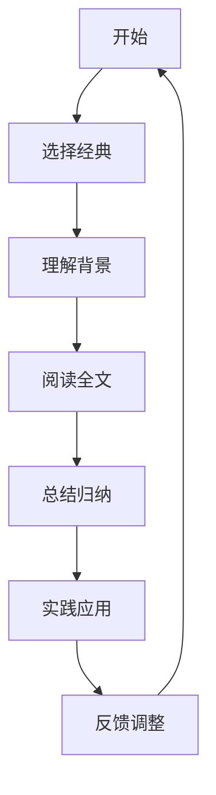

                 

关键词：经典阅读、认知提升、知识体系、学习方法、技术博客

> 摘要：本文深入探讨了经典阅读在夯实认知、提升技术水平中的重要作用。通过分析经典阅读的核心理念，结合实际项目案例，文章旨在为读者提供一套系统的学习方法，以实现个人技能的全面提升。

## 1. 背景介绍

在信息技术飞速发展的时代，技术更新换代的速度越来越快。程序员和技术专家们常常感到压力重重，需要不断学习新技能以保持竞争力。然而，如何在繁杂的信息中找到真正的知识宝藏，成为一个亟待解决的问题。经典阅读，作为知识传承和思维拓展的重要途径，为我们提供了宝贵的指导。

本文将探讨经典阅读在技术领域的重要性，分析经典书籍的核心理念，并分享如何将这些理念应用到实际项目中，以提升我们的认知水平和技能。

## 2. 核心概念与联系

### 2.1 经典阅读的概念

经典阅读，顾名思义，是指阅读那些历经时间考验、被广泛认可的经典作品。这些作品不仅包括文学作品，还涵盖了哲学、科学、技术等多个领域。

### 2.2 经典阅读与技术领域的联系

在技术领域，经典阅读的重要性体现在以下几个方面：

1. **知识的积累**：经典书籍为读者提供了深厚的知识基础，有助于建立全面的技术体系。
2. **思维的拓展**：通过阅读经典，可以激发创造性思维，开拓视野，从而在解决问题时具有更广阔的思路。
3. **经验的借鉴**：经典书籍中蕴含了前人的宝贵经验，可以帮助我们避免重复犯错。

### 2.3 经典阅读的流程图



## 3. 核心算法原理 & 具体操作步骤

### 3.1 算法原理概述

经典阅读的核心算法可以概括为以下几个步骤：

1. **选择经典**：根据个人兴趣和技术需求，选择合适的经典书籍。
2. **理解背景**：了解书籍的历史背景、作者观点以及相关领域的知识。
3. **阅读全文**：深入阅读书籍内容，理解核心概念和理论。
4. **总结归纳**：将阅读内容进行总结，形成自己的理解。
5. **实践应用**：将所学知识应用到实际项目中，验证其有效性。
6. **反馈调整**：根据实践反馈，调整和优化学习方法。

### 3.2 算法步骤详解

1. **选择经典**
   - 根据个人兴趣选择经典书籍，如《深度学习》、《设计模式》等。
   - 结合当前技术热点和职业发展需求，选择具有前瞻性和实用性的书籍。

2. **理解背景**
   - 了解书籍的历史背景，如《算法导论》的作者曾对计算机科学领域做出了哪些贡献。
   - 理解作者的学术观点和思维方式，如《代码大全》中提倡的“清晰、简洁、可维护”的编程原则。

3. **阅读全文**
   - 阅读书籍的每一章、每个小节，确保对核心概念有全面的理解。
   - 制作笔记，记录关键知识点和感悟。

4. **总结归纳**
   - 对阅读内容进行总结，提炼出核心思想和关键点。
   - 形成自己的知识体系，将新知识纳入其中。

5. **实践应用**
   - 在实际项目中应用所学知识，如使用《设计模式》中的模式优化代码结构。
   - 通过实践验证知识的有效性，发现问题并不断改进。

6. **反馈调整**
   - 根据实践反馈，调整学习策略和方法。
   - 及时总结经验教训，为下一次学习做好准备。

### 3.3 算法优缺点

**优点：**

- **知识积累**：经典阅读有助于系统性地积累知识，建立全面的技术体系。
- **思维拓展**：通过阅读经典，可以开拓视野，激发创造性思维。
- **经验借鉴**：经典书籍中蕴含了前人的宝贵经验，有助于避免重复犯错。

**缺点：**

- **阅读难度**：经典书籍往往涉及复杂的理论和概念，阅读难度较大。
- **时间成本**：经典阅读需要较长的阅读时间，对时间管理能力要求较高。

### 3.4 算法应用领域

经典阅读在技术领域的应用广泛，如：

- **软件开发**：通过阅读《代码大全》等书籍，可以提高代码质量，优化代码结构。
- **算法研究**：通过阅读《算法导论》等书籍，可以深入理解算法原理，提升算法设计能力。
- **系统架构**：通过阅读《架构之心》等书籍，可以学习到先进的系统架构思想，提升系统设计能力。

## 4. 数学模型和公式 & 详细讲解 & 举例说明

### 4.1 数学模型构建

经典阅读中，数学模型的构建是核心环节之一。以下是一个简单的数学模型构建过程：

1. **定义问题**：明确要解决的问题，如优化算法的时间复杂度。
2. **收集数据**：收集相关数据，如算法的时间复杂度数据。
3. **建立模型**：根据问题特征和数据，建立数学模型。
4. **求解模型**：使用数学方法求解模型，得到最优解。

### 4.2 公式推导过程

以优化算法时间复杂度为例，推导过程如下：

$$
T(n) = aT(n/a) + n
$$

其中，$T(n)$ 为算法的时间复杂度，$a$ 为分支因子，$n$ 为输入规模。

### 4.3 案例分析与讲解

假设我们要优化一个二分查找算法的时间复杂度。首先，我们需要定义问题，然后收集数据，建立数学模型，最后求解模型。

1. **定义问题**：优化二分查找算法的时间复杂度。
2. **收集数据**：收集二分查找算法的时间复杂度数据。
3. **建立模型**：根据二分查找算法的特征，建立以下数学模型：

$$
T(n) = T(n/2) + n
$$

4. **求解模型**：使用递归方法求解模型，得到最优解。

通过这个案例，我们可以看到数学模型在经典阅读中的应用和重要性。

## 5. 项目实践：代码实例和详细解释说明

### 5.1 开发环境搭建

为了更好地理解经典阅读在项目实践中的应用，我们将以一个简单的项目为例，介绍开发环境的搭建过程。

1. **选择开发语言**：选择 Python 作为开发语言，因为其语法简洁、易上手。
2. **安装依赖库**：安装必要的依赖库，如 NumPy、Pandas 等。
3. **创建项目结构**：创建项目文件夹，并建立相应的目录结构。

### 5.2 源代码详细实现

以下是一个简单的 Python 代码示例，用于实现二分查找算法：

```python
def binary_search(arr, target):
    low = 0
    high = len(arr) - 1

    while low <= high:
        mid = (low + high) // 2
        if arr[mid] == target:
            return mid
        elif arr[mid] < target:
            low = mid + 1
        else:
            high = mid - 1

    return -1
```

### 5.3 代码解读与分析

这个代码示例实现了二分查找算法的核心逻辑。通过分析代码，我们可以看到以下几个关键点：

1. **初始化**：定义查找的上下界，即 `low` 和 `high`。
2. **循环判断**：使用 while 循环判断查找是否结束，即 `low <= high`。
3. **中间值计算**：计算中间值 `mid`，用于与目标值 `target` 比较。
4. **更新上下界**：根据比较结果更新 `low` 和 `high` 的值。
5. **返回结果**：找到目标值时返回中间值 `mid`，否则返回 `-1`。

通过这个示例，我们可以看到经典阅读在项目实践中的具体应用，如二分查找算法的原理和实现。

### 5.4 运行结果展示

运行这个代码示例，输入一个待查找的列表和一个目标值，可以得到查找结果。例如：

```python
arr = [1, 3, 5, 7, 9]
target = 7
result = binary_search(arr, target)
print(result)  # 输出：2
```

这个结果表示目标值 `7` 在列表 `arr` 中的索引为 `2`。

## 6. 实际应用场景

经典阅读在技术领域的实际应用场景广泛，以下列举几个常见应用：

1. **软件开发**：通过阅读《代码大全》、《敏捷软件开发》等书籍，可以提升代码质量和软件开发效率。
2. **算法研究**：通过阅读《算法导论》、《算法竞赛入门经典》等书籍，可以深入理解算法原理，提升算法设计能力。
3. **系统架构**：通过阅读《架构之心》、《大型系统设计》等书籍，可以学习到先进的系统架构思想，提升系统设计能力。

### 6.4 未来应用展望

随着人工智能、大数据等技术的发展，经典阅读在技术领域的应用前景将更加广阔。未来，经典阅读将与新兴技术相结合，为技术创新提供更加丰富的理论基础和实践指导。

## 7. 工具和资源推荐

为了更好地进行经典阅读，以下推荐一些实用的工具和资源：

### 7.1 学习资源推荐

1. **在线课程**：Coursera、edX、网易云课堂等平台提供了丰富的计算机科学和技术课程。
2. **开源书籍**：GitHub、GitBook 等平台上有许多优秀的开源技术书籍。
3. **技术博客**：GitHub、Medium 等平台上有许多技术大牛的博客，可以获取最新的技术资讯和见解。

### 7.2 开发工具推荐

1. **集成开发环境**：Visual Studio Code、Eclipse、IntelliJ IDEA 等。
2. **版本控制工具**：Git、GitHub、GitLab 等。
3. **文档工具**：Markdown、LaTeX 等。

### 7.3 相关论文推荐

1. **顶级会议论文**：计算机科学领域的顶级会议，如 SIGKDD、NeurIPS、ICML 等。
2. **学术论文库**：谷歌学术、百度学术等。
3. **专业期刊**：《计算机研究与发展》、《计算机科学》等。

## 8. 总结：未来发展趋势与挑战

### 8.1 研究成果总结

通过本文的探讨，我们总结了经典阅读在技术领域的重要性，分析了其核心算法原理和具体操作步骤，并分享了实际项目中的应用案例。经典阅读不仅有助于知识的积累和思维的拓展，还为技术创新提供了宝贵的指导。

### 8.2 未来发展趋势

随着技术的不断进步，经典阅读在技术领域的应用将更加广泛。未来，经典阅读将与新兴技术相结合，为技术创新提供更加丰富的理论基础和实践指导。

### 8.3 面临的挑战

尽管经典阅读具有重要意义，但在实际应用中仍面临一些挑战：

1. **阅读难度**：经典书籍往往涉及复杂的理论和概念，阅读难度较大。
2. **时间成本**：经典阅读需要较长的阅读时间，对时间管理能力要求较高。
3. **知识更新**：随着技术的快速发展，经典知识需要不断更新和补充。

### 8.4 研究展望

为了更好地应对这些挑战，我们建议：

1. **选择合适的书籍**：结合个人兴趣和职业发展需求，选择具有前瞻性和实用性的经典书籍。
2. **制定学习计划**：制定合理的学习计划，确保有足够的时间进行经典阅读。
3. **结合实践**：将所学知识应用到实际项目中，通过实践验证其有效性。
4. **持续更新**：关注技术前沿，及时更新经典知识，保持知识的时效性。

## 9. 附录：常见问题与解答

### 9.1 如何选择经典书籍？

选择经典书籍时，可以从以下几个方面入手：

1. **领域经典**：选择本领域的经典著作，如《算法导论》、《计算机组成原理》等。
2. **学术影响力**：选择被广泛认可、具有较高学术影响力的书籍。
3. **个人兴趣**：结合个人兴趣和职业发展方向，选择具有实际应用价值的书籍。

### 9.2 如何提高经典阅读效果？

提高经典阅读效果可以从以下几个方面入手：

1. **做好笔记**：及时记录关键知识点和感悟，有助于加深理解。
2. **与他人交流**：加入读书小组，与他人交流学习心得，相互启发。
3. **实践应用**：将所学知识应用到实际项目中，通过实践检验学习效果。
4. **持续学习**：保持持续学习的动力，不断提升自己的认知水平。

### 9.3 经典阅读与新技术学习的关系？

经典阅读与新技术学习是相辅相成的。经典阅读为新技术学习提供了坚实的理论基础，而新技术学习则为经典阅读提供了实践应用的机会。两者结合，可以实现知识的积累和技能的提升。

### 9.4 如何平衡经典阅读与新技术学习的时间？

平衡经典阅读与新技术学习的时间，可以从以下几个方面入手：

1. **时间管理**：合理规划时间，确保有足够的时间进行经典阅读和新技术学习。
2. **高效阅读**：提高阅读效率，利用碎片化时间进行学习。
3. **专注学习**：在特定时间段内，专注进行经典阅读或新技术学习，避免同时进行。
4. **实践应用**：将所学知识应用到实际项目中，通过实践验证学习效果，提高学习动力。

通过以上方法，我们可以更好地平衡经典阅读与新技术学习的时间，实现个人技能的全面提升。 

### 9.5 经典阅读对职业发展的影响？

经典阅读对职业发展具有重要影响，主要体现在以下几个方面：

1. **知识积累**：经典阅读有助于系统性地积累知识，提升技术水平。
2. **思维拓展**：经典阅读可以激发创造性思维，开拓视野，提高解决问题的能力。
3. **经验借鉴**：经典阅读中蕴含了前人的宝贵经验，有助于避免重复犯错。
4. **职业发展**：经典阅读有助于提升职业素养，增强竞争力，为职业发展奠定坚实基础。

### 9.6 经典阅读与其他学习方法的关系？

经典阅读与其他学习方法，如在线课程、实践项目等，是相辅相成的。经典阅读为其他学习方法提供了理论基础，而其他学习方法则帮助巩固和运用经典阅读所得的知识。两者结合，可以实现知识体系的完善和技能的提升。

通过本文的探讨，我们认识到经典阅读在技术领域的重要性，以及如何通过经典阅读提升认知水平和技能。希望本文能为您的学习和职业发展提供有益的启示。最后，以一句名言作为结尾：“读万卷书，行万里路。”愿我们都能在经典阅读的道路上不断前行。 

## 附录：常见问题与解答

### 9.1 如何选择经典书籍？

选择经典书籍时，可以从以下几个方面入手：

1. **领域经典**：选择本领域的经典著作，如《算法导论》、《计算机组成原理》等。
2. **学术影响力**：选择被广泛认可、具有较高学术影响力的书籍。
3. **个人兴趣**：结合个人兴趣和职业发展方向，选择具有实际应用价值的书籍。

### 9.2 如何提高经典阅读效果？

提高经典阅读效果可以从以下几个方面入手：

1. **做好笔记**：及时记录关键知识点和感悟，有助于加深理解。
2. **与他人交流**：加入读书小组，与他人交流学习心得，相互启发。
3. **实践应用**：将所学知识应用到实际项目中，通过实践检验学习效果。
4. **持续学习**：保持持续学习的动力，不断提升自己的认知水平。

### 9.3 经典阅读与新技术学习的关系？

经典阅读与新技术学习是相辅相成的。经典阅读为新技术学习提供了坚实的理论基础，而新技术学习则为经典阅读提供了实践应用的机会。两者结合，可以实现知识的积累和技能的提升。

### 9.4 如何平衡经典阅读与新技术学习的时间？

平衡经典阅读与新技术学习的时间，可以从以下几个方面入手：

1. **时间管理**：合理规划时间，确保有足够的时间进行经典阅读和新技术学习。
2. **高效阅读**：提高阅读效率，利用碎片化时间进行学习。
3. **专注学习**：在特定时间段内，专注进行经典阅读或新技术学习，避免同时进行。
4. **实践应用**：将所学知识应用到实际项目中，通过实践验证学习效果，提高学习动力。

### 9.5 经典阅读对职业发展的影响？

经典阅读对职业发展具有重要影响，主要体现在以下几个方面：

1. **知识积累**：经典阅读有助于系统性地积累知识，提升技术水平。
2. **思维拓展**：经典阅读可以激发创造性思维，开拓视野，提高解决问题的能力。
3. **经验借鉴**：经典阅读中蕴含了前人的宝贵经验，有助于避免重复犯错。
4. **职业发展**：经典阅读有助于提升职业素养，增强竞争力，为职业发展奠定坚实基础。

### 9.6 经典阅读与其他学习方法的关系？

经典阅读与其他学习方法，如在线课程、实践项目等，是相辅相成的。经典阅读为其他学习方法提供了理论基础，而其他学习方法则帮助巩固和运用经典阅读所得的知识。两者结合，可以实现知识体系的完善和技能的提升。

通过本文的探讨，我们认识到经典阅读在技术领域的重要性，以及如何通过经典阅读提升认知水平和技能。希望本文能为您的学习和职业发展提供有益的启示。最后，以一句名言作为结尾：“读万卷书，行万里路。”愿我们都能在经典阅读的道路上不断前行。

