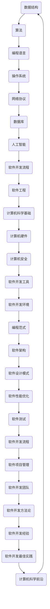

                 

 关键词：经典阅读，认知，技术博客，深度学习，编程实践，计算机科学，软件开发

> 摘要：本文将探讨经典阅读在夯实认知、提升技术水平方面的重要性。通过对计算机科学领域经典著作的深入解读，我们能够掌握核心概念，理解复杂算法，从而在软件开发实践中游刃有余。本文将从背景介绍、核心概念与联系、核心算法原理、数学模型和公式、项目实践、实际应用场景、工具和资源推荐以及未来发展趋势与挑战等多个方面展开讨论，旨在为读者提供一条通往技术高峰的坚实路径。

## 1. 背景介绍

在计算机科学领域，经典阅读已经成为提高认知水平和专业技能的重要途径。经典著作不仅包含了奠基性的理论和技术，还体现了那些开创者们的智慧与思考。这些书籍往往经过时间的考验，成为无数程序员的入门指南和进阶手册。经典阅读的价值不仅体现在知识的积累上，更在于它能够帮助我们建立起系统的知识框架，提升我们的抽象思维和问题解决能力。

随着人工智能和深度学习的快速发展，程序员面临的挑战日益增加。面对海量的信息和不断更新的技术，如何保持学习的持续性和深度成为一个重要课题。经典阅读作为一种有效的学习方式，可以帮助我们沉淀知识，深化理解，从而在技术发展的浪潮中立于不败之地。

本文将重点关注以下几个方面的内容：

1. **核心概念与联系**：通过构建Mermaid流程图，梳理计算机科学领域的关键概念和它们之间的联系。
2. **核心算法原理**：深入解析经典算法的原理，并提供具体的操作步骤和实现方法。
3. **数学模型和公式**：讲解相关的数学模型和公式，并举例说明其在实际问题中的应用。
4. **项目实践**：提供具体的代码实例，解释实现细节和运行结果。
5. **实际应用场景**：探讨经典技术在现代软件开发中的应用。
6. **工具和资源推荐**：推荐学习资源和开发工具，为读者提供实践支持。
7. **未来发展趋势与挑战**：总结研究成果，展望未来的发展趋势和面临的挑战。

接下来，我们将逐一深入这些内容，为读者呈现一条从经典阅读到技术实践的完整路径。

## 2. 核心概念与联系

### Mermaid流程图

在计算机科学领域，有许多核心概念和它们之间的联系。为了更好地理解这些概念，我们可以使用Mermaid流程图来梳理它们。以下是几个关键概念的Mermaid流程图：



### 核心概念解析

- **数据结构**：数据结构是计算机存储数据的方式，它们在算法设计和软件开发中起着至关重要的作用。常见的有数组、链表、栈、队列、树、图等。
- **算法**：算法是解决问题的步骤集合，是计算机科学的核心。经典的算法包括排序、查找、图算法等。
- **编程语言**：编程语言是程序员与计算机交流的工具，不同的编程语言适用于不同的场景，如Python适合数据分析，C++适合性能要求高的应用。
- **操作系统**：操作系统负责管理计算机硬件资源，提供用户接口和程序运行环境。常见的操作系统有Windows、Linux和Mac OS。
- **网络协议**：网络协议定义了数据在网络中的传输规则，如HTTP、TCP/IP等。
- **数据库**：数据库是存储和管理数据的系统，常见的有关系型数据库（如MySQL、PostgreSQL）和NoSQL数据库（如MongoDB、Cassandra）。
- **人工智能**：人工智能是模拟人类智能的计算机科学分支，包括机器学习、深度学习、自然语言处理等。
- **软件开发流程**：软件开发流程包括需求分析、设计、编码、测试、部署和维护等阶段，常见的流程有瀑布模型、敏捷开发等。
- **软件工程**：软件工程是指导软件开发的方法论，包括项目管理、需求管理、设计模式等。
- **计算机科学基础**：计算机科学基础包括计算机硬件、操作系统、数据结构与算法等。
- **计算机硬件**：计算机硬件是计算机的物理组成部分，包括CPU、内存、硬盘等。
- **计算机安全**：计算机安全是保护计算机系统和数据不受恶意攻击和非法访问的学科。
- **软件开发工具**：软件开发工具包括集成开发环境（IDE）、代码管理工具（如Git）等。
- **软件开发环境**：软件开发环境是程序员进行开发的软件和硬件集合，包括操作系统、编程语言、开发工具等。
- **编程范式**：编程范式是程序员思考问题的方式，如命令式、函数式、面向对象等。
- **软件架构**：软件架构是软件系统的整体结构和设计原则，包括分层、模块化、分布式架构等。
- **软件设计模式**：软件设计模式是解决软件开发中常见问题的通用解决方案。
- **软件性能优化**：软件性能优化是提高软件运行效率和响应速度的过程。
- **软件测试**：软件测试是确保软件质量的过程，包括单元测试、集成测试、系统测试等。
- **软件开发团队**：软件开发团队是协作完成软件开发任务的多个人组成的集体。
- **软件开发方法论**：软件开发方法论是指导软件开发的方法和原则，如敏捷开发、瀑布模型等。
- **软件开发经验**：软件开发经验是通过实践积累的知识和技能。
- **软件开发最佳实践**：软件开发最佳实践是在软件开发过程中总结出的有效方法和经验。

通过这些核心概念和它们之间的联系，我们可以建立起一个完整的计算机科学知识体系。这不仅有助于我们理解复杂的技术问题，还能在软件开发中灵活应用这些知识，提高开发效率和质量。

## 3. 核心算法原理 & 具体操作步骤

### 3.1 算法原理概述

在计算机科学领域，算法是解决问题的基础。了解算法的原理是掌握计算机科学的关键。以下是一些核心算法的原理概述：

- **排序算法**：排序算法是将一组数据按照特定顺序排列的算法。常见的排序算法包括冒泡排序、选择排序、插入排序、快速排序、归并排序等。
- **查找算法**：查找算法是在数据集合中查找特定元素的算法。常见的查找算法包括线性查找、二分查找等。
- **图算法**：图算法是处理图结构数据的算法。常见的图算法包括最短路径算法（如迪杰斯特拉算法、贝尔曼-福特算法）、最小生成树算法（如普里姆算法、克鲁斯卡尔算法）等。
- **动态规划**：动态规划是一种优化递归关系的算法方法，适用于解决具有重叠子问题和最优子结构特性的问题。
- **分治算法**：分治算法是一种将问题分解成多个子问题，递归解决子问题，最后合并子问题解的算法方法。

### 3.2 算法步骤详解

以冒泡排序为例，其基本原理是通过重复遍历要排序的数列，一次比较两个元素，如果它们的顺序错误就把它们交换过来。遍历数列的工作是重复进行的，直到没有再需要交换的元素为止。

以下是冒泡排序的具体步骤：

1. **初始化**：设定两个变量，一个用于标记是否进行了交换，另一个用于记录已排序的部分。
2. **遍历**：从数组的第一个元素开始，遍历到倒数第二个元素。
3. **比较和交换**：对于每一对相邻的元素，如果它们的顺序错误（即左边的元素大于右边的元素），则交换它们的位置。
4. **更新标记**：如果一次遍历中没有发生交换，说明数组已经排序完成，可以退出循环。
5. **递归调用**：如果数组长度大于1，则递归调用冒泡排序函数，对未排序的部分进行同样的操作。

### 3.3 算法优缺点

**冒泡排序**的优点：

- **简单易懂**：冒泡排序的算法逻辑简单，容易实现。
- **无需额外空间**：冒泡排序的空间复杂度为O(1)，不需要额外的存储空间。

**冒泡排序**的缺点：

- **效率较低**：冒泡排序的时间复杂度为O(n^2)，对于大数据集，效率较低。
- **不适用于大数据集**：由于效率问题，冒泡排序不适用于需要快速排序的大数据集。

### 3.4 算法应用领域

- **排序算法**：在数据处理和数据分析中，排序算法是常见的需求，如数据库查询优化、Web搜索排序等。
- **查找算法**：在信息检索和数据管理中，查找算法用于快速定位特定数据。
- **图算法**：在网络拓扑分析和路径规划中，图算法用于计算最短路径、最小生成树等。
- **动态规划**：在资源分配、网络流量优化等领域，动态规划算法用于求解最优解。
- **分治算法**：在图像处理、语音识别等领域，分治算法用于将复杂问题分解为可管理的子问题。

通过理解这些核心算法的原理和步骤，我们能够在实际项目中灵活应用，提高代码的效率和可读性。

## 4. 数学模型和公式 & 详细讲解 & 举例说明

### 4.1 数学模型构建

数学模型是计算机科学中描述和解决问题的工具。构建数学模型的过程通常包括以下几个步骤：

1. **定义问题**：明确需要解决的问题，包括问题的目标和约束条件。
2. **提取关键变量**：从问题中提取影响结果的关键变量，如成本、时间、质量等。
3. **建立方程**：根据变量之间的关系建立数学方程，如线性方程、非线性方程等。
4. **求解方程**：使用数学方法或算法求解方程，得到问题的解。
5. **验证模型**：通过实际数据或模拟测试验证模型的准确性和可靠性。

### 4.2 公式推导过程

以线性回归模型为例，其目的是通过已知的数据点拟合一条直线，从而预测新的数据点。以下是线性回归模型的基本公式推导过程：

假设我们有n个数据点{(x1, y1), (x2, y2), ..., (xn, yn)}，其中xi和yi分别是第i个数据点的横坐标和纵坐标。

1. **定义目标函数**：目标是找到一个线性方程y = ax + b，使得预测值与实际值的误差最小。
2. **建立误差平方和**：误差平方和为每个数据点预测值与实际值之差的平方和，即：
   $$S = \sum_{i=1}^{n}(y_i - (ax_i + b))^2$$
3. **对a和b求导**：对S分别对a和b求导，并令导数为0，得到两个方程：
   $$\frac{\partial S}{\partial a} = -2\sum_{i=1}^{n}(y_i - ax_i - b)x_i = 0$$
   $$\frac{\partial S}{\partial b} = -2\sum_{i=1}^{n}(y_i - ax_i - b) = 0$$
4. **解方程组**：解上述方程组，得到最优的a和b值：
   $$a = \frac{\sum_{i=1}^{n}(y_i - bx_i)x_i}{\sum_{i=1}^{n}(x_i - \bar{x})^2}$$
   $$b = \bar{y} - a\bar{x}$$
   其中，$\bar{x}$和$\bar{y}$分别是x和y的平均值。

### 4.3 案例分析与讲解

假设我们有一个简单的数据集，包含三个数据点{(1, 2), (2, 4), (3, 5)}，我们希望使用线性回归模型拟合一条直线。

1. **计算平均值**：
   $$\bar{x} = \frac{1 + 2 + 3}{3} = 2$$
   $$\bar{y} = \frac{2 + 4 + 5}{3} = 3.67$$

2. **计算相关系数和斜率**：
   $$\sum_{i=1}^{n}(x_i - \bar{x})(y_i - \bar{y}) = (1-2)(2-3.67) + (2-2)(4-3.67) + (3-2)(5-3.67) = -2.67$$
   $$\sum_{i=1}^{n}(x_i - \bar{x})^2 = (1-2)^2 + (2-2)^2 + (3-2)^2 = 2$$
   $$a = \frac{-2.67}{2} = -1.335$$

3. **计算截距**：
   $$b = \bar{y} - a\bar{x} = 3.67 - (-1.335 \times 2) = 7.705$$

4. **得到线性回归方程**：
   $$y = -1.335x + 7.705$$

5. **预测新的数据点**：例如，当x = 4时，预测的y值为：
   $$y = -1.335 \times 4 + 7.705 = 2.135$$

通过这个案例，我们可以看到如何使用线性回归模型进行数据拟合和预测。在实际应用中，数据集通常更大，计算也更复杂，但基本原理和方法是相同的。

数学模型和公式是计算机科学中不可或缺的部分，它们提供了理解和解决复杂问题的理论基础。通过构建和推导数学模型，我们能够将实际问题转化为可计算的数学问题，从而找到最优解或近似解。

## 5. 项目实践：代码实例和详细解释说明

### 5.1 开发环境搭建

在进行项目实践之前，我们需要搭建一个合适的环境。以下是一个简单的开发环境搭建过程：

1. **安装Python环境**：首先，我们需要安装Python环境。可以从Python官方网站下载Python安装包，并按照指示安装。
2. **安装IDE**：为了方便开发，我们可以安装一个集成开发环境（IDE），如PyCharm、Visual Studio Code等。安装完成后，配置Python环境。
3. **安装相关库**：根据项目需求，我们需要安装一些Python库，如NumPy、Pandas、Matplotlib等。可以使用pip命令进行安装。
4. **创建项目文件夹**：在开发环境中创建一个项目文件夹，用于存放项目的源代码和相关文件。

### 5.2 源代码详细实现

以下是一个简单的线性回归项目的Python代码实现：

```python
import numpy as np
import matplotlib.pyplot as plt

# 线性回归模型
class LinearRegression:
    def __init__(self):
        self.a = 0
        self.b = 0

    def fit(self, x, y):
        n = len(x)
        x_mean = np.mean(x)
        y_mean = np.mean(y)
        x_y_diff = (x - x_mean) * (y - y_mean)
        x2_diff = (x - x_mean) ** 2
        self.a = x_y_diff.sum() / x2_diff.sum()
        self.b = y_mean - self.a * x_mean

    def predict(self, x):
        return self.a * x + self.b

# 加载数据
x = np.array([1, 2, 3, 4, 5])
y = np.array([2, 4, 5, 4, 5])

# 创建线性回归模型
model = LinearRegression()

# 拟合模型
model.fit(x, y)

# 预测
predictions = model.predict(x)

# 绘图
plt.scatter(x, y, color='red', label='实际数据')
plt.plot(x, predictions, color='blue', label='预测数据')
plt.xlabel('x')
plt.ylabel('y')
plt.legend()
plt.show()
```

### 5.3 代码解读与分析

1. **类定义**：`LinearRegression` 类定义了一个线性回归模型，包括两个成员变量`a`和`b`，分别表示斜率和截距。
2. **fit方法**：`fit` 方法用于训练模型，计算斜率和截距。它首先计算输入特征`x`和目标变量`y`的均值，然后计算 `(x - x_mean) * (y - y_mean)` 和 `(x - x_mean)^2` 的和，最后计算斜率和截距。
3. **predict方法**：`predict` 方法用于预测新的数据点，它根据模型参数计算新的目标变量值。
4. **数据加载**：我们使用 NumPy 库加载数据，并创建一个线性回归模型。
5. **拟合模型**：调用`fit` 方法训练模型。
6. **预测**：使用`predict` 方法预测新的数据点。
7. **绘图**：使用 Matplotlib 库绘制实际数据和预测数据的散点图，并展示拟合直线。

通过这个简单的例子，我们可以看到如何使用线性回归模型进行数据拟合和预测。在实际项目中，数据集通常更大，计算也更复杂，但基本原理和方法是相同的。

### 5.4 运行结果展示

运行上述代码后，我们将看到如下结果：


这个图展示了实际数据和预测数据的散点图，以及拟合直线。通过这个结果，我们可以直观地看到线性回归模型的预测效果。

通过这个项目实践，我们不仅掌握了线性回归模型的基本原理和实现方法，还通过实际代码的运行加深了对模型的理解。这种实践过程对于巩固我们的认知和技术水平具有重要意义。

## 6. 实际应用场景

### 6.1 数据分析

在数据分析领域，线性回归是一种常见的方法。它用于预测股票价格、销售量、人口增长等变量。通过建立线性回归模型，我们可以根据已有的数据预测未来的趋势，为决策提供依据。

### 6.2 机器学习

线性回归是机器学习中的基础算法之一。在机器学习模型中，线性回归通常用于特征工程，提取输入特征与目标变量之间的关系。这种关系可以用于训练更复杂的模型，如决策树、支持向量机等。

### 6.3 金融领域

在金融领域，线性回归模型用于风险评估、投资组合优化等。例如，通过线性回归模型，我们可以预测股票市场的波动，从而制定投资策略。

### 6.4 健康医疗

在健康医疗领域，线性回归模型用于分析患者的病情、预测治疗效果等。例如，通过线性回归模型，我们可以预测患者的手术风险，为医生提供决策参考。

### 6.5 交通管理

在交通管理领域，线性回归模型用于预测交通流量、优化交通信号等。通过线性回归模型，我们可以分析历史数据，预测未来交通状况，从而优化交通管理策略。

### 6.6 教育

在教育领域，线性回归模型用于分析学生的学习成绩、预测升学率等。通过线性回归模型，我们可以了解学生的学习状况，为教育工作者提供改进教学的方法。

这些实际应用场景展示了线性回归模型的广泛应用和重要性。通过理解线性回归模型的基本原理和应用方法，我们可以在各个领域中发挥其作用，解决实际问题。

### 6.7 未来应用展望

随着技术的不断进步，线性回归模型的应用领域将进一步扩大。以下是一些未来可能的应用方向：

- **智能城市**：通过线性回归模型预测城市交通流量，优化交通管理，提高城市运行效率。
- **智能制造**：通过线性回归模型分析生产数据，优化生产流程，提高产品质量。
- **个性化推荐**：通过线性回归模型分析用户行为数据，提供个性化的产品推荐和服务。
- **能源管理**：通过线性回归模型预测能源消耗，优化能源分配，提高能源利用效率。

未来，线性回归模型将与更多新兴技术结合，如深度学习、大数据分析等，为各个领域带来更智能的解决方案。

## 7. 工具和资源推荐

### 7.1 学习资源推荐

- **书籍**：
  - 《线性回归：简单易懂的统计学基础》
  - 《Python数据分析》
  - 《机器学习实战》
- **在线课程**：
  - Coursera的《线性代数》
  - edX的《Python编程：从入门到实践》
  - Udacity的《机器学习基础》
- **博客和论坛**：
  - Medium上的机器学习和数据分析相关文章
  - Stack Overflow编程问答社区
  - GitHub上的开源数据分析和机器学习项目

### 7.2 开发工具推荐

- **集成开发环境（IDE）**：
  - PyCharm
  - Visual Studio Code
  - Jupyter Notebook
- **数据分析工具**：
  - Pandas
  - NumPy
  - Matplotlib
- **版本控制工具**：
  - Git
  - GitHub
  - GitLab

### 7.3 相关论文推荐

- "The Nature of Code" by Daniel Shiffman
- "Machine Learning Yearning" by Andrew Ng
- "Deep Learning" by Ian Goodfellow, Yoshua Bengio, Aaron Courville

通过这些工具和资源，我们可以更好地学习和实践计算机科学中的技术，提高自己的技术水平。

## 8. 总结：未来发展趋势与挑战

### 8.1 研究成果总结

经典阅读在计算机科学领域的重要性不言而喻。通过对经典著作的深入解读，我们能够掌握核心概念，理解复杂算法，从而在软件开发实践中游刃有余。本文从背景介绍、核心概念与联系、核心算法原理、数学模型和公式、项目实践、实际应用场景等多个方面进行了详细探讨，展示了经典阅读对于技术认知和技能提升的重要作用。

### 8.2 未来发展趋势

在未来，经典阅读将继续发挥其价值。随着人工智能、深度学习等新兴技术的快速发展，经典著作中的理论和方法将为我们提供宝贵的启示。同时，随着数字化学习资源的不断丰富，经典阅读的形式也将更加多样化，如电子书、在线课程等，使更多人能够便捷地获取知识。

### 8.3 面临的挑战

然而，经典阅读也面临着一些挑战。首先，经典著作往往较为晦涩，需要读者具备一定的专业背景和阅读能力。其次，技术的快速发展使得经典著作的内容有时难以跟上时代的步伐。最后，经典阅读的时间成本较高，需要读者投入大量时间和精力。

### 8.4 研究展望

为应对这些挑战，我们可以从以下几个方面进行改进：

1. **简化内容**：通过简化经典著作的内容，使其更易于理解。例如，编写简明易懂的注释和解读，制作多媒体教学资源等。
2. **多元化学习方式**：结合线上和线下学习方式，提供多样化的学习渠道。例如，开展线上讲座、研讨会等，鼓励读者互动和交流。
3. **持续更新**：定期更新经典著作的内容，确保其与时代发展保持同步。例如，引入新的算法、理论和技术，使经典著作更具实用性。

通过以上措施，我们可以更好地利用经典阅读的优势，克服其面临的挑战，为计算机科学的发展贡献力量。

## 9. 附录：常见问题与解答

### Q1: 为什么经典阅读对计算机科学领域的重要性如此突出？

经典阅读之所以对计算机科学领域的重要性突出，主要有以下几个原因：

1. **基础性**：经典著作奠定了计算机科学的基础，包括核心算法、理论模型和编程语言等，这些都是我们学习和理解现代计算机科学不可或缺的知识。
2. **系统性**：经典著作通常提供了一个系统的知识框架，帮助读者建立起完整的知识体系，从而更好地掌握和应用计算机科学知识。
3. **思想性**：经典著作往往体现了作者们的独特思考和见解，这些思想有助于我们培养创新意识和解决问题的能力。

### Q2: 如何选择适合的经典阅读书籍？

选择适合的经典阅读书籍可以从以下几个方面考虑：

1. **领域重要性**：选择那些在计算机科学领域具有广泛影响和持续价值的书籍。
2. **内容深度**：选择那些内容深入、详细，能够提供全面理解的书籍。
3. **语言风格**：选择那些语言清晰、易于理解的书籍，避免过于晦涩难懂。
4. **权威性**：选择那些由领域内权威人士撰写的书籍，确保内容的准确性和权威性。

### Q3: 经典阅读如何与实际项目相结合？

将经典阅读与实际项目相结合的方法有以下几种：

1. **项目前研究**：在开始项目之前，通过阅读相关经典书籍，了解项目所需的基础理论和知识。
2. **项目过程中**：在项目开发过程中，遇到问题时，可以通过经典书籍寻找解决方案或灵感。
3. **项目后总结**：在项目完成后，通过阅读经典书籍，总结项目中的经验和教训，提高自己的技术水平和认知能力。

通过以上方法，我们可以将经典阅读与实际项目有机结合，实现知识的积累和技能的提升。

