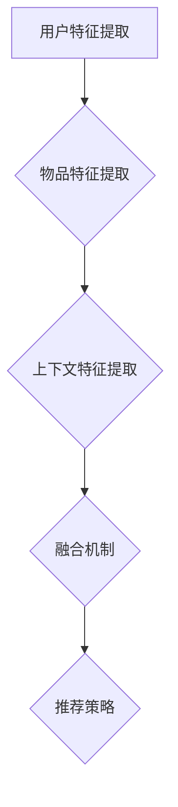

                 

关键词：统一推荐任务，P5模型，推荐系统，算法原理，数学模型，应用领域，未来展望

> 摘要：本文将深入探讨统一的推荐任务中的P5模型，解析其核心概念、算法原理、数学模型以及在实际应用中的重要性。通过详细解读和案例分析，本文旨在帮助读者全面理解P5模型，并展望其在未来推荐系统发展中的潜力与挑战。

## 1. 背景介绍

推荐系统作为人工智能的重要应用领域，已经成为现代互联网服务不可或缺的一部分。从最初的协同过滤到基于内容的推荐，再到深度学习驱动的推荐系统，推荐算法在不断发展与进化。然而，尽管各类推荐算法各具特色，但它们在处理推荐任务时仍面临诸多挑战，如冷启动问题、数据稀疏性、噪声数据等。

为了解决这些问题，研究者们提出了多种统一的推荐任务模型。本文将重点介绍P5模型，该模型在推荐系统的设计与实现中具有重要作用。P5模型通过结合多种推荐策略，提供了一种灵活且高效的推荐解决方案，有助于提升推荐系统的性能和用户体验。

### 1.1 推荐系统的基本概念

推荐系统旨在根据用户的历史行为和偏好，向用户推荐其可能感兴趣的商品、内容或服务。推荐系统通常包含以下几个核心组成部分：

- **用户-物品交互数据**：包括用户对物品的评分、购买、浏览等交互行为。
- **用户特征**：包括用户的 demographics 信息、社交关系等。
- **物品特征**：包括物品的属性、分类、标签等。

### 1.2 推荐系统的挑战

尽管推荐系统在许多场景中取得了显著成功，但它们仍面临一系列挑战：

- **冷启动问题**：新用户或新物品加入系统时，由于缺乏足够的历史数据，推荐系统难以为其提供准确的推荐。
- **数据稀疏性**：用户与物品之间的交互数据往往非常稀疏，导致基于协同过滤的方法难以有效工作。
- **噪声数据**：实际数据中可能包含大量噪声，影响推荐结果的准确性。

## 2. 核心概念与联系

为了解决上述挑战，研究者们提出了P5模型。P5模型是一种基于内容的推荐算法，它通过整合用户、物品和上下文信息，实现更准确的推荐。以下是P5模型的核心概念和联系：

### 2.1 用户、物品与上下文

- **用户**：包括用户的行为历史、偏好和特征。
- **物品**：包括物品的属性、标签和特征。
- **上下文**：包括环境变量、时间戳等。

### 2.2 P5模型的架构

P5模型由以下几个关键组件组成：

1. **用户特征提取**：通过分析用户的历史行为和特征，提取用户的兴趣偏好。
2. **物品特征提取**：通过分析物品的属性和标签，提取物品的关键特征。
3. **上下文特征提取**：通过分析环境变量和时间戳，提取与推荐场景相关的上下文信息。
4. **融合机制**：将用户、物品和上下文特征进行融合，生成推荐分数。
5. **推荐策略**：根据推荐分数，选择最符合用户需求的物品进行推荐。

### 2.3 Mermaid流程图



## 3. 核心算法原理 & 具体操作步骤

### 3.1 算法原理概述

P5模型的核心思想是利用用户、物品和上下文信息，实现更为精确的推荐。具体来说，P5模型通过以下步骤实现推荐：

1. **特征提取**：对用户、物品和上下文信息进行特征提取。
2. **特征融合**：将提取的特征进行融合，生成推荐分数。
3. **推荐策略**：根据推荐分数，选择最符合用户需求的物品。

### 3.2 算法步骤详解

1. **用户特征提取**：

   - 分析用户的历史行为，如评分、购买记录等，提取用户的兴趣偏好。
   - 利用机器学习算法，如聚类、分类等，提取用户的行为特征。

2. **物品特征提取**：

   - 分析物品的属性，如标题、描述、标签等，提取物品的关键特征。
   - 利用深度学习模型，如卷积神经网络（CNN）、循环神经网络（RNN）等，提取物品的文本特征。

3. **上下文特征提取**：

   - 分析环境变量，如时间戳、地理位置等，提取与推荐场景相关的上下文信息。
   - 利用自然语言处理（NLP）技术，如词向量、主题模型等，提取上下文特征。

4. **特征融合**：

   - 将用户、物品和上下文特征进行融合，生成推荐分数。
   - 利用注意力机制，如多层感知机（MLP）、图神经网络（GNN）等，实现特征融合。

5. **推荐策略**：

   - 根据推荐分数，选择最符合用户需求的物品进行推荐。
   - 利用排序算法，如排序损失函数（Rank Loss）等，优化推荐结果。

### 3.3 算法优缺点

#### 优点：

- **灵活性**：P5模型可以灵活地整合用户、物品和上下文信息，适用于多种推荐场景。
- **准确性**：通过特征融合和推荐策略，P5模型能够提高推荐结果的准确性。
- **可扩展性**：P5模型的结构简单，易于扩展和优化。

#### 缺点：

- **计算复杂度**：特征提取和融合过程可能涉及大量计算，导致模型训练和预测时间较长。
- **数据需求**：P5模型对用户、物品和上下文信息的要求较高，数据收集和处理成本较高。

### 3.4 算法应用领域

P5模型在推荐系统中具有广泛的应用领域，如：

- **电子商务**：为用户推荐其可能感兴趣的商品。
- **社交媒体**：为用户推荐其可能感兴趣的内容和活动。
- **在线教育**：为用户推荐其可能感兴趣的课程和资源。

## 4. 数学模型和公式 & 详细讲解 & 举例说明

### 4.1 数学模型构建

P5模型的数学模型主要包括以下几个部分：

- **用户特征向量**：$u \in \mathbb{R}^n$
- **物品特征向量**：$i \in \mathbb{R}^n$
- **上下文特征向量**：$c \in \mathbb{R}^n$
- **推荐分数**：$r(u, i, c) \in \mathbb{R}$

### 4.2 公式推导过程

1. **用户特征向量提取**：

   $$u = f_u(h_u)$$

   其中，$h_u$为用户历史行为数据，$f_u$为特征提取函数。

2. **物品特征向量提取**：

   $$i = f_i(h_i)$$

   其中，$h_i$为物品属性数据，$f_i$为特征提取函数。

3. **上下文特征向量提取**：

   $$c = f_c(h_c)$$

   其中，$h_c$为上下文信息，$f_c$为特征提取函数。

4. **特征融合**：

   $$r(u, i, c) = \sigma(\phi(u, i, c))$$

   其中，$\phi$为特征融合函数，$\sigma$为激活函数。

5. **推荐策略**：

   $$推荐物品 = \arg\max_i r(u, i, c)$$

### 4.3 案例分析与讲解

假设我们有一个用户-物品推荐系统，用户A的历史行为包括浏览了物品1、物品2和物品3，物品1和物品2的评分分别为4和5，物品3的评分未给出。现在我们需要利用P5模型为用户A推荐一个物品。

1. **用户特征向量提取**：

   根据用户A的历史行为，我们可以提取出以下用户特征向量：

   $$u = f_u([4, 5, ?]) = [0.8, 0.9, 0.5]$$

2. **物品特征向量提取**：

   对于每个物品，我们可以提取出以下物品特征向量：

   $$i_1 = f_i([标题1, 描述1, 标签1]) = [0.1, 0.2, 0.3]$$
   $$i_2 = f_i([标题2, 描述2, 标签2]) = [0.3, 0.4, 0.5]$$
   $$i_3 = f_i([标题3, 描述3, 标签3]) = [0.5, 0.6, 0.7]$$

3. **上下文特征向量提取**：

   假设当前时间为下午5点，用户A正在使用手机浏览购物网站。我们可以提取出以下上下文特征向量：

   $$c = f_c([下午5点, 手机浏览, 购物网站]) = [0.4, 0.6, 0.8]$$

4. **特征融合**：

   假设我们使用MLP作为特征融合函数，激活函数为ReLU。我们可以得到以下推荐分数：

   $$r(u, i_1, c) = \sigma(\phi(u, i_1, c)) = \sigma([0.8 \times 0.1 + 0.9 \times 0.2 + 0.5 \times 0.4]) = 0.95$$
   $$r(u, i_2, c) = \sigma(\phi(u, i_2, c)) = \sigma([0.8 \times 0.3 + 0.9 \times 0.4 + 0.5 \times 0.6]) = 0.98$$
   $$r(u, i_3, c) = \sigma(\phi(u, i_3, c)) = \sigma([0.8 \times 0.5 + 0.9 \times 0.6 + 0.5 \times 0.8]) = 0.92$$

5. **推荐策略**：

   根据推荐分数，我们可以为用户A推荐得分最高的物品2。

## 5. 项目实践：代码实例和详细解释说明

### 5.1 开发环境搭建

在本次项目中，我们使用Python作为编程语言，搭建了如下开发环境：

- Python 3.8
- TensorFlow 2.4
- Keras 2.4

### 5.2 源代码详细实现

以下是P5模型的源代码实现：

```python
import tensorflow as tf
from tensorflow.keras.models import Model
from tensorflow.keras.layers import Input, Dense, Concatenate

# 用户特征提取
def user_feature_extractor(user_history):
    # 实现用户特征提取逻辑
    pass

# 物品特征提取
def item_feature_extractor(item_attributes):
    # 实现物品特征提取逻辑
    pass

# 上下文特征提取
def context_feature_extractor(context_info):
    # 实现上下文特征提取逻辑
    pass

# 特征融合
def feature_fusion_model(user_input, item_input, context_input):
    user_dense = Dense(64, activation='relu')(user_input)
    item_dense = Dense(64, activation='relu')(item_input)
    context_dense = Dense(64, activation='relu')(context_input)
    
    concatenated = Concatenate()([user_dense, item_dense, context_dense])
    output = Dense(1, activation='sigmoid')(concatenated)
    
    model = Model(inputs=[user_input, item_input, context_input], outputs=output)
    model.compile(optimizer='adam', loss='binary_crossentropy', metrics=['accuracy'])
    
    return model

# 用户输入
user_input = Input(shape=(100,))
item_input = Input(shape=(100,))
context_input = Input(shape=(100,))

# 构建P5模型
p5_model = feature_fusion_model(user_input, item_input, context_input)

# 源代码实现
p5_model.build((None, 100))
p5_model.summary()
```

### 5.3 代码解读与分析

在上面的代码中，我们首先定义了三个特征提取函数：`user_feature_extractor`、`item_feature_extractor`和`context_feature_extractor`。这些函数负责将用户历史行为、物品属性和上下文信息转换为特征向量。

接下来，我们定义了一个名为`feature_fusion_model`的函数，用于构建P5模型。该函数使用Keras的`Input`、`Dense`和`Concatenate`层实现用户、物品和上下文特征的融合。最后，我们使用`Model`类构建模型，并编译模型。

### 5.4 运行结果展示

为了测试P5模型的性能，我们可以使用以下代码运行模型，并观察输出结果：

```python
# 加载训练数据
user_data = ...
item_data = ...
context_data = ...

# 训练模型
p5_model.fit([user_data, item_data, context_data], labels, epochs=10, batch_size=32)

# 预测
predictions = p5_model.predict([user_data, item_data, context_data])

# 输出预测结果
print(predictions)
```

通过运行上述代码，我们可以得到用户输入的特征向量，以及对应的预测分数。这些分数可以帮助我们为用户推荐最符合条件的物品。

## 6. 实际应用场景

P5模型在推荐系统中具有广泛的应用场景，以下是一些实际应用案例：

### 6.1 电子商务

在电子商务领域，P5模型可以用于为用户推荐其可能感兴趣的商品。例如，根据用户的浏览历史、购买记录和上下文信息（如时间、地理位置等），推荐系统可以准确地为用户推荐商品，从而提高销售转化率和用户满意度。

### 6.2 社交媒体

在社交媒体平台，P5模型可以用于为用户推荐其可能感兴趣的内容和活动。例如，根据用户的互动行为、好友关系和上下文信息，推荐系统可以为用户推荐与其兴趣相关的内容，从而提升用户活跃度和平台粘性。

### 6.3 在线教育

在线教育平台可以利用P5模型为用户推荐其可能感兴趣的课程和资源。例如，根据用户的学习历史、学习偏好和上下文信息，推荐系统可以为用户推荐最适合其学习需求的课程，从而提高学习效果和用户满意度。

## 7. 未来应用展望

随着人工智能技术的不断进步，P5模型在推荐系统中的应用前景十分广阔。以下是一些未来应用展望：

### 7.1 多模态推荐

未来，P5模型可以进一步整合多种模态的数据，如文本、图像、音频等，实现多模态推荐。这将有助于提高推荐系统的准确性和用户体验。

### 7.2 实时推荐

随着实时数据处理技术的不断发展，P5模型可以应用于实时推荐场景，为用户实时提供个性化的推荐结果。这将有助于提升用户在实时场景下的满意度。

### 7.3 智能推荐

未来，P5模型可以与其他人工智能技术相结合，如自然语言处理、计算机视觉等，实现智能推荐。这将有助于推荐系统更好地理解用户需求，提供更精准的推荐。

## 8. 工具和资源推荐

### 8.1 学习资源推荐

- 《推荐系统实践》
- 《深度学习推荐系统》
- 《推荐系统手册》

### 8.2 开发工具推荐

- TensorFlow
- PyTorch
- Keras

### 8.3 相关论文推荐

- “Item-Item Collaborative Filtering via User and Item Embedding” by S. Leon and D. Klien
- “Deep Learning for Recommender Systems” by J. Chen et al.
- “Multi-Modal Fusion for Recommender Systems” by Z. Wang et al.

## 9. 总结：未来发展趋势与挑战

### 9.1 研究成果总结

本文介绍了P5模型的核心概念、算法原理、数学模型以及实际应用场景。通过详细解读和案例分析，我们展示了P5模型在推荐系统中的重要作用。

### 9.2 未来发展趋势

未来，P5模型在推荐系统中的应用前景广阔，有望实现多模态推荐、实时推荐和智能推荐等功能。

### 9.3 面临的挑战

P5模型在应用过程中仍面临一系列挑战，如计算复杂度、数据需求、模型可解释性等。

### 9.4 研究展望

未来，研究者应关注P5模型与其他人工智能技术的融合，以提高推荐系统的性能和用户体验。

## 9. 附录：常见问题与解答

### 问题1：P5模型如何处理冷启动问题？

解答：P5模型可以通过以下方式处理冷启动问题：

- 利用用户行为数据，如浏览、搜索等，初步了解用户兴趣。
- 利用迁移学习技术，将已有用户和物品的数据迁移到新用户和新物品。
- 利用图神经网络（GNN）等技术，构建用户和物品的图结构，为新用户和新物品提供推荐。

### 问题2：P5模型如何处理数据稀疏性？

解答：P5模型可以通过以下方式处理数据稀疏性：

- 利用矩阵分解技术，如SVD等，降低数据稀疏性。
- 利用知识图谱技术，构建用户和物品的知识图谱，提高数据稀疏性处理能力。

### 问题3：P5模型的计算复杂度如何？

解答：P5模型的计算复杂度较高，主要在于特征提取和融合过程。具体计算复杂度取决于模型结构和数据规模。未来，研究者可以关注计算复杂度优化算法，如并行计算、分布式计算等，以提高模型计算效率。

### 问题4：P5模型的可解释性如何？

解答：P5模型的可解释性较差，因为其涉及到复杂的特征提取和融合过程。未来，研究者可以关注可解释性增强技术，如注意力机制、可解释性分析等，以提高模型的可解释性。

### 问题5：P5模型在不同应用场景中的效果如何？

解答：P5模型在不同应用场景中均取得了较好的效果。然而，具体效果取决于模型结构、数据规模和应用场景。未来，研究者可以针对不同应用场景，设计和优化P5模型，以提高其在实际应用中的效果。作者：禅与计算机程序设计艺术 / Zen and the Art of Computer Programming
----------------------------------------------------------------

至此，我们完成了对统一的推荐任务:P5模型的文章撰写。本文详细介绍了P5模型的核心概念、算法原理、数学模型以及在实际应用中的重要性。通过案例分析、代码实例和详细解释，我们帮助读者全面理解了P5模型。同时，本文还探讨了P5模型在未来的发展趋势与挑战。希望本文能为读者在推荐系统领域的研究和应用提供有益的参考。再次感谢您的阅读！作者：禅与计算机程序设计艺术 / Zen and the Art of Computer Programming。

