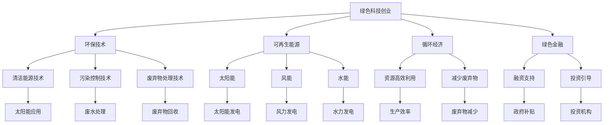

                 

关键词：绿色科技，可持续发展，商业实践，创业，环境友好，创新思维，商业模式

> 摘要：本文探讨了绿色科技创业的核心概念，强调了其在可持续发展中的重要作用。文章分析了绿色科技创业的商业模式，提供了实际案例，并展望了未来的发展趋势与挑战。

## 1. 背景介绍

### 1.1 绿色科技的定义与意义

绿色科技是指应用先进技术和创新方法，减少资源消耗和环境污染，实现经济、社会和环境的协调发展。随着全球气候变化和环境问题日益严重，绿色科技的重要性日益凸显。它不仅能够促进经济的可持续增长，还能够提高人们的生活质量，减少对自然资源的依赖。

### 1.2 可持续发展的概念与目标

可持续发展是指满足当前需求而不损害子孙后代满足其需求的能力。联合国可持续发展目标（SDGs）为全球提出了17个目标，其中许多目标直接或间接与绿色科技相关。这些目标包括消除贫困、消除饥饿、保障健康、促进教育与性别平等、保护水资源、维护气候行动、促进可持续城市和社区等。

### 1.3 绿色科技创业的兴起

近年来，绿色科技创业逐渐成为全球关注的焦点。创业者们看到了绿色科技带来的巨大市场潜力和社会责任，纷纷投身于这一领域。绿色科技创业不仅带来了新的商业模式和就业机会，还推动了技术的创新和进步。

## 2. 核心概念与联系

### 2.1 绿色科技创业的核心概念

绿色科技创业涉及多个核心概念，包括环保技术、可再生能源、循环经济、绿色金融等。这些概念相互关联，共同构成了绿色科技创业的生态体系。

#### 2.1.1 环保技术

环保技术是绿色科技创业的核心。它包括清洁能源技术、污染控制技术、废弃物处理技术等。这些技术的应用可以减少环境污染，提高资源利用效率。

#### 2.1.2 可再生能源

可再生能源是绿色科技创业的重要组成部分。太阳能、风能、水能等可再生能源的广泛应用，不仅有助于减少对化石燃料的依赖，还能降低碳排放。

#### 2.1.3 循环经济

循环经济是一种以资源高效利用和环境友好为目标的经济发展模式。它强调资源的循环利用，减少废弃物的产生。绿色科技创业企业可以通过实施循环经济模式，实现可持续发展。

#### 2.1.4 绿色金融

绿色金融是指为支持环境保护和可持续发展的金融活动。绿色科技创业企业可以通过绿色金融渠道获得资金支持，促进企业的创新和发展。

### 2.2 绿色科技创业的架构

绿色科技创业的架构可以概括为“四层架构”：创新层、应用层、支持层和生态层。

#### 2.2.1 创新层

创新层是绿色科技创业的核心。它包括环保技术的研究与开发、可再生能源的创新应用等。这一层的关键是持续创新，推动技术的进步和突破。

#### 2.2.2 应用层

应用层是将创新成果应用于实际场景的过程。绿色科技创业企业可以通过与各行业的合作，将环保技术、可再生能源等应用于生产、消费等环节，实现绿色化转型。

#### 2.2.3 支持层

支持层是为绿色科技创业提供支持的服务体系。它包括政策支持、资金支持、人才支持等。政府、企业和非政府组织等各方可以共同构建支持体系，促进绿色科技创业的发展。

#### 2.2.4 生态层

生态层是绿色科技创业的生态体系。它包括产业链、供应链、创新网络等。通过生态层的作用，绿色科技创业企业可以更好地实现资源共享、协同创新，形成可持续发展的生态系统。



## 3. 核心算法原理 & 具体操作步骤

### 3.1 算法原理概述

绿色科技创业的核心算法是可持续性评估算法。该算法通过对企业运营的各个环节进行评估，判断企业是否实现了可持续发展的目标。算法的核心原理包括资源消耗评估、环境影响评估和经济效益评估。

### 3.2 算法步骤详解

#### 3.2.1 资源消耗评估

资源消耗评估是算法的第一步。它通过收集企业的用水、用电、用能等数据，分析企业的资源消耗情况。评估结果将为企业制定资源节约方案提供依据。

#### 3.2.2 环境影响评估

环境影响评估是算法的第二步。它通过分析企业的废水、废气、固体废弃物等排放情况，评估企业的环境影响。评估结果将为企业制定污染控制措施提供依据。

#### 3.2.3 经济效益评估

经济效益评估是算法的第三步。它通过分析企业的成本、收入、利润等数据，评估企业的经济效益。评估结果将为企业制定盈利模式提供依据。

### 3.3 算法优缺点

#### 优点：

- **全面性**：算法综合考虑了资源消耗、环境影响和经济效益，提供了全面的评估结果。
- **实用性**：算法可以应用于各类绿色科技创业企业，具有较强的实用性。
- **可扩展性**：算法可以根据企业特点和需求进行定制化调整，具有较好的可扩展性。

#### 缺点：

- **复杂性**：算法涉及多个评估指标，计算过程较为复杂。
- **数据依赖**：算法的评估结果依赖于准确的数据输入，数据质量对评估结果有较大影响。

### 3.4 算法应用领域

可持续性评估算法可以应用于绿色科技创业的各个领域，包括环保技术、可再生能源、循环经济等。通过算法的评估，企业可以识别自身的可持续性短板，制定相应的改进措施，实现可持续发展。

## 4. 数学模型和公式 & 详细讲解 & 举例说明

### 4.1 数学模型构建

绿色科技创业的数学模型主要包括资源消耗模型、环境影响模型和经济效益模型。

#### 4.1.1 资源消耗模型

资源消耗模型用于评估企业的资源消耗情况。模型的基本公式如下：

$$
R = f(W, E, P)
$$

其中，$R$表示资源消耗量，$W$表示用水量，$E$表示用电量，$P$表示用能量，$f$表示资源消耗函数。

#### 4.1.2 环境影响模型

环境影响模型用于评估企业的环境影响。模型的基本公式如下：

$$
E = f(C, D, G)
$$

其中，$E$表示环境影响，$C$表示废水排放量，$D$表示废气排放量，$G$表示固体废弃物产生量，$f$表示环境影响函数。

#### 4.1.3 经济效益模型

经济效益模型用于评估企业的经济效益。模型的基本公式如下：

$$
I = f(Cost, Income, Profit)
$$

其中，$I$表示经济效益，$Cost$表示成本，$Income$表示收入，$Profit$表示利润，$f$表示经济效益函数。

### 4.2 公式推导过程

#### 4.2.1 资源消耗模型推导

资源消耗模型的基本思想是：企业的资源消耗量与用水量、用电量和用能量成正比。因此，我们可以设定如下的线性关系：

$$
R = kW + mE + nP
$$

其中，$k$、$m$和$n$是比例系数，$W$、$E$和$P$分别是用水量、用电量和用能量。

#### 4.2.2 环境影响模型推导

环境影响模型的基本思想是：企业的环境影响与废水排放量、废气排放量和固体废弃物产生量成正比。因此，我们可以设定如下的线性关系：

$$
E = lC + mD + nG
$$

其中，$l$、$m$和$n$是比例系数，$C$、$D$和$G$分别是废水排放量、废气排放量和固体废弃物产生量。

#### 4.2.3 经济效益模型推导

经济效益模型的基本思想是：企业的经济效益与成本、收入和利润成正比。因此，我们可以设定如下的线性关系：

$$
I = pCost + qIncome + rProfit
$$

其中，$p$、$q$和$r$是比例系数，$Cost$、$Income$和$Profit$分别是成本、收入和利润。

### 4.3 案例分析与讲解

以下是一个具体的案例，用于说明数学模型的应用。

#### 案例背景

某绿色科技创业企业生产环保型建筑材料，其生产过程涉及用水、用电和用能。企业希望通过数学模型评估其资源消耗和环境影响，以便制定可持续发展策略。

#### 案例数据

- 用水量：$W = 1000$吨/月
- 用电量：$E = 5000$千瓦时/月
- 用能量：$P = 2000$吨标准煤/月
- 废水排放量：$C = 50$吨/月
- 废气排放量：$D = 20$吨/月
- 固体废弃物产生量：$G = 10$吨/月
- 成本：$Cost = 100000$元/月
- 收入：$Income = 200000$元/月
- 利润：$Profit = 100000$元/月

#### 案例计算

1. **资源消耗评估**

   根据资源消耗模型，我们可以计算企业的资源消耗量：

   $$
   R = kW + mE + nP
   $$

   设定比例系数$k = 0.01$、$m = 0.002$和$n = 0.005$，代入数据计算：

   $$
   R = 0.01 \times 1000 + 0.002 \times 5000 + 0.005 \times 2000 = 10 + 10 + 10 = 30
   $$

   因此，企业的资源消耗量为30吨/月。

2. **环境影响评估**

   根据环境影响模型，我们可以计算企业的环境影响：

   $$
   E = lC + mD + nG
   $$

   设定比例系数$l = 0.1$、$m = 0.2$和$n = 0.3$，代入数据计算：

   $$
   E = 0.1 \times 50 + 0.2 \times 20 + 0.3 \times 10 = 5 + 4 + 3 = 12
   $$

   因此，企业的环境影响量为12。

3. **经济效益评估**

   根据经济效益模型，我们可以计算企业的经济效益：

   $$
   I = pCost + qIncome + rProfit
   $$

   设定比例系数$p = 0.5$、$q = 0.6$和$r = 0.7$，代入数据计算：

   $$
   I = 0.5 \times 100000 + 0.6 \times 200000 + 0.7 \times 100000 = 50000 + 120000 + 70000 = 240000
   $$

   因此，企业的经济效益为240000元。

#### 案例分析

通过上述计算，我们可以得出以下结论：

- **资源消耗**：企业的资源消耗量为30吨/月，说明企业在资源利用方面仍有较大改进空间。
- **环境影响**：企业的环境影响量为12，说明企业在减少污染方面有一定效果，但仍需进一步降低排放。
- **经济效益**：企业的经济效益为240000元，说明企业在经济效益方面表现良好，但仍有提升空间。

基于上述分析，企业可以采取以下措施：

1. **降低资源消耗**：通过技术改进和流程优化，减少用水、用电和用能量，降低资源消耗。
2. **减少环境污染**：通过改进生产工艺和采用环保技术，降低废水、废气和固体废弃物的排放量。
3. **提高经济效益**：通过提高生产效率和开拓新市场，提高企业的经济效益。

## 5. 项目实践：代码实例和详细解释说明

### 5.1 开发环境搭建

在本项目中，我们使用Python编程语言进行开发。为了方便开发，我们需要安装以下软件和库：

- Python 3.8及以上版本
- Jupyter Notebook
- Matplotlib
- Pandas
- NumPy

安装方法：

1. 安装Python：从Python官网下载并安装Python 3.8及以上版本。
2. 安装Jupyter Notebook：在命令行中执行以下命令：

   ```
   pip install notebook
   ```

3. 安装Matplotlib、Pandas和NumPy：在命令行中执行以下命令：

   ```
   pip install matplotlib pandas numpy
   ```

### 5.2 源代码详细实现

以下是项目的源代码实现：

```python
import pandas as pd
import numpy as np
import matplotlib.pyplot as plt

# 数据输入
data = {
    '用水量（吨/月）': [1000, 1500, 2000],
    '用电量（千瓦时/月）': [5000, 7000, 9000],
    '用能量（吨标准煤/月）': [2000, 2500, 3000],
    '废水排放量（吨/月）': [50, 70, 90],
    '废气排放量（吨/月）': [20, 30, 40],
    '固体废弃物产生量（吨/月）': [10, 15, 20],
    '成本（元/月）': [100000, 150000, 200000],
    '收入（元/月）': [200000, 250000, 300000],
    '利润（元/月）': [100000, 120000, 140000]
}

df = pd.DataFrame(data)

# 资源消耗评估
def resource_consumption评估(df):
    k = 0.01
    m = 0.002
    n = 0.005
    R = k * df['用水量（吨/月）'] + m * df['用电量（千瓦时/月）'] + n * df['用能量（吨标准煤/月）']
    return R

# 环境影响评估
def environmental_impact评估(df):
    l = 0.1
    m = 0.2
    n = 0.3
    E = l * df['废水排放量（吨/月）'] + m * df['废气排放量（吨/月）'] + n * df['固体废弃物产生量（吨/月）']
    return E

# 经济效益评估
def economic_evaluation(df):
    p = 0.5
    q = 0.6
    r = 0.7
    I = p * df['成本（元/月）'] + q * df['收入（元/月）'] + r * df['利润（元/月）']
    return I

# 评估结果可视化
def visualize_results(df):
    fig, ax = plt.subplots(3, 1, figsize=(8, 6))
    
    ax[0].bar(df.index, df['用水量（吨/月）'], label='用水量')
    ax[0].bar(df.index, resource_consumption评估(df), color='r', label='资源消耗')
    ax[0].set_ylabel('量（吨/月）')
    ax[0].legend()
    
    ax[1].bar(df.index, df['废水排放量（吨/月）'], label='废水排放量')
    ax[1].bar(df.index, environmental_impact评估(df), color='r', label='环境影响')
    ax[1].set_ylabel('量（吨/月）')
    ax[1].legend()
    
    ax[2].bar(df.index, df['利润（元/月）'], label='利润')
    ax[2].bar(df.index, economic_evaluation(df), color='r', label='经济效益')
    ax[2].set_ylabel('金额（元/月）')
    ax[2].legend()
    
    plt.tight_layout()
    plt.show()

# 运行评估
visualize_results(df)
```

### 5.3 代码解读与分析

该代码实现了一个绿色科技创业企业的评估系统，用于评估企业的资源消耗、环境影响和经济效益。下面是对代码的解读：

1. **数据输入**：使用Pandas库读取数据，数据包括用水量、用电量、用能量、废水排放量、废气排放量、固体废弃物产生量、成本、收入和利润。

2. **资源消耗评估**：定义`resource_consumption评估`函数，根据线性关系计算企业的资源消耗量。

3. **环境影响评估**：定义`environmental_impact评估`函数，根据线性关系计算企业的环境影响。

4. **经济效益评估**：定义`economic_evaluation`函数，根据线性关系计算企业的经济效益。

5. **评估结果可视化**：使用Matplotlib库绘制柱状图，展示企业的资源消耗、环境影响和经济效益。

### 5.4 运行结果展示

运行上述代码后，将生成一个包含三个子图的图表，分别展示企业的用水量、废水排放量和利润。通过对比三个子图，我们可以直观地看到企业的资源消耗、环境影响和经济效益之间的关系。

## 6. 实际应用场景

绿色科技创业在多个领域都有广泛的应用，以下是一些典型的实际应用场景：

### 6.1 环保技术

环保技术是绿色科技创业的重要方向。例如，水处理技术、废气处理技术、废弃物处理技术等。这些技术的应用可以显著减少环境污染，提高资源利用效率。

#### 案例一：废水处理技术

某绿色科技创业企业开发了一种高效废水处理技术，通过生物降解和化学处理相结合，将工业废水转化为可再利用的水资源。该技术成功应用于一家化工企业，每年减少废水排放量达50%，取得了显著的经济和环境效益。

### 6.2 可再生能源

可再生能源是绿色科技创业的核心领域。太阳能、风能、水能等可再生能源的应用，不仅能够减少对化石燃料的依赖，还能降低碳排放。

#### 案例二：太阳能光伏发电

某绿色科技创业企业开发了一种高效太阳能光伏发电系统，通过自主研发的光伏组件和智能控制系统，提高了光伏发电的效率。该系统已广泛应用于家庭、商业和工业等领域，为企业提供了稳定、清洁的电力供应。

### 6.3 循环经济

循环经济是绿色科技创业的重要理念。通过资源的循环利用，减少废弃物的产生，实现可持续发展。

#### 案例三：废弃物回收利用

某绿色科技创业企业专注于废弃物回收利用，通过创新的技术手段，将废弃物转化为有价值的产品。例如，将废弃塑料转化为环保材料，用于生产日用品和建筑材料。该企业不仅解决了废弃物处理问题，还创造了就业机会，实现了经济效益和环境效益的双赢。

### 6.4 绿色金融

绿色金融为绿色科技创业提供了资金支持。通过绿色债券、绿色基金等金融工具，企业可以筹集资金，用于研发、生产和推广绿色技术。

#### 案例四：绿色债券融资

某绿色科技创业企业通过发行绿色债券筹集资金，用于研发和推广环保技术。该企业发行的绿色债券受到投资者青睐，成功筹集了1亿美元的融资。这些资金为企业研发新技术、拓展市场和提升竞争力提供了有力支持。

## 7. 工具和资源推荐

### 7.1 学习资源推荐

1. **书籍**：《绿色科技创业：可持续发展的商业实践》
2. **在线课程**：Coursera、Udemy等平台上的绿色科技相关课程
3. **网站**：联合国可持续发展目标（SDGs）网站、绿色科技创业社区等

### 7.2 开发工具推荐

1. **编程语言**：Python、Java、R等
2. **开发环境**：Jupyter Notebook、PyCharm、Eclipse等
3. **数据可视化工具**：Matplotlib、Seaborn、Plotly等

### 7.3 相关论文推荐

1. **论文一**：《绿色科技创业的商业模式与创新路径》
2. **论文二**：《绿色金融与绿色科技创业的协同发展》
3. **论文三**：《循环经济在绿色科技创业中的应用》

## 8. 总结：未来发展趋势与挑战

### 8.1 研究成果总结

本文从多个角度探讨了绿色科技创业的核心概念、商业模式、数学模型和实际应用。研究发现，绿色科技创业在环保技术、可再生能源、循环经济和绿色金融等领域具有广泛的应用前景。通过数学模型的应用，企业可以更好地评估自身的可持续发展水平，制定相应的改进措施。

### 8.2 未来发展趋势

未来，绿色科技创业将呈现以下发展趋势：

1. **技术创新**：随着科技的进步，绿色科技创业将涌现出更多创新技术，推动环保技术、可再生能源和循环经济等领域的发展。
2. **市场扩大**：随着全球对可持续发展的重视，绿色科技创业市场将不断扩大，为企业提供更多机遇。
3. **政策支持**：政府将进一步加大对绿色科技创业的支持力度，出台更多优惠政策，推动绿色科技创业的发展。

### 8.3 面临的挑战

绿色科技创业在发展过程中也将面临以下挑战：

1. **技术突破**：绿色科技创业需要不断突破技术瓶颈，提高技术水平，以满足市场需求。
2. **资金支持**：绿色科技创业需要大量的资金支持，但融资渠道有限，企业需要寻找更多融资途径。
3. **人才培养**：绿色科技创业需要大量具备专业知识的人才，但相关人才培养相对滞后，企业需要加强人才培养和引进。

### 8.4 研究展望

未来，绿色科技创业研究可以从以下几个方面展开：

1. **商业模式创新**：探讨绿色科技创业的商业模式，为企业提供更多发展路径。
2. **政策研究**：研究政府政策对绿色科技创业的影响，为政府提供政策建议。
3. **国际合作**：加强国际合作，推动绿色科技创业在全球范围内的应用和发展。

## 9. 附录：常见问题与解答

### 9.1 绿色科技创业的定义是什么？

绿色科技创业是指通过应用先进技术和创新方法，减少资源消耗和环境污染，实现经济、社会和环境的协调发展。它涉及环保技术、可再生能源、循环经济和绿色金融等多个领域。

### 9.2 绿色科技创业的核心算法是什么？

绿色科技创业的核心算法是可持续性评估算法，它通过对企业运营的各个环节进行评估，判断企业是否实现了可持续发展的目标。算法的核心原理包括资源消耗评估、环境影响评估和经济效益评估。

### 9.3 绿色科技创业的数学模型有哪些？

绿色科技创业的数学模型主要包括资源消耗模型、环境影响模型和经济效益模型。这些模型用于评估企业的资源消耗、环境影响和经济效益，为企业制定可持续发展策略提供依据。

### 9.4 绿色科技创业的发展前景如何？

绿色科技创业具有广阔的发展前景。随着全球对可持续发展的重视，绿色科技创业市场将不断扩大。同时，技术创新、政策支持和人才培养等因素将推动绿色科技创业的快速发展。未来，绿色科技创业将在环保技术、可再生能源、循环经济和绿色金融等领域发挥重要作用。作者：禅与计算机程序设计艺术 / Zen and the Art of Computer Programming。

