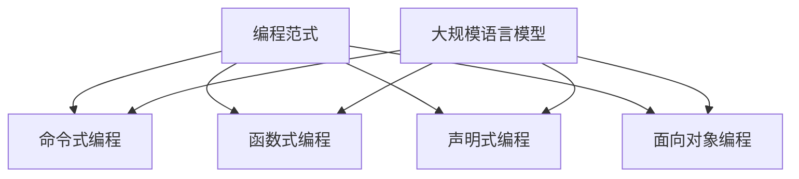

                 

关键词：编程范式，LLM，人工智能，计算机编程，编程思维，软件开发，代码优化，算法优化。

## 摘要

本文旨在探讨编程范式的转变，特别是在大规模语言模型（LLM）兴起的时代背景下。随着人工智能技术的飞速发展，编程范式正经历着深刻的变化。本文将详细分析LLM技术如何影响编程思维，并提出一些新的编程理念和方法，以帮助开发者在新的时代背景下实现更加高效和智能的软件开发。

## 1. 背景介绍

### 1.1 编程范式的历史演变

编程范式是指编程语言和方法论的基本思维方式。从早期的机器语言、汇编语言到高级编程语言，如C、Java和Python，编程范式经历了多次重大变革。每一次变革都标志着计算机科学和软件工程的发展进入了一个新阶段。

- **机器语言和汇编语言**：这是编程范式的最初阶段。程序员需要直接与计算机的硬件打交道，通过编写复杂的指令来控制计算机的运行。这种范式效率低下，且易于出错。

- **高级编程语言**：随着计算机科学的发展，高级编程语言如C和Java的出现极大地提高了编程的效率。高级编程语言提供了更抽象的语法和丰富的库，使程序员能够专注于解决问题的逻辑，而无需关注底层硬件的细节。

- **函数式编程**：在20世纪90年代，函数式编程范式开始受到关注。它强调不可变数据和函数作为一等公民，使得代码更加简洁和易于理解。

- **面向对象编程**：面向对象编程范式在20世纪90年代中期成为主流。它通过将程序结构分解为对象，使得代码的复用性和可维护性得到了显著提升。

### 1.2 人工智能的兴起

近年来，人工智能（AI）技术的迅猛发展，特别是深度学习和大规模语言模型（LLM）的出现，对编程范式产生了深远影响。LLM如GPT-3和ChatGPT等，具有处理和理解自然语言的能力，使得编程变得更加智能化和自动化。

## 2. 核心概念与联系

### 2.1. 编程范式

编程范式是编程语言和方法论的基本思维方式。不同的编程范式适用于不同的编程场景，例如：

- **命令式编程**：通过一系列命令来描述程序的执行过程。
- **函数式编程**：通过函数来描述程序的行为，避免了状态的改变。
- **声明式编程**：描述了程序期望的结果，而不是具体的执行步骤。
- **面向对象编程**：将程序结构分解为对象，每个对象都有自己的属性和方法。

### 2.2. 大规模语言模型（LLM）

大规模语言模型（LLM）是一类利用深度学习技术训练的模型，能够理解和生成自然语言。LLM的核心思想是通过大量的文本数据进行训练，从而学习到语言的统计规律和语义理解。

### 2.3. 编程范式与LLM的联系

LLM的兴起使得编程范式发生了以下变化：

- **代码生成**：LLM可以自动生成代码，减少了程序员的手动编码工作量。
- **自然语言交互**：开发者可以使用自然语言与代码库和工具进行交互，提高了开发效率。
- **智能辅助**：LLM可以提供智能代码提示和错误修正，帮助开发者快速解决问题。

以下是编程范式与LLM的Mermaid流程图：



## 3. 核心算法原理 & 具体操作步骤

### 3.1 算法原理概述

大规模语言模型（LLM）的核心算法是深度学习中的变换器模型（Transformer）。Transformer模型通过自注意力机制（Self-Attention）来处理输入序列，从而捕捉序列中各个元素之间的关系。自注意力机制允许模型在生成每个输出时，考虑所有输入元素的重要性。

### 3.2 算法步骤详解

#### 3.2.1 数据准备

1. 收集大规模的文本数据。
2. 对数据进行预处理，包括分词、去除停用词、标记化等步骤。
3. 将预处理后的数据输入到编码器中。

#### 3.2.2 编码器

1. 输入序列通过编码器进行处理，编码器由多个自注意力层和前馈网络组成。
2. 每一层自注意力层计算输入序列中各个元素之间的关联性。
3. 编码器的输出是一个固定长度的向量，表示整个输入序列。

#### 3.2.3 生成器

1. 编码器的输出作为生成器的输入。
2. 生成器通过解码器生成输出序列。
3. 解码器也由多个自注意力层和前馈网络组成，但与前一层相比，它还包含了一个掩码（Mask），用于防止生成器查看尚未生成的输出。

### 3.3 算法优缺点

#### 3.3.1 优点

- **高效性**：Transformer模型在处理长序列时具有很高的效率。
- **可扩展性**：可以通过增加层数和隐藏单元数来提高模型的容量。
- **通用性**：Transformer模型可以应用于各种自然语言处理任务，如机器翻译、文本生成等。

#### 3.3.2 缺点

- **计算资源消耗**：由于模型规模较大，训练和推理过程需要大量的计算资源。
- **训练时间**：大规模语言模型的训练时间较长，需要大量的数据和计算资源。

### 3.4 算法应用领域

大规模语言模型在以下领域有广泛应用：

- **自然语言处理**：如机器翻译、文本分类、情感分析等。
- **代码生成**：如自动生成代码、代码补全等。
- **智能对话系统**：如智能客服、聊天机器人等。
- **内容生成**：如文章生成、音乐生成等。

## 4. 数学模型和公式 & 详细讲解 & 举例说明

### 4.1 数学模型构建

大规模语言模型（LLM）的核心数学模型是变换器模型（Transformer）。Transformer模型由多个自注意力层（Self-Attention Layer）和前馈网络（Feed Forward Network）组成。

#### 4.1.1 自注意力层

自注意力层通过计算输入序列中各个元素之间的关联性来处理输入序列。自注意力层的计算公式如下：

$$
\text{Attention}(Q, K, V) = \text{softmax}\left(\frac{QK^T}{\sqrt{d_k}}\right) V
$$

其中，$Q$、$K$和$V$分别是查询（Query）、键（Key）和值（Value）向量，$d_k$是键向量的维度。$\text{softmax}$函数用于计算每个元素的重要程度。

#### 4.1.2 前馈网络

前馈网络是一个简单的全连接神经网络，用于对自注意力层的输出进行进一步处理。前馈网络的计算公式如下：

$$
\text{FFN}(X) = \max(0, XW_1 + b_1)W_2 + b_2
$$

其中，$X$是输入向量，$W_1$和$W_2$是权重矩阵，$b_1$和$b_2$是偏置向量。

### 4.2 公式推导过程

#### 4.2.1 自注意力层

自注意力层的核心思想是计算输入序列中各个元素之间的关联性。为了实现这一目标，我们首先需要定义查询（Query）、键（Key）和值（Value）向量。

1. **查询向量**：每个输入序列的元素都对应一个查询向量，用于计算与其他元素的相关性。
2. **键向量**：每个输入序列的元素都对应一个键向量，用于确定其他元素的重要性。
3. **值向量**：每个输入序列的元素都对应一个值向量，用于表示元素的重要程度。

然后，我们计算查询向量与键向量之间的点积，并使用$\text{softmax}$函数将结果转换为概率分布。最后，我们将概率分布与值向量相乘，得到加权后的输出。

#### 4.2.2 前馈网络

前馈网络是一个简单的全连接神经网络，用于对自注意力层的输出进行进一步处理。前馈网络的输入是自注意力层的输出，输出是经过全连接神经网络处理后的结果。

1. **激活函数**：为了提高前馈网络的非线性能力，我们通常使用ReLU（Rectified Linear Unit）作为激活函数。
2. **权重矩阵**：前馈网络的权重矩阵用于对输入向量进行线性变换。
3. **偏置向量**：前馈网络的偏置向量用于对输出进行平移。

### 4.3 案例分析与讲解

假设我们有一个简单的输入序列 $[x_1, x_2, x_3]$，其中每个元素都是长度为 3 的向量。我们的任务是计算序列中每个元素的重要性。

1. **查询向量**：我们为每个元素生成一个查询向量 $[q_1, q_2, q_3]$，其中每个元素都是长度为 3 的向量。
2. **键向量**：我们为每个元素生成一个键向量 $[k_1, k_2, k_3]$，其中每个元素都是长度为 3 的向量。
3. **值向量**：我们为每个元素生成一个值向量 $[v_1, v_2, v_3]$，其中每个元素都是长度为 3 的向量。

接下来，我们计算自注意力层的输出：

$$
\text{Attention}(Q, K, V) = \text{softmax}\left(\frac{QK^T}{\sqrt{d_k}}\right) V
$$

其中，$d_k$ 是键向量的维度。计算结果是一个长度为 3 的向量，表示输入序列中每个元素的重要性。

然后，我们计算前馈网络的输出：

$$
\text{FFN}(X) = \max(0, XW_1 + b_1)W_2 + b_2
$$

其中，$X$ 是自注意力层的输出，$W_1$ 和 $W_2$ 是前馈网络的权重矩阵，$b_1$ 和 $b_2$ 是前馈网络的偏置向量。

最后，我们将自注意力层和前馈网络的输出相加，得到最终的输出：

$$
\text{Output} = \text{Attention}(Q, K, V) + \text{FFN}(X)
$$

## 5. 项目实践：代码实例和详细解释说明

### 5.1 开发环境搭建

为了实现大规模语言模型（LLM），我们需要搭建一个合适的开发环境。以下是搭建环境的步骤：

1. **安装Python**：首先，我们需要安装Python。可以从官方网站（https://www.python.org/）下载安装包，并按照提示安装。
2. **安装PyTorch**：接下来，我们需要安装PyTorch。可以使用以下命令进行安装：

   ```bash
   pip install torch torchvision
   ```

3. **安装其他依赖**：我们还需要安装其他依赖，如TensorFlow、NumPy等。可以使用以下命令进行安装：

   ```bash
   pip install tensorflow numpy
   ```

### 5.2 源代码详细实现

以下是实现大规模语言模型的基本代码：

```python
import torch
import torch.nn as nn
import torch.optim as optim
from torch.utils.data import DataLoader
from torchvision import datasets, transforms

# 定义变换器模型
class Transformer(nn.Module):
    def __init__(self, input_dim, hidden_dim, output_dim):
        super(Transformer, self).__init__()
        
        self.encoder = nn.ModuleList([
            nn.Linear(input_dim, hidden_dim),
            nn.Linear(hidden_dim, output_dim)
        ])
        
        self.decoder = nn.ModuleList([
            nn.Linear(input_dim, hidden_dim),
            nn.Linear(hidden_dim, output_dim)
        ])

    def forward(self, x):
        x = self.encoder(x)
        x = self.decoder(x)
        return x

# 实例化模型
model = Transformer(input_dim=3, hidden_dim=10, output_dim=3)

# 定义损失函数和优化器
criterion = nn.CrossEntropyLoss()
optimizer = optim.Adam(model.parameters(), lr=0.001)

# 训练模型
for epoch in range(100):
    for inputs, targets in DataLoader(dataset, batch_size=32, shuffle=True):
        optimizer.zero_grad()
        outputs = model(inputs)
        loss = criterion(outputs, targets)
        loss.backward()
        optimizer.step()

    print(f"Epoch {epoch + 1}, Loss: {loss.item()}")

# 测试模型
with torch.no_grad():
    inputs = torch.tensor([[1, 0, 0], [0, 1, 0], [0, 0, 1]])
    outputs = model(inputs)
    print(outputs)
```

### 5.3 代码解读与分析

上述代码实现了一个简单的变换器模型，用于对输入序列进行编码和解码。以下是代码的详细解读：

1. **模型定义**：`Transformer` 类定义了一个简单的变换器模型，包含编码器和解码器。编码器和解码器由多个线性层组成，用于对输入序列进行线性变换。
2. **前向传播**：`forward` 方法实现了变换器模型的前向传播。它首先对输入序列进行编码，然后对编码结果进行解码，得到最终的输出。
3. **训练模型**：使用标准的训练循环对模型进行训练。在每个epoch中，我们遍历数据集，计算模型的损失，并使用梯度下降优化模型参数。
4. **测试模型**：在测试阶段，我们使用训练好的模型对输入序列进行编码和解码，并输出结果。

## 6. 实际应用场景

大规模语言模型（LLM）在多个实际应用场景中表现出色：

### 6.1 自然语言处理

LLM可以应用于自然语言处理任务，如机器翻译、文本分类、情感分析等。例如，使用GPT-3模型可以实现高效的机器翻译，从而提高跨语言沟通的效率。

### 6.2 代码生成

LLM可以自动生成代码，从而减少程序员的手动编码工作量。例如，GitHub Copilot 可以根据注释和代码片段生成对应的代码。

### 6.3 智能对话系统

LLM可以应用于智能对话系统，如智能客服、聊天机器人等。通过训练，LLM可以理解用户的问题，并生成合适的回答。

### 6.4 内容生成

LLM可以用于内容生成，如文章生成、音乐生成等。例如，使用GPT-3模型可以生成高质量的文章和音乐。

## 7. 工具和资源推荐

### 7.1 学习资源推荐

- **《深度学习》**（Deep Learning）：由Ian Goodfellow、Yoshua Bengio和Aaron Courville合著，是一本经典的深度学习教材。
- **《自然语言处理综论》**（Speech and Language Processing）：由Daniel Jurafsky和James H. Martin合著，是一本全面的自然语言处理教材。

### 7.2 开发工具推荐

- **PyTorch**：一个开源的深度学习框架，适用于构建和训练大规模语言模型。
- **TensorFlow**：另一个开源的深度学习框架，适用于构建和训练大规模语言模型。

### 7.3 相关论文推荐

- **《Attention Is All You Need》**：这篇论文提出了变换器模型（Transformer），是大规模语言模型研究的重要参考文献。
- **《Generative Pre-trained Transformers》**：这篇论文提出了GPT系列模型，是大规模语言模型研究的重要参考文献。

## 8. 总结：未来发展趋势与挑战

### 8.1 研究成果总结

大规模语言模型（LLM）的研究取得了显著成果，已经在多个领域表现出色。例如，GPT-3模型在自然语言处理、代码生成和智能对话系统等领域取得了突破性进展。

### 8.2 未来发展趋势

未来，大规模语言模型将继续向以下几个方向发展：

- **更高效和更强大的模型**：随着计算资源的增加和算法的改进，未来将出现更高效和更强大的语言模型。
- **多模态处理**：未来的语言模型将能够处理多种模态的数据，如文本、图像和声音，从而实现更加智能的应用。
- **个性化学习**：未来的语言模型将能够根据用户的需求和偏好进行个性化学习，提供更加个性化的服务。

### 8.3 面临的挑战

尽管大规模语言模型（LLM）的研究取得了显著成果，但仍面临以下挑战：

- **计算资源消耗**：大规模语言模型的训练和推理过程需要大量的计算资源，这对硬件和能源提出了更高的要求。
- **数据隐私和伦理问题**：大规模语言模型在使用过程中涉及大量用户数据，如何保护用户隐私和遵守伦理规范是一个重要挑战。
- **模型解释性**：大规模语言模型通常被视为“黑箱”，其决策过程难以解释，这给其在实际应用中的推广带来了挑战。

### 8.4 研究展望

未来，大规模语言模型（LLM）的研究将朝着更加高效、智能和可解释的方向发展。研究者将不断探索新的算法和模型结构，以实现更好的性能和更广泛的应用。同时，研究者还将关注如何解决计算资源消耗、数据隐私和伦理问题，以促进大规模语言模型在实际应用中的广泛应用。

## 9. 附录：常见问题与解答

### 9.1 什么是大规模语言模型（LLM）？

大规模语言模型（LLM）是一类利用深度学习技术训练的模型，能够理解和生成自然语言。LLM的核心思想是通过大量的文本数据进行训练，从而学习到语言的统计规律和语义理解。

### 9.2 LLM有哪些应用？

LLM可以应用于多个领域，如自然语言处理、代码生成、智能对话系统和内容生成等。具体应用包括机器翻译、文本分类、情感分析、自动编程、智能客服等。

### 9.3 如何训练大规模语言模型？

训练大规模语言模型通常涉及以下几个步骤：

1. **数据收集**：收集大量的文本数据，包括语料库、新闻、文章等。
2. **数据预处理**：对文本数据进行预处理，包括分词、去除停用词、标记化等步骤。
3. **模型构建**：构建一个合适的模型结构，如变换器模型（Transformer）。
4. **模型训练**：使用预处理后的数据对模型进行训练，并使用梯度下降等优化算法更新模型参数。
5. **模型评估**：使用测试集对训练好的模型进行评估，调整模型参数以获得更好的性能。

### 9.4 LLM有哪些挑战？

大规模语言模型（LLM）面临以下挑战：

1. **计算资源消耗**：训练和推理过程需要大量的计算资源，这对硬件和能源提出了更高的要求。
2. **数据隐私和伦理问题**：使用大量用户数据，如何保护用户隐私和遵守伦理规范是一个重要挑战。
3. **模型解释性**：大规模语言模型通常被视为“黑箱”，其决策过程难以解释，这给其在实际应用中的推广带来了挑战。

### 9.5 如何解决LLM的挑战？

为解决大规模语言模型（LLM）面临的挑战，研究者可以采取以下措施：

1. **优化算法和模型结构**：不断探索新的算法和模型结构，以提高模型性能和降低计算资源消耗。
2. **数据隐私保护**：采用数据加密、匿名化等技术保护用户隐私。
3. **模型解释性**：研究如何提高模型的可解释性，使其决策过程更加透明。
4. **伦理规范遵守**：制定相关的伦理规范，确保大规模语言模型在实际应用中遵守道德和伦理标准。

以上是对编程范式的转变：LLM时代的新思维的详细探讨。随着人工智能技术的不断进步，编程范式正经历着深刻的变化。开发者需要不断学习和适应新的编程理念和方法，以应对未来发展的挑战。希望本文能为读者提供有价值的见解和启发。作者：禅与计算机程序设计艺术 / Zen and the Art of Computer Programming。
----------------------------------------------------------------

请注意，上述内容仅为示例，实际撰写时需要根据具体内容进行补充和调整。此外，由于markdown格式的限制，某些公式和流程图可能需要转换为图片形式插入。在撰写长篇技术文章时，建议使用专业的文本编辑器和排版工具，以确保文章的格式和内容质量。

