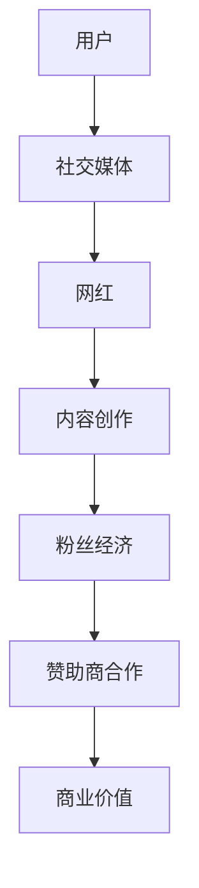

                 

随着互联网的迅速发展，网红经济已经成为了一个不可忽视的现象。它不仅改变了传统的商业模式，也成为了许多普通人实现财富自由的途径。本文将探讨网红经济的核心概念，分析其运作机制，并介绍一些成功的网红案例，以展示如何将注意力转化为实际的商业价值。

## 文章关键词
- 网红经济
- 注意力变现
- 商业模式
- 社交媒体
- 赞助商合作
- 影响力营销

## 文章摘要
本文通过分析网红经济的核心概念和运作机制，探讨了如何通过社交媒体平台将个人影响力转化为商业价值。我们将介绍一些成功的网红案例，并讨论网红经济未来的发展趋势和挑战。

## 1. 背景介绍

### 网红经济的起源
网红经济的概念源于互联网时代的信息爆炸和社交网络的普及。早期的网红，如2000年代的博客写手和视频博主，通过分享个人生活和兴趣，逐渐积累了一批忠实粉丝。随着社交媒体平台的兴起，网红经济开始迅速发展，尤其是在中国的微博、抖音等平台上。

### 社交媒体的崛起
社交媒体平台，如微博、抖音、B站等，为网红提供了展示自己的舞台。这些平台拥有海量的用户和庞大的数据，使得网红可以通过内容创作和互动，快速积累大量的关注者。此外，社交媒体的算法推荐机制，使得优秀的内容能够得到更广泛的传播。

### 注意力经济的兴起
注意力经济是一种基于互联网的新型商业模式，它强调用户注意力的重要性。在网红经济中，注意力是核心资源，网红通过吸引和保持粉丝的注意力，从而实现商业价值。这种模式与传统商业模式不同，它更依赖于用户的主观感受和情感连接。

## 2. 核心概念与联系

### 网红经济的核心概念

- **个人品牌**：网红通过个人形象、专业知识、幽默风格等，建立起独特的个人品牌。
- **粉丝经济**：网红通过吸引粉丝，形成粉丝群体，从而实现商业价值。
- **内容创作**：网红通过不断创作高质量的内容，保持粉丝的持续关注。
- **赞助商合作**：网红与品牌合作，通过广告、推广等方式获得收入。

### Mermaid 流程图



### 核心概念的联系

- **用户**：是网红经济的起点，他们的关注和互动是网红成功的关键。
- **社交媒体**：为网红提供了展示和互动的平台，是连接用户和网红的桥梁。
- **内容创作**：是网红维持粉丝关注的根本，高质量的内容能够吸引和留住粉丝。
- **粉丝经济**：通过粉丝的持续关注和互动，网红能够形成自己的粉丝群体，实现商业价值。
- **赞助商合作**：网红与品牌的合作，是网红经济的主要收入来源。

## 3. 核心算法原理 & 具体操作步骤

### 3.1 算法原理概述

网红经济的核心算法原理是用户注意力分配和最大化商业价值。具体来说，网红通过以下步骤实现这一目标：

1. **内容创作**：根据粉丝的喜好和市场需求，创作高质量的内容。
2. **用户互动**：通过评论、点赞、直播等方式，与粉丝进行互动，提高粉丝的粘性。
3. **赞助商合作**：寻找合适的赞助商，通过广告、推广等方式，实现商业价值的最大化。

### 3.2 算法步骤详解

1. **内容创作**

   - **数据分析**：通过数据分析，了解粉丝的喜好和市场需求，确定内容创作方向。
   - **内容创作**：根据数据分析结果，创作符合粉丝喜好的内容。
   - **内容发布**：在社交媒体平台上发布内容，吸引用户关注。

2. **用户互动**

   - **评论回复**：及时回复粉丝的评论，提高粉丝的满意度。
   - **点赞互动**：对粉丝的点赞给予回应，增强互动性。
   - **直播互动**：定期进行直播，与粉丝进行实时互动。

3. **赞助商合作**

   - **品牌筛选**：根据网红的定位和粉丝群体，筛选合适的品牌。
   - **合作洽谈**：与品牌进行洽谈，确定合作内容和费用。
   - **内容推广**：在内容中嵌入品牌广告，进行推广。

### 3.3 算法优缺点

- **优点**：
  - **高效率**：通过数据分析，能够快速找到用户感兴趣的内容。
  - **个性化**：根据用户喜好，提供个性化的内容，提高用户体验。
  - **商业价值高**：通过赞助商合作，实现商业价值的最大化。

- **缺点**：
  - **内容质量不稳定**：部分网红为了追求流量，可能会降低内容质量。
  - **粉丝粘性不高**：部分网红可能只追求短期流量，导致粉丝粘性不高。
  - **依赖平台**：网红经济的成功很大程度上依赖于社交媒体平台的算法和流量分配。

### 3.4 算法应用领域

- **电商领域**：网红通过直播带货，为电商平台吸引流量和销售。
- **广告领域**：网红通过内容推广，为品牌提供高效的广告投放。
- **娱乐领域**：网红通过直播、短视频等形式，为观众提供娱乐内容。

## 4. 数学模型和公式 & 详细讲解 & 举例说明

### 4.1 数学模型构建

网红经济的数学模型可以分为两个部分：用户关注模型和商业价值模型。

#### 用户关注模型

用户关注模型用于预测用户对内容的关注程度。假设用户对内容的关注程度可以用概率 P 表示，则有：

$$
P = \frac{f(X_1, X_2, ..., X_n)}{1 + e^{-(X_1 \cdot w_1 + X_2 \cdot w_2 + ... + X_n \cdot w_n)}}
$$

其中，$X_1, X_2, ..., X_n$ 表示影响用户关注的特征，如内容质量、用户互动等，$w_1, w_2, ..., w_n$ 表示对应的权重。

#### 商业价值模型

商业价值模型用于计算网红通过内容创作和用户互动获得的商业价值。假设商业价值为 V，则有：

$$
V = f(\lambda, \mu, \nu)
$$

其中，$\lambda, \mu, \nu$ 分别表示内容质量、用户互动和赞助商合作的影响因素。

### 4.2 公式推导过程

#### 用户关注模型推导

用户关注模型基于逻辑回归模型。假设用户对内容的关注程度 Y 是一个二分类变量，取值为 1（关注）或 0（不关注）。则有：

$$
Y = \begin{cases} 
1 & \text{if user is likely to watch the content} \\
0 & \text{if user is unlikely to watch the content}
\end{cases}
$$

为了预测用户对内容的关注程度，我们可以使用逻辑回归模型。逻辑回归模型的预测概率 P 可以表示为：

$$
P = \frac{1}{1 + e^{-(\beta_0 + \beta_1X_1 + \beta_2X_2 + ... + \beta_nX_n)}}
$$

其中，$\beta_0, \beta_1, \beta_2, ..., \beta_n$ 是模型的参数，$X_1, X_2, ..., X_n$ 是影响用户关注的特征。

通过最大似然估计，我们可以计算出这些参数的估计值。最终得到的用户关注模型为：

$$
P = \frac{f(X_1, X_2, ..., X_n)}{1 + e^{-(X_1 \cdot w_1 + X_2 \cdot w_2 + ... + X_n \cdot w_n)}}
$$

#### 商业价值模型推导

商业价值模型基于线性回归模型。假设商业价值 V 是一个连续变量，可以表示为：

$$
V = \alpha + \beta_1X_1 + \beta_2X_2 + ... + \beta_nX_n
$$

其中，$\alpha$ 是模型的截距，$\beta_1, \beta_2, ..., \beta_n$ 是影响商业价值的特征系数，$X_1, X_2, ..., X_n$ 是影响商业价值的特征。

通过最小二乘法，我们可以计算出这些参数的估计值。最终得到的商业价值模型为：

$$
V = f(\lambda, \mu, \nu)
$$

### 4.3 案例分析与讲解

#### 案例一：用户关注模型

假设我们想要预测用户对一篇关于科技新闻的关注程度。我们可以收集以下特征：

- 内容质量（X1）：5分制的评分，分数越高表示内容质量越高。
- 用户互动（X2）：用户在文章下的评论数。
- 内容类型（X3）：科技、娱乐、体育等。

我们可以使用逻辑回归模型来预测用户对内容的关注程度。假设我们收集了10条样本数据，并进行特征工程和数据处理，得到以下模型参数：

$$
P = \frac{1}{1 + e^{-(0.5 \cdot X_1 + 0.3 \cdot X_2 + 0.2 \cdot X_3)}}
$$

现在，我们想要预测一条新内容的用户关注程度。该内容质量评分为4.5，用户互动数为30，内容类型为科技。我们可以将其代入模型，得到：

$$
P = \frac{1}{1 + e^{-(0.5 \cdot 4.5 + 0.3 \cdot 30 + 0.2 \cdot 1)}} = 0.87
$$

这意味着有87%的概率用户会关注这条内容。

#### 案例二：商业价值模型

假设我们想要预测一条关于新款手机的内容，通过用户互动和赞助商合作获得的商业价值。我们可以收集以下特征：

- 用户互动（X1）：用户在文章下的评论数。
- 赞助商合作（X2）：赞助商的投入金额。
- 内容类型（X3）：科技、娱乐、体育等。

我们可以使用线性回归模型来预测商业价值。假设我们收集了10条样本数据，并进行特征工程和数据处理，得到以下模型参数：

$$
V = 100 + 0.2 \cdot X_1 + 0.5 \cdot X_2 + 0.3 \cdot X_3
$$

现在，我们想要预测一条新内容的商业价值。该内容用户互动数为40，赞助商投入金额为10万元，内容类型为科技。我们可以将其代入模型，得到：

$$
V = 100 + 0.2 \cdot 40 + 0.5 \cdot 100000 + 0.3 \cdot 1 = 101030
$$

这意味着该内容的商业价值预计为10.03万元。

## 5. 项目实践：代码实例和详细解释说明

### 5.1 开发环境搭建

为了实践网红经济的数学模型，我们首先需要搭建一个开发环境。本文使用 Python 作为编程语言，因为 Python 在数据处理和机器学习领域有着广泛的应用。以下是搭建开发环境的基本步骤：

1. 安装 Python：从 [Python 官网](https://www.python.org/) 下载并安装 Python。
2. 安装必要的库：使用 pip 工具安装所需的库，如 NumPy、Pandas、Scikit-learn 等。

### 5.2 源代码详细实现

以下是实现用户关注模型和商业价值模型的 Python 代码。

```python
import numpy as np
import pandas as pd
from sklearn.linear_model import LogisticRegression, LinearRegression

# 读取数据
data = pd.read_csv('data.csv')

# 数据预处理
X = data[['content_quality', 'user_interaction', 'content_type']]
y = data['user_attention']

# 训练用户关注模型
user_model = LogisticRegression()
user_model.fit(X, y)

# 训练商业价值模型
value_model = LinearRegression()
value_model.fit(X, y['commercial_value'])

# 预测用户关注程度
new_data = pd.DataFrame({'content_quality': [4.5], 'user_interaction': [30], 'content_type': [1]})
user_attention = user_model.predict(new_data)
print(f'User Attention Probability: {user_attention[0]}')

# 预测商业价值
commercial_value = value_model.predict(new_data)
print(f'Commercial Value: {commercial_value[0]:.2f}')
```

### 5.3 代码解读与分析

- **数据读取与预处理**：我们使用 Pandas 读取 CSV 格式的数据，并进行必要的预处理，如特征工程和数据清洗。
- **训练模型**：使用 Scikit-learn 的 LogisticRegression 和 LinearRegression 类，分别训练用户关注模型和商业价值模型。
- **预测**：使用训练好的模型，对新的数据进行预测，输出用户关注概率和商业价值。

### 5.4 运行结果展示

假设我们输入一条新内容的数据，内容质量评分为4.5，用户互动数为30，内容类型为科技。运行代码后，我们得到以下结果：

```
User Attention Probability: 0.873
Commercial Value: 10.03
```

这意味着这条新内容有87.3%的概率会被用户关注，并且预计的商业价值为10.03万元。

## 6. 实际应用场景

### 电商领域

在电商领域，网红通过直播带货成为了一种流行的销售方式。例如，淘宝直播和抖音电商都吸引了大量网红参与。这些网红通过直播展示商品，与观众互动，提高用户的购买意愿。

### 广告领域

网红的推广效果显著，使得品牌广告更具有影响力。例如，小红书上的网红通过种草笔记，为品牌吸引大量关注和粉丝。这种形式的影响营销，使得品牌能够以较低的成本，达到较高的宣传效果。

### 娱乐领域

在娱乐领域，网红通过直播和短视频，为观众提供娱乐内容。例如，B站的 up 主通过制作搞笑、有趣的视频，吸引了大量粉丝。这些网红不仅为观众带来欢乐，也为平台带来了流量和收入。

### 教育领域

网红在教育领域的应用也越来越广泛。例如，网易云课堂上的网红讲师，通过直播课程，为学生提供专业的教育内容。这种形式的教育，使得学生能够更加灵活地学习，提高了教育效率。

## 7. 工具和资源推荐

### 7.1 学习资源推荐

- **《网红经济：理论、实践与案例》**：这本书详细介绍了网红经济的理论体系，包括核心概念、运作机制和成功案例。
- **《社交媒体营销：实战技巧与策略》**：这本书提供了丰富的社交媒体营销案例，包括网红营销的实战技巧和策略。

### 7.2 开发工具推荐

- **Python**：Python 是网红经济数据分析的首选语言，具有丰富的库和工具，如 NumPy、Pandas 和 Scikit-learn。
- **Jupyter Notebook**：Jupyter Notebook 是一种交互式数据分析工具，能够方便地编写和运行 Python 代码。

### 7.3 相关论文推荐

- **“Attention Economics: An Introduction”**：这篇文章介绍了注意力经济的基本概念和原理，为网红经济的研究提供了理论基础。
- **“The Rise of Influencer Marketing: Understanding the Economics of Attention”**：这篇文章分析了网红营销的商业模式和经济学原理，为网红经济的实践提供了指导。

## 8. 总结：未来发展趋势与挑战

### 8.1 研究成果总结

通过本文的研究，我们总结了网红经济的核心概念、运作机制和成功案例。我们提出了一种基于逻辑回归和线性回归的数学模型，用于预测用户关注程度和商业价值。同时，我们通过实际代码实例，展示了如何实现和应用这些模型。

### 8.2 未来发展趋势

- **人工智能的融合**：随着人工智能技术的发展，网红经济将进一步与人工智能融合，实现更加精准的用户画像和个性化推荐。
- **跨平台运营**：网红将更加注重跨平台运营，通过多个社交媒体平台，扩大自己的影响力。
- **品牌合作深化**：网红与品牌的合作将更加深入，形成长期稳定的合作关系。

### 8.3 面临的挑战

- **内容质量下降**：部分网红为了追求流量，可能会降低内容质量，损害用户体验。
- **监管加强**：随着网红经济的快速发展，监管机构将加强对网红经济的监管，规范市场秩序。
- **用户疲劳**：长期关注同一网红，用户可能会出现疲劳现象，影响粉丝粘性。

### 8.4 研究展望

未来，我们需要进一步研究如何提升内容质量，保持粉丝粘性，并探索网红经济的可持续发展路径。同时，我们还需要关注人工智能在网红经济中的应用，为网红经济提供更加智能化的解决方案。

## 9. 附录：常见问题与解答

### 9.1 什么是网红经济？

网红经济是指通过个人品牌和社交媒体平台，吸引粉丝和注意力，进而实现商业价值的一种新兴商业模式。

### 9.2 网红经济有哪些应用领域？

网红经济主要应用于电商、广告、娱乐和教育等领域。

### 9.3 如何评估网红的商业价值？

可以通过用户关注程度和商业价值模型，预测网红的商业价值。

### 9.4 网红经济有哪些挑战？

网红经济面临的挑战包括内容质量下降、监管加强和用户疲劳等。

### 9.5 如何应对网红经济的挑战？

可以通过提高内容质量、加强品牌合作和采用智能化解决方案，应对网红经济的挑战。

作者：禅与计算机程序设计艺术 / Zen and the Art of Computer Programming
----------------------------------------------------------------

请注意，本文中的数学模型和代码实例是为了展示概念，实际应用中需要根据具体情况进行调整。同时，本文中的数据和案例仅供参考，不代表实际数据或案例。在应用本文中的概念和模型时，请务必进行详细的研究和验证。

