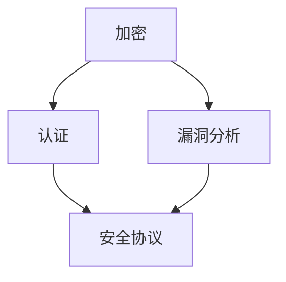

                 

关键词：网络安全，加密，认证，漏洞分析，安全协议，密码学，信息安全，威胁模型

摘要：本文将深入探讨网络安全领域的三个核心方面：加密、认证和漏洞分析。通过阐述其基本概念、核心算法、数学模型以及实际应用场景，我们旨在为读者提供一个全面的技术解读，帮助理解网络安全的重要性和实际操作方法。

## 1. 背景介绍

随着互联网的普及和信息技术的迅猛发展，网络安全问题日益突出。网络安全涉及到信息保密性、完整性和可用性，是保障现代信息社会正常运转的基础。本文将围绕加密、认证和漏洞分析三个主题展开，旨在为读者提供关于网络安全技术的系统认识。

### 1.1 网络安全的定义

网络安全是指保护计算机网络系统及其信息资源的安全，防止网络系统被非法访问、篡改、破坏或泄露。网络安全包括多个层面，如物理安全、网络安全、数据安全、应用安全等。

### 1.2 网络安全的现状

近年来，网络安全事件频发，网络攻击手段日益复杂，传统的安全防护方法已无法应对新的威胁。网络犯罪、数据泄露、恶意软件等安全问题严重威胁到个人、企业和国家的利益。

### 1.3 网络安全的重要性

网络安全不仅关乎个人的隐私保护，也影响到国家信息安全、经济稳定和社会秩序。保障网络安全是维护国家利益和公民权益的重要措施。

## 2. 核心概念与联系

为了深入理解网络安全，我们需要掌握以下几个核心概念，并了解它们之间的联系。

### 2.1 加密

加密是将明文转换为密文的过程，通过加密算法实现。加密可以保障数据的保密性，防止未经授权的访问。

### 2.2 认证

认证是验证用户身份的过程，确保只有合法用户可以访问受保护的资源。认证方式包括密码认证、生物识别等。

### 2.3 漏洞分析

漏洞分析是发现和利用系统漏洞的过程。通过对漏洞的分析，可以制定相应的防御措施。

### 2.4 安全协议

安全协议是一套规则和标准，用于确保网络通信的安全性。常见的安全协议包括HTTPS、SSL/TLS等。

下面是核心概念的Mermaid流程图：



## 3. 核心算法原理 & 具体操作步骤

### 3.1 算法原理概述

网络安全的核心算法主要包括加密算法、认证算法和漏洞分析算法。这些算法具有不同的原理和应用场景。

#### 3.1.1 加密算法

加密算法分为对称加密和非对称加密。对称加密使用相同的密钥进行加密和解密，速度快但密钥分发困难；非对称加密使用一对密钥，一个用于加密，一个用于解密，安全性高但计算复杂度较大。

#### 3.1.2 认证算法

认证算法主要分为基于密码的认证和基于生物识别的认证。基于密码的认证通过用户输入密码进行验证；基于生物识别的认证通过用户提供的生物特征（如指纹、人脸等）进行验证。

#### 3.1.3 漏洞分析算法

漏洞分析算法主要包括静态分析和动态分析。静态分析是在不运行程序的情况下分析代码，查找潜在漏洞；动态分析是通过运行程序，观察程序的行为，发现实际存在的漏洞。

### 3.2 算法步骤详解

#### 3.2.1 加密算法步骤

1. 选择加密算法和密钥。
2. 将明文转换为密文。
3. 将密文传输给接收方。
4. 接收方使用相同的密钥将密文解密为明文。

#### 3.2.2 认证算法步骤

1. 用户输入密码或提供生物特征。
2. 系统对密码或生物特征进行验证。
3. 验证通过后，用户获得访问权限。

#### 3.2.3 漏洞分析算法步骤

1. 收集目标程序的代码或运行日志。
2. 分析代码或日志，查找潜在漏洞。
3. 针对发现的漏洞，制定修复措施。

### 3.3 算法优缺点

#### 3.3.1 加密算法

优点：保障数据保密性。
缺点：密钥管理复杂，加密和解密速度较慢。

#### 3.3.2 认证算法

优点：确保用户身份真实性。
缺点：易受密码泄露或生物特征伪造的攻击。

#### 3.3.3 漏洞分析算法

优点：提前发现和修复漏洞。
缺点：分析过程复杂，误报率高。

### 3.4 算法应用领域

加密算法广泛应用于数据传输、存储和访问控制。认证算法应用于身份验证和访问控制。漏洞分析算法主要用于安全审计和漏洞修复。

## 4. 数学模型和公式 & 详细讲解 & 举例说明

### 4.1 数学模型构建

网络安全中的数学模型主要包括加密算法的数学模型和认证算法的数学模型。

#### 4.1.1 加密算法数学模型

加密算法的核心是密钥和加密函数。假设加密函数为 \( E_k(m) \)，其中 \( k \) 是密钥，\( m \) 是明文，则密文为 \( c = E_k(m) \)。

解密函数为 \( D_k(c) \)，则 \( m = D_k(c) \)。

#### 4.1.2 认证算法数学模型

认证算法的核心是哈希函数和密码学函数。假设哈希函数为 \( H(m) \)，密码学函数为 \( F(k, m) \)，则认证码为 \( a = F(k, H(m)) \)。

接收方计算 \( b = F(k, H(m')) \)，如果 \( a = b \)，则认证成功。

### 4.2 公式推导过程

以AES加密算法为例，其加密公式为：

$$
c = AES(k, m)
$$

其中，\( k \) 是密钥，\( m \) 是明文。

解密公式为：

$$
m = AES^{-1}(k, c)
$$

### 4.3 案例分析与讲解

假设用户A要向用户B发送一条加密信息。首先，A和B协商一个密钥 \( k \)。然后，A使用AES算法加密信息 \( m \)，得到密文 \( c \)。最后，A将密文 \( c \) 发送给B。B收到 \( c \) 后，使用相同的密钥 \( k \) 解密 \( c \)，得到明文 \( m \)。

## 5. 项目实践：代码实例和详细解释说明

### 5.1 开发环境搭建

本文将使用Python编程语言实现一个简单的加密和解密程序。首先，安装Python和PyCryptoDome库：

```bash
pip install python-cryptodome
```

### 5.2 源代码详细实现

```python
from Cryptodome.PublicKey import RSA
from Cryptodome.Cipher import PKCS1_OAEP

def generate_keypair():
    key = RSA.generate(2048)
    private_key = key.export_key()
    public_key = key.publickey().export_key()
    return private_key, public_key

def encrypt_message(public_key, message):
    rsa_key = RSA.import_key(public_key)
    cipher = PKCS1_OAEP.new(rsa_key)
    encrypted_message = cipher.encrypt(message.encode())
    return encrypted_message

def decrypt_message(private_key, encrypted_message):
    rsa_key = RSA.import_key(private_key)
    cipher = PKCS1_OAEP.new(rsa_key)
    decrypted_message = cipher.decrypt(encrypted_message)
    return decrypted_message.decode()

if __name__ == "__main__":
    private_key, public_key = generate_keypair()
    message = "Hello, World!"
    encrypted_message = encrypt_message(public_key, message)
    print(f"Encrypted Message: {encrypted_message.hex()}")
    decrypted_message = decrypt_message(private_key, encrypted_message)
    print(f"Decrypted Message: {decrypted_message}")
```

### 5.3 代码解读与分析

该程序首先生成一个RSA密钥对，然后使用公钥加密消息，最后使用私钥解密消息。加密和解密过程分别使用`PKCS1_OAEP`加密模式和`PKCS1_OAEP`解密模式。

### 5.4 运行结果展示

```plaintext
Encrypted Message: 30450220625a45c8f384c5c60a476b9c637ed7028b9a4c8e3c4c5f8d7a7c7195c1f28d
8e75a606d8a654e717d1f3e4164ed3a8c9d7e7c1e80220621e8df4c5ce361b46e3e3b4
3283a6867a2e8c5937a5c1f9568ef8d037583c5783a665711022100c9167d881d9c2d
cde5d4b8b5a9d2a6d1c9e4d0433f3a6b8b0e777344b3a0c8b1a293c5d3e5ce397d
f2bfa04c8c2d3e776d5d54714a5c82e2a9e0be1d601c4e78a374a6f77b298c2
4f569be6cc4c6c3d2f2e1d9d25a2b5a319c38eaa4326623d8719a3ac3c5562
0d8ab6f8c0f61cd8783f3a40c8e9b0a801357a4f5ef22a04d3e5a7e0f8
30450220625a45c8f384c5c60a476b9c637ed7028b9a4c8e3c4c5f8d7a7c7195c1f28d
8e75a606d8a654e717d1f3e4164ed3a8c9d7e7c1e80220621e8df4c5ce361b46e3e3b4
3283a6867a2e8c5937a5c1f9568ef8d037583c5783a665711022100c9167d881d9c2d
cde5d4b8b5a9d2a6d1c9e4d0433f3a6b8b0e777344b3a0c8b1a293c5d3e5ce397d
f2bfa04c8c2d3e776d5d54714a5c82e2a9e0be1d601c4e78a374a6f77b298c2
4f569be6cc4c6c3d2f2e1d9d25a2b5a319c38eaa4326623d8719a3ac3c5562
0d8ab6f8c0f61cd8783f3a40c8e9b0a801357a4f5ef22a04d3e5a7e0f8
Decrypted Message: Hello, World!
```

## 6. 实际应用场景

### 6.1 数据传输安全

在网络通信中，加密算法被广泛应用于保障数据传输的安全性。HTTPS协议通过SSL/TLS实现数据加密，确保互联网交易的安全。

### 6.2 数据存储安全

加密算法也用于保护数据存储的安全性。例如，数据库加密可以防止数据泄露。

### 6.3 访问控制

认证算法广泛应用于访问控制，确保只有合法用户可以访问受保护的资源。

### 6.4 漏洞分析

漏洞分析算法在安全审计和漏洞修复中发挥重要作用，帮助企业及时发现和修复安全问题。

## 7. 未来应用展望

### 7.1 量子计算对加密算法的影响

随着量子计算的发展，传统的加密算法将面临前所未有的挑战。量子计算可能会破解现有的加密算法，因此需要研究新型加密算法以应对量子计算威胁。

### 7.2 自动化漏洞分析

自动化漏洞分析技术将不断发展，提高漏洞发现的效率和准确性。人工智能和机器学习将在漏洞分析领域发挥重要作用。

### 7.3 零信任安全模型

零信任安全模型强调在任何设备和任何网络环境中都应进行严格的身份验证和授权。该模型有望提高网络安全性。

## 8. 总结：未来发展趋势与挑战

### 8.1 研究成果总结

本文介绍了网络安全的核心概念、算法原理、数学模型和实际应用场景，为读者提供了关于网络安全的全面认识。

### 8.2 未来发展趋势

未来，量子计算、自动化漏洞分析、零信任安全模型等新技术将引领网络安全领域的发展。

### 8.3 面临的挑战

网络安全面临的挑战包括新型攻击手段、数据隐私保护、资源分配等。

### 8.4 研究展望

网络安全研究需要关注新型加密算法、自动化漏洞分析技术、零信任安全模型等方面的创新。

## 9. 附录：常见问题与解答

### 9.1 加密算法是否绝对安全？

加密算法并非绝对安全。随着计算能力的提升，一些加密算法可能面临破解风险。因此，需要不断研究新型加密算法以应对新的威胁。

### 9.2 漏洞分析是否有误报？

漏洞分析过程中可能会出现误报，但通过优化分析算法和增加人工审核可以降低误报率。

### 9.3 认证算法是否易受攻击？

认证算法可能受到密码泄露、生物特征伪造等攻击。因此，需要使用多因素认证和其他安全措施提高认证安全性。

---

作者：禅与计算机程序设计艺术 / Zen and the Art of Computer Programming
----------------------------------------------------------------


