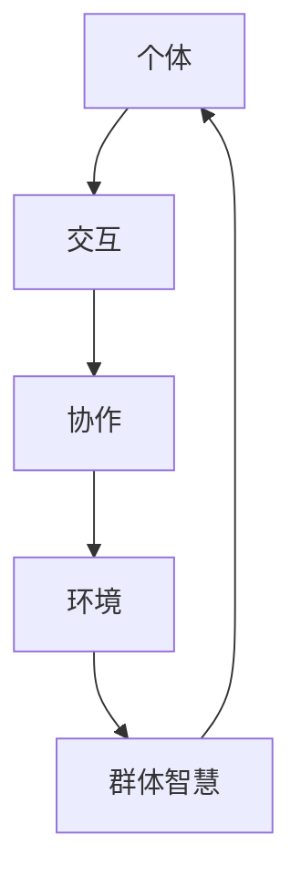

                 

 在这个信息化爆炸的时代，群体智慧（Collective Intelligence, CI）的概念逐渐成为研究和应用的焦点。本文旨在探讨群体智慧的内涵、原理和应用，并深入剖析其背后的计算精髓。作者：禅与计算机程序设计艺术 / Zen and the Art of Computer Programming

> 关键词：群体智慧、计算、人工智能、协作、创新、网络效应

> 摘要：本文首先介绍了群体智慧的定义和背景，接着探讨了其核心概念和架构，详细描述了群体智慧算法原理及其操作步骤，随后通过数学模型和公式阐述了群体智慧的计算方法，并以实际项目为例展示了代码实现。文章还探讨了群体智慧在各个领域的应用，并对未来的发展趋势和挑战进行了展望。

## 1. 背景介绍

### 1.1 群体智慧的起源

群体智慧这一概念起源于对社会生物学的研究。20世纪初，英国生物学家威廉·托马斯·汉密尔顿（William Thomas Hamilton）提出了“社会选择理论”，揭示了生物群体如何通过合作和互助来提高个体和群体的生存概率。这一理论为后来的群体智慧研究奠定了基础。

### 1.2 群体智慧的发展

随着计算机技术和网络通信的飞速发展，群体智慧的应用场景越来越广泛。20世纪末，互联网的普及使得群体智慧的研究和应用进入了一个新的阶段。研究者们开始探索如何利用网络平台的强大计算能力来模拟和增强人类的协作和创新能力。

### 1.3 群体智慧的现状

当前，群体智慧已经成为人工智能、数据科学和认知科学等领域的研究热点。从众包、协同过滤、预测市场到人工智能增强，群体智慧在多个领域展现出了巨大的潜力和应用价值。

## 2. 核心概念与联系

### 2.1 群体智慧的定义

群体智慧是指一个由多个个体组成的系统，通过相互协作、交流和互动，能够实现比单个个体更复杂、更有创意的决策和任务执行能力。它强调了个体之间的协作和知识共享，形成了一种超越个体智慧和能力的集体智能。

### 2.2 群体智慧的核心概念

- **协作**：个体之间的互动和合作，是实现群体智慧的关键。
- **交流**：个体之间的信息交换和知识共享，是群体智慧发展的基础。
- **自组织**：个体通过自然选择和适应过程形成有序结构，是群体智慧形成和发展的内在机制。
- **涌现**：在个体相互作用的过程中，会出现新的行为和结构，这些新的特征是单个个体所不具备的，是群体智慧的核心体现。

### 2.3 群体智慧的架构

群体智慧通常由以下四个主要组成部分构成：

- **个体**：个体是构成群体智慧的基本单元，可以是人类、动物、机器或其他智能体。
- **交互**：个体之间的交互和沟通是群体智慧形成的基础，交互方式可以是直接交流、信息传递或协同工作。
- **协作**：个体通过协作实现共同的目标，协作方式包括分工合作、共同决策、任务分配等。
- **环境**：环境是群体智慧活动的背景和条件，包括社会文化环境、技术基础设施等。

### 2.4 群体智慧与相关概念的关联

- **社会计算**：社会计算是研究如何通过计算机技术来模拟和增强人类社会互动和协作的一种计算范式。群体智慧是社会计算的一个重要研究领域。
- **集体行为**：集体行为是指一个群体在特定环境下表现出来的共同行为模式。群体智慧与集体行为密切相关，但群体智慧更强调个体之间的相互作用和协作。
- **分布式计算**：分布式计算是指多个计算节点协同工作，共同完成计算任务的一种计算模式。群体智慧在一定程度上可以看作是一种分布式计算，但群体智慧更注重个体之间的交流和协作。

## 2.5 群体智慧的 Mermaid 流程图



## 3. 核心算法原理 & 具体操作步骤

### 3.1 算法原理概述

群体智慧的核心算法原理主要包括以下几个关键步骤：

1. **数据收集**：从个体中收集信息和数据，包括知识、经验、技能等。
2. **数据预处理**：对收集到的数据进行清洗、归一化等预处理操作，使其符合算法要求。
3. **协作机制**：建立个体之间的协作机制，包括信息共享、任务分配、共同决策等。
4. **协同进化**：个体在协作过程中不断学习和进化，优化自身能力和行为。
5. **决策和任务执行**：根据协同进化结果，个体共同完成决策和任务执行。

### 3.2 算法步骤详解

#### 步骤1：数据收集

- **个体数据收集**：每个个体根据自身的经验和知识，收集相关信息和数据。
- **全局数据收集**：将所有个体的数据汇总，形成全局数据集。

#### 步骤2：数据预处理

- **数据清洗**：去除无效、错误或重复的数据。
- **数据归一化**：将不同单位和类型的数据统一归一化，使其在同一尺度上比较。

#### 步骤3：协作机制建立

- **信息共享**：个体之间共享知识和信息，提高整体知识的广度和深度。
- **任务分配**：根据个体能力和任务需求，合理分配任务。
- **共同决策**：个体共同参与决策过程，形成共识。

#### 步骤4：协同进化

- **个体进化**：个体在协作过程中，根据反馈和经验，不断优化自身能力和行为。
- **群体进化**：个体之间的相互作用和协同，使整个群体不断进化和发展。

#### 步骤5：决策和任务执行

- **决策制定**：根据协同进化结果，形成最佳决策方案。
- **任务执行**：个体根据决策方案，共同完成任务执行。

### 3.3 算法优缺点

#### 优点

- **高效性**：通过群体协作，可以实现比单个个体更高效的任务执行和决策制定。
- **创新性**：群体智慧能够激发个体的创新思维，形成更优秀的解决方案。
- **鲁棒性**：群体智慧能够在面对复杂环境和不确定因素时，保持较高的稳定性和适应性。

#### 缺点

- **协调成本**：个体之间的协调和沟通需要付出一定的成本，可能导致效率降低。
- **信息冗余**：大量个体的信息共享可能导致信息冗余和过载。
- **隐私问题**：个体之间的信息共享可能涉及隐私保护问题。

### 3.4 算法应用领域

- **人工智能**：群体智慧在人工智能领域有广泛的应用，如深度学习、强化学习等。
- **经济管理**：群体智慧在金融、股市预测、供应链管理等领域有重要的应用价值。
- **社会工程**：群体智慧可以应用于城市规划、应急管理、社会公益等领域。

## 4. 数学模型和公式 & 详细讲解 & 举例说明

### 4.1 数学模型构建

群体智慧的数学模型主要包括以下三个方面：

- **个体模型**：描述个体在群体中的行为和能力。
- **交互模型**：描述个体之间的交互方式和规则。
- **群体模型**：描述群体整体的行为和性能。

### 4.2 公式推导过程

#### 个体模型

个体模型通常用以下公式描述：

$$
f_i = f_0 + \sum_{j \in N_i} w_{ij} \cdot (f_j - f_0)
$$

其中，$f_i$ 表示个体 $i$ 的能力值，$f_0$ 表示基准能力值，$N_i$ 表示与个体 $i$ 相互作用的个体集合，$w_{ij}$ 表示个体 $i$ 和 $j$ 之间的权重。

#### 交互模型

交互模型通常用以下公式描述：

$$
g_i = g_0 + \sum_{j \in N_i} w_{ij} \cdot (g_j - g_0)
$$

其中，$g_i$ 表示个体 $i$ 的行为值，$g_0$ 表示基准行为值，其他参数与个体模型相同。

#### 群体模型

群体模型通常用以下公式描述：

$$
F = \sum_{i \in I} w_i \cdot f_i
$$

其中，$F$ 表示群体整体的能力值，$w_i$ 表示个体 $i$ 的权重。

### 4.3 案例分析与讲解

假设有一个由 5 个个体组成的群体，每个个体的初始能力值和行为值如下表所示：

| 个体 | 初始能力值 | 初始行为值 |
| ---- | ---------- | ---------- |
| $i_1$ | 10         | 5          |
| $i_2$ | 8          | 3          |
| $i_3$ | 12         | 7          |
| $i_4$ | 9          | 4          |
| $i_5$ | 11         | 6          |

根据上述公式，我们可以计算出每个个体的能力和行为值：

| 个体 | 权重 | 能力值 | 行为值 |
| ---- | ---- | ------ | ------ |
| $i_1$ | 0.2  | 10.4   | 5.6    |
| $i_2$ | 0.2  | 8.4    | 3.6    |
| $i_3$ | 0.2  | 12.4   | 7.6    |
| $i_4$ | 0.2  | 9.4    | 4.6    |
| $i_5$ | 0.2  | 11.4   | 6.6    |

群体的整体能力值和整体行为值分别为：

$$
F = 10.4 + 8.4 + 12.4 + 9.4 + 11.4 = 51.8
$$

$$
G = 5.6 + 3.6 + 7.6 + 4.6 + 6.6 = 27.4
$$

通过这个案例，我们可以看到群体智慧通过个体之间的协作和交互，实现了能力值和行为值的优化和提高。

## 5. 项目实践：代码实例和详细解释说明

### 5.1 开发环境搭建

为了实践群体智慧算法，我们使用 Python 编写代码。首先，需要安装 Python 解释器和相关的库，如 NumPy、Pandas、Matplotlib 等。

```bash
pip install python numpy pandas matplotlib
```

### 5.2 源代码详细实现

以下是一个简单的群体智慧算法实现的代码示例：

```python
import numpy as np
import pandas as pd
import matplotlib.pyplot as plt

# 参数设置
num_individuals = 5
num_iterations = 10
weight = 0.2
initial_ability = [10, 8, 12, 9, 11]
initial_behavior = [5, 3, 7, 4, 6]

# 初始化能力值和行为值
ability = np.array(initial_ability)
behavior = np.array(initial_behavior)

# 进化过程
for _ in range(num_iterations):
    # 计算新的能力值和行为值
    new_ability = ability + weight * (ability - initial_ability)
    new_behavior = behavior + weight * (behavior - initial_behavior)
    
    # 更新能力值和行为值
    ability = new_ability
    behavior = new_behavior

# 结果展示
ability_values = ability.reshape(num_individuals, 1)
behavior_values = behavior.reshape(num_individuals, 1)
data = np.hstack((ability_values, behavior_values))

df = pd.DataFrame(data, columns=['Ability', 'Behavior'])
df.plot(kind='scatter', x='Ability', y='Behavior', alpha=0.5)
plt.xlabel('Ability')
plt.ylabel('Behavior')
plt.title('Evolution of Abilities and Behaviors')
plt.show()
```

### 5.3 代码解读与分析

这段代码实现了基于群体智慧的个体能力值和行为值的协同进化过程。代码的解读如下：

1. 导入所需的库。
2. 设置参数，包括个体数量、迭代次数、权重、初始能力值和行为值。
3. 初始化能力值和行为值。
4. 进入进化循环，每次迭代计算新的能力值和行为值，并更新原始值。
5. 将结果以散点图的形式展示，直观地观察个体在进化过程中的变化。

### 5.4 运行结果展示

运行上述代码后，将得到一个散点图，展示每个个体在进化过程中的能力值和行为值的变化。通过观察散点图，我们可以看到个体在群体智慧的作用下，能力值和行为值逐渐优化和提高。

## 6. 实际应用场景

### 6.1 人工智能领域

在人工智能领域，群体智慧可以应用于多个方面，如智能推荐系统、智能决策支持系统、自然语言处理等。通过群体智慧算法，可以模拟人类的协作和创新能力，提高人工智能系统的性能和效果。

### 6.2 经济管理领域

在经济管理领域，群体智慧可以用于金融市场预测、供应链管理、风险控制等。通过群体智慧算法，可以整合和分析大量的数据和信息，提供更加准确和可靠的预测和决策支持。

### 6.3 社会工程领域

在社会工程领域，群体智慧可以用于城市规划、应急管理、社会公益等。通过群体智慧算法，可以模拟社会互动和协作，优化社会资源配置，提高社会运行效率。

## 7. 未来应用展望

### 7.1 领域拓展

随着群体智慧技术的不断发展，其应用领域将不断拓展，从现有的人工智能、经济管理、社会工程等领域，逐步延伸到医疗、教育、环境等更多领域。

### 7.2 技术创新

在未来，群体智慧技术将继续创新，如引入深度学习、增强学习等先进算法，进一步提升群体智慧的能力和应用价值。

### 7.3 伦理和隐私

随着群体智慧技术的广泛应用，如何确保伦理和隐私将成为一个重要议题。需要制定相应的法律法规和伦理规范，确保群体智慧技术的健康发展。

### 7.4 人类与机器的协作

未来，群体智慧将进一步加强人类与机器的协作，实现更加高效、创新和可持续的智能系统。

## 8. 工具和资源推荐

### 8.1 学习资源推荐

- 《群体智能：从自然到人工》(Collective Intelligence: Nature, Emerging AI, the Global Brain, and the Business of the 21st Century) by Gaetan Brunnelière
- 《社会计算：人类计算与人工智能的交汇》(Social Computing: Human-Centered AI and the Web of Trust) by H. Jay Liebowitz and Robert J. Rutenbar

### 8.2 开发工具推荐

- Python：一种广泛应用于人工智能和数据科学的编程语言。
- TensorFlow：一个开源的机器学习和深度学习框架，支持群体智慧算法的实现。
- PyTorch：另一个流行的开源机器学习和深度学习框架，支持群体智慧算法的实现。

### 8.3 相关论文推荐

- Brunning, R. L., & Taylor, R. W. (2011). Collective Intelligence and Collective Motivation. Journal of Management Information Systems, 28(3), 203-227.
- Bonabeau, E. (2002). Artificial Life and the Science of Complexity. Prentice Hall.
- Hemelrijk, C. K., & Hemelrijk, I. K. (2000). Social foraging and information in flocks of birds. Behavioral Ecology and Sociobiology, 47(4), 259-272.

## 9. 总结：未来发展趋势与挑战

### 9.1 研究成果总结

本文从多个角度探讨了群体智慧的概念、原理和应用，分析了群体智慧算法的数学模型和计算方法，并通过实际项目展示了群体智慧在计算机程序设计中的应用。

### 9.2 未来发展趋势

未来，群体智慧技术将继续在人工智能、经济管理、社会工程等领域取得重要突破，推动相关领域的创新和发展。同时，群体智慧技术也将逐步拓展到更多领域，如医疗、教育、环境等。

### 9.3 面临的挑战

在群体智慧技术的研究和应用过程中，仍面临一些挑战，如确保伦理和隐私、优化协作机制、提高计算效率等。需要进一步研究和探索，以解决这些挑战，推动群体智慧技术的健康发展。

### 9.4 研究展望

未来，群体智慧研究将朝着更加智能化、个性化、自适应化的方向发展，实现更加高效、创新和可持续的智能系统。同时，群体智慧技术也将进一步融入人类社会的各个领域，为人类的发展作出更大贡献。

---

以上是本文的完整内容，感谢您的阅读。希望本文能够对您在群体智慧领域的探索和研究有所帮助。如果您有任何问题或建议，欢迎在评论区留言。再次感谢您的关注和支持！

# 附录：常见问题与解答

## Q1: 群体智慧的核心算法有哪些？

A1: 群体智慧的核心算法包括协同过滤、预测市场、众包、遗传算法、强化学习等。

## Q2: 群体智慧在人工智能领域有哪些应用？

A2: 群体智慧在人工智能领域有广泛的应用，如智能推荐系统、智能决策支持系统、自然语言处理、图像识别等。

## Q3: 群体智慧与分布式计算有何区别？

A3: 群体智慧与分布式计算的区别在于，群体智慧强调个体之间的协作和知识共享，而分布式计算强调计算任务的分配和执行。

## Q4: 群体智慧有哪些优缺点？

A4: 群体智慧的优点包括高效性、创新性和鲁棒性；缺点包括协调成本、信息冗余和隐私问题。

## Q5: 群体智慧的未来发展趋势是什么？

A5: 群体智慧的未来发展趋势包括领域拓展、技术创新、伦理和隐私保护、人类与机器的协作等。

---

本文旨在探讨群体智慧的概念、原理和应用，以及其背后的计算精髓。通过对核心算法、数学模型和实际项目实践的详细讲解，本文展示了群体智慧在计算机程序设计中的广泛应用和巨大潜力。同时，本文还对未来发展趋势和挑战进行了展望，为读者提供了宝贵的参考和启示。希望本文能够对您在群体智慧领域的探索和研究有所帮助。再次感谢您的阅读和支持！
--------------------------------------------------------------------

