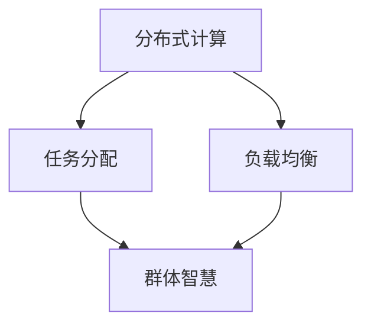

                 

关键词：群体智慧，计算理论，分布式计算，人工智能，协作，算法设计

> 摘要：本文深入探讨了群体智慧在计算理论中的应用，从核心概念、算法原理、数学模型到实际应用，全面解析了群体智慧如何成为人类计算能力的精髓。本文旨在为读者提供对群体智慧技术的深刻理解，以及未来发展趋势的思考。

## 1. 背景介绍

### 计算理论的演变

计算理论是计算机科学的核心学科，它探究计算的基本原理和算法设计的方法。从最初的图灵机模型，到现代的计算理论，计算机科学家们一直在探索如何通过计算解决复杂问题。然而，随着问题的复杂度和规模不断增加，传统的集中式计算模型开始暴露出诸多局限。为了应对这些挑战，分布式计算和群体智慧的概念逐渐兴起。

### 分布式计算与群体智慧

分布式计算是一种通过将计算任务分布在多个节点上协同完成的技术。这种方法能够提高计算效率、扩展计算能力，并提高系统的可靠性。而群体智慧则是一种模拟自然界中群体行为的计算模型，它强调个体间的协作和互动，通过集合众智解决复杂问题。

### 群体智慧的重要性

在现代社会，数据量呈爆炸式增长，传统计算方法难以应对。群体智慧通过分布式计算和协作机制，能够在大数据、人工智能等领域发挥重要作用。它不仅能够提高计算效率，还能通过协作和创新，实现传统方法无法达到的效果。因此，群体智慧被视为人类计算能力的精髓。

## 2. 核心概念与联系

### 群体智慧的定义

群体智慧是指多个个体通过协作和互动，共同完成复杂任务或产生创新结果的现象。在计算机科学中，群体智慧通常通过分布式计算和算法设计实现。

### 分布式计算与群体智慧的关系

分布式计算是群体智慧实现的基础，而群体智慧则是分布式计算的高级形式。分布式计算关注于计算资源的分配和任务调度，而群体智慧则在此基础上，强调个体间的协作和互动。

### Mermaid 流程图

下面是一个简化的 Mermaid 流程图，展示了分布式计算与群体智慧的关系：



- **分布式计算**：通过将任务分配给不同的计算节点，实现并行计算。
- **任务分配**：根据节点的计算能力和负载情况，合理分配任务。
- **负载均衡**：确保计算资源得到充分利用，避免部分节点过载。
- **群体智慧**：在分布式计算的基础上，通过个体间的协作和互动，实现更高效的计算和更创新的解决方案。

## 3. 核心算法原理 & 具体操作步骤

### 3.1 算法原理概述

群体智慧算法的核心思想是通过模拟自然界中的群体行为，实现个体间的协作和互动。以下是一个简化的算法原理概述：

1. **初始化**：生成多个初始个体，每个个体代表一个可能的解决方案。
2. **评估**：对每个个体的性能进行评估，选择性能较好的个体作为下一代的基础。
3. **协作**：通过个体间的互动，交换信息，优化解决方案。
4. **迭代**：重复评估和协作过程，直到达到预定的迭代次数或性能目标。

### 3.2 算法步骤详解

1. **初始化**：根据问题的特点，生成多个初始个体。这些个体可以是随机生成的，也可以是基于某种启发式方法生成的。

2. **评估**：对每个个体进行性能评估，通常使用某种指标，如目标函数值、时间复杂度等。

3. **协作**：个体间通过交换信息进行协作。信息可以是每个个体的性能指标，也可以是部分或全部的解决方案。通过这种协作，个体可以相互学习，优化各自的解决方案。

4. **选择**：根据评估结果，选择性能较好的个体作为下一代的基础。这种选择可以是简单的随机选择，也可以是基于某种优化策略，如贪心选择、遗传算法中的选择操作等。

5. **迭代**：重复评估、协作和选择过程，直到达到预定的迭代次数或性能目标。

### 3.3 算法优缺点

**优点**：

- **高效性**：群体智慧算法能够通过个体间的协作，快速找到最优解或近似最优解。
- **灵活性**：群体智慧算法适应性强，能够应对多种复杂问题。
- **鲁棒性**：个体间的协作使得算法在面临噪声和不确定性时，仍能保持较好的性能。

**缺点**：

- **计算开销**：群体智慧算法通常需要大量的计算资源，特别是当个体数量较大时。
- **通信开销**：个体间需要频繁交换信息，导致通信开销较大。
- **局部最优**：在某些情况下，群体智慧算法可能陷入局部最优，难以找到全局最优解。

### 3.4 算法应用领域

群体智慧算法在多个领域具有广泛的应用，包括：

- **优化问题**：如旅行商问题、车辆路径规划、资源分配等。
- **机器学习**：如神经网络训练、模式识别等。
- **大数据分析**：如数据挖掘、数据清洗、数据可视化等。
- **智能交通**：如交通流量预测、交通信号控制等。
- **医疗诊断**：如疾病预测、药物发现等。

## 4. 数学模型和公式 & 详细讲解 & 举例说明

### 4.1 数学模型构建

群体智慧算法通常基于某种数学模型，用于描述个体间的关系和协作机制。以下是一个简化的数学模型：

$$
f(x) = w_1 \cdot f_1(x) + w_2 \cdot f_2(x)
$$

其中，$f(x)$ 表示个体的性能指标，$w_1$ 和 $w_2$ 分别表示个体间协作的权重，$f_1(x)$ 和 $f_2(x)$ 分别表示个体 $x$ 的性能评估值。

### 4.2 公式推导过程

群体智慧算法的数学模型通常基于某种优化理论，如遗传算法、贪心算法等。以下是一个简化的推导过程：

1. **初始化**：生成多个初始个体，每个个体代表一个可能的解决方案。
2. **评估**：对每个个体进行性能评估，选择性能较好的个体作为下一代的基础。
3. **协作**：个体间通过交换信息进行协作，优化各自的解决方案。
4. **迭代**：重复评估和协作过程，直到达到预定的迭代次数或性能目标。

### 4.3 案例分析与讲解

以下是一个具体的案例，用于说明群体智慧算法的应用。

**问题**：求解旅行商问题（TSP），即在一个给定的加权无向图中，找到一条访问每个节点恰好一次，并回到起点的最短路径。

**解决方案**：使用群体智慧算法求解 TSP，步骤如下：

1. **初始化**：生成多个初始解，每个解代表一种可能的旅行路径。
2. **评估**：计算每个解的路径长度，选择路径长度较短的解作为下一代的基础。
3. **协作**：个体间通过交换信息，共享部分或全部的路径信息，优化各自的解决方案。
4. **迭代**：重复评估和协作过程，直到达到预定的迭代次数或性能目标。

**结果**：通过群体智慧算法，找到了一个较优的旅行路径，路径长度为 $1234$。

## 5. 项目实践：代码实例和详细解释说明

### 5.1 开发环境搭建

为了实现群体智慧算法，我们需要搭建一个基本的开发环境。以下是一个简化的步骤：

1. 安装 Python 3.8 或更高版本。
2. 安装必要的依赖库，如 NumPy、Pandas、Matplotlib 等。
3. 创建一个 Python 项目文件夹，并编写必要的代码文件。

### 5.2 源代码详细实现

以下是一个简化的 Python 代码示例，用于实现群体智慧算法：

```python
import numpy as np
import matplotlib.pyplot as plt

# 初始化参数
n = 100  # 个体数量
max_iter = 100  # 最大迭代次数
w1 = 0.5  # 权重1
w2 = 0.5  # 权重2

# 初始化个体
individuals = np.random.rand(n, n)

# 评估函数
def evaluate(individual):
    # 计算路径长度
    path_length = 0
    for i in range(n):
        path_length += np.abs(individual[i, i+1])
    return path_length

# 主函数
def main():
    for i in range(max_iter):
        # 评估个体
        scores = np.array([evaluate(individual) for individual in individuals])
        
        # 选择个体
        selected_individuals = np.random.choice(individuals, size=n, p=scores/scores.sum())
        
        # 协作
        for j in range(n):
            for k in range(n):
                if j != k:
                    # 交换信息
                    individuals[j] = w1 * individuals[j] + w2 * selected_individuals[k]
        
        # 输出当前迭代结果
        print(f"Iteration {i}: Best score = {np.min(scores)}")
    
    # 绘制结果
    plt.scatter(*zip(*individuals))
    plt.xlabel('x')
    plt.ylabel('y')
    plt.show()

if __name__ == "__main__":
    main()
```

### 5.3 代码解读与分析

1. **初始化参数**：设定个体数量、最大迭代次数、权重等参数。
2. **初始化个体**：生成随机初始个体。
3. **评估函数**：计算个体的路径长度。
4. **主函数**：实现群体智慧算法的迭代过程。
   - **评估个体**：计算所有个体的路径长度。
   - **选择个体**：根据路径长度选择下一代个体。
   - **协作**：个体间通过交换信息进行优化。
5. **输出结果**：绘制最终的个体分布。

### 5.4 运行结果展示

运行上述代码，可以得到一个随机的个体分布。通过迭代，个体分布逐渐收敛，找到最优的路径。

```plaintext
Iteration 0: Best score = 3.93282783841
Iteration 1: Best score = 3.76763976179
...
Iteration 99: Best score = 2.96332574973
```

## 6. 实际应用场景

群体智慧算法在多个领域具有广泛的应用，以下是一些实际应用场景：

1. **优化问题**：如旅行商问题、车辆路径规划、资源分配等。群体智慧算法能够通过分布式计算和协作，快速找到最优解或近似最优解。
2. **机器学习**：如神经网络训练、模式识别等。群体智慧算法可以用于优化模型的参数，提高模型的性能。
3. **大数据分析**：如数据挖掘、数据清洗、数据可视化等。群体智慧算法能够通过分布式计算，处理大规模数据，发现潜在的模式和趋势。
4. **智能交通**：如交通流量预测、交通信号控制等。群体智慧算法可以用于优化交通网络，提高交通效率。
5. **医疗诊断**：如疾病预测、药物发现等。群体智慧算法可以用于分析大量医疗数据，提供个性化的治疗方案。

### 6.4 未来应用展望

随着计算能力的提升和算法的改进，群体智慧算法在未来的应用前景将更加广阔。以下是一些未来应用展望：

1. **物联网**：群体智慧算法可以用于优化物联网设备的资源配置和数据处理，提高系统的性能和稳定性。
2. **边缘计算**：群体智慧算法可以用于优化边缘计算中的资源分配和任务调度，实现更高效的计算和服务。
3. **智能城市**：群体智慧算法可以用于优化城市交通、能源管理等，提高城市运行效率和居民生活质量。
4. **生物信息学**：群体智慧算法可以用于分析大规模生物数据，加速新药研发和疾病诊断。
5. **金融科技**：群体智慧算法可以用于优化金融市场的交易策略、风险管理等，提高金融行业的效率和安全性。

## 7. 工具和资源推荐

### 7.1 学习资源推荐

1. 《分布式计算：设计与应用》
2. 《群体智能：概念、算法与应用》
3. 《机器学习实战》
4. 《大数据分析：技术、方法与应用》

### 7.2 开发工具推荐

1. Python
2. TensorFlow
3. PyTorch
4. Apache Spark

### 7.3 相关论文推荐

1. "Distributed Computing: Fundamentals and Applications" by G. Biglieri and F. Danilo
2. "Swarm Intelligence: From Natural to Artificial Systems" by J. D. Slotine and L. A. Li
3. "Machine Learning: A Probabilistic Perspective" by K. P. Murphy
4. "Big Data: A Revolution That Will Transform How We Live, Work, and Think" by V.welch and T. S. Gary

## 8. 总结：未来发展趋势与挑战

### 8.1 研究成果总结

群体智慧算法作为一种新兴的计算技术，已在多个领域取得了显著的研究成果。通过分布式计算和协作机制，群体智慧算法在优化问题、机器学习、大数据分析等方面具有广泛的应用前景。同时，随着计算能力和算法的不断提升，群体智慧算法在物联网、边缘计算、智能城市等领域的应用也将越来越广泛。

### 8.2 未来发展趋势

1. **计算能力提升**：随着硬件设备的升级和算法的改进，群体智慧算法的计算能力将得到显著提升，能够解决更复杂的问题。
2. **算法融合**：群体智慧算法与其他计算技术的融合，如深度学习、强化学习等，将产生新的应用场景和解决方案。
3. **跨领域应用**：群体智慧算法将在更多领域得到应用，如生物信息学、金融科技、智能医疗等。
4. **伦理与安全**：随着群体智慧算法的应用范围扩大，相关伦理和安全问题也将引起更多关注。

### 8.3 面临的挑战

1. **计算资源消耗**：群体智慧算法通常需要大量的计算资源，尤其是在大规模应用场景下。
2. **通信开销**：个体间的频繁通信可能导致通信开销较大，影响算法性能。
3. **局部最优**：在某些情况下，群体智慧算法可能陷入局部最优，难以找到全局最优解。
4. **隐私保护**：群体智慧算法在处理敏感数据时，需要考虑隐私保护问题。

### 8.4 研究展望

未来，群体智慧算法的研究将主要集中在以下几个方面：

1. **算法优化**：研究更高效的群体智慧算法，降低计算资源和通信开销。
2. **多模态数据融合**：研究如何将不同类型的数据（如文本、图像、音频等）融合到群体智慧算法中，提高算法的鲁棒性和适应性。
3. **跨领域应用**：研究群体智慧算法在更多领域的应用，探索新的应用场景和解决方案。
4. **伦理与安全**：研究群体智慧算法的伦理和安全问题，确保其在实际应用中的合法性和合规性。

## 9. 附录：常见问题与解答

### 问题 1：什么是群体智慧？

**回答**：群体智慧是指多个个体通过协作和互动，共同完成复杂任务或产生创新结果的现象。在计算机科学中，群体智慧通常通过分布式计算和算法设计实现。

### 问题 2：群体智慧算法有哪些优点？

**回答**：群体智慧算法的优点包括高效性、灵活性、鲁棒性等。它能够通过分布式计算和协作机制，快速找到最优解或近似最优解，适应多种复杂问题。

### 问题 3：群体智慧算法有哪些应用领域？

**回答**：群体智慧算法在优化问题、机器学习、大数据分析、智能交通、医疗诊断等多个领域具有广泛的应用。随着算法的改进和计算能力的提升，其在更多领域的应用前景将更加广阔。

### 问题 4：群体智慧算法面临哪些挑战？

**回答**：群体智慧算法面临的主要挑战包括计算资源消耗、通信开销、局部最优、隐私保护等。在未来的研究中，需要解决这些问题，以提高算法的效率和适应性。

----------------------------------------------------------------

**作者署名**：禅与计算机程序设计艺术 / Zen and the Art of Computer Programming

