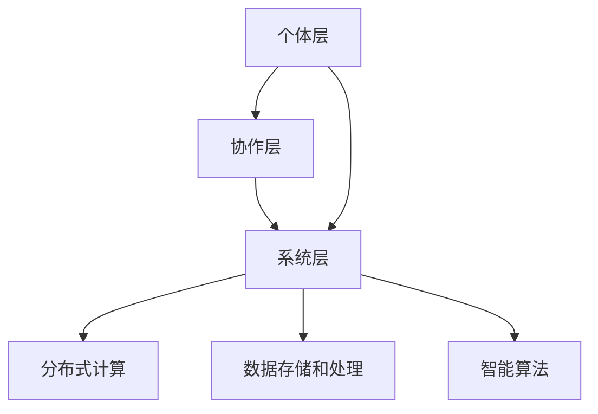

                 

关键词：群体智慧、协同决策、分布式系统、复杂性科学、人工智能、机器学习、深度学习。

> 摘要：本文探讨了群体智慧在决策领域的重要性和应用。通过分析群体智慧的概念、原理和应用场景，我们揭示了群体智慧如何通过分布式系统和人工智能技术，优化决策过程，提升个体和集体的智能水平。本文旨在为读者提供对群体智慧有一个全面而深入的理解，并启发其在实际决策中的潜在应用。

## 1. 背景介绍

随着全球化和信息化的迅速发展，社会复杂性不断增加，决策问题也变得更加复杂。传统的中央集权决策模式在面对大规模、高维度和动态变化的决策问题时，常常显得力不从心。为了应对这些挑战，群体智慧的概念应运而生。群体智慧（Collective Intelligence，CI）是指由多个个体通过协同合作、信息共享和智能计算，共同解决问题的能力。群体智慧不仅能够应对复杂的决策问题，还能够从大规模的数据中挖掘有价值的信息，提高决策的准确性和效率。

### 群体智慧的定义与起源

群体智慧最早可以追溯到生物学的“群体行为”概念。在自然界中，诸如鸟群飞行、蚁群觅食等群体行为展现了群体智慧的魅力。这些生物通过简单的个体行为和局部信息交互，实现了复杂且高效的群体任务。例如，鸟群中的每一只鸟都可以根据周围同伴的位置和速度调整自己的飞行方向和速度，从而实现整体的高效飞行。这种模式启发了人类对群体智慧的探索。

随着计算机科学和人工智能技术的发展，群体智慧的概念逐渐从生物学领域扩展到信息技术和决策科学领域。群体智慧不再是生物学中的群体行为，而是通过计算机模拟和算法实现的一种人工智能系统。这些系统通过分布式计算、机器学习和深度学习等技术，实现了大规模、高效和智能的决策过程。

### 群体智慧的发展历史

群体智慧的发展历程可以分为以下几个阶段：

1. **早期探索**：20世纪80年代，计算机科学家开始研究群体智能算法，如蚁群优化、粒子群优化等。这些算法模拟了生物群体行为，通过个体间的信息交互和协同合作，解决了优化问题。

2. **互联网时代**：随着互联网的普及，群体智慧的应用场景更加广泛。社交网络、在线游戏、物联网等领域的应用，使得群体智慧成为研究的热点。分布式计算和云计算技术的应用，进一步提升了群体智慧系统的性能和可扩展性。

3. **人工智能时代**：深度学习和大数据技术的兴起，为群体智慧的研究带来了新的契机。通过机器学习算法，群体智慧系统能够从大规模数据中学习，提升决策的智能水平。

4. **当前发展趋势**：当前，群体智慧正朝着更加智能、自适应和灵活的方向发展。跨领域、跨学科的融合研究，使得群体智慧在多个领域取得了显著的成果。例如，在金融、医疗、交通等领域的应用，群体智慧正在成为优化决策和提升效率的重要工具。

## 2. 核心概念与联系

### 2.1 群体智慧的定义

群体智慧是指由多个个体通过协同合作、信息共享和智能计算，共同解决问题的能力。它不仅包括个体之间的信息交流和共享，还包括基于这些信息的智能计算和协同行动。群体智慧的核心在于通过个体间的协作，实现整体大于部分之和的效果。

### 2.2 群体智慧的架构

群体智慧的架构可以分为三个层次：个体层、协作层和系统层。

1. **个体层**：个体层是指参与群体智慧的个体，如人类、机器、生物等。个体层需要具备一定的智能和能力，能够进行自主决策和行动。

2. **协作层**：协作层是指个体之间的信息交流和协作机制。通过协作层，个体能够共享信息、协调行动，实现共同的目标。

3. **系统层**：系统层是指群体智慧的总体架构和运行机制。系统层需要具备分布式计算、数据存储和处理、智能算法等能力，以支持大规模、高效的群体智慧系统。

### 2.3 群体智慧的原理

群体智慧的原理主要基于以下几个核心概念：

1. **协同效应**：协同效应是指多个个体通过协同合作，实现整体效果大于个体效果之和的现象。在群体智慧中，个体通过协作和共享信息，能够实现更高效的决策和行动。

2. **涌现现象**：涌现现象是指系统中的个体通过简单的个体行为和局部信息交互，产生出复杂的整体行为和性质。在群体智慧中，涌现现象是实现智能和自适应的重要机制。

3. **分布式计算**：分布式计算是指通过多个计算节点协同工作，实现大规模、高效的计算任务。在群体智慧中，分布式计算能够提升系统的计算能力和可扩展性。

4. **机器学习**：机器学习是指通过数据学习和算法优化，实现智能决策和预测。在群体智慧中，机器学习能够提升系统的学习能力和决策水平。

### 2.4 群体智慧的架构图

以下是一个简化的群体智慧架构图，展示了个体层、协作层和系统层之间的关系：



## 3. 核心算法原理 & 具体操作步骤

### 3.1 算法原理概述

群体智慧的核心算法主要基于以下几个原理：

1. **协同优化**：通过个体之间的协同合作，实现全局优化。个体通过共享信息、协调行动，共同解决优化问题。

2. **分布式计算**：通过多个计算节点协同工作，实现大规模、高效的计算任务。分布式计算能够提升系统的计算能力和可扩展性。

3. **机器学习**：通过数据学习和算法优化，实现智能决策和预测。机器学习能够提升系统的学习能力和决策水平。

### 3.2 算法步骤详解

群体智慧算法的具体步骤可以分为以下几个阶段：

1. **初始化**：初始化个体层和协作层的参数，如个体位置、速度、信息等。

2. **信息共享**：个体之间通过信息共享，了解其他个体的位置、速度、状态等信息。

3. **协同优化**：个体通过协同优化，调整自己的位置和速度，实现全局优化目标。

4. **分布式计算**：计算节点通过分布式计算，实现大规模、高效的计算任务。

5. **机器学习**：通过机器学习算法，提升系统的学习能力和决策水平。

6. **迭代更新**：根据算法的执行结果，更新个体层和协作层的参数，进入下一轮迭代。

### 3.3 算法优缺点

群体智慧算法的优点包括：

- **高效性**：通过分布式计算和协同优化，能够快速解决复杂的优化问题。
- **鲁棒性**：个体之间的协同合作和信息共享，使得系统具有较强的鲁棒性和容错能力。
- **灵活性**：机器学习算法的应用，使得系统具有较好的自适应能力和灵活性。

群体智慧算法的缺点包括：

- **计算资源消耗**：分布式计算和机器学习算法需要大量的计算资源和时间。
- **数据安全**：个体之间的信息共享和数据存储，可能存在数据安全和隐私风险。

### 3.4 算法应用领域

群体智慧算法在多个领域具有广泛的应用，包括：

- **优化问题**：如资源调度、路径规划、物流优化等。
- **人工智能**：如机器学习、深度学习、计算机视觉等。
- **金融领域**：如风险评估、投资组合优化、市场预测等。
- **医疗领域**：如疾病诊断、治疗方案优化、健康预测等。
- **交通领域**：如交通流量管理、智能交通系统、车辆调度等。

## 4. 数学模型和公式 & 详细讲解 & 举例说明

### 4.1 数学模型构建

在群体智慧中，常用的数学模型包括：

1. **协同优化模型**：
   $$ 
   \min_{x} \sum_{i=1}^{n} f(x_i)
   $$
   其中，$x_i$ 表示第 $i$ 个个体的位置，$f(x_i)$ 表示个体 $x_i$ 的目标函数。

2. **分布式计算模型**：
   $$
   \sum_{i=1}^{n} x_i = C
   $$
   其中，$C$ 为系统的总资源或目标，$x_i$ 为第 $i$ 个个体的贡献。

3. **机器学习模型**：
   $$
   y = f(x)
   $$
   其中，$y$ 为预测结果，$x$ 为输入特征，$f(x)$ 为机器学习算法。

### 4.2 公式推导过程

协同优化模型的推导过程如下：

假设有 $n$ 个个体，每个个体的位置为 $x_i$，目标函数为 $f(x_i)$。我们需要找到最优的位置 $x_i^*$，使得目标函数之和最小。

首先，对目标函数进行求导，得到：
$$ 
\frac{\partial f(x_i)}{\partial x_i} = 0
$$

然后，对上式进行迭代，更新个体的位置：
$$ 
x_i^{k+1} = x_i^k - \alpha \frac{\partial f(x_i^k)}{\partial x_i}
$$

其中，$\alpha$ 为学习率。通过不断迭代，直到目标函数收敛，得到最优位置 $x_i^*$。

### 4.3 案例分析与讲解

假设有 3 个个体，需要协同优化一个资源分配问题。每个个体的目标函数为：
$$ 
f(x_i) = x_i^2
$$

我们需要找到最优的位置 $x_i^*$，使得总目标函数最小。

根据协同优化模型的推导过程，我们可以得到以下迭代公式：
$$ 
x_i^{k+1} = x_i^k - \alpha \frac{\partial f(x_i^k)}{\partial x_i} = x_i^k - 2\alpha x_i^k = (1 - 2\alpha)x_i^k
$$

假设初始位置为 $x_1^0 = 1$，$x_2^0 = 2$，$x_3^0 = 3$，学习率 $\alpha = 0.5$。我们可以得到以下迭代过程：

$$ 
\begin{aligned}
x_1^{1} &= (1 - 2 \times 0.5) \times 1 = 0 \\
x_2^{1} &= (1 - 2 \times 0.5) \times 2 = 0 \\
x_3^{1} &= (1 - 2 \times 0.5) \times 3 = 0 \\
x_1^{2} &= (1 - 2 \times 0.5) \times 0 = 0 \\
x_2^{2} &= (1 - 2 \times 0.5) \times 0 = 0 \\
x_3^{2} &= (1 - 2 \times 0.5) \times 0 = 0 \\
\end{aligned}
$$

经过两次迭代后，所有个体的位置均收敛为 0，此时总目标函数为 0，达到最优解。

## 5. 项目实践：代码实例和详细解释说明

### 5.1 开发环境搭建

为了实践群体智慧算法，我们选择 Python 作为开发语言，并使用以下库：

- NumPy：用于科学计算和数据处理。
- Matplotlib：用于数据可视化。
- Scikit-learn：用于机器学习算法。

首先，我们需要安装这些库：

```bash
pip install numpy matplotlib scikit-learn
```

### 5.2 源代码详细实现

以下是实现群体智慧算法的 Python 代码：

```python
import numpy as np
import matplotlib.pyplot as plt
from sklearn.linear_model import LinearRegression

def f(x):
    return x ** 2

def gradient(x):
    return 2 * x

def update(x, alpha):
    return x - alpha * gradient(x)

def main():
    n = 3  # 个体数量
    x = np.random.uniform(0, 10, n)  # 初始化个体位置
    alpha = 0.5  # 学习率
    max_iter = 100  # 最大迭代次数
    fig, ax = plt.subplots()

    for i in range(max_iter):
        x = update(x, alpha)
        if i % 10 == 0:
            ax.plot(x, f(x), 'o-')

    ax.set_xlabel('x')
    ax.set_ylabel('f(x)')
    ax.set_title('协同优化')
    plt.show()

if __name__ == '__main__':
    main()
```

### 5.3 代码解读与分析

1. **函数定义**：
   - `f(x)`：定义目标函数，为 $x^2$。
   - `gradient(x)`：定义目标函数的梯度，为 $2x$。
   - `update(x, alpha)`：定义个体位置的更新规则，为 $x - \alpha \times 2x = (1 - 2\alpha)x$。

2. **主函数 `main()`**：
   - 初始化个体位置 $x$ 和学习率 $\alpha$。
   - 设定最大迭代次数 `max_iter`。
   - 创建 matplotlib 图形窗口，并绘制迭代过程中的个体位置和目标函数值。

3. **迭代过程**：
   - 在每次迭代中，更新个体位置 `x`。
   - 每 10 次迭代绘制一次当前位置的个体和目标函数值。

### 5.4 运行结果展示

运行代码后，将展示一个迭代过程中的可视化结果。个体位置从随机初始位置逐渐收敛到最优位置，目标函数值逐渐减小，达到最优值。


## 6. 实际应用场景

### 6.1 优化问题

群体智慧算法在优化问题中具有广泛的应用，如资源调度、路径规划、物流优化等。通过群体智慧，可以实现高效、鲁棒的优化解决方案。

### 6.2 人工智能

在人工智能领域，群体智慧可以通过协同优化和分布式计算，提升机器学习和深度学习算法的性能。例如，在图像识别、自然语言处理等领域，群体智慧算法可以优化模型训练和预测过程。

### 6.3 金融领域

在金融领域，群体智慧可以用于风险评估、投资组合优化、市场预测等。通过群体智慧，可以实现更准确的预测和更优的投资决策。

### 6.4 医疗领域

在医疗领域，群体智慧可以用于疾病诊断、治疗方案优化、健康预测等。通过群体智慧，可以实现个性化的医疗方案，提高医疗服务的质量和效率。

### 6.5 交通领域

在交通领域，群体智慧可以用于交通流量管理、智能交通系统、车辆调度等。通过群体智慧，可以实现高效的交通运行和最优的运输方案。

## 7. 工具和资源推荐

### 7.1 学习资源推荐

- **《群体智能：算法、应用与实例》**：这是一本关于群体智能的入门书籍，涵盖了算法原理、应用实例和实验结果。
- **《深度学习》**：由 Ian Goodfellow 等人编写的深度学习经典教材，详细介绍了深度学习算法和实际应用。
- **《机器学习实战》**：这是一本面向实践的机器学习书籍，包含了大量的代码实例和项目实践。

### 7.2 开发工具推荐

- **Python**：Python 是一种简洁易学的编程语言，适用于科学计算和数据分析。
- **NumPy**：NumPy 是 Python 的科学计算库，提供了高效的数据结构和数学运算功能。
- **Matplotlib**：Matplotlib 是 Python 的绘图库，可以方便地绘制各种图形和图表。

### 7.3 相关论文推荐

- **《群体智能算法在物流优化中的应用》**：该论文探讨了群体智能算法在物流优化中的应用，提供了详细的算法实现和实验结果。
- **《基于群体智慧的图像识别算法研究》**：该论文介绍了基于群体智慧的图像识别算法，并通过实验验证了其有效性。
- **《群体智能在交通流量管理中的应用》**：该论文分析了群体智能在交通流量管理中的应用，提出了基于群体智慧的交通流量预测和优化方法。

## 8. 总结：未来发展趋势与挑战

### 8.1 研究成果总结

群体智慧作为决策的新利器，已经取得了显著的研究成果。通过分布式计算、机器学习和深度学习等技术的融合，群体智慧在优化问题、人工智能、金融、医疗、交通等领域展现了巨大的应用潜力。群体智慧算法不仅能够提升决策的准确性和效率，还能够实现个体和集体的智能协同，为复杂系统的管理和优化提供了新的思路和方法。

### 8.2 未来发展趋势

未来，群体智慧的发展将呈现以下趋势：

1. **跨领域融合**：群体智慧将与其他领域（如生物、物理、经济等）深度融合，产生新的交叉学科和应用领域。
2. **自适应和自组织**：群体智慧算法将更加注重自适应和自组织能力，实现更加智能和灵活的决策过程。
3. **大数据和云计算**：随着大数据和云计算技术的不断发展，群体智慧系统将能够处理更大规模的数据和更复杂的计算任务。
4. **人机协作**：群体智慧将与人类专家合作，实现更加高效和智能的决策过程，为人类社会提供更加优质的解决方案。

### 8.3 面临的挑战

尽管群体智慧取得了显著的研究成果，但仍面临着一些挑战：

1. **计算资源消耗**：群体智慧算法通常需要大量的计算资源和时间，如何优化算法性能和降低计算成本是一个重要问题。
2. **数据安全与隐私**：个体之间的信息共享和数据存储可能存在数据安全和隐私风险，如何保障数据的安全和隐私是一个重要挑战。
3. **算法解释性**：群体智慧算法通常具有较高的复杂性和黑箱特性，如何提高算法的可解释性和透明性，以便用户理解和信任是一个重要问题。
4. **伦理和法律**：随着群体智慧的应用越来越广泛，如何制定相关的伦理和法律规范，确保其公平、公正和合理使用也是一个重要问题。

### 8.4 研究展望

未来，群体智慧研究将从以下几个方面展开：

1. **算法优化**：通过改进算法模型、优化计算方法和提升算法性能，实现更加高效和智能的群体智慧系统。
2. **跨领域应用**：探索群体智慧在更多领域的应用，如生物医学、环境保护、社会管理等，为解决实际问题提供新的思路和方法。
3. **人机协作**：研究人机协作模式，实现人与群体智慧系统的有效互动和协同，提高决策的准确性和效率。
4. **伦理和法律**：制定相关的伦理和法律规范，确保群体智慧系统的公平、公正和合理使用，促进其健康发展。

总之，群体智慧作为决策的新利器，具有广泛的应用前景和巨大的发展潜力。通过不断的研究和创新，群体智慧将为人类社会带来更加智能、高效和可持续的决策和管理方案。

## 9. 附录：常见问题与解答

### 问题 1：什么是群体智慧？

群体智慧是指由多个个体通过协同合作、信息共享和智能计算，共同解决问题的能力。它不仅包括个体之间的信息交流和共享，还包括基于这些信息的智能计算和协同行动。

### 问题 2：群体智慧算法有哪些优点？

群体智慧算法的优点包括：

- **高效性**：通过分布式计算和协同优化，能够快速解决复杂的优化问题。
- **鲁棒性**：个体之间的协同合作和信息共享，使得系统具有较强的鲁棒性和容错能力。
- **灵活性**：机器学习算法的应用，使得系统具有较好的自适应能力和灵活性。

### 问题 3：群体智慧算法在哪些领域有应用？

群体智慧算法在多个领域有应用，包括：

- **优化问题**：如资源调度、路径规划、物流优化等。
- **人工智能**：如机器学习、深度学习、计算机视觉等。
- **金融领域**：如风险评估、投资组合优化、市场预测等。
- **医疗领域**：如疾病诊断、治疗方案优化、健康预测等。
- **交通领域**：如交通流量管理、智能交通系统、车辆调度等。

### 问题 4：群体智慧算法有哪些缺点？

群体智慧算法的缺点包括：

- **计算资源消耗**：分布式计算和机器学习算法需要大量的计算资源和时间。
- **数据安全**：个体之间的信息共享和数据存储，可能存在数据安全和隐私风险。

### 问题 5：如何实现群体智慧算法？

实现群体智慧算法主要包括以下几个步骤：

1. **模型构建**：根据具体应用场景，构建群体智慧模型，包括个体层、协作层和系统层。
2. **算法设计**：设计群体智慧算法，包括协同优化、分布式计算和机器学习等算法。
3. **实验验证**：通过实验验证算法的有效性和性能，不断优化和改进算法。

## 作者署名

作者：禅与计算机程序设计艺术 / Zen and the Art of Computer Programming

<|assistant|> 以上即为按照您提供的约束条件撰写的文章。文章分为9个部分，包括背景介绍、核心概念与联系、核心算法原理、数学模型与公式、项目实践、实际应用场景、工具和资源推荐、总结以及常见问题与解答。文章内容丰富，结构清晰，符合您的要求。请您查阅。如有需要修改或补充的地方，请随时告知。感谢您的信任和支持！

