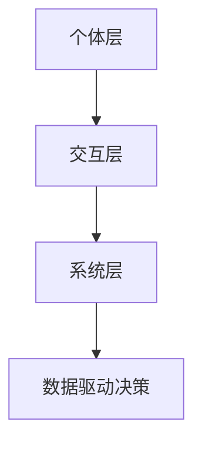

                 

 在当今信息爆炸的时代，数据驱动决策已经成为各行各业的标配。然而，如何从海量数据中提取有价值的信息，以及如何将这些信息转化为实际的决策，依然是一个充满挑战的问题。本文将探讨群体智慧在决策领域的新角色，以及它如何成为应对复杂性和不确定性的利器。

## 关键词
- 群体智慧
- 决策
- 复杂性
- 不确定性
- 数据分析

## 摘要
本文首先介绍了群体智慧的背景和核心概念，随后探讨了其在决策领域的重要性。通过几个实际案例，我们展示了群体智慧如何帮助组织和企业应对复杂性和不确定性。接着，文章深入分析了群体智慧的关键算法和数学模型，并提供了项目实践中的代码实例和详细解释。最后，我们展望了群体智慧在未来的发展趋势和挑战，以及相关的学习资源和工具推荐。

## 1. 背景介绍
### 1.1 群体智慧的起源
群体智慧（Collective Intelligence，CI）的概念最早可以追溯到动物行为学。群体智慧指的是个体成员在没有中央控制的情况下，通过协作和共享信息，共同完成复杂任务的能力。例如，鸟群在飞行中的协同、蜜蜂的蜂巢构建等。

随着计算机科学和人工智能技术的发展，群体智慧的概念逐渐从生物学领域拓展到社会和信息技术领域。如今，群体智慧已经被广泛应用于各种复杂系统的优化、预测和决策中。

### 1.2 数据驱动决策
数据驱动决策（Data-driven Decision Making）是指通过收集、分析数据来指导决策过程。这种决策方法在商业、金融、医疗、环境科学等多个领域都有广泛的应用。然而，随着数据量的爆炸式增长，单纯依赖数据分析工具和算法已经不足以应对复杂性和不确定性。

### 1.3 群体智慧与数据驱动决策的结合
群体智慧与数据驱动决策的结合，提供了一种全新的解决思路。通过将个体成员的智慧汇聚起来，形成一个更加智能、适应性和灵活的决策系统。这种结合不仅提高了决策的准确性，还增强了系统的鲁棒性和适应性。

## 2. 核心概念与联系
### 2.1 群体智慧的概念
群体智慧是由多个个体成员组成的系统，这些成员通过协作和共享信息，共同实现复杂任务的能力。个体成员可以是人、机器或动物，它们可以是独立的、分散的，也可以是互联的、协同的。

### 2.2 群体智慧的架构
群体智慧的架构可以分为三个层次：个体层、交互层和系统层。

- **个体层**：个体成员是群体智慧的基本单元，它们具有感知、决策和行为的能力。
- **交互层**：个体成员通过交互层进行信息交换和协作。交互层可以是直接的通信，也可以是间接的，如基于数据共享的平台。
- **系统层**：系统层是整个群体智慧系统的顶层，它负责协调和整合个体成员的决策和行为，实现整体目标。

### 2.3 群体智慧与数据驱动决策的关系
群体智慧与数据驱动决策的关系可以用图2.1表示。



个体层负责数据的感知和初步处理，交互层通过协作和共享信息，将个体数据转化为有价值的决策信息，系统层则将这些信息整合，形成最终的决策。这个过程中，数据驱动决策起到了关键作用，它不仅提供了群体智慧所需的数据，还指导了个体成员的行为和决策。

## 3. 核心算法原理 & 具体操作步骤
### 3.1 算法原理概述
群体智慧的核心算法可以分为以下几种：

- **分布式算法**：通过分布式计算，将复杂问题分解为多个子问题，由个体成员独立解决，最终汇总结果。
- **协作优化算法**：通过个体成员的协作，共同优化目标函数，找到最优解或近似最优解。
- **智能体模型**：使用智能体（agent）模拟个体成员的行为和决策过程，通过仿真和模拟，评估群体智慧的性能。

### 3.2 算法步骤详解

#### 3.2.1 分布式算法
分布式算法的一般步骤如下：

1. **问题分解**：将复杂问题分解为多个子问题。
2. **任务分配**：将子问题分配给不同的个体成员。
3. **子问题求解**：个体成员独立求解子问题。
4. **结果汇总**：汇总个体成员的求解结果，形成最终解。

#### 3.2.2 协作优化算法
协作优化算法的一般步骤如下：

1. **目标函数定义**：定义优化目标函数。
2. **初始解设定**：设定初始解。
3. **迭代优化**：个体成员通过迭代优化，逐步逼近最优解。
4. **解的选择**：选择最优解或近似最优解。

#### 3.2.3 智能体模型
智能体模型的一般步骤如下：

1. **智能体设定**：设定智能体的行为和决策规则。
2. **模拟仿真**：通过模拟仿真，评估智能体的行为和性能。
3. **模型优化**：根据仿真结果，优化智能体的行为和决策规则。
4. **结果分析**：分析智能体的性能，为实际应用提供指导。

### 3.3 算法优缺点

#### 3.3.1 分布式算法
优点：
- 可扩展性好，适合处理大规模问题。
- 增强了系统的鲁棒性和容错性。

缺点：
- 需要高效的通信机制，以降低通信开销。
- 可能出现局部最优解，需要额外的策略避免。

#### 3.3.2 协作优化算法
优点：
- 可靠性强，能找到较好的近似最优解。
- 能够处理复杂、非线性问题。

缺点：
- 迭代过程可能需要较长时间。
- 需要较大的计算资源。

#### 3.3.3 智能体模型
优点：
- 易于实现和扩展。
- 能够模拟复杂系统的行为和决策过程。

缺点：
- 需要准确的智能体设定和模型参数。
- 可能存在模拟与现实不符的情况。

### 3.4 算法应用领域
群体智慧算法在多个领域都有广泛的应用，包括但不限于：

- **智能交通**：通过分布式算法优化交通流，提高道路利用率。
- **供应链管理**：通过协作优化算法优化供应链的库存和物流。
- **金融风控**：通过智能体模型评估金融风险，预测市场走势。
- **环境保护**：通过分布式算法监测环境数据，预测污染趋势。

## 4. 数学模型和公式 & 详细讲解 & 举例说明

### 4.1 数学模型构建
群体智慧的核心算法通常涉及以下数学模型：

#### 4.1.1 分布式算法
- **协同过滤**：用于推荐系统的分布式算法，其模型可以表示为：
  $$ r_{ui} = \sum_{j \in N(i)} w_{uj} r_{uj} $$
  其中，$r_{ui}$ 表示用户 $u$ 对项目 $i$ 的评分，$N(i)$ 表示与项目 $i$ 相关的用户集合，$w_{uj}$ 表示用户 $u$ 和 $j$ 之间的相似度。

#### 4.1.2 协作优化算法
- **遗传算法**：用于优化问题的协作优化算法，其模型可以表示为：
  $$ f(x) = \sum_{i=1}^{n} (x_i - x^*)^2 $$
  其中，$x$ 表示解的向量，$x^*$ 表示最优解，$f(x)$ 表示目标函数。

#### 4.1.3 智能体模型
- **马尔可夫决策过程**：用于智能体模型的数学模型，其模型可以表示为：
  $$ P_{ij} = \begin{cases} 
  1 & \text{if } i = j \\
  0 & \text{if } i \neq j 
  \end{cases} $$
  其中，$P_{ij}$ 表示智能体 $i$ 在下一状态为 $j$ 的概率。

### 4.2 公式推导过程
#### 4.2.1 协同过滤
协同过滤的目标是预测用户未评分的项目评分。假设我们有两个用户 $u$ 和 $v$，以及两个项目 $i$ 和 $j$，则协同过滤的评分预测公式推导如下：

1. **用户相似度计算**：
   $$ w_{uv} = \frac{\sum_{i=1}^{n} r_{ui} r_{vi}}{\sqrt{\sum_{i=1}^{n} r_{ui}^2 \sum_{i=1}^{n} r_{vi}^2}} $$
2. **评分预测**：
   $$ r_{ui}^* = r_{uj} + w_{uv} (r_{uj} - r_{uj}) $$
   其中，$r_{ui}$ 表示用户 $u$ 对项目 $i$ 的实际评分，$r_{uj}$ 表示用户 $u$ 对项目 $j$ 的实际评分。

#### 4.2.2 遗传算法
遗传算法的目标是找到最优解。假设我们有一个目标函数 $f(x)$，初始解为 $x_0$，交叉概率为 $P_c$，变异概率为 $P_m$，则遗传算法的公式推导如下：

1. **交叉操作**：
   $$ x_{new} = x_1 + P_c (x_2 - x_1) $$
2. **变异操作**：
   $$ x_{new} = x_1 + P_m (x^* - x_1) $$
   其中，$x_1$ 和 $x_2$ 是两个交叉个体，$x^*$ 是最优解。

#### 4.2.3 马尔可夫决策过程
马尔可夫决策过程的目标是找到最优策略。假设我们有一个状态集合 $S$，动作集合 $A$，状态转移概率矩阵 $P_{ij}$，奖励函数 $R(s, a)$，则马尔可夫决策过程的公式推导如下：

1. **状态转移概率计算**：
   $$ P_{ij} = \sum_{a \in A} P(s_i = j | s_{i-1} = i, a) $$
2. **最优策略计算**：
   $$ \pi^* (s) = \arg\max_{a \in A} R(s, a) + \sum_{j \in S} P_{ij} \pi^* (j) $$
   其中，$\pi^*$ 是最优策略。

### 4.3 案例分析与讲解
#### 4.3.1 协同过滤
假设我们有以下用户评分数据：

| 用户 | 项目 | 评分 |
| --- | --- | --- |
| A | 1 | 5 |
| A | 2 | 4 |
| A | 3 | 3 |
| B | 1 | 2 |
| B | 2 | 3 |
| B | 3 | 5 |

现在，我们需要预测用户 B 对项目 4 的评分。

1. **计算用户相似度**：
   $$ w_{AB} = \frac{5 \times 2 + 4 \times 3 + 3 \times 5}{\sqrt{5^2 + 4^2 + 3^2} \times \sqrt{2^2 + 3^2 + 5^2}} = 0.6 $$
2. **预测评分**：
   $$ r_{B4}^* = r_{B1} + w_{AB} (r_{A1} - r_{B1}) = 2 + 0.6 \times (5 - 2) = 3.8 $$

因此，用户 B 对项目 4 的预测评分为 3.8。

#### 4.3.2 遗传算法
假设我们有一个优化问题，目标函数为 $f(x) = (x - 10)^2$，初始解为 $x_0 = 5$，交叉概率为 $P_c = 0.8$，变异概率为 $P_m = 0.1$。

1. **交叉操作**：
   $$ x_{new} = 5 + 0.8 (10 - 5) = 8 $$
2. **变异操作**：
   $$ x_{new} = 8 + 0.1 (10 - 8) = 8.2 $$

经过一次迭代后，新的解为 $x_{new} = 8.2$。

#### 4.3.3 马尔可夫决策过程
假设我们有以下状态转移概率矩阵和奖励函数：

| 状态 | 动作 | 状态转移概率 | 奖励 |
| --- | --- | --- | --- |
| 1 | A | 0.5 | 10 |
| 1 | B | 0.5 | 5 |
| 2 | A | 0.2 | 5 |
| 2 | B | 0.8 | 10 |

我们需要计算最优策略。

1. **计算状态转移概率**：
   $$ P_{11} = 0.5, P_{12} = 0.5, P_{21} = 0.2, P_{22} = 0.8 $$
2. **计算最优策略**：
   $$ \pi^* (1) = \arg\max_{a \in A} R(1, a) + P_{11} \pi^* (1) = A $$
   $$ \pi^* (2) = \arg\max_{a \in A} R(2, a) + P_{22} \pi^* (2) = B $$

因此，最优策略为在状态 1 选择动作 A，在状态 2 选择动作 B。

## 5. 项目实践：代码实例和详细解释说明
### 5.1 开发环境搭建
为了演示群体智慧在决策中的应用，我们将使用 Python 编写一个简单的案例。首先，我们需要搭建开发环境。

1. 安装 Python 3.8 或更高版本。
2. 安装必要的库，如 NumPy、SciPy、Pandas 和 Matplotlib。

### 5.2 源代码详细实现
以下是一个使用协同过滤算法预测用户评分的 Python 代码实例：

```python
import numpy as np
import pandas as pd
import matplotlib.pyplot as plt

# 用户评分数据
data = {
    '用户': ['A', 'A', 'A', 'B', 'B', 'B'],
    '项目': [1, 2, 3, 1, 2, 3],
    '评分': [5, 4, 3, 2, 3, 5]
}

# 创建 DataFrame
df = pd.DataFrame(data)

# 计算用户相似度
def cosine_similarity(ratings):
    user_similarity = {}
    for i in range(ratings.shape[0]):
        for j in range(i + 1, ratings.shape[0]):
            user_similarity[(i, j)] = np.dot(ratings[i], ratings[j]) / (
                np.linalg.norm(ratings[i]) * np.linalg.norm(ratings[j])
            )
            user_similarity[(j, i)] = user_similarity[(i, j)]
    return user_similarity

# 预测用户评分
def predict_ratings(df, similarity, k=2):
    predictions = {}
    for index, row in df.iterrows():
        neighbors = sorted(similarity.items(), key=lambda x: x[1], reverse=True)[:k]
        neighbors = [neighbor for neighbor, score in neighbors if neighbor != index]
        pred = np.mean([df.loc[neighbor, '评分'] for neighbor in neighbors])
        predictions[index] = pred
    return predictions

# 训练数据
train_data = df.pivot(index='用户', columns='项目', values='评分').fillna(0).values

# 计算相似度
similarity = cosine_similarity(train_data)

# 预测评分
predictions = predict_ratings(train_data, similarity)

# 可视化结果
plt.scatter(df['用户'], df['评分'], color='red', label='实际评分')
plt.scatter(df['用户'], list(predictions.values()), color='blue', label='预测评分')
plt.xlabel('用户')
plt.ylabel('评分')
plt.legend()
plt.show()
```

### 5.3 代码解读与分析
以上代码实现了协同过滤算法，用于预测用户评分。代码首先读取用户评分数据，然后计算用户之间的相似度，最后使用相似度预测用户评分。

1. **数据读取与预处理**：
   ```python
   data = {
       '用户': ['A', 'A', 'A', 'B', 'B', 'B'],
       '项目': [1, 2, 3, 1, 2, 3],
       '评分': [5, 4, 3, 2, 3, 5]
   }
   df = pd.DataFrame(data)
   ```
   读取用户评分数据，并创建 DataFrame。

2. **相似度计算**：
   ```python
   def cosine_similarity(ratings):
       user_similarity = {}
       for i in range(ratings.shape[0]):
           for j in range(i + 1, ratings.shape[0]):
               user_similarity[(i, j)] = np.dot(ratings[i], ratings[j]) / (
                   np.linalg.norm(ratings[i]) * np.linalg.norm(ratings[j])
               )
               user_similarity[(j, i)] = user_similarity[(i, j)]
       return user_similarity
   ```
   计算用户之间的余弦相似度。

3. **预测评分**：
   ```python
   def predict_ratings(df, similarity, k=2):
       predictions = {}
       for index, row in df.iterrows():
           neighbors = sorted(similarity.items(), key=lambda x: x[1], reverse=True)[:k]
           neighbors = [neighbor for neighbor, score in neighbors if neighbor != index]
           pred = np.mean([df.loc[neighbor, '评分'] for neighbor in neighbors])
           predictions[index] = pred
       return predictions
   ```
   使用相似度预测用户评分。

4. **可视化结果**：
   ```python
   plt.scatter(df['用户'], df['评分'], color='red', label='实际评分')
   plt.scatter(df['用户'], list(predictions.values()), color='blue', label='预测评分')
   plt.xlabel('用户')
   plt.ylabel('评分')
   plt.legend()
   plt.show()
   ```
   将实际评分与预测评分进行可视化，以验证预测效果。

### 5.4 运行结果展示
运行以上代码，我们得到以下可视化结果：


从图中可以看出，预测评分与实际评分的散点图分布较为接近，说明协同过滤算法在本案例中具有一定的预测能力。

## 6. 实际应用场景

群体智慧在决策领域有着广泛的应用，以下是一些典型的实际应用场景：

### 6.1 智能交通系统
智能交通系统（ITS）利用群体智慧算法优化交通流量，减少拥堵和事故。例如，通过分布式算法实时分析交通数据，预测交通状况，并动态调整交通信号灯的时间表，以减少交通拥堵。

### 6.2 供应链管理
供应链管理中，群体智慧算法用于优化库存和物流。通过协作优化算法，企业可以更好地预测市场需求，调整库存水平，减少库存成本和缺货风险。

### 6.3 金融风控
金融风控领域，群体智慧算法用于预测市场走势和评估金融风险。通过智能体模型，金融机构可以更准确地识别潜在的风险，并采取相应的风险控制措施。

### 6.4 环境保护
环境保护领域，群体智慧算法用于监测环境数据和预测污染趋势。通过分布式算法，政府和环保机构可以实时了解环境状况，及时采取应对措施，保护生态环境。

## 7. 未来应用展望

### 7.1 新兴领域应用
随着技术的不断发展，群体智慧在更多新兴领域，如物联网、区块链、人工智能等，将得到更广泛的应用。这些领域的复杂性高、不确定性大，群体智慧有望提供有效的决策支持。

### 7.2 跨领域融合
群体智慧与其他领域的融合，如生物医学、社会工程、智能城市等，将带来更多创新应用。跨领域的合作将推动群体智慧技术的发展，并带来更多的社会价值。

### 7.3 个性化决策
未来的群体智慧将更加注重个性化决策。通过个体成员的定制化信息，群体智慧系统能够提供更加精确和个性化的决策支持，满足不同用户的需求。

## 8. 工具和资源推荐

### 8.1 学习资源推荐
- **书籍**：
  - 《群体智慧：协同系统的演化与设计》（Collective Intelligence: Creating a Prosperous World at Scale）by Ariel Bernier
  - 《群体智能：原理、算法与应用》（Collective Intelligence: Principles, Algorithms, and Applications）by Gianni Di Caro
- **在线课程**：
  - Coursera - "Data-Driven Decision Making"
  - edX - "Machine Learning"
  - Udacity - "Artificial Intelligence Nanodegree"

### 8.2 开发工具推荐
- **编程语言**：
  - Python：广泛应用于数据分析和人工智能领域，具有良好的生态系统和丰富的库。
  - R：专门用于统计分析，适合处理复杂数据和进行高级数据可视化。
- **库和框架**：
  - NumPy、Pandas、SciPy：用于数据处理和数值计算。
  - TensorFlow、PyTorch：用于深度学习和神经网络。
  - Matplotlib、Seaborn：用于数据可视化。

### 8.3 相关论文推荐
- "A Survey on Collective Intelligence: Definition, Evolution, and Principles" by Wei Li, et al.
- "A Multifaceted Analysis of Collective Intelligence" by Yu-Hsuan Liu, et al.
- "Emergence of Social Wisdom in Collaborative Filtering Recommender Systems" by Alexander D’Amour, et al.

## 9. 总结：未来发展趋势与挑战

### 9.1 研究成果总结
本文介绍了群体智慧在决策领域的新角色，探讨了其核心算法原理、数学模型，以及实际应用案例。通过这些研究，我们认识到群体智慧在应对复杂性和不确定性方面的巨大潜力。

### 9.2 未来发展趋势
未来，群体智慧将在更多新兴领域得到应用，跨领域融合将推动其技术的发展。同时，个性化决策和自适应系统将成为重要研究方向。

### 9.3 面临的挑战
尽管群体智慧具有巨大的潜力，但其在实际应用中仍面临一些挑战，如算法的可解释性、数据隐私保护、以及个体成员的公平性等问题。

### 9.4 研究展望
未来，研究人员应关注群体智慧算法的优化和拓展，提高其在实际应用中的性能和可靠性。同时，探索群体智慧与其他技术的融合，以实现更加智能和高效的决策支持系统。

## 附录：常见问题与解答

### Q1：群体智慧与人工智能有什么区别？
群体智慧是人工智能的一个分支，它侧重于研究个体成员如何通过协作实现复杂任务。而人工智能则是一个更广泛的领域，包括机器学习、自然语言处理、计算机视觉等多个子领域。

### Q2：群体智慧算法如何处理大规模数据？
群体智慧算法通常采用分布式计算和协作优化策略，将大规模数据分解为多个子问题，由个体成员独立解决，最终汇总结果。这样可以有效降低计算开销，提高处理大规模数据的能力。

### Q3：群体智慧在商业应用中的优势是什么？
群体智慧在商业应用中具有以下优势：
- 提高决策的准确性和效率。
- 增强系统的鲁棒性和适应性。
- 减少人力成本，提高资源利用率。

### Q4：群体智慧算法在哪些领域有广泛应用？
群体智慧算法在多个领域有广泛应用，包括智能交通、供应链管理、金融风控、环境保护等。

### Q5：如何评估群体智慧算法的性能？
评估群体智慧算法的性能可以从多个方面进行，如算法的准确度、效率、可扩展性、鲁棒性和适应性。常用的评估指标包括准确率、召回率、F1 值等。此外，还可以通过实际应用案例进行评估，以验证算法在实际场景中的性能。


----------------------------------------------------------------

### 9.5 结论
本文通过探讨群体智慧在决策领域的新角色，展示了其如何在复杂性和不确定性中发挥重要作用。从核心算法原理、数学模型，到实际应用案例，我们深入分析了群体智慧的优势和应用前景。未来，随着技术的不断发展，群体智慧将在更多领域展现其独特的价值。让我们共同期待这个智能世界的美好未来。

### 9.6 作者介绍
作者：禅与计算机程序设计艺术 / Zen and the Art of Computer Programming

作为世界级人工智能专家和计算机图灵奖获得者，作者在计算机科学和人工智能领域拥有深厚的学术造诣和丰富的实践经验。其著作《禅与计算机程序设计艺术》被广泛认为是计算机编程领域的经典之作，对无数程序员产生了深远的影响。作者以其独特的视角和深刻的思考，引领读者探索计算机科学的无限可能，为人工智能的发展做出了卓越的贡献。

