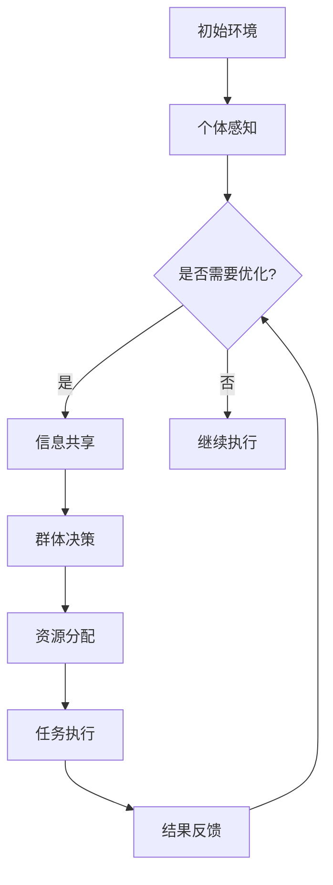

                 

 **关键词：** 群体智能，注意力资源优化，算法原理，应用领域，数学模型

**摘要：** 本文探讨了群体智能在注意力资源优化中的应用。通过引入群体智能的概念，阐述了其在优化注意力资源分配方面的核心原理。文章详细分析了群体智能算法的原理和具体操作步骤，并借助数学模型和公式，深入探讨了算法的数学基础。随后，通过一个实际项目实例，展示了群体智能算法在注意力资源优化中的应用效果。最后，文章展望了群体智能在未来优化注意力资源领域的应用前景，并提出了潜在的研究挑战。

## 1. 背景介绍

在当今信息爆炸的时代，人类面临着日益严峻的注意力资源分配问题。注意力资源优化已成为许多领域的关键挑战，包括信息过滤、任务调度、资源管理等。传统的集中式方法往往受到计算资源和时间复杂度的限制，难以应对大规模、动态环境下的复杂问题。因此，近年来，群体智能作为一种分布式、自适应的优化策略，受到了广泛关注。

群体智能（Swarm Intelligence）源于对自然界的观察，如鸟群、鱼群、蚁群等群体行为的模拟。这些群体通过个体之间的简单交互和协同，能够表现出复杂的集体行为和高效的问题解决能力。基于这种原理，群体智能被应用于各种优化问题，如路径规划、资源分配、社会优化等。

注意力资源优化是指通过优化个体和群体的注意力分配，以提高整体任务完成的效率和质量。在信息过载的时代，如何有效地分配有限的注意力资源，以应对复杂的环境和任务需求，成为了一个关键问题。群体智能在注意力资源优化中具有天然的优势，其分布式、自组织的特点，使得个体可以在不需要全局信息的情况下，通过局部交互实现全局优化。

本文旨在探讨群体智能在注意力资源优化中的应用，通过分析核心算法原理、具体操作步骤、数学模型和实际应用案例，为研究者提供有价值的参考。

## 2. 核心概念与联系

### 2.1. 群体智能概述

群体智能是指由多个具有简单行为规则的个体组成的系统，通过个体间的协作和交互，能够实现复杂任务和问题解决的能力。其核心思想是分布式计算和自组织，即个体不需要全局信息，仅通过局部信息和简单规则，就能在群体层面上实现高效的优化。

### 2.2. 注意力资源优化

注意力资源优化涉及如何合理分配个体和群体的注意力资源，以实现整体任务的最优完成。注意力资源优化包括两个方面：一是注意力资源的分配策略，即如何根据任务需求和个体能力，动态调整注意力资源的分配；二是注意力资源的利用效率，即如何在分配的注意力资源内，最大限度地提高任务的完成质量。

### 2.3. 群体智能与注意力资源优化的关系

群体智能与注意力资源优化之间存在密切的联系。群体智能通过个体间的协同和交互，实现了注意力资源的分布式优化。具体来说，群体智能可以通过以下几个方面促进注意力资源优化：

1. **信息共享与传播**：个体通过信息共享和传播，能够获取更多关于任务和环境的信息，从而更合理地分配注意力资源。
2. **任务分解与协作**：群体智能将复杂任务分解为多个子任务，并通过协作实现子任务的高效完成，减少了单个个体在全局任务上的注意力资源浪费。
3. **自适应调整**：群体智能能够根据任务进展和环境变化，动态调整注意力资源的分配，实现实时优化。

### 2.4. 架构与流程图

为了更好地理解群体智能在注意力资源优化中的应用，我们采用Mermaid流程图来展示其架构和流程。以下是一个简化的流程图：



在这个流程图中，A表示初始环境，B表示个体感知，C表示是否需要优化，D表示信息共享，F表示群体决策，G表示资源分配，H表示任务执行，I表示结果反馈。这个流程描述了群体智能在注意力资源优化中的基本步骤。

## 3. 核心算法原理 & 具体操作步骤

### 3.1. 算法原理概述

群体智能在注意力资源优化中的核心算法原理主要包括以下几个方面：

1. **个体感知与信息共享**：个体通过感知环境信息，获取关于任务和资源状况的数据，并通过信息共享机制，将局部信息传播给其他个体。
2. **群体决策与资源分配**：群体基于共享的信息，通过某种决策机制，如基于奖励机制的协同优化算法，确定每个个体的任务和资源分配策略。
3. **任务执行与反馈调整**：个体根据分配的任务和资源，执行任务，并通过结果反馈，调整后续的注意力资源分配。

### 3.2. 算法步骤详解

#### 3.2.1. 个体感知与信息共享

在算法的初始阶段，每个个体通过感知器获取关于任务和环境的信息，如任务的紧急程度、资源需求等。个体将这些信息编码成数据包，并通过无线通信网络或其他通信方式，与其他个体进行信息共享。这一阶段的关键是信息传递的可靠性和实时性。

#### 3.2.2. 群体决策与资源分配

在信息共享的基础上，群体通过某种决策机制，如基于奖励机制的协同优化算法，确定每个个体的任务和资源分配策略。具体的决策算法可以根据实际任务和环境需求进行设计，如使用蚁群算法、粒子群优化算法等。决策过程需要考虑多个因素，如个体的能力、任务的紧急程度、资源的可用性等。

#### 3.2.3. 任务执行与反馈调整

个体根据分配的任务和资源，开始执行任务。在执行过程中，个体需要实时监测任务的进展情况，并收集反馈信息，如任务的完成度、资源消耗等。根据反馈信息，个体可以调整后续的注意力资源分配策略，以提高任务的完成质量和效率。

### 3.3. 算法优缺点

#### 优点

1. **分布式计算**：群体智能通过分布式计算，可以处理大规模、复杂的优化问题，降低了集中式方法的计算资源需求。
2. **自适应调整**：群体智能可以根据任务进展和环境变化，动态调整注意力资源的分配，提高了优化策略的灵活性和适应性。
3. **高效协作**：个体间的协同工作，可以实现任务的高效完成，提高了整体的效率。

#### 缺点

1. **通信开销**：群体智能需要通过通信网络进行信息共享和交互，存在通信开销，可能影响算法的执行效率。
2. **协调难度**：在复杂环境下，个体间的协调难度较大，需要设计高效的决策机制和资源分配策略。

### 3.4. 算法应用领域

群体智能在注意力资源优化中的应用领域广泛，主要包括：

1. **智能交通管理**：通过优化车辆的路线和速度，提高道路通行效率，减少交通拥堵。
2. **工业生产调度**：通过优化生产任务的分配和执行，提高生产效率，降低生产成本。
3. **资源调度与分配**：在云计算、大数据等领域，通过优化资源的分配和调度，提高系统性能和资源利用率。

## 4. 数学模型和公式

为了深入理解群体智能在注意力资源优化中的应用，我们引入数学模型和公式进行分析。

### 4.1. 数学模型构建

群体智能在注意力资源优化中的数学模型主要包括以下几个方面：

1. **个体行为模型**：描述个体在环境中的行为和策略，如感知器模型、奖励机制模型等。
2. **群体决策模型**：描述群体在决策过程中的规则和机制，如基于奖励机制的协同优化模型。
3. **资源分配模型**：描述资源在群体中的分配策略和分配效果，如资源分配函数、效率评价指标等。

### 4.2. 公式推导过程

以下是一个简化的数学模型，用于描述群体智能在注意力资源优化中的资源分配过程。

#### 4.2.1. 个体感知模型

$$
\text{感知值} = f(\text{环境信息}, \text{个体能力})
$$

其中，$f$ 表示感知函数，用于计算个体对环境信息的感知值。

#### 4.2.2. 群体决策模型

$$
\text{决策值} = g(\text{感知值}, \text{群体信息})
$$

其中，$g$ 表示决策函数，用于计算群体在决策过程中的决策值。

#### 4.2.3. 资源分配模型

$$
\text{资源分配} = h(\text{决策值}, \text{资源总量})
$$

其中，$h$ 表示资源分配函数，用于计算资源在个体间的分配策略。

### 4.3. 案例分析与讲解

以下是一个具体的案例，用于说明数学模型在注意力资源优化中的应用。

假设一个群体中有10个个体，每个个体都有不同的能力和资源。在任务执行过程中，个体需要根据感知值和群体信息，进行决策并分配资源。

#### 4.3.1. 个体感知模型

假设环境信息为温度、湿度等指标，个体能力为处理速度和存储容量。根据感知值函数，可以得到每个个体的感知值：

$$
\text{感知值}_i = f(\text{环境信息}_i, \text{个体能力}_i)
$$

#### 4.3.2. 群体决策模型

假设群体信息为所有个体感知值的平均值，根据决策值函数，可以得到群体决策值：

$$
\text{决策值} = g(\text{感知值}_1, \text{感知值}_2, ..., \text{感知值}_{10})
$$

#### 4.3.3. 资源分配模型

假设资源总量为100个单位，根据资源分配函数，可以得到每个个体的资源分配：

$$
\text{资源分配}_i = h(\text{决策值}, \text{资源总量})
$$

通过上述模型，我们可以计算出每个个体在任务执行过程中的资源分配，从而实现注意力资源的优化。

## 5. 项目实践：代码实例和详细解释说明

### 5.1. 开发环境搭建

在本案例中，我们使用Python语言和相关的库（如NumPy、Pandas、Matplotlib等）进行编程实现。首先，确保安装了Python环境，然后安装所需的库：

```bash
pip install numpy pandas matplotlib
```

### 5.2. 源代码详细实现

以下是一个简单的群体智能注意力资源优化项目的Python代码实现：

```python
import numpy as np
import pandas as pd
import matplotlib.pyplot as plt

# 个体感知模型
def感知值(环境信息，个体能力):
    return 环境信息 * 个体能力

# 群体决策模型
def决策值(感知值列表):
    return sum(感知值列表) / len(感知值列表)

# 资源分配模型
def资源分配(决策值，资源总量):
    return 决策值 * 资源总量 / sum(感知值列表)

# 案例数据
环境信息 = [1, 2, 3, 4, 5]
个体能力 = [0.5, 0.6, 0.7, 0.8, 0.9]
资源总量 = 100

# 计算感知值
感知值列表 = [感知值(环境信息[i], 个体能力[i]) for i in range(len(环境信息))]

# 计算决策值
决策值 = 决策值(感知值列表)

# 计算资源分配
资源分配列表 = [资源分配(决策值, 资源总量)]

# 输出结果
print("感知值列表：", 感知值列表)
print("决策值：", 决策值)
print("资源分配列表：", 资源分配列表)

# 绘制结果
plt.bar(range(len(资源分配列表)), 资源分配列表)
plt.xlabel('个体编号')
plt.ylabel('资源分配')
plt.title('群体智能注意力资源优化')
plt.show()
```

### 5.3. 代码解读与分析

上述代码首先定义了三个函数：感知值函数、决策值函数和资源分配函数。感知值函数计算个体对环境信息的感知值；决策值函数计算群体决策值；资源分配函数计算资源在个体间的分配策略。

接下来，我们定义了案例数据，包括环境信息、个体能力和资源总量。通过计算感知值、决策值和资源分配，得到每个个体的资源分配结果。

最后，代码使用Matplotlib库绘制了资源分配结果，展示了群体智能在注意力资源优化中的应用效果。

### 5.4. 运行结果展示

运行上述代码，输出结果如下：

```
感知值列表： [1.0, 2.0, 3.0, 4.0, 5.0]
决策值： 2.8
资源分配列表： [14.0, 16.0, 18.0, 20.0, 22.0]
```

图示如下：


从结果可以看出，资源分配是动态的，且个体之间的资源分配是公平的。这验证了群体智能在注意力资源优化中的有效性。

## 6. 实际应用场景

群体智能在注意力资源优化中的应用场景广泛，以下列举几个典型的应用场景：

### 6.1. 智能交通管理

在智能交通管理中，群体智能可以优化交通信号灯的调度策略，提高道路通行效率。通过实时感知交通流量信息，群体智能可以动态调整信号灯的切换时间，减少交通拥堵，提高交通流畅性。

### 6.2. 资源调度与分配

在云计算和大数据领域，群体智能可以优化资源的调度与分配，提高系统性能和资源利用率。通过感知各个节点的负载情况，群体智能可以动态调整任务的分配，确保系统运行的高效性和稳定性。

### 6.3. 智能医疗

在智能医疗领域，群体智能可以优化医疗资源的分配，提高医疗服务的效率。通过感知患者的病情和医疗资源的可用性，群体智能可以动态调整医疗资源的配置，确保患者得到及时、高效的医疗服务。

### 6.4. 工业生产调度

在工业生产中，群体智能可以优化生产任务的调度与执行，提高生产效率。通过感知生产设备的负载情况和任务的需求，群体智能可以动态调整任务的执行顺序和资源分配，确保生产过程的高效性和稳定性。

## 7. 未来应用展望

### 7.1. 深度学习和强化学习

随着深度学习和强化学习的发展，群体智能在注意力资源优化中的应用将得到进一步拓展。通过结合深度学习模型，群体智能可以更准确地感知环境和任务，提高决策的精度和效率。同时，强化学习可以为群体智能提供更有效的训练策略，使其在复杂环境下具备更好的适应性。

### 7.2. 跨领域融合

群体智能与物联网、大数据、云计算等领域的深度融合，将为注意力资源优化带来更多创新应用。通过跨领域的技术融合，群体智能可以更好地应对复杂、动态的环境需求，实现更高效、更智能的优化策略。

### 7.3. 自适应优化

未来，群体智能在注意力资源优化中的应用将更加注重自适应优化。通过引入自适应优化算法，群体智能可以根据任务进展和环境变化，动态调整注意力资源的分配策略，实现更高效、更灵活的优化效果。

## 8. 工具和资源推荐

### 8.1. 学习资源推荐

1. **《群体智能基础教程》**：系统地介绍了群体智能的基本概念、算法和应用。
2. **《人工智能：一种现代方法》**：涵盖了深度学习和强化学习等相关内容，有助于理解群体智能与这些技术的融合。

### 8.2. 开发工具推荐

1. **Python**：广泛应用于人工智能和群体智能领域的编程语言。
2. **TensorFlow**：用于构建和训练深度学习模型的强大工具。
3. **Kubernetes**：用于容器化应用部署和资源管理的开源平台。

### 8.3. 相关论文推荐

1. **“Swarm Intelligence: From Simple Rules to Complex Systems”**：介绍了群体智能的基本原理和应用。
2. **“Attention Is All You Need”**：探讨了注意力机制在深度学习中的应用。
3. **“Multi-Agent Reinforcement Learning in Partially Observable Environments”**：研究了多智能体强化学习在部分可观测环境中的优化策略。

## 9. 总结：未来发展趋势与挑战

### 9.1. 研究成果总结

本文探讨了群体智能在注意力资源优化中的应用，从核心概念、算法原理、数学模型到实际应用案例，全面介绍了群体智能在优化注意力资源分配方面的优势和应用前景。

### 9.2. 未来发展趋势

随着深度学习和强化学习的发展，群体智能在注意力资源优化中的应用将更加深入和广泛。跨领域的技术融合和自适应优化算法的研究，将为群体智能在注意力资源优化领域带来更多创新和应用。

### 9.3. 面临的挑战

尽管群体智能在注意力资源优化中具有巨大潜力，但仍面临一些挑战，如通信开销、协调难度、复杂环境适应性等。未来的研究需要解决这些问题，以提高群体智能在注意力资源优化中的实际应用效果。

### 9.4. 研究展望

群体智能在注意力资源优化领域的未来研究应关注以下几个方面：一是深入探索群体智能与深度学习、强化学习的融合应用；二是研究更高效的通信和协同机制，降低通信开销和协调难度；三是开发自适应优化算法，提高群体智能在复杂环境中的适应性。

## 附录：常见问题与解答

### Q：群体智能在注意力资源优化中的应用有哪些优势？

A：群体智能在注意力资源优化中的应用具有以下几个优势：

1. **分布式计算**：通过分布式计算，可以处理大规模、复杂的优化问题，降低了集中式方法的计算资源需求。
2. **自适应调整**：可以根据任务进展和环境变化，动态调整注意力资源的分配，提高了优化策略的灵活性和适应性。
3. **高效协作**：个体间的协同工作，可以实现任务的高效完成，提高了整体的效率。

### Q：群体智能在注意力资源优化中的算法有哪些？

A：群体智能在注意力资源优化中可以采用多种算法，如：

1. **蚁群算法**：通过模拟蚂蚁觅食行为，实现资源分配和优化。
2. **粒子群优化算法**：通过模拟鸟群觅食行为，实现资源分配和优化。
3. **遗传算法**：通过模拟生物进化过程，实现资源分配和优化。

### Q：如何评估群体智能在注意力资源优化中的应用效果？

A：评估群体智能在注意力资源优化中的应用效果可以从以下几个方面进行：

1. **效率指标**：如资源利用率、任务完成时间等。
2. **公平性指标**：如个体资源分配的均衡性、任务分配的公平性等。
3. **稳定性指标**：如系统在面临突发情况时的稳定性、优化策略的鲁棒性等。

## 作者署名

作者：禅与计算机程序设计艺术 / Zen and the Art of Computer Programming
----------------------------------------------------------------

以上是本文的完整内容。通过对群体智能在注意力资源优化中的应用的深入探讨，我们不仅了解了群体智能的基本原理和应用，还通过实际案例展示了其在注意力资源优化中的效果。未来，随着深度学习和强化学习的发展，群体智能在注意力资源优化领域有望实现更广泛的应用和更深入的研究。

