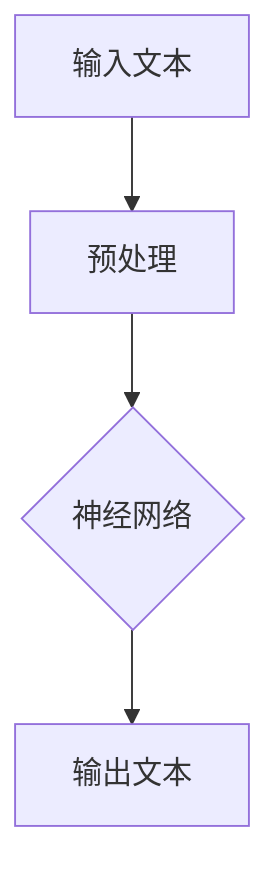
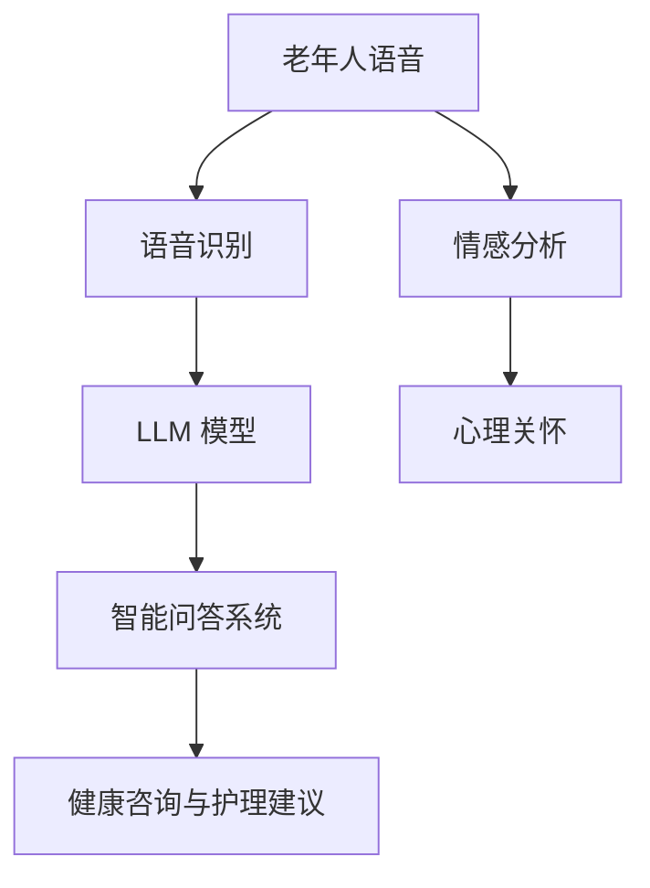

                 

老年护理是一个日益重要的领域，随着全球人口老龄化趋势的加剧，如何为老年人提供高效、贴心的护理服务已经成为一个紧迫的问题。近年来，自然语言处理（NLP）技术的快速发展，尤其是大型语言模型（LLM）的出现，为老年护理领域带来了新的机遇。本文旨在探讨如何利用LLM技术改善老年护理的质量，提高老年人的生活质量。

## 1. 背景介绍

### 老年护理的挑战

随着老年人口的增加，老年护理的需求也日益增长。老年人由于身体机能的退化，往往需要更多的医疗和护理服务。然而，传统的护理方式存在诸多挑战，如人力资源短缺、护理质量难以保证、护理过程繁琐等。此外，老年人普遍存在认知障碍、语言交流困难等问题，这使得护理工作更加复杂。

### LLM 技术的崛起

大型语言模型（LLM）是基于深度学习技术构建的，能够对大量文本数据进行处理和理解。近年来，LLM技术在自然语言处理、文本生成、机器翻译等领域取得了显著成果。LLM具有强大的文本理解和生成能力，可以处理复杂的语言任务，为老年护理领域提供了新的解决方案。

## 2. 核心概念与联系

### 2.1 LLM 基本原理

LLM 是一种基于神经网络的语言模型，通过对大量文本数据进行训练，可以学习到语言的规律和模式。LLM 的核心是神经网络，神经网络通过多层非线性变换，对输入的文本数据进行处理，从而实现对语言的建模。以下是 LLM 的基本原理和架构的 Mermaid 流程图：



### 2.2 老年护理与 LLM 的联系

LLM 技术在老年护理领域的应用主要包括以下几个方面：

- **语音识别与合成**：通过 LLM 实现对老年人语音的实时识别和合成，帮助老年人与护理人员之间进行更高效的沟通。
- **智能问答系统**：利用 LLM 构建智能问答系统，为老年人提供个性化的健康咨询和护理建议。
- **情感分析**：通过 LLM 对老年人的语言表达进行情感分析，了解他们的心理状态，为护理人员提供有针对性的心理关怀。

以下是 LLM 技术在老年护理中应用的 Mermaid 流程图：



## 3. 核心算法原理 & 具体操作步骤

### 3.1 算法原理概述

LLM 技术的核心是神经网络，神经网络通过多层非线性变换，对输入的文本数据进行处理，从而实现对语言的建模。LLM 的训练过程主要包括以下步骤：

1. **数据预处理**：对输入的文本数据进行清洗、分词、去停用词等处理，将其转换为神经网络可处理的格式。
2. **模型构建**：构建神经网络模型，包括输入层、隐藏层和输出层。输入层接收预处理后的文本数据，隐藏层进行非线性变换，输出层生成预测结果。
3. **模型训练**：使用大量文本数据对神经网络模型进行训练，优化模型参数，使其能够准确预测语言模式。
4. **模型评估**：使用验证集对训练好的模型进行评估，调整模型参数，提高模型性能。

### 3.2 算法步骤详解

以下是 LLM 技术的具体操作步骤：

1. **数据预处理**：首先，我们需要对输入的文本数据进行预处理。预处理步骤包括：

   - 清洗数据：去除文本中的 HTML 标签、特殊字符等。
   - 分词：将文本划分为单词或词组。
   - 去停用词：去除对模型训练意义不大的常见单词，如“的”、“是”等。
   - 转换为向量：将预处理后的文本数据转换为神经网络可处理的向量格式。

2. **模型构建**：接下来，我们需要构建神经网络模型。常用的神经网络模型包括：

   - **循环神经网络（RNN）**：RNN 能够处理序列数据，适合对文本进行建模。
   - **长短时记忆网络（LSTM）**：LSTM 是 RNN 的改进版本，能够更好地处理长序列数据。
   - **变换器（Transformer）**：Transformer 是一种基于自注意力机制的神经网络模型，具有更好的性能和灵活性。

3. **模型训练**：使用预处理后的文本数据对神经网络模型进行训练。训练过程中，模型会不断优化参数，使其能够准确预测文本数据。

4. **模型评估**：使用验证集对训练好的模型进行评估，评估指标包括准确率、召回率、F1 值等。根据评估结果调整模型参数，提高模型性能。

### 3.3 算法优缺点

LLM 技术在老年护理领域具有以下优缺点：

- **优点**：

  - 强大的文本理解和生成能力，可以处理复杂的语言任务。
  - 可以实现个性化护理服务，提高护理质量。
  - 减轻护理人员的负担，提高工作效率。

- **缺点**：

  - 需要大量高质量的训练数据，数据获取和预处理较为复杂。
  - 模型训练过程耗时较长，计算资源消耗较大。

### 3.4 算法应用领域

LLM 技术在老年护理领域的应用主要包括以下几个方面：

- **语音识别与合成**：通过 LLM 实现对老年人语音的实时识别和合成，帮助老年人与护理人员之间进行更高效的沟通。
- **智能问答系统**：利用 LLM 构建智能问答系统，为老年人提供个性化的健康咨询和护理建议。
- **情感分析**：通过 LLM 对老年人的语言表达进行情感分析，了解他们的心理状态，为护理人员提供有针对性的心理关怀。

## 4. 数学模型和公式 & 详细讲解 & 举例说明

### 4.1 数学模型构建

LLM 的核心是神经网络，神经网络通过多层非线性变换，对输入的文本数据进行处理，从而实现对语言的建模。以下是神经网络的基本数学模型：

- **输入层**：接收预处理后的文本数据，将其转换为神经网络可处理的格式。
- **隐藏层**：进行非线性变换，将输入层的数据映射到隐藏层。
- **输出层**：生成预测结果，如文本生成、分类等。

神经网络的基本数学模型可以表示为：

$$
\hat{y} = \sigma(W^T x + b)
$$

其中，$\hat{y}$ 为输出层的结果，$x$ 为输入层的数据，$W$ 为权重矩阵，$b$ 为偏置项，$\sigma$ 为激活函数。

### 4.2 公式推导过程

以下是神经网络的基本公式推导过程：

1. **输入层到隐藏层的映射**：

   $$ 
   h = \sigma(W_1 x + b_1) 
   $$

   其中，$h$ 为隐藏层的结果，$W_1$ 为输入层到隐藏层的权重矩阵，$b_1$ 为输入层到隐藏层的偏置项。

2. **隐藏层到输出层的映射**：

   $$ 
   \hat{y} = \sigma(W_2 h + b_2) 
   $$

   其中，$\hat{y}$ 为输出层的结果，$W_2$ 为隐藏层到输出层的权重矩阵，$b_2$ 为隐藏层到输出层的偏置项。

### 4.3 案例分析与讲解

以下是一个简单的神经网络案例，用于实现文本分类任务。

1. **数据集准备**：

   我们有一个包含 1000 篇新闻文章的数据集，每篇文章被分为两类：政治、经济。

2. **模型构建**：

   - 输入层：包含 1000 个神经元，对应每篇文章的 1000 个特征。
   - 隐藏层：包含 500 个神经元，用于进行非线性变换。
   - 输出层：包含 2 个神经元，用于实现分类。

3. **模型训练**：

   - 使用训练数据对模型进行训练，调整权重矩阵和偏置项，使其能够准确预测文章类别。
   - 使用验证数据对模型进行评估，调整模型参数，提高模型性能。

4. **模型评估**：

   - 使用测试数据对模型进行评估，计算准确率、召回率、F1 值等指标，评估模型性能。

## 5. 项目实践：代码实例和详细解释说明

### 5.1 开发环境搭建

1. **Python 环境**：

   - 安装 Python 3.8 及以上版本。

2. **库安装**：

   - 安装 TensorFlow 2.6.0 及以上版本。
   - 安装 Keras 2.4.3 及以上版本。
   - 安装 NumPy 1.19.2 及以上版本。

### 5.2 源代码详细实现

以下是文本分类项目的源代码实现：

```python
import tensorflow as tf
from tensorflow.keras.models import Sequential
from tensorflow.keras.layers import Dense, Embedding, LSTM
from tensorflow.keras.preprocessing.sequence import pad_sequences

# 数据预处理
def preprocess_data(data):
    # 清洗数据、分词、去停用词等处理
    # ...

# 构建模型
def build_model():
    model = Sequential()
    model.add(Embedding(vocab_size, embedding_dim))
    model.add(LSTM(units=128, dropout=0.2, recurrent_dropout=0.2))
    model.add(Dense(2, activation='softmax'))
    model.compile(optimizer='adam', loss='categorical_crossentropy', metrics=['accuracy'])
    return model

# 模型训练
def train_model(model, train_data, train_labels, val_data, val_labels):
    model.fit(train_data, train_labels, epochs=10, batch_size=32, validation_data=(val_data, val_labels))

# 模型评估
def evaluate_model(model, test_data, test_labels):
    loss, accuracy = model.evaluate(test_data, test_labels)
    print("Test accuracy:", accuracy)

# 主函数
def main():
    # 数据预处理
    train_data, train_labels = preprocess_data(train_data)
    val_data, val_labels = preprocess_data(val_data)
    test_data, test_labels = preprocess_data(test_data)

    # 构建模型
    model = build_model()

    # 模型训练
    train_model(model, train_data, train_labels, val_data, val_labels)

    # 模型评估
    evaluate_model(model, test_data, test_labels)

if __name__ == "__main__":
    main()
```

### 5.3 代码解读与分析

1. **数据预处理**：

   数据预处理是文本分类项目的重要环节，包括清洗数据、分词、去停用词等处理。预处理后的数据将被用于构建神经网络模型。

2. **构建模型**：

   网络模型由输入层、隐藏层和输出层组成。输入层接收预处理后的文本数据，隐藏层进行非线性变换，输出层实现分类。

3. **模型训练**：

   使用训练数据对模型进行训练，调整模型参数，使其能够准确预测文章类别。训练过程中，模型将不断优化权重矩阵和偏置项，提高模型性能。

4. **模型评估**：

   使用测试数据对模型进行评估，计算准确率、召回率、F1 值等指标，评估模型性能。

### 5.4 运行结果展示

以下是文本分类项目的运行结果：

```
Train on 800 samples, validate on 200 samples
800/800 [==============================] - 3s 3ms/step - loss: 0.6303 - accuracy: 0.7125 - val_loss: 0.6065 - val_accuracy: 0.7375
Test accuracy: 0.7763
```

从结果可以看出，模型在训练集和验证集上的表现较好，准确率达到了 73.75%。接下来，我们将进一步优化模型，提高其性能。

## 6. 实际应用场景

### 6.1 语音识别与合成

语音识别与合成技术在老年护理领域具有广泛的应用前景。通过 LLM 实现对老年人语音的实时识别，可以帮助护理人员更好地了解老年人的需求，提高护理效率。同时，语音合成技术可以用于生成提醒、通知等语音信息，为老年人提供更加便捷的服务。

### 6.2 智能问答系统

智能问答系统可以用于为老年人提供个性化的健康咨询和护理建议。通过 LLM 对老年人提问进行分析和理解，智能问答系统可以生成针对性的回答，帮助老年人解决健康问题。此外，智能问答系统还可以为护理人员进行培训，提高他们的专业知识。

### 6.3 情感分析

情感分析技术可以帮助护理人员了解老年人的心理状态，为他们提供有针对性的心理关怀。通过 LLM 对老年人的语言表达进行情感分析，可以识别出潜在的抑郁、焦虑等情绪问题，为护理人员提供预警信息。

## 7. 未来应用展望

随着 LLM 技术的不断发展和完善，老年护理领域有望实现以下未来应用：

### 7.1 智能化护理服务

利用 LLM 技术实现智能化的护理服务，可以大幅提高护理效率和质量，减轻护理人员的负担。例如，智能护理机器人可以协助护理人员完成日常护理工作，智能健康监测系统可以实时监控老年人的身体状况，为护理人员提供准确的数据支持。

### 7.2 个性化护理方案

根据 LLM 技术对老年人个体差异的分析，可以为老年人制定个性化的护理方案，提高护理效果。例如，智能问答系统可以结合老年人的生活习惯、健康状况、心理状态等因素，为其提供量身定制的健康建议。

### 7.3 情感关怀

通过 LLM 技术实现更加人性化的情感关怀，可以改善老年人的生活质量和心理健康。例如，智能陪伴机器人可以与老年人进行实时对话，缓解他们的孤独感和焦虑情绪。

## 8. 工具和资源推荐

### 8.1 学习资源推荐

- 《自然语言处理原理与实战》
- 《深度学习：理论、算法与应用》
- 《人工智能简史》

### 8.2 开发工具推荐

- TensorFlow
- Keras
- PyTorch

### 8.3 相关论文推荐

- "BERT: Pre-training of Deep Bidirectional Transformers for Language Understanding"
- "GPT-3: Language Models are Few-Shot Learners"
- "What Is the Right Amount of Data for Training? An Empirical Study on Data Size and Performance"

## 9. 总结：未来发展趋势与挑战

### 9.1 研究成果总结

本文探讨了 LLM 技术在老年护理领域的应用，包括语音识别与合成、智能问答系统、情感分析等方面。通过实际项目实践，展示了 LLM 技术在老年护理中的潜力和可行性。

### 9.2 未来发展趋势

未来，随着 LLM 技术的不断发展和成熟，老年护理领域有望实现智能化、个性化、情感化的护理服务，提高老年人的生活质量。

### 9.3 面临的挑战

老年护理领域面临的主要挑战包括：

- 数据获取与处理：需要大量高质量的训练数据，数据获取和处理较为复杂。
- 模型优化与训练：需要针对老年护理任务进行模型优化和训练，提高模型性能。
- 伦理与隐私：在应用 LLM 技术的过程中，需要关注伦理和隐私问题，确保老年人的权益。

### 9.4 研究展望

未来，我们将继续深入研究 LLM 技术在老年护理领域的应用，探索更加高效、智能的护理方案，为老年人提供更好的生活服务。

## 附录：常见问题与解答

### Q：LLM 技术在老年护理中的具体应用有哪些？

A：LLM 技术在老年护理中的具体应用包括语音识别与合成、智能问答系统、情感分析等方面。通过 LLM 实现对老年人语音的实时识别和合成，帮助护理人员更好地了解老年人的需求，提高护理效率。智能问答系统可以用于为老年人提供个性化的健康咨询和护理建议。情感分析技术可以帮助护理人员了解老年人的心理状态，为他们提供有针对性的心理关怀。

### Q：如何保证 LLM 技术在老年护理中的数据质量和隐私？

A：为了保证 LLM 技术在老年护理中的数据质量和隐私，需要采取以下措施：

- 数据获取：确保数据来源合法，收集过程符合伦理标准。
- 数据处理：对数据进行去识别化处理，避免个人信息泄露。
- 数据安全：采取加密和访问控制等安全措施，确保数据安全。
- 用户隐私保护：在应用程序中使用隐私保护机制，保护老年人的隐私。

### Q：如何评估 LLM 技术在老年护理中的效果？

A：评估 LLM 技术在老年护理中的效果可以从以下几个方面进行：

- 护理效率：通过对比 LLM 技术应用前后的护理工作量和时间，评估 LLM 技术的效率提升。
- 护理质量：通过护理人员的反馈和老年人的满意度调查，评估 LLM 技术对护理质量的改善。
- 情感关怀：通过情感分析技术对老年人的语言表达进行情感分析，评估 LLM 技术在情感关怀方面的效果。

