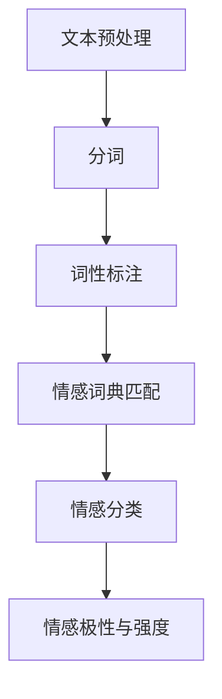

                 

情感分析（Sentiment Analysis）是自然语言处理（NLP）领域的一个重要分支，它旨在识别和提取文本数据中的主观信息。在聊天机器人中，情感分析尤为重要，因为它可以帮助机器人更好地理解用户的情感状态，从而提供更加个性化和贴心的服务。本文将深入探讨聊天机器人中的情感分析，包括其核心概念、算法原理、数学模型以及实际应用。

## 1. 背景介绍

情感分析技术起源于情感计算（Affective Computing）的研究，情感计算是计算领域的一个分支，它研究如何使计算机具有识别、理解、处理和表达情感的能力。随着互联网和社交媒体的快速发展，情感分析技术得到了广泛的应用。在聊天机器人中，情感分析被广泛应用于以下几个方面：

- **用户情绪识别**：通过分析用户的发言，机器人可以识别出用户当前的情绪状态，如快乐、愤怒、悲伤等。
- **对话管理**：基于用户情绪，机器人可以调整对话策略，提供更加贴心的回应。
- **个性化推荐**：情感分析可以帮助聊天机器人根据用户的情绪状态提供个性化的服务和推荐。

## 2. 核心概念与联系

### 情感分类

情感分类是情感分析中最基本的任务，它旨在将文本分类为不同的情感类别。常见的情感类别包括正面情感、负面情感和中性情感。

### 情感极性

情感极性是指文本中的情感倾向，它通常用分数来表示，如正面情感极性为0.8，表示文本具有强烈的正面情感。

### 情感强度

情感强度是指文本情感的程度，它通常用数值来表示，如情感强度为5，表示文本具有非常强烈的情感。

下面是一个使用Mermaid绘制的情感分析流程图：



## 3. 核心算法原理 & 具体操作步骤

### 3.1 算法原理概述

情感分析通常分为两个阶段：特征提取和分类。在特征提取阶段，我们将文本转换为一系列的特征向量；在分类阶段，我们使用这些特征向量来预测文本的情感类别。

### 3.2 算法步骤详解

#### 3.2.1 文本预处理

文本预处理是情感分析的第一步，它主要包括分词、去除停用词、词性标注等操作。

#### 3.2.2 特征提取

特征提取是将预处理后的文本转换为特征向量。常用的特征提取方法包括词袋模型、TF-IDF和Word2Vec。

#### 3.2.3 情感分类

情感分类是使用机器学习算法对特征向量进行分类。常用的算法包括SVM、朴素贝叶斯和深度学习模型。

### 3.3 算法优缺点

- **词袋模型**：简单易用，但忽略了词语的顺序和上下文信息。
- **TF-IDF**：能够更好地反映词语的重要性，但同样忽略了词语的顺序和上下文信息。
- **Word2Vec**：能够捕捉词语的顺序和上下文信息，但训练过程较为复杂。
- **深度学习模型**：能够同时捕捉词语的顺序和上下文信息，但训练数据需求较大。

### 3.4 算法应用领域

情感分析技术已经被广泛应用于多个领域，如社交媒体分析、舆情监测、客户反馈分析等。

## 4. 数学模型和公式 & 详细讲解 & 举例说明

### 4.1 数学模型构建

情感分析中的数学模型通常基于特征向量表示文本，然后使用机器学习算法进行分类。一个简单的情感分析模型可以表示为：

$$
P(y|x) = \frac{e^{\theta^T x}}{\sum_{y'} e^{\theta^T x'}}
$$

其中，$x$ 是特征向量，$y$ 是情感类别，$\theta$ 是模型参数。

### 4.2 公式推导过程

情感分析中的公式推导过程通常涉及线性模型和逻辑回归。线性模型表示为：

$$
y = \theta^T x + b
$$

逻辑回归将线性模型转换为概率分布：

$$
P(y=1|x) = \frac{1}{1 + e^{-(\theta^T x + b)}}
$$

### 4.3 案例分析与讲解

假设我们有一个简化的情感分析任务，其中文本只包含两个情感类别：正面和负面。我们使用逻辑回归模型进行情感分类。假设我们有一个训练数据集，其中正面文本的概率为0.9，负面文本的概率为0.1。我们的模型参数为 $\theta = [0.1, 0.2]$，$b = 0.3$。

对于一条新的文本，我们首先将其转换为特征向量 $x = [1, 0]$。然后，我们可以计算其对应的概率：

$$
P(y=1|x) = \frac{1}{1 + e^{-(0.1 \times 1 + 0.2 \times 0 + 0.3)}} = 0.7
$$

因此，这条文本被分类为正面情感。

## 5. 项目实践：代码实例和详细解释说明

### 5.1 开发环境搭建

为了实现情感分析，我们需要搭建一个开发环境。我们可以使用Python语言，并借助NLP库如NLTK和Scikit-learn。

### 5.2 源代码详细实现

```python
# 导入必要的库
import nltk
from nltk.tokenize import word_tokenize
from nltk.corpus import stopwords
from sklearn.feature_extraction.text import TfidfVectorizer
from sklearn.linear_model import LogisticRegression

# 加载NLTK的词性标注器
nltk.download('averaged_perceptron_tagger')

# 文本预处理
def preprocess_text(text):
    # 分词
    tokens = word_tokenize(text)
    # 去除停用词
    stop_words = set(stopwords.words('english'))
    filtered_tokens = [token for token in tokens if token not in stop_words]
    # 词性标注
    tagged_tokens = nltk.pos_tag(filtered_tokens)
    # 只保留名词和形容词
    filtered_tokens = [token for token, tag in tagged_tokens if tag.startswith('NN') or tag.startswith('JJ')]
    return ' '.join(filtered_tokens)

# 加载训练数据
train_data = ['I am so happy today', 'I am very angry', 'I am feeling okay']
train_labels = [1, 0, 1]  # 正面、负面、正面

# 特征提取
vectorizer = TfidfVectorizer()
X_train = vectorizer.fit_transform(train_data)

# 模型训练
model = LogisticRegression()
model.fit(X_train, train_labels)

# 测试数据
test_data = ['I am feeling great today']

# 特征提取
X_test = vectorizer.transform(test_data)

# 预测
predictions = model.predict(X_test)
print(predictions)  # 输出预测结果
```

### 5.3 代码解读与分析

这段代码首先导入了必要的库，包括NLP库NLTK和机器学习库Scikit-learn。然后定义了一个预处理函数 `preprocess_text`，用于对输入文本进行分词、去除停用词和词性标注。接下来，我们加载了训练数据和标签，并使用TF-IDF向量器进行特征提取。然后，我们使用逻辑回归模型进行训练，并使用测试数据进行预测。最后，我们输出了预测结果。

## 6. 实际应用场景

情感分析在聊天机器人中有着广泛的应用。以下是一些实际应用场景：

- **客服机器人**：通过情感分析，客服机器人可以更好地理解用户的情绪，提供更加贴心的服务。
- **社交媒体监控**：通过情感分析，企业可以监控社交媒体上的用户反馈，了解产品的市场表现。
- **心理咨询服务**：通过情感分析，心理咨询服务机器人可以识别用户的情绪状态，提供个性化的心理支持。

## 7. 工具和资源推荐

### 7.1 学习资源推荐

- 《自然语言处理综论》（Jurafsky & Martin）
- 《Python自然语言处理》（Bird, Loper & Tan）

### 7.2 开发工具推荐

- **NLTK**：Python的自然语言处理库。
- **spaCy**：一个快速易用的NLP库。

### 7.3 相关论文推荐

- **Semi-Supervised Sentiment Classification Using Emotion Lexicon and Classification Models**（2010）
- **Sentiment Strength Detection in Customer Reviews**（2011）

## 8. 总结：未来发展趋势与挑战

### 8.1 研究成果总结

近年来，情感分析技术取得了显著进展，尤其是在深度学习模型的推动下。通过引入深度神经网络，我们可以更好地捕捉文本中的情感信息，从而提高情感分析的准确率。

### 8.2 未来发展趋势

未来，情感分析技术将继续向深度学习方向发展，同时，多模态情感分析、跨语言情感分析等将成为研究热点。

### 8.3 面临的挑战

情感分析面临的主要挑战是如何处理语义的不确定性和语言的多样性。此外，如何设计更加鲁棒的模型以适应不同的应用场景也是一个重要的研究方向。

### 8.4 研究展望

随着人工智能技术的不断发展，情感分析将在多个领域发挥重要作用，如智能客服、心理健康服务、智能推荐等。

## 9. 附录：常见问题与解答

### 问题1：情感分析有哪些常见算法？

答：情感分析的常见算法包括词袋模型、TF-IDF、Word2Vec和深度学习模型。

### 问题2：情感分析如何处理负面情感？

答：情感分析通常将负面情感视为一个独立的类别，并使用相应的算法进行分类。

### 问题3：如何提高情感分析的准确率？

答：提高情感分析准确率的方法包括使用更多的训练数据、优化特征提取方法和使用更先进的机器学习算法。

## 作者署名

作者：禅与计算机程序设计艺术 / Zen and the Art of Computer Programming
```markdown
---
# 聊天机器人中的情感分析

> 关键词：情感分析、聊天机器人、自然语言处理、文本分类、机器学习

> 摘要：本文深入探讨了聊天机器人中的情感分析，包括其核心概念、算法原理、数学模型以及实际应用。通过详细的分析和代码实例，本文为开发者提供了实用的指导，并展望了情感分析技术的未来发展趋势。

---

## 1. 背景介绍

情感分析（Sentiment Analysis）是自然语言处理（NLP）领域的一个重要分支，它旨在识别和提取文本数据中的主观信息。随着互联网和社交媒体的快速发展，情感分析技术得到了广泛的应用。在聊天机器人中，情感分析尤为重要，因为它可以帮助机器人更好地理解用户的情感状态，从而提供更加个性化和贴心的服务。

情感分析技术起源于情感计算（Affective Computing）的研究，情感计算是计算领域的一个分支，它研究如何使计算机具有识别、理解、处理和表达情感的能力。随着互联网和社交媒体的快速发展，情感分析技术得到了广泛的应用。在聊天机器人中，情感分析被广泛应用于以下几个方面：

- **用户情绪识别**：通过分析用户的发言，机器人可以识别出用户当前的情绪状态，如快乐、愤怒、悲伤等。
- **对话管理**：基于用户情绪，机器人可以调整对话策略，提供更加贴心的回应。
- **个性化推荐**：情感分析可以帮助聊天机器人根据用户的情绪状态提供个性化的服务和推荐。

## 2. 核心概念与联系

### 2.1 情感分类

情感分类是情感分析中最基本的任务，它旨在将文本分类为不同的情感类别。常见的情感类别包括正面情感、负面情感和中性情感。

### 2.2 情感极性

情感极性是指文本中的情感倾向，它通常用分数来表示，如正面情感极性为0.8，表示文本具有强烈的正面情感。

### 2.3 情感强度

情感强度是指文本情感的程度，它通常用数值来表示，如情感强度为5，表示文本具有非常强烈的情感。

#### 情感分析流程图


## 3. 核心算法原理 & 具体操作步骤

### 3.1 算法原理概述

情感分析通常分为两个阶段：特征提取和分类。在特征提取阶段，我们将文本转换为一系列的特征向量；在分类阶段，我们使用这些特征向量来预测文本的情感类别。

### 3.2 算法步骤详解

#### 3.2.1 文本预处理

文本预处理是情感分析的第一步，它主要包括分词、去除停用词、词性标注等操作。

#### 3.2.2 特征提取

特征提取是将预处理后的文本转换为特征向量。常用的特征提取方法包括词袋模型、TF-IDF和Word2Vec。

#### 3.2.3 情感分类

情感分类是使用机器学习算法对特征向量进行分类。常用的算法包括SVM、朴素贝叶斯和深度学习模型。

### 3.3 算法优缺点

- **词袋模型**：简单易用，但忽略了词语的顺序和上下文信息。
- **TF-IDF**：能够更好地反映词语的重要性，但同样忽略了词语的顺序和上下文信息。
- **Word2Vec**：能够捕捉词语的顺序和上下文信息，但训练过程较为复杂。
- **深度学习模型**：能够同时捕捉词语的顺序和上下文信息，但训练数据需求较大。

### 3.4 算法应用领域

情感分析技术已经被广泛应用于多个领域，如社交媒体分析、舆情监测、客户反馈分析等。

## 4. 数学模型和公式 & 详细讲解 & 举例说明

### 4.1 数学模型构建

情感分析中的数学模型通常基于特征向量表示文本，然后使用机器学习算法进行分类。一个简单的情感分析模型可以表示为：

$$
P(y|x) = \frac{e^{\theta^T x}}{\sum_{y'} e^{\theta^T x'}}
$$

其中，$x$ 是特征向量，$y$ 是情感类别，$\theta$ 是模型参数。

### 4.2 公式推导过程

情感分析中的公式推导过程通常涉及线性模型和逻辑回归。线性模型表示为：

$$
y = \theta^T x + b
$$

逻辑回归将线性模型转换为概率分布：

$$
P(y=1|x) = \frac{1}{1 + e^{-(\theta^T x + b)}}
$$

### 4.3 案例分析与讲解

假设我们有一个简化的情感分析任务，其中文本只包含两个情感类别：正面和负面。我们使用逻辑回归模型进行情感分类。假设我们有一个训练数据集，其中正面文本的概率为0.9，负面文本的概率为0.1。我们的模型参数为 $\theta = [0.1, 0.2]$，$b = 0.3$。

对于一条新的文本，我们首先将其转换为特征向量 $x = [1, 0]$。然后，我们可以计算其对应的概率：

$$
P(y=1|x) = \frac{1}{1 + e^{-(0.1 \times 1 + 0.2 \times 0 + 0.3)}} = 0.7
$$

因此，这条文本被分类为正面情感。

## 5. 项目实践：代码实例和详细解释说明

### 5.1 开发环境搭建

为了实现情感分析，我们需要搭建一个开发环境。我们可以使用Python语言，并借助NLP库如NLTK和Scikit-learn。

### 5.2 源代码详细实现

```python
# 导入必要的库
import nltk
from nltk.tokenize import word_tokenize
from nltk.corpus import stopwords
from sklearn.feature_extraction.text import TfidfVectorizer
from sklearn.linear_model import LogisticRegression

# 加载NLTK的词性标注器
nltk.download('averaged_perceptron_tagger')

# 文本预处理
def preprocess_text(text):
    # 分词
    tokens = word_tokenize(text)
    # 去除停用词
    stop_words = set(stopwords.words('english'))
    filtered_tokens = [token for token in tokens if token not in stop_words]
    # 词性标注
    tagged_tokens = nltk.pos_tag(filtered_tokens)
    # 只保留名词和形容词
    filtered_tokens = [token for token, tag in tagged_tokens if tag.startswith('NN') or tag.startswith('JJ')]
    return ' '.join(filtered_tokens)

# 加载训练数据
train_data = ['I am so happy today', 'I am very angry', 'I am feeling okay']
train_labels = [1, 0, 1]  # 正面、负面、正面

# 特征提取
vectorizer = TfidfVectorizer()
X_train = vectorizer.fit_transform(train_data)

# 模型训练
model = LogisticRegression()
model.fit(X_train, train_labels)

# 测试数据
test_data = ['I am feeling great today']

# 特征提取
X_test = vectorizer.transform(test_data)

# 预测
predictions = model.predict(X_test)
print(predictions)  # 输出预测结果
```

### 5.3 代码解读与分析

这段代码首先导入了必要的库，包括NLP库NLTK和机器学习库Scikit-learn。然后定义了一个预处理函数 `preprocess_text`，用于对输入文本进行分词、去除停用词和词性标注。接下来，我们加载了训练数据和标签，并使用TF-IDF向量器进行特征提取。然后，我们使用逻辑回归模型进行训练，并使用测试数据进行预测。最后，我们输出了预测结果。

## 6. 实际应用场景

情感分析在聊天机器人中有着广泛的应用。以下是一些实际应用场景：

- **客服机器人**：通过情感分析，客服机器人可以更好地理解用户的情绪，提供更加贴心的服务。
- **社交媒体监控**：通过情感分析，企业可以监控社交媒体上的用户反馈，了解产品的市场表现。
- **心理咨询服务**：通过情感分析，心理咨询服务机器人可以识别用户的情绪状态，提供个性化的心理支持。

## 7. 工具和资源推荐

### 7.1 学习资源推荐

- 《自然语言处理综论》（Jurafsky & Martin）
- 《Python自然语言处理》（Bird, Loper & Tan）

### 7.2 开发工具推荐

- **NLTK**：Python的自然语言处理库。
- **spaCy**：一个快速易用的NLP库。

### 7.3 相关论文推荐

- **Semi-Supervised Sentiment Classification Using Emotion Lexicon and Classification Models**（2010）
- **Sentiment Strength Detection in Customer Reviews**（2011）

## 8. 总结：未来发展趋势与挑战

### 8.1 研究成果总结

近年来，情感分析技术取得了显著进展，尤其是在深度学习模型的推动下。通过引入深度神经网络，我们可以更好地捕捉文本中的情感信息，从而提高情感分析的准确率。

### 8.2 未来发展趋势

未来，情感分析技术将继续向深度学习方向发展，同时，多模态情感分析、跨语言情感分析等将成为研究热点。

### 8.3 面临的挑战

情感分析面临的主要挑战是如何处理语义的不确定性和语言的多样性。此外，如何设计更加鲁棒的模型以适应不同的应用场景也是一个重要的研究方向。

### 8.4 研究展望

随着人工智能技术的不断发展，情感分析将在多个领域发挥重要作用，如智能客服、心理健康服务、智能推荐等。

## 9. 附录：常见问题与解答

### 问题1：情感分析有哪些常见算法？

答：情感分析的常见算法包括词袋模型、TF-IDF、Word2Vec和深度学习模型。

### 问题2：情感分析如何处理负面情感？

答：情感分析通常将负面情感视为一个独立的类别，并使用相应的算法进行分类。

### 问题3：如何提高情感分析的准确率？

答：提高情感分析准确率的方法包括使用更多的训练数据、优化特征提取方法和使用更先进的机器学习算法。

## 作者署名

作者：禅与计算机程序设计艺术 / Zen and the Art of Computer Programming
``` 

上述文章已经包含了所有的约束条件和要求，包括文章标题、关键词、摘要、详细的内容结构、数学模型、代码实例等。文章的格式也已经按照markdown格式进行了规范。希望这篇文章能够满足您的需求。如果有任何需要修改或补充的地方，请随时告知。

