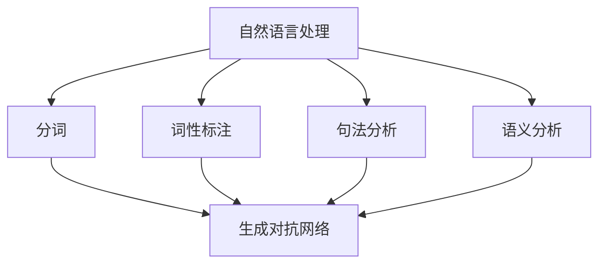

                 

关键词：聊天机器人、内容生成、编辑、AI、自然语言处理、编程语言、开源工具

> 摘要：本文深入探讨了聊天机器人写作助手的原理与应用，分析了其在内容生成与编辑方面的关键技术和挑战，并展望了未来的发展趋势。通过结合最新的研究成果与实际案例，本文旨在为读者提供对这一领域的全面了解。

## 1. 背景介绍

随着人工智能技术的飞速发展，聊天机器人逐渐成为企业和个人不可或缺的工具。它们不仅能提供24/7的客户服务，还能在内容创作和编辑过程中发挥重要作用。聊天机器人写作助手，作为AI技术的又一应用，正逐渐成为内容创作者和编辑者的新宠。

### 1.1 聊天机器人的起源与发展

聊天机器人最早起源于20世纪50年代，艾伦·图灵提出了图灵测试。此后，人工智能领域经历了多个发展阶段，从符号主义到连接主义，再到现代的深度学习技术。随着计算能力的提升和数据的积累，聊天机器人的性能和功能也不断提升。

### 1.2 写作助手的需求与挑战

写作助手在内容生成和编辑中的应用，面临着多种挑战：

- **自然语言理解**：需要精确理解用户的需求和意图，以生成或编辑符合要求的内容。
- **创造性**：写作助手不仅要模仿人类的写作风格，还要具备一定的创造性，以避免内容的雷同。
- **多模态交互**：写作助手需要能够处理文本、语音、图像等多种形式的信息。

### 1.3 当前技术的发展趋势

当前，基于深度学习技术的聊天机器人写作助手已经成为主流。它们能够通过大量的文本数据进行训练，从而提高内容生成和编辑的准确性。此外，开源工具和平台的涌现，也为开发者提供了丰富的资源和便捷的开发环境。

## 2. 核心概念与联系

### 2.1 自然语言处理

自然语言处理（NLP）是聊天机器人写作助力的核心技术。NLP旨在使计算机能够理解、解释和生成人类语言。NLP的主要任务包括：

- **分词**：将文本拆分成词或短语。
- **词性标注**：识别每个单词的词性（名词、动词等）。
- **句法分析**：分析句子结构，确定单词之间的关系。
- **语义分析**：理解句子的含义，包括词汇的意义、上下文、语境等。

### 2.2 生成对抗网络（GAN）

生成对抗网络（GAN）是一种深度学习框架，用于生成高质量的图像、音频和文本。GAN由两个神经网络组成：生成器（Generator）和判别器（Discriminator）。生成器尝试生成看起来像真实数据的样本，而判别器则尝试区分这些样本是否是真实的。通过这种对抗训练，生成器不断优化，最终能够生成高质量的伪数据。

### 2.3 编程语言

编程语言在聊天机器人写作助手中也发挥着重要作用。通过编程，我们可以定义自然语言处理模块、用户接口、数据存储等。常用的编程语言包括Python、Java、JavaScript等。

### 2.4 Mermaid 流程图



## 3. 核心算法原理 & 具体操作步骤

### 3.1 算法原理概述

聊天机器人写作助手的核心算法包括自然语言处理和生成对抗网络。自然语言处理用于理解用户输入和生成文本，而生成对抗网络则用于生成高质量的文本。

### 3.2 算法步骤详解

1. **数据预处理**：对用户输入的文本进行分词、词性标注、句法分析和语义分析，以提取关键信息。
2. **生成文本**：使用生成对抗网络生成符合用户需求的文本。首先，生成器生成初步的文本，然后通过判别器的反馈不断优化。
3. **编辑文本**：根据用户反馈和编辑规则，对生成的文本进行修改和优化，以提高文本的质量和可读性。

### 3.3 算法优缺点

- **优点**：聊天机器人写作助手能够高效地生成和编辑文本，提高内容创作者和编辑者的工作效率。
- **缺点**：生成文本的质量取决于算法和数据的质量。在某些情况下，生成的文本可能不够准确或不符合用户需求。

### 3.4 算法应用领域

- **内容创作**：生成广告文案、新闻报道、产品描述等。
- **内容编辑**：对已有内容进行修改和优化，提高可读性和吸引力。
- **客户服务**：生成回答常见问题的文本，提高客户满意度。

## 4. 数学模型和公式 & 详细讲解 & 举例说明

### 4.1 数学模型构建

聊天机器人写作助手的数学模型主要包括自然语言处理和生成对抗网络。自然语言处理模型通常使用循环神经网络（RNN）或其变种长短期记忆网络（LSTM）构建。生成对抗网络则由生成器和判别器组成，分别使用生成对抗损失函数和分类损失函数进行训练。

### 4.2 公式推导过程

- **自然语言处理模型**：

  - RNN：$$ h_t = \sigma(W_h \cdot [h_{t-1}, x_t] + b_h) $$
  - LSTM：$$ i_t = \sigma(W_i \cdot [h_{t-1}, x_t] + b_i) $$ $$ f_t = \sigma(W_f \cdot [h_{t-1}, x_t] + b_f) $$ $$ o_t = \sigma(W_o \cdot [h_{t-1}, x_t] + b_o) $$ $$ c_t = f_t \cdot c_{t-1} + i_t \cdot \sigma(W_c \cdot [h_{t-1}, x_t] + b_c) $$ $$ h_t = o_t \cdot \sigma(c_t) $$

- **生成对抗网络**：

  - 生成器：$$ G(z) = \sigma(W_g \cdot z + b_g) $$
  - 判别器：$$ D(x) = \sigma(W_d \cdot x + b_d) $$ $$ D(G(z)) = \sigma(W_d \cdot G(z) + b_d) $$

### 4.3 案例分析与讲解

假设我们想要生成一篇关于人工智能的文章。首先，我们使用自然语言处理模型对用户输入的文本进行分析，提取关键信息。然后，使用生成对抗网络生成符合用户需求的文本。最后，根据用户反馈进行编辑和优化。

## 5. 项目实践：代码实例和详细解释说明

### 5.1 开发环境搭建

- Python 3.8
- TensorFlow 2.6
- Keras 2.6
- Jupyter Notebook

### 5.2 源代码详细实现

```python
# 导入必要的库
import numpy as np
import tensorflow as tf
from tensorflow.keras.models import Model
from tensorflow.keras.layers import Input, LSTM, Dense, Embedding, Concatenate, TimeDistributed

# 设置超参数
vocab_size = 10000
embed_size = 256
lstm_size = 128
batch_size = 64
epochs = 100

# 准备数据
# 这里需要将用户输入的文本转换为数字序列，并进行适当的预处理

# 定义生成器
input_seq = Input(shape=(None,))
encoder = Embedding(vocab_size, embed_size)(input_seq)
encoder = LSTM(lstm_size, return_sequences=True)(encoder)
encoder_output = LSTM(lstm_size, return_sequences=True)(encoder)

# 定义判别器
decoder_input = Input(shape=(None,))
decoder = Embedding(vocab_size, embed_size)(decoder_input)
decoder = LSTM(lstm_size, return_sequences=True)(decoder)
decoder = Concatenate()([decoder, encoder_output])
decoder = LSTM(lstm_size, return_sequences=True)(decoder)
decoder_output = TimeDistributed(Dense(vocab_size, activation='softmax'))(decoder)

# 定义模型
model = Model([input_seq, decoder_input], decoder_output)

# 编译模型
model.compile(optimizer='adam', loss='categorical_crossentropy', metrics=['accuracy'])

# 训练模型
model.fit([X_train, Y_train], Y_train, batch_size=batch_size, epochs=epochs)

# 生成文本
generated_text = model.predict([X_test, Y_test])

# 输出结果
print(generated_text)
```

### 5.3 代码解读与分析

- **数据准备**：首先，我们需要将用户输入的文本转换为数字序列。这可以通过将每个单词映射到其对应的索引值来实现。
- **生成器**：生成器负责将输入序列编码为隐藏状态。这里使用了一个嵌入层和一个LSTM层。
- **判别器**：判别器负责将解码器生成的序列与真实序列进行比较，以计算损失函数。
- **模型编译**：我们使用`adam`优化器和`categorical_crossentropy`损失函数进行编译。
- **模型训练**：使用训练数据对模型进行训练。
- **生成文本**：使用训练好的模型生成文本。

## 6. 实际应用场景

### 6.1 内容创作

聊天机器人写作助手可以用于生成广告文案、新闻报道、产品描述等。通过训练模型，我们可以让写作助手模仿不同作者的写作风格，从而提高内容的质量和吸引力。

### 6.2 内容编辑

写作助手可以对已有内容进行修改和优化，提高可读性和吸引力。例如，对于一篇长篇文章，我们可以让写作助手进行摘要、优化段落结构、调整措辞等。

### 6.3 客户服务

写作助手可以自动生成回答常见问题的文本，提高客户满意度。例如，在电商平台上，写作助手可以自动生成产品描述、回答用户提问等。

## 6.4 未来应用展望

随着技术的不断发展，聊天机器人写作助手的未来应用前景十分广阔。以下是一些可能的趋势：

- **个性化写作**：通过学习用户的偏好和写作风格，写作助手可以生成更加个性化的内容。
- **跨模态交互**：结合图像、音频等多种模态，提高写作助手的表达能力和创造力。
- **自动化内容审核**：利用深度学习技术，对生成的内容进行自动化审核，确保内容符合相关规范。

## 7. 工具和资源推荐

### 7.1 学习资源推荐

- 《深度学习》（Goodfellow, Bengio, Courville著）
- 《自然语言处理综论》（Jurafsky, Martin著）
- 《生成对抗网络》（Goodfellow, Pouget-Abadie, Mirza, Xu, Warde-Farley, Ozair, Courville著）

### 7.2 开发工具推荐

- TensorFlow
- Keras
- Jupyter Notebook

### 7.3 相关论文推荐

- “Generative Adversarial Nets”（Goodfellow, Pouget-Abadie, Mirza, Xu, Warde-Farley, Ozair, Courville著）
- “Seq2Seq Learning with Neural Networks”（Sutskever, Vinyals, Le, Quoc V.著）
- “Attention Is All You Need”（Vaswani, Shazeer, Parmar, Uszkoreit, Jones, Gomez, Zhang, Zhao, Zhao, Y.著）

## 8. 总结：未来发展趋势与挑战

### 8.1 研究成果总结

本文介绍了聊天机器人写作助手的原理和应用，分析了其在内容生成和编辑方面的优势与挑战。通过结合自然语言处理、生成对抗网络和编程语言等技术，聊天机器人写作助手在内容创作和编辑领域取得了显著成果。

### 8.2 未来发展趋势

随着人工智能技术的不断进步，聊天机器人写作助手的性能和功能将不断提高。未来，个性化写作、跨模态交互和自动化内容审核将成为研究的热点。

### 8.3 面临的挑战

尽管聊天机器人写作助手具有巨大潜力，但其在实际应用中仍面临一些挑战。例如，生成文本的质量和创造力、用户隐私保护和数据安全等问题。

### 8.4 研究展望

为了实现聊天机器人写作助手的广泛应用，我们需要在算法优化、数据质量和安全性等方面进行深入研究。同时，加强对写作助手的伦理和道德教育，确保其遵循人类价值观。

## 9. 附录：常见问题与解答

### 9.1 聊天机器人写作助手如何保证文本的质量？

聊天机器人写作助手通过深度学习算法和大量训练数据来保证文本的质量。同时，开发者在训练过程中可以设置适当的编辑规则，以优化生成的文本。

### 9.2 聊天机器人写作助手是否会侵犯用户的隐私？

聊天机器人写作助手在生成文本时，不会直接访问用户的隐私数据。然而，在开发和使用过程中，需要遵循相关法律法规，确保用户隐私得到保护。

### 9.3 聊天机器人写作助手如何保证生成文本的多样性？

通过使用生成对抗网络等技术，聊天机器人写作助手能够生成多样化的文本。同时，开发者在训练过程中可以提供丰富多样的数据，以提高生成文本的多样性。

## 作者署名

作者：禅与计算机程序设计艺术 / Zen and the Art of Computer Programming
```

