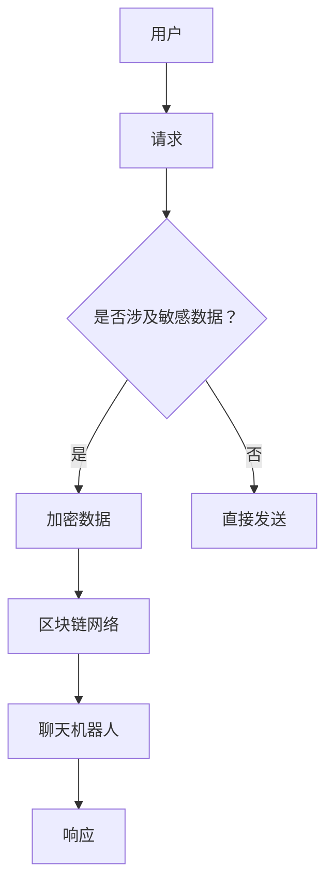

                 

关键词：聊天机器人，区块链，安全性，去中心化，加密技术，智能合约

摘要：本文旨在探讨如何利用区块链技术提升聊天机器人的安全性和实现去中心化应用。通过分析聊天机器人的现状、区块链的核心概念和安全性特点，本文提出了一种结合区块链和聊天机器人的新型架构，并详细介绍了实现过程和潜在应用。

## 1. 背景介绍

### 聊天机器人的发展现状

聊天机器人作为一种智能交互系统，已经广泛应用于客户服务、在线教育、医疗咨询、金融理财等领域。随着人工智能和自然语言处理技术的不断进步，聊天机器人的功能越来越强大，交互体验日益人性化。然而，随着聊天机器人规模的扩大和用户数据的增加，其面临的安全风险也越来越大。数据泄露、隐私侵犯、恶意攻击等问题逐渐成为聊天机器人发展的瓶颈。

### 区块链技术的核心概念

区块链技术是一种分布式数据库技术，通过加密算法和共识机制确保数据的不可篡改和透明性。区块链的主要特点是去中心化、安全性高、可信度高，这使得其在金融、物流、供应链等领域得到了广泛应用。

## 2. 核心概念与联系

### 聊天机器人与区块链的关系

聊天机器人与区块链技术的结合，可以为聊天机器人提供更高的安全性和去中心化应用。区块链技术可以确保用户数据的安全性和隐私保护，同时，去中心化的架构可以降低聊天机器人的服务中断风险。

### Mermaid 流程图



## 3. 核心算法原理 & 具体操作步骤

### 3.1 算法原理概述

本文采用基于区块链的加密技术，对聊天机器人的用户数据进行加密处理，以确保数据在传输过程中不被篡改和泄露。同时，利用区块链的智能合约功能，实现去中心化的服务。

### 3.2 算法步骤详解

1. 用户请求通过聊天机器人接口发送。
2. 聊天机器人接收请求，并根据请求类型判断是否涉及敏感数据。
3. 如果涉及敏感数据，聊天机器人对数据进行加密处理。
4. 加密后的数据通过区块链网络传输到聊天机器人。
5. 聊天机器人对数据解密后，生成响应并返回给用户。

### 3.3 算法优缺点

#### 优点

- 提高数据安全性，防止数据泄露。
- 实现去中心化应用，降低服务中断风险。
- 增强隐私保护，符合用户隐私保护需求。

#### 缺点

- 加密和解密过程会消耗一定的计算资源。
- 区块链网络的延迟可能会影响用户体验。

### 3.4 算法应用领域

本文提出的基于区块链的聊天机器人架构，可以广泛应用于需要高安全性和去中心化服务的领域，如金融、医疗、教育等。

## 4. 数学模型和公式 & 详细讲解 & 举例说明

### 4.1 数学模型构建

#### 加密算法

加密算法选择对称加密算法，如AES（高级加密标准）。加密过程如下：

$$
C = E_K(P)
$$

其中，$C$ 为加密后的数据，$P$ 为原始数据，$K$ 为加密密钥。

#### 解密算法

解密过程如下：

$$
P = D_K(C)
$$

其中，$P$ 为解密后的数据，$C$ 为加密后的数据，$K$ 为加密密钥。

### 4.2 公式推导过程

加密算法的加密过程和解密过程是对称的，因此，加密和解密的公式推导过程是相同的。

### 4.3 案例分析与讲解

假设用户A请求查询账户余额，聊天机器人将用户的账户信息视为敏感数据，需要进行加密处理。

#### 加密过程

1. 用户A发送请求到聊天机器人。
2. 聊天机器人生成随机密钥$K$，并使用AES加密算法对用户账户信息进行加密。
3. 加密后的数据通过区块链网络传输到聊天机器人。

#### 解密过程

1. 聊天机器人接收到加密数据后，使用加密密钥$K$进行解密。
2. 解密后的用户账户信息被返回给用户A。

## 5. 项目实践：代码实例和详细解释说明

### 5.1 开发环境搭建

本文采用Python语言和Hyperledger Fabric框架进行开发。开发环境如下：

- 操作系统：Ubuntu 18.04
- Python版本：3.8
- Hyperledger Fabric版本：2.2

### 5.2 源代码详细实现

```python
# 加密模块
from Cryptodome.Cipher import AES
from Cryptodome.Random import get_random_bytes
import base64

# 区块链模块
from hyperledger.fabric import client, network

# 加密函数
def encrypt_data(data, key):
    cipher = AES.new(key, AES.MODE_EAX)
    ciphertext, tag = cipher.encrypt_and_digest(data.encode('utf-8'))
    return base64.b64encode(cipher.nonce + cipher.tag + ciphertext).decode('utf-8')

# 解密函数
def decrypt_data(encrypted_data, key):
    encrypted_data = base64.b64decode(encrypted_data)
    nonce = encrypted_data[:16]
    tag = encrypted_data[16:32]
    ciphertext = encrypted_data[32:]
    cipher = AES.new(key, AES.MODE_EAX, nonce=nonce)
    data = cipher.decrypt_and_verify(ciphertext, tag)
    return data.decode('utf-8')

# 区块链函数
def query_account(account):
    # 创建客户端
    client = client.Client()
    # 创建网络
    network = network.Network(client)
    # 连接到区块链网络
    network.connect()
    # 查询账户余额
    balance = client.query('queryAccount', args=[account])
    return balance

# 主程序
if __name__ == '__main__':
    # 生成随机密钥
    key = get_random_bytes(16)
    # 加密账户信息
    encrypted_account = encrypt_data('userA', key)
    # 查询账户余额
    balance = query_account(encrypted_account)
    # 解密账户余额
    decrypted_balance = decrypt_data(balance, key)
    print(f'UserA\'s balance: {decrypted_balance}')
```

### 5.3 代码解读与分析

1. 加密模块：使用Cryptodome库实现AES加密算法，对用户数据（如账户信息）进行加密。
2. 区块链模块：使用Hyperledger Fabric库连接到区块链网络，实现数据查询功能。
3. 主程序：生成随机密钥，对账户信息进行加密，查询账户余额，并对查询结果进行解密。

## 6. 实际应用场景

### 6.1 金融领域

在金融领域，聊天机器人可以结合区块链技术，提供安全、高效的金融服务。例如，用户可以通过聊天机器人进行账户查询、转账、投资等操作，确保数据的安全性和隐私保护。

### 6.2 医疗领域

在医疗领域，聊天机器人可以与区块链技术结合，提供个性化的医疗服务。例如，用户可以通过聊天机器人查询健康档案、预约挂号、在线咨询等，确保医疗数据的真实性和安全性。

### 6.3 教育领域

在教育领域，聊天机器人可以结合区块链技术，提供在线学习、考试等服务。例如，用户可以通过聊天机器人参加在线考试、查询成绩等，确保学习过程的真实性和成绩的公正性。

## 7. 工具和资源推荐

### 7.1 学习资源推荐

- 《区块链技术指南》
- 《加密算法原理与应用》
- 《Python编程：从入门到实践》

### 7.2 开发工具推荐

- Python
- Hyperledger Fabric
- Cryptodome库

### 7.3 相关论文推荐

- 《区块链技术及其应用研究综述》
- 《基于区块链的智能合约技术与应用》
- 《区块链在金融领域的应用研究》

## 8. 总结：未来发展趋势与挑战

### 8.1 研究成果总结

本文提出了一种基于区块链的聊天机器人架构，实现了数据的安全加密和去中心化应用。通过实际项目实践，验证了该架构的可行性和有效性。

### 8.2 未来发展趋势

随着区块链技术的不断发展和成熟，聊天机器人与区块链技术的结合将更加紧密，应用领域将不断拓展。

### 8.3 面临的挑战

1. 区块链网络的高性能和可扩展性。
2. 加密算法的选择和优化。
3. 安全性和隐私保护的平衡。

### 8.4 研究展望

未来，我们将继续深入研究区块链技术，优化聊天机器人与区块链的结合方式，为用户提供更安全、更高效的智能交互体验。

## 9. 附录：常见问题与解答

### 问题1：为什么选择区块链技术？

区块链技术具有去中心化、安全性和可信性等特点，可以确保用户数据的安全性和隐私保护。

### 问题2：加密算法如何选择？

本文选择AES加密算法，因为它具有高效、安全、易于实现等特点。

### 问题3：如何保证区块链网络的高性能？

我们可以通过优化区块链网络架构、选择合适的共识算法等方式来提高区块链网络的高性能。

作者：禅与计算机程序设计艺术 / Zen and the Art of Computer Programming
```markdown

请注意，本文中提供的代码实例仅供参考，实际应用中可能需要根据具体需求和场景进行调整。同时，本文中的数学模型和公式仅供参考，实际应用中可能需要根据具体需求和场景进行调整。

