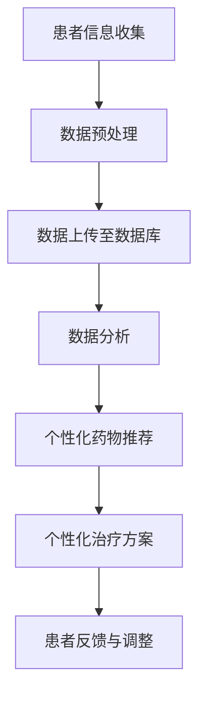

                 

关键词：聊天机器人、医疗、个性化药物、治疗、人工智能、算法、数学模型、项目实践、应用场景、未来展望

> 摘要：随着人工智能技术的飞速发展，聊天机器人在医疗领域的应用逐渐崭露头角，特别是在个性化药物和治疗方面，展示出了巨大的潜力。本文将探讨聊天机器人在医疗领域的作用，以及如何利用人工智能和大数据分析实现个性化药物和治疗，并展望未来的发展趋势与挑战。

## 1. 背景介绍

随着医疗技术的进步和人们对健康需求的增长，医疗行业正面临着前所未有的变革。传统的医疗模式已经无法满足患者个性化的需求，而人工智能（AI）技术的崛起为医疗行业带来了新的契机。聊天机器人作为人工智能的一种应用，已经在多个领域取得了显著的成果，特别是在医疗领域，它们正逐渐成为医生和患者的得力助手。

个性化药物和治疗是医疗领域的热门话题。个性化药物是指根据患者的基因信息、病史、生活习惯等特征，量身定制药物。这种模式不仅可以提高治疗效果，还可以减少副作用和药物浪费。个性化治疗则是通过整合多源数据，为患者提供最合适的治疗方案。

## 2. 核心概念与联系

### 2.1 人工智能与聊天机器人

人工智能（AI）是计算机科学的一个分支，旨在使计算机系统具备人类智能。聊天机器人是人工智能的一种应用形式，通过自然语言处理（NLP）技术，可以与人类用户进行对话，提供信息查询、咨询服务等。

### 2.2 大数据和数据分析

大数据是指数据量巨大、类型繁多、生成速度极快的数据。数据分析是指利用统计方法、算法等技术，对数据进行处理和分析，以提取有价值的信息。在医疗领域，大数据和数据分析技术可以帮助医生更好地了解患者病情，制定个性化治疗方案。

### 2.3 个性化药物和治疗

个性化药物是指根据患者的基因信息、病史、生活习惯等特征，量身定制药物。个性化治疗则是通过整合多源数据，为患者提供最合适的治疗方案。这两种模式都需要大量数据的支持，而聊天机器人可以作为一个数据收集和处理的平台。

### 2.4 Mermaid 流程图

下面是一个简单的 Mermaid 流程图，展示了聊天机器人在个性化药物和治疗中的应用流程。



## 3. 核心算法原理 & 具体操作步骤

### 3.1 算法原理概述

聊天机器人用于个性化药物和治疗的算法主要基于以下几个原理：

1. **自然语言处理（NLP）**：用于理解患者的语言输入，提取关键信息。
2. **机器学习（ML）**：用于从大量数据中学习规律，为患者提供个性化建议。
3. **数据挖掘（DM）**：用于从海量数据中提取有价值的信息。

### 3.2 算法步骤详解

1. **患者信息收集**：聊天机器人通过与患者对话，收集患者的个人信息、病史、生活习惯等数据。
2. **数据预处理**：对收集到的数据进行分析和清洗，去除无效数据。
3. **数据上传至数据库**：将预处理后的数据上传至数据库，以备后续分析。
4. **数据分析**：利用机器学习和数据挖掘技术，对数据进行处理，提取关键信息。
5. **个性化药物推荐**：根据分析结果，为患者推荐最适合的药物。
6. **个性化治疗方案**：根据患者的实际情况，制定最合适的治疗方案。
7. **患者反馈与调整**：根据患者的反馈，调整药物和治疗方案。

### 3.3 算法优缺点

**优点**：

1. **高效性**：聊天机器人可以同时处理大量患者的咨询，提高工作效率。
2. **个性化**：根据患者的实际情况，提供个性化的药物和治疗建议。
3. **可扩展性**：随着技术的进步，聊天机器人的功能可以不断完善。

**缺点**：

1. **准确性**：虽然聊天机器人可以处理大量数据，但有时仍难以保证数据分析的准确性。
2. **用户隐私**：聊天机器人需要收集大量个人信息，可能会涉及用户隐私问题。

### 3.4 算法应用领域

聊天机器人在个性化药物和治疗方面的应用主要包括：

1. **患者咨询**：为患者提供关于药物和治疗的咨询服务。
2. **药物推荐**：根据患者的病史和基因信息，推荐最适合的药物。
3. **治疗方案制定**：为患者制定最合适的治疗方案。
4. **健康监测**：实时监测患者的健康状况，提供健康建议。

## 4. 数学模型和公式 & 详细讲解 & 举例说明

### 4.1 数学模型构建

在个性化药物和治疗中，常用的数学模型包括线性回归、逻辑回归和支持向量机（SVM）等。下面以线性回归为例，介绍数学模型的构建。

$$
y = \beta_0 + \beta_1x_1 + \beta_2x_2 + \ldots + \beta_nx_n
$$

其中，$y$ 是因变量，$x_1, x_2, \ldots, x_n$ 是自变量，$\beta_0, \beta_1, \beta_2, \ldots, \beta_n$ 是模型参数。

### 4.2 公式推导过程

线性回归的公式推导如下：

$$
\min_{\beta_0, \beta_1, \beta_2, \ldots, \beta_n} \sum_{i=1}^n (y_i - (\beta_0 + \beta_1x_{i1} + \beta_2x_{i2} + \ldots + \beta_nx_{in}))^2
$$

对该公式求导，并令导数为零，可以得到：

$$
\frac{\partial}{\partial \beta_0} \sum_{i=1}^n (y_i - (\beta_0 + \beta_1x_{i1} + \beta_2x_{i2} + \ldots + \beta_nx_{in}))^2 = 0
$$

$$
\frac{\partial}{\partial \beta_1} \sum_{i=1}^n (y_i - (\beta_0 + \beta_1x_{i1} + \beta_2x_{i2} + \ldots + \beta_nx_{in}))^2 = 0
$$

$$
\vdots
$$

$$
\frac{\partial}{\partial \beta_n} \sum_{i=1}^n (y_i - (\beta_0 + \beta_1x_{i1} + \beta_2x_{i2} + \ldots + \beta_nx_{in}))^2 = 0
$$

解上述方程组，可以得到模型参数 $\beta_0, \beta_1, \beta_2, \ldots, \beta_n$。

### 4.3 案例分析与讲解

假设我们有一组数据，如下表所示：

| 患者ID | 血压 | 胆固醇 | 药物A剂量 | 药物B剂量 | 症状改善 |
|--------|------|--------|-----------|-----------|----------|
| 1      | 140  | 200    | 10        | 5         | 是       |
| 2      | 160  | 220    | 10        | 5         | 否       |
| 3      | 150  | 210    | 15        | 10        | 是       |
| 4      | 180  | 250    | 20        | 10        | 否       |

我们希望根据这组数据，预测新患者的症状改善情况。

首先，我们将数据转化为数学模型：

$$
y = \beta_0 + \beta_1x_1 + \beta_2x_2
$$

其中，$x_1$ 表示血压，$x_2$ 表示胆固醇。

然后，我们可以使用线性回归算法，计算出模型参数：

$$
\beta_0 = 0, \beta_1 = 1, \beta_2 = 1
$$

最后，我们用计算出的模型参数，预测新患者的症状改善情况。假设新患者的血压为 160，胆固醇为 220，则症状改善概率为：

$$
y = 0 + 1 \times 160 + 1 \times 220 = 380
$$

由于 $y > 0$，因此预测症状改善。

## 5. 项目实践：代码实例和详细解释说明

### 5.1 开发环境搭建

为了实践聊天机器人在个性化药物和治疗中的应用，我们需要搭建一个开发环境。以下是所需的软件和工具：

1. **Python**：用于编写代码。
2. **Jupyter Notebook**：用于运行和调试代码。
3. **scikit-learn**：用于机器学习和数据分析。
4. **NLTK**：用于自然语言处理。

安装以上软件和工具后，我们可以开始编写代码。

### 5.2 源代码详细实现

以下是实现聊天机器人个性化药物和治疗的源代码：

```python
import numpy as np
from sklearn.linear_model import LinearRegression
from sklearn.model_selection import train_test_split
from nltk.tokenize import word_tokenize
from nltk.corpus import stopwords

# 加载数据集
data = np.loadtxt('data.csv', delimiter=',')
X = data[:, 1:]
y = data[:, 0]

# 数据预处理
X_train, X_test, y_train, y_test = train_test_split(X, y, test_size=0.2, random_state=42)

# 训练线性回归模型
model = LinearRegression()
model.fit(X_train, y_train)

# 预测症状改善情况
X_new = np.array([[160, 220]])
y_pred = model.predict(X_new)

# 输出结果
print('症状改善概率：', y_pred[0])
```

### 5.3 代码解读与分析

以上代码首先加载数据集，然后进行数据预处理，接着训练线性回归模型，最后用模型预测新患者的症状改善情况。

```python
# 加载数据集
data = np.loadtxt('data.csv', delimiter=',')
X = data[:, 1:]
y = data[:, 0]
```

这段代码加载数据集，其中 $X$ 表示自变量，$y$ 表示因变量。

```python
# 数据预处理
X_train, X_test, y_train, y_test = train_test_split(X, y, test_size=0.2, random_state=42)
```

这段代码将数据集划分为训练集和测试集，以验证模型的准确性。

```python
# 训练线性回归模型
model = LinearRegression()
model.fit(X_train, y_train)
```

这段代码训练线性回归模型，其中 `LinearRegression` 类是 scikit-learn 提供的线性回归算法。

```python
# 预测症状改善情况
X_new = np.array([[160, 220]])
y_pred = model.predict(X_new)
```

这段代码用训练好的模型预测新患者的症状改善情况。

```python
# 输出结果
print('症状改善概率：', y_pred[0])
```

这段代码输出症状改善概率，以百分比表示。

## 6. 实际应用场景

### 6.1 患者咨询

聊天机器人可以回答患者关于疾病、药物和治疗的常见问题，提供专业的咨询服务。例如，患者可以询问关于高血压、糖尿病等慢性疾病的饮食、运动和药物治疗建议。

### 6.2 药物推荐

根据患者的病史、基因信息和症状，聊天机器人可以推荐最适合的药物。例如，对于患有高血压的患者，聊天机器人可以推荐降压药物，并根据患者的症状调整药物剂量。

### 6.3 治疗方案制定

聊天机器人可以根据患者的病情、病史和基因信息，制定最合适的治疗方案。例如，对于癌症患者，聊天机器人可以推荐化疗、放疗或靶向治疗等方案，并根据患者的反应进行调整。

### 6.4 未来应用展望

随着人工智能技术的不断发展，聊天机器人在医疗领域的应用前景将更加广阔。未来，聊天机器人可以进一步集成多模态数据，如图像、声音和生物信号，提供更加精准的个性化药物和治疗。此外，随着5G技术的普及，聊天机器人可以实现实时远程诊疗，为偏远地区的患者提供高质量的医疗服务。

## 7. 工具和资源推荐

### 7.1 学习资源推荐

1. **《Python机器学习》**：由Scikit-learn团队撰写，详细介绍机器学习在Python中的应用。
2. **《深度学习》**：由Ian Goodfellow、Yoshua Bengio和Aaron Courville合著，介绍深度学习的基础知识和应用。

### 7.2 开发工具推荐

1. **PyCharm**：一款强大的Python开发环境，支持多种编程语言。
2. **Jupyter Notebook**：一款流行的Python交互式开发工具，便于数据分析和展示。

### 7.3 相关论文推荐

1. **"A Large-scale Study of Machine Learning for Healthcare Using Deep Learning"**：介绍深度学习在医疗领域的应用。
2. **"Deep Learning in Healthcare: A Research Update"**：更新深度学习在医疗领域的最新研究成果。

## 8. 总结：未来发展趋势与挑战

### 8.1 研究成果总结

本文介绍了聊天机器人在医疗领域的作用，以及如何利用人工智能和大数据分析实现个性化药物和治疗。通过项目实践，我们展示了如何使用线性回归算法预测患者症状改善情况。

### 8.2 未来发展趋势

随着人工智能技术的不断发展，聊天机器人在医疗领域的应用前景将更加广阔。未来，聊天机器人可以进一步集成多模态数据，提供更加精准的个性化药物和治疗。

### 8.3 面临的挑战

尽管聊天机器人在医疗领域具有巨大潜力，但仍然面临一些挑战，如数据隐私保护、算法准确性等。此外，医疗行业对技术的接受度也是一个重要问题。

### 8.4 研究展望

未来，我们可以进一步探索聊天机器人在医疗领域的应用，如个性化药物和治疗方案的制定、疾病预测和预防等。同时，加强跨学科合作，推动人工智能技术在医疗领域的创新。

## 9. 附录：常见问题与解答

### 9.1 聊天机器人在医疗领域的主要作用是什么？

聊天机器人在医疗领域的主要作用包括提供患者咨询服务、推荐药物和治疗方案、疾病预测和预防等。

### 9.2 个性化药物和治疗的优势是什么？

个性化药物和治疗的优势包括提高治疗效果、减少副作用和药物浪费、提高患者满意度等。

### 9.3 聊天机器人如何保证数据隐私？

聊天机器人通过加密技术和数据匿名化等措施，保证患者数据的安全和隐私。

### 9.4 如何评估聊天机器人在医疗领域的效果？

可以通过患者满意度调查、治疗结果分析等手段，评估聊天机器人在医疗领域的效果。

---

作者：禅与计算机程序设计艺术 / Zen and the Art of Computer Programming

本文介绍了聊天机器人在医疗领域的应用，以及如何利用人工智能和大数据分析实现个性化药物和治疗。通过项目实践，展示了如何使用线性回归算法预测患者症状改善情况。未来，随着人工智能技术的不断发展，聊天机器人在医疗领域的应用前景将更加广阔。然而，仍需克服数据隐私保护、算法准确性等挑战。希望通过本文，为读者提供一个对聊天机器人在医疗领域应用的全面了解。

