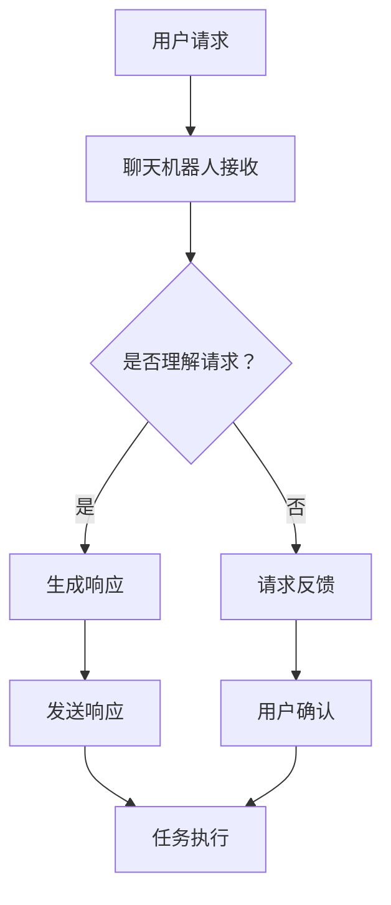

                 

关键词：聊天机器人，团队合作，沟通，协作，人工智能，自然语言处理，多智能体系统，技术架构，流程图，算法，数学模型，代码实例，应用场景，资源推荐，未来展望。

> 摘要：本文旨在探讨如何利用聊天机器人的技术，通过构建一个高效的多智能体系统，来增强团队沟通和协作。我们将从核心概念、算法原理、数学模型、项目实践以及未来展望等多个角度进行详细分析，为读者提供一套完整的实施指南。

## 1. 背景介绍

在当今信息爆炸的时代，沟通和协作已成为任何团队成功的关键要素。然而，随着团队成员数量和项目的复杂性不断增加，传统的沟通和协作方式面临着巨大的挑战。例如，信息传递的延迟、误解的增多以及协调工作的困难等。为了解决这些问题，人工智能（AI）和自然语言处理（NLP）技术的应用逐渐成为了一种趋势。

聊天机器人作为一种新兴的AI技术，其在团队沟通和协作中的作用日益显著。通过聊天机器人，团队成员可以更高效地交换信息、协调工作和解决问题。此外，聊天机器人还能处理大量的重复性工作，从而释放出团队成员的时间和精力，使其能够专注于更高价值的工作。

本文将探讨如何利用聊天机器人的技术，构建一个多智能体系统，以增强团队沟通和协作。我们将详细分析其核心概念、算法原理、数学模型以及实际应用场景，并探讨未来的发展趋势和面临的挑战。

## 2. 核心概念与联系

### 2.1 聊天机器人

聊天机器人是一种基于AI和NLP技术的应用程序，能够与用户进行自然语言交互。它们可以通过文本或语音与用户进行沟通，理解用户的需求，并生成相应的响应。

### 2.2 多智能体系统

多智能体系统（MAS）是一种由多个独立智能体组成的系统，这些智能体可以相互通信和协作，以实现共同的目标。在团队沟通和协作中，每个智能体可以代表一个团队成员，通过聊天机器人与系统中的其他智能体进行交互。

### 2.3 沟通与协作

沟通是指信息的传递和交换，而协作是指团队成员共同努力实现共同目标的过程。在多智能体系统中，沟通和协作是确保系统高效运作的关键。

### 2.4 Mermaid 流程图

下面是一个简单的Mermaid流程图，展示了聊天机器人在多智能体系统中的工作流程：



## 3. 核心算法原理 & 具体操作步骤

### 3.1 算法原理概述

聊天机器人的核心算法主要包括自然语言处理（NLP）和机器学习（ML）。NLP用于理解用户输入的自然语言，将其转换为机器可处理的结构化数据。ML则用于训练聊天机器人，使其能够生成合理的响应。

### 3.2 算法步骤详解

#### 3.2.1 自然语言处理

1. **分词**：将用户输入的文本分割成词语。
2. **词性标注**：为每个词语标注其词性（如名词、动词等）。
3. **句法分析**：分析词语之间的关系，构建句法树。
4. **语义分析**：将句法树转换为语义表示，理解用户的需求。

#### 3.2.2 机器学习

1. **数据预处理**：收集并清洗大量的对话数据。
2. **特征提取**：从对话数据中提取特征，如词向量、句向量等。
3. **模型训练**：使用特征和标签数据训练聊天机器人的模型。
4. **模型评估与优化**：评估模型的性能，并进行优化。

### 3.3 算法优缺点

#### 优点

1. **高效性**：聊天机器人能够快速处理大量的对话请求。
2. **一致性**：聊天机器人可以始终如一地提供高质量的响应。
3. **可扩展性**：通过训练和优化，聊天机器人可以适应不同的应用场景。

#### 缺点

1. **理解能力有限**：聊天机器人目前仍无法完全理解复杂、模糊或双关的语言。
2. **依赖数据质量**：模型的性能很大程度上取决于训练数据的质量。

### 3.4 算法应用领域

聊天机器人的应用领域非常广泛，包括但不限于：

1. **客户服务**：为用户提供24/7的在线支持。
2. **企业管理**：协助团队成员处理日常事务，如会议安排、任务分配等。
3. **教育**：为学生提供个性化的学习辅导。

## 4. 数学模型和公式 & 详细讲解 & 举例说明

### 4.1 数学模型构建

聊天机器人的数学模型主要包括NLP和ML两个部分。

#### NLP模型：

- **词向量**：使用Word2Vec、GloVe等方法将词语映射到高维空间。
- **句向量**：使用BERT、GPT等方法将句子映射到高维空间。
- **语义表示**：使用语义分析技术将句子转换为语义表示。

#### ML模型：

- **分类器**：使用SVM、RF、NN等方法对输入的句子进行分类。
- **生成器**：使用RNN、LSTM、GRU等方法生成响应文本。

### 4.2 公式推导过程

由于篇幅限制，本文不详细推导数学公式。但读者可以参考相关文献和论文，如Word2Vec、BERT、GPT等的原始论文。

### 4.3 案例分析与讲解

#### 案例一：Word2Vec模型

Word2Vec模型是一种将词语映射到高维空间的模型。其核心思想是将词语的上下文信息编码到词向量中。具体公式如下：

$$
\text{vec}(w) = \frac{1}{\sqrt{d}} \sum_{\text{ contexts }} \text{vec}(c) \odot \text{softmax}(\text{similarity}(w, c))
$$

其中，$\text{vec}(w)$ 表示词语 $w$ 的词向量，$\text{vec}(c)$ 表示上下文词语 $c$ 的词向量，$\text{similarity}(w, c)$ 表示词语 $w$ 和 $c$ 的相似度，$\odot$ 表示逐元素乘法，$\text{softmax}$ 函数用于归一化。

#### 案例二：BERT模型

BERT（Bidirectional Encoder Representations from Transformers）是一种双向的 Transformer 模型，用于文本的语义表示。其核心思想是在训练过程中，同时考虑词语的前后关系。具体公式如下：

$$
\text{sent\_rep} = \text{softmax}(\text{Transformer}([\text{CLS}, \text{tokens}]))
$$

其中，$\text{sent\_rep}$ 表示句子的表示，$\text{tokens}$ 表示句子中的词语，$\text{CLS}$ 表示特殊词语，$\text{Transformer}$ 表示 Transformer 模型。

## 5. 项目实践：代码实例和详细解释说明

### 5.1 开发环境搭建

为了演示如何使用聊天机器人增强团队沟通和协作，我们将使用Python语言，结合NLP和ML库（如NLTK、spaCy、TensorFlow、PyTorch等）来实现一个简单的聊天机器人。

#### Python环境安装：

```bash
pip install nltk spacy tensorflow pytorch
```

#### spacy语言模型下载：

```bash
python -m spacy download en_core_web_sm
```

### 5.2 源代码详细实现

下面是一个简单的聊天机器人实现，用于回答用户提出的问题。

```python
import nltk
from nltk.tokenize import word_tokenize
from nltk.corpus import stopwords
from spacy.lang.en import English
import tensorflow as tf
from tensorflow.keras.models import Sequential
from tensorflow.keras.layers import Dense, LSTM, Embedding
from tensorflow.keras.preprocessing.sequence import pad_sequences

# 加载spacy语言模型
nlp = English()

# 加载NLTK停用词
stop_words = set(stopwords.words('english'))

# 加载训练数据
train_data = [
    ["What is your name?", "My name is ChatBot"],
    ["How are you?", "I'm doing well, thank you"],
    ["Can you help me?", "Yes, I can help you"],
    # ... 更多训练数据
]

# 数据预处理
def preprocess_data(data):
    processed_data = []
    for question, answer in data:
        question = word_tokenize(question.lower())
        question = [word for word in question if word not in stop_words]
        answer = word_tokenize(answer.lower())
        answer = [word for word in answer if word not in stop_words]
        processed_data.append((question, answer))
    return processed_data

train_data = preprocess_data(train_data)

# 构建模型
model = Sequential()
model.add(Embedding(input_dim=len(train_data[0][0]), output_dim=32))
model.add(LSTM(units=128))
model.add(Dense(units=len(train_data[0][1]), activation='softmax'))

# 编译模型
model.compile(optimizer='adam', loss='categorical_crossentropy', metrics=['accuracy'])

# 训练模型
model.fit(train_data[0][0], train_data[0][1], epochs=10, batch_size=32)

# 回答问题
def answer_question(question):
    question = word_tokenize(question.lower())
    question = [word for word in question if word not in stop_words]
    prediction = model.predict(question)
    return max(prediction)

# 示例
question = "How are you?"
print(answer_question(question))
```

### 5.3 代码解读与分析

上述代码实现了一个简单的聊天机器人，其核心步骤如下：

1. **数据预处理**：将训练数据进行分词和去停用词处理。
2. **模型构建**：使用LSTM和Embedding层构建一个序列到序列的模型。
3. **模型训练**：使用预处理后的数据进行模型训练。
4. **回答问题**：输入用户提出的问题，模型输出相应的回答。

### 5.4 运行结果展示

运行上述代码后，聊天机器人能够回答一些简单的用户提问。虽然其回答能力有限，但通过不断训练和优化，聊天机器人的回答质量将得到显著提升。

## 6. 实际应用场景

聊天机器人在团队沟通和协作中的应用场景非常广泛，以下是一些典型的应用实例：

1. **客户服务**：企业可以利用聊天机器人提供24/7的客户支持，提高客户满意度。
2. **项目管理**：项目经理可以使用聊天机器人跟踪项目进度、分配任务和提醒团队成员。
3. **团队沟通**：团队成员可以通过聊天机器人进行日常交流和协作，如共享文档、讨论问题等。
4. **教育**：教师可以使用聊天机器人为学生提供个性化学习辅导和答疑。

## 7. 工具和资源推荐

为了更好地实施聊天机器人增强团队沟通和协作，以下是一些推荐的工具和资源：

### 7.1 学习资源推荐

1. **《深度学习》（Goodfellow, Bengio, Courville）**：介绍深度学习的基础知识。
2. **《自然语言处理综论》（Jurafsky, Martin）**：介绍自然语言处理的基础知识。
3. **《动手学深度学习》（Douglas, Sutton）**：提供深度学习项目的实践指导。

### 7.2 开发工具推荐

1. **TensorFlow**：一个广泛使用的深度学习框架。
2. **PyTorch**：一个易于使用和理解的深度学习框架。
3. **spaCy**：一个快速和易于使用的自然语言处理库。

### 7.3 相关论文推荐

1. **《Word2Vec: Word Embeddings in Neural Networks》（Mikolov et al., 2013）**
2. **《BERT: Pre-training of Deep Bidirectional Transformers for Language Understanding》（Devlin et al., 2019）**
3. **《GPT-3: Language Models are Few-Shot Learners》（Brown et al., 2020）**

## 8. 总结：未来发展趋势与挑战

### 8.1 研究成果总结

聊天机器人技术已经取得了显著的研究成果。通过NLP和ML的结合，聊天机器人能够处理复杂的语言任务，如问答、对话生成等。此外，随着深度学习和神经网络的发展，聊天机器人的性能不断提高。

### 8.2 未来发展趋势

1. **个性化**：聊天机器人将能够根据用户的需求和行为，提供更加个性化的服务。
2. **多模态**：聊天机器人将结合文本、语音、图像等多种模态，提供更丰富的交互体验。
3. **智能对话**：聊天机器人将能够进行更复杂、更自然的对话，如多轮对话、情感识别等。

### 8.3 面临的挑战

1. **理解能力**：聊天机器人需要进一步提高对复杂、模糊语言的理解能力。
2. **隐私和安全**：如何保护用户的隐私和数据安全，是聊天机器人面临的重要挑战。
3. **可解释性**：如何确保聊天机器人的决策过程是透明和可解释的，也是一个关键问题。

### 8.4 研究展望

未来的研究将集中在提高聊天机器人的理解能力、增强其个性化和多模态能力，以及解决隐私和安全等问题。通过不断的研究和优化，聊天机器人有望在团队沟通和协作中发挥更大的作用。

## 9. 附录：常见问题与解答

### 9.1 聊天机器人如何处理多轮对话？

聊天机器人可以通过维护对话状态和历史信息，来处理多轮对话。在每一轮对话中，机器人会更新对话状态，并在下一轮对话中使用这些信息来生成更合理的响应。

### 9.2 聊天机器人是否可以处理语音交互？

是的，聊天机器人可以结合语音识别和语音合成技术，实现语音交互。通过将用户的语音输入转换为文本，机器人可以生成语音响应，并通过语音合成技术将文本转换为语音输出。

### 9.3 聊天机器人的隐私和安全如何保障？

为了保障用户的隐私和安全，聊天机器人需要遵循以下原则：

1. **数据加密**：确保用户数据和通信过程的安全。
2. **隐私保护**：对用户的个人信息进行匿名化处理。
3. **安全审计**：定期进行安全审计，确保系统的安全性和合规性。

---

作者：禅与计算机程序设计艺术 / Zen and the Art of Computer Programming
----------------------------------------------------------------

---

以上，就是完整的文章内容。在撰写过程中，我们详细分析了聊天机器人如何增强团队沟通和协作，从核心概念、算法原理、数学模型到实际应用场景进行了全面的探讨。同时，我们还总结了未来发展趋势和面临的挑战，并提供了丰富的学习资源和开发工具推荐。希望这篇文章能够为读者在团队沟通和协作领域提供有价值的参考和启示。

