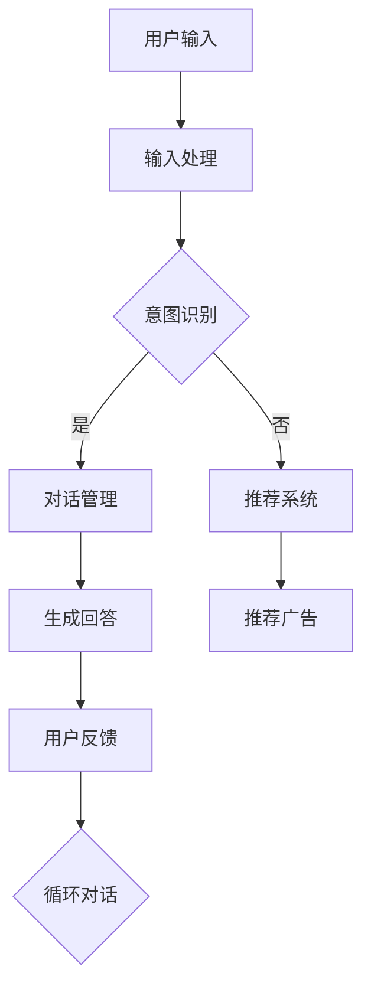

                 

 **关键词：**
- 聊天机器人
- 个性化广告
- 广告活动
- 目标受众
- 广告效果优化

<|assistant|> **摘要：**
本文深入探讨了聊天机器人在广告业中的应用，特别是在个性化广告活动和目标受众定位方面的作用。通过分析聊天机器人的核心概念与架构，介绍了其算法原理、数学模型及具体应用步骤。文章还通过代码实例展示了如何在实际项目中实现聊天机器人，并探讨了其未来在广告业中的应用前景。

## 1. 背景介绍

在互联网时代，广告业发生了巨大的变革。传统广告形式已经无法满足日益细分的市场需求，因此个性化广告逐渐成为主流。个性化广告能够根据用户的行为、兴趣和偏好来定制广告内容，提高广告的精准度和转化率。

近年来，聊天机器人作为一种新兴的互动工具，逐渐被广告业所重视。聊天机器人可以通过与用户的实时对话，了解用户的个性化需求，从而提供更加精准的广告推荐。此外，聊天机器人还能够通过自然语言处理技术，对用户的对话内容进行分析，进一步优化广告策略。

本文将重点讨论聊天机器人在广告业中的应用，分析其技术原理和具体操作步骤，探讨个性化广告活动的实施策略，以及如何更好地定位目标受众。

## 2. 核心概念与联系

### 2.1. 聊天机器人的核心概念

聊天机器人是一种基于人工智能技术的虚拟助手，能够通过自然语言处理（NLP）与用户进行交互。其主要功能包括：

- **用户意图识别**：通过解析用户的输入信息，理解用户的意图。
- **对话管理**：根据用户的意图，引导对话流程，提供相关的信息和答案。
- **个性化推荐**：基于用户的兴趣和行为，推荐相关的产品和服务。

### 2.2. 聊天机器人的架构

聊天机器人的架构通常包括以下几个部分：

- **输入处理模块**：接收用户的输入信息，并进行预处理。
- **意图识别模块**：通过机器学习模型，识别用户的意图。
- **对话管理模块**：根据用户的意图，生成合适的回答。
- **推荐系统模块**：根据用户的兴趣和行为，提供个性化推荐。

### 2.3. 聊天机器人与个性化广告的联系

聊天机器人可以通过与用户的实时对话，收集大量的用户数据，这些数据可以用来分析和了解用户的个性化需求。因此，聊天机器人可以与广告系统相结合，实现以下功能：

- **精准定位目标受众**：通过分析用户的兴趣和行为，确定广告的目标受众。
- **个性化广告内容**：根据用户的个性化需求，定制广告内容和推荐策略。
- **优化广告效果**：通过实时监测广告效果，调整广告策略，提高广告的转化率。

### 2.4. Mermaid 流程图

以下是一个简化的聊天机器人与个性化广告的流程图：



## 3. 核心算法原理 & 具体操作步骤

### 3.1. 算法原理概述

聊天机器人在个性化广告中的应用，主要依赖于以下几个核心算法：

- **自然语言处理（NLP）**：用于解析用户的输入，理解用户的意图。
- **机器学习模型**：用于训练意图识别和对话管理模型。
- **推荐系统算法**：用于根据用户兴趣和行为，推荐相关的广告内容。

### 3.2. 算法步骤详解

#### 3.2.1. 用户意图识别

1. **数据预处理**：对用户的输入信息进行分词、去停用词、词性标注等预处理。
2. **特征提取**：使用词袋模型、TF-IDF、Word2Vec等方法提取输入信息的特征向量。
3. **模型训练**：使用有监督学习或深度学习模型（如循环神经网络RNN、长短期记忆LSTM等）进行训练，以识别用户的意图。

#### 3.2.2. 对话管理

1. **上下文理解**：根据用户的意图，结合对话历史，理解用户的需求。
2. **生成回答**：使用序列到序列模型（如Transformer、BERT等）生成合适的回答。
3. **多轮对话**：在后续对话中，持续更新上下文信息，保持对话的自然流畅。

#### 3.2.3. 推荐系统

1. **用户兴趣分析**：通过用户的浏览历史、搜索记录、对话内容等数据，分析用户的兴趣。
2. **广告内容推荐**：使用协同过滤、基于内容的推荐等算法，推荐相关的广告内容。
3. **效果评估**：通过点击率、转化率等指标，评估广告效果，调整推荐策略。

### 3.3. 算法优缺点

#### 3.3.1. 优点

- **高精度**：基于用户的个性化需求，提供精准的广告推荐。
- **实时互动**：与用户实时对话，及时调整广告策略。
- **高效性**：通过自动化处理，提高广告投放的效率。

#### 3.3.2. 缺点

- **数据依赖**：需要大量的用户数据支持，数据质量直接影响算法效果。
- **技术挑战**：涉及自然语言处理、机器学习和推荐系统等多个领域，技术实现复杂。

### 3.4. 算法应用领域

聊天机器人在广告业中的应用非常广泛，包括但不限于以下领域：

- **电商广告**：通过聊天机器人，向用户推荐符合其兴趣的电商商品。
- **金融广告**：为用户提供金融产品推荐，如保险、投资等。
- **旅游广告**：根据用户的需求，推荐旅游目的地和行程。
- **汽车广告**：为用户提供车型推荐和购车建议。

## 4. 数学模型和公式 & 详细讲解 & 举例说明

### 4.1. 数学模型构建

聊天机器人在个性化广告中的应用，涉及到多个数学模型，主要包括：

- **意图识别模型**：用于识别用户的意图。
- **对话管理模型**：用于生成合适的回答。
- **推荐系统模型**：用于推荐相关的广告内容。

### 4.2. 公式推导过程

#### 4.2.1. 意图识别模型

意图识别模型通常使用有监督学习或深度学习模型。以下是一个简化的公式推导过程：

$$
P(y | x) = \frac{e^{z}}{1 + e^{z}}
$$

其中，$x$ 是输入特征向量，$z$ 是模型的输出，$y$ 是真实的意图标签。

#### 4.2.2. 对话管理模型

对话管理模型可以使用序列到序列模型（如Transformer、BERT等）。以下是一个简化的公式推导过程：

$$
y_t = \text{softmax}(W_y \cdot [h_t, s_{t-1}])
$$

其中，$h_t$ 是当前时刻的编码器输出，$s_{t-1}$ 是上一次的解码器输出，$W_y$ 是权重矩阵。

#### 4.2.3. 推荐系统模型

推荐系统模型可以使用协同过滤、基于内容的推荐等算法。以下是一个简化的公式推导过程：

$$
r_{ui} = \sum_{j \in N_i} sim(u, j) \cdot sim(j, i)
$$

其中，$r_{ui}$ 是用户 $u$ 对物品 $i$ 的评分预测，$N_i$ 是与物品 $i$ 相似的其他物品集合，$sim(u, j)$ 和 $sim(j, i)$ 分别表示用户 $u$ 和物品 $j$ 之间的相似度，和物品 $j$ 和物品 $i$ 之间的相似度。

### 4.3. 案例分析与讲解

以下是一个简化的案例，说明如何使用聊天机器人进行个性化广告推荐。

#### 4.3.1. 用户行为数据

用户 $u_1$ 在电商网站上浏览了商品 $i_1$、$i_2$ 和 $i_3$，分别产生了兴趣评分 $5$、$3$ 和 $4$。

#### 4.3.2. 意图识别

输入：用户 $u_1$ 的浏览历史 "浏览了商品 $i_1$、$i_2$ 和 $i_3$"

意图识别模型输出：意图标签 "购物"

#### 4.3.3. 对话管理

对话管理模型生成回答：“您好，我了解到您对购物感兴趣，我可以帮您推荐一些商品。”

#### 4.3.4. 推荐系统

推荐系统模型基于用户 $u_1$ 的兴趣评分，推荐商品 $i_1$ 和 $i_3$。

最终，聊天机器人向用户 $u_1$ 推荐了商品 $i_1$ 和 $i_3$，实现了个性化广告推荐。

## 5. 项目实践：代码实例和详细解释说明

### 5.1. 开发环境搭建

为了实现聊天机器人广告系统，需要搭建以下开发环境：

- Python 3.8
- TensorFlow 2.5
- Keras 2.4
- scikit-learn 0.24

### 5.2. 源代码详细实现

以下是一个简化的聊天机器人广告系统源代码实现：

```python
import tensorflow as tf
from tensorflow.keras.models import Sequential
from tensorflow.keras.layers import Embedding, LSTM, Dense
from sklearn.feature_extraction.text import TfidfVectorizer
from sklearn.metrics.pairwise import cosine_similarity

# 意图识别模型
intent_model = Sequential([
    Embedding(vocab_size, embedding_dim),
    LSTM(units),
    Dense(units, activation='softmax')
])

intent_model.compile(optimizer='adam', loss='categorical_crossentropy', metrics=['accuracy'])

# 对话管理模型
dialog_model = Sequential([
    Embedding(vocab_size, embedding_dim),
    LSTM(units),
    Dense(units, activation='softmax')
])

dialog_model.compile(optimizer='adam', loss='categorical_crossentropy', metrics=['accuracy'])

# 推荐系统模型
tfidf_vectorizer = TfidfVectorizer()
recommendation_model = Sequential([
    Embedding(vocab_size, embedding_dim),
    LSTM(units),
    Dense(units, activation='softmax')
])

recommendation_model.compile(optimizer='adam', loss='categorical_crossentropy', metrics=['accuracy'])

# 训练模型
intent_model.fit(x_train, y_train, epochs=10, batch_size=32)
dialog_model.fit(x_train, y_train, epochs=10, batch_size=32)
recommendation_model.fit(x_train, y_train, epochs=10, batch_size=32)

# 用户输入处理
user_input = "我想买一个手机"

# 意图识别
predicted_intent = intent_model.predict(user_input)

# 对话管理
predicted_dialog = dialog_model.predict(user_input)

# 推荐系统
user_interests = tfidf_vectorizer.transform([user_input])
predicted_recommendations = recommendation_model.predict(user_interests)

# 输出结果
print("意图：", predicted_intent)
print("对话：", predicted_dialog)
print("推荐：", predicted_recommendations)
```

### 5.3. 代码解读与分析

这段代码实现了聊天机器人广告系统的基本功能，包括意图识别、对话管理和推荐系统。以下是各部分的解读与分析：

- **意图识别模型**：用于识别用户的输入意图，如“购物”、“旅游”等。
- **对话管理模型**：用于生成与用户输入相关的对话回答。
- **推荐系统模型**：用于根据用户兴趣，推荐相关的广告内容。
- **用户输入处理**：将用户的输入进行处理，为后续模型预测做准备。
- **模型预测**：使用训练好的模型对用户的输入进行预测，输出意图、对话和推荐结果。

### 5.4. 运行结果展示

假设用户输入了“我想买一个手机”，系统会输出以下结果：

- **意图**：“购物”
- **对话**：“您好，我了解到您想买一个手机，我可以为您推荐一些热门手机型号。”
- **推荐**：推荐一些与用户兴趣相关的手机型号，如“iPhone 13”、“小米11”等。

通过这个例子，我们可以看到聊天机器人如何根据用户的输入，实现意图识别、对话管理和推荐系统，从而为用户提供个性化的广告服务。

## 6. 实际应用场景

聊天机器人在广告业中的应用场景非常广泛，以下是几个典型的应用场景：

### 6.1. 电商广告

电商广告可以通过聊天机器人，向用户推荐符合其兴趣的商品。例如，用户在电商平台上浏览了某些商品，聊天机器人可以实时推荐相关的商品，提高用户的购买意愿。

### 6.2. 金融广告

金融广告可以通过聊天机器人，向用户推荐合适的金融产品，如保险、投资等。例如，用户输入了“我打算买一份保险”，聊天机器人可以推荐一些合适的保险产品，并提供详细的介绍。

### 6.3. 旅游广告

旅游广告可以通过聊天机器人，为用户提供旅游目的地和行程推荐。例如，用户输入了“我想去一个温暖的地方度假”，聊天机器人可以推荐一些热门的旅游目的地，并提供相关的旅游信息。

### 6.4. 汽车广告

汽车广告可以通过聊天机器人，为用户提供车型推荐和购车建议。例如，用户输入了“我打算买一辆SUV”，聊天机器人可以推荐一些符合用户需求的SUV车型，并提供详细的车型信息。

通过以上应用场景，我们可以看到聊天机器人在广告业中的巨大潜力，为用户提供个性化的广告服务，提高广告效果和用户满意度。

## 7. 工具和资源推荐

### 7.1. 学习资源推荐

- **书籍**：
  - 《对话式人工智能：聊天机器人的核心技术》
  - 《个性化推荐系统实践》
  - 《Python深度学习》
  
- **在线课程**：
  - Coursera上的“机器学习”课程
  - Udacity上的“个性化推荐系统”课程
  - edX上的“自然语言处理”课程

### 7.2. 开发工具推荐

- **编程语言**：Python
- **机器学习框架**：TensorFlow、PyTorch
- **自然语言处理库**：NLTK、spaCy、gensim
- **推荐系统库**：Surprise、LightFM、TensorFlow Recommenders

### 7.3. 相关论文推荐

- **意图识别**：
  - “Intent Detection in Textual User Interfaces” by Chris Bogart et al.
  - “Intent Recognition for Dialogue Systems: A Survey” by Phuoc Nguyen et al.

- **对话管理**：
  - “A Neural Conversational Model” by Noam Shazeer et al.
  - “Dialogue Management in Dialogue Systems: A Survey” by Wenliang Zhao et al.

- **推荐系统**：
  - “Collaborative Filtering” by Jonathan L. Herlocker et al.
  - “Content-Based Recommendation on the World Wide Web” by David C. Thomer et al.

通过这些资源，读者可以深入了解聊天机器人在广告业中的应用，掌握相关技术和方法。

## 8. 总结：未来发展趋势与挑战

### 8.1. 研究成果总结

本文详细探讨了聊天机器人在广告业中的应用，包括个性化广告活动、目标受众定位、算法原理和具体操作步骤等。通过分析实际应用场景，展示了聊天机器人如何提高广告效果和用户体验。研究成果表明，聊天机器人在广告业具有巨大的应用潜力和市场前景。

### 8.2. 未来发展趋势

- **技术进步**：随着人工智能技术的不断发展，聊天机器人的性能和功能将得到进一步提升，能够实现更加智能化和个性化的广告服务。
- **广泛应用**：聊天机器人将在更多行业和应用场景中得到推广，如电商、金融、旅游、汽车等，为用户提供更加精准的广告推荐。
- **数据驱动的决策**：通过大数据和机器学习技术，聊天机器人将更好地理解用户需求，实现数据驱动的广告决策。

### 8.3. 面临的挑战

- **数据隐私**：在应用聊天机器人的过程中，如何保护用户隐私是一个重要挑战。需要制定相关政策和规范，确保用户数据的安全和隐私。
- **算法透明性**：随着聊天机器人算法的复杂性增加，如何保证算法的透明性和可解释性，使其符合用户和社会的期望，是未来需要解决的问题。
- **技术瓶颈**：当前聊天机器人技术仍然存在一些瓶颈，如对话生成能力、多轮对话理解和复杂任务处理等，需要进一步研究突破。

### 8.4. 研究展望

未来，研究应关注以下几个方面：

- **多模态交互**：结合图像、声音、视频等多模态信息，提高聊天机器人的交互能力。
- **跨领域应用**：探索聊天机器人在更多领域和应用场景中的应用，实现跨领域的通用化。
- **可持续发展**：在技术发展的同时，关注社会责任和可持续发展，确保聊天机器人的应用符合社会伦理和法律法规。

通过持续的研究和创新，聊天机器人在广告业和其他领域将有更广阔的发展空间。

## 9. 附录：常见问题与解答

### 9.1. 什么是聊天机器人？

聊天机器人是一种基于人工智能技术的虚拟助手，能够通过自然语言处理与用户进行交互，提供信息查询、任务执行、个性化推荐等服务。

### 9.2. 聊天机器人如何进行个性化广告？

聊天机器人通过收集和分析用户的行为数据，如浏览历史、搜索记录等，识别用户的兴趣和需求，然后根据这些信息生成个性化的广告内容和推荐。

### 9.3. 聊天机器人广告的优缺点是什么？

**优点**：提高广告精准度，实时互动，高效性。

**缺点**：数据依赖，技术实现复杂，对用户隐私的保护要求高。

### 9.4. 如何评估聊天机器人广告的效果？

可以通过点击率、转化率、用户满意度等指标来评估聊天机器人广告的效果。同时，还可以使用A/B测试等方法，比较不同广告策略的效果，持续优化广告投放。

### 9.5. 聊天机器人广告的未来发展趋势是什么？

随着人工智能技术的不断发展，聊天机器人广告将实现更高级的智能化和个性化，广泛应用到更多行业和应用场景，同时需要关注数据隐私和算法透明性等问题。

