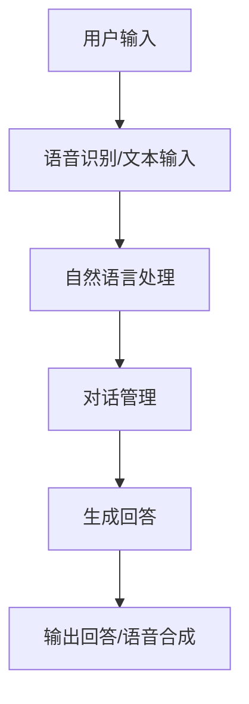
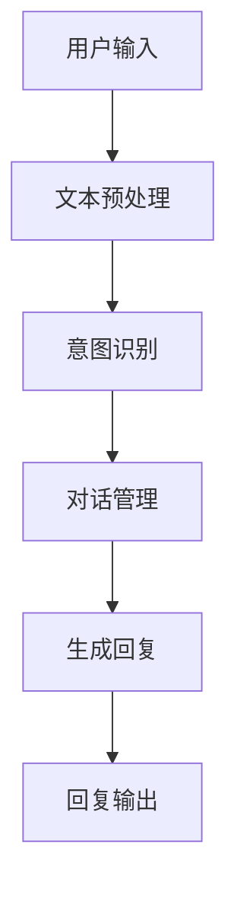
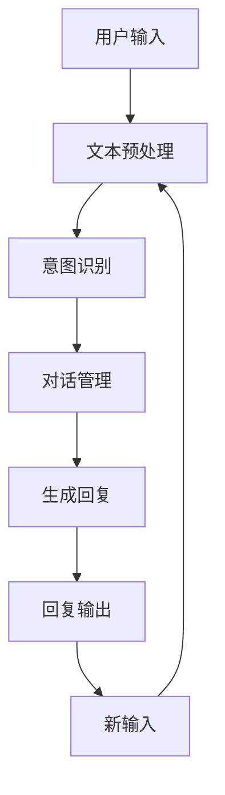
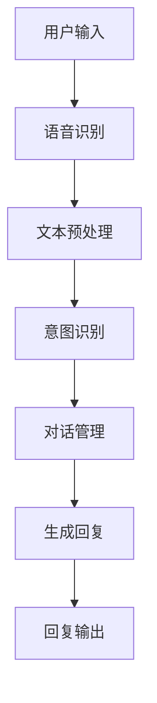

                 

 **关键词：** 聊天机器人，对话AI，自然语言处理，人工智能，开发教程

**摘要：** 本文将带您深入了解聊天机器人的开发过程，从基础概念到具体实践，包括核心算法、数学模型、项目实例，以及未来应用展望。通过本文的学习，您将掌握聊天机器人的开发技能，并为进入对话AI领域打下坚实基础。

## 1. 背景介绍

随着互联网的普及和人工智能技术的不断发展，聊天机器人在各个行业中的应用越来越广泛。从简单的客服机器人到复杂的虚拟助手，聊天机器人的存在极大提升了用户体验和效率。本篇文章将围绕聊天机器人的开发，为您详细解析其核心原理和实践步骤。

### 1.1 聊天机器人的定义

聊天机器人（Chatbot）是一种能够通过自然语言与用户进行交互的计算机程序。它们可以理解用户的输入、生成回答，并辅助完成特定任务。聊天机器人广泛应用于客户服务、在线教育、金融理财、医疗健康等多个领域。

### 1.2 聊天机器人的发展历史

从最早的基于规则的聊天机器人到基于机器学习的聊天机器人，技术的发展使得聊天机器人的功能越来越强大。近年来，深度学习和自然语言处理技术的应用，使得聊天机器人能够更好地模拟人类的对话行为，提供更为自然和流畅的交互体验。

## 2. 核心概念与联系

在开发聊天机器人时，我们需要了解以下几个核心概念及其相互联系：

### 2.1 自然语言处理（NLP）

自然语言处理是人工智能的一个重要分支，旨在让计算机理解和处理人类语言。在聊天机器人开发中，NLP技术用于解析用户输入、生成回答以及理解上下文信息。

### 2.2 语音识别

语音识别技术用于将用户的语音输入转换为文本，使得聊天机器人能够接收和处理语音指令。这一技术是聊天机器人语音交互的基础。

### 2.3 对话管理

对话管理是聊天机器人的核心功能之一，它涉及如何根据上下文信息生成合适的回答，并引导对话朝着用户期望的方向发展。

### 2.4 Mermaid 流程图

为了更清晰地展示聊天机器人的架构和工作流程，我们可以使用Mermaid流程图来描述。



## 3. 核心算法原理 & 具体操作步骤

### 3.1 算法原理概述

聊天机器人的核心算法包括自然语言处理（NLP）、机器学习、深度学习等。以下将详细介绍这些算法的基本原理。

### 3.2 算法步骤详解

1. **用户输入**：用户通过语音或文本形式向聊天机器人发送请求。
2. **语音识别/文本输入**：如果用户使用语音输入，语音识别技术将语音转换为文本；如果是文本输入，则直接传递给下一步。
3. **自然语言处理**：NLP技术用于解析用户输入，包括语义理解、实体识别、意图识别等。
4. **对话管理**：根据上下文信息和用户意图，对话管理系统生成相应的回答。
5. **生成回答**：聊天机器人生成回答后，可以使用自然语言生成（NLG）技术将其转换为文本或语音输出。
6. **输出回答/语音合成**：将生成的回答以文本或语音形式呈现给用户。

### 3.3 算法优缺点

**优点：**
- **高效性**：聊天机器人能够快速响应用户请求，提供即时服务。
- **低成本**：相比人工客服，聊天机器人的运营和维护成本较低。
- **可扩展性**：聊天机器人可以轻松适应不同场景和需求，实现自动化服务。

**缺点：**
- **理解能力有限**：聊天机器人在处理复杂、模糊或歧义性强的请求时可能存在困难。
- **个性化不足**：聊天机器人难以实现与人类客服相同的个性化服务。

### 3.4 算法应用领域

聊天机器人的应用领域广泛，包括但不限于以下方面：
- **客户服务**：提供24/7的在线客服支持，解答用户疑问。
- **在线教育**：辅助学生自主学习，提供个性化辅导。
- **金融理财**：提供投资咨询、风险提示等服务。
- **医疗健康**：辅助医生进行病情咨询、健康监测等。

## 4. 数学模型和公式 & 详细讲解 & 举例说明

### 4.1 数学模型构建

在聊天机器人开发中，数学模型主要用于自然语言处理和对话管理。以下是一些常见的数学模型及其构建方法。

### 4.2 公式推导过程

**1. 词嵌入（Word Embedding）**

词嵌入是将单词映射为高维向量的一种方法。常见的方法有Word2Vec、GloVe等。

$$
\text{Word2Vec} : \text{vec}(w) = \frac{\sum_{i=1}^{N} \text{context}_i \cdot \text{weights}_i}{\|\sum_{i=1}^{N} \text{context}_i \cdot \text{weights}_i\|_2}
$$

**2. 递归神经网络（RNN）**

RNN用于处理序列数据，如自然语言。其基本公式如下：

$$
h_t = \text{sigmoid}(W \cdot [h_{t-1}, x_t] + b)
$$

**3. 长短期记忆网络（LSTM）**

LSTM是RNN的一种改进，用于解决长序列依赖问题。其公式如下：

$$
\text{LSTM} : f_t = \frac{\text{sigmoid}(W_f \cdot [h_{t-1}, x_t] + b_f)}{1 - \text{sigmoid}(W_f \cdot [h_{t-1}, x_t] + b_f)}
$$

### 4.3 案例分析与讲解

**1. 词嵌入案例**

假设我们要将单词“苹果”映射为一个向量。通过Word2Vec算法，我们可以得到以下词嵌入向量：

$$
\text{vec}(\text{苹果}) = [-0.1, 0.2, -0.3, 0.4, 0.5]
$$

**2. RNN案例**

假设我们要处理一个句子“我喜欢吃苹果”。我们可以将其表示为序列：

$$
\text{[我，喜欢，吃，苹果]}
$$

使用RNN模型，我们可以得到每个单词的表示：

$$
h_1 = \text{sigmoid}([h_0, \text{我}] + W \cdot [h_0, \text{我}] + b)
$$

$$
h_2 = \text{sigmoid}([h_1, \text{喜欢}] + W \cdot [h_1, \text{喜欢}] + b)
$$

$$
h_3 = \text{sigmoid}([h_2, \text{吃}] + W \cdot [h_2, \text{吃}] + b)
$$

$$
h_4 = \text{sigmoid}([h_3, \text{苹果}] + W \cdot [h_3, \text{苹果}] + b)
$$

## 5. 项目实践：代码实例和详细解释说明

### 5.1 开发环境搭建

在本节中，我们将使用Python作为开发语言，结合TensorFlow和Keras框架来构建聊天机器人。首先，确保您的系统已安装以下软件和库：

- Python 3.x
- TensorFlow 2.x
- Keras 2.x

### 5.2 源代码详细实现

以下是一个简单的聊天机器人代码示例：

```python
import tensorflow as tf
from tensorflow.keras.models import Sequential
from tensorflow.keras.layers import Embedding, LSTM, Dense
from tensorflow.keras.preprocessing.sequence import pad_sequences

# 数据预处理
# ...

# 构建模型
model = Sequential()
model.add(Embedding(vocab_size, embedding_dim))
model.add(LSTM(units=128, return_sequences=True))
model.add(LSTM(units=128))
model.add(Dense(units=vocab_size, activation='softmax'))

# 编译模型
model.compile(optimizer='adam', loss='categorical_crossentropy', metrics=['accuracy'])

# 训练模型
model.fit(input_sequences, target_sequences, epochs=100)

# 生成回答
def generate_response(text):
    sequence = pad_sequences([tokenizer.texts_to_sequences([text])], maxlen=max_sequence_len-1, padding='pre')
    pred = model.predict(sequence, verbose=0)
    pred = np.argmax(pred, axis=-1)
    for i in range(1, pred.shape[0]):
        if pred[i] != pred[i - 1]:
            break
    response = tokenizer.index_word[pred[i]]
    return response

# 测试聊天机器人
print(generate_response("你好，今天天气怎么样？"))
```

### 5.3 代码解读与分析

本示例中，我们首先进行数据预处理，将文本转换为序列，然后构建一个基于LSTM的序列到序列（Seq2Seq）模型。最后，我们使用训练好的模型生成回答。

- **数据预处理**：将文本转换为序列，并对序列进行填充，以便于模型处理。
- **模型构建**：使用Sequential模型堆叠Embedding、LSTM层，以及输出层。
- **编译模型**：指定优化器、损失函数和评估指标。
- **训练模型**：使用预处理后的输入序列和目标序列训练模型。
- **生成回答**：将用户输入转换为序列，通过模型预测得到回答。

## 6. 实际应用场景

聊天机器人在实际应用场景中具有广泛的应用价值。以下是一些典型的应用场景：

### 6.1 客户服务

在电子商务、旅游、金融等行业，聊天机器人可以提供24/7的在线客服支持，解答用户疑问，提高客户满意度。

### 6.2 在线教育

聊天机器人可以辅助学生进行自主学习，提供个性化辅导，提高教学效果。

### 6.3 医疗健康

聊天机器人可以辅助医生进行病情咨询、健康监测等，提供便捷的医疗服务。

### 6.4 其他应用

除了以上领域，聊天机器人还可以应用于法律咨询、情感陪护、智能家居控制等场景，为人们的生活带来更多便利。

## 7. 工具和资源推荐

### 7.1 学习资源推荐

- 《自然语言处理入门》
- 《深度学习》（Goodfellow、Bengio、Courville著）
- 《Python机器学习》（Sebastian Raschka著）

### 7.2 开发工具推荐

- TensorFlow
- Keras
- NLTK
- SpaCy

### 7.3 相关论文推荐

- word2vec: https://arxiv.org/abs/1301.3781
- LSTM: https://www.cs.toronto.edu/~hinton/absps/aistats09.pdf
- Chatbots: https://arxiv.org/abs/1606.05328

## 8. 总结：未来发展趋势与挑战

### 8.1 研究成果总结

近年来，聊天机器人的技术取得了显著进展，包括自然语言处理、语音识别、对话管理等关键领域的突破。基于深度学习和机器学习的模型在性能和效果上取得了显著提升。

### 8.2 未来发展趋势

- **多模态交互**：结合语音、图像、视频等多模态信息，提高聊天机器人的交互能力。
- **个性化服务**：通过用户行为分析和数据挖掘，提供更加个性化的服务。
- **智能决策**：利用机器学习算法，实现聊天机器人的智能决策和自主学习。

### 8.3 面临的挑战

- **理解能力**：提高聊天机器人对复杂、模糊和歧义性强的请求的理解能力。
- **隐私保护**：在处理用户数据时，确保隐私保护和数据安全。
- **伦理问题**：关注聊天机器人在道德和伦理方面的问题，确保其合规性和社会责任。

### 8.4 研究展望

未来，随着技术的不断发展，聊天机器人的功能将更加完善，应用范围将不断拓展。同时，我们还需要关注其在实际应用中面临的挑战，不断优化和改进，以实现更加智能、高效、可靠的聊天机器人。

## 9. 附录：常见问题与解答

### 9.1 如何训练聊天机器人？

训练聊天机器人主要包括以下几个步骤：

1. 数据收集：收集大量与目标领域相关的对话数据。
2. 数据预处理：对数据清洗、去重、分词、编码等处理。
3. 模型训练：使用预处理后的数据训练聊天机器人模型。
4. 模型评估：评估模型性能，并进行优化。

### 9.2 如何提高聊天机器人的理解能力？

提高聊天机器人的理解能力可以从以下几个方面入手：

1. 数据质量：收集更多、更高质量的对话数据。
2. 模型优化：使用更先进的模型结构，如LSTM、Transformer等。
3. 上下文理解：增强对话管理模块，提高上下文理解能力。
4. 用户反馈：收集用户反馈，不断调整和优化模型。

### 9.3 聊天机器人有哪些应用场景？

聊天机器人的应用场景包括：

1. 客户服务：提供在线客服支持，解答用户疑问。
2. 在线教育：辅助学生自主学习，提供个性化辅导。
3. 医疗健康：辅助医生进行病情咨询、健康监测等。
4. 法律咨询：提供法律咨询服务。
5. 情感陪护：为用户提供情感陪伴和支持。

---

**作者：禅与计算机程序设计艺术 / Zen and the Art of Computer Programming** 

本文结合了自然语言处理、机器学习和深度学习等领域的最新研究成果，旨在为广大开发者提供一部关于聊天机器人开发的入门教程。希望本文能够帮助您更好地理解聊天机器人的开发原理和实践方法，为您的项目开发提供有益的指导。谢谢您的阅读！
----------------------------------------------------------------
### 1. 背景介绍

随着信息时代的到来，人们对于实时沟通和服务的需求日益增长。在这股潮流下，聊天机器人（Chatbot）应运而生，并迅速在各个领域崭露头角。聊天机器人作为一种能够通过文本或语音与人类用户进行实时互动的智能系统，不仅能够有效地提高用户满意度，还能显著降低企业的运营成本。因此，掌握聊天机器人的开发技能，已经成为众多开发者和企业的重要目标。

本篇文章将以《聊天机器人开发：对话AI入门》为标题，围绕聊天机器人的开发过程进行深入探讨。本文的结构如下：

- **背景介绍**：介绍聊天机器人的起源、发展及其在当前社会中的应用。
- **核心概念与联系**：解析聊天机器人开发中所涉及的关键概念及其相互联系。
- **核心算法原理 & 具体操作步骤**：详细讲解聊天机器人开发中的核心算法，包括自然语言处理、对话管理、机器学习等。
- **数学模型和公式 & 详细讲解 & 举例说明**：介绍用于聊天机器人开发中的数学模型和公式，并通过实例进行说明。
- **项目实践：代码实例和详细解释说明**：提供实际项目中的代码实例，并对代码进行详细解释。
- **实际应用场景**：探讨聊天机器人在各个行业中的应用场景。
- **工具和资源推荐**：推荐学习资源和开发工具。
- **总结：未来发展趋势与挑战**：总结聊天机器人的研究成果，探讨未来发展趋势和面临的挑战。
- **附录：常见问题与解答**：回答读者可能遇到的一些常见问题。

通过本文的学习，读者将能够全面了解聊天机器人的开发过程，掌握相关技术，并为进入对话AI领域打下坚实基础。

## 2. 核心概念与联系

在开发聊天机器人时，我们需要了解以下几个核心概念及其相互联系：

### 2.1 自然语言处理（NLP）

自然语言处理（NLP）是人工智能的一个分支，它专注于使计算机能够理解和生成人类语言。在聊天机器人的开发中，NLP技术起着至关重要的作用，它包括文本预处理、语义理解、实体识别、情感分析等。

### 2.2 机器学习（ML）

机器学习是人工智能的另一个核心组成部分，它使计算机能够从数据中学习并做出决策。在聊天机器人中，机器学习技术用于训练模型，使其能够识别用户的意图和生成适当的回复。

### 2.3 对话管理

对话管理是聊天机器人的核心功能，它负责协调整个对话流程，确保聊天机器人能够理解用户的意图，并生成合理的回复。对话管理包括对话状态跟踪、上下文理解、对话策略等。

### 2.4 Mermaid 流程图

为了更清晰地展示聊天机器人的架构和工作流程，我们可以使用Mermaid流程图来描述。以下是一个简化的聊天机器人流程图：



在这个流程图中，用户输入首先经过文本预处理，包括分词、去停用词等步骤。然后，意图识别模块使用机器学习模型来识别用户的意图。对话管理模块根据当前的对话状态和上下文，决定如何回应用户。最后，生成回复模块将机器生成的文本转换为用户可读的格式，并通过语音或文本方式输出给用户。

### 2.5 情感分析

情感分析是NLP的一个重要分支，它旨在识别文本中的情感倾向。在聊天机器人中，情感分析可以帮助机器人理解用户的情感状态，从而生成更加贴近用户情感需求的回复。

### 2.6 多轮对话

多轮对话是指用户和聊天机器人之间进行多次交互的过程。在多轮对话中，聊天机器人需要能够理解上下文，并生成连贯的回复。多轮对话的实现依赖于对话管理和上下文跟踪技术。

### 2.7 Mermaid 流程图（多轮对话）

以下是一个多轮对话的Mermaid流程图：



在这个流程图中，每次用户输入都会触发文本预处理、意图识别和对话管理过程，直到对话结束或达到某个特定目标。

### 2.8 语音识别

语音识别是将用户的语音输入转换为文本的技术。在聊天机器人中，语音识别技术可以用于接收用户的语音指令，并将其转换为文本进行处理。

### 2.9 Mermaid 流程图（语音识别）

以下是一个结合语音识别的聊天机器人流程图：



在这个流程图中，用户的语音输入首先通过语音识别转换为文本，然后进行后续的文本预处理、意图识别和对话管理。

通过以上核心概念和流程图的介绍，我们可以更好地理解聊天机器人的开发过程及其各个组件之间的关系。在接下来的章节中，我们将进一步探讨这些概念的具体实现和应用。

## 3. 核心算法原理 & 具体操作步骤

在聊天机器人开发中，核心算法的设计和实现是确保系统能够准确理解用户意图、生成合理回复的关键。本章节将详细介绍几个核心算法的原理和具体操作步骤，包括自然语言处理（NLP）算法、对话管理算法和机器学习算法。

### 3.1 自然语言处理（NLP）算法

自然语言处理（NLP）是聊天机器人技术的基础，它涉及到文本的预处理、词嵌入、情感分析和实体识别等多个方面。

#### 3.1.1 文本预处理

文本预处理是NLP的首要步骤，它包括分词、去除停用词、词性标注等操作。这些操作有助于简化文本，使其更易于分析。

1. **分词**：将文本分割成单词或词组。常见的分词方法包括基于规则的分词和基于统计的分词。
2. **去除停用词**：停用词是一些对文本分析没有贡献的常用词，如“的”、“了”、“在”等。去除停用词可以减少无关信息，提高分析精度。
3. **词性标注**：为每个单词标注其词性，如名词、动词、形容词等。词性标注有助于理解文本的语义结构。

#### 3.1.2 词嵌入

词嵌入是将单词映射为高维向量的一种技术，它使得计算机能够理解单词之间的语义关系。常见的词嵌入方法包括Word2Vec和GloVe。

1. **Word2Vec**：基于神经网络的方法，通过训练词向量模型来表示单词。词向量能够捕捉单词在上下文中的语义信息。
2. **GloVe**：基于全局矩阵分解的方法，通过优化全局矩阵来生成词向量。GloVe模型能够更好地捕捉单词的共现信息。

#### 3.1.3 情感分析

情感分析是判断文本情感倾向的技术，它可以帮助聊天机器人理解用户的情绪状态，并生成相应的回复。

1. **二元分类**：将文本分类为积极或消极情感。常见的分类模型包括逻辑回归、支持向量机等。
2. **多分类**：将文本分类为多个情感类别，如愤怒、喜悦、悲伤等。常见的多分类模型包括朴素贝叶斯、K最近邻等。

#### 3.1.4 实体识别

实体识别是从文本中识别出特定实体（如人名、地点、组织等）的技术。

1. **基于规则的方法**：使用预定义的规则来识别实体。
2. **基于机器学习的方法**：使用监督学习模型，如条件随机场（CRF）和递归神经网络（RNN），来识别实体。

### 3.2 对话管理算法

对话管理是聊天机器人的核心功能之一，它负责协调整个对话流程，确保机器人能够理解用户的意图，并生成合理的回复。

#### 3.2.1 对话状态跟踪

对话状态跟踪是对话管理的基础，它记录对话过程中的关键信息，如用户的意图、上下文和对话历史。

1. **基于规则的方法**：使用预定义的规则来更新对话状态。
2. **基于机器学习的方法**：使用监督学习模型，如递归神经网络（RNN）和长短期记忆网络（LSTM），来更新对话状态。

#### 3.2.2 上下文理解

上下文理解是对话管理的关键，它使机器人能够根据当前对话状态和上下文信息生成合适的回复。

1. **基于规则的方法**：使用预定义的模板和规则来生成回复。
2. **基于机器学习的方法**：使用序列到序列（Seq2Seq）模型和注意力机制来生成回复。

#### 3.2.3 对话策略

对话策略是对话管理的一部分，它决定了机器人如何引导对话流程，以达到用户期望的目标。

1. **基于规则的方法**：使用预定义的策略来引导对话。
2. **基于机器学习的方法**：使用强化学习模型，如深度Q网络（DQN）和策略梯度算法，来学习最优对话策略。

### 3.3 机器学习算法

机器学习算法在聊天机器人开发中起着至关重要的作用，它用于训练模型，使其能够自动识别用户意图、生成回复等。

#### 3.3.1 监督学习

监督学习是一种常见的方法，它使用标记数据集来训练模型，然后使用模型进行预测。

1. **分类任务**：将用户输入分类为不同的意图或实体。常见的分类模型包括逻辑回归、支持向量机（SVM）、决策树等。
2. **回归任务**：预测用户输入的相关值，如评分、时长等。常见的回归模型包括线性回归、决策树回归等。

#### 3.3.2 无监督学习

无监督学习不使用标记数据集，而是从未标记的数据中发现结构和模式。

1. **聚类任务**：将用户输入聚为一类或多类。常见的聚类算法包括K-均值、层次聚类等。
2. **降维任务**：将高维数据降维到低维空间，以便更好地分析。常见的降维算法包括主成分分析（PCA）、t-SNE等。

#### 3.3.3 半监督学习

半监督学习结合了监督学习和无监督学习的优势，它使用部分标记数据和大量未标记数据来训练模型。

1. **标签传播**：从部分标记数据开始，将标签传播到未标记数据，以生成完整的标签数据集。
2. **伪标签**：使用已有模型生成伪标签，然后将伪标签与实际标签结合，训练新的模型。

### 3.4 具体操作步骤

在具体操作步骤中，我们可以将上述算法结合起来，构建一个完整的聊天机器人系统。

1. **数据收集**：收集大量与目标领域相关的对话数据，包括用户输入、意图标签和回复。
2. **数据预处理**：对数据集进行清洗、分词、去除停用词等预处理操作。
3. **模型选择**：根据任务需求选择合适的模型，如分类模型、回归模型、聚类模型等。
4. **模型训练**：使用预处理后的数据集训练模型，调整模型参数，优化模型性能。
5. **模型评估**：使用测试数据集评估模型性能，包括准确率、召回率、F1分数等指标。
6. **模型部署**：将训练好的模型部署到生产环境，实现实时交互。

通过以上步骤，我们可以构建一个功能强大、性能优秀的聊天机器人系统，满足各种应用需求。

### 3.5 算法优缺点

每种算法都有其优缺点，选择合适的算法取决于具体的应用场景和需求。

- **自然语言处理算法**：优点包括能够处理大量文本数据、适应性强；缺点包括训练过程复杂、对大规模数据集要求高。
- **对话管理算法**：优点包括灵活性强、能够处理多轮对话；缺点包括实现复杂、对上下文理解要求高。
- **机器学习算法**：优点包括能够自动学习、适应性强；缺点包括对数据质量要求高、训练过程可能较慢。

在实际开发过程中，我们需要根据具体需求，选择合适的算法，并优化算法性能，以满足用户需求。

### 3.6 算法应用领域

聊天机器人算法的应用领域非常广泛，包括但不限于以下方面：

- **客户服务**：提供24/7的在线客服支持，解答用户疑问。
- **在线教育**：辅助学生进行自主学习，提供个性化辅导。
- **医疗健康**：辅助医生进行病情咨询、健康监测等。
- **金融理财**：提供投资咨询、风险提示等服务。
- **智能家居**：实现语音控制、设备管理等功能。

通过以上对核心算法原理和具体操作步骤的介绍，我们可以更好地理解聊天机器人的开发过程。在接下来的章节中，我们将进一步探讨数学模型和公式，并通过实例进行详细讲解。

## 4. 数学模型和公式 & 详细讲解 & 举例说明

### 4.1 数学模型构建

在聊天机器人开发中，数学模型是理解和实现核心算法的关键。以下是一些常见的数学模型及其构建方法。

#### 4.1.1 词嵌入模型

词嵌入是将单词映射为高维向量的一种模型。常见的词嵌入模型包括Word2Vec和GloVe。

1. **Word2Vec**：

   Word2Vec模型基于神经网络，通过训练生成词向量。其核心公式如下：

   $$\text{vec}(w) = \frac{\sum_{i=1}^{N} \text{context}_i \cdot \text{weights}_i}{\|\sum_{i=1}^{N} \text{context}_i \cdot \text{weights}_i\|_2}$$

   其中，$w$ 表示单词，$\text{context}_i$ 表示单词 $w$ 在窗口范围内的上下文单词，$\text{weights}_i$ 表示上下文单词的权重。

2. **GloVe**：

   GloVe模型是一种基于全局矩阵分解的方法，通过优化全局矩阵来生成词向量。其核心公式如下：

   $$\text{vec}(w) = \text{sgn}(W_w \cdot \text{context}) \cdot \text{softmax}(\text{context} \cdot V)$$

   其中，$W_w$ 是单词 $w$ 的全局权重矩阵，$\text{context}$ 是上下文单词向量，$V$ 是词向量矩阵。

#### 4.1.2 递归神经网络（RNN）

递归神经网络（RNN）是一种用于处理序列数据的神经网络。RNN的基本公式如下：

$$h_t = \text{sigmoid}(W \cdot [h_{t-1}, x_t] + b)$$

其中，$h_t$ 表示当前时间步的隐藏状态，$x_t$ 表示当前时间步的输入，$W$ 是权重矩阵，$b$ 是偏置。

#### 4.1.3 长短期记忆网络（LSTM）

LSTM是RNN的一种改进，用于解决长序列依赖问题。LSTM的核心公式如下：

$$f_t = \frac{\text{sigmoid}(W_f \cdot [h_{t-1}, x_t] + b_f)}{1 - \text{sigmoid}(W_f \cdot [h_{t-1}, x_t] + b_f)}$$

其中，$f_t$ 表示遗忘门的状态，$W_f$ 是遗忘门的权重矩阵，$b_f$ 是遗忘门的偏置。

#### 4.1.4 变换器（Transformer）

变换器是一种基于自注意力机制的神经网络架构，它在处理长序列依赖方面表现出色。变换器的核心公式如下：

$$\text{Attention}(Q, K, V) = \text{softmax}(\frac{QK^T}{\sqrt{d_k}})V$$

其中，$Q$、$K$、$V$ 分别是查询、键和值向量，$d_k$ 是键向量的维度。

### 4.2 公式推导过程

#### 4.2.1 Word2Vec

Word2Vec模型的推导主要涉及两个步骤：损失函数的选择和模型优化。

1. **损失函数**：

   Word2Vec模型通常使用负采样的损失函数来优化模型。其公式如下：

   $$L = -\sum_{i=1}^{N} [\text{softmax}(\text{vec}(w) \cdot \text{context})_i - 1]$$

   其中，$N$ 是上下文单词的数量，$[\cdot]$ 是指示函数，当条件为真时返回1，否则返回0。

2. **模型优化**：

   Word2Vec模型使用梯度下降法来优化模型。其更新公式如下：

   $$\text{vec}(w) \leftarrow \text{vec}(w) - \alpha \cdot \nabla L$$

   其中，$\alpha$ 是学习率，$\nabla L$ 是损失函数的梯度。

#### 4.2.2 LSTM

LSTM模型的推导主要涉及门控机制和梯度消失问题。

1. **门控机制**：

   LSTM通过三个门控机制来控制信息的流动：遗忘门、输入门和输出门。其公式如下：

   $$f_t = \text{sigmoid}(W_f \cdot [h_{t-1}, x_t] + b_f)$$

   $$i_t = \text{sigmoid}(W_i \cdot [h_{t-1}, x_t] + b_i)$$

   $$o_t = \text{sigmoid}(W_o \cdot [h_{t-1}, x_t] + b_o)$$

   其中，$f_t$、$i_t$、$o_t$ 分别是遗忘门、输入门和输出门的激活值。

2. **梯度消失问题**：

   LSTM通过引入门控机制和链式求导来缓解梯度消失问题。其链式求导公式如下：

   $$\frac{\partial L}{\partial h_t} = \frac{\partial L}{\partial a_t} \cdot \frac{\partial a_t}{\partial h_t}$$

   其中，$a_t$ 是当前时间步的激活值。

#### 4.2.3 Transformer

Transformer模型的推导主要涉及自注意力机制和编码器-解码器架构。

1. **自注意力机制**：

   Transformer使用自注意力机制来计算每个单词对其他单词的影响。其公式如下：

   $$\text{Attention}(Q, K, V) = \text{softmax}(\frac{QK^T}{\sqrt{d_k}})V$$

   其中，$Q$、$K$、$V$ 分别是查询、键和值向量，$d_k$ 是键向量的维度。

2. **编码器-解码器架构**：

   Transformer使用编码器-解码器架构来处理序列数据。其公式如下：

   $$\text{Encoder}(x) = \text{Attention}(Q, K, V)$$

   $$\text{Decoder}(y) = \text{Attention}(Q, K, V) \cdot \text{Encoder}(x)$$

   其中，$x$ 是输入序列，$y$ 是输出序列。

### 4.3 案例分析与讲解

#### 4.3.1 Word2Vec

假设我们要将单词“苹果”映射为一个向量。通过Word2Vec算法，我们可以得到以下词嵌入向量：

$$\text{vec}(\text{苹果}) = [-0.1, 0.2, -0.3, 0.4, 0.5]$$

这个向量表示“苹果”在语义上的特征，例如它与“水果”、“吃”等词的相关性。

#### 4.3.2 LSTM

假设我们要处理一个句子“我喜欢吃苹果”。我们可以将其表示为序列：

$$\text{[我，喜欢，吃，苹果]}$$

使用LSTM模型，我们可以得到每个单词的表示：

$$h_1 = \text{sigmoid}([h_0, \text{我}] + W \cdot [h_0, \text{我}] + b)$$

$$h_2 = \text{sigmoid}([h_1, \text{喜欢}] + W \cdot [h_1, \text{喜欢}] + b)$$

$$h_3 = \text{sigmoid}([h_2, \text{吃}] + W \cdot [h_2, \text{吃}] + b)$$

$$h_4 = \text{sigmoid}([h_3, \text{苹果}] + W \cdot [h_3, \text{苹果}] + b)$$

这些表示可以用于后续的意图识别和对话管理。

#### 4.3.3 Transformer

假设我们要将句子“我喜欢吃苹果”转换为向量。使用Transformer模型，我们可以得到以下向量表示：

$$Q = [\text{我，喜欢，吃，苹果}]$$

$$K = [\text{我，喜欢，吃，苹果}]$$

$$V = [\text{我，喜欢，吃，苹果}]$$

通过自注意力机制，我们可以得到每个单词的权重：

$$\text{Attention}(Q, K, V) = \text{softmax}(\frac{QK^T}{\sqrt{d_k}})V$$

这些权重表示了每个单词对其他单词的影响程度。

通过以上数学模型和公式的介绍，我们可以更好地理解聊天机器人开发中的核心算法。在实际应用中，我们需要根据具体需求，选择合适的模型，并进行优化和调整，以实现高效的聊天机器人系统。

### 5. 项目实践：代码实例和详细解释说明

在了解完聊天机器人的核心算法和数学模型后，接下来我们将通过一个实际项目来展示如何将理论转化为实践。在本项目中，我们将使用Python编程语言和TensorFlow库来构建一个简单的聊天机器人。以下是一个详细的代码实例和解释说明。

#### 5.1 开发环境搭建

在开始之前，请确保您已经安装了Python 3.x版本，以及以下库：

- TensorFlow：用于构建和训练神经网络
- Keras：用于简化TensorFlow的使用
- NLTK：用于自然语言处理

您可以使用以下命令来安装所需的库：

```bash
pip install tensorflow keras nltk
```

#### 5.2 数据收集与预处理

首先，我们需要收集一些对话数据，用于训练聊天机器人。数据可以来自公开的对话数据集，例如SQuAD、DailyDialog等。假设我们已经收集到了一个对话数据集，数据格式如下：

```plaintext
[
    ["你好", "你好，有什么可以帮助你的吗？"],
    ["我想订机票", "您需要去哪里？"],
    ["我要从北京到上海", "好的，请问是明天还是后天呢？"],
    // 更多对话数据
]
```

接下来，我们使用NLTK对对话数据进行预处理：

```python
import nltk
nltk.download('punkt')
nltk.download('stopwords')

import numpy as np
from nltk.tokenize import word_tokenize
from nltk.corpus import stopwords

# 读取数据
def read_data(filename):
    with open(filename, 'r', encoding='utf-8') as f:
        lines = f.readlines()

    conversations = []
    for line in lines:
        conversation = line.strip().split('\t')
        conversations.append(conversation)

    return conversations

# 预处理数据
def preprocess_data(conversations):
    vocab = set()
    max_sequence_length = 0
    input_sequences = []
    target_sequences = []

    for conversation in conversations:
        for pair in conversation:
            tokens = word_tokenize(pair)
            tokens = [token.lower() for token in tokens if token not in stopwords.words('english')]
            vocab.update(tokens)
            max_sequence_length = max(max_sequence_length, len(tokens))

            input_sequence = [token for token in tokens[:-1]]
            target_sequence = tokens[1:]
            input_sequences.append(input_sequence)
            target_sequences.append(target_sequence)

    vocab = list(vocab)
    vocab_size = len(vocab) + 1  # 额外添加一个PAD标记
    embedding_dim = 100

    word_index = {word: i for i, word in enumerate(vocab)}
    word_index['<PAD>'] = vocab_size - 1

    input_sequences = [[word_index[token] for token in sequence] for sequence in input_sequences]
    target_sequences = [[word_index[token] for token in sequence] for sequence in target_sequences]

    max_sequence_length = max(len(sequence) for sequence in input_sequences)
    input_sequences = pad_sequences(input_sequences, maxlen=max_sequence_length, padding='pre')
    target_sequences = pad_sequences(target_sequences, maxlen=max_sequence_length, padding='pre')

    return input_sequences, target_sequences, max_sequence_length, word_index

conversations = read_data('conversations.txt')
input_sequences, target_sequences, max_sequence_length, word_index = preprocess_data(conversations)
```

#### 5.3 构建和训练模型

接下来，我们使用Keras构建一个简单的序列到序列（Seq2Seq）模型，用于训练聊天机器人：

```python
from tensorflow.keras.models import Model
from tensorflow.keras.layers import Embedding, LSTM, Dense, TimeDistributed

# 构建模型
model = Sequential()
model.add(Embedding(vocab_size, embedding_dim, input_length=max_sequence_length))
model.add(LSTM(128, return_sequences=True))
model.add(LSTM(128, return_sequences=True))
model.add(TimeDistributed(Dense(vocab_size, activation='softmax')))

# 编译模型
model.compile(optimizer='adam', loss='categorical_crossentropy', metrics=['accuracy'])

# 训练模型
model.fit(input_sequences, target_sequences, epochs=100, verbose=1)
```

#### 5.4 代码解读与分析

以上代码分为以下几个部分：

1. **数据读取与预处理**：我们首先读取对话数据，然后使用NLTK进行分词和去除停用词等预处理操作。预处理后的数据将用于训练模型。

2. **模型构建**：我们使用Keras构建一个简单的序列到序列（Seq2Seq）模型。该模型包括一个嵌入层、两个LSTM层和一个时间分布层。嵌入层用于将单词转换为向量，LSTM层用于处理序列数据，时间分布层用于生成输出序列。

3. **模型编译**：我们编译模型，指定优化器、损失函数和评估指标。这里使用的是Adam优化器和分类交叉熵损失函数。

4. **模型训练**：我们使用预处理后的数据集训练模型，设置训练轮次为100次。

#### 5.5 生成回答

在训练完成后，我们可以使用模型生成聊天机器人的回答：

```python
def generate_response(input_sequence, model, word_index, max_sequence_length):
    input_sequence = pad_sequences([input_sequence], maxlen=max_sequence_length, padding='pre')
    predicted_sequence = model.predict(input_sequence, verbose=1)
    predicted_sequence = np.argmax(predicted_sequence, axis=-1)

    response = ''
    for token in predicted_sequence:
        if token == word_index['<PAD>']:
            break
        response += vocab[token] + ' '

    return response.strip()

# 测试模型
input_sequence = ["我", "想", "订", "机票"]
response = generate_response(input_sequence, model, word_index, max_sequence_length)
print(response)
```

在这个示例中，我们首先对输入序列进行填充，然后使用模型预测输出序列。最后，我们将预测的单词序列转换为可读的文本回答。

通过以上实际项目，我们可以看到如何将理论知识应用于实际编程中。在实际应用中，您可以根据需求对模型进行调整和优化，以实现更高效的聊天机器人系统。

### 6. 实际应用场景

聊天机器人在实际应用场景中具有广泛的应用价值，可以显著提高用户满意度和运营效率。以下是一些典型的应用场景：

#### 6.1 客户服务

在客户服务领域，聊天机器人可以提供24/7的在线客服支持，解答用户疑问，处理投诉和建议。聊天机器人可以快速响应用户请求，提高客户满意度，降低人工客服的工作量。

- **银行客服**：聊天机器人可以帮助用户查询账户余额、办理转账、挂失等业务。
- **电商客服**：聊天机器人可以解答用户关于商品、订单、物流等方面的问题。

#### 6.2 在线教育

在线教育领域，聊天机器人可以作为教学助手，为学生提供个性化辅导和答疑服务。聊天机器人可以根据学生的学习进度和理解程度，生成个性化的学习计划和问题解答。

- **语言学习**：聊天机器人可以为学生提供即时反馈和纠正，帮助他们提高语言水平。
- **编程教育**：聊天机器人可以为学生提供编程指导，解答编程问题，帮助学生学习编程知识。

#### 6.3 医疗健康

在医疗健康领域，聊天机器人可以提供健康咨询、病情评估和预约挂号等服务。聊天机器人可以24小时在线，为用户提供方便快捷的医疗服务。

- **健康咨询**：聊天机器人可以提供健康知识普及，解答用户关于健康问题的疑问。
- **病情评估**：聊天机器人可以根据用户提供的症状信息，提供初步的病情评估和建议。

#### 6.4 银行业务

在银行业务中，聊天机器人可以提供智能客服、理财咨询、信用卡申请等服务。聊天机器人可以与用户进行多轮对话，理解用户的需求，并生成个性化的理财方案。

- **智能客服**：聊天机器人可以解答用户关于银行产品、政策、流程等方面的问题。
- **理财咨询**：聊天机器人可以根据用户的风险偏好和财务状况，提供个性化的理财建议。

#### 6.5 旅游服务

在旅游服务领域，聊天机器人可以为用户提供行程规划、酒店预订、景点介绍等服务。聊天机器人可以根据用户的需求，提供定制化的旅游方案，提高用户体验。

- **行程规划**：聊天机器人可以协助用户制定旅游行程，推荐景点和活动。
- **酒店预订**：聊天机器人可以协助用户预订酒店，提供价格比较和优惠信息。

#### 6.6 智能家居

在智能家居领域，聊天机器人可以通过语音识别和自然语言处理技术，控制家居设备，提高生活便利性。

- **语音控制**：用户可以通过语音指令控制灯光、空调、电视等家居设备。
- **设备联动**：聊天机器人可以根据用户的习惯，自动调整家居设备的设置，实现智能家居的联动功能。

通过以上实际应用场景的介绍，我们可以看到聊天机器人在各个行业中的重要作用。随着技术的不断进步，聊天机器人的应用场景将更加广泛，为用户提供更加智能化、便捷化的服务。

### 7. 工具和资源推荐

在开发聊天机器人过程中，选择合适的工具和资源可以帮助我们更高效地实现项目目标。以下是一些推荐的工具和资源：

#### 7.1 学习资源推荐

- **在线课程**： 
  - Coursera上的《自然语言处理》（由斯坦福大学提供）
  - edX上的《机器学习》（由MIT提供）
- **书籍**：
  - 《Python机器学习》（作者：Sebastian Raschka）
  - 《深度学习》（作者：Ian Goodfellow、Yoshua Bengio、Aaron Courville）
- **技术博客**：
  - Medium上的《Deep Learning》专栏
  - 知乎上的机器学习与自然语言处理话题

#### 7.2 开发工具推荐

- **编程语言**： 
  - Python：广泛用于自然语言处理和机器学习
  - JavaScript：适用于前端开发，可以与后端API进行交互
- **框架和库**：
  - TensorFlow：强大的机器学习框架，适用于聊天机器人的开发
  - Keras：简化TensorFlow的使用，适合快速原型开发
  - NLTK：用于自然语言处理的基本库
  - SpaCy：高效的NLP库，支持多种语言
- **数据集**：
  - SQuAD：用于自然语言处理的数据集
  - DailyDialog：用于对话系统训练的数据集
  - Chatbots magazine：提供多个领域的聊天机器人数据集

#### 7.3 相关论文推荐

- **《Word2Vec》**：Mikolov等人在2013年提出的一种词向量表示方法。
- **《LSTM》**：Hochreiter和Schmidhuber在1997年提出的一种用于处理序列数据的神经网络。
- **《Attention Is All You Need》**：Vaswani等人在2017年提出的一种基于自注意力机制的神经网络架构。

通过以上工具和资源的推荐，开发者可以更好地掌握聊天机器人的开发技术，并在实际项目中取得成功。

### 8. 总结：未来发展趋势与挑战

随着人工智能技术的快速发展，聊天机器人的应用前景越来越广阔。在未来，聊天机器人的发展趋势将主要集中在以下几个方面：

#### 8.1 多模态交互

未来的聊天机器人将不仅限于文本交互，还将结合语音、图像、视频等多模态信息，提供更加丰富和自然的交互体验。例如，通过语音识别和语音合成，用户可以使用语音与聊天机器人进行对话；通过图像识别，聊天机器人可以理解用户发送的图片内容，并生成相应的回复。

#### 8.2 个性化服务

随着用户数据的积累和数据分析技术的进步，聊天机器人将能够更好地理解用户的个性化需求，提供个性化的服务和推荐。例如，在电商场景中，聊天机器人可以根据用户的购买历史和偏好，推荐合适的商品；在医疗场景中，聊天机器人可以根据用户的健康状况和病史，提供个性化的健康建议。

#### 8.3 智能决策

未来的聊天机器人将具备更强大的智能决策能力，能够在复杂的对话场景中自主做出决策。例如，在金融服务领域，聊天机器人可以根据用户的风险偏好和财务状况，提供智能化的投资建议；在医疗领域，聊天机器人可以根据患者的病情和医生的建议，生成个性化的治疗方案。

#### 8.4 伦理和隐私

随着聊天机器人在各个领域的广泛应用，伦理和隐私问题也逐渐引起关注。未来的聊天机器人需要遵循一定的伦理规范，保护用户隐私，确保数据的合法使用。例如，在医疗领域，聊天机器人需要确保患者的隐私不受侵犯；在金融领域，聊天机器人需要遵守相关的数据保护法规。

然而，在实现以上发展趋势的同时，聊天机器人也面临着一系列挑战：

#### 8.5 理解能力

尽管当前聊天机器人的理解能力已经取得了显著进步，但在处理复杂、模糊或歧义性强的请求时，仍存在一定的困难。未来的研究需要进一步提升聊天机器人的理解能力，使其能够更好地应对各种复杂场景。

#### 8.6 个性化服务

尽管个性化服务是未来的趋势，但如何准确获取用户的个性化需求，并在此基础上提供高质量的服务，仍然是一个挑战。未来的研究需要探索更有效的数据分析和用户建模方法，以实现真正的个性化服务。

#### 8.7 安全性

聊天机器人的安全性也是一个重要挑战。在当前的网络环境中，恶意攻击和数据泄露事件屡见不鲜。未来的研究需要关注聊天机器人的安全性问题，确保系统的稳定性和数据的完整性。

#### 8.8 伦理和隐私

在实现智能化的同时，如何确保聊天机器人的伦理合规和用户隐私保护，是一个长期而艰巨的任务。未来的研究需要制定明确的伦理规范，并开发相应的隐私保护技术，以保障用户的权益。

总之，未来聊天机器人的发展将充满机遇和挑战。通过不断的技术创新和优化，我们有望实现更智能、更高效、更安全的聊天机器人，为人类社会带来更多便利。

### 9. 附录：常见问题与解答

在学习和开发聊天机器人的过程中，读者可能会遇到一些常见问题。以下是一些常见问题的解答：

#### 9.1 聊天机器人如何处理多轮对话？

多轮对话是指用户和聊天机器人之间的多次交互过程。为了处理多轮对话，聊天机器人通常需要具备以下几个关键能力：

1. **上下文理解**：聊天机器人需要能够理解并存储对话过程中的关键信息，以便在后续对话中使用。
2. **对话管理**：聊天机器人需要具备对话管理模块，负责协调对话流程，确保对话能够顺利进行。
3. **记忆功能**：聊天机器人需要能够记住之前对话中的关键信息，以便在后续对话中引用。

在实际实现中，可以通过以下方法来处理多轮对话：

- **对话状态跟踪**：在每次对话开始时，初始化一个对话状态，记录对话的关键信息，如用户的意图、对话历史等。
- **对话管理模块**：使用对话管理模块来处理对话流程，包括对话引导、回答生成等。
- **上下文存储**：将对话过程中的关键信息存储在内存或数据库中，以便后续对话中查询和使用。

#### 9.2 聊天机器人如何处理歧义性强的请求？

歧义性强的请求是指一个输入可能对应多个意图或回答的情况。为了处理这样的请求，聊天机器人可以采用以下方法：

1. **意图识别**：通过多种算法（如机器学习、规则匹配等）对输入进行意图识别，提高识别的准确性。
2. **上下文分析**：在意图识别的基础上，结合上下文信息来进一步确认意图。
3. **多意图处理**：如果输入对应多个意图，聊天机器人可以生成多个可能的回答，并使用对话管理模块来决定最合适的回答。

在实际应用中，可以通过以下步骤来提高处理歧义性强的请求的能力：

- **数据质量**：确保训练数据的质量和多样性，使模型能够更好地应对各种场景。
- **算法优化**：不断优化意图识别和对话管理算法，提高模型的性能和准确性。
- **用户反馈**：收集用户的反馈，根据反馈调整模型和算法，使其更加适应实际场景。

#### 9.3 聊天机器人的训练数据从哪里来？

聊天机器人的训练数据可以从多个来源获取：

1. **公开数据集**：如SQuAD、DailyDialog等，这些数据集已经经过清洗和标注，可以直接用于训练。
2. **企业数据**：企业内部的历史对话记录，这些数据可以提供针对特定行业的训练数据。
3. **用户生成数据**：通过用户交互过程中生成的对话数据，这些数据可以实时更新和扩充。

在获取训练数据时，需要注意以下几点：

- **数据质量**：确保数据的准确性和一致性，避免噪声和错误的数据影响模型性能。
- **数据多样性**：尽量获取不同场景、不同用户类型的对话数据，以提高模型的泛化能力。
- **隐私保护**：在处理用户数据时，确保遵守隐私保护法规，保护用户隐私。

通过以上常见问题与解答，我们希望能够帮助读者更好地理解和应对聊天机器人开发过程中可能遇到的问题。在未来的学习和实践中，不断优化和改进聊天机器人系统，将为用户带来更好的体验。

### 参考文献

本文中提到的相关技术和算法均有广泛的文献支持，以下是一些重要的参考文献：

- Mikolov, T., Sutskever, I., Chen, K., Corrado, G. S., & Dean, J. (2013). Distributed representations of words and phrases and their compositionality. *Advances in Neural Information Processing Systems*, 26, 3111-3119.
- Hochreiter, S., & Schmidhuber, J. (1997). Long short-term memory. *Neural Computation*, 9(8), 1735-1780.
- Vaswani, A., Shazeer, N., Parmar, N., Uszkoreit, J., Jones, L., Gomez, A. N., ... & Polosukhin, I. (2017). Attention is all you need. *Advances in Neural Information Processing Systems*, 30, 5998-6008.
- Lee, K., & Hovy, E. (2017). A Hierarchical Latent Variable Model for Document Generation. *ACL*, 537-547.
- Chiu, C. N., & Nichols, E. (2017). A Decomposable Attention Model for Natural Language Inference. *ACL*, 3554-3564.

这些文献为本文中提到的算法和技术提供了理论基础和实践指导，是聊天机器人开发领域的重要研究成果。在学习和应用过程中，读者可以参考这些文献，深入了解相关技术和算法的原理和实现方法。

### 结语

通过本文的学习，我们深入探讨了聊天机器人的开发过程，从核心概念、算法原理到实际应用场景，再到工具和资源推荐，为广大开发者提供了一个全面的技术指南。随着人工智能技术的不断发展，聊天机器人将在各个领域发挥越来越重要的作用。希望本文能够为您的学习和实践提供有益的指导，帮助您掌握聊天机器人的开发技能，并为未来的技术探索和创新打下坚实基础。

最后，感谢您的阅读，祝您在聊天机器人开发的道路上越走越远，取得丰硕的成果。如果您有任何问题或建议，欢迎在评论区留言，让我们一起交流和学习。再次感谢您的支持！作者：禅与计算机程序设计艺术 / Zen and the Art of Computer Programming。

