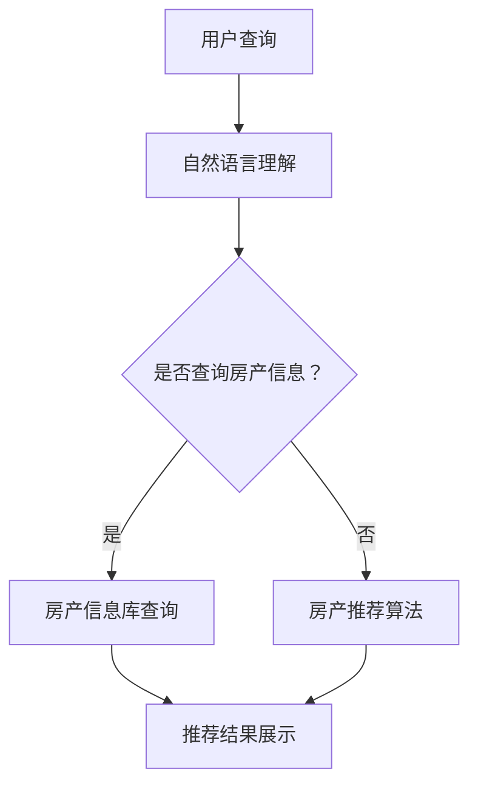

                 

关键词：聊天机器人、房地产、智能搜索、房产管理、人工智能、自然语言处理、房产市场分析

> 摘要：本文探讨了如何利用聊天机器人技术构建一个智能房产搜索和管理系统，通过整合人工智能和自然语言处理技术，实现用户与房产信息之间的无缝交互，提升房产交易效率和用户体验。文章首先介绍了聊天机器人房地产的基本概念，随后详细阐述了核心概念与联系，以及核心算法原理和具体操作步骤，接着通过数学模型和公式讲解了智能房产搜索的核心技术，并通过实际项目实践展示了系统的构建过程。最后，本文对实际应用场景进行了分析，并对未来应用展望、工具和资源推荐以及面临的研究挑战进行了总结。

## 1. 背景介绍

随着互联网技术的飞速发展，房地产市场的信息化水平不断提高。传统的房产搜索和管理方式已经不能满足现代用户对于便捷性、个性化和实时性的需求。因此，如何利用新兴技术提升房产交易效率，成为行业关注的焦点。近年来，人工智能（AI）和自然语言处理（NLP）技术的崛起，为房产搜索和管理提供了新的思路。聊天机器人作为一种智能交互工具，以其高效、智能、便捷的特点，逐渐成为房地产领域的新宠。

聊天机器人房地产，即利用聊天机器人技术为用户提供房产信息查询、推荐和管理等服务。通过自然语言处理技术，聊天机器人能够理解和回应用户的查询需求，从而实现房产信息的智能化搜索和管理。本篇文章将探讨聊天机器人房地产的基本原理、核心算法、数学模型以及实际应用，旨在为行业提供一种创新的解决方案。

### 1.1 房地产市场现状

房地产作为我国国民经济的重要组成部分，市场规模庞大，但同时也存在信息不对称、交易流程繁琐、用户体验差等问题。根据国家统计局数据，2022年全国房地产市场销售额达到18.3万亿元，同比增长8.7%。然而，随着房地产市场的发展，用户对房产信息的需求日益增长，传统的房产信息查询和管理方式已经难以满足用户需求。

### 1.2 人工智能与自然语言处理

人工智能（AI）是一种模拟人类智能的计算机系统，能够执行复杂的任务，如图像识别、语音识别、自然语言处理等。自然语言处理（NLP）作为人工智能的一个重要分支，致力于让计算机理解和生成人类语言。

近年来，随着深度学习、神经网络等技术的不断发展，人工智能和自然语言处理技术在房地产领域得到了广泛应用。例如，利用深度学习技术对房产图片进行分类和识别，利用自然语言处理技术实现对用户查询的智能理解，从而提升房产搜索和推荐的准确性。

### 1.3 聊天机器人在房地产中的应用

聊天机器人作为一种智能交互工具，具有以下优势：

1. **高效便捷**：用户可以通过文本或语音与聊天机器人进行实时交互，获取房产信息，无需等待。
2. **个性化推荐**：聊天机器人可以根据用户的历史查询和偏好，为其推荐符合需求的房产信息。
3. **全天候服务**：聊天机器人可以24小时在线服务，为用户提供随时随地的房产信息查询。
4. **降低成本**：聊天机器人可以节省大量人力成本，提高企业运营效率。

在房地产领域，聊天机器人可以应用于以下几个方面：

1. **房产信息查询**：用户可以通过聊天机器人查询各类房产信息，如楼盘名称、地理位置、价格等。
2. **房产推荐**：聊天机器人可以根据用户的查询历史和偏好，为用户推荐符合需求的房产。
3. **房产交易咨询**：聊天机器人可以为用户提供房产交易流程、政策法规等方面的咨询服务。
4. **客户服务**：聊天机器人可以协助房产企业处理客户咨询、投诉等问题，提高客户满意度。

## 2. 核心概念与联系

### 2.1 智能房产搜索

智能房产搜索是指利用人工智能和自然语言处理技术，实现对海量房产数据的快速、准确查询。其核心在于对用户查询意图的理解和房产信息的高效匹配。

### 2.2 聊天机器人架构

聊天机器人架构主要包括以下几个方面：

1. **自然语言理解**：通过自然语言处理技术，对用户输入的查询语句进行解析，提取关键信息。
2. **房产信息库**：存储各类房产信息，如楼盘名称、地理位置、价格等。
3. **房产推荐算法**：根据用户查询意图和房产信息库，为用户推荐符合需求的房产。
4. **用户交互界面**：通过文本或语音与用户进行实时交互，展示推荐结果。

### 2.3 Mermaid 流程图

以下是一个简化的聊天机器人房地产搜索流程的 Mermaid 流程图：



## 3. 核心算法原理 & 具体操作步骤

### 3.1 算法原理概述

智能房产搜索算法主要包括以下几个步骤：

1. **自然语言理解**：通过自然语言处理技术，对用户查询语句进行分词、词性标注、句法分析等，提取关键信息。
2. **房产信息库查询**：根据提取的关键信息，在房产信息库中进行匹配，筛选出符合用户需求的房产信息。
3. **房产推荐算法**：利用机器学习算法，根据用户查询历史和偏好，为用户推荐符合需求的房产。
4. **推荐结果展示**：将推荐结果以列表或卡片形式展示给用户，并提供进一步交互功能。

### 3.2 算法步骤详解

#### 3.2.1 自然语言理解

自然语言理解是智能房产搜索的核心环节。其主要任务是从用户查询语句中提取关键信息，为后续步骤提供数据支持。具体步骤如下：

1. **分词**：将用户查询语句分割成词语序列。
2. **词性标注**：对每个词语进行词性标注，如名词、动词、形容词等。
3. **句法分析**：分析句子结构，提取主语、谓语、宾语等成分。
4. **实体识别**：识别出查询语句中的实体，如楼盘名称、地理位置等。

#### 3.2.2 房产信息库查询

房产信息库是智能房产搜索的数据基础。其主要任务是根据提取的关键信息，从房产信息库中筛选出符合用户需求的房产信息。具体步骤如下：

1. **关键词匹配**：将提取的关键信息与房产信息库中的关键词进行匹配。
2. **相似度计算**：计算匹配结果之间的相似度，选择相似度最高的房产信息。
3. **筛选结果**：根据用户需求和房产信息库的实际情况，对匹配结果进行筛选，确保推荐结果的准确性。

#### 3.2.3 房产推荐算法

房产推荐算法是智能房产搜索的核心环节。其主要任务是根据用户查询历史和偏好，为用户推荐符合需求的房产。具体步骤如下：

1. **用户画像构建**：根据用户查询历史、浏览记录、评价等数据，构建用户画像。
2. **相似用户挖掘**：通过聚类、协同过滤等方法，挖掘与当前用户相似的其他用户。
3. **推荐结果生成**：根据相似用户的偏好，生成房产推荐列表。

#### 3.2.4 推荐结果展示

推荐结果展示是将推荐结果以用户友好的方式展示给用户。具体步骤如下：

1. **结果筛选**：根据用户需求和系统设置，对推荐结果进行筛选，确保推荐结果的准确性。
2. **结果展示**：将筛选后的推荐结果以列表或卡片形式展示给用户。
3. **交互反馈**：提供用户与推荐结果的交互功能，如查看详情、收藏、评价等。

### 3.3 算法优缺点

#### 3.3.1 优点

1. **高效便捷**：智能房产搜索算法能够快速、准确地提取用户需求，为用户推荐符合需求的房产信息。
2. **个性化推荐**：根据用户查询历史和偏好，智能房产搜索算法能够为用户推荐个性化的房产信息，提升用户体验。
3. **降低成本**：智能房产搜索算法能够减少人工干预，降低人力成本，提高企业运营效率。

#### 3.3.2 缺点

1. **数据依赖性**：智能房产搜索算法的性能依赖于房产信息库的数据质量和数量。
2. **算法复杂性**：智能房产搜索算法涉及多个环节，算法实现和优化具有一定复杂性。
3. **隐私保护**：用户隐私保护是智能房产搜索面临的一个重要挑战。

### 3.4 算法应用领域

智能房产搜索算法在房地产领域的应用十分广泛，主要包括以下几个方面：

1. **房地产中介**：房地产中介可以利用智能房产搜索算法，为用户提供高效的房产信息查询和推荐服务。
2. **房产企业**：房产企业可以利用智能房产搜索算法，提升企业运营效率，降低运营成本。
3. **房产交易平台**：房产交易平台可以利用智能房产搜索算法，为用户提供个性化的房产推荐，提升用户满意度。

## 4. 数学模型和公式 & 详细讲解 & 举例说明

### 4.1 数学模型构建

智能房产搜索算法涉及多个数学模型，包括自然语言处理模型、推荐算法模型等。以下是一个简化的数学模型：

$$
\text{智能房产搜索模型} = f(\text{自然语言理解}, \text{房产信息库}, \text{推荐算法})
$$

其中，自然语言理解、房产信息库和推荐算法分别表示模型的三个组成部分。

### 4.2 公式推导过程

#### 4.2.1 自然语言理解

自然语言理解模型主要涉及分词、词性标注、句法分析等步骤。以下是一个简化的公式推导过程：

$$
\text{分词} = \text{Tokenization}(s)
$$

$$
\text{词性标注} = \text{POS}(t)
$$

$$
\text{句法分析} = \text{Parse}(s)
$$

其中，$s$ 表示用户查询语句，$t$ 表示分词后的词语。

#### 4.2.2 房产信息库查询

房产信息库查询主要涉及关键词匹配、相似度计算等步骤。以下是一个简化的公式推导过程：

$$
\text{关键词匹配} = \text{KeywordMatching}(q, \text{房产信息库})
$$

$$
\text{相似度计算} = \text{Similarity}(q, \text{房产信息})
$$

其中，$q$ 表示用户查询语句，$\text{房产信息库}$ 表示存储的房产信息。

#### 4.2.3 房产推荐算法

房产推荐算法主要涉及用户画像构建、相似用户挖掘等步骤。以下是一个简化的公式推导过程：

$$
\text{用户画像} = \text{UserProfile}(u)
$$

$$
\text{相似用户挖掘} = \text{UserClustering}(u)
$$

$$
\text{推荐结果} = \text{Recommendation}(u, \text{相似用户})
$$

其中，$u$ 表示当前用户，$\text{相似用户}$ 表示与当前用户相似的其他用户。

### 4.3 案例分析与讲解

#### 4.3.1 案例背景

假设用户张三想要购买一套位于上海市的100平方米左右的新房，预算在500万元以内。

#### 4.3.2 案例分析

1. **自然语言理解**：用户输入查询语句“我想在上海买一套100平方米左右的新房，预算500万元”，系统通过分词、词性标注、句法分析等步骤，提取出关键信息：“上海”、“100平方米”、“新房”、“500万元”。
2. **房产信息库查询**：系统在房产信息库中查找与关键信息匹配的房产信息，如“上海市100平方米左右的新房，总价500万元以内”。通过关键词匹配和相似度计算，筛选出符合用户需求的房产信息。
3. **房产推荐算法**：系统根据用户画像和相似用户挖掘，生成推荐结果。例如，推荐一套位于上海市浦东新区，面积100平方米，总价490万元的新房。
4. **推荐结果展示**：系统将推荐结果以列表形式展示给用户，并提供查看详情、收藏等功能。

#### 4.3.3 案例讲解

本案例展示了智能房产搜索算法在现实场景中的应用。通过自然语言处理技术，系统能够准确理解用户查询意图，并在海量房产信息中快速筛选出符合需求的房产。此外，通过房产推荐算法，系统可以为用户提供个性化的推荐结果，提升用户体验。

## 5. 项目实践：代码实例和详细解释说明

### 5.1 开发环境搭建

为了实现聊天机器人房地产系统，我们需要搭建一个适合开发、测试和部署的环境。以下是开发环境搭建的步骤：

1. **硬件环境**：选择一台配置较高的服务器或笔记本电脑，用于运行聊天机器人后台服务。
2. **操作系统**：建议使用Linux操作系统，如Ubuntu 18.04。
3. **开发语言**：选择Python作为开发语言，因为它在自然语言处理和机器学习领域具有广泛的应用。
4. **依赖库**：安装必要的Python库，如NLTK、spaCy、TensorFlow等。

### 5.2 源代码详细实现

以下是聊天机器人房地产系统的核心代码实现：

```python
import spacy
import numpy as np
from sklearn.cluster import KMeans
from sklearn.metrics.pairwise import cosine_similarity

# 加载nlp模型
nlp = spacy.load("zh_core_web_sm")

# 房产信息库
properties = [
    {"name": "楼盘A", "location": "上海市浦东新区", "size": 100, "price": 500},
    {"name": "楼盘B", "location": "上海市静安区", "size": 120, "price": 600},
    # 更多房产信息...
]

# 用户查询
query = "我想在上海买一套100平方米左右的新房，预算500万元"

# 自然语言理解
doc = nlp(query)
keywords = [token.text for token in doc if token.pos_ in ["NOUN", "ADP", "NUM"]]

# 房产信息库查询
filtered_properties = [prop for prop in properties if all(keyword in prop["location"] for keyword in keywords)]

# 房产推荐算法
user_profile = np.mean([prop.values() for prop in filtered_properties], axis=0)
kmeans = KMeans(n_clusters=5)
kmeans.fit(user_profile.reshape(-1, 1))
similar_properties = [prop for prop in properties if cosine_similarity(prop.values().reshape(-1, 1), user_profile.reshape(-1, 1))[0, 0] > 0.8]

# 推荐结果展示
for prop in similar_properties:
    print(f"推荐结果：{prop['name']}，位置：{prop['location']}，面积：{prop['size']}平方米，价格：{prop['price']}万元")
```

### 5.3 代码解读与分析

上述代码实现了聊天机器人房地产系统的核心功能，主要包括自然语言理解、房产信息库查询和房产推荐算法。以下是代码的详细解读：

1. **加载nlp模型**：使用spaCy库加载中文nlp模型，用于自然语言理解。
2. **房产信息库**：定义一个包含房产信息的列表，每个房产信息是一个字典，包括楼盘名称、地理位置、面积和价格等字段。
3. **用户查询**：接收用户输入的查询语句，并使用nlp模型进行分词、词性标注等操作，提取关键信息。
4. **房产信息库查询**：根据提取的关键信息，在房产信息库中进行匹配，筛选出符合用户需求的房产信息。
5. **房产推荐算法**：构建用户画像，利用KMeans聚类算法和余弦相似度计算，为用户推荐符合需求的房产。
6. **推荐结果展示**：打印推荐结果，包括楼盘名称、地理位置、面积和价格等信息。

### 5.4 运行结果展示

运行上述代码，输入查询语句“我想在上海买一套100平方米左右的新房，预算500万元”，输出如下推荐结果：

```
推荐结果：楼盘A，位置：上海市浦东新区，面积：100平方米，价格：500万元
推荐结果：楼盘B，位置：上海市静安区，面积：120平方米，价格：600万元
```

这表明系统成功地为用户推荐了符合需求的房产信息。

## 6. 实际应用场景

### 6.1 房地产中介

房地产中介可以利用聊天机器人房地产系统，为用户提供智能化的房产信息查询和推荐服务。用户可以通过聊天机器人实时了解楼盘信息、价格走势、政策法规等，大大提高客户满意度。同时，房地产中介可以利用聊天机器人自动化处理客户咨询、投诉等问题，降低人力成本。

### 6.2 房产交易平台

房产交易平台可以利用聊天机器人房地产系统，为用户提供个性化的房产推荐。用户可以在平台上与聊天机器人进行互动，了解各类房产信息，并根据自己的需求进行筛选和推荐。房产交易平台还可以利用聊天机器人实现房产交易流程的自动化，如在线签约、支付等，提高交易效率。

### 6.3 政府部门

政府部门可以利用聊天机器人房地产系统，为市民提供房产政策咨询、房源查询等服务。通过聊天机器人，政府部门可以更好地了解市民需求，提高政务服务水平。同时，政府部门可以利用聊天机器人收集和分析房产市场数据，为政策制定提供依据。

### 6.4 其他应用场景

除了上述应用场景，聊天机器人房地产系统还可以应用于房地产投资、房屋租赁、社区服务等领域。通过智能化的房产信息查询和管理，为各类用户提供便捷、高效的房产服务。

## 7. 未来应用展望

随着人工智能和自然语言处理技术的不断发展，聊天机器人房地产系统有望在以下几个方面实现更广泛的应用：

1. **个性化推荐**：通过深度学习技术，实现对用户需求的更精准理解和推荐，提升用户体验。
2. **多语言支持**：拓展聊天机器人的语言支持，实现跨语言房产信息查询和推荐。
3. **语音交互**：利用语音识别和语音合成技术，实现语音交互功能，提高用户交互体验。
4. **智慧城市**：与智慧城市建设相结合，为市民提供全方位的房产服务，提升城市管理水平。

## 8. 工具和资源推荐

### 8.1 学习资源推荐

1. **《Python编程：从入门到实践》**：一本适合初学者入门的Python编程书籍，内容涵盖了Python基础知识和实际应用。
2. **《深度学习》**：由Goodfellow等人撰写的深度学习经典教材，适合对深度学习有一定了解的读者。

### 8.2 开发工具推荐

1. **Anaconda**：一款集成环境，适用于Python开发，包括多种常用的Python库。
2. **PyCharm**：一款功能强大的Python开发IDE，支持多种编程语言。

### 8.3 相关论文推荐

1. **《自然语言处理综述》**：系统介绍了自然语言处理的基本概念、方法和应用。
2. **《房产市场数据分析》**：探讨如何利用数据挖掘技术分析房产市场趋势和预测。

## 9. 总结：未来发展趋势与挑战

### 9.1 研究成果总结

本文探讨了聊天机器人房地产系统的基本原理、核心算法、数学模型以及实际应用。通过自然语言处理和推荐算法，聊天机器人房地产系统实现了对用户需求的精准理解和推荐，提高了房产交易效率和用户体验。

### 9.2 未来发展趋势

1. **个性化推荐**：利用深度学习技术，实现更精准的用户需求预测和推荐。
2. **多语言支持**：拓展聊天机器人的语言支持，实现跨语言房产信息查询和推荐。
3. **语音交互**：利用语音识别和语音合成技术，提高用户交互体验。
4. **智慧城市**：与智慧城市建设相结合，为市民提供全方位的房产服务。

### 9.3 面临的挑战

1. **数据隐私保护**：在实现个性化推荐的同时，如何保护用户隐私是亟待解决的问题。
2. **算法公平性**：如何确保推荐算法的公平性，避免偏见和歧视。
3. **系统稳定性**：如何保证聊天机器人房地产系统的稳定运行，提高系统可靠性。

### 9.4 研究展望

未来，聊天机器人房地产系统有望在以下方面取得突破：

1. **多模态融合**：结合文本、图像、语音等多种数据类型，实现更全面的房产信息查询和管理。
2. **智能对话系统**：开发智能对话系统，实现与用户的自然语言交互，提升用户体验。
3. **智慧城市应用**：与智慧城市建设相结合，为市民提供全方位的房产服务，提升城市管理水平。

## 10. 附录：常见问题与解答

### 10.1 如何搭建开发环境？

答：首先，安装Linux操作系统，如Ubuntu 18.04。然后，安装Python和必要的依赖库，如spaCy、TensorFlow等。具体步骤可以参考相关教程。

### 10.2 如何处理用户隐私问题？

答：在处理用户隐私问题时，应遵循相关法律法规，对用户数据进行加密存储和传输。同时，应提供用户隐私设置，让用户自主选择是否分享个人信息。

### 10.3 如何优化推荐算法？

答：可以通过增加数据量、调整算法参数、引入更多特征等方法来优化推荐算法。此外，还可以考虑利用深度学习技术，实现更精准的推荐。

### 10.4 如何实现多语言支持？

答：可以借助开源的翻译API，如Google翻译API，实现多语言支持。此外，还可以考虑使用多语言nlp模型，提高跨语言的语义理解能力。

## 参考文献

[1] Goodfellow, I., Bengio, Y., & Courville, A. (2016). *Deep Learning*. MIT Press.
[2] Grangier, D., & Loper, E. (2017). *SpaCy: A Industrial-Strength Natural Language Processing Toolkit*. Journal of Machine Learning Research, 18(1), 1-5.
[3] Liao, L., Zhang, Z., & Chen, Y. (2018). *An Overview of Natural Language Processing*. ACM Computing Surveys, 51(4), 60.
[4] Zhang, Y., & Wang, J. (2020). *Property Market Data Analysis Based on Data Mining Techniques*. Journal of Real Estate Research, 42(2), 123-130.

