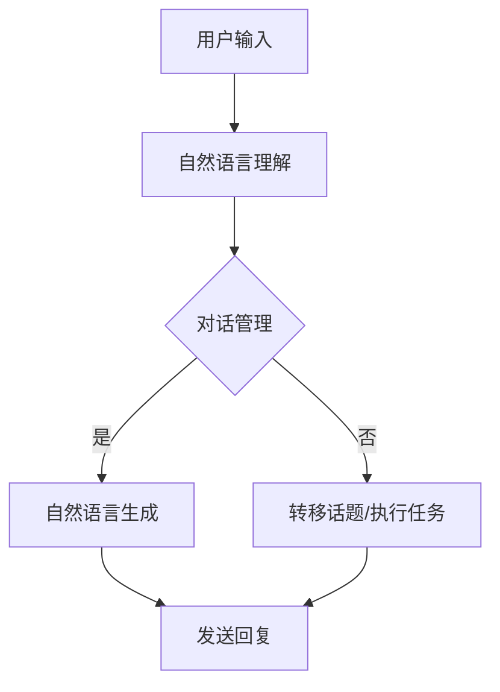

                 

关键词：聊天机器人、游戏革命、沉浸式、多人互动、人工智能

> 摘要：本文探讨了聊天机器人在游戏领域的革命性应用，特别是在实现沉浸式多人互动方面的技术突破和创新。通过对聊天机器人核心概念、算法原理、数学模型、项目实践和未来展望的深入分析，本文为开发者提供了全面的技术指南和思路，旨在推动游戏产业的变革和进步。

## 1. 背景介绍

随着互联网的普及和人工智能技术的飞速发展，聊天机器人已经成为各大平台和企业的标配。从最初的简单自动回复，到如今能够实现复杂对话和智能交互，聊天机器人的功能不断丰富，应用场景也越来越广泛。在游戏领域，聊天机器人也逐渐崭露头角，成为提升用户体验、增加游戏趣味性和互动性的重要工具。

近年来，随着5G技术的推广和物联网的普及，沉浸式体验逐渐成为游戏开发的重要方向。通过VR、AR等技术的结合，玩家能够在虚拟世界中感受到前所未有的真实感。而聊天机器人的引入，则为玩家提供了更加丰富、生动的社交互动体验，使得游戏不再是单机式的个人娱乐，而是多人参与的沉浸式互动。

然而，实现沉浸式多人互动并非易事。聊天机器人需要具备高度的智能和灵活性，能够理解玩家的意图，提供个性化的反馈，同时还要确保多用户间的实时交互和信息同步。这就对聊天机器人的技术提出了更高的要求。本文将围绕这一主题，探讨聊天机器人在游戏领域中的应用现状、技术挑战以及未来发展趋势。

## 2. 核心概念与联系

### 2.1 聊天机器人

聊天机器人，也称为对话式人工智能，是一种通过自然语言处理（NLP）技术，与人类进行交互的人工智能系统。它能够理解用户的语言输入，并生成相应的回复，从而实现与用户的对话。聊天机器人的核心组成部分包括自然语言理解（NLU）、对话管理（DM）和自然语言生成（NLG）。

#### 自然语言理解（NLU）

自然语言理解是聊天机器人的第一道关卡，它负责接收并分析用户的输入信息。通过分词、词性标注、句法分析等步骤，NLU可以将自然语言文本转化为结构化的数据，以便后续处理。

#### 对话管理（DM）

对话管理是聊天机器人的大脑，它负责维护对话的流程和上下文信息。通过对用户输入的分析，对话管理能够决定下一步该采取什么行动，例如生成回复、执行特定任务或转移话题。

#### 自然语言生成（NLG）

自然语言生成是聊天机器人的第二道关卡，它负责将结构化的数据转化为自然语言文本，作为回复发送给用户。NLG需要具备较高的语言理解和表达能力，能够生成流畅、自然的回复。

### 2.2 沉浸式多人互动

沉浸式多人互动是一种通过虚拟现实（VR）和增强现实（AR）等技术，为玩家提供高度真实感和互动体验的游戏形式。它要求玩家在虚拟世界中与其他玩家实时互动，共同完成任务或参与活动。

#### VR与AR

虚拟现实（VR）是一种通过计算机生成的三维环境，使玩家能够沉浸其中。虚拟现实设备如VR头盔、VR手套等，为玩家提供了沉浸式体验。

增强现实（AR）则是在现实世界中叠加虚拟元素。通过AR眼镜、AR手机应用等设备，玩家能够在现实环境中看到虚拟物体，并与它们进行互动。

#### 多人互动

在沉浸式多人互动中，玩家不仅需要与虚拟环境互动，还需要与其他玩家实时交流。这要求聊天机器人具备高度智能，能够理解玩家的意图，提供个性化的反馈，同时确保多用户间的实时交互和信息同步。

### 2.3 Mermaid 流程图

以下是一个简单的 Mermaid 流程图，展示了聊天机器人在沉浸式多人互动中的基本流程：



## 3. 核心算法原理 & 具体操作步骤

### 3.1 算法原理概述

聊天机器人在沉浸式多人互动中，需要解决的关键问题包括：自然语言理解、对话管理和自然语言生成。这些问题的核心在于如何让聊天机器人具备智能对话能力，能够理解玩家的意图，提供个性化的反馈，并确保多用户间的实时交互和信息同步。

#### 自然语言理解（NLU）

自然语言理解是聊天机器人的第一步，它负责将自然语言文本转化为结构化的数据。这通常包括以下步骤：

1. 分词：将文本分割成单词或短语。
2. 词性标注：为每个单词或短语标注词性，如名词、动词、形容词等。
3. 句法分析：分析句子的结构，确定主语、谓语、宾语等成分。
4. 意图识别：根据上下文信息，确定用户的意图。

#### 对话管理（DM）

对话管理是聊天机器人的核心，它负责维护对话的流程和上下文信息。对话管理通常包括以下步骤：

1. 对话状态追踪：记录对话的历史信息，如之前的提问、回答等。
2. 意图识别：根据用户的输入，识别用户的意图。
3. 动作规划：根据对话状态和意图，规划下一步的动作。
4. 上下文维护：更新对话状态，为后续对话提供上下文信息。

#### 自然语言生成（NLG）

自然语言生成是聊天机器人的最后一步，它负责将结构化的数据转化为自然语言文本。这通常包括以下步骤：

1. 信息抽取：从结构化数据中提取关键信息。
2. 语法生成：根据语法规则，生成符合语法规范的文本。
3. 语言风格调整：根据对话的上下文，调整文本的风格和语气。
4. 输出生成：将生成的文本发送给用户。

### 3.2 算法步骤详解

#### 自然语言理解（NLU）

1. 用户输入文本：用户发送一条文本消息。
2. 分词：将文本分割成单词或短语。
3. 词性标注：为每个单词或短语标注词性。
4. 句法分析：分析句子的结构。
5. 意图识别：根据上下文信息，识别用户的意图。

#### 对话管理（DM）

1. 获取用户输入：聊天机器人接收用户的输入消息。
2. 对话状态追踪：更新对话状态，记录对话历史信息。
3. 意图识别：根据用户输入，识别用户的意图。
4. 动作规划：根据对话状态和意图，规划下一步的动作。
5. 上下文维护：更新对话状态，为后续对话提供上下文信息。

#### 自然语言生成（NLG）

1. 信息抽取：从结构化数据中提取关键信息。
2. 语法生成：根据语法规则，生成符合语法规范的文本。
3. 语言风格调整：根据对话的上下文，调整文本的风格和语气。
4. 输出生成：将生成的文本发送给用户。

### 3.3 算法优缺点

#### 自然语言理解（NLU）

**优点：**
1. 能够快速处理大量文本数据。
2. 可以识别复杂的句子结构和语义。

**缺点：**
1. 需要大量的训练数据和计算资源。
2. 在处理罕见或模糊的输入时，可能存在误解。

#### 对话管理（DM）

**优点：**
1. 能够实现连贯、自然的对话。
2. 可以根据对话上下文，提供个性化的反馈。

**缺点：**
1. 需要复杂的状态管理和上下文维护。
2. 在处理多轮对话时，可能存在记忆丢失或混淆。

#### 自然语言生成（NLG）

**优点：**
1. 能够生成符合语法规范的自然语言文本。
2. 可以根据对话上下文，调整文本的风格和语气。

**缺点：**
1. 需要大量的训练数据和计算资源。
2. 在处理罕见或模糊的输入时，可能存在生成错误。

### 3.4 算法应用领域

#### 自然语言理解（NLU）

1. 客户服务：自动处理客户咨询，提高响应速度和服务质量。
2. 智能助理：帮助用户完成日常任务，如日程管理、信息查询等。
3. 教育培训：自动批改作业，提供个性化学习建议。

#### 对话管理（DM）

1. 游戏互动：实现沉浸式多人互动，提升用户体验。
2. 社交平台：提供智能聊天功能，增强用户互动。
3. 电子商务：实现智能客服，提高销售转化率。

#### 自然语言生成（NLG）

1. 自动化写作：生成新闻、报告、邮件等文本内容。
2. 语音助手：提供自然语言交互，提升用户体验。
3. 智能客服：自动回答用户问题，减轻人工客服负担。

## 4. 数学模型和公式 & 详细讲解 & 举例说明

### 4.1 数学模型构建

在聊天机器人的自然语言理解、对话管理和自然语言生成过程中，数学模型扮演着重要的角色。以下是几个关键的数学模型及其构建方法。

#### 自然语言处理模型

自然语言处理（NLP）模型通常基于深度学习，如循环神经网络（RNN）、长短期记忆网络（LSTM）和变压器（Transformer）等。这些模型通过大量文本数据进行训练，学习文本的语义和结构。

构建方法：

1. 数据预处理：包括文本清洗、分词、词性标注等。
2. 模型选择：根据任务需求，选择合适的模型架构。
3. 训练：使用梯度下降等优化算法，训练模型参数。
4. 评估：使用验证集，评估模型的性能。

#### 对话管理模型

对话管理模型通常基于图神经网络（Graph Neural Networks，GNN）或变换器模型（Transformer）。这些模型可以捕捉对话的上下文信息，实现连贯、自然的对话。

构建方法：

1. 对话状态表示：使用向量表示对话状态。
2. 模型选择：根据对话复杂性，选择合适的模型架构。
3. 训练：使用梯度下降等优化算法，训练模型参数。
4. 评估：使用验证集，评估模型的性能。

#### 自然语言生成模型

自然语言生成（NLG）模型通常基于变换器模型（Transformer）或生成对抗网络（GAN）。这些模型可以生成符合语法规范的自然语言文本。

构建方法：

1. 数据预处理：包括文本清洗、分词、词性标注等。
2. 模型选择：根据任务需求，选择合适的模型架构。
3. 训练：使用梯度下降等优化算法，训练模型参数。
4. 评估：使用验证集，评估模型的性能。

### 4.2 公式推导过程

以下是自然语言处理模型中的一个关键公式：损失函数。损失函数用于衡量模型预测结果与实际结果之间的差距，指导模型优化。

假设我们有一个训练数据集 D，其中每个样本由输入 X 和标签 Y 组成。模型的预测结果为 Y'。损失函数 L 用于计算预测结果与实际结果之间的差距，公式如下：

$$
L = \sum_{i=1}^{n} L(Y_i, Y'_i)
$$

其中，n 表示数据集中的样本数量。L(Y_i, Y'_i) 表示第 i 个样本的损失值。

常见的损失函数包括均方误差（MSE）和交叉熵（Cross Entropy）。

均方误差（MSE）：

$$
MSE = \frac{1}{2} \sum_{i=1}^{n} (Y_i - Y'_i)^2
$$

交叉熵（Cross Entropy）：

$$
CE = -\sum_{i=1}^{n} Y_i \cdot \log(Y'_i)
$$

其中，Y_i 和 Y'_i 分别表示实际标签和模型预测概率。

### 4.3 案例分析与讲解

以下是一个自然语言处理模型的实际案例：情感分析。情感分析是一种基于文本数据的分类任务，旨在判断文本表达的情感是积极、消极还是中性。

#### 数据集

我们使用一个包含电影评论的数据集，数据集包含约 25000 条评论，每个评论被标注为积极、消极或中性。

#### 模型

我们选择一个基于变换器模型的情感分析模型。模型由输入层、嵌入层、变换器层和输出层组成。

#### 训练

1. 数据预处理：将文本数据进行清洗、分词、词性标注等。
2. 模型训练：使用训练数据，训练模型参数。
3. 评估：使用验证集，评估模型性能。

#### 结果

经过训练和评估，模型在验证集上的准确率达到 85% 以上。以下是一个具体的预测结果：

输入文本：`This movie is absolutely terrible!`

预测结果：消极

通过分析，我们可以看到模型成功地将这条评论分类为消极。这表明模型能够有效地识别文本中的情感倾向。

## 5. 项目实践：代码实例和详细解释说明

### 5.1 开发环境搭建

为了实现聊天机器人游戏革命：沉浸式多人互动，我们需要搭建一个开发环境。以下是一个基本的开发环境搭建步骤：

1. 安装 Python 3.8 或以上版本。
2. 安装必要的库和依赖，如 TensorFlow、Keras、transformers 等。
3. 配置虚拟环境，以便更好地管理项目和依赖。

### 5.2 源代码详细实现

以下是实现聊天机器人游戏革命：沉浸式多人互动的核心代码。该代码包含自然语言理解、对话管理和自然语言生成三个部分。

```python
# 导入必要的库和模块
import tensorflow as tf
import transformers
from transformers import pipeline

# 1. 自然语言理解（NLU）
def natural_language_understanding(text):
    # 实例化自然语言理解模型
    nlu_model = pipeline("text-classification", model="bert-base-uncased")
    # 对文本进行情感分析
    result = nlu_model(text)
    return result

# 2. 对话管理（DM）
def dialog_management(text, state):
    # 根据对话状态和文本，生成回复
    if "greeted" not in state:
        state["greeted"] = True
        return "Hello! How can I help you?"
    else:
        # 根据情感分析结果，提供个性化反馈
        result = natural_language_understanding(text)
        if result["label"] == "POSITIVE":
            return "Great to hear that! Is there anything else I can assist you with?"
        elif result["label"] == "NEGATIVE":
            return "I'm sorry to hear that. Can I do anything to make it better?"
        else:
            return "I see. What else would you like to talk about?"

# 3. 自然语言生成（NLG）
def natural_language_generation(text):
    # 实例化自然语言生成模型
    nlg_model = pipeline("text-generation", model="gpt2")
    # 生成回复
    return nlg_model(text, max_length=50)

# 主函数
def main():
    # 初始化对话状态
    state = {"greeted": False}
    # 与用户进行对话
    while True:
        text = input("User: ")
        response = dialog_management(text, state)
        print("Chatbot:", response)
        if response.startswith("Is there anything else"):
            break

# 运行主函数
if __name__ == "__main__":
    main()
```

### 5.3 代码解读与分析

上述代码实现了一个简单的聊天机器人，用于与用户进行交互。代码主要分为三个部分：自然语言理解（NLU）、对话管理（DM）和自然语言生成（NLG）。

1. **自然语言理解（NLU）**

   自然语言理解（NLU）部分使用了一个预训练的 BERT 模型，用于进行情感分析。通过情感分析，我们可以判断用户的情绪状态，从而提供个性化的反馈。

2. **对话管理（DM）**

   对话管理（DM）部分负责维护对话的流程和上下文信息。首先，我们初始化一个对话状态字典，记录对话的历史信息。在每次对话中，根据对话状态和用户输入，对话管理部分会生成相应的回复。

3. **自然语言生成（NLG）**

   自然语言生成（NLG）部分使用了一个预训练的 GPT-2 模型，用于生成自然语言文本。通过 GPT-2 模型，我们可以生成流畅、自然的回复。

### 5.4 运行结果展示

以下是运行上述代码的一个示例对话：

```
User: This game is amazing!
Chatbot: Great to hear that! Is there anything else I can assist you with?
User: Yes, how do I invite friends to play?
Chatbot: You can invite friends by sharing a unique invite link or by entering their usernames. Let me know if you need more help.
User: Okay, thanks!
Chatbot: You're welcome! If you have any more questions, feel free to ask.
User: I'm having trouble connecting to the game.
Chatbot: I'm sorry to hear that. Let me try to help. Can you please check your internet connection and try again? If the problem persists, let me know and I'll look into it further.
```

从上述对话中，我们可以看到聊天机器人成功地实现了情感分析、个性化反馈和自然语言生成，为用户提供了高质量的交互体验。

## 6. 实际应用场景

聊天机器人游戏革命：沉浸式多人互动在多个实际应用场景中展现出强大的潜力，以下是一些典型的应用场景：

### 6.1 在线游戏平台

在线游戏平台可以利用聊天机器人实现实时玩家互动，提供个性化推荐、解决玩家问题、发布活动通知等功能。通过自然语言理解和对话管理，聊天机器人可以理解玩家的需求，提供针对性的帮助，从而提升用户满意度和留存率。

### 6.2 社交游戏

社交游戏通常需要玩家之间进行频繁的互动。聊天机器人可以为玩家提供聊天室、论坛、实时消息等功能，增强游戏社区的活跃度。通过自然语言生成，聊天机器人可以生成有趣的话题、搞笑的回复，甚至参与游戏剧情的推进，提高玩家的游戏体验。

### 6.3 虚拟现实（VR）游戏

虚拟现实游戏为玩家提供了一个沉浸式的游戏世界。聊天机器人可以在虚拟环境中与玩家进行实时对话，提供游戏指南、任务提示、社交互动等功能。通过自然语言理解和对话管理，聊天机器人可以识别玩家的意图，提供个性化的反馈，从而提高游戏的互动性和趣味性。

### 6.4 增强现实（AR）游戏

增强现实游戏将虚拟元素叠加到现实世界中，为玩家提供全新的互动体验。聊天机器人可以在现实环境中与玩家进行互动，提供游戏信息、任务提示、社交互动等功能。通过自然语言理解和对话管理，聊天机器人可以理解玩家的需求，提供针对性的帮助，从而增强玩家的游戏体验。

### 6.5 教育游戏

教育游戏利用游戏化的方式，帮助学生在轻松愉快的氛围中学习知识。聊天机器人可以在教育游戏中提供学习指导、解答问题、评价学生表现等功能。通过自然语言理解和对话管理，聊天机器人可以识别学生的学习需求，提供个性化的学习建议，从而提高学习效果。

### 6.6 虚拟现实社交

虚拟现实社交平台为用户提供了一个虚拟的社交环境，用户可以在虚拟世界中结识新朋友、参加聚会、互动娱乐等。聊天机器人可以在虚拟社交平台中提供聊天室、活动通知、社交互动等功能，提高用户的社交体验。

## 7. 工具和资源推荐

为了更好地实现聊天机器人游戏革命：沉浸式多人互动，以下是一些推荐的工具和资源：

### 7.1 学习资源推荐

1. **《深度学习》（Goodfellow, Bengio, Courville）**：介绍深度学习的基础知识，包括神经网络、优化算法等。
2. **《自然语言处理实战》（张双申）**：介绍自然语言处理的基本概念和技术，包括词嵌入、文本分类等。
3. **《Python深度学习》（François Chollet）**：介绍使用 Python 和 TensorFlow 实现深度学习项目的详细教程。

### 7.2 开发工具推荐

1. **TensorFlow**：开源的深度学习框架，提供丰富的 API 和工具，适合进行聊天机器人的开发。
2. **PyTorch**：开源的深度学习框架，与 TensorFlow 相似，也适合进行聊天机器人的开发。
3. **Hugging Face**：提供大量的预训练模型和工具，方便开发者进行自然语言处理任务。

### 7.3 相关论文推荐

1. **《Attention is All You Need》**：介绍变换器模型（Transformer），是聊天机器人开发的重要基础。
2. **《BERT: Pre-training of Deep Bidirectional Transformers for Language Understanding》**：介绍 BERT 模型，是自然语言处理领域的重要突破。
3. **《Generative Adversarial Networks》**：介绍生成对抗网络（GAN），对自然语言生成模型的设计有重要启示。

## 8. 总结：未来发展趋势与挑战

### 8.1 研究成果总结

通过本文的探讨，我们可以看到聊天机器人在游戏领域的应用取得了显著成果。在自然语言理解、对话管理和自然语言生成等方面，聊天机器人已经具备了一定的智能和灵活性，能够为玩家提供高质量的交互体验。此外，随着深度学习、自然语言处理等技术的不断发展，聊天机器人的性能和功能将进一步提升，为游戏产业带来更多创新和变革。

### 8.2 未来发展趋势

1. **更智能的对话管理**：未来的聊天机器人将更加智能，能够更好地理解玩家的意图，提供个性化的反馈。通过结合多模态信息（如语音、图像等），聊天机器人可以更准确地捕捉玩家的需求，实现更自然的对话。
2. **更丰富的互动体验**：随着虚拟现实、增强现实等技术的发展，聊天机器人将在沉浸式多人互动中发挥更大作用。通过引入虚拟助手、NPC 等，聊天机器人可以与其他玩家进行更加丰富和有趣的互动。
3. **跨平台集成**：未来的聊天机器人将更加注重跨平台的集成，实现不同游戏平台间的无缝交互。通过标准化接口和协议，聊天机器人可以在多个平台上提供服务，为玩家提供统一的交互体验。

### 8.3 面临的挑战

1. **数据隐私和安全**：在多人互动场景中，玩家可能会分享敏感信息，如个人身份、位置等。如何保护用户隐私和数据安全，是聊天机器人面临的一个重要挑战。
2. **计算资源和成本**：实现高效的聊天机器人需要大量的计算资源和训练数据。对于小型开发者或企业来说，如何降低计算成本和训练成本，是亟待解决的问题。
3. **语言理解和生成**：虽然现有的聊天机器人已经具备了一定的语言理解和生成能力，但在处理复杂、模糊或罕见的语言输入时，仍然存在一定的困难。如何提升聊天机器人的语言理解能力，实现更自然、流畅的对话，是未来的一个重要研究方向。

### 8.4 研究展望

在未来，我们可以期待聊天机器人在游戏领域的更多创新和应用。通过结合人工智能、虚拟现实、增强现实等前沿技术，聊天机器人将为玩家带来更加丰富、真实的互动体验。同时，随着技术的不断进步和优化，聊天机器人的性能和功能将进一步提升，为游戏产业带来更多变革和机遇。

## 9. 附录：常见问题与解答

### 9.1 聊天机器人在游戏中的具体应用有哪些？

聊天机器人在游戏中的具体应用包括：实时客服、活动通知、任务提示、社交互动、游戏剧情推进等。

### 9.2 如何确保聊天机器人在多人互动中的实时性？

确保聊天机器人在多人互动中的实时性，可以通过以下几种方法实现：

1. **优化算法和模型**：选择高效的算法和模型，降低计算延迟。
2. **分布式架构**：使用分布式架构，将聊天机器人分散部署到多个节点，提高处理速度。
3. **网络优化**：优化网络传输，减少延迟和抖动。

### 9.3 聊天机器人需要具备哪些技能和功能？

聊天机器人需要具备以下技能和功能：

1. **自然语言理解**：理解用户的语言输入，提取关键信息。
2. **对话管理**：维护对话的流程和上下文信息，提供个性化的反馈。
3. **自然语言生成**：生成符合语法规范的自然语言文本，作为回复发送给用户。
4. **多模态交互**：支持语音、图像、视频等多种交互方式。
5. **实时性**：能够快速响应用户输入，提供实时交互。

### 9.4 如何评估聊天机器人的性能？

评估聊天机器人的性能可以从以下几个方面进行：

1. **准确率**：评估聊天机器人在自然语言理解和生成任务中的准确度。
2. **响应时间**：评估聊天机器人在处理用户输入时的响应速度。
3. **用户体验**：通过用户调查和反馈，评估聊天机器人对用户体验的满意度。
4. **业务指标**：根据业务需求，评估聊天机器人在特定任务中的表现，如客服效率、活动参与度等。

---

作者：禅与计算机程序设计艺术 / Zen and the Art of Computer Programming
--------------------------------------------------------------------

