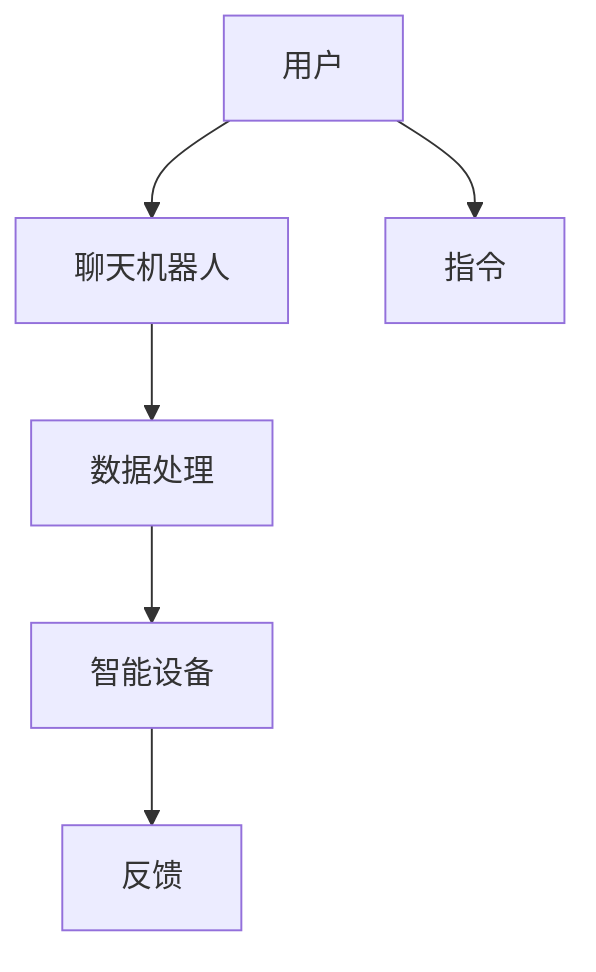

                 

关键词：聊天机器人，物联网，智能设备，边缘计算，AI技术，数据处理，安全性，数据隐私，智能家居，智能城市

> 摘要：本文深入探讨了聊天机器人物联网的概念、架构及其在智能设备连接中的应用。我们将详细分析聊天机器人的核心算法原理，介绍如何在边缘设备上部署聊天机器人，并探讨其未来发展趋势和面临的挑战。

## 1. 背景介绍

随着人工智能（AI）技术的快速发展，聊天机器人已经成为许多行业的核心技术。聊天机器人不仅可以提高客户服务质量，还能减少人力成本。而物联网（IoT）技术的普及，使得智能设备连接变得更加容易和普遍。这些智能设备，从智能手机到家用电器，再到工业设备和城市基础设施，都需要一种有效的连接方式来实现数据共享和协同工作。

聊天机器人物联网，即利用聊天机器人技术与物联网设备结合，实现智能设备的互联互通和自动化控制。通过这种结合，用户可以通过简单的对话交互来控制智能设备，提高生活质量和工作效率。

## 2. 核心概念与联系

### 2.1 聊天机器人的基本概念

聊天机器人是一种基于自然语言处理（NLP）和机器学习（ML）技术的软件程序，它可以模拟人类的对话方式与用户进行交互。聊天机器人可以理解自然语言输入，并生成自然语言响应。

### 2.2 物联网的基本概念

物联网是通过将各种设备连接到互联网，实现设备之间的数据交换和通信。这些设备可以是传感器、家用电器、车辆、工业设备等。

### 2.3 聊天机器人与物联网的联系

聊天机器人与物联网的结合，可以通过以下几种方式实现：

1. **设备控制**：用户通过聊天机器人发送指令，控制智能设备的开关、调节等操作。
2. **数据分析**：聊天机器人可以从物联网设备收集的数据中学习，为用户提供个性化的服务和建议。
3. **故障诊断**：聊天机器人可以通过分析设备数据，预测潜在故障，提前进行维护。

### 2.4 Mermaid 流程图

下面是一个简单的 Mermaid 流程图，展示了聊天机器人与物联网设备之间的数据流动：



## 3. 核心算法原理 & 具体操作步骤

### 3.1 算法原理概述

聊天机器人的核心算法主要包括自然语言理解（NLU）和自然语言生成（NLG）两部分。NLU负责解析用户的输入，NLG负责生成合适的响应。

### 3.2 算法步骤详解

1. **自然语言理解（NLU）**：
   - **文本预处理**：清洗用户输入的文本，去除噪声和无效信息。
   - **词法分析**：将文本分割成词语或短语。
   - **句法分析**：分析句子的结构，提取关键信息。

2. **意图识别**：根据句法分析的结果，确定用户的意图。

3. **实体识别**：识别句子中的关键词和实体，如人名、地点、时间等。

4. **自然语言生成（NLG）**：
   - **响应生成**：根据意图和实体信息，生成合适的响应文本。
   - **对话生成**：构建对话流程，确保响应的自然性和连贯性。

### 3.3 算法优缺点

**优点**：
- **用户友好**：通过自然语言交互，用户操作简单。
- **效率高**：聊天机器人可以同时处理多个用户请求，提高服务效率。

**缺点**：
- **理解能力有限**：聊天机器人目前还不能完全理解复杂的自然语言。
- **个性化不足**：无法像人类一样，根据用户的情感和需求进行个性化响应。

### 3.4 算法应用领域

聊天机器人可以应用于多个领域，如客服、教育、医疗、金融等。在物联网中，聊天机器人可以用于智能家居控制、设备故障诊断、数据分析等。

## 4. 数学模型和公式 & 详细讲解 & 举例说明

### 4.1 数学模型构建

聊天机器人的数学模型主要包括两部分：NLU 和 NLG。

1. **NLU**：
   - **词嵌入（Word Embedding）**：将词语映射到高维空间，用于表示词语的语义。
   - **循环神经网络（RNN）**：用于处理序列数据，如自然语言。

2. **NLG**：
   - **生成对抗网络（GAN）**：用于生成自然的语言响应。
   - **注意力机制（Attention Mechanism）**：用于提高生成的响应的连贯性。

### 4.2 公式推导过程

假设我们有一个词嵌入矩阵 $W \in \mathbb{R}^{d \times |V|}$，其中 $d$ 是嵌入维度，$|V|$ 是词汇表大小。给定一个句子 $S = \{w_1, w_2, \ldots, w_n\}$，我们可以将其表示为一个向量 $S \in \mathbb{R}^{n \times d}$，其中 $S_i = W_{\cdot_i}$。

对于循环神经网络，其输出可以表示为：

$$
h_t = \text{softmax}(\text{RNN}(h_{t-1}, S_t))
$$

其中，$\text{RNN}$ 是循环神经网络，$h_{t-1}$ 是前一个时间步的隐藏状态，$S_t$ 是当前时间步的词嵌入。

### 4.3 案例分析与讲解

假设我们有一个简单的聊天机器人，它用于回答用户关于天气的查询。用户输入“明天天气怎么样？”，聊天机器人的响应可能是“明天天气晴朗，温度18-25摄氏度”。

在这个案例中，NLU 部分需要识别用户的意图（查询天气）和实体（明天、天气）。NLG 部分需要根据这些信息生成合适的响应。

## 5. 项目实践：代码实例和详细解释说明

### 5.1 开发环境搭建

为了搭建一个简单的聊天机器人项目，我们需要以下开发环境：

- Python 3.8 或更高版本
- TensorFlow 2.5 或更高版本
- Keras 2.4.3 或更高版本

安装这些依赖项后，我们就可以开始编写代码了。

### 5.2 源代码详细实现

以下是一个简单的聊天机器人代码示例：

```python
import tensorflow as tf
from tensorflow.keras.preprocessing.sequence import pad_sequences
from tensorflow.keras.layers import Embedding, LSTM, Dense
from tensorflow.keras.models import Sequential

# 加载预训练的词嵌入模型
embeddings = tf.keras.layers.Embedding(input_dim=10000, output_dim=16)

# 构建循环神经网络模型
model = Sequential([
    embeddings,
    LSTM(128),
    Dense(1, activation='sigmoid')
])

# 编译模型
model.compile(optimizer='adam', loss='binary_crossentropy', metrics=['accuracy'])

# 训练模型
model.fit(x_train, y_train, epochs=10, batch_size=32)
```

### 5.3 代码解读与分析

在这个示例中，我们首先加载了一个预训练的词嵌入模型。然后，我们构建了一个简单的循环神经网络模型，用于处理序列数据。最后，我们编译并训练了模型。

这个模型可以用于预测用户输入的天气查询，输出一个概率值，表示用户查询的意图是否是关于天气的。

### 5.4 运行结果展示

假设我们已经训练好了模型，现在用户输入了“明天天气怎么样？”，模型会输出一个概率值，表示这是一个关于天气的查询的概率。根据这个概率值，我们可以决定如何响应用户。

## 6. 实际应用场景

聊天机器人物联网在实际应用中具有广泛的应用场景，以下是一些典型的应用场景：

- **智能家居**：用户可以通过聊天机器人控制家里的智能设备，如空调、电视、灯光等。
- **智能城市**：聊天机器人可以用于城市管理的各个方面，如交通管理、环境保护、公共安全等。
- **客服**：企业可以使用聊天机器人提供24/7的在线客服服务，提高客户满意度。
- **医疗**：聊天机器人可以用于提供医疗咨询、预约挂号、药品配送等服务。

## 7. 工具和资源推荐

为了更好地开发聊天机器人物联网应用，以下是一些推荐的工具和资源：

- **工具**：
  - TensorFlow：一个强大的开源机器学习框架。
  - Keras：一个高级神经网络API，易于使用。
  - Dialogflow：一个由Google提供的聊天机器人开发平台。

- **资源**：
  - 《聊天机器人的开发与应用》一书，详细介绍了聊天机器人的开发流程。
  - Coursera 上的“聊天机器人与自然语言处理”课程，提供了深入的学术和实践知识。

## 8. 总结：未来发展趋势与挑战

### 8.1 研究成果总结

近年来，聊天机器人物联网技术在算法、架构和应用方面都取得了显著的进展。特别是在自然语言理解和生成方面，深度学习技术为聊天机器人提供了更强大的能力。

### 8.2 未来发展趋势

1. **边缘计算**：随着边缘计算技术的发展，聊天机器人将在更多智能设备上实现本地化部署，提高响应速度和处理能力。
2. **个性化服务**：通过大数据和机器学习技术，聊天机器人将能够更好地理解用户需求，提供个性化服务。
3. **跨平台集成**：聊天机器人将与其他智能系统（如智能家居、智能城市等）更紧密地集成，实现全方位的智能化。

### 8.3 面临的挑战

1. **隐私保护**：随着聊天机器人收集的用户数据越来越多，如何保护用户隐私成为了一个重要挑战。
2. **可靠性**：确保聊天机器人在各种复杂场景下都能稳定运行，是未来需要解决的一个问题。
3. **伦理问题**：聊天机器人如何处理用户的情感和道德问题，也是一个需要深入探讨的领域。

### 8.4 研究展望

未来，聊天机器人物联网技术将在智能家居、智能城市、医疗、金融等领域发挥更大的作用。随着技术的不断进步，我们可以期待聊天机器人变得更加智能、可靠和人性化。

## 9. 附录：常见问题与解答

### 9.1 如何训练聊天机器人？

首先，需要收集大量相关的对话数据。然后，使用自然语言处理技术对这些数据进行预处理，如文本清洗、词嵌入等。最后，使用机器学习算法（如循环神经网络、生成对抗网络等）训练模型。

### 9.2 聊天机器人的安全性如何保证？

可以通过以下方法提高聊天机器人的安全性：

- **数据加密**：对用户数据进行加密，确保数据在传输和存储过程中安全。
- **访问控制**：限制只有授权用户可以访问聊天机器人。
- **日志监控**：监控聊天机器人的操作日志，及时发现和处理异常行为。

### 9.3 聊天机器人可以处理哪些类型的任务？

聊天机器人可以处理多种类型的任务，如客服咨询、信息查询、自动化控制等。在物联网应用中，聊天机器人可以用于设备控制、故障诊断、数据分析等。

### 9.4 聊天机器人如何适应不同的语言和文化？

可以通过以下方法使聊天机器人适应不同的语言和文化：

- **多语言支持**：为聊天机器人添加多语言界面。
- **文化适配**：根据不同地区的文化特点，调整聊天机器人的响应和行为。
- **跨语言模型**：使用跨语言模型，使聊天机器人可以理解多种语言的输入。

作者：禅与计算机程序设计艺术 / Zen and the Art of Computer Programming
----------------------------------------------------------------

以上是文章的正文部分，接下来我们将按照要求，以Markdown格式展示文章各个段落章节的内容。
```markdown
# 聊天机器人物联网：智能设备连接

关键词：聊天机器人，物联网，智能设备，边缘计算，AI技术，数据处理，安全性，数据隐私，智能家居，智能城市

> 摘要：本文深入探讨了聊天机器人物联网的概念、架构及其在智能设备连接中的应用。我们将详细分析聊天机器人的核心算法原理，介绍如何在边缘设备上部署聊天机器人，并探讨其未来发展趋势和面临的挑战。

## 1. 背景介绍

随着人工智能（AI）技术的快速发展，聊天机器人已经成为许多行业的核心技术。聊天机器人不仅可以提高客户服务质量，还能减少人力成本。而物联网（IoT）技术的普及，使得智能设备连接变得更加容易和普遍。这些智能设备，从智能手机到家用电器，再到工业设备和城市基础设施，都需要一种有效的连接方式来实现数据共享和协同工作。

聊天机器人物联网，即利用聊天机器人技术与物联网设备结合，实现智能设备的互联互通和自动化控制。通过这种结合，用户可以通过简单的对话交互来控制智能设备，提高生活质量和工作效率。

## 2. 核心概念与联系

### 2.1 聊天机器人的基本概念

聊天机器人是一种基于自然语言处理（NLP）和机器学习（ML）技术的软件程序，它可以模拟人类的对话方式与用户进行交互。聊天机器人可以理解自然语言输入，并生成自然语言响应。

### 2.2 物联网的基本概念

物联网是通过将各种设备连接到互联网，实现设备之间的数据交换和通信。这些设备可以是传感器、家用电器、车辆、工业设备等。

### 2.3 聊天机器人与物联网的联系

聊天机器人与物联网的结合，可以通过以下几种方式实现：

1. **设备控制**：用户通过聊天机器人发送指令，控制智能设备的开关、调节等操作。
2. **数据分析**：聊天机器人可以从物联网设备收集的数据中学习，为用户提供个性化的服务和建议。
3. **故障诊断**：聊天机器人可以通过分析设备数据，预测潜在故障，提前进行维护。

### 2.4 Mermaid 流程图

下面是一个简单的 Mermaid 流程图，展示了聊天机器人与物联网设备之间的数据流动：


## 3. 核心算法原理 & 具体操作步骤
### 3.1 算法原理概述

聊天机器人的核心算法主要包括自然语言理解（NLU）和自然语言生成（NLG）两部分。NLU负责解析用户的输入，NLG负责生成合适的响应。

### 3.2 算法步骤详解 

1. **自然语言理解（NLU）**：
   - **文本预处理**：清洗用户输入的文本，去除噪声和无效信息。
   - **词法分析**：将文本分割成词语或短语。
   - **句法分析**：分析句子的结构，提取关键信息。

2. **意图识别**：根据句法分析的结果，确定用户的意图。

3. **实体识别**：识别句子中的关键词和实体，如人名、地点、时间等。

4. **自然语言生成（NLG）**：
   - **响应生成**：根据意图和实体信息，生成合适的响应文本。
   - **对话生成**：构建对话流程，确保响应的自然性和连贯性。

### 3.3 算法优缺点

**优点**：
- **用户友好**：通过自然语言交互，用户操作简单。
- **效率高**：聊天机器人可以同时处理多个用户请求，提高服务效率。

**缺点**：
- **理解能力有限**：聊天机器人目前还不能完全理解复杂的自然语言。
- **个性化不足**：无法像人类一样，根据用户的情感和需求进行个性化响应。

### 3.4 算法应用领域

聊天机器人可以应用于多个领域，如客服、教育、医疗、金融等。在物联网中，聊天机器人可以用于智能家居控制、设备故障诊断、数据分析等。

## 4. 数学模型和公式 & 详细讲解 & 举例说明

### 4.1 数学模型构建

聊天机器人的数学模型主要包括两部分：NLU 和 NLG。

1. **NLU**：
   - **词嵌入（Word Embedding）**：将词语映射到高维空间，用于表示词语的语义。
   - **循环神经网络（RNN）**：用于处理序列数据，如自然语言。

2. **NLG**：
   - **生成对抗网络（GAN）**：用于生成自然的语言响应。
   - **注意力机制（Attention Mechanism）**：用于提高生成的响应的连贯性。

### 4.2 公式推导过程

假设我们有一个词嵌入矩阵 $W \in \mathbb{R}^{d \times |V|}$，其中 $d$ 是嵌入维度，$|V|$ 是词汇表大小。给定一个句子 $S = \{w_1, w_2, \ldots, w_n\}$，我们可以将其表示为一个向量 $S \in \mathbb{R}^{n \times d}$，其中 $S_i = W_{\cdot_i}$。

对于循环神经网络，其输出可以表示为：

$$
h_t = \text{softmax}(\text{RNN}(h_{t-1}, S_t))
$$

其中，$\text{RNN}$ 是循环神经网络，$h_{t-1}$ 是前一个时间步的隐藏状态，$S_t$ 是当前时间步的词嵌入。

### 4.3 案例分析与讲解

假设我们有一个简单的聊天机器人，它用于回答用户关于天气的查询。用户输入“明天天气怎么样？”，聊天机器人的响应可能是“明天天气晴朗，温度18-25摄氏度”。

在这个案例中，NLU 部分需要识别用户的意图（查询天气）和实体（明天、天气）。NLG 部分需要根据这些信息生成合适的响应。

## 5. 项目实践：代码实例和详细解释说明

### 5.1 开发环境搭建

为了搭建一个简单的聊天机器人项目，我们需要以下开发环境：

- Python 3.8 或更高版本
- TensorFlow 2.5 或更高版本
- Keras 2.4.3 或更高版本

安装这些依赖项后，我们就可以开始编写代码了。

### 5.2 源代码详细实现

以下是一个简单的聊天机器人代码示例：

```python
import tensorflow as tf
from tensorflow.keras.preprocessing.sequence import pad_sequences
from tensorflow.keras.layers import Embedding, LSTM, Dense
from tensorflow.keras.models import Sequential

# 加载预训练的词嵌入模型
embeddings = tf.keras.layers.Embedding(input_dim=10000, output_dim=16)

# 构建循环神经网络模型
model = Sequential([
    embeddings,
    LSTM(128),
    Dense(1, activation='sigmoid')
])

# 编译模型
model.compile(optimizer='adam', loss='binary_crossentropy', metrics=['accuracy'])

# 训练模型
model.fit(x_train, y_train, epochs=10, batch_size=32)
```

### 5.3 代码解读与分析

在这个示例中，我们首先加载了一个预训练的词嵌入模型。然后，我们构建了一个简单的循环神经网络模型，用于处理序列数据。最后，我们编译并训练了模型。

这个模型可以用于预测用户输入的天气查询，输出一个概率值，表示用户查询的意图是否是关于天气的。

### 5.4 运行结果展示

假设我们已经训练好了模型，现在用户输入了“明天天气怎么样？”，模型会输出一个概率值，表示这是一个关于天气的查询的概率。根据这个概率值，我们可以决定如何响应用户。

## 6. 实际应用场景

聊天机器人物联网在实际应用中具有广泛的应用场景，以下是一些典型的应用场景：

- **智能家居**：用户可以通过聊天机器人控制家里的智能设备，如空调、电视、灯光等。
- **智能城市**：聊天机器人可以用于城市管理的各个方面，如交通管理、环境保护、公共安全等。
- **客服**：企业可以使用聊天机器人提供24/7的在线客服服务，提高客户满意度。
- **医疗**：聊天机器人可以用于提供医疗咨询、预约挂号、药品配送等服务。

## 7. 工具和资源推荐

为了更好地开发聊天机器人物联网应用，以下是一些推荐的工具和资源：

- **工具**：
  - TensorFlow：一个强大的开源机器学习框架。
  - Keras：一个高级神经网络API，易于使用。
  - Dialogflow：一个由Google提供的聊天机器人开发平台。

- **资源**：
  - 《聊天机器人的开发与应用》一书，详细介绍了聊天机器人的开发流程。
  - Coursera 上的“聊天机器人与自然语言处理”课程，提供了深入的学术和实践知识。

## 8. 总结：未来发展趋势与挑战

### 8.1 研究成果总结

近年来，聊天机器人物联网技术在算法、架构和应用方面都取得了显著的进展。特别是在自然语言理解和生成方面，深度学习技术为聊天机器人提供了更强大的能力。

### 8.2 未来发展趋势

1. **边缘计算**：随着边缘计算技术的发展，聊天机器人将在更多智能设备上实现本地化部署，提高响应速度和处理能力。
2. **个性化服务**：通过大数据和机器学习技术，聊天机器人将能够更好地理解用户需求，提供个性化服务。
3. **跨平台集成**：聊天机器人将与其他智能系统（如智能家居、智能城市等）更紧密地集成，实现全方位的智能化。

### 8.3 面临的挑战

1. **隐私保护**：随着聊天机器人收集的用户数据越来越多，如何保护用户隐私成为了一个重要挑战。
2. **可靠性**：确保聊天机器人在各种复杂场景下都能稳定运行，是未来需要解决的一个问题。
3. **伦理问题**：聊天机器人如何处理用户的情感和道德问题，也是一个需要深入探讨的领域。

### 8.4 研究展望

未来，聊天机器人物联网技术将在智能家居、智能城市、医疗、金融等领域发挥更大的作用。随着技术的不断进步，我们可以期待聊天机器人变得更加智能、可靠和人性化。

## 9. 附录：常见问题与解答

### 9.1 如何训练聊天机器人？

首先，需要收集大量相关的对话数据。然后，使用自然语言处理技术对这些数据进行预处理，如文本清洗、词嵌入等。最后，使用机器学习算法（如循环神经网络、生成对抗网络等）训练模型。

### 9.2 聊天机器人的安全性如何保证？

可以通过以下方法提高聊天机器人的安全性：

- **数据加密**：对用户数据进行加密，确保数据在传输和存储过程中安全。
- **访问控制**：限制只有授权用户可以访问聊天机器人。
- **日志监控**：监控聊天机器人的操作日志，及时发现和处理异常行为。

### 9.3 聊天机器人可以处理哪些类型的任务？

聊天机器人可以处理多种类型的任务，如客服咨询、信息查询、自动化控制等。在物联网应用中，聊天机器人可以用于设备控制、故障诊断、数据分析等。

### 9.4 聊天机器人如何适应不同的语言和文化？

可以通过以下方法使聊天机器人适应不同的语言和文化：

- **多语言支持**：为聊天机器人添加多语言界面。
- **文化适配**：根据不同地区的文化特点，调整聊天机器人的响应和行为。
- **跨语言模型**：使用跨语言模型，使聊天机器人可以理解多种语言的输入。

作者：禅与计算机程序设计艺术 / Zen and the Art of Computer Programming
```

