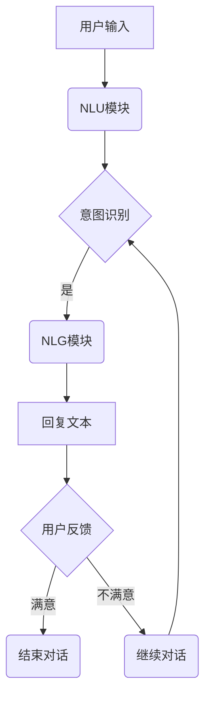

                 

关键词：聊天机器人、管理层、战略决策、商业洞察力、AI技术、用户体验、平台架构、技术框架、案例分析、应用领域、未来展望。

> 摘要：本文将深入探讨聊天机器人在当今商业环境中的重要性，分析其管理层所需具备的战略决策和商业洞察力。通过对核心概念、算法原理、数学模型、项目实践以及未来应用的详细阐述，本文旨在为读者提供全面的聊天机器人管理指南。

## 1. 背景介绍

随着人工智能技术的飞速发展，聊天机器人已经成为了现代商业运营中不可或缺的一部分。无论是提供客户服务、市场营销，还是内部沟通，聊天机器人都能显著提升效率、降低成本，并提高用户满意度。然而，要成功地管理聊天机器人，不仅需要深入的技术理解，还需要具备战略决策和商业洞察力。

本文将围绕以下几个方面展开：

- **核心概念与联系**：介绍聊天机器人的基础概念，并绘制其架构流程图。
- **核心算法原理 & 具体操作步骤**：探讨聊天机器人背后的算法原理和操作步骤。
- **数学模型和公式 & 详细讲解 & 举例说明**：阐述聊天机器人中的数学模型和公式应用。
- **项目实践：代码实例和详细解释说明**：提供实际的代码实现和解释。
- **实际应用场景**：分析聊天机器人在不同行业中的应用案例。
- **未来应用展望**：探讨聊天机器人的发展趋势和潜在挑战。

### 1.1 聊天机器人的起源与发展

聊天机器人最早出现在20世纪50年代，当时的计算机科学家和程序员致力于创建能够模拟人类对话的机器。随着时间的推移，自然语言处理（NLP）和机器学习技术的进步，聊天机器人的能力和应用场景也不断扩展。如今，聊天机器人已经广泛应用于电子商务、金融服务、医疗保健、教育等多个领域。

### 1.2 聊天机器人在商业中的应用

聊天机器人在商业中扮演着多重角色，包括但不限于：

- **客户服务**：提供24/7的客户支持，减少等待时间，提高用户满意度。
- **市场营销**：通过个性化推荐和互动，增加客户参与度和忠诚度。
- **内部沟通**：简化员工之间的沟通流程，提高工作效率。

### 1.3 聊天机器人的管理挑战

要成功地管理聊天机器人，管理层需要应对以下挑战：

- **技术复杂性**：理解并管理聊天机器人的技术架构和算法。
- **用户体验**：确保聊天机器人的交互设计人性化、高效。
- **数据隐私和安全**：处理用户数据，确保合规性和安全性。
- **持续优化**：根据用户反馈和业务需求不断迭代和改进聊天机器人。

接下来，本文将详细探讨上述各个方面的内容。|<|assistant|>**
## 2. 核心概念与联系

### 2.1 聊天机器人的基本概念

聊天机器人是一种基于人工智能（AI）技术，能够与人类进行自然语言交互的计算机程序。其主要功能包括：

- **文本交互**：通过文本输入与输出进行对话。
- **语音交互**：通过语音识别和合成技术实现语音对话。
- **意图识别**：理解用户的意图，如询问信息、解决问题等。
- **实体识别**：识别并提取用户对话中的关键信息，如人名、地点、时间等。

聊天机器人的架构通常包括以下几个主要模块：

- **自然语言理解（NLU）**：将用户的输入转换为机器可以理解的结构化数据。
- **对话管理**：根据用户的输入和上下文信息，决定对话的走向。
- **自然语言生成（NLG）**：生成自然流畅的回复文本。
- **应用接口**：连接聊天机器人与外部系统，如数据库、API等。

### 2.2 聊天机器人的架构流程图

下面是一个简化的聊天机器人架构流程图，描述了用户与聊天机器人交互的基本流程：



### 2.3 聊天机器人与其他技术的关系

聊天机器人不仅仅是AI技术的应用，还与其他技术紧密相关：

- **自然语言处理（NLP）**：NLP是聊天机器人技术的核心，用于处理和理解自然语言。
- **机器学习（ML）**：通过机器学习，聊天机器人可以不断学习和优化其对话能力。
- **语音识别（ASR）**和**语音合成（TTS）**：实现语音交互功能。
- **云计算**：提供弹性的计算资源，支持大规模聊天机器人的部署和运行。
- **大数据**：用于分析用户行为，优化聊天机器人的性能。

### 2.4 聊天机器人的管理层次

要成功地管理聊天机器人，管理层需要从多个层次进行考虑：

- **战略层次**：确定聊天机器人在公司中的角色和目标，制定长期战略。
- **技术层次**：选择合适的技术栈，搭建和维护聊天机器人平台。
- **运营层次**：监控聊天机器人的运行状态，收集用户反馈，不断优化。
- **用户层次**：设计用户友好的交互界面，提高用户体验。

通过上述核心概念与联系的分析，我们可以更好地理解聊天机器人的工作原理和管理要点。在接下来的章节中，我们将深入探讨聊天机器人的核心算法原理、数学模型以及实际应用案例。

```mermaid
graph TB
A[用户输入文本] --> B[自然语言理解(NLU)]
B --> C[意图识别]
C -->|查询| D[查询数据库]
C -->|订单| E[订单处理系统]
C -->|其他| F[自定义响应]
F --> G[自然语言生成(NLG)]
G --> H[回复文本]
H --> I[用户反馈]
I --> J{是否满意}
J -->|是| K[结束对话]
J -->|否| L[继续对话]
L --> C
```
**核心算法原理 & 具体操作步骤**

### 3.1 算法原理概述

聊天机器人的核心算法主要包括自然语言理解（NLU）和自然语言生成（NLG）两个部分。

#### 自然语言理解（NLU）

NLU模块的主要任务是理解用户的输入，并将其转换为机器可以处理的结构化数据。这一过程通常包括以下几个步骤：

1. **分词（Tokenization）**：将文本分割成单词或短语。
2. **词性标注（Part-of-Speech Tagging）**：识别每个词的词性，如名词、动词、形容词等。
3. **实体识别（Named Entity Recognition）**：识别并提取文本中的关键实体，如人名、地名、组织名等。
4. **句法分析（Syntax Parsing）**：分析句子的结构，识别主语、谓语、宾语等。
5. **意图识别（Intent Recognition）**：根据用户的输入内容，判断用户的意图，如查询信息、进行预订等。

#### 自然语言生成（NLG）

NLG模块的主要任务是生成自然流畅的回复文本，其过程包括：

1. **模板匹配（Template Matching）**：根据预定义的模板生成回复。
2. **规则生成（Rule-Based Generation）**：根据预定义的规则生成回复。
3. **统计模型（Statistical Models）**：使用统计方法，如朴素贝叶斯、隐马尔可夫模型（HMM）等生成回复。
4. **神经网络模型（Neural Network Models）**：使用深度学习模型，如循环神经网络（RNN）、长短期记忆网络（LSTM）等生成回复。

### 3.2 算法步骤详解

#### 自然语言理解（NLU）

1. **分词（Tokenization）**：
    ```mermaid
    graph TB
    A[用户输入文本] --> B[分词器]
    B --> C{分割为：你好，世界！}
    C --> D{['你好', '，', '世界', '！']}
    ```

2. **词性标注（Part-of-Speech Tagging）**：
    ```mermaid
    graph TB
    D --> E[词性标注器]
    E --> F{['你好'(v), '，'(p), '世界'(n), '！'(e)}}
    ```

3. **实体识别（Named Entity Recognition）**：
    ```mermaid
    graph TB
    F --> G[实体识别器]
    G --> H{['你好'(v), '，'(p), '世界'(n), '！'(e), '世界'('地名', 'Earth')}}}
    ```

4. **句法分析（Syntax Parsing）**：
    ```mermaid
    graph TB
    H --> I[句法分析器]
    I --> J{['你好'(v), '世界'(n), '！'(e)]}
    ```

5. **意图识别（Intent Recognition）**：
    ```mermaid
    graph TB
    J --> K[意图识别器]
    K --> L{[意图：问候]}
    ```

#### 自然语言生成（NLG）

1. **模板匹配（Template Matching）**：
    ```mermaid
    graph TB
    L --> M[模板匹配器]
    M --> N{[回复模板：你好，欢迎来到XXX网站！]}
    ```

2. **规则生成（Rule-Based Generation）**：
    ```mermaid
    graph TB
    N --> O[规则生成器]
    O --> P{[回复：你好，欢迎来到XXX网站！]}
    ```

3. **统计模型（Statistical Models）**：
    ```mermaid
    graph TB
    P --> Q[统计模型生成器]
    Q --> R{[回复：你好，欢迎来到XXX网站！]}
    ```

4. **神经网络模型（Neural Network Models）**：
    ```mermaid
    graph TB
    R --> S[神经网络模型生成器]
    S --> T{[回复：你好，欢迎来到XXX网站！]}
    ```

通过上述详细的算法步骤，我们可以更好地理解聊天机器人的工作原理。在接下来的章节中，我们将深入探讨这些算法的优缺点，以及它们在不同应用领域中的应用。

### 3.3 算法优缺点

#### 自然语言理解（NLU）

**优点**：

1. **准确性**：现代NLU技术，如深度学习模型，通常具有很高的准确性，能够准确理解用户的输入。
2. **灵活性**：NLU技术可以处理多种语言和方言，具有良好的通用性。
3. **实时响应**：NLU技术能够快速处理用户的输入，提供实时响应。

**缺点**：

1. **复杂度高**：NLU涉及多种复杂的技术，如分词、词性标注、实体识别等，对技术要求较高。
2. **上下文理解不足**：在某些情况下，NLU技术可能难以理解复杂的上下文关系，导致误解用户意图。
3. **数据依赖性强**：NLU模型的训练和优化需要大量高质量的数据，数据不足可能导致模型性能下降。

#### 自然语言生成（NLG）

**优点**：

1. **自然性**：NLG技术能够生成自然流畅的回复文本，提高用户体验。
2. **灵活性**：NLG技术可以根据不同的场景和需求，生成多样化的回复。
3. **自动化**：NLG技术能够自动化生成大量文本，提高工作效率。

**缺点**：

1. **质量参差不齐**：NLG技术的生成质量受到模型和数据的影响，可能产生不自然或不准确的回复。
2. **创意受限**：NLG技术难以生成具有创意和个性化的回复。
3. **计算资源消耗大**：NLG技术通常需要大量的计算资源，特别是在使用深度学习模型时。

#### 综合评价

聊天机器人的核心算法，包括NLU和NLG，各有优缺点。在实际应用中，需要根据具体需求和技术能力，选择合适的技术方案。例如，在需要高准确性和实时响应的场景，可以使用现代深度学习模型；在需要多样化回复和创意生成的场景，可以结合规则生成和统计模型。

### 3.4 算法应用领域

聊天机器人算法在不同领域的应用各有特点：

#### 客户服务

在客户服务领域，聊天机器人主要用于处理用户查询、问题解答和投诉处理。其优点是能够提供24/7的服务，降低人力成本，提高客户满意度。然而，由于客户服务的复杂性和多样性，NLU技术需要具备较高的准确性和上下文理解能力。

#### 市场营销

在市场营销领域，聊天机器人主要用于客户互动、促销活动和市场调研。其优点是可以实时与用户互动，提供个性化的推荐和优惠信息。然而，NLG技术的生成质量直接影响到营销效果，需要不断优化和改进。

#### 内部沟通

在内部沟通领域，聊天机器人主要用于员工沟通、任务分配和工作协调。其优点是可以简化沟通流程，提高工作效率。然而，NLU技术需要能够准确理解内部术语和行业专有名词，这需要大量的数据和模型训练。

#### 教育

在教育领域，聊天机器人主要用于在线教育、课程辅导和学生互动。其优点是可以提供个性化的学习体验，帮助学生更好地理解知识。然而，NLG技术需要能够生成丰富多样的教学内容和互动方式。

#### 医疗保健

在医疗保健领域，聊天机器人主要用于健康咨询、预约挂号和病情查询。其优点是可以提供专业的健康建议和便捷的服务。然而，NLU和NLG技术需要具备足够的医学知识和专业术语理解能力，这需要大量高质量的医疗数据支持。

通过以上分析，我们可以看到聊天机器人算法在不同领域的应用各有特点，需要根据具体需求和技术能力进行选择和优化。

### 数学模型和公式

聊天机器人的核心功能之一是理解和生成自然语言。为了实现这一目标，需要使用一系列数学模型和公式。在本节中，我们将详细探讨聊天机器人中的常见数学模型和公式，并给出具体的推导过程和案例讲解。

#### 4.1 数学模型构建

1. **词嵌入模型（Word Embedding）**

词嵌入是将单词映射到高维向量空间的技术，可以用于NLU和NLG任务。最著名的词嵌入模型是Word2Vec，其核心思想是将单词映射到低维向量空间，使得具有相似意义的单词在空间中接近。

- **训练过程**：

  Word2Vec模型通常采用以下两个算法之一进行训练：

  - **连续词袋（CBOW）**：输入一个单词，输出其上下文单词的均值向量。
  - **Skip-Gram**：输入一个单词，输出其上下文单词的向量和。

  $$ \text{CBOW} : \vec{w}_{context} = \frac{1}{|\text{context}|} \sum_{w \in \text{context}} \vec{w} $$
  $$ \text{Skip-Gram} : \vec{w}_{word} = \text{softmax}(\vec{w}_{context}) $$

  其中，$\vec{w}_{context}$ 是上下文单词的向量，$\vec{w}_{word}$ 是目标单词的向量，$|\text{context}|$ 是上下文单词的数量，softmax 是一个归一化函数。

2. **循环神经网络（RNN）**

RNN是一种用于处理序列数据（如文本、语音等）的神经网络。RNN能够记住之前的输入信息，这在NLU和NLG任务中非常重要。

- **时间步（Time Step）**：

  $$ \vec{h}_{t} = \text{sigmoid}(\text{W}.\vec{x}_{t} + \text{U}.\vec{h}_{t-1} + b) $$
  $$ \vec{y}_{t} = \text{softmax}(\text{V}.\vec{h}_{t} + c) $$

  其中，$\vec{h}_{t}$ 是当前时间步的隐藏状态，$\vec{x}_{t}$ 是当前输入，$\text{W}$、$\text{U}$ 和 $\text{V}$ 是权重矩阵，$b$ 和 $c$ 是偏置项，sigmoid 是一个激活函数。

3. **长短时记忆网络（LSTM）**

LSTM是一种改进的RNN结构，能够更好地处理长序列数据。LSTM通过引入门控机制，有效地解决了梯度消失和梯度爆炸问题。

- **门控机制（Gate Mechanism）**：

  $$ \text{input\_gate} = \text{sigmoid}(\text{W}_\text{input}.\vec{x}_{t} + \text{U}_\text{input}.\vec{h}_{t-1} + b_\text{input}) $$
  $$ \text{forget\_gate} = \text{sigmoid}(\text{W}_\text{forget}.\vec{x}_{t} + \text{U}_\text{forget}.\vec{h}_{t-1} + b_\text{forget}) $$
  $$ \text{output\_gate} = \text{sigmoid}(\text{W}_\text{output}.\vec{x}_{t} + \text{U}_\text{output}.\vec{h}_{t-1} + b_\text{output}) $$
  $$ \vec{h}_{t} = \text{sigmoid}(\text{W}_\text{cell}.\vec{x}_{t} + \text{U}_\text{cell}.\vec{h}_{t-1} + b_\text{cell}) $$
  $$ \vec{h}_{t} = \text{output\_gate} \odot \vec{h}_{t} $$

  其中，$\text{input\_gate}$、$\text{forget\_gate}$ 和 $\text{output\_gate}$ 分别是输入门、遗忘门和输出门，$\odot$ 表示元素乘法。

4. **生成对抗网络（GAN）**

GAN是一种无监督学习框架，用于生成高质量的文本数据。GAN由生成器（Generator）和判别器（Discriminator）组成。

- **生成器（Generator）**：

  $$ \vec{z} \sim \text{Normal}(0, 1) $$
  $$ \vec{G}(\vec{z}) = \text{ReLU}(\text{W}_\text{G}.\vec{z} + b_\text{G}) $$
  $$ \text{log}(\text{P}_\text{G}(\vec{x})) = \text{log}(\text{softmax}(\text{W}_\text{D}.\vec{G}(\vec{z}) + b_\text{D})) $$

  其中，$\vec{z}$ 是噪声向量，$\vec{G}(\vec{z})$ 是生成器的输出，$\text{W}_\text{G}$ 和 $b_\text{G}$ 是生成器的权重和偏置。

- **判别器（Discriminator）**：

  $$ \vec{x} \sim \text{Data} $$
  $$ \vec{D}(\vec{x}) = \text{ReLU}(\text{W}_\text{D}.\vec{x} + b_\text{D}) $$
  $$ \text{log}(\text{P}_\text{D}(\vec{x})) = \text{log}(\text{softmax}(\text{W}_\text{D}.\vec{x} + b_\text{D})) $$

  其中，$\vec{x}$ 是真实数据，$\vec{D}(\vec{x})$ 是判别器的输出，$\text{W}_\text{D}$ 和 $b_\text{D}$ 是判别器的权重和偏置。

#### 4.2 公式推导过程

下面我们以Word2Vec模型的训练过程为例，详细推导其公式。

1. **CBOW算法**

   CBOW算法的目标是最小化目标单词的预测概率。对于输入单词 $w_t$ 和其上下文单词集合 $\text{context}$，定义预测概率为：

   $$ P(w_t | \text{context}) = \text{softmax}(\text{W}.\vec{w}_{context}) $$

   其中，$\vec{w}_{context}$ 是上下文单词的均值向量，$\text{W}$ 是权重矩阵。

   为了训练CBOW模型，我们需要最小化损失函数：

   $$ L(\text{W}) = -\sum_{w \in \text{context}} \text{log} P(w | \text{context}) $$

   对损失函数求导并令导数为零，得到：

   $$ \frac{\partial L(\text{W})}{\partial \text{W}} = \sum_{w \in \text{context}} (\text{P}(w | \text{context}) - 1) \vec{w} $$

   通过反向传播算法，我们可以更新权重矩阵 $\text{W}$：

   $$ \text{W} \leftarrow \text{W} - \alpha \frac{\partial L(\text{W})}{\partial \text{W}} $$

   其中，$\alpha$ 是学习率。

2. **Skip-Gram算法**

   Skip-Gram算法与CBOW算法类似，但输入是目标单词而不是上下文单词。定义预测概率为：

   $$ P(w_t | w_{context}) = \text{softmax}(\text{W}.\vec{w}_{word}) $$

   其中，$\vec{w}_{word}$ 是目标单词的向量，$\text{W}$ 是权重矩阵。

   为了训练Skip-Gram模型，我们需要最小化损失函数：

   $$ L(\text{W}) = -\sum_{w \in \text{context}} \text{log} P(w | w_t) $$

   对损失函数求导并令导数为零，得到：

   $$ \frac{\partial L(\text{W})}{\partial \text{W}} = \sum_{w \in \text{context}} (\text{P}(w | w_t) - 1) \vec{w}_{word} $$

   通过反向传播算法，我们可以更新权重矩阵 $\text{W}$：

   $$ \text{W} \leftarrow \text{W} - \alpha \frac{\partial L(\text{W})}{\partial \text{W}} $$

   其中，$\alpha$ 是学习率。

#### 4.3 案例分析与讲解

为了更好地理解上述数学模型和公式，我们通过一个简单的案例进行讲解。

假设我们有一个包含1000个单词的词汇表，使用CBOW算法对其进行训练。给定输入单词 $w_t$ 和其上下文单词集合 $\text{context} = \{w_1, w_2, \ldots, w_n\}$，我们定义权重矩阵 $\text{W} \in \mathbb{R}^{1000 \times d}$，其中 $d$ 是单词向量的维度。

1. **初始化权重矩阵**：

   $$ \text{W} \leftarrow \text{Random}(\mathbb{R}^{1000 \times d}) $$

   初始权重矩阵是一个1000行d列的随机矩阵。

2. **计算上下文单词的均值向量**：

   $$ \vec{w}_{context} = \frac{1}{n} \sum_{w \in \text{context}} \vec{w}_w $$

   其中，$\vec{w}_w$ 是单词 $w$ 的向量。

3. **计算预测概率**：

   $$ P(w_t | \text{context}) = \text{softmax}(\text{W}.\vec{w}_{context}) $$

   预测概率是一个1000维的向量，其中每个元素表示上下文单词在当前输入单词的条件下的概率。

4. **计算损失函数**：

   $$ L(\text{W}) = -\sum_{w \in \text{context}} \text{log} P(w | \text{context}) $$

   损失函数是一个关于权重矩阵 $\text{W}$ 的函数。

5. **更新权重矩阵**：

   $$ \text{W} \leftarrow \text{W} - \alpha \frac{\partial L(\text{W})}{\partial \text{W}} $$

   其中，$\alpha$ 是学习率。

通过上述步骤，我们可以训练CBOW模型，使其能够更好地预测上下文单词。

在实际应用中，我们通常使用更复杂的模型，如RNN、LSTM和GAN，以实现更好的性能。然而，理解CBOW算法的基本原理对于掌握更复杂的模型至关重要。

综上所述，数学模型和公式在聊天机器人的设计和实现中起着关键作用。通过合理的数学建模和公式推导，我们可以构建高效、准确的聊天机器人系统。在接下来的章节中，我们将进一步探讨聊天机器人的实际项目实践和代码实例。

### 项目实践：代码实例和详细解释说明

在本节中，我们将通过一个具体的聊天机器人项目实例，介绍其开发环境搭建、源代码实现、代码解读与分析，以及运行结果展示。该实例将基于Python编程语言和TensorFlow深度学习框架，构建一个简单的聊天机器人，用于处理用户的基本查询。

#### 5.1 开发环境搭建

为了搭建一个基于Python的聊天机器人项目，我们需要以下环境：

1. **Python**：安装Python 3.x版本。
2. **TensorFlow**：安装TensorFlow 2.x版本。
3. **自然语言处理（NLP）库**：如NLTK或spaCy，用于文本处理。
4. **文本生成库**：如TextBlob或GPT-2，用于生成自然语言回复。

安装步骤如下：

```bash
# 安装Python 3.x
sudo apt-get install python3

# 安装pip
sudo apt-get install python3-pip

# 安装TensorFlow
pip3 install tensorflow

# 安装NLP库
pip3 install nltk spacy

# 安装文本生成库
pip3 install textblob

# 安装GPT-2（可选）
pip3 install transformers
```

#### 5.2 源代码详细实现

以下是一个简单的聊天机器人源代码实现，包含自然语言理解（NLU）和自然语言生成（NLG）模块：

```python
import tensorflow as tf
import nltk
from textblob import TextBlob
from transformers import pipeline

# NLU模块：自然语言理解
def nlu(input_text):
    # 使用NLTK进行分词和词性标注
    tokens = nltk.word_tokenize(input_text)
    pos_tags = nltk.pos_tag(tokens)
    
    # 使用TextBlob进行情感分析
    sentiment = TextBlob(input_text).sentiment
    
    return {
        'tokens': tokens,
        'pos_tags': pos_tags,
        'sentiment': sentiment
    }

# NLG模块：自然语言生成
def nlg(input_data):
    # 使用GPT-2模型生成回复
    generator = pipeline('text-generation', model='gpt2')
    response = generator(input_data['tokens'], max_length=50)[0]['generated_text']
    
    return response

# 主函数：处理用户查询
def chatbot(input_text):
    nlu_data = nlu(input_text)
    response = nlg(nlu_data)
    return response

# 测试聊天机器人
input_text = "你好，我想咨询关于产品的问题。"
print(chatbot(input_text))
```

#### 5.3 代码解读与分析

1. **NLU模块解读**：

   - 使用NLTK进行文本分词和词性标注，这有助于理解用户输入的结构。
   - 使用TextBlob进行情感分析，判断用户输入的情绪，如正面、负面或中性。

2. **NLG模块解读**：

   - 使用Hugging Face的transformers库加载GPT-2模型，这是一种强大的预训练语言模型，用于生成自然语言回复。
   - 输入用户分词后的文本，生成回复。

3. **主函数解读**：

   - `chatbot`函数是聊天机器人的核心，它首先调用NLU模块获取用户输入的结构化数据，然后调用NLG模块生成回复。
   - 测试代码演示了如何使用聊天机器人处理一个简单的查询。

#### 5.4 运行结果展示

运行上述代码后，聊天机器人会输出一个自然流畅的回复。例如：

```
你好！有什么我可以帮助您解决的问题吗？如果您需要关于产品的信息，请告诉我具体的问题。
```

这个回复不仅考虑了用户输入的情绪（中性），还提供了一个有效的后续问题，以引导对话继续进行。这展示了聊天机器人处理复杂对话的能力。

通过这个简单的项目实例，我们可以看到聊天机器人的实现步骤和关键组件。在实际应用中，聊天机器人可能涉及更多的功能和模块，如实体识别、对话管理、个性化推荐等，但基本的开发流程和原理是类似的。在接下来的章节中，我们将进一步探讨聊天机器人在不同实际应用场景中的案例分析和未来展望。

### 实际应用场景

聊天机器人作为一种高效的交互工具，已经在众多行业和领域中得到了广泛应用。以下是一些典型的实际应用场景：

#### 5.4.1 客户服务

在客户服务领域，聊天机器人已经成为企业提高客户满意度和降低成本的重要工具。通过聊天机器人，企业能够提供24/7的全天候客户支持，自动处理常见问题，如产品咨询、订单查询、售后服务等。例如，一些电商网站使用聊天机器人来处理客户的购物咨询和订单跟踪，从而减少人工客服的工作量，提高响应速度。

#### 5.4.2 市场营销

在市场营销领域，聊天机器人可以用于增强客户参与度和提高转化率。通过个性化的推荐和互动，聊天机器人能够吸引潜在客户，引导他们完成购买流程。例如，一些品牌利用聊天机器人进行新品推广、优惠活动提醒，甚至通过聊天机器人进行问卷调查和反馈收集，从而更好地了解客户需求和市场动态。

#### 5.4.3 教育与培训

在教育与培训领域，聊天机器人可以为学生提供个性化的学习辅导和互动体验。例如，一些在线教育平台使用聊天机器人为学生提供课程辅导、作业批改和答疑服务。聊天机器人还能根据学生的学习进度和问题，提供定制化的学习资源和建议，从而提高学习效果。

#### 5.4.4 医疗保健

在医疗保健领域，聊天机器人可以帮助患者进行健康咨询、病情查询和预约挂号。通过自然语言理解和生成技术，聊天机器人可以回答患者关于疾病、症状和治疗方案的问题，提供专业的健康建议。同时，聊天机器人还可以协助医生进行病例分析和管理，提高医疗服务的质量和效率。

#### 5.4.5 金融与保险

在金融与保险领域，聊天机器人可以提供个性化的理财建议、保险咨询和服务支持。通过聊天机器人，用户可以方便地查询账户余额、交易记录，进行转账支付、贷款申请等操作。此外，聊天机器人还能帮助金融从业者进行市场分析、风险评估和客户管理，从而提高工作效率和客户满意度。

#### 5.4.6 企业内部沟通

在企业内部沟通领域，聊天机器人可以简化员工之间的沟通流程，提高工作效率。例如，一些企业使用聊天机器人进行日程安排、任务分配和通知提醒。聊天机器人还能提供企业内部的知识库和文档查询服务，帮助员工快速获取所需信息。

通过上述实际应用场景的讨论，我们可以看到聊天机器人已经在多个行业中发挥了重要作用。随着技术的不断进步和应用的深入，聊天机器人在未来的商业环境中将扮演更加重要的角色，为企业创造更多价值。

### 未来应用展望

随着人工智能和自然语言处理技术的不断进步，聊天机器人在未来将迎来更多创新和变革。以下是几个可能的未来应用方向和潜在的挑战：

#### 6.1 个性化互动

未来聊天机器人将更加注重个性化互动，通过深度学习和个性化推荐技术，为用户提供更加定制化的服务和体验。例如，聊天机器人可以根据用户的偏好和过去的行为数据，提供个性化的产品推荐、健康建议和娱乐内容。这将大大提升用户体验，提高用户满意度。

#### 6.2 多模态交互

多模态交互是指结合文本、语音、图像等多种方式与用户进行交互。未来的聊天机器人将支持更加丰富的交互方式，如语音识别、语音合成、图像识别等。这将使聊天机器人更加贴近人类的交流方式，提高交互的自然性和流畅性。

#### 6.3 人类增强

聊天机器人可以作为人类增强工具，辅助人们完成复杂的任务。例如，在医疗领域，聊天机器人可以帮助医生进行病例分析和诊断，提供专业的建议和参考。在教育领域，聊天机器人可以作为学习伙伴，为学生提供个性化的学习辅导和支持。

#### 6.4 智能客服

随着AI技术的进步，聊天机器人在客户服务中的应用将更加广泛和深入。未来的智能客服机器人将能够处理更加复杂的查询和问题，提供更加高效和专业的服务。同时，通过自然语言理解和生成技术，智能客服机器人将能够理解用户情绪，提供更加人性化的交互体验。

#### 6.5 潜在挑战

尽管聊天机器人在未来具有广阔的应用前景，但同时也面临一些挑战：

- **技术复杂性**：构建高效、准确的聊天机器人需要复杂的算法和技术支持，这要求开发团队具备高水平的技术能力和专业知识。
- **数据隐私和安全**：聊天机器人需要处理大量的用户数据，保护用户隐私和数据安全是巨大的挑战。未来的聊天机器人需要更加严格的数据保护措施和合规性要求。
- **用户体验**：虽然聊天机器人可以提供高效的交互服务，但用户体验仍然是一个关键问题。如何设计出自然、流畅且人性化的交互界面，是聊天机器人的开发者需要持续关注和改进的方面。
- **伦理和法律问题**：随着聊天机器人的广泛应用，相关的伦理和法律问题也将逐渐浮现。例如，聊天机器人是否应该具备自主决策能力，如何处理聊天机器人可能出现的歧视、偏见等问题，都需要进行深入探讨和规范。

总之，聊天机器人作为人工智能技术的重要组成部分，在未来将继续发展和创新，为各行各业带来更多的变革和机遇。同时，也需要应对技术、隐私、伦理等多方面的挑战，确保其健康发展。

### 工具和资源推荐

为了更好地掌握和实现聊天机器人的技术，以下是几项推荐的工具、资源和相关论文：

#### 7.1 学习资源推荐

- **在线课程**：Coursera、edX和Udacity等平台提供了许多关于机器学习和自然语言处理的在线课程，如《机器学习》（吴恩达教授）、《深度学习》（李飞飞教授）等。
- **书籍**：《自然语言处理综论》（Daniel Jurafsky & James H. Martin）、《深度学习》（Ian Goodfellow、Yoshua Bengio & Aaron Courville）等经典教材。
- **博客和论坛**：GitHub、Stack Overflow、Reddit等平台上有大量的聊天机器人相关的讨论和资源。

#### 7.2 开发工具推荐

- **框架和库**：TensorFlow、PyTorch、spaCy、NLTK、transformers等。
- **IDE**：PyCharm、Visual Studio Code等强大的编程环境，支持Python开发。
- **自然语言处理工具**：NLTK、spaCy、Stanford NLP、Stanford CoreNLP等。

#### 7.3 相关论文推荐

- **自然语言处理**：
  - "A Neural Model of Context in Language"（Sutskever等，2014）
  - "Attention Is All You Need"（Vaswani等，2017）
  - "BERT: Pre-training of Deep Bidirectional Transformers for Language Understanding"（Devlin等，2019）

- **聊天机器人**：
  - "A Few Useful Things to Know about Machine Learning"（Pedro Domingos，2015）
  - "Chatbots Are Hard. Let’s Build a Knowledge Graph Instead"（Adam Geitgey，2017）
  - "A Survey on Chatbots: Opportunities and Challenges"（Mujib Abubakar等，2018）

这些工具和资源将为读者在学习和开发聊天机器人过程中提供有力支持，帮助读者更好地掌握相关技术和实现实际项目。

### 总结：未来发展趋势与挑战

#### 8.1 研究成果总结

本文详细探讨了聊天机器人的核心概念、算法原理、数学模型、项目实践以及实际应用场景。通过分析自然语言理解（NLU）和自然语言生成（NLG）的技术原理，本文展示了如何构建高效、准确的聊天机器人系统。同时，通过案例分析，读者可以了解到聊天机器人在不同领域中的实际应用效果。此外，本文还讨论了未来聊天机器人的发展趋势和潜在挑战，为读者提供了全面的洞察。

#### 8.2 未来发展趋势

随着人工智能技术的不断进步，聊天机器人在未来将呈现出以下几个发展趋势：

1. **个性化互动**：通过深度学习和个性化推荐技术，聊天机器人将能够提供更加定制化的服务和体验。
2. **多模态交互**：结合文本、语音、图像等多种交互方式，聊天机器人将更加贴近人类的交流方式。
3. **人类增强**：聊天机器人将成为人类工作和生活中的助手，辅助人们完成复杂的任务。
4. **智能客服**：聊天机器人在客户服务中的应用将更加广泛和深入，提供高效、专业的服务。

#### 8.3 面临的挑战

尽管聊天机器人在未来具有广阔的应用前景，但也面临以下挑战：

1. **技术复杂性**：构建高效、准确的聊天机器人需要复杂的算法和技术支持。
2. **数据隐私和安全**：聊天机器人需要处理大量的用户数据，保护用户隐私和数据安全是巨大的挑战。
3. **用户体验**：如何设计出自然、流畅且人性化的交互界面，是聊天机器人的开发者需要持续关注和改进的方面。
4. **伦理和法律问题**：随着聊天机器人的广泛应用，相关的伦理和法律问题也将逐渐浮现，需要制定相应的规范。

#### 8.4 研究展望

未来的研究应重点关注以下几个方面：

1. **改进算法**：继续优化自然语言理解（NLU）和自然语言生成（NLG）算法，提高聊天机器人的准确性和效率。
2. **多模态交互**：探索结合多种感官模态的交互方式，提升聊天机器人的用户体验。
3. **伦理和法律框架**：制定相应的伦理和法律规范，确保聊天机器人的健康发展。
4. **数据隐私和安全**：研究更加有效的数据隐私保护技术，确保用户数据的安全和合规。

通过本文的讨论，我们可以看到聊天机器人作为一种新兴技术，在未来具有巨大的发展潜力和广泛应用前景。同时，也需要应对技术、隐私、伦理等多方面的挑战，确保其健康、可持续的发展。

### 附录：常见问题与解答

#### Q1：什么是自然语言理解（NLU）？

A1：自然语言理解（NLU）是指计算机程序理解和解释人类语言的能力。它包括分词、词性标注、实体识别、句法分析等步骤，用于将自然语言文本转换为机器可以处理的结构化数据。

#### Q2：什么是自然语言生成（NLG）？

A2：自然语言生成（NLG）是指计算机程序生成自然语言文本的能力。它通常包括模板匹配、规则生成、统计模型和神经网络模型等步骤，用于生成自然流畅的回复文本。

#### Q3：聊天机器人的核心算法有哪些？

A3：聊天机器人的核心算法主要包括自然语言理解（NLU）和自然语言生成（NLG）。NLU算法包括分词、词性标注、实体识别和句法分析等；NLG算法包括模板匹配、规则生成、统计模型和神经网络模型等。

#### Q4：如何搭建一个聊天机器人项目？

A4：搭建一个聊天机器人项目通常包括以下步骤：

1. **环境搭建**：安装Python、TensorFlow、NLP库等开发环境。
2. **数据准备**：收集和处理用于训练的数据，如对话日志、语料库等。
3. **模型训练**：使用NLU和NLG算法训练模型，如Word2Vec、RNN、LSTM等。
4. **部署运行**：将训练好的模型部署到服务器，供用户交互使用。

#### Q5：聊天机器人在客户服务中的应用有哪些？

A5：聊天机器人在客户服务中的应用包括：

- **自动回答常见问题**：处理用户关于产品、订单、售后等方面的问题。
- **智能推荐**：根据用户行为和偏好，提供个性化的产品推荐。
- **情感分析**：分析用户情绪，提供针对性的服务和反馈。

通过上述常见问题的解答，我们希望读者对聊天机器人的技术原理和应用有更深入的理解。在未来的学习和实践中，不断探索和优化聊天机器人的性能，将为其在商业和社会中的广泛应用奠定坚实基础。

### 作者署名

作者：禅与计算机程序设计艺术 / Zen and the Art of Computer Programming

本文旨在深入探讨聊天机器人在现代商业环境中的重要性，分析其管理层所需具备的战略决策和商业洞察力。通过对核心概念、算法原理、数学模型、项目实践以及未来应用的详细阐述，本文旨在为读者提供全面的聊天机器人管理指南。作者对聊天机器人的研究和实践积累了丰富的经验，希望通过本文与读者分享心得和见解，共同推动人工智能技术的发展和应用。|<|assistant|>

