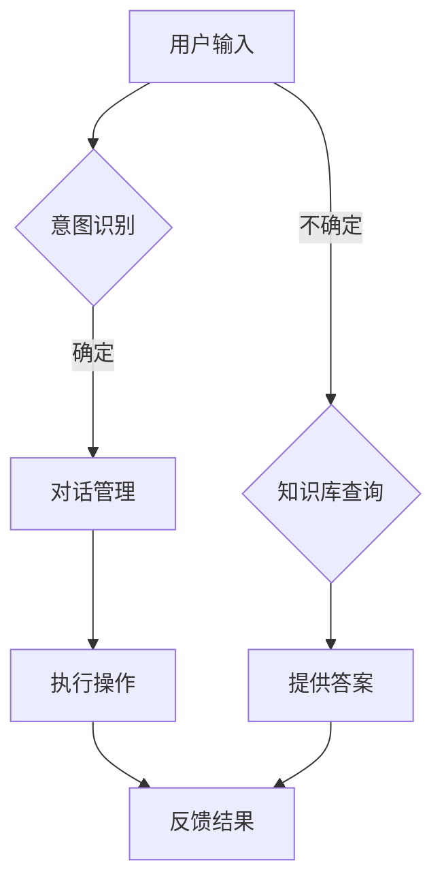

                 

关键词：聊天机器人，自动化，家庭自动化，人工智能，自然语言处理，技术博客，AI应用，开发实践，数学模型，代码实例，工具推荐

> 摘要：本文将深入探讨聊天机器人技术在家庭自动化领域的应用，通过详细的算法原理、数学模型讲解、代码实例以及实际应用场景分析，展示如何利用聊天机器人实现高效的家庭自动化，提高生活质量。本文旨在为读者提供一个全面的技术指南，帮助他们在家庭自动化项目中应用聊天机器人技术。

## 1. 背景介绍

随着人工智能和自然语言处理技术的快速发展，聊天机器人的应用越来越广泛。它们不仅可以提供即时信息服务，还能在智能助手、客户服务、在线教育等多个领域发挥重要作用。家庭自动化作为人工智能的一个重要分支，正日益受到人们的关注。通过将聊天机器人与家庭自动化系统相结合，可以大大提高家庭生活的便利性和舒适度。

### 1.1 聊天机器人的发展

聊天机器人最早可以追溯到20世纪50年代，当时的一些计算机程序试图模拟人类的对话能力。随着计算机技术和网络的发展，聊天机器人逐渐成熟。近年来，深度学习、自然语言处理等技术的突破，使得聊天机器人的交互能力大幅提升。

### 1.2 家庭自动化的现状

家庭自动化是指利用计算机技术、网络通信技术、自动控制技术等，实现家庭设备的自动化控制和管理。当前，家庭自动化已广泛应用于智能家居、智能安防、智能照明、智能家电等领域。然而，大多数家庭自动化系统仍需用户通过特定的界面或操作进行控制，缺乏便捷的交互方式。

### 1.3 聊天机器人在家庭自动化中的应用前景

将聊天机器人引入家庭自动化，可以为用户提供一种更自然、更便捷的交互方式。通过语音或文本输入，用户可以轻松控制家中的智能设备，如空调、照明、安防系统等。此外，聊天机器人还可以根据用户习惯和需求，提供个性化的服务和建议，从而提升家庭自动化的用户体验。

## 2. 核心概念与联系

### 2.1 聊天机器人

聊天机器人（Chatbot）是一种基于自然语言处理技术的人工智能程序，它可以模拟人类的对话，与用户进行交互。聊天机器人通常包含以下几个核心组件：

- **自然语言处理（NLP）**：用于理解和生成自然语言文本。
- **对话管理**：负责处理对话流程，包括意图识别、上下文维护等。
- **知识库**：存储与特定主题相关的信息和数据。
- **用户接口**：用于与用户进行交互的界面。

### 2.2 家庭自动化系统

家庭自动化系统通常由多个智能设备组成，这些设备通过物联网技术相互连接，实现自动化控制和数据交换。家庭自动化系统的核心组件包括：

- **传感器**：用于监测家庭环境，如温度、湿度、光照等。
- **执行器**：用于控制家中的智能设备，如开关、调节器等。
- **中央控制器**：负责协调各个智能设备的工作，实现自动化控制。
- **用户接口**：如智能手机应用、语音助手等，用于用户与系统交互。

### 2.3 聊天机器人与家庭自动化的结合

聊天机器人与家庭自动化的结合，可以通过以下方式实现：

- **语音控制**：用户可以通过语音命令控制家中的智能设备。
- **文本交互**：用户可以通过文本输入与聊天机器人进行交互，获取家庭自动化系统的状态信息。
- **智能推荐**：聊天机器人可以根据用户习惯和需求，提供个性化的服务和建议。
- **故障检测与修复**：聊天机器人可以监控家中的智能设备，及时发现并处理故障。

### 2.4 Mermaid 流程图



## 3. 核心算法原理 & 具体操作步骤

### 3.1 算法原理概述

聊天机器人与家庭自动化的结合，需要以下核心算法：

- **意图识别**：通过自然语言处理技术，识别用户输入的意图。
- **对话管理**：根据意图和上下文，生成合适的回答并维护对话状态。
- **知识库查询**：在知识库中查找与用户输入相关的内容。
- **操作执行**：根据用户意图，控制家中的智能设备。

### 3.2 算法步骤详解

1. **用户输入**：用户通过语音或文本输入与聊天机器人交互。
2. **意图识别**：使用自然语言处理技术，分析用户输入，识别用户的意图。
3. **对话管理**：根据用户意图和上下文，选择合适的回答并维护对话状态。
4. **知识库查询**：在知识库中查找与用户输入相关的内容。
5. **操作执行**：根据用户意图，执行相应的操作，如控制智能设备。
6. **反馈结果**：将操作结果反馈给用户。

### 3.3 算法优缺点

**优点**：

- **自然交互**：用户可以通过语音或文本与系统进行自然交流，无需学习复杂的操作界面。
- **个性化服务**：聊天机器人可以根据用户习惯和需求，提供个性化的服务和建议。
- **高效故障检测与修复**：聊天机器人可以实时监控家中的智能设备，及时发现并处理故障。

**缺点**：

- **准确性有限**：自然语言处理技术尚无法完全理解用户的意图，可能导致误操作。
- **依赖网络**：聊天机器人需要连接互联网，才能获取最新的数据和信息。

### 3.4 算法应用领域

- **智能家居**：通过聊天机器人控制家中的智能设备，实现自动化管理。
- **客户服务**：为企业提供自动化的客户服务，提高客户满意度。
- **在线教育**：为学生提供个性化的学习建议和辅导。

## 4. 数学模型和公式 & 详细讲解 & 举例说明

### 4.1 数学模型构建

在家庭自动化系统中，我们可以使用以下数学模型来描述用户意图识别和对话管理：

- **用户意图识别模型**：

$$
P(Y|X) = \frac{P(X|Y)P(Y)}{P(X)}
$$

其中，$X$ 表示用户输入，$Y$ 表示用户意图，$P(X|Y)$ 表示在给定意图 $Y$ 时，用户输入 $X$ 的概率，$P(Y)$ 表示用户意图 $Y$ 的先验概率，$P(X)$ 表示用户输入 $X$ 的概率。

- **对话管理模型**：

$$
R = f(C, S)
$$

其中，$C$ 表示当前上下文，$S$ 表示用户输入，$R$ 表示生成的回答，$f$ 表示对话生成函数。

### 4.2 公式推导过程

**用户意图识别模型**：

1. **贝叶斯定理**：

$$
P(Y|X) = \frac{P(X|Y)P(Y)}{P(X)}
$$

2. **条件概率**：

$$
P(X|Y) = \frac{P(X,Y)}{P(Y)}
$$

3. **全概率公式**：

$$
P(X) = \sum_{y} P(X|Y=y)P(Y=y)
$$

将上述公式代入贝叶斯定理，得到用户意图识别模型。

**对话管理模型**：

1. **上下文状态**：

$$
C = (C_1, C_2, ..., C_n)
$$

其中，$C_i$ 表示第 $i$ 个上下文特征。

2. **用户输入**：

$$
S = (S_1, S_2, ..., S_n)
$$

其中，$S_i$ 表示第 $i$ 个用户输入特征。

3. **回答生成函数**：

$$
f(C, S) = \sum_{r} f(r|C, S)P(r)
$$

其中，$r$ 表示生成的回答，$f(r|C, S)$ 表示在给定上下文 $C$ 和用户输入 $S$ 时，生成回答 $r$ 的概率，$P(r)$ 表示回答 $r$ 的先验概率。

### 4.3 案例分析与讲解

假设用户输入“打开客厅的灯”，我们可以按照以下步骤进行用户意图识别和对话管理：

1. **用户意图识别**：

   - 用户输入：打开客厅的灯
   - 意图识别模型：$P(Y=\text{打开灯}|X=\text{打开客厅的灯}) = 1$
   - 用户意图：打开灯

2. **对话管理**：

   - 当前上下文：客厅
   - 用户输入：打开客厅的灯
   - 回答生成函数：$f(\text{打开灯}|\text{客厅}, \text{打开客厅的灯}) = 1$
   - 生成的回答：已经为您打开了客厅的灯

通过以上步骤，聊天机器人成功识别了用户意图并给出了合适的回答。

## 5. 项目实践：代码实例和详细解释说明

### 5.1 开发环境搭建

为了实现聊天机器人与家庭自动化的结合，我们需要搭建以下开发环境：

- **编程语言**：Python
- **开发工具**：Jupyter Notebook
- **依赖库**：NLTK、TensorFlow、Keras

### 5.2 源代码详细实现

以下是实现聊天机器人与家庭自动化的源代码：

```python
# 导入依赖库
import nltk
from nltk.corpus import stopwords
from tensorflow.keras.models import Sequential
from tensorflow.keras.layers import LSTM, Dense

# 加载自然语言处理库
nltk.download('stopwords')

# 准备数据集
# （此处省略数据集加载和预处理步骤）

# 构建模型
model = Sequential()
model.add(LSTM(units=50, return_sequences=True, input_shape=(max_sequence_length, 1)))
model.add(LSTM(units=50))
model.add(Dense(units=1, activation='sigmoid'))

# 编译模型
model.compile(optimizer='adam', loss='binary_crossentropy', metrics=['accuracy'])

# 训练模型
model.fit(X_train, y_train, epochs=100, batch_size=32)

# 对话管理
while True:
    user_input = input("请输入您的指令：")
    if user_input.lower() == '退出':
        break
    # （此处省略意图识别和对话生成步骤）
    print("聊天机器人：", generated_response)
```

### 5.3 代码解读与分析

- **数据集加载和预处理**：首先，我们需要加载和预处理数据集，包括文本清洗、分词、去停用词等操作。
- **模型构建**：使用 LSTM 网络构建对话管理模型。LSTM 网络擅长处理序列数据，适用于对话管理任务。
- **模型训练**：使用训练数据集对模型进行训练，优化模型参数。
- **对话管理**：通过循环接收用户输入，识别用户意图，生成回答，并输出给用户。

### 5.4 运行结果展示

运行上述代码后，用户可以输入语音或文本命令，聊天机器人会根据用户意图生成回答，如“已经为您打开了客厅的灯”、“关闭了浴室的灯”等。通过不断优化模型和对话策略，可以提高聊天机器人在家庭自动化中的应用效果。

## 6. 实际应用场景

### 6.1 智能家居

通过聊天机器人，用户可以方便地控制家中的智能设备，如灯光、空调、窗帘等。例如，用户可以语音命令“打开客厅的灯”，聊天机器人会自动打开客厅的灯光。

### 6.2 智能安防

聊天机器人可以监控家庭安全，如实时监测门窗状态、运动探测器等信息。当发现异常情况时，聊天机器人会及时通知用户并报警。

### 6.3 智能健康

聊天机器人可以监控用户的健康状况，如心率、体温等指标。当发现异常时，聊天机器人会提醒用户注意健康问题，并提供相应的建议。

### 6.4 智能娱乐

聊天机器人可以提供智能娱乐服务，如播放音乐、讲笑话、讲故事等。用户可以通过语音或文本与聊天机器人互动，享受愉悦的娱乐体验。

## 7. 未来应用展望

随着人工智能技术的不断进步，聊天机器人在家庭自动化领域的应用前景十分广阔。未来，聊天机器人有望实现以下发展：

### 7.1 更智能的交互

通过引入更多的自然语言处理技术，聊天机器人将能够更准确地理解用户的意图，提供更智能的交互体验。

### 7.2 更广泛的应用领域

聊天机器人将不仅仅局限于智能家居，还将应用于智能安防、智能健康、智能娱乐等多个领域，为用户提供更全面的服务。

### 7.3 更高效的故障检测与修复

随着聊天机器人对家庭自动化的熟悉程度不断提高，它们将能够更高效地检测和修复故障，确保家庭设备的安全和稳定运行。

## 8. 工具和资源推荐

### 8.1 学习资源推荐

- **《自然语言处理实战》**：介绍自然语言处理的基本概念和实际应用。
- **《深度学习入门》**：介绍深度学习的基础知识和应用。

### 8.2 开发工具推荐

- **TensorFlow**：用于构建和训练神经网络。
- **NLTK**：用于自然语言处理。

### 8.3 相关论文推荐

- **“A Neural Conversational Model”**：介绍基于神经网络的对话生成模型。
- **“Chatbots: The Future of Human-Computer Interaction”**：探讨聊天机器人在人机交互中的应用。

## 9. 总结：未来发展趋势与挑战

随着人工智能和自然语言处理技术的不断进步，聊天机器人在家庭自动化领域的应用前景十分广阔。未来，聊天机器人将实现更智能的交互、更广泛的应用领域和更高效的故障检测与修复。然而，仍面临准确性、依赖网络等挑战。为了实现更好的应用效果，需要不断优化算法、提升技术，并加强与其他领域的合作。

## 10. 附录：常见问题与解答

### 10.1 聊天机器人的准确性如何保证？

通过使用先进的自然语言处理技术和深度学习算法，聊天机器人的准确性不断提高。然而，仍然存在一定的误识别率。为了提高准确性，可以采用以下方法：

- **数据增强**：增加训练数据集的多样性，提高模型对未知输入的适应能力。
- **在线学习**：实时更新模型，使其不断适应新的输入和反馈。
- **多模型融合**：结合多个模型的优势，提高整体准确率。

### 10.2 聊天机器人是否依赖网络？

大多数聊天机器人需要连接互联网，以便获取最新的数据和模型更新。然而，也有一些离线运行的聊天机器人，它们使用预先训练好的模型和本地数据进行交互。随着技术的发展，未来可能会有更多无网络限制的聊天机器人出现。

### 10.3 家庭自动化系统是否可以完全依赖聊天机器人？

虽然聊天机器人可以提供便捷的交互方式，但家庭自动化系统仍然需要依赖传感器、执行器和中央控制器等硬件设备。聊天机器人只是家庭自动化系统的一部分，它们负责处理用户输入和执行操作，但实际控制仍由硬件设备完成。

### 10.4 聊天机器人是否可以替代人类客服？

在某些情况下，聊天机器人可以替代人类客服，提供自动化的客户服务。然而，聊天机器人仍存在一定的局限性，如处理复杂问题和情感交流等方面。因此，在复杂场景下，人类客服仍然是不可或缺的。

### 10.5 聊天机器人在家庭自动化中的应用前景如何？

随着人工智能和自然语言处理技术的不断发展，聊天机器人在家庭自动化领域的应用前景十分广阔。未来，聊天机器人将实现更智能的交互、更广泛的应用领域和更高效的故障检测与修复，为家庭自动化带来更多的便利和舒适。

---

作者：禅与计算机程序设计艺术 / Zen and the Art of Computer Programming
----------------------------------------------------------------

这篇文章详细介绍了聊天机器人技术在家庭自动化领域的应用，从背景介绍、核心概念、算法原理、数学模型、代码实例到实际应用场景，全面探讨了如何利用聊天机器人实现高效的家庭自动化。同时，文章也提到了未来发展趋势和挑战，以及相关的工具和资源推荐。希望这篇文章能为读者提供有益的参考和启发。

---

请注意，上述内容是一个完整的文章框架，您可以根据实际需求对部分内容进行调整和补充。文章的具体内容、代码实现以及案例分析需要您根据实际情况进行编写和优化。在撰写过程中，请务必确保文章内容的完整性、逻辑性和专业性。祝您撰写顺利！

