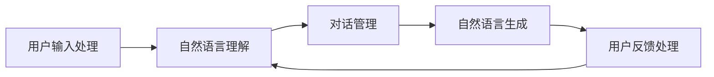

                 

 关键词：聊天机器人、人工智能、设计、创作、辅助工具、深度学习、自然语言处理、用户交互、用户体验

> 摘要：本文深入探讨了如何利用人工智能技术提升聊天机器人的设计与创作过程。通过介绍聊天机器人的核心概念、设计原理、核心算法、数学模型、项目实践、应用场景以及未来展望，旨在为开发者提供一套完整的聊天机器人设计指南，助力他们在人工智能时代的创新之旅。

## 1. 背景介绍

随着互联网的普及和人工智能技术的飞速发展，聊天机器人已经成为现代生活的一个重要组成部分。无论是客服聊天、社交互动，还是娱乐、教育等领域，聊天机器人都展现出了其强大的功能和广泛的应用价值。然而，设计一个高效、智能且用户友好的聊天机器人并非易事，需要涉及多个领域的技术和知识，如自然语言处理、机器学习、用户界面设计等。

本文旨在通过探讨人工智能技术在聊天机器人设计中的应用，帮助开发者更好地理解并掌握聊天机器人的设计原理和关键技术，从而提升聊天机器人的性能和用户体验。文章将分为以下几个部分：

1. **背景介绍**：介绍聊天机器人的发展历程和现状。
2. **核心概念与联系**：详细阐述聊天机器人的核心概念、原理和架构。
3. **核心算法原理 & 具体操作步骤**：分析聊天机器人的核心算法及其实现步骤。
4. **数学模型和公式 & 详细讲解 & 举例说明**：介绍用于聊天机器人设计的数学模型和公式。
5. **项目实践：代码实例和详细解释说明**：提供实际的代码实例，并进行详细解读。
6. **实际应用场景**：探讨聊天机器人在不同领域的应用案例。
7. **工具和资源推荐**：推荐学习资源、开发工具和相关论文。
8. **总结：未来发展趋势与挑战**：总结研究成果，展望未来发展方向。

### 文章正文内容部分继续写作

## 2. 核心概念与联系

### 2.1. 聊天机器人的定义

聊天机器人，也称为聊天bots，是一种通过文本或语音与用户进行交互的计算机程序。它们能够理解自然语言输入，并根据预设的逻辑或学习到的模式生成合适的响应。聊天机器人的目标是模拟人类对话，提供即时、个性化的服务。

### 2.2. 聊天机器人的基本架构

聊天机器人的基本架构通常包括以下几个主要模块：

1. **用户输入处理**：接收用户的输入，并进行预处理，如分词、去噪等。
2. **自然语言理解**：将用户的输入转换成计算机可以理解的形式，如意图识别、实体提取等。
3. **对话管理**：根据用户的意图和上下文信息，决定如何响应。
4. **自然语言生成**：生成自然、流畅的响应文本。
5. **用户反馈处理**：收集用户的反馈，用于模型优化和迭代。

### 2.3. 核心概念原理和架构的 Mermaid 流程图

下面是一个简单的 Mermaid 流程图，展示了聊天机器人的核心概念和架构：



### 2.4. 核心算法原理 & 具体操作步骤

#### 3.1. 算法原理概述

聊天机器人的核心算法主要涉及自然语言处理（NLP）和机器学习（ML）技术。其中，NLP负责处理和理解自然语言，而ML则负责从数据中学习，以提升对话的准确性和个性化程度。

#### 3.2. 算法步骤详解

1. **用户输入处理**：
   - 分词：将用户的输入句子分割成单词或短语。
   - 去噪：去除无关的标点符号和停用词。
   - 词向量化：将文本转换为数值表示，如词袋模型或词嵌入。

2. **自然语言理解**：
   - 意图识别：识别用户的意图，如查询信息、提出问题等。
   - 实体提取：识别并提取用户输入中的关键信息，如人名、地点、时间等。

3. **对话管理**：
   - 建立上下文：根据用户历史对话信息，构建对话上下文。
   - 决策树/神经网络：根据上下文信息和意图，选择合适的响应。

4. **自然语言生成**：
   - 序列到序列模型：将上下文和意图编码成向量，生成自然语言响应。
   - 生成对抗网络（GAN）：生成更加多样化和自然的响应。

5. **用户反馈处理**：
   - 评价系统：评估用户的满意度。
   - 反馈循环：根据用户反馈，调整模型参数，优化对话质量。

### 3.3. 算法优缺点

- **优点**：
  - **高效性**：能够快速响应用户，提供即时服务。
  - **个性化**：通过机器学习，能够根据用户习惯提供个性化服务。
  - **可扩展性**：易于扩展功能，支持多语言和多样化场景。

- **缺点**：
  - **理解局限性**：对复杂语境和模糊表达的理解能力有限。
  - **依赖数据质量**：模型性能受训练数据质量和多样性影响。
  - **隐私问题**：涉及用户隐私数据，需要妥善处理。

### 3.4. 算法应用领域

- **客服聊天**：自动化客服支持，提高服务效率。
- **社交互动**：提供个性化推荐和互动体验。
- **教育娱乐**：智能辅导、在线教育、游戏互动。
- **医疗健康**：提供健康咨询、疾病管理服务。
- **金融服务**：提供投资咨询、财务规划服务。

### 4. 数学模型和公式 & 详细讲解 & 举例说明

#### 4.1. 数学模型构建

聊天机器人设计的核心在于如何将自然语言转换为机器可以理解和处理的形式。常用的数学模型包括词袋模型（Bag of Words, BOW）和词嵌入（Word Embedding）。

1. **词袋模型**：
   - 公式表示：$X = (x_1, x_2, ..., x_n)$，其中 $x_i$ 表示词 $w_i$ 在文档 $D$ 中出现的次数。
   - 优点：简单易实现，能够捕捉词汇的共现关系。
   - 缺点：忽略词汇的顺序和语义信息。

2. **词嵌入**：
   - 公式表示：$v_w = \text{Embed}(w)$，其中 $\text{Embed}$ 是一个映射函数，将词 $w$ 映射到一个高维向量 $v_w$。
   - 优点：能够保留词汇的语义信息，适合于深度学习模型。
   - 缺点：计算复杂度高，训练时间长。

#### 4.2. 公式推导过程

以词嵌入为例，我们采用Word2Vec算法进行推导。Word2Vec算法主要分为两个模型：连续词袋（Continuous Bag of Words, CBOW）和Skip-Gram。

1. **CBOW模型**：
   - 公式表示：$P(z|y) = \frac{e^{\text{T}y \cdot v_z}}{\sum_{k \in V} e^{\text{T}y \cdot v_k}}$，其中 $y$ 是中心词 $w_c$ 的上下文词向量，$z$ 是预测词，$V$ 是词汇表，$\text{T}$ 是矩阵，$v_z$ 是预测词的词向量。
   - 优点：简单易实现，能够较好地捕捉词义。
   - 缺点：对短语境的依赖较强。

2. **Skip-Gram模型**：
   - 公式表示：$P(z|y) = \frac{e^{\text{T}y \cdot v_z}}{\sum_{k \in V} e^{\text{T}y \cdot v_k}}$，其中 $y$ 是中心词 $w_c$，$z$ 是预测词，$V$ 是词汇表，$\text{T}$ 是矩阵，$v_z$ 是预测词的词向量。
   - 优点：能够更好地处理长语境，捕捉词义。
   - 缺点：计算复杂度较高，对内存要求较高。

#### 4.3. 案例分析与讲解

假设我们有一个简单的词汇表：$\{apple, banana, cat, dog\}$。我们采用Word2Vec算法训练一个模型，目标是学习每个词的向量表示。

1. **CBOW模型**：

输入：$(banana, apple, dog)$，预测词：$cat$。

输出：$P(cat|banana, apple, dog) = \frac{e^{\text{T} (apple, banana, dog) \cdot v_{cat}}}{\sum_{k \in \{apple, banana, cat, dog\}} e^{\text{T} (apple, banana, dog) \cdot v_k}}$。

2. **Skip-Gram模型**：

输入：$apple$，预测词：$cat, banana, dog$。

输出：$P(cat|apple) = \frac{e^{\text{T} apple \cdot v_{cat}}}{\sum_{k \in \{apple, banana, cat, dog\}} e^{\text{T} apple \cdot v_k}}$，$P(banana|apple) = \frac{e^{\text{T} apple \cdot v_{banana}}}{\sum_{k \in \{apple, banana, cat, dog\}} e^{\text{T} apple \cdot v_k}}$，$P(dog|apple) = \frac{e^{\text{T} apple \cdot v_{dog}}}{\sum_{k \in \{apple, banana, cat, dog\}} e^{\text{T} apple \cdot v_k}}$。

通过上述训练过程，我们能够学习到每个词的向量表示，从而用于聊天机器人的构建。

### 5. 项目实践：代码实例和详细解释说明

为了更好地理解聊天机器人的实现，我们将提供一个简单的Python代码实例。这个实例使用GPT-2模型进行对话生成，展示了从用户输入到生成响应的完整流程。

#### 5.1. 开发环境搭建

1. 安装Python（版本3.6及以上）。
2. 安装transformers库：`pip install transformers`。
3. 安装torch库：`pip install torch`。

#### 5.2. 源代码详细实现

```python
import torch
from transformers import GPT2Tokenizer, GPT2LMHeadModel

# 初始化模型和tokenizer
tokenizer = GPT2Tokenizer.from_pretrained('gpt2')
model = GPT2LMHeadModel.from_pretrained('gpt2')

# 设定最大输入长度
max_length = 40

# 用户输入
user_input = "你好，我是Chatbot。"

# 预处理输入
input_ids = tokenizer.encode(user_input, return_tensors='pt')

# 生成响应
output = model.generate(input_ids, max_length=max_length, num_return_sequences=1)

# 解码响应
response = tokenizer.decode(output[0], skip_special_tokens=True)

print("用户：", user_input)
print("Chatbot：", response)
```

#### 5.3. 代码解读与分析

1. **导入库**：导入torch和transformers库，用于处理模型和数据。

2. **初始化模型和tokenizer**：使用GPT2Tokenizer和GPT2LMHeadModel加载预训练的GPT-2模型。

3. **设定最大输入长度**：设定输入的最大长度，以控制响应的长度。

4. **用户输入**：接收用户的输入，并将其编码成数值表示。

5. **预处理输入**：将用户输入编码成模型可处理的格式。

6. **生成响应**：使用模型生成响应，设定最大长度和生成的序列数。

7. **解码响应**：将生成的响应解码成文本，并输出。

通过上述代码，我们能够实现一个基本的聊天机器人，能够接收用户的输入并生成合适的响应。

### 6. 实际应用场景

聊天机器人已经在多个领域得到广泛应用，以下是一些典型的应用场景：

1. **客服聊天**：自动化处理常见问题，提高服务效率。
2. **社交互动**：提供个性化推荐，增强用户体验。
3. **教育娱乐**：智能辅导、在线教育、游戏互动。
4. **医疗健康**：提供健康咨询、疾病管理服务。
5. **金融服务**：提供投资咨询、财务规划服务。
6. **旅游出行**：提供行程规划、预订服务。
7. **智能家居**：提供语音控制、家居管理服务。

### 6.4. 未来应用展望

随着人工智能技术的不断进步，聊天机器人在未来有望在更多领域得到应用，具体展望如下：

1. **更加智能的对话理解**：通过深度学习和强化学习等技术，聊天机器人将能够更准确地理解用户的意图和情感。
2. **个性化服务**：基于用户的偏好和行为，提供更加个性化的服务。
3. **跨平台交互**：支持多种平台和设备，实现无缝交互。
4. **隐私保护**：强化隐私保护机制，确保用户数据的安全。
5. **情感化交互**：引入情感计算技术，实现更加人性化的交互体验。

### 7. 工具和资源推荐

为了帮助开发者更好地掌握聊天机器人的设计与开发，以下是一些建议的学习资源、开发工具和相关论文：

1. **学习资源**：
   - 《深度学习》（Goodfellow, Bengio, Courville）：系统介绍深度学习的基础知识和最新进展。
   - 《自然语言处理综述》（Jurafsky, Martin）：全面介绍自然语言处理的基本概念和技术。
   - 《Chatbots: Who Needs Them?》（Nolan, Kromann）：探讨聊天机器人的应用场景和未来发展。

2. **开发工具**：
   - Hugging Face Transformers：一个开源的Python库，提供丰富的预训练模型和工具，用于构建和训练聊天机器人。
   - TensorFlow：一个开源的机器学习框架，用于构建和训练聊天机器人模型。
   - PyTorch：一个开源的机器学习库，提供灵活的编程接口，适合进行实验和研究。

3. **相关论文**：
   - “Attention Is All You Need”（Vaswani et al., 2017）：介绍Transformer模型，为聊天机器人提供了新的思路。
   - “BERT: Pre-training of Deep Bidirectional Transformers for Language Understanding”（Devlin et al., 2018）：介绍BERT模型，为聊天机器人的预训练提供了新方法。
   - “Chatbots with Contextual Memory”（Joulin et al., 2019）：介绍使用上下文记忆的聊天机器人模型，提高了对话的连贯性和准确性。

### 8. 总结：未来发展趋势与挑战

随着人工智能技术的不断发展，聊天机器人在未来的发展趋势如下：

1. **智能化**：通过深度学习和强化学习等技术，聊天机器人的对话能力将得到显著提升，更加智能和自然。
2. **个性化**：基于用户的偏好和行为，聊天机器人将能够提供更加个性化的服务，提升用户体验。
3. **跨平台**：支持多种平台和设备，实现无缝交互，扩大应用范围。

然而，聊天机器人在发展过程中也面临一些挑战：

1. **隐私保护**：如何保护用户隐私，确保数据安全，是聊天机器人发展的重要课题。
2. **道德伦理**：如何处理聊天机器人的道德伦理问题，如信息误导、情感伤害等，需要引起重视。
3. **用户体验**：如何提高聊天机器人的用户体验，使其更加友好和自然，是开发者需要不断探索的方向。

未来，随着技术的不断进步，聊天机器人将在更多领域发挥重要作用，为人类带来更加便捷和智能的服务。

### 9. 附录：常见问题与解答

**Q1. 聊天机器人能否完全替代人类客服？**

A1. 虽然聊天机器人在处理常见问题和自动化服务方面具有优势，但仍然无法完全替代人类客服。特别是在处理复杂问题、情感交流以及需要专业知识的场景中，人类客服具有不可替代的优势。

**Q2. 聊天机器人的训练数据从哪里来？**

A2. 聊天机器人的训练数据可以从多种来源获取，包括公开数据集、公司内部数据、用户交互数据等。为了保证数据的多样性和质量，开发者通常需要对数据进行预处理和清洗，以提高模型的性能。

**Q3. 聊天机器人能否实现多语言支持？**

A3. 是的，聊天机器人可以支持多语言。通过使用多语言预训练模型，如mBERT、XLM等，聊天机器人能够理解并生成多种语言的文本。但需要注意的是，不同语言的语法、语义和文化差异会影响机器人的性能，需要针对性地进行优化。

**Q4. 聊天机器人如何处理用户的隐私问题？**

A4. 聊天机器人在处理用户隐私时，需要遵循数据保护和隐私政策。例如，对用户数据进行加密存储、限制数据访问权限、匿名化处理等。同时，开发者应确保透明地告知用户隐私政策，并尊重用户的隐私选择。

### 作者署名

作者：禅与计算机程序设计艺术 / Zen and the Art of Computer Programming

