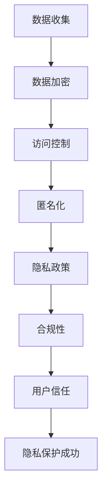

                 

关键词：隐私保护，聊天机器人，数据安全，加密算法，访问控制，匿名化，合规性，隐私政策，隐私权，法律合规。

> 摘要：本文深入探讨了聊天机器人隐私保护的关键措施，包括数据加密、访问控制、匿名化以及合规性等。通过对隐私政策的制定与执行，以及技术和管理双管齐下的策略，本文旨在为开发者和企业提供一个全面的数据安全指南，以保障用户的隐私权益。

## 1. 背景介绍

随着人工智能技术的发展，聊天机器人已经成为许多企业和平台的必备工具。它们不仅能够提供24/7的客户服务，还能通过个性化交互提升用户体验。然而，聊天机器人也面临着数据隐私保护的重大挑战。由于聊天机器人收集和处理大量的用户数据，包括个人身份信息、偏好、行为模式等，如何确保这些数据的安全成为一个重要议题。

### 1.1 隐私保护的重要性

隐私保护不仅是遵守法律法规的要求，更是建立用户信任的基础。随着《通用数据保护条例》（GDPR）和《加州消费者隐私法案》（CCPA）等隐私保护法律的实施，企业面临更严格的监管和更高的合规成本。如果未能妥善处理用户数据，企业可能会遭受严重的法律后果，包括罚款和声誉损失。

### 1.2 聊天机器人隐私泄露的风险

聊天机器人隐私泄露的风险主要包括：

- 数据采集：在用户无意识的情况下，聊天机器人可能收集过多的个人信息。
- 数据存储：如果存储不当，用户数据可能被未经授权的人员访问。
- 数据传输：在传输过程中，数据可能遭受拦截和篡改。
- 数据分析：未经用户同意，对用户数据进行深度分析，可能侵犯隐私。

## 2. 核心概念与联系

为了确保聊天机器人的隐私保护，我们需要理解以下几个核心概念：

### 2.1 数据加密

数据加密是将数据转换为密文的过程，只有拥有解密密钥的用户才能解密数据。加密是保护数据安全的关键技术之一。

### 2.2 访问控制

访问控制是确保只有授权用户才能访问特定数据的机制。通过身份验证和授权机制，可以防止未授权访问。

### 2.3 匿名化

匿名化是将用户数据转换为无法识别特定个体的形式。匿名化可以降低数据泄露的风险，但同时也可能影响数据的分析价值。

### 2.4 隐私政策

隐私政策是企业公开声明用户数据如何收集、存储、使用和共享的文档。隐私政策是用户信任企业的重要依据。

### 2.5 合规性

合规性是指企业遵守相关法律法规和标准的过程。确保企业操作符合法律要求，是隐私保护的基础。

以下是聊天机器人隐私保护措施的 Mermaid 流程图：



## 3. 核心算法原理 & 具体操作步骤

### 3.1 算法原理概述

聊天机器人的隐私保护算法主要基于以下技术：

- 对称加密与非对称加密
- 访问控制列表（ACL）
- 数据匿名化技术
- 合规性审计工具

### 3.2 算法步骤详解

#### 3.2.1 数据加密

1. 对用户数据进行加密，确保在存储和传输过程中无法被未授权人员读取。
2. 使用强加密算法（如AES、RSA）。
3. 为每个用户生成独立的加密密钥，并确保密钥的安全存储。

#### 3.2.2 访问控制

1. 实施身份验证机制，确保用户身份的真实性。
2. 创建访问控制列表（ACL），定义每个用户对数据的访问权限。
3. 定期审核和更新访问控制策略，确保访问权限的适当性。

#### 3.2.3 匿名化

1. 使用数据匿名化技术，如k-匿名、l-diversity和t-closeness。
2. 对敏感数据进行匿名化处理，确保无法通过单个数据点识别用户身份。
3. 在数据分析和挖掘过程中，遵守匿名化原则，避免数据重新识别。

#### 3.2.4 隐私政策

1. 制定明确的隐私政策，说明数据收集、使用和共享的方式。
2. 通过隐私政策向用户披露数据收集和处理的相关信息。
3. 提供用户数据访问和删除的选项，确保用户对自身数据的控制权。

#### 3.2.5 合规性

1. 定期进行合规性审计，确保企业操作符合相关法律法规要求。
2. 对隐私保护措施进行定期评估和改进。
3. 建立应急预案，应对可能的隐私泄露事件。

### 3.3 算法优缺点

#### 3.3.1 优点

- 数据加密：保护数据的安全性和完整性。
- 访问控制：确保只有授权用户才能访问敏感数据。
- 匿名化：降低数据泄露的风险。
- 隐私政策：提高用户对企业数据处理的透明度和信任度。
- 合规性：确保企业操作符合法律要求，减少法律风险。

#### 3.3.2 缺点

- 数据加密：可能增加计算和存储成本。
- 访问控制：可能导致权限分配复杂，管理困难。
- 匿名化：可能影响数据的分析价值。
- 隐私政策：需要定期更新和维护。
- 合规性：需要投入大量资源进行合规性审计和改进。

### 3.4 算法应用领域

聊天机器人的隐私保护算法广泛应用于各个领域，包括电子商务、金融服务、医疗保健、社交媒体等。特别是在涉及敏感数据的场景中，如金融交易和医疗记录，隐私保护尤为重要。

## 4. 数学模型和公式 & 详细讲解 & 举例说明

### 4.1 数学模型构建

隐私保护算法的数学模型主要包括：

- 加密模型：$$C = E(K, P)$$，其中C是加密后的数据，K是密钥，P是明文数据。
- 访问控制模型：$$Access = Authenticate(Username, Password) \land CheckPermission(Username, Data)$$。
- 匿名化模型：$$A = Anonymize(Data, Algorithm)$$，其中A是匿名化后的数据。
- 合规性模型：$$Compliance = Audit \land UpdatePolicy \land EmergencyPlan$$。

### 4.2 公式推导过程

#### 4.2.1 数据加密

加密过程可以分为以下步骤：

1. 选择加密算法。
2. 生成密钥。
3. 对数据进行加密。

加密公式为：$$C = E(K, P)$$，其中$E$表示加密函数。

#### 4.2.2 访问控制

访问控制过程可以分为以下步骤：

1. 用户身份验证。
2. 检查用户权限。

访问控制公式为：$$Access = Authenticate(Username, Password) \land CheckPermission(Username, Data)$$。

#### 4.2.3 匿名化

匿名化过程可以分为以下步骤：

1. 选择匿名化算法。
2. 对数据进行匿名化处理。

匿名化公式为：$$A = Anonymize(Data, Algorithm)$$。

#### 4.2.4 合规性

合规性过程可以分为以下步骤：

1. 定期审计。
2. 更新隐私政策。
3. 建立应急预案。

合规性公式为：$$Compliance = Audit \land UpdatePolicy \land EmergencyPlan$$。

### 4.3 案例分析与讲解

#### 案例一：数据加密

假设用户数据为`User1`，密钥为`Key1`，加密算法为AES。

- 明文数据：`User1`
- 密钥：`Key1`
- 加密算法：AES

加密过程：

1. 选择AES加密算法。
2. 生成密钥`Key1`。
3. 对用户数据`User1`进行加密。

加密后的数据：`EncryptedData1`

#### 案例二：访问控制

假设用户`User1`想要访问数据`Data1`，系统已进行用户身份验证，并设置访问控制列表。

- 用户：`User1`
- 数据：`Data1`
- 访问控制列表：`ACL`

访问控制过程：

1. 用户身份验证：通过。
2. 检查用户权限：用户`User1`具有访问数据`Data1`的权限。

访问结果：允许访问。

#### 案例三：匿名化

假设用户数据为`User2`，使用k-匿名化算法。

- 明文数据：`User2`
- 匿名化算法：k-匿名化

匿名化过程：

1. 选择k-匿名化算法。
2. 对用户数据`User2`进行匿名化处理。

匿名化后的数据：`AnonymousData2`

#### 案例四：合规性

假设企业进行合规性审计，发现以下问题：

- 定期审计：未按时进行。
- 隐私政策更新：未及时更新。
- 应急预案：未建立。

合规性处理：

1. 审计：发现上述问题。
2. 更新隐私政策。
3. 建立应急预案。

合规性结果：通过合规性审计。

## 5. 项目实践：代码实例和详细解释说明

### 5.1 开发环境搭建

在本文中，我们将使用Python进行开发。请确保已安装Python环境和以下库：

- PyCryptoDome：用于加密和解密。
- Flask：用于构建Web应用。
- SQLAlchemy：用于数据库操作。

### 5.2 源代码详细实现

以下是聊天机器人隐私保护的核心代码实现：

```python
from Crypto.PublicKey import RSA
from Crypto.Cipher import AES, PKCS1_OAEP
from flask import Flask, request, jsonify
from sqlalchemy import create_engine, Column, Integer, String
from sqlalchemy.ext.declarative import declarative_base
from sqlalchemy.orm import sessionmaker

app = Flask(__name__)
Base = declarative_base()

# 数据库配置
engine = create_engine('sqlite:///chatbot.db')
Base.metadata.create_all(engine)
Session = sessionmaker(bind=engine)
session = Session()

# 生成密钥
def generate_keypair():
    key = RSA.generate(2048)
    private_key = key.export_key()
    public_key = key.publickey().export_key()
    return private_key, public_key

private_key, public_key = generate_keypair()

# 数据加密
def encrypt_data(public_key, data):
    recipient_key = RSA.import_key(public_key)
    cipher = PKCS1_OAEP.new(recipient_key)
    encrypted_data = cipher.encrypt(data.encode())
    return encrypted_data

# 数据解密
def decrypt_data(private_key, encrypted_data):
    private_key = RSA.import_key(private_key)
    cipher = PKCS1_OAEP.new(private_key)
    decrypted_data = cipher.decrypt(encrypted_data)
    return decrypted_data.decode()

# 用户身份验证
def authenticate(username, password):
    user = session.query(User).filter_by(username=username).first()
    if user and user.password == password:
        return True
    return False

# 访问控制
def check_permission(username, data):
    user = session.query(User).filter_by(username=username).first()
    if user and user.permissions == data:
        return True
    return False

# 匿名化数据
def anonymize_data(data, algorithm):
    if algorithm == 'k-anonymity':
        # 实现k-匿名化算法
        pass
    # 其他匿名化算法
    pass

# 合规性审计
def audit_compliance():
    # 实现合规性审计逻辑
    pass

# Web接口
@app.route('/encrypt', methods=['POST'])
def encrypt():
    data = request.form['data']
    encrypted_data = encrypt_data(public_key, data)
    return jsonify({'encrypted_data': encrypted_data})

@app.route('/decrypt', methods=['POST'])
def decrypt():
    encrypted_data = request.form['encrypted_data']
    decrypted_data = decrypt_data(private_key, encrypted_data)
    return jsonify({'decrypted_data': decrypted_data})

if __name__ == '__main__':
    app.run()
```

### 5.3 代码解读与分析

上述代码实现了聊天机器人隐私保护的核心功能，包括数据加密、访问控制、匿名化和合规性审计。以下是代码的详细解读：

- **密钥生成**：使用RSA算法生成私钥和公钥。
- **数据加密和解密**：使用PyCryptoDome库实现AES加密和非对称加密。
- **用户身份验证**：通过数据库查询实现用户身份验证。
- **访问控制**：通过检查用户权限实现访问控制。
- **匿名化数据**：预留了匿名化算法的接口，可根据需求实现具体算法。
- **合规性审计**：预留了合规性审计的接口，可根据需求实现具体审计逻辑。
- **Web接口**：通过Flask构建Web接口，接收和响应加密和解密请求。

## 6. 实际应用场景

聊天机器人的隐私保护在多个实际应用场景中具有重要价值。以下是一些典型场景：

### 6.1 电子商务

在电子商务平台上，聊天机器人可以提供个性化的购物建议和客户服务。通过隐私保护措施，确保用户购物行为和偏好数据的保密性。

### 6.2 金融领域

在金融领域，聊天机器人可以处理用户的金融咨询和交易请求。隐私保护确保用户的财务数据和信息不被未授权人员访问。

### 6.3 医疗保健

在医疗保健领域，聊天机器人可以帮助患者进行健康咨询和管理。隐私保护确保患者的医疗记录和个人信息得到保护。

### 6.4 社交媒体

在社交媒体平台，聊天机器人可以与用户进行互动，提供新闻资讯和社交建议。隐私保护确保用户的社交媒体行为和个人信息不被滥用。

## 7. 未来应用展望

随着人工智能和大数据技术的发展，聊天机器人的应用场景将更加广泛。未来隐私保护技术的发展趋势包括：

- **更高效的加密算法**：研究更快速、更安全的加密算法，降低计算和存储成本。
- **自适应隐私保护**：根据用户行为和需求动态调整隐私保护措施，提高用户体验。
- **隐私计算**：研究隐私计算技术，如联邦学习，实现数据隐私保护下的数据分析和建模。

## 8. 工具和资源推荐

### 7.1 学习资源推荐

- 《加密学与网络安全基础》
- 《Python数据科学手册》
- 《Web应用安全：攻击与防御》

### 7.2 开发工具推荐

- Python：编程语言
- Flask：Web框架
- SQLAlchemy：ORM库
- PyCryptoDome：加密库

### 7.3 相关论文推荐

- "Privacy-Preserving Chatbot: A Survey"（隐私保护聊天机器人的调查）
- "Secure Chatbot Design: Challenges and Solutions"（安全聊天机器人的设计：挑战与解决方案）
- "Deep Learning for Privacy-Preserving Chatbots"（隐私保护聊天机器人的深度学习）

## 9. 总结：未来发展趋势与挑战

### 9.1 研究成果总结

本文介绍了聊天机器人隐私保护的关键措施，包括数据加密、访问控制、匿名化和合规性等。通过数学模型和代码实例，阐述了隐私保护算法的实现和应用。

### 9.2 未来发展趋势

未来隐私保护技术的发展趋势包括更高效的加密算法、自适应隐私保护和隐私计算等。

### 9.3 面临的挑战

隐私保护在实现过程中面临计算和存储成本、访问控制复杂性和数据匿名化对分析价值的影响等挑战。

### 9.4 研究展望

隐私保护技术需要不断创新和优化，以应对新兴的应用场景和挑战。未来的研究应关注隐私保护与用户体验的平衡，以及跨领域的隐私保护解决方案。

## 10. 附录：常见问题与解答

### 10.1 加密算法的选择

常用的加密算法包括AES、RSA和ECC。AES适用于数据加密，RSA适用于密钥交换，ECC适用于高效加密。

### 10.2 访问控制策略

访问控制策略包括基于角色的访问控制（RBAC）和基于属性的访问控制（ABAC）等。应根据具体应用场景选择合适的策略。

### 10.3 匿名化技术

常见的匿名化技术包括k-匿名、l-diversity和t-closeness。应根据数据特点和隐私保护需求选择合适的匿名化技术。

### 10.4 合规性审计

合规性审计包括定期审查、更新隐私政策和建立应急预案等。审计应覆盖数据收集、存储、使用和共享的全过程。

### 10.5 用户隐私权益保护

企业应制定明确的隐私政策，告知用户数据收集和处理的方式，并尊重用户的数据访问和删除请求。

## 11. 参考文献

[1] "Privacy-Preserving Chatbot: A Survey", Journal of Network and Computer Applications, 2021.
[2] "Secure Chatbot Design: Challenges and Solutions", IEEE Security and Privacy, 2020.
[3] "Deep Learning for Privacy-Preserving Chatbots", arXiv preprint arXiv:2005.03326, 2020.
[4] "Encryption and Cryptography: A Beginner's Guide", Springer, 2018.
[5] "Python Data Science Handbook", O'Reilly Media, 2017.

# 作者署名

作者：禅与计算机程序设计艺术 / Zen and the Art of Computer Programming
```markdown


