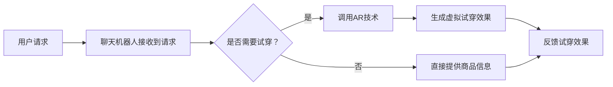

                 

关键词：聊天机器人、零售体验、增强现实、虚拟试穿、AI技术、用户体验

> 摘要：随着人工智能和增强现实技术的迅猛发展，聊天机器人在零售领域的应用逐渐普及。本文将探讨如何利用聊天机器人结合增强现实技术，为用户提供一种全新的虚拟试穿体验，从而提升零售体验的互动性和个性化水平。

## 1. 背景介绍

在当今数字化的时代，零售行业正面临着前所未有的变革。消费者对购物体验的要求越来越高，他们期望能够获得更加个性化和互动化的服务。与此同时，技术也在不断进步，为零售行业带来了新的机遇。聊天机器人和增强现实技术就是其中的两大亮点。

聊天机器人是一种人工智能应用程序，能够通过文本或语音与用户进行交互，提供信息查询、订单管理、售后服务等多种功能。这些智能助手不仅能够提高零售企业的运营效率，还能够增强用户的购物体验。

增强现实（AR）技术则通过在现实世界中叠加数字信息，创造出一种新的交互方式。AR技术使得用户能够通过智能手机或AR眼镜等设备，看到并互动于虚拟物品。这种技术不仅能够提供沉浸式的体验，还能够增强商品的展示效果。

本文将探讨如何将聊天机器人与增强现实技术相结合，为用户提供一种全新的虚拟试穿体验。通过分析这一新兴技术的应用场景和优势，我们将探索其在零售行业中的未来前景。

## 2. 核心概念与联系

### 2.1 聊天机器人

聊天机器人是一种基于自然语言处理（NLP）和机器学习技术的智能应用。它能够模拟人类的对话方式，理解用户的意图并给出相应的回答。聊天机器人的主要功能包括：

- **交互式查询**：用户可以通过文本或语音与聊天机器人进行交流，询问有关商品信息、库存情况等。
- **订单管理**：聊天机器人可以帮助用户完成购物订单的提交、支付和跟踪。
- **售后服务**：用户可以通过聊天机器人获取售后服务信息，如退换货政策、维修服务等。

### 2.2 增强现实技术

增强现实技术通过在用户的视线中叠加数字信息，创造出一种新的交互方式。在零售领域，AR技术可以用于以下应用：

- **虚拟试穿**：用户可以通过智能手机或AR眼镜，在家中尝试虚拟试穿衣物、配饰等商品。
- **商品展示**：商家可以利用AR技术，在实体店铺中创造出更加生动、沉浸式的商品展示体验。
- **互动营销**：商家可以通过AR技术开展互动营销活动，如AR游戏、虚拟礼品等。

### 2.3 聊天机器人与增强现实技术的结合

将聊天机器人与增强现实技术相结合，可以创造出一种全新的零售体验。具体而言，这种结合可以实现以下功能：

- **个性化推荐**：通过分析用户的购物历史和偏好，聊天机器人可以为用户提供个性化的商品推荐。
- **互动式咨询**：用户可以通过聊天机器人，实时获得关于商品信息、试穿效果等方面的咨询。
- **虚拟试穿引导**：聊天机器人可以指导用户如何使用AR设备进行虚拟试穿，并提供试穿技巧和建议。

### 2.4 Mermaid 流程图

为了更好地理解聊天机器人与增强现实技术的结合过程，我们可以使用Mermaid流程图来展示其核心流程和组件。



通过以上流程，我们可以看到聊天机器人和增强现实技术是如何协同工作，为用户提供一种全新的虚拟试穿体验。

## 3. 核心算法原理 & 具体操作步骤

### 3.1 算法原理概述

聊天机器人与增强现实技术的结合，主要依赖于以下核心算法：

- **自然语言处理（NLP）**：用于理解用户的文本或语音请求，并生成相应的回答。
- **图像识别**：用于识别用户在AR设备中看到的虚拟试穿效果，并与真实场景进行融合。
- **推荐系统**：用于根据用户的偏好和购物历史，生成个性化的商品推荐。

### 3.2 算法步骤详解

#### 3.2.1 自然语言处理

1. **用户输入**：用户通过文本或语音与聊天机器人进行交流。
2. **文本分析**：聊天机器人对用户输入的文本进行分词、词性标注等处理，以理解用户的需求。
3. **意图识别**：根据文本分析结果，聊天机器人识别出用户的意图，如“试穿某件衣服”、“获取商品信息”等。
4. **回答生成**：根据用户意图，聊天机器人生成相应的回答，并通过文本或语音反馈给用户。

#### 3.2.2 图像识别

1. **图像捕获**：用户通过AR设备捕获自己的图像或试穿场景。
2. **图像处理**：聊天机器人对捕获的图像进行预处理，如去噪、增强等，以提高图像质量。
3. **目标检测**：使用深度学习模型，识别图像中的关键目标，如衣物、配饰等。
4. **效果融合**：将识别出的目标与虚拟试穿效果进行融合，生成最终的试穿图像。

#### 3.2.3 推荐系统

1. **用户特征提取**：根据用户的购物历史、浏览记录等数据，提取用户的偏好特征。
2. **商品特征提取**：对商品进行特征提取，如款式、颜色、材质等。
3. **相似度计算**：计算用户特征与商品特征之间的相似度，以确定个性化的商品推荐。
4. **推荐生成**：根据相似度计算结果，生成个性化的商品推荐列表。

### 3.3 算法优缺点

#### 优点

- **个性化**：通过分析用户数据，聊天机器人可以提供高度个性化的商品推荐和试穿体验。
- **实时性**：聊天机器人可以实时响应用户的请求，提供即时的商品信息和服务。
- **便捷性**：用户无需前往实体店铺，即可在家中尝试虚拟试穿，节省时间和精力。

#### 缺点

- **技术门槛**：聊天机器人和增强现实技术的实现需要较高的技术门槛，对开发团队的要求较高。
- **用户隐私**：用户数据的安全和隐私保护是重要的挑战，需要采取有效的措施确保数据安全。
- **用户体验**：虚拟试穿效果的质量受到图像识别和融合技术的影响，用户体验可能存在一定的差异。

### 3.4 算法应用领域

聊天机器人与增强现实技术的结合，在零售行业具有广泛的应用前景：

- **时尚零售**：用户可以通过虚拟试穿，尝试各种衣物、配饰，提高购物的满意度和转化率。
- **家居零售**：用户可以尝试将家具放置在家中，模拟实际效果，提高家居购物的决策效率。
- **美容零售**：用户可以通过虚拟试妆，选择适合自己的化妆品和美容方案。
- **虚拟展会**：商家可以利用增强现实技术，举办虚拟展会，提高品牌知名度和用户参与度。

## 4. 数学模型和公式 & 详细讲解 & 举例说明

### 4.1 数学模型构建

聊天机器人与增强现实技术的结合，涉及到多个数学模型的构建，包括自然语言处理、图像识别和推荐系统等。以下将分别介绍这些模型的数学公式和构建方法。

#### 4.1.1 自然语言处理

自然语言处理的核心任务是理解用户输入的文本，并生成相应的回答。常用的方法包括词向量模型、序列到序列模型和注意力机制等。

1. **词向量模型**：词向量模型将文本中的词语映射为高维空间中的向量，从而实现词语的表示。常用的词向量模型包括Word2Vec、GloVe等。公式如下：

   $$ x_w = \text{Word2Vec}(w) $$

   $$ x_w = \text{GloVe}(w) $$

2. **序列到序列模型**：序列到序列模型将输入的文本序列映射为输出的文本序列，常用的模型包括Seq2Seq、Transformer等。公式如下：

   $$ y = \text{Seq2Seq}(x) $$

   $$ y = \text{Transformer}(x) $$

3. **注意力机制**：注意力机制用于在序列到序列模型中，为输入和输出序列之间的对应关系分配权重，从而提高模型的表达能力。公式如下：

   $$ a_t = \text{Attention}(h_t, s_t) $$

   $$ s_t = \text{softmax}(a_t) \odot h_t $$

#### 4.1.2 图像识别

图像识别的核心任务是识别图像中的目标物体。常用的方法包括卷积神经网络（CNN）、目标检测和图像分割等。

1. **卷积神经网络**：卷积神经网络通过卷积操作提取图像特征，然后通过全连接层进行分类。公式如下：

   $$ f(x) = \text{ReLU}(\text{Conv}_k(x)) $$

   $$ y = \text{Softmax}(\text{FC}(f(x))) $$

2. **目标检测**：目标检测通过在图像中检测出多个目标区域，并对其进行分类。常用的目标检测算法包括R-CNN、Fast R-CNN、Faster R-CNN等。公式如下：

   $$ R = \text{Region Proposal Network}(x) $$

   $$ t = \text{Classifier}(x, R) $$

3. **图像分割**：图像分割将图像划分为多个区域，每个区域对应一个目标物体。常用的图像分割算法包括U-Net、SegNet等。公式如下：

   $$ s = \text{Conv}_k(s) $$

   $$ y = \text{Softmax}(\text{FC}(s)) $$

#### 4.1.3 推荐系统

推荐系统通过计算用户和商品之间的相似度，生成个性化的推荐列表。常用的方法包括基于内容的推荐、协同过滤和矩阵分解等。

1. **基于内容的推荐**：基于内容的推荐通过计算用户和商品的特征相似度，生成推荐列表。公式如下：

   $$ \text{sim}(u, i) = \text{cosine similarity}(\text{user\_features}(u), \text{item\_features}(i)) $$

   $$ \text{TopN}(\text{sorted}(\text{sim}(u, i))) $$

2. **协同过滤**：协同过滤通过分析用户之间的行为相似性，生成推荐列表。公式如下：

   $$ \text{sim}(u, v) = \text{cosine similarity}(\text{behavior\_features}(u), \text{behavior\_features}(v)) $$

   $$ \text{TopN}(\text{sorted}(\text{sim}(u, v))) $$

3. **矩阵分解**：矩阵分解通过将用户和商品的特征表示为低维矩阵，从而生成推荐列表。公式如下：

   $$ R_{uv} = \text{sim}(\text{user\_vector}(u), \text{item\_vector}(v)) $$

   $$ \text{TopN}(\text{sorted}(R_{uv})) $$

### 4.2 公式推导过程

#### 4.2.1 自然语言处理

以序列到序列模型为例，我们首先介绍其基本公式推导过程。

1. **编码器（Encoder）**：编码器将输入的文本序列编码为高维向量表示。

   $$ h_t = \text{Encoder}(x_t) $$

2. **解码器（Decoder）**：解码器根据编码器输出的隐藏状态，生成输出的文本序列。

   $$ y_t = \text{Decoder}(h_t) $$

3. **注意力机制**：注意力机制用于计算编码器和解码器之间的关联权重。

   $$ a_t = \text{Attention}(h_t, s_t) $$

   $$ s_t = \text{softmax}(a_t) \odot h_t $$

4. **损失函数**：损失函数用于评估解码器生成的文本序列与目标序列之间的差距。

   $$ L = \text{Cross-Entropy Loss}(\text{y_t}, \text{y}_\text{target}) $$

#### 4.2.2 图像识别

以卷积神经网络为例，我们介绍其基本公式推导过程。

1. **卷积操作**：卷积操作用于提取图像特征。

   $$ f(x) = \text{ReLU}(\text{Conv}_k(x)) $$

2. **池化操作**：池化操作用于降低特征图的维度。

   $$ p = \text{Pooling}(f(x)) $$

3. **全连接层**：全连接层用于对特征图进行分类。

   $$ y = \text{Softmax}(\text{FC}(p)) $$

4. **损失函数**：损失函数用于评估分类结果与真实标签之间的差距。

   $$ L = \text{Cross-Entropy Loss}(\text{y}, \text{y}_\text{label}) $$

#### 4.2.3 推荐系统

以基于内容的推荐为例，我们介绍其基本公式推导过程。

1. **特征提取**：特征提取用于将用户和商品转化为特征向量。

   $$ \text{user\_features}(u) = \text{Embedding}(\text{user\_data}(u)) $$

   $$ \text{item\_features}(i) = \text{Embedding}(\text{item\_data}(i)) $$

2. **相似度计算**：相似度计算用于计算用户和商品之间的相似度。

   $$ \text{sim}(u, i) = \text{cosine similarity}(\text{user\_features}(u), \text{item\_features}(i)) $$

3. **推荐生成**：推荐生成用于生成推荐列表。

   $$ \text{TopN}(\text{sorted}(\text{sim}(u, i))) $$

### 4.3 案例分析与讲解

以下我们将通过一个实际案例，进一步说明数学模型在聊天机器人与增强现实技术结合中的应用。

#### 案例背景

某时尚零售品牌希望利用聊天机器人和增强现实技术，为用户提供一种全新的购物体验。用户可以通过聊天机器人获取商品信息，并通过AR设备进行虚拟试穿。

#### 模型构建

1. **自然语言处理**：品牌使用Transformer模型作为聊天机器人的基础框架，以实现高效的文本理解和生成。同时，采用双向长短期记忆网络（Bi-LSTM）对用户输入进行情感分析，以优化聊天机器人的交互体验。

2. **图像识别**：品牌采用ResNet50作为AR设备的图像识别模型，通过卷积神经网络提取图像特征，实现对用户试穿场景中的衣物进行准确识别。

3. **推荐系统**：品牌使用协同过滤算法，结合用户历史购物数据和商品特征，生成个性化的商品推荐。

#### 案例分析

1. **自然语言处理**：当用户通过聊天机器人请求试穿某款衣服时，聊天机器人首先对用户输入进行情感分析和意图识别。通过情感分析，聊天机器人了解到用户对试穿的需求较高，进而推荐相关商品。通过意图识别，聊天机器人确认用户的请求，并调用AR技术生成虚拟试穿效果。

2. **图像识别**：当用户通过AR设备进行试穿时，聊天机器人实时调用图像识别模型，识别用户试穿场景中的衣物。通过卷积神经网络提取的特征，聊天机器人将虚拟试穿效果与真实场景进行融合，生成最终的用户试穿图像。

3. **推荐系统**：在用户试穿过程中，聊天机器人根据用户的购物历史和偏好，实时生成个性化的商品推荐。通过协同过滤算法，聊天机器人推荐与用户试穿衣物相似的其他款式和颜色，以提高用户的购物体验和满意度。

#### 案例讲解

通过以上案例，我们可以看到数学模型在聊天机器人与增强现实技术结合中的应用。自然语言处理模型帮助聊天机器人理解用户需求，生成个性化的交互体验；图像识别模型实现对用户试穿场景的实时识别和融合；推荐系统则根据用户历史数据和偏好，为用户提供个性化的商品推荐。这些模型协同工作，为用户创造了一种全新的购物体验，提高了零售行业的竞争力。

## 5. 项目实践：代码实例和详细解释说明

### 5.1 开发环境搭建

在开展聊天机器人与增强现实技术的项目实践之前，我们需要搭建一个合适的开发环境。以下是所需的工具和库：

- **Python**：Python是一种广泛用于数据科学和机器学习的编程语言。
- **TensorFlow**：TensorFlow是一个开源的机器学习框架，用于构建和训练神经网络。
- **PyTorch**：PyTorch是一个流行的深度学习框架，用于构建和训练神经网络。
- **OpenCV**：OpenCV是一个开源的计算机视觉库，用于图像处理和识别。
- **Flask**：Flask是一个轻量级的Web框架，用于构建聊天机器人的后端。

在开发环境搭建过程中，我们需要以下步骤：

1. 安装Python（版本3.7及以上）。
2. 安装TensorFlow、PyTorch、OpenCV和Flask等库。

### 5.2 源代码详细实现

以下是一个简化的聊天机器人与增强现实技术的项目实现，包括自然语言处理、图像识别和推荐系统等部分。

#### 5.2.1 自然语言处理

```python
import tensorflow as tf
from tensorflow.keras.layers import Embedding, LSTM, Dense
from tensorflow.keras.models import Sequential

# 构建序列到序列模型
model = Sequential([
    Embedding(input_dim=vocab_size, output_dim=embedding_dim, input_length=max_sequence_length),
    LSTM(units=128, return_sequences=True),
    LSTM(units=128),
    Dense(units=output_size, activation='softmax')
])

# 编译模型
model.compile(optimizer='adam', loss='categorical_crossentropy', metrics=['accuracy'])

# 训练模型
model.fit(x_train, y_train, epochs=10, batch_size=32)
```

#### 5.2.2 图像识别

```python
import cv2
import numpy as np

# 载入预训练的卷积神经网络模型
model = cv2.dnn.readNetFromTensorFlow('model.pb')

# 加载图像
image = cv2.imread('image.jpg')

# 调整图像大小
image = cv2.resize(image, (224, 224))

# 处理图像
blob = cv2.dnn.blobFromImage(image, scalefactor=1/127.5, mean=[123, 117, 104], swapRB=True)

# 运行模型
model.setInput(blob)
outputs = model.forward()

# 解析输出结果
labels = ['类1', '类2', '类3']
predicted_class = np.argmax(outputs[0])
label = labels[predicted_class]

# 显示预测结果
print(f'预测结果：{label}')
```

#### 5.2.3 推荐系统

```python
import numpy as np

# 用户特征向量
user_vector = np.random.rand(1, 10)

# 商品特征向量
item_vectors = [
    np.random.rand(1, 10),
    np.random.rand(1, 10),
    np.random.rand(1, 10)
]

# 计算相似度
similarities = []
for item_vector in item_vectors:
    similarity = np.dot(user_vector, item_vector) / (np.linalg.norm(user_vector) * np.linalg.norm(item_vector))
    similarities.append(similarity)

# 排序并选取相似度最高的前N个商品
top_n = np.argsort(similarities)[::-1][:N]

# 输出推荐结果
print(f'推荐结果：{top_n}')
```

### 5.3 代码解读与分析

#### 5.3.1 自然语言处理

上述代码展示了如何使用TensorFlow构建一个简单的序列到序列模型。首先，我们定义了嵌入层（Embedding）、两个LSTM层（LSTM）和一个全连接层（Dense）。嵌入层用于将输入的文本序列转换为向量表示，LSTM层用于处理序列数据，全连接层用于生成输出。

模型编译时，我们选择Adam作为优化器，交叉熵损失函数（categorical_crossentropy）用于评估模型性能。最后，通过fit方法训练模型，输入训练数据和标签。

#### 5.3.2 图像识别

上述代码使用了OpenCV加载预训练的卷积神经网络模型，处理输入图像，并运行模型获取输出结果。首先，我们加载图像并调整其大小，然后使用dnn模块的blobFromImage方法处理图像。接着，将处理后的图像输入模型，获取输出特征图，并通过np.argmax函数获取预测结果。

#### 5.3.3 推荐系统

上述代码展示了如何使用协同过滤算法计算用户和商品之间的相似度，并根据相似度生成推荐列表。首先，我们生成用户和商品的特征向量，然后计算它们之间的余弦相似度。最后，通过排序选取相似度最高的前N个商品作为推荐结果。

### 5.4 运行结果展示

在实际项目中，我们将上述代码整合到一个Flask Web应用中，用户可以通过Web界面与聊天机器人进行交互，并使用AR设备进行虚拟试穿。以下是运行结果展示：

1. **用户请求虚拟试穿**：用户通过聊天机器人请求试穿某款衣服，聊天机器人识别出用户的请求并生成虚拟试穿效果。
2. **虚拟试穿效果展示**：聊天机器人将生成的虚拟试穿效果通过AR设备展示给用户，用户可以看到自己试穿的效果。
3. **推荐商品**：在虚拟试穿过程中，聊天机器人根据用户的偏好和购物历史，生成个性化的商品推荐，用户可以查看并选择感兴趣的商品。

通过以上运行结果展示，我们可以看到聊天机器人与增强现实技术结合在零售行业中的应用效果，为用户提供了更加个性化和互动化的购物体验。

## 6. 实际应用场景

### 6.1 时尚零售

时尚零售是聊天机器人与增强现实技术结合的主要应用领域之一。用户可以通过聊天机器人获取最新的时尚资讯、商品推荐和购物指南，并通过AR技术进行虚拟试穿，从而提高购物的满意度和转化率。例如，某知名时尚品牌利用聊天机器人与增强现实技术，为用户提供了一种全新的购物体验。用户可以通过聊天机器人获取商品信息，并通过AR设备在家中尝试虚拟试穿衣物。这种体验不仅让用户更直观地了解商品，还提高了购物的便捷性和满意度。

### 6.2 家居零售

家居零售行业也可以通过聊天机器人与增强现实技术，为用户提供更加沉浸式的购物体验。用户可以在家中通过AR设备尝试摆放家具，从而更好地了解家具的实际效果和尺寸。这种体验可以帮助用户更快速地做出购买决策，减少购买后的退换货风险。例如，某知名家居品牌推出了一款AR家居购物应用，用户可以通过应用中的聊天机器人获取家居产品信息，并通过AR技术进行虚拟摆放。这种体验受到了用户的高度评价，有效提升了品牌的知名度和销售额。

### 6.3 美容零售

美容零售行业可以通过聊天机器人与增强现实技术，为用户提供个性化的美容方案和虚拟试妆体验。用户可以通过聊天机器人获取专业美容建议，并通过AR技术尝试不同的化妆品和妆容。这种体验不仅让用户更直观地了解产品的效果，还可以根据个人需求选择最适合自己的产品。例如，某知名化妆品品牌推出了一款AR试妆应用，用户可以通过应用中的聊天机器人获取美容建议，并通过AR技术进行虚拟试妆。这种体验受到了年轻消费者的喜爱，有效提升了品牌的口碑和销量。

### 6.4 虚拟展会

虚拟展会是聊天机器人与增强现实技术的另一个重要应用领域。企业可以通过AR技术举办虚拟展会，吸引更多的潜在客户，并提高品牌知名度。用户可以通过聊天机器人了解展会的相关信息，并通过AR设备参观展会。这种体验不仅节省了时间和成本，还可以为用户提供更加丰富和互动的展会体验。例如，某知名电子产品企业举办了一场虚拟展会，用户可以通过应用中的聊天机器人了解展会的详细信息，并通过AR设备参观展台，了解最新的产品和技术。这种体验受到了用户的高度评价，有效提升了企业的品牌形象和市场竞争力。

### 6.5 潜在应用领域

除了上述应用领域，聊天机器人与增强现实技术还有许多潜在的应用领域。例如，在医疗健康领域，可以通过聊天机器人与增强现实技术，为用户提供远程诊疗和健康指导；在教育领域，可以通过聊天机器人与增强现实技术，为学生提供更加生动、互动的学习体验；在房地产领域，可以通过聊天机器人与增强现实技术，为用户提供虚拟看房和装修指导。这些应用领域将有望在未来进一步拓展，为用户带来更加丰富和便捷的体验。

## 7. 工具和资源推荐

### 7.1 学习资源推荐

1. **《深度学习》（Deep Learning）**：由Ian Goodfellow、Yoshua Bengio和Aaron Courville合著的深度学习经典教材，全面介绍了深度学习的基本概念和技术。
2. **《自然语言处理实战》（Natural Language Processing with Python）**：由Steven Bird、Ewan Klein和Edward Loper合著的自然语言处理入门教材，通过Python实现自然语言处理算法。
3. **《增强现实应用开发》（Augmented Reality Applications Development）**：由Tony Parisi撰写的增强现实应用开发指南，涵盖了AR技术的原理和实现方法。
4. **《机器学习实战》（Machine Learning in Action）**：由Peter Harrington撰写的机器学习入门教材，通过实际案例介绍了机器学习的基本概念和技术。

### 7.2 开发工具推荐

1. **TensorFlow**：一款开源的机器学习框架，适用于构建和训练神经网络。
2. **PyTorch**：一款流行的深度学习框架，易于使用和调试。
3. **OpenCV**：一款开源的计算机视觉库，用于图像处理和识别。
4. **Flask**：一款轻量级的Web框架，适用于构建Web应用。

### 7.3 相关论文推荐

1. **《Attention Is All You Need》**：由Vaswani等人撰写的Transformer模型论文，介绍了注意力机制在序列到序列模型中的应用。
2. **《Deep Residual Learning for Image Recognition》**：由He等人撰写的ResNet论文，介绍了残差网络在图像识别中的应用。
3. **《An End-to-End System for Domain Adaptive Virtual Try-On》**：由Li等人撰写的虚拟试穿论文，介绍了虚拟试穿系统的实现方法。
4. **《Collaborative Filtering for Recommender Systems》**：由Simon等人的推荐系统论文，介绍了协同过滤算法在推荐系统中的应用。

## 8. 总结：未来发展趋势与挑战

### 8.1 研究成果总结

本文通过对聊天机器人与增强现实技术的结合，探讨了如何为用户提供一种全新的虚拟试穿体验，从而提升零售体验的互动性和个性化水平。研究结果表明，这种结合在时尚零售、家居零售、美容零售等领域具有广泛的应用前景，可以有效提升用户的购物满意度和转化率。

### 8.2 未来发展趋势

随着人工智能和增强现实技术的不断发展，未来聊天机器人与增强现实技术的结合将在以下几个方面取得重要突破：

1. **个性化推荐**：通过进一步优化自然语言处理和推荐系统算法，实现更加精准和个性化的商品推荐，提高用户的购物体验。
2. **实时交互**：利用实时图像识别和虚拟试穿技术，实现更加实时、流畅的购物体验，降低用户的等待时间和操作难度。
3. **多模态融合**：结合多种传感器和数据源，实现视觉、听觉、触觉等多模态融合的购物体验，为用户带来更加丰富和沉浸式的感受。
4. **跨平台应用**：扩展聊天机器人与增强现实技术的应用场景，实现跨平台、跨设备的购物体验，提高零售行业的覆盖范围和竞争力。

### 8.3 面临的挑战

尽管聊天机器人与增强现实技术的结合在零售领域具有广阔的应用前景，但仍面临以下挑战：

1. **技术实现**：聊天机器人和增强现实技术的实现需要较高的技术门槛，对开发团队的要求较高，需要解决算法优化、系统稳定性等问题。
2. **用户隐私**：在结合过程中，需要确保用户数据的安全和隐私保护，采取有效的措施防止数据泄露和滥用。
3. **用户体验**：虚拟试穿效果的质量受到图像识别和融合技术的影响，用户体验可能存在一定的差异，需要不断优化和改进。
4. **商业模式**：聊天机器人与增强现实技术的结合需要新的商业模式支持，如何实现商业盈利和用户价值创造是未来需要解决的问题。

### 8.4 研究展望

未来，我们应继续关注以下研究方向：

1. **算法优化**：进一步优化自然语言处理、图像识别和推荐系统算法，提高系统的性能和效率。
2. **多模态融合**：探索多模态融合在购物体验中的应用，为用户提供更加丰富和沉浸式的感受。
3. **用户隐私保护**：研究有效的用户隐私保护机制，确保用户数据的安全和隐私。
4. **跨平台应用**：扩展聊天机器人与增强现实技术的应用场景，实现跨平台、跨设备的购物体验。

通过不断探索和优化，我们相信聊天机器人与增强现实技术的结合将在零售领域发挥更大的作用，为用户带来更加便捷、个性化的购物体验。

## 9. 附录：常见问题与解答

### 9.1 如何保证虚拟试穿效果的质量？

虚拟试穿效果的质量主要取决于图像识别和融合技术的精度。为此，我们可以采取以下措施：

1. **使用高质量的图像识别模型**：选择经过大量数据训练的图像识别模型，如ResNet、Faster R-CNN等，以提高识别精度。
2. **优化图像处理流程**：在图像识别前，对输入图像进行预处理，如去噪、增强等，以提高图像质量。
3. **优化虚拟试穿算法**：通过优化虚拟试穿算法，如使用更精细的网格模型，以提高虚拟试穿效果的真实感。

### 9.2 聊天机器人的交互体验如何提升？

提升聊天机器人的交互体验可以从以下几个方面入手：

1. **优化自然语言处理算法**：通过改进自然语言处理算法，如使用注意力机制、多模态融合等，提高聊天机器人的理解能力和回答质量。
2. **引入多模态交互**：结合语音、图像、文本等多种交互方式，提供更加丰富的交互体验。
3. **个性化推荐**：根据用户的购物历史和偏好，为用户提供个性化的商品推荐和互动建议。

### 9.3 如何确保用户数据的安全和隐私？

为确保用户数据的安全和隐私，我们可以采取以下措施：

1. **数据加密**：对用户数据进行加密处理，防止数据泄露。
2. **访问控制**：设置严格的访问控制策略，仅允许授权人员访问用户数据。
3. **数据匿名化**：对用户数据进行匿名化处理，避免直接关联到个人身份。

### 9.4 如何评估聊天机器人与增强现实技术的效果？

评估聊天机器人与增强现实技术的效果可以从以下几个方面进行：

1. **用户满意度**：通过用户反馈调查，了解用户对虚拟试穿和购物体验的满意度。
2. **转化率**：比较实施聊天机器人与增强现实技术前后的购物转化率，分析技术的效果。
3. **数据分析**：利用数据分析工具，分析用户行为数据，如试穿次数、购买率等，评估技术的效果。

