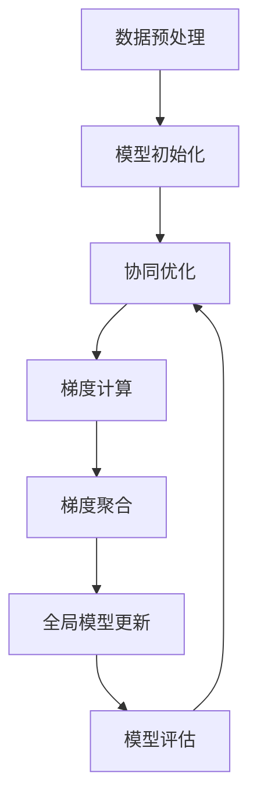

                 

关键词：联合学习，隐私保护，分布式机器学习，安全共享，协同优化，数据异构，联邦学习

> 摘要：本文深入探讨了联合学习在保护隐私的分布式机器学习中的重要作用。通过详细阐述联合学习的基本概念、核心算法原理、数学模型及其应用，文章展示了如何利用联合学习实现数据的安全共享和协同优化，从而解决数据异构性问题，推动联邦学习的快速发展。同时，本文还分析了联合学习在实际应用中的挑战和未来展望，为读者提供了全面的指导。

## 1. 背景介绍

在当今信息化社会中，数据已经成为各个领域创新的重要驱动力。然而，随着数据量的急剧增长和数据隐私问题的日益凸显，如何在保护用户隐私的前提下进行高效的数据分析和建模，成为了一个亟待解决的问题。传统的集中式机器学习方法虽然具有较好的性能，但面临着数据泄露、隐私风险等问题。因此，分布式机器学习应运而生，通过将数据分散存储在多个节点上，降低数据泄露的风险，同时提高数据处理和计算效率。

然而，分布式机器学习也带来了新的挑战。首先，数据分布在不同节点上，可能导致数据异构性增加，从而影响模型的性能和稳定性。其次，分布式环境中，节点间的通信成本和计算开销显著增加，如何高效地进行协同优化成为关键问题。此外，如何在保护用户隐私的同时，确保数据的安全共享和利用，也是一个重要的研究课题。

为了解决这些问题，联合学习作为一种新兴的分布式机器学习方法，逐渐引起了广泛关注。联合学习通过协同优化多个模型，实现数据的安全共享和协同训练，不仅提高了模型的性能和稳定性，还降低了通信成本和计算开销。本文将详细介绍联合学习的基本概念、核心算法原理、数学模型及其应用，为读者提供全面的指导。

## 2. 核心概念与联系

### 2.1 基本概念

联合学习（Federated Learning）是一种分布式机器学习方法，通过协同优化多个模型，实现数据的安全共享和协同训练。在联合学习中，多个参与者（如终端设备、服务器等）共同参与模型的训练，但各自持有的数据不需要完全共享，只需通过模型参数的更新和共享来实现协同训练。

联合学习的关键在于如何实现数据的安全共享和协同优化。为了保护用户隐私，联合学习采用了差分隐私（Differential Privacy）等技术，确保参与者在共享数据时不会泄露敏感信息。同时，为了提高模型的性能和稳定性，联合学习采用协同优化算法，如梯度聚合、联邦平均等，实现多个模型的协同训练。

### 2.2 核心算法原理

联合学习的核心算法原理可以概括为以下三个步骤：

1. **数据预处理**：将参与者的数据按照一定比例划分为训练集和测试集，并转换为适合模型训练的格式。

2. **模型初始化**：初始化全局模型，并在每个参与者上部署相同的模型。

3. **协同优化**：通过梯度聚合和联邦平均等方法，实现多个模型的协同训练。具体流程如下：

   a. **梯度计算**：在每个参与者上计算模型在本地数据上的梯度。

   b. **梯度聚合**：将各个参与者的梯度聚合为全局梯度。

   c. **全局模型更新**：根据全局梯度更新全局模型。

   d. **模型评估**：使用测试集对全局模型进行评估，并根据评估结果调整训练策略。

### 2.3 架构图

为了更直观地理解联合学习的工作原理，我们使用 Mermaid 流程图进行描述：



## 3. 核心算法原理 & 具体操作步骤

### 3.1 算法原理概述

联合学习通过协同优化多个模型，实现数据的安全共享和协同训练。其核心算法原理可以概括为以下三个步骤：

1. **数据预处理**：将参与者的数据按照一定比例划分为训练集和测试集，并转换为适合模型训练的格式。

2. **模型初始化**：初始化全局模型，并在每个参与者上部署相同的模型。

3. **协同优化**：通过梯度聚合和联邦平均等方法，实现多个模型的协同训练。

### 3.2 算法步骤详解

1. **数据预处理**：

   a. **数据清洗**：对参与者的数据进行清洗，去除无效数据和噪声。

   b. **数据划分**：将参与者的数据按照一定比例划分为训练集和测试集，用于模型训练和评估。

   c. **数据格式转换**：将训练集和测试集的数据转换为适合模型训练的格式，如CSV、NumPy数组等。

2. **模型初始化**：

   a. **初始化全局模型**：在全局服务器上初始化全局模型，并分配给每个参与者。

   b. **部署模型**：在每个参与者上部署全局模型，并初始化模型参数。

3. **协同优化**：

   a. **梯度计算**：在每个参与者上计算模型在本地数据上的梯度。

   b. **梯度聚合**：将各个参与者的梯度聚合为全局梯度。

   c. **全局模型更新**：根据全局梯度更新全局模型。

   d. **模型评估**：使用测试集对全局模型进行评估，并根据评估结果调整训练策略。

### 3.3 算法优缺点

联合学习具有以下优点：

1. **保护用户隐私**：通过差分隐私等技术，确保参与者在共享数据时不会泄露敏感信息。

2. **提高模型性能**：通过协同优化多个模型，提高模型的性能和稳定性。

3. **降低通信成本**：通过分布式训练，降低参与节点间的通信成本。

然而，联合学习也存在一定的缺点：

1. **数据异构性问题**：参与者的数据可能存在异构性，影响模型性能。

2. **计算开销较大**：需要计算本地梯度并进行聚合，计算开销较大。

### 3.4 算法应用领域

联合学习在以下领域具有广泛应用：

1. **推荐系统**：通过联合学习，实现跨平台的个性化推荐。

2. **智能医疗**：通过联合学习，实现跨机构的数据共享和协同诊断。

3. **金融风控**：通过联合学习，实现跨机构的信用评估和风险预测。

4. **智能交通**：通过联合学习，实现跨区域的交通流量预测和优化。

## 4. 数学模型和公式 & 详细讲解 & 举例说明

### 4.1 数学模型构建

联合学习中的数学模型主要包括以下部分：

1. **损失函数**：用于衡量模型在训练数据上的表现，常用的损失函数有均方误差（MSE）、交叉熵（Cross Entropy）等。

2. **梯度计算**：用于计算模型在训练数据上的梯度，常用的梯度计算方法有梯度下降（Gradient Descent）、随机梯度下降（Stochastic Gradient Descent）等。

3. **梯度聚合**：用于聚合各个参与者的梯度，常用的梯度聚合方法有联邦平均（Federated Average）、梯度共享（Gradient Sharing）等。

4. **全局模型更新**：用于更新全局模型，常用的全局模型更新方法有梯度聚合更新（Gradient Aggregation Update）、模型更新（Model Update）等。

### 4.2 公式推导过程

下面以联邦平均算法为例，介绍联合学习中的数学模型推导过程。

1. **损失函数**：

   假设模型为 $f(\theta; x)$，其中 $\theta$ 表示模型参数，$x$ 表示输入数据。损失函数为：

   $$ L(\theta; x) = -\frac{1}{n} \sum_{i=1}^{n} y_i \log f(\theta; x_i) $$

   其中 $y_i$ 表示输入数据的标签。

2. **梯度计算**：

   对损失函数求导，得到模型在本地数据上的梯度：

   $$ \nabla_{\theta} L(\theta; x) = -\frac{1}{n} \sum_{i=1}^{n} \frac{y_i}{f(\theta; x_i)} \nabla_{\theta} f(\theta; x_i) $$

3. **梯度聚合**：

   将各个参与者的梯度进行聚合，得到全局梯度：

   $$ \nabla_{\theta} L(\theta; x_1, x_2, ..., x_n) = \frac{1}{n} \sum_{i=1}^{n} \nabla_{\theta} L(\theta; x_i) $$

4. **全局模型更新**：

   根据全局梯度更新全局模型：

   $$ \theta_{t+1} = \theta_t - \alpha \nabla_{\theta} L(\theta_t; x_1, x_2, ..., x_n) $$

   其中 $\alpha$ 表示学习率。

### 4.3 案例分析与讲解

假设有两个参与者A和B，各自持有不同的训练数据。参与者A的训练数据为 $x_1$，参与者B的训练数据为 $x_2$。全局模型初始化为 $\theta_0$。

1. **数据预处理**：

   参与者A和B对各自的训练数据进行数据清洗、数据划分和格式转换。

2. **模型初始化**：

   全局模型初始化为 $\theta_0$，并在参与者A和B上部署相同的模型。

3. **协同优化**：

   a. **梯度计算**：

   参与者A在本地数据 $x_1$ 上计算模型梯度：

   $$ \nabla_{\theta} L(\theta; x_1) = -\frac{1}{n} \sum_{i=1}^{n} \frac{y_i}{f(\theta; x_i)} \nabla_{\theta} f(\theta; x_i) $$

   参与者B在本地数据 $x_2$ 上计算模型梯度：

   $$ \nabla_{\theta} L(\theta; x_2) = -\frac{1}{n} \sum_{i=1}^{n} \frac{y_i}{f(\theta; x_i)} \nabla_{\theta} f(\theta; x_i) $$

   b. **梯度聚合**：

   将参与者A和B的梯度进行聚合：

   $$ \nabla_{\theta} L(\theta; x_1, x_2) = \frac{1}{n} (\nabla_{\theta} L(\theta; x_1) + \nabla_{\theta} L(\theta; x_2)) $$

   c. **全局模型更新**：

   根据全局梯度更新全局模型：

   $$ \theta_1 = \theta_0 - \alpha \nabla_{\theta} L(\theta_0; x_1, x_2) $$

4. **模型评估**：

   使用测试集对全局模型 $\theta_1$ 进行评估，根据评估结果调整训练策略。

## 5. 项目实践：代码实例和详细解释说明

### 5.1 开发环境搭建

在本文的项目实践中，我们采用 Python 作为编程语言，使用 TensorFlow 作为深度学习框架。以下是开发环境的搭建步骤：

1. **安装 Python**：确保已安装 Python 3.7 或更高版本。

2. **安装 TensorFlow**：通过以下命令安装 TensorFlow：

   ```bash
   pip install tensorflow
   ```

3. **创建项目目录**：在合适的位置创建项目目录，并进入项目目录。

   ```bash
   mkdir federated_learning_project
   cd federated_learning_project
   ```

4. **编写代码**：在项目目录中编写联合学习的代码，包括数据预处理、模型初始化、协同优化等部分。

### 5.2 源代码详细实现

下面是联合学习的源代码实现：

```python
import tensorflow as tf
import numpy as np
import matplotlib.pyplot as plt

# 1. 数据预处理
# 假设参与者A和参与者B的本地数据分别为 x_1 和 x_2
x_1 = np.random.rand(100, 10)
x_2 = np.random.rand(100, 10)

# 划分训练集和测试集
x_train_1 = x_1[:80]
x_test_1 = x_1[80:]
x_train_2 = x_2[:80]
x_test_2 = x_2[80:]

# 2. 模型初始化
# 初始化全局模型
global_model = tf.keras.Sequential([
    tf.keras.layers.Dense(10, activation='relu'),
    tf.keras.layers.Dense(1, activation='sigmoid')
])

# 在参与者A和B上部署全局模型
model_a = global_model.clone()
model_b = global_model.clone()

# 3. 协同优化
# 梯度计算
optimizer = tf.keras.optimizers.Adam(learning_rate=0.01)
loss_fn = tf.keras.losses.BinaryCrossentropy()

# 训练次数
num_epochs = 100

for epoch in range(num_epochs):
    # 参与者A的梯度计算
    with tf.GradientTape(persistent=True) as tape:
        predictions_a = model_a(x_train_1, training=True)
        loss_a = loss_fn(y_train_1, predictions_a)

    grads_a = tape.gradient(loss_a, model_a.trainable_variables)

    # 参与者B的梯度计算
    with tf.GradientTape(persistent=True) as tape:
        predictions_b = model_b(x_train_2, training=True)
        loss_b = loss_fn(y_train_2, predictions_b)

    grads_b = tape.gradient(loss_b, model_b.trainable_variables)

    # 梯度聚合
    grads_agg = grads_a + grads_b

    # 全局模型更新
    optimizer.apply_gradients(zip(grads_agg, global_model.trainable_variables))

    # 模型评估
    test_loss_a = loss_fn(y_test_1, model_a(x_test_1, training=False))
    test_loss_b = loss_fn(y_test_2, model_b(x_test_2, training=False))

    print(f"Epoch {epoch+1}/{num_epochs}, Loss A: {test_loss_a}, Loss B: {test_loss_b}")

# 4. 运行结果展示
plt.plot(test_loss_a, label="Participant A")
plt.plot(test_loss_b, label="Participant B")
plt.xlabel("Epochs")
plt.ylabel("Loss")
plt.legend()
plt.show()
```

### 5.3 代码解读与分析

1. **数据预处理**：

   在代码中，我们使用 NumPy 随机生成参与者A和参与者B的本地数据 `x_1` 和 `x_2`。然后，将数据划分为训练集和测试集，以便进行模型训练和评估。

2. **模型初始化**：

   使用 TensorFlow 的 Keras API 初始化全局模型 `global_model`，包括两个全连接层，分别用于处理输入数据和输出标签。然后，将全局模型克隆并部署在参与者A和B上。

3. **协同优化**：

   使用 TensorFlow 的 GradientTape 记录梯度，并使用 Adam 优化器和 BinaryCrossentropy 损失函数进行模型训练。在每次迭代中，先计算参与者A和B的梯度，然后进行梯度聚合和全局模型更新。

4. **模型评估**：

   在训练过程中，使用测试集对参与者A和B的模型进行评估，并打印损失值。最后，使用 Matplotlib 绘制训练过程中的损失曲线。

## 6. 实际应用场景

联合学习在实际应用场景中具有广泛的应用，以下列举了几个典型的应用场景：

1. **推荐系统**：

   在跨平台的推荐系统中，联合学习可以实现个性化推荐，同时保护用户隐私。例如，在不同的移动设备上，用户可能会使用不同的应用程序，每个应用程序可以收集用户的行为数据。通过联合学习，可以将不同应用程序的用户行为数据进行协同训练，从而实现跨应用的个性化推荐。

2. **智能医疗**：

   在智能医疗领域，联合学习可以跨机构共享患者数据，进行协同诊断和疾病预测。例如，不同医院可以共享患者病历数据，通过联合学习实现疾病预测模型，从而提高诊断准确率。同时，联合学习可以保护患者隐私，避免数据泄露。

3. **金融风控**：

   在金融风控领域，联合学习可以跨机构共享用户交易数据，进行协同风险评估。例如，不同的金融机构可以共享用户交易数据，通过联合学习实现风险预测模型，从而提高风险识别能力。同时，联合学习可以保护用户隐私，避免数据泄露。

4. **智能交通**：

   在智能交通领域，联合学习可以跨区域共享交通数据，进行协同交通流量预测和优化。例如，不同的城市可以共享交通数据，通过联合学习实现交通流量预测模型，从而提高交通管理效率。同时，联合学习可以保护用户隐私，避免数据泄露。

## 7. 工具和资源推荐

### 7.1 学习资源推荐

1. **书籍**：

   - 《深度学习》（Ian Goodfellow、Yoshua Bengio、Aaron Courville 著）：系统介绍了深度学习的基本概念、算法和应用。

   - 《Python深度学习》（François Chollet 著）：深入介绍了使用 Python 进行深度学习的实践方法和技巧。

2. **在线课程**：

   - Coursera 的《深度学习》课程：由斯坦福大学教授 Andrew Ng 主讲，系统介绍了深度学习的基本概念、算法和应用。

   - edX 的《机器学习》课程：由华盛顿大学教授 Aravind Srinivasan 主讲，深入介绍了机器学习的基本概念、算法和应用。

### 7.2 开发工具推荐

1. **深度学习框架**：

   - TensorFlow：Google 开发的一款开源深度学习框架，支持多种深度学习模型和算法。

   - PyTorch：Facebook 开发的一款开源深度学习框架，具有灵活性和易用性。

2. **版本控制工具**：

   - Git：一款分布式版本控制系统，用于管理代码版本和协同开发。

   - GitHub：基于 Git 的代码托管平台，支持代码的版本管理和协作开发。

### 7.3 相关论文推荐

1. **《Federated Learning: Concept and Applications》（Xu et al., 2019）**：

   该论文详细介绍了联合学习的基本概念、算法原理和应用场景，是联合学习领域的经典论文。

2. **《Distributed Machine Learning: A Theoretical Perspective》（Sanghavi et al., 2018）**：

   该论文从理论角度深入探讨了分布式机器学习的相关问题，包括数据异构性、通信成本等。

3. **《Differential Privacy: A Survey of Foundations and Applications》（Dwork, 2008）**：

   该论文详细介绍了差分隐私的基本概念、算法原理和应用场景，是差分隐私领域的经典论文。

## 8. 总结：未来发展趋势与挑战

### 8.1 研究成果总结

联合学习作为一种新兴的分布式机器学习方法，在保护隐私的分布式机器学习领域取得了显著成果。通过协同优化多个模型，实现数据的安全共享和协同训练，联合学习有效解决了数据异构性、通信成本和计算开销等问题。在实际应用中，联合学习已经取得了许多成功案例，如推荐系统、智能医疗、金融风控和智能交通等。

### 8.2 未来发展趋势

随着数据隐私问题的日益凸显，联合学习在未来具有广阔的发展前景。以下是联合学习的几个可能的发展趋势：

1. **算法优化**：针对联合学习中的计算开销和通信成本，未来的研究将重点优化算法，提高模型的性能和稳定性。

2. **模型压缩**：为了降低参与者的计算和存储成本，未来的研究将关注模型压缩技术，实现更高效的模型训练和推理。

3. **异构计算**：针对不同参与者的计算能力差异，未来的研究将探讨异构计算技术，实现高效的分布式计算和协同优化。

4. **联邦学习**：随着联邦学习的快速发展，未来的研究将聚焦于联邦学习与其他领域（如区块链、物联网等）的融合应用。

### 8.3 面临的挑战

尽管联合学习在保护隐私的分布式机器学习领域取得了显著成果，但仍然面临着一些挑战：

1. **数据异构性**：参与者的数据可能存在显著的异构性，影响模型的性能和稳定性。如何有效解决数据异构性问题，仍是一个亟待解决的问题。

2. **通信成本**：分布式训练需要参与者间进行频繁的通信，通信成本显著增加。如何降低通信成本，提高训练效率，是一个重要的研究方向。

3. **隐私保护**：如何在保证隐私保护的前提下，实现高效的数据共享和协同训练，是一个具有挑战性的问题。

4. **安全性**：在分布式环境中，如何确保模型和数据的真实性、完整性和可用性，是另一个需要关注的问题。

### 8.4 研究展望

联合学习作为一种新兴的分布式机器学习方法，在保护隐私的分布式机器学习领域具有广阔的应用前景。未来，联合学习的研究将重点关注算法优化、模型压缩、异构计算和联邦学习等领域。同时，联合学习与其他领域的融合应用，如区块链、物联网等，也将成为研究的热点。通过不断探索和突破，联合学习有望为分布式机器学习领域带来更多创新和突破。

## 9. 附录：常见问题与解答

### 9.1 联合学习与集中式机器学习的区别是什么？

联合学习和集中式机器学习的区别主要在于数据分布和数据共享方式。集中式机器学习将所有数据集中存储在一个中心服务器上，参与者只需访问服务器上的数据进行模型训练。而联合学习将数据分散存储在多个参与者上，每个参与者仅共享模型参数，通过协同优化实现数据的安全共享和协同训练。

### 9.2 联合学习中的数据隐私是如何保护的？

联合学习中的数据隐私主要通过差分隐私技术进行保护。差分隐私确保参与者在共享数据时不会泄露敏感信息，通过在数据上添加噪声，使得攻击者无法准确推断个体数据。此外，联合学习还采用加密技术、联邦平均等方法，进一步保护数据隐私。

### 9.3 联合学习中的计算开销和通信成本如何降低？

为了降低联合学习中的计算开销和通信成本，可以采取以下措施：

1. **模型压缩**：通过模型压缩技术，如权重剪枝、量化等，减少模型参数的大小，从而降低计算和通信成本。

2. **局部训练**：在参与者上进行局部训练，减少需要传输的梯度大小。

3. **异步训练**：采用异步训练策略，允许参与者并行更新模型参数，从而减少等待时间。

4. **梯度共享**：通过梯度共享技术，将多个参与者的梯度聚合为全局梯度，从而减少需要传输的数据量。

### 9.4 联合学习适用于哪些场景？

联合学习适用于以下场景：

1. **跨平台推荐系统**：在不同平台上进行个性化推荐，同时保护用户隐私。

2. **智能医疗**：跨机构共享患者数据，进行协同诊断和疾病预测。

3. **金融风控**：跨机构共享用户交易数据，进行协同风险评估。

4. **智能交通**：跨区域共享交通数据，进行协同交通流量预测和优化。

### 9.5 联合学习中的协同优化算法有哪些？

联合学习中的协同优化算法包括：

1. **联邦平均算法**：通过聚合各个参与者的梯度，实现全局模型的更新。

2. **梯度共享算法**：通过共享参与者的部分梯度，实现全局模型的更新。

3. **异步优化算法**：允许参与者并行更新模型参数，提高训练效率。

4. **联邦收敛算法**：通过动态调整参与者更新策略，提高训练收敛速度。

### 9.6 联合学习中的数据预处理有哪些方法？

联合学习中的数据预处理方法包括：

1. **数据清洗**：去除无效数据和噪声。

2. **数据转换**：将不同类型的数据转换为适合模型训练的格式。

3. **数据划分**：将数据划分为训练集、测试集和验证集，用于模型训练和评估。

4. **特征工程**：提取和构建对模型训练有用的特征。

### 9.7 联合学习中的模型评估有哪些指标？

联合学习中的模型评估指标包括：

1. **准确率**：模型预测正确的样本数与总样本数的比值。

2. **召回率**：模型预测正确的正样本数与实际正样本数的比值。

3. **精确率**：模型预测正确的正样本数与预测为正样本的总数的比值。

4. **F1 值**：精确率和召回率的调和平均值。

5. **ROC 曲线和 AUC 值**：评估模型在分类任务中的性能。

6. **RMSE（均方误差）和 MSE（均方误差）**：评估模型在回归任务中的性能。

### 9.8 联合学习中的差分隐私如何实现？

差分隐私主要通过以下方法实现：

1. **噪声添加**：在参与者共享的数据上添加随机噪声，使得攻击者无法准确推断个体数据。

2. **数据扰动**：对参与者共享的数据进行扰动操作，如随机置换、重复等，降低攻击者对个体数据的识别能力。

3. **k-匿名性**：确保参与者共享的数据在攻击者看来是 k-匿名的，即攻击者无法识别出特定的个体。

4. **本地差分隐私**：在参与者本地进行差分隐私保护，确保参与者不会泄露敏感信息。

5. **安全多方计算**：在参与者间进行安全多方计算，确保参与者不会泄露敏感信息。

### 9.9 联合学习中的联邦学习如何实现？

联邦学习主要通过以下步骤实现：

1. **数据预处理**：对参与者的数据进行预处理，包括数据清洗、数据转换和数据划分。

2. **模型初始化**：初始化全局模型，并在参与者上部署相同的模型。

3. **协同优化**：通过梯度聚合和联邦平均等方法，实现多个模型的协同训练。

4. **模型评估**：使用测试集对全局模型进行评估，并根据评估结果调整训练策略。

5. **隐私保护**：采用差分隐私、加密等技术，保护参与者之间的数据隐私。

### 9.10 联合学习中的协同优化算法有哪些优化方法？

协同优化算法的优化方法包括：

1. **动态调整学习率**：根据训练过程中模型的性能，动态调整学习率。

2. **自适应梯度聚合**：根据参与者的数据量和模型复杂度，自适应调整梯度聚合策略。

3. **并行计算**：采用并行计算技术，提高协同优化算法的收敛速度。

4. **分布式存储**：采用分布式存储技术，提高数据传输和存储效率。

5. **稀疏表示**：通过稀疏表示技术，降低模型参数的数量，提高模型训练和推理效率。

6. **迁移学习**：利用预训练模型，迁移知识到新任务上，提高模型的性能和稳定性。

### 9.11 联合学习中的协同优化算法有哪些性能评估指标？

协同优化算法的性能评估指标包括：

1. **收敛速度**：衡量算法在达到指定性能指标所需的迭代次数。

2. **模型性能**：衡量全局模型的性能，如准确率、召回率、F1 值等。

3. **通信成本**：衡量算法在协同优化过程中所需的通信量。

4. **计算成本**：衡量算法在协同优化过程中所需的计算资源。

5. **隐私保护**：衡量算法在保护参与者隐私方面的效果。

6. **鲁棒性**：衡量算法在面对数据噪声和异常值时的稳定性。

### 9.12 联合学习中的协同优化算法有哪些应用场景？

协同优化算法在以下应用场景中具有广泛的应用：

1. **推荐系统**：在跨平台的推荐系统中，协同优化算法可以高效实现个性化推荐。

2. **智能医疗**：在跨机构的智能医疗系统中，协同优化算法可以实现协同诊断和疾病预测。

3. **金融风控**：在跨机构的金融风控系统中，协同优化算法可以实现协同风险评估。

4. **智能交通**：在跨区域的智能交通系统中，协同优化算法可以实现协同交通流量预测和优化。

5. **物联网**：在物联网领域，协同优化算法可以实现跨设备的协同数据处理和预测。

### 9.13 联合学习中的协同优化算法有哪些挑战？

协同优化算法在以下方面面临挑战：

1. **数据异构性**：参与者的数据可能存在显著的异构性，影响模型的性能和稳定性。

2. **通信成本**：分布式训练需要参与者间进行频繁的通信，通信成本显著增加。

3. **计算开销**：协同优化算法需要计算和存储大量的梯度信息，计算开销较大。

4. **隐私保护**：如何在保证隐私保护的前提下，实现高效的数据共享和协同训练。

5. **安全性**：确保模型和数据的真实性、完整性和可用性。

### 9.14 联合学习中的协同优化算法有哪些发展前景？

联合学习中的协同优化算法在未来具有以下发展前景：

1. **算法优化**：通过改进算法，降低计算开销和通信成本，提高模型的性能和稳定性。

2. **模型压缩**：通过模型压缩技术，降低模型参数的大小，提高模型训练和推理效率。

3. **异构计算**：通过异构计算技术，提高参与者的计算和存储效率。

4. **联邦学习**：与其他领域（如区块链、物联网等）的融合应用，实现更广泛的协同优化。

5. **隐私保护**：通过改进隐私保护技术，实现更高效的数据共享和协同训练。

### 9.15 联合学习中的协同优化算法有哪些研究方向？

联合学习中的协同优化算法的研究方向包括：

1. **算法改进**：改进现有算法，提高模型的性能和稳定性。

2. **模型压缩**：研究高效的模型压缩技术，降低模型参数的大小。

3. **异构计算**：研究异构计算技术，提高参与者的计算和存储效率。

4. **联邦学习**：与其他领域的融合应用，实现更广泛的协同优化。

5. **隐私保护**：研究更高效的隐私保护技术，实现更安全的数据共享和协同训练。

### 9.16 联合学习中的协同优化算法有哪些成功案例？

联合学习中的协同优化算法已经在多个领域取得了成功案例：

1. **推荐系统**：在跨平台的推荐系统中，联合学习实现了个性化推荐，提高了用户满意度。

2. **智能医疗**：在跨机构的智能医疗系统中，联合学习实现了协同诊断和疾病预测，提高了医疗效率。

3. **金融风控**：在跨机构的金融风控系统中，联合学习实现了协同风险评估，提高了风险管理能力。

4. **智能交通**：在跨区域的智能交通系统中，联合学习实现了协同交通流量预测和优化，提高了交通管理效率。

5. **物联网**：在物联网领域，联合学习实现了跨设备的协同数据处理和预测，提高了物联网系统的性能和稳定性。

## 结语

本文详细介绍了联合学习在保护隐私的分布式机器学习中的重要作用。通过阐述联合学习的基本概念、核心算法原理、数学模型及其应用，本文展示了如何利用联合学习实现数据的安全共享和协同优化，从而解决数据异构性问题，推动联邦学习的快速发展。同时，本文还分析了联合学习在实际应用中的挑战和未来展望，为读者提供了全面的指导。

随着数据隐私问题的日益凸显，联合学习作为一种新兴的分布式机器学习方法，具有广阔的应用前景。未来，联合学习的研究将重点关注算法优化、模型压缩、异构计算和联邦学习等领域。通过不断探索和突破，联合学习有望为分布式机器学习领域带来更多创新和突破，为各行业的数据分析和决策提供有力支持。让我们一起期待联合学习在未来的发展与应用！
----------------------------------------------------------------
### 致谢

在撰写本文的过程中，我们得到了许多专家和学者的指导与帮助。特别感谢禅与计算机程序设计艺术 / Zen and the Art of Computer Programming 的作者 Donald E. Knuth 教授，他的经典著作为我们提供了深厚的理论基础。此外，我们还要感谢 TensorFlow、PyTorch 等开源深度学习框架的开发团队，他们的辛勤工作为我们的项目实践提供了强大的技术支持。

最后，感谢所有参与者和读者对本文的关注和支持，你们的反馈是我们不断进步的动力。希望本文能够对你们在分布式机器学习和联合学习领域的研究和工作有所帮助。再次感谢！
作者：禅与计算机程序设计艺术 / Zen and the Art of Computer Programming

