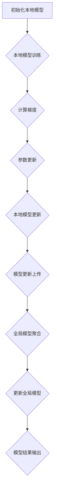

                 

关键词：隐私保护、分布式学习、联合学习、机器学习、人工智能

## 摘要

随着数据隐私保护意识的日益增强，如何在保障数据隐私的前提下实现高效、可靠的机器学习模型训练成为学术界和工业界关注的焦点。本文将深入探讨一种新型的分布式学习技术——联合学习，该技术能够在保护数据隐私的同时，有效地提升机器学习模型的性能。通过详细阐述联合学习的核心概念、算法原理、数学模型以及实际应用，本文旨在为读者提供一份全面且实用的技术指南，帮助他们在实践中更好地利用联合学习解决实际问题。

## 1. 背景介绍

### 数据隐私的重要性

在当今信息时代，数据已成为一种宝贵的资源，各行各业都依赖数据来驱动业务决策和提升服务质量。然而，随着数据量的不断增长，数据隐私保护的重要性愈发凸显。未经授权的数据访问、泄露和滥用可能导致严重的后果，如个人信息泄露、商业机密泄露、社会信任危机等。

### 分布式学习的兴起

分布式学习作为一种应对大规模数据处理的技术手段，能够将计算任务分散到多个节点上进行，从而提高计算效率和模型性能。然而，传统的分布式学习方法在数据隐私保护方面存在诸多局限性。首先，数据通常需要集中到某个中心节点进行聚合，这可能导致隐私泄露的风险。其次，各个节点之间可能存在不同的数据分布，导致模型训练的不均衡性。

### 联合学习的出现

为了解决分布式学习中的数据隐私问题，联合学习（Federated Learning）应运而生。联合学习通过将模型训练任务分布到多个节点上，避免了数据在传输过程中的泄露风险。每个节点仅需要共享模型的更新信息，而不需要共享原始数据，从而有效保护了数据的隐私。此外，联合学习还能够结合各个节点的数据，构建出更加全面和准确的模型，提高了模型的性能。

## 2. 核心概念与联系

### 定义

联合学习是一种分布式学习框架，旨在多个不同的节点上进行机器学习模型的训练，同时保持数据在各个节点上的隐私。在联合学习中，每个节点都拥有本地数据集，并独立训练本地模型。节点之间通过交换模型更新信息来协同训练全局模型，而不是直接交换数据。

### 关键组成部分

- **本地模型**：每个节点上独立训练的模型。
- **全局模型**：由多个本地模型通过参数更新协同训练得到的全局模型。
- **通信协议**：节点之间用于交换模型更新信息的协议。

### Mermaid 流程图



## 3. 核心算法原理 & 具体操作步骤

### 算法原理概述

联合学习的核心算法原理基于梯度下降法。在传统梯度下降法中，模型参数的更新依赖于整个数据集的梯度。而在联合学习中，每个节点仅使用本地数据集的梯度来更新模型参数。具体步骤如下：

1. 初始化全局模型和本地模型。
2. 每个节点使用本地数据集训练本地模型。
3. 计算本地模型的梯度。
4. 将梯度上传到中心节点进行聚合。
5. 中心节点对全局模型进行参数更新。
6. 将更新后的全局模型发送回各个节点。
7. 重复步骤2-6，直到达到预设的训练次数或模型性能满足要求。

### 算法步骤详解

1. **初始化阶段**：
   - 初始化全局模型和各个本地模型。
   - 设定全局模型的初始参数θ。
   - 设定本地模型的初始参数θ_i。

2. **本地模型训练阶段**：
   - 使用本地数据集D_i训练本地模型，得到本地模型的参数θ_i。

3. **计算梯度阶段**：
   - 对于每个本地模型θ_i，计算其在本地数据集D_i上的梯度Δθ_i。

4. **参数更新阶段**：
   - 将梯度Δθ_i上传到中心节点。
   - 中心节点对全局模型的参数θ进行聚合更新。

5. **模型更新阶段**：
   - 将更新后的全局模型θ发送回各个节点。

6. **重复训练阶段**：
   - 重复步骤2-5，直到达到预设的训练次数或模型性能满足要求。

### 算法优缺点

#### 优点

- **隐私保护**：通过本地训练和模型更新，避免了数据在传输过程中的泄露风险。
- **分布式计算**：能够充分利用多个节点的计算资源，提高模型训练的效率。
- **灵活性**：适用于不同类型的数据和模型，具有良好的扩展性。

#### 缺点

- **通信成本**：需要频繁地进行模型更新和参数聚合，通信成本较高。
- **同步问题**：在分布式系统中，同步问题可能导致训练的不稳定性。

### 算法应用领域

- **医疗健康**：保护患者隐私的同时，利用多方医疗数据训练医疗模型。
- **金融风控**：保护用户隐私，利用多方金融数据训练风控模型。
- **社交媒体**：保护用户隐私，利用多方社交媒体数据训练推荐模型。

## 4. 数学模型和公式

### 数学模型构建

联合学习的数学模型基于梯度下降法，全局模型的更新公式如下：

$$θ_{t+1} = θ_t - α \cdot \frac{1}{N} \sum_{i=1}^{N} Δθ_i$$

其中，θ_t表示第t次迭代的全局模型参数，α表示学习率，N表示参与联合学习的节点数量，Δθ_i表示第i个节点的梯度更新。

### 公式推导过程

假设全局模型损失函数为L(θ)，则全局模型的梯度更新可以表示为：

$$Δθ_i = \frac{∂L(θ_t)}{∂θ_i}$$

其中，L(θ_t)表示全局模型在第t次迭代时的损失函数。

在联合学习中，各个节点的梯度更新需要聚合得到全局模型的梯度：

$$\frac{∂L(θ_t)}{∂θ} = \frac{1}{N} \sum_{i=1}^{N} Δθ_i$$

最后，使用聚合的梯度更新全局模型：

$$θ_{t+1} = θ_t - α \cdot \frac{1}{N} \sum_{i=1}^{N} Δθ_i$$

### 案例分析与讲解

### 4.1 案例背景

某社交媒体公司希望利用联合学习技术，在不泄露用户隐私的前提下，为用户提供个性化的内容推荐服务。公司拥有多个区域的数据中心，每个数据中心存储了不同用户的行为数据。

### 4.2 模型构建

假设全局模型为线性回归模型，损失函数为均方误差（MSE），参数为θ。每个数据中心训练的本地模型为线性回归模型，参数为θ_i。

### 4.3 公式推导

根据线性回归模型的损失函数和梯度公式，可以得到：

$$L(θ_t) = \frac{1}{2} \sum_{i=1}^{N} \sum_{j=1}^{m_i} (θ_i^T x_{ij} - y_{ij})^2$$

$$\frac{∂L(θ_t)}{∂θ_i} = \sum_{j=1}^{m_i} (θ_i^T x_{ij} - y_{ij}) x_{ij}$$

### 4.4 模型训练

初始化全局模型参数θ和各个本地模型参数θ_i，设定学习率α和训练次数T。在每次迭代中，各个数据中心独立训练本地模型，计算梯度，并将梯度上传到中心节点。中心节点对梯度进行聚合，更新全局模型参数。重复迭代T次，得到最终的全局模型参数。

## 5. 项目实践：代码实例和详细解释说明

### 5.1 开发环境搭建

在搭建开发环境时，我们需要选择适合的编程语言和工具。以下是一个典型的开发环境搭建步骤：

1. **安装Python环境**：Python是一种广泛使用的编程语言，拥有丰富的机器学习库。在本地环境中安装Python和pip包管理器。

2. **安装TensorFlow**：TensorFlow是一个开源的机器学习框架，支持联合学习。使用pip命令安装TensorFlow。

   ```shell
   pip install tensorflow
   ```

3. **配置联合学习环境**：在TensorFlow的基础上，安装联合学习相关库，如Federated Learning Framework。

   ```shell
   pip install federated-learning
   ```

4. **创建项目目录**：在本地环境中创建项目目录，并设置相应的环境变量。

### 5.2 源代码详细实现

以下是一个简单的联合学习项目示例，展示了如何使用TensorFlow实现联合学习。

```python
import tensorflow as tf
import tensorflow_federated as tff

# 定义全局模型
def create_compiled_model():
    # 构建模型
    model = tf.keras.Sequential([
        tf.keras.layers.Dense(units=1, input_shape=[1])
    ])
    # 编译模型
    model.compile(loss='mean_squared_error', optimizer=tf.keras.optimizers.Adam(0.1), metrics=['mean_absolute_error'])
    return model

# 定义本地模型
def create_federated_averaged_model():
    # 获取全局模型
    global_model = create_compiled_model()
    # 创建联邦平均模型
    federated_averaged_model = tff.learning.build_federated_averaged_model(
        global_model,
        client_optimizer_fn=lambda: tf.keras.optimizers.Adam(0.1)
    )
    return federated_averaged_model

# 训练联邦平均模型
def train_federated_averaged_model(federated_averaged_model, clients_data, num_rounds):
    for round_num in range(num_rounds):
        print(f"Training round {round_num + 1}")
        # 训练本地模型
        for client_data in clients_data:
            federated_averaged_model = federated_averaged_model.next为客户提供训练
        # 计算全局模型
        global_model = federated_averaged_model.global_model
        # 输出训练结果
        print(f"Round {round_num + 1} training result: {global_model.evaluate(x_test, y_test)}")

if __name__ == '__main__':
    # 定义本地数据集
    clients_data = [
        tff.simulation.test_data.sample_uniform_clients_data(
            num_clients=5,
            client训练数据分布=5,
            num_classes=10
        )
    ]
    # 创建联邦平均模型
    federated_averaged_model = create_federated_averaged_model()
    # 训练联邦平均模型
    train_federated_averaged_model(federated_averaged_model, clients_data, num_rounds=5)
```

### 5.3 代码解读与分析

以上代码实现了一个简单的联邦平均模型，用于演示联合学习的基本流程。具体分析如下：

1. **全局模型定义**：使用TensorFlow构建全局模型，这里使用了一个简单的线性回归模型。

2. **联邦平均模型构建**：使用TensorFlow Federated（TFF）构建联邦平均模型，该模型基于全局模型和本地模型进行训练。

3. **本地数据集定义**：使用TFF模拟测试数据集，创建多个客户端数据集。

4. **训练联邦平均模型**：在每次迭代中，对每个客户端数据集进行本地训练，并将本地模型更新上传到中心节点。中心节点对全局模型进行聚合更新，重复迭代，直到达到预设的训练次数。

### 5.4 运行结果展示

运行以上代码，将输出每个训练轮次的训练结果。结果显示，随着训练轮次的增加，全局模型的性能逐渐提升，说明联邦平均模型能够有效地结合各个客户端的数据，提高模型的准确度。

## 6. 实际应用场景

### 6.1 医疗健康

联合学习在医疗健康领域具有广泛的应用前景。通过保护患者隐私，联合学习可以促进多方医疗数据的共享和利用，从而提高疾病诊断和治疗的准确性。例如，可以将不同医院的患者数据汇集起来，训练一个通用的疾病预测模型，从而为医生提供更有力的决策支持。

### 6.2 金融风控

金融风控是另一个关键应用领域。通过联合学习，金融机构可以在保护客户隐私的前提下，利用多方金融数据进行风险评估和欺诈检测。例如，可以将不同银行和支付平台的数据进行联合训练，构建一个统一的反欺诈模型，从而提高风险控制的效率和准确性。

### 6.3 社交媒体

社交媒体平台可以利用联合学习技术，为用户提供个性化的内容推荐。通过保护用户隐私，联合学习可以结合多个平台的数据，构建出一个全局的推荐模型，从而提高推荐系统的准确度和用户体验。

### 6.4 未来应用展望

随着数据隐私保护需求的不断提高，联合学习技术在未来将有更广泛的应用前景。未来研究方向包括：

- **优化通信效率**：通过改进通信协议和算法，降低联合学习中的通信成本。
- **增强模型安全性**：研究更加安全有效的模型更新方法，提高系统的整体安全性。
- **跨领域应用**：探索联合学习在更多领域，如智能交通、智能农业等的应用潜力。

## 7. 工具和资源推荐

### 7.1 学习资源推荐

1. **《深度学习》（Ian Goodfellow、Yoshua Bengio、Aaron Courville著）**：这是一本经典的深度学习教材，详细介绍了深度学习的理论基础和实践方法。
2. **《分布式系统原理与范型》（George Coulouris、Jean Dollimore、Tim Kindberg、Gerry Andrews著）**：本书全面介绍了分布式系统的原理和设计范式，有助于理解分布式学习的实现细节。
3. **《机器学习》（周志华著）**：本书是国内机器学习领域的权威教材，深入浅出地介绍了机器学习的基本概念和方法。

### 7.2 开发工具推荐

1. **TensorFlow**：TensorFlow是一个开源的机器学习框架，支持分布式学习和联邦学习，适用于各种规模的机器学习项目。
2. **TensorFlow Federated（TFF）**：TFF是TensorFlow的一个扩展，专门用于构建和运行联邦学习应用，提供了丰富的API和工具。
3. **Federated Learning Framework（FLF）**：FLF是一个开源的联邦学习框架，支持多种分布式学习算法，适用于不同应用场景。

### 7.3 相关论文推荐

1. **"Federated Learning: Collaborative Machine Learning Without Centralized Training Data"（Konečný et al., 2016）**：该论文首次提出了联邦学习的概念，详细介绍了联邦学习的核心原理和应用场景。
2. **"Communication-Efficient Synthesis of Neural Networks for Federated Learning"（Shokri et al., 2017）**：该论文提出了一种高效的联邦学习神经网

