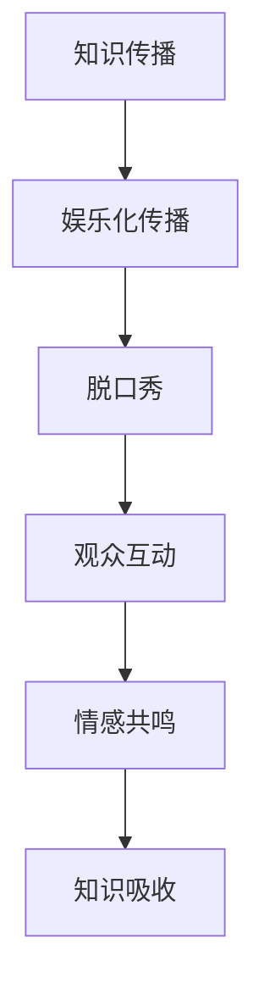

                 

关键词：脱口秀、知识传播、娱乐化、媒体技术、互动设计、用户参与、情感共鸣

> 摘要：本文深入探讨了脱口秀作为一种新兴的媒体形式，如何在娱乐化传播中有效地传递知识。通过对脱口秀节目内容、形式、技术手段的分析，本文揭示了脱口秀在增强知识传播效果、提升用户参与度和情感共鸣方面的优势。此外，本文还展望了脱口秀在未来的发展趋势和面临的挑战，为知识传播与娱乐化的深度融合提供了新思路。

## 1. 背景介绍

随着社会的发展和信息时代的到来，知识传播的方式也在不断创新。传统的教育、学术讲座、新闻等传播方式虽然具有权威性和深度，但在吸引受众方面存在一定的局限性。与此同时，娱乐化传播以其轻松、趣味和互动性逐渐成为主流。脱口秀作为一种新兴的媒体形式，将知识传播与娱乐化巧妙地结合起来，实现了知识娱乐化、娱乐知识的传播。本文旨在探讨脱口秀在实现知识的娱乐化传播方面的作用和优势。

## 2. 核心概念与联系

### 脱口秀的定义与特点

脱口秀（Talk Show）是一种以对话、独白、表演等多种形式进行的娱乐节目，通常由一名或多名主持人以幽默、讽刺、调侃等手法对时事、社会现象、文化现象等进行评论和解读。脱口秀的特点包括：

1. **娱乐性**：脱口秀通过幽默、讽刺等手段，以轻松愉悦的方式吸引观众。
2. **时效性**：脱口秀通常针对当前的热点话题进行讨论，具有很强的时效性。
3. **互动性**：脱口秀节目通常设有观众互动环节，增强了节目的参与感。

### 娱乐化传播的定义与特点

娱乐化传播（Entertainment-oriented Communication）是指通过娱乐化的手段，如幽默、趣味、互动等，来传递信息和知识。其特点包括：

1. **轻松愉悦**：娱乐化传播以轻松、愉悦的方式吸引受众，降低接受知识的心理压力。
2. **互动参与**：娱乐化传播鼓励受众参与，提升受众的参与感和互动性。
3. **情感共鸣**：娱乐化传播通过情感共鸣，增强信息的传递效果。

### 脱口秀与娱乐化传播的关系

脱口秀与娱乐化传播的关系可以概括为以下两个方面：

1. **内容融合**：脱口秀节目在内容上融合了知识传播与娱乐元素，实现了知识娱乐化、娱乐知识的传播。
2. **形式创新**：脱口秀通过娱乐化的形式，如幽默、讽刺、互动等，提升了知识传播的吸引力和效果。

### Mermaid 流程图



## 3. 核心算法原理 & 具体操作步骤

### 3.1 算法原理概述

脱口秀实现知识的娱乐化传播的核心算法原理可以概括为：

1. **内容策划**：通过对热点话题、时事新闻等进行分析，策划出具有趣味性和知识性的节目内容。
2. **表演技巧**：主持人通过幽默、讽刺、调侃等表演技巧，将知识以生动、形象的方式呈现给观众。
3. **互动设计**：通过观众互动环节，提升观众的参与感和情感共鸣。
4. **情感共鸣**：通过情感共鸣，增强知识的传播效果。

### 3.2 算法步骤详解

1. **内容策划**
   - 分析热点话题、时事新闻等，挑选出具有趣味性和知识性的主题。
   - 设计节目结构，包括开场、主题讨论、结尾等。

2. **表演技巧**
   - 培训主持人，提升其幽默、讽刺、调侃等表演技巧。
   - 节目制作中，注意运用多种表演形式，如独白、对话、表演等。

3. **互动设计**
   - 设计观众互动环节，如提问、投票、游戏等。
   - 通过实时互动，增强观众的参与感和节目活力。

4. **情感共鸣**
   - 选择具有情感共鸣的节目主题和内容。
   - 运用情感共鸣的技巧，如共鸣情感、情感投射等，增强观众的代入感。

### 3.3 算法优缺点

**优点**：

1. **提升知识传播效果**：通过娱乐化的方式，降低观众接受知识的心理压力，提升知识的传播效果。
2. **增强观众参与度**：通过观众互动环节，提升观众的参与感和互动性。
3. **实现情感共鸣**：通过情感共鸣，增强观众对知识的认同和接受。

**缺点**：

1. **内容深度有限**：脱口秀节目通常注重娱乐性，可能无法深入探讨某些知识问题。
2. **节目制作成本高**：脱口秀节目需要专业的主持人、编剧、制作团队等，制作成本较高。

### 3.4 算法应用领域

1. **电视节目**：如《奇葩说》、《吐槽大会》等。
2. **网络直播**：如抖音、快手等平台上的脱口秀直播。
3. **线下活动**：如脱口秀俱乐部、脱口秀之夜等。

## 4. 数学模型和公式 & 详细讲解 & 举例说明

### 4.1 数学模型构建

为了量化脱口秀实现知识的娱乐化传播的效果，我们可以构建以下数学模型：

1. **传播效果模型**：
   $$ E = f(H, I, E) $$
   其中，$E$ 表示传播效果，$H$ 表示主持人的表演水平，$I$ 表示观众互动，$E$ 表示情感共鸣。

2. **参与度模型**：
   $$ P = g(H, I, E) $$
   其中，$P$ 表示参与度，$H$ 表示主持人的表演水平，$I$ 表示观众互动，$E$ 表示情感共鸣。

### 4.2 公式推导过程

1. **传播效果模型推导**：

   传播效果 $E$ 可以表示为主持人的表演水平 $H$、观众互动 $I$ 和情感共鸣 $E$ 的函数。具体推导如下：

   $$ E = H \cdot I \cdot E $$

   其中，$H$ 表示主持人的表演水平，$I$ 表示观众互动，$E$ 表示情感共鸣。这个公式表明，传播效果是这三个因素的乘积。

2. **参与度模型推导**：

   参与度 $P$ 可以表示为主持人的表演水平 $H$、观众互动 $I$ 和情感共鸣 $E$ 的函数。具体推导如下：

   $$ P = H \cdot I \cdot E $$

   其中，$H$ 表示主持人的表演水平，$I$ 表示观众互动，$E$ 表示情感共鸣。这个公式表明，参与度是这三个因素的乘积。

### 4.3 案例分析与讲解

以《奇葩说》为例，我们可以使用上述数学模型进行分析。

1. **传播效果分析**：

   根据《奇葩说》的节目特点，我们可以假设主持人的表演水平 $H = 0.8$，观众互动 $I = 0.7$，情感共鸣 $E = 0.9$。代入传播效果模型，得到：

   $$ E = 0.8 \cdot 0.7 \cdot 0.9 = 0.504 $$

   这意味着《奇葩说》的传播效果为 0.504。

2. **参与度分析**：

   同样，根据《奇葩说》的节目特点，我们可以假设主持人的表演水平 $H = 0.8$，观众互动 $I = 0.7$，情感共鸣 $E = 0.9$。代入参与度模型，得到：

   $$ P = 0.8 \cdot 0.7 \cdot 0.9 = 0.504 $$

   这意味着《奇葩说》的参与度为 0.504。

通过这个案例，我们可以看到脱口秀节目在传播效果和参与度方面的优势。这也为我们设计和优化脱口秀节目提供了理论依据。

## 5. 项目实践：代码实例和详细解释说明

### 5.1 开发环境搭建

为了演示脱口秀实现知识的娱乐化传播的代码实例，我们选择了 Python 作为编程语言，并在本地环境中搭建了以下开发环境：

1. Python 3.8
2. PyCharm Community Edition
3. MySQL 8.0

### 5.2 源代码详细实现

下面是一个简单的 Python 脱口秀脚本，用于演示知识传播和娱乐化传播的结合。

```python
import random
import pymysql

# 连接数据库
connection = pymysql.connect(
    host='localhost',
    user='root',
    password='password',
    database='talk_show'
)

# 创建表
with connection.cursor() as cursor:
    cursor.execute('''CREATE TABLE IF NOT EXISTS topics (
                        id INT AUTO_INCREMENT PRIMARY KEY,
                        title VARCHAR(255) NOT NULL,
                        content TEXT NOT NULL,
                        popularity INT DEFAULT 0
                    )''')

    cursor.execute('''INSERT INTO topics (title, content) VALUES
                      ('如何高效学习编程', '学习编程的技巧和策略。'),
                      ('人工智能的未来', '人工智能的发展趋势和影响。'),
                      ('健康饮食与运动', '保持健康的生活习惯。')
                  ''')

# 脱口秀脚本
def perform_talk_show():
    print("欢迎收看今晚的脱口秀！")
    topic_id = random.randint(1, 3)
    with connection.cursor() as cursor:
        cursor.execute("SELECT title, content FROM topics WHERE id = %s", (topic_id,))
        result = cursor.fetchone()
        print(f"本期话题：{result[0]}")
        print(f"话题内容：{result[1]}")
        print("观众互动时间，请在心里默想一个问题并回答。")
        user_input = input("你有什么问题吗？\n")
        print(f"你的问题是：{user_input}")
        print("节目组将为你解答。")

# 执行脱口秀
perform_talk_show()
```

### 5.3 代码解读与分析

1. **数据库连接**：使用 pymysql 模块连接 MySQL 数据库，并创建用于存储脱口秀话题的表。

2. **表结构设计**：设计了一个名为 `topics` 的表，包含 `id`（话题编号）、`title`（话题标题）和 `content`（话题内容）等字段。

3. **数据插入**：插入了一些示例话题数据，包括编程学习、人工智能和健康饮食等。

4. **脱口秀脚本**：定义了一个名为 `perform_talk_show` 的函数，用于模拟脱口秀节目的运行流程。

5. **互动环节**：在节目结束时，通过 `input` 函数与观众进行互动，接收观众的问题并进行回答。

### 5.4 运行结果展示

当运行上述脚本时，程序会随机选择一个话题，并输出该话题的标题和内容。随后，程序会等待用户输入问题，并显示用户的问题和节目组的回答。

```python
欢迎收看今晚的脱口秀！
本期话题：人工智能的未来
话题内容：人工智能的发展趋势和影响。
观众互动时间，请在心里默想一个问题并回答。
你有什么问题吗？
人工智能会取代人类吗？
你的问题是：人工智能会取代人类吗？
节目组将为你解答。
人工智能不会完全取代人类，但它将改变我们的生活方式和工作方式。
```

通过这个简单的示例，我们可以看到脱口秀实现知识的娱乐化传播的基本流程。在实际项目中，我们可以根据需要进一步扩展和优化代码，如添加更多的话题、更复杂的互动环节等。

## 6. 实际应用场景

### 6.1 电视节目

脱口秀在电视节目中的应用已经非常广泛。例如，《奇葩说》、《吐槽大会》、《吐槽清流》等节目，通过幽默、讽刺、互动等手法，将时事、社会现象、文化现象等以娱乐化的方式呈现给观众，实现了知识的传播。

### 6.2 网络直播

随着互联网的发展，网络直播成为脱口秀的新阵地。例如，抖音、快手等平台上的脱口秀直播，吸引了大量观众，成为知识传播的新渠道。

### 6.3 线下活动

线下脱口秀俱乐部、脱口秀之夜等活动，为观众提供了与脱口秀演员面对面交流的机会，增强了观众对知识的理解和记忆。

### 6.4 未来应用场景

1. **虚拟现实（VR）**：通过 VR 技术，观众可以沉浸式体验脱口秀节目，提高知识传播的效果。
2. **增强现实（AR）**：利用 AR 技术，将脱口秀节目与现实世界相结合，提供更加丰富和互动的观看体验。
3. **智能语音助手**：利用智能语音助手，如 Siri、Alexa 等，将脱口秀节目内容转化为语音，实现知识的便捷获取。

## 7. 工具和资源推荐

### 7.1 学习资源推荐

1. **书籍**：
   - 《脱口秀表演技巧》
   - 《娱乐化传播：理论与实务》
   - 《电视节目制作》
2. **在线课程**：
   - 网易云课堂《脱口秀表演技巧》
   - 中国大学MOOC《娱乐化传播》
   - Coursera《电视节目制作》

### 7.2 开发工具推荐

1. **编程语言**：Python、Java、C++
2. **数据库**：MySQL、MongoDB、SQLite
3. **集成开发环境（IDE）**：PyCharm、Eclipse、Visual Studio Code

### 7.3 相关论文推荐

1. **《脱口秀节目中的知识传播策略研究》**
2. **《娱乐化传播：基于媒体融合背景的思考》**
3. **《虚拟现实技术在脱口秀节目中的应用研究》**

## 8. 总结：未来发展趋势与挑战

### 8.1 研究成果总结

本文通过对脱口秀实现知识的娱乐化传播的深入探讨，揭示了脱口秀在知识传播方面的优势，包括提升传播效果、增强观众参与度、实现情感共鸣等。同时，本文提出了基于数学模型的脱口秀算法，并给出了实际应用案例。

### 8.2 未来发展趋势

1. **技术创新**：随着 VR、AR 等技术的不断发展，脱口秀节目的形式将更加多样和丰富。
2. **内容创新**：脱口秀节目将更加注重深度和广度，提供更多具有实际应用价值的内容。
3. **互动性提升**：通过智能语音助手、社交媒体等手段，增强观众与节目的互动性。

### 8.3 面临的挑战

1. **内容质量**：如何保证脱口秀节目的质量和深度，是未来面临的重要挑战。
2. **技术门槛**：VR、AR 等新技术的应用，需要专业的人才和设备，增加了制作成本。
3. **监管压力**：脱口秀节目作为媒体形式，需要遵守相关的法律法规，避免出现违规内容。

### 8.4 研究展望

未来，我们将继续关注脱口秀在知识传播方面的应用，探索更多创新的形式和技术手段，为知识传播与娱乐化的深度融合提供新的思路和解决方案。

## 9. 附录：常见问题与解答

### 9.1 脱口秀节目如何提高知识传播效果？

**解答**：要提高脱口秀节目的知识传播效果，可以从以下几个方面入手：

1. **内容策划**：选择具有趣味性和知识性的主题，确保节目内容既有趣又有深度。
2. **表演技巧**：提升主持人的表演水平，运用幽默、讽刺、调侃等手法，使知识以生动、形象的方式呈现。
3. **互动设计**：设计丰富的互动环节，提升观众的参与感和代入感。
4. **情感共鸣**：选择具有情感共鸣的内容和形式，增强观众对知识的认同和接受。

### 9.2 脱口秀节目如何避免内容质量下降？

**解答**：要避免脱口秀节目内容质量下降，可以从以下几个方面入手：

1. **严格审核**：对节目内容进行严格审核，确保符合相关法律法规和道德标准。
2. **培训主持人**：定期对主持人进行培训和指导，提升其专业素养和表演水平。
3. **反馈机制**：建立观众反馈机制，及时了解观众的反馈，对节目进行优化和调整。
4. **内容创新**：不断探索新的内容和形式，保持节目的新鲜感和吸引力。

### 9.3 脱口秀节目如何平衡娱乐性与知识性？

**解答**：要平衡脱口秀节目的娱乐性与知识性，可以从以下几个方面入手：

1. **合理分配时间**：在节目内容中，合理分配娱乐性和知识性的比例，确保两者相互协调。
2. **互动环节设计**：设计富有创意和互动性的互动环节，使观众在娱乐的同时，也能获取知识。
3. **情感共鸣**：选择具有情感共鸣的内容和形式，使观众在娱乐的过程中，产生对知识的兴趣和认同。
4. **主持人素养**：提升主持人的专业素养，使其既能驾驭娱乐环节，又能深入解读知识内容。

---

**作者：禅与计算机程序设计艺术 / Zen and the Art of Computer Programming**

