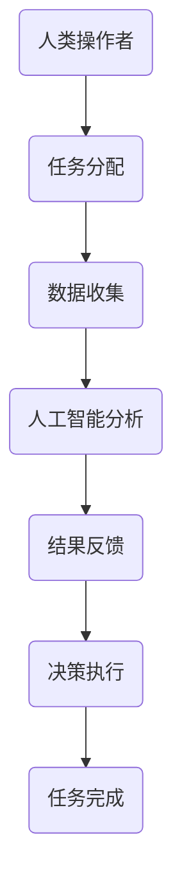

                 

关键词：自动化创业、人机协作、人工智能、流程优化、技术实现、应用场景、未来展望

> 摘要：随着人工智能技术的不断进步，人机协作在自动化创业领域中的应用愈发广泛。本文将探讨人机协作的核心概念、算法原理、数学模型以及实际应用，同时展望其未来的发展趋势与挑战。

## 1. 背景介绍

自动化创业是指利用先进的技术手段，如人工智能、大数据、物联网等，实现企业运营的自动化和智能化。在这种背景下，人机协作成为提高工作效率、降低成本、提升服务质量的重要手段。人机协作指的是人类与机器共同完成工作任务，各自发挥优势，达到协同工作的效果。

人机协作的发展历程可以追溯到20世纪50年代，随着计算机技术的崛起，人们开始尝试将计算机应用于生产和管理中。近年来，随着人工智能技术的突破，人机协作进入了新的阶段，人工智能开始帮助人类完成复杂的决策和任务，从而实现更高的生产效率和更优质的服务。

## 2. 核心概念与联系

### 2.1. 核心概念

- **人工智能**：模拟、延伸和扩展人的智能的科学，通过计算机系统实现智能行为。
- **流程优化**：通过分析现有流程，找到瓶颈和优化点，以提高效率和质量。
- **自动化**：通过预定的规则和程序，实现工作流程的自动化执行。

### 2.2. 人机协作架构

人机协作的架构通常包括以下几个部分：

1. **人类操作者**：负责制定决策、监督和干预。
2. **人工智能系统**：负责数据分析、模式识别、智能决策等。
3. **硬件设备**：如机器人、传感器等，负责执行物理任务。
4. **软件平台**：提供数据处理、流程管理、人机交互等功能。

### 2.3. Mermaid 流程图

下面是一个简单的人机协作流程的Mermaid流程图：



## 3. 核心算法原理 & 具体操作步骤

### 3.1. 算法原理概述

人机协作的核心算法主要包括以下几个方面：

1. **机器学习**：通过训练模型，使计算机具备自主学习和决策能力。
2. **自然语言处理**：使计算机能够理解和生成自然语言，实现人机对话。
3. **数据挖掘**：从大量数据中提取有价值的信息，支持决策制定。

### 3.2. 算法步骤详解

1. **任务分配**：根据人类操作者的目标和需求，将任务分配给人工智能系统。
2. **数据收集**：收集与任务相关的数据，包括结构化和非结构化数据。
3. **数据预处理**：清洗、归一化、特征提取等，为模型训练做准备。
4. **模型训练**：使用机器学习算法训练模型，使其能够对数据进行分类、预测等操作。
5. **智能决策**：根据模型输出，为人类操作者提供决策建议。
6. **任务执行**：根据决策，执行具体的操作，如控制机器人执行物理任务。
7. **结果反馈**：将执行结果反馈给人类操作者，进行监督和调整。

### 3.3. 算法优缺点

**优点**：
- 提高工作效率：人工智能可以高速处理大量数据，辅助人类完成繁琐的任务。
- 减少错误率：通过精确的算法模型，减少人为错误。
- 支持个性化服务：根据用户行为数据，提供个性化的推荐和服务。

**缺点**：
- 需要大量数据训练：算法的性能高度依赖于训练数据的质量和数量。
- 数据隐私和安全问题：涉及用户隐私数据的使用和保护。

### 3.4. 算法应用领域

人机协作算法广泛应用于以下几个领域：

- **智能制造**：通过机器人自动化生产，提高生产效率和产品质量。
- **智能客服**：通过自然语言处理技术，提供高效、精准的客服服务。
- **智能交通**：通过数据分析，优化交通流量，提高交通效率。
- **金融风控**：通过数据挖掘和模型预测，防范金融风险。

## 4. 数学模型和公式

### 4.1. 数学模型构建

在人机协作中，常见的数学模型包括线性回归、决策树、支持向量机等。以下以线性回归为例进行讲解。

假设我们有 $n$ 个样本点 $(x_i, y_i)$，其中 $x_i$ 是输入特征，$y_i$ 是输出标签。线性回归的目标是找到一个线性函数 $f(x) = w \cdot x + b$，使得预测值 $f(x_i)$ 最接近真实标签 $y_i$。

### 4.2. 公式推导过程

线性回归的损失函数为：

$$
L(w, b) = \frac{1}{2} \sum_{i=1}^{n} (y_i - f(x_i))^2
$$

对 $w$ 和 $b$ 分别求偏导数，并令其等于零，可以得到：

$$
\frac{\partial L}{\partial w} = x - x^T w
$$

$$
\frac{\partial L}{\partial b} = y - w \cdot x
$$

解上述方程组，可以得到最优的 $w$ 和 $b$。

### 4.3. 案例分析与讲解

假设我们有一个简单的房价预测问题，输入特征为房屋面积 $x$，输出标签为房价 $y$。我们使用线性回归模型来预测房价。

首先，收集并整理数据，包括房屋面积和对应的价格。然后，进行数据预处理，如归一化、缺失值填补等。接下来，使用机器学习库（如 Scikit-Learn）训练线性回归模型，并使用训练集进行评估。最后，使用测试集验证模型的性能。

## 5. 项目实践：代码实例和详细解释说明

### 5.1. 开发环境搭建

首先，需要安装 Python 和相关库，如 NumPy、Scikit-Learn、Matplotlib 等。可以使用以下命令进行安装：

```bash
pip install numpy scikit-learn matplotlib
```

### 5.2. 源代码详细实现

以下是一个简单的线性回归代码实例：

```python
import numpy as np
from sklearn.linear_model import LinearRegression
from sklearn.model_selection import train_test_split
import matplotlib.pyplot as plt

# 数据加载
data = np.loadtxt('house_prices.csv', delimiter=',')
X = data[:, 0]  # 房屋面积
y = data[:, 1]  # 房价

# 数据预处理
X = X.reshape(-1, 1)
y = y.reshape(-1, 1)

# 划分训练集和测试集
X_train, X_test, y_train, y_test = train_test_split(X, y, test_size=0.2, random_state=42)

# 模型训练
model = LinearRegression()
model.fit(X_train, y_train)

# 模型评估
score = model.score(X_test, y_test)
print(f'Model score: {score:.2f}')

# 结果可视化
plt.scatter(X_test, y_test, label='Actual')
plt.plot(X_test, model.predict(X_test), label='Predicted', color='red')
plt.xlabel('House Area')
plt.ylabel('Price')
plt.legend()
plt.show()
```

### 5.3. 代码解读与分析

- 数据加载：使用 NumPy 库读取 CSV 数据，并将其划分为输入特征和输出标签。
- 数据预处理：将输入特征进行归一化处理，以便更好地进行模型训练。
- 划分训练集和测试集：将数据集划分为训练集和测试集，以评估模型的性能。
- 模型训练：使用 Scikit-Learn 库中的 LinearRegression 类进行模型训练。
- 模型评估：计算模型的评分，以评估其性能。
- 结果可视化：使用 Matplotlib 库绘制散点图和预测线，以可视化模型的预测效果。

### 5.4. 运行结果展示

运行代码后，会生成一个散点图，其中红色线条表示模型的预测结果。通过对比实际房价和预测房价，可以直观地看到线性回归模型的效果。

## 6. 实际应用场景

### 6.1. 智能制造

在智能制造领域，人机协作可以帮助企业实现生产过程的自动化和智能化。例如，通过机器人自动化生产，提高生产效率和产品质量；通过人工智能分析生产线数据，优化生产流程和资源配置。

### 6.2. 智能客服

智能客服是另一个应用人机协作的重要领域。通过自然语言处理技术，智能客服系统可以自动解答用户问题，提供个性化服务。同时，通过分析用户行为数据，可以不断优化客服体验，提高客户满意度。

### 6.3. 智能交通

智能交通系统利用人工智能技术，对交通数据进行分析和处理，以优化交通流量和减少拥堵。例如，通过实时监控路况，预测交通拥堵情况，并给出最佳行驶路线。

### 6.4. 未来应用展望

随着人工智能技术的不断进步，人机协作在未来将会应用到更多领域，如智能医疗、智能家居、智能农业等。人机协作将成为自动化创业的核心驱动力，推动社会生产和生活的智能化。

## 7. 工具和资源推荐

### 7.1. 学习资源推荐

- 《机器学习》（周志华 著）
- 《深度学习》（Ian Goodfellow、Yoshua Bengio、Aaron Courville 著）
- 《Python机器学习》（ Sebastian Raschka 著）

### 7.2. 开发工具推荐

- Jupyter Notebook：方便的数据分析和建模工具。
- TensorFlow：用于深度学习的开源框架。
- Scikit-Learn：用于机器学习的开源库。

### 7.3. 相关论文推荐

- “Deep Learning for Natural Language Processing” （2018）
- “A Survey on Deep Learning for Time Series Classification” （2019）
- “An Overview of Transfer Learning in Deep Neural Networks” （2020）

## 8. 总结：未来发展趋势与挑战

### 8.1. 研究成果总结

人机协作在自动化创业领域取得了显著成果，应用范围不断扩大。人工智能技术不断进步，使得人机协作系统更加智能化和高效化。

### 8.2. 未来发展趋势

- 深度学习：随着深度学习技术的不断突破，人机协作系统将更加智能和自适应。
- 跨领域融合：人机协作将与其他领域（如医疗、金融、农业等）融合，推动各行业的智能化发展。
- 边缘计算：利用边缘计算技术，实现实时数据处理和智能决策，提高人机协作的响应速度和效率。

### 8.3. 面临的挑战

- 数据隐私和安全：随着数据规模的增大，数据隐私和安全问题将成为人机协作的重要挑战。
- 技术普及与教育：提高技术普及率和人才培养，是推动人机协作发展的关键。
- 道德与伦理：如何在人机协作中处理道德和伦理问题，需要引起广泛关注。

### 8.4. 研究展望

未来，人机协作将朝着更加智能化、自适应化和多样化的方向发展。随着技术的不断进步，人机协作将在更多领域发挥重要作用，推动社会生产和生活的智能化升级。

## 9. 附录：常见问题与解答

### 9.1. 如何保证人机协作系统的安全性？

- 严格的数据加密和访问控制：确保数据在传输和存储过程中的安全性。
- 定期安全审计和风险评估：及时发现和解决安全隐患。
- 法律法规和伦理指导：遵循相关法律法规和伦理标准，确保人机协作系统的合规性。

### 9.2. 人机协作系统如何处理大规模数据？

- 分布式计算：利用分布式计算技术，实现大规模数据的快速处理。
- 数据流处理：利用数据流处理技术，实现实时数据处理和分析。
- 数据预处理：在数据处理前，对数据进行清洗、归一化和特征提取，以提高数据处理效率。

## 参考文献

- 周志华. 《机器学习》. 清华大学出版社，2016.
- Ian Goodfellow、Yoshua Bengio、Aaron Courville. 《深度学习》. 人民邮电出版社，2016.
- Sebastian Raschka. 《Python机器学习》. 电子工业出版社，2016.

