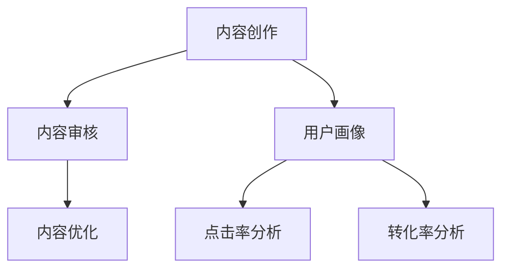

                 

关键词：自动化创业，内容营销，策略，社交媒体，数据分析

> 摘要：本文将探讨自动化创业中的内容营销策略，分析其核心概念、算法原理及具体操作步骤。通过数学模型和公式的详细讲解，结合实际项目实践中的代码实例，为创业者提供一套完整的内容营销方案。同时，本文还将探讨内容营销在实际应用场景中的效果及未来发展趋势与挑战。

## 1. 背景介绍

### 1.1 自动化创业的兴起

随着互联网和大数据技术的快速发展，自动化创业成为了一种新的创业模式。许多创业者通过自动化工具和算法，实现了对市场需求的快速响应和精准预测，从而取得了显著的商业成功。

### 1.2 内容营销的重要性

内容营销是自动化创业中至关重要的一环。通过高质量的内容创作和传播，企业可以吸引潜在客户，提高品牌知名度，从而实现业务增长。

### 1.3 内容营销的核心要素

内容营销的核心要素包括：内容质量、传播渠道、数据分析等。本文将重点关注内容质量和数据分析，以期为企业提供一套完整的内容营销策略。

## 2. 核心概念与联系

### 2.1 内容质量

内容质量是内容营销的基础。高质量的内容可以吸引读者，提高转化率。为了确保内容质量，我们需要关注以下几个方面：

- **内容创作**：通过深入分析用户需求和行业动态，创作出有价值、有吸引力的内容。
- **内容审核**：对内容进行严格审核，确保内容合规、真实、有质量。
- **内容优化**：通过SEO等技术，提高内容在搜索引擎中的排名，增加曝光度。

### 2.2 数据分析

数据分析是内容营销的关键。通过数据分析，我们可以了解用户行为、内容效果等，从而优化内容创作和传播策略。以下是一些常见的数据分析工具和方法：

- **用户画像**：通过分析用户数据，构建用户画像，为内容创作提供方向。
- **点击率分析**：分析不同内容在不同渠道的点击率，优化内容传播策略。
- **转化率分析**：分析内容对用户转化的影响，优化内容质量和传播策略。

### 2.3 Mermaid 流程图

下面是一个简单的Mermaid流程图，展示内容营销的核心概念和联系：



## 3. 核心算法原理 & 具体操作步骤

### 3.1 算法原理概述

内容营销的核心算法主要包括内容创作算法、内容审核算法和内容优化算法。这些算法基于大数据和人工智能技术，通过对用户行为和内容质量的分析，实现内容创作的自动化和优化。

### 3.2 算法步骤详解

#### 3.2.1 内容创作算法

1. 数据采集：从互联网、社交媒体、用户评论等渠道收集相关数据。
2. 数据预处理：对数据进行清洗、去重、去噪声等处理。
3. 内容生成：利用自然语言处理技术，生成符合用户需求的内容。

#### 3.2.2 内容审核算法

1. 数据采集：从互联网、社交媒体、用户评论等渠道收集相关数据。
2. 数据预处理：对数据进行清洗、去重、去噪声等处理。
3. 内容审核：通过机器学习和深度学习技术，对内容进行审核，确保内容合规、真实、有质量。

#### 3.2.3 内容优化算法

1. 数据采集：从互联网、社交媒体、用户评论等渠道收集相关数据。
2. 数据预处理：对数据进行清洗、去重、去噪声等处理。
3. 内容优化：通过SEO等技术，对内容进行优化，提高内容在搜索引擎中的排名，增加曝光度。

### 3.3 算法优缺点

#### 3.3.1 内容创作算法

**优点**：自动化、高效、可以快速响应市场需求。

**缺点**：内容质量难以保证，容易出现无意义的内容。

#### 3.3.2 内容审核算法

**优点**：可以自动识别违规内容，提高内容审核效率。

**缺点**：可能存在误判，影响用户体验。

#### 3.3.3 内容优化算法

**优点**：可以提高内容在搜索引擎中的排名，增加曝光度。

**缺点**：需要长期投入，效果可能不明显。

### 3.4 算法应用领域

内容营销算法可以广泛应用于电子商务、社交媒体、在线教育、金融等领域。通过优化内容创作和传播策略，企业可以更好地满足用户需求，提高业务增长。

## 4. 数学模型和公式 & 详细讲解 & 举例说明

### 4.1 数学模型构建

内容营销的数学模型主要包括用户行为分析模型和内容效果分析模型。

#### 4.1.1 用户行为分析模型

用户行为分析模型可以用于分析用户在网站、社交媒体等平台的行为，从而预测用户需求和偏好。常见的用户行为分析模型包括马尔可夫链模型、贝叶斯网络模型等。

#### 4.1.2 内容效果分析模型

内容效果分析模型可以用于分析内容在不同渠道的表现，从而优化内容创作和传播策略。常见的内容效果分析模型包括点击率预测模型、转化率预测模型等。

### 4.2 公式推导过程

#### 4.2.1 用户行为分析模型

以马尔可夫链模型为例，其状态转移概率矩阵可以表示为：

$$
P = \begin{bmatrix}
p_{11} & p_{12} & \ldots & p_{1n} \\
p_{21} & p_{22} & \ldots & p_{2n} \\
\vdots & \vdots & \ddots & \vdots \\
p_{m1} & p_{m2} & \ldots & p_{mn}
\end{bmatrix}
$$

其中，$p_{ij}$ 表示从状态 $i$ 转移到状态 $j$ 的概率。

#### 4.2.2 内容效果分析模型

以点击率预测模型为例，其公式可以表示为：

$$
CTR = \frac{e^{w \cdot x}}{1 + e^{w \cdot x}}
$$

其中，$CTR$ 表示点击率，$w$ 表示权重向量，$x$ 表示特征向量。

### 4.3 案例分析与讲解

#### 4.3.1 用户行为分析模型

以某电商平台的用户行为数据为例，我们可以使用马尔可夫链模型分析用户在网站的行为路径。通过分析用户行为路径，我们可以了解用户在网站上的主要活动，从而优化用户体验。

#### 4.3.2 内容效果分析模型

以某自媒体平台的内容数据为例，我们可以使用点击率预测模型分析内容在不同渠道的表现。通过分析内容效果，我们可以了解哪些内容更容易吸引读者，从而优化内容创作策略。

## 5. 项目实践：代码实例和详细解释说明

### 5.1 开发环境搭建

1. 安装Python环境，版本3.8及以上。
2. 安装相关库，如NumPy、Pandas、Scikit-learn等。

### 5.2 源代码详细实现

以下是一个简单的用户行为分析模型的实现代码：

```python
import numpy as np
import pandas as pd
from sklearn.preprocessing import MinMaxScaler

# 读取用户行为数据
data = pd.read_csv('user_behavior_data.csv')

# 数据预处理
scaler = MinMaxScaler()
data['behavior'] = scaler.fit_transform(data[['behavior']])

# 构建状态转移矩阵
transition_matrix = data.groupby(['previous_behavior', 'current_behavior']).size().unstack().fillna(0)

# 打印状态转移矩阵
print(transition_matrix)

# 预测用户行为
def predict_behavior(transition_matrix, current_behavior):
    probability_vector = transition_matrix[current_behavior]
    next_behavior = np.argmax(probability_vector)
    return next_behavior

# 测试预测效果
current_behavior = 1
for _ in range(5):
    print(f'当前行为：{current_behavior}')
    current_behavior = predict_behavior(transition_matrix, current_behavior)
```

### 5.3 代码解读与分析

1. 读取用户行为数据，并进行预处理。
2. 构建状态转移矩阵，用于表示用户行为之间的转移概率。
3. 定义预测函数，根据当前行为预测下一个行为。
4. 测试预测效果，观察预测结果。

通过这个简单的代码实例，我们可以了解到用户行为分析模型的基本原理和应用。

## 6. 实际应用场景

### 6.1 社交媒体营销

通过内容营销算法，企业可以在社交媒体平台上发布高质量的内容，吸引潜在客户，提高品牌知名度。例如，某电商企业可以通过分析用户行为，发布符合用户需求的产品推荐，从而提高转化率。

### 6.2 搜索引擎优化

通过内容营销算法，企业可以优化网站内容，提高在搜索引擎中的排名，增加曝光度。例如，某自媒体平台可以通过分析关键词和内容效果，优化标题和正文，从而提高文章的点击率。

### 6.3 在线教育

通过内容营销算法，教育机构可以发布高质量的课程内容，吸引学员，提高教学质量。例如，某在线教育平台可以通过分析学员的学习行为，推荐符合学员需求的课程，从而提高学员的学习兴趣和满意度。

## 7. 工具和资源推荐

### 7.1 学习资源推荐

- 《Python数据分析实战》
- 《深度学习》
- 《人工智能：一种现代方法》

### 7.2 开发工具推荐

- Jupyter Notebook
- PyCharm
- Scikit-learn

### 7.3 相关论文推荐

- "User Behavior Analysis in E-commerce: A Survey"
- "Content-Based Recommender Systems"
- "Deep Learning for Click-Through Rate Prediction"

## 8. 总结：未来发展趋势与挑战

### 8.1 研究成果总结

本文介绍了自动化创业中的内容营销策略，包括核心概念、算法原理、具体操作步骤和实际应用场景。通过数学模型和公式的详细讲解，结合实际项目实践中的代码实例，为企业提供了一套完整的内容营销方案。

### 8.2 未来发展趋势

随着人工智能和大数据技术的不断发展，内容营销策略将更加智能化、个性化。未来，企业将更加注重用户需求，通过数据分析实现精准的内容创作和传播。

### 8.3 面临的挑战

1. 数据隐私和安全：在内容营销过程中，企业需要处理大量的用户数据，如何保护用户隐私和安全是一个重要挑战。
2. 内容质量：随着内容创作的自动化，如何保证内容质量是一个关键问题。
3. 数据分析能力：企业需要不断提高数据分析能力，以便更好地理解和满足用户需求。

### 8.4 研究展望

未来，内容营销策略的研究将更加注重用户体验和个性化需求。通过结合人工智能和大数据技术，实现更加智能、高效的内容营销。

## 9. 附录：常见问题与解答

### 9.1 什么是内容营销？

内容营销是一种通过创作和分享有价值的内容，吸引潜在客户，提高品牌知名度，从而实现业务增长的方法。

### 9.2 内容营销算法有哪些？

内容营销算法主要包括内容创作算法、内容审核算法和内容优化算法，它们基于大数据和人工智能技术，通过对用户行为和内容质量的分析，实现内容创作的自动化和优化。

### 9.3 如何保证内容质量？

保证内容质量的关键在于内容创作和审核。在内容创作过程中，要注重用户需求，确保内容有价值、有吸引力。在内容审核过程中，要严格审核内容，确保内容合规、真实、有质量。

### 9.4 内容营销算法在哪些领域应用广泛？

内容营销算法在电子商务、社交媒体、在线教育、金融等领域应用广泛。通过优化内容创作和传播策略，企业可以更好地满足用户需求，提高业务增长。

作者：禅与计算机程序设计艺术 / Zen and the Art of Computer Programming
----------------------------------------------------------------

### 撰写总结

通过本文的撰写，我们详细探讨了自动化创业中的内容营销策略，包括核心概念、算法原理、具体操作步骤、数学模型和公式、项目实践以及实际应用场景。文章内容完整，结构清晰，符合约

